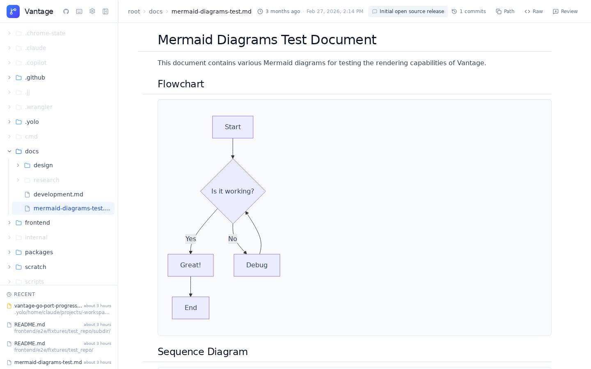

# Vantage 🔭

[](https://github.com/mschulkind-oss/vantage/actions/workflows/ci.yml)

**A beautiful local Markdown viewer with live reload and Git awareness.**

[Website](https://vantageapp.dev) · [GitHub](https://github.com/mschulkind-oss/vantage) · [Issues](https://github.com/mschulkind-oss/vantage/issues)



Vantage renders your Markdown files the way GitHub does — locally, instantly, with live reload as you edit. Point it at one directory or several, and browse your docs in a polished web UI with file tree navigation, Mermaid diagrams, commit history, and diffs.

Vantage ships as a single Go binary with an embedded React frontend — no runtime dependencies, no background services to babysit. Built for developers who write docs alongside code, and especially useful for reviewing LLM-generated Markdown output in real time.

> **Platform:** Linux and macOS are fully supported. Windows is not supported.

---

## Install

### go install

```bash
go install github.com/mschulkind-oss/vantage/cmd/vantage@latest
```

This installs a `vantage` binary to your `$GOBIN` (typically `~/go/bin`). Make sure it's on your `PATH`.

### Homebrew (recommended)

```bash
brew install mschulkind-oss/tap/vantage
```

### From source

```bash
git clone https://github.com/mschulkind-oss/vantage
cd vantage
mise install               # installs Go 1.26, Node 22, just
just build                 # produces ./vantage
```

The resulting `./vantage` binary embeds the compiled frontend, so it's fully self-contained.

---

## 🚀 Quick Start

### Single Directory

Point Vantage at any directory containing Markdown files — or a specific file:

```bash
vantage ~/Documents/notes          # open a directory
vantage ~/Documents/notes/intro.md # open a specific file
```

The server starts, your default browser opens to the file (or directory root), and the sidebar focuses on the parent directory of what you opened. Pass `--no-open` to suppress the browser launch.

### Multiple Directories (Daemon Mode)

To serve several directories at once, create a config and run the daemon:

```bash
# Generate a config file
vantage init-config

# Edit it
$EDITOR ~/.config/vantage/config.toml

# Start the daemon
vantage daemon
```

---

## ✨ Features

- **GitHub-Style Rendering** — Full GitHub Flavored Markdown with syntax highlighting, tables, task lists, and footnotes
- **Math & Diagrams** — KaTeX math rendering and inline Mermaid diagrams from fenced code blocks
- **Live Reload** — Files update instantly in the browser via WebSocket when modified on disk
- **Git Integration** — View commit history, diffs, working-tree changes, file status, and recent changes for any file
- **Review Mode** — Inline comments, snapshots, and agent changelog reactions for collaborative review
- **Multi-Repo Mode** — Serve multiple directories from a single daemon, each accessible by name
- **Source Directory Auto-Discovery** — Point at parent directories to automatically find and add all git repos
- **File Tree Navigation** — Lazy-loaded sidebar with directory expansion
- **Frontmatter Support** — Displays YAML and TOML frontmatter as a clean metadata table
- **Static Site Export** — Build a standalone static site from a directory of Markdown
- **Dark Mode** — Toggle with Shift+D, persisted across sessions
- **Keyboard Shortcuts** — Quick file picker with `t`, fuzzy search, keyboard navigation
- **Performance Diagnostics** — Built-in `perf-report` command for anonymized timing data
- **systemd Service** (Linux) — Run as a background service that starts on login

---

## ⚙️ Configuration

The config file lives at `~/.config/vantage/config.toml`. Generate one with:

```bash
vantage init-config
```

### Example Config

```toml
# Server settings
host = "127.0.0.1"
port = 8000

# Auto-discover git repos under these directories
source_dirs = ["~/code", "~/projects"]

# Or list repos explicitly (both methods can be combined)
[[repos]]
name = "notes"
path = "~/Documents/notes"

[[repos]]
name = "work-docs"
path = "~/work/documentation"
```

Each repo is accessible at `http://localhost:8000/{name}/`.

### Configuration Reference

| Key                          | Type             | Default            | Description                                      |
| ---------------------------- | ---------------- | ------------------ | ------------------------------------------------ |
| `host`                       | string           | `"127.0.0.1"`      | Server bind address                              |
| `port`                       | integer          | `8000`             | Server port                                      |
| `source_dirs`                | array of strings | `[]`               | Parent directories to scan for git repos         |
| `repos[].name`               | string           | _required_         | Display name and URL slug for the directory      |
| `repos[].path`               | string           | _required_         | Path to directory (supports `~`)                 |
| `repos[].allowed_read_roots` | array of strings | `[]`               | Additional directories this repo may read        |
| `exclude_dirs`               | array of strings | _(see below)_      | Directories to hide from file listings            |
| `show_hidden`                | boolean          | `true`             | Show dotfiles in sidebar                          |
| `walk_max_depth`             | integer or null  | `null` (unlimited) | Max directory depth for untracked file discovery  |
| `walk_timeout`               | float            | `30.0`             | Timeout (seconds) for git ls-files subprocess     |
| `use_ignore_files`           | boolean          | `true`             | Honor `.gitignore` and ignore files during walks  |
| `log_level`                  | string           | `"info"`           | Logging verbosity                                 |

### Excluded Directories

By default, Vantage hides common build and dependency directories from the sidebar, file picker, and recent files — for example `node_modules`, `dist`, `build`, `.cache`, `.git`, `.hg`, and `.svn`.

Override this in your config:

```toml
exclude_dirs = ["node_modules", "vendor", "dist"]
```

---

## 🔧 Service Management (Linux)

On Linux, Vantage can run as a systemd user service that starts automatically on login. On macOS, run `vantage` directly or wrap it in a `launchd` agent yourself.

### Install the Service

```bash
vantage install-service
```

### Enable and Start

```bash
systemctl --user daemon-reload
systemctl --user enable vantage
systemctl --user start vantage
```

### Common Commands

```bash
# Check status
systemctl --user status vantage

# View logs
journalctl --user -u vantage -f

# Restart after config changes
systemctl --user restart vantage

# Stop the service
systemctl --user stop vantage
```

### Keep Running After Logout

By default, user services stop when you log out. To keep Vantage running:

```bash
loginctl enable-linger $USER
```

---

## 🖥️ CLI Reference

The command is `vantage`.

```
vantage [PATH]                      # Serve a dir or file, auto-open browser
vantage serve [PATH] [flags]        # Same as above, with explicit flags
vantage daemon [-c config.toml]     # Serve multiple directories from config
vantage init-config                 # Generate example config file
vantage install-service             # Install systemd user service (Linux only)
vantage build PATH -o OUTPUT        # Build a static site
vantage perf-report [--url]         # Performance diagnostics from a running instance
```

### `serve` flags

| Flag                  | Description                                          |
| --------------------- | ---------------------------------------------------- |
| `--host`              | Bind address (default `127.0.0.1`)                   |
| `--port`              | Server port (default `8000`)                         |
| `--no-open`           | Don't open the browser on start                      |
| `--show-hidden`       | Show dotfiles in the sidebar                         |
| `--exclude-dirs`      | Directories to hide from file listings               |
| `--use-ignore-files`  | Honor `.gitignore` and ignore files during walks     |
| `--walk-max-depth`    | Max directory depth for untracked file discovery     |
| `--walk-timeout`      | Timeout (seconds) for git ls-files subprocess        |

---

## 🔌 API

Vantage exposes a REST API for programmatic access under `/api`.

### Single-Repo Endpoints

| Endpoint                                    | Description                          |
| ------------------------------------------- | ------------------------------------ |
| `GET /api/tree?path=.`                      | File tree listing                    |
| `GET /api/content?path=file.md`             | File content                         |
| `GET /api/files`                            | List all Markdown files              |
| `GET /api/files/all`                        | List all files                       |
| `GET /api/recent/all`                       | Recently accessed files              |
| `GET /api/info`                             | Repository metadata                  |
| `GET /api/git/history?path=file.md`         | Commit history                       |
| `GET /api/git/diff?path=file.md&commit=SHA` | Diff for a commit                    |
| `GET /api/git/diff/working?path=file.md`    | Uncommitted changes diff             |
| `GET /api/git/status?path=file.md`          | File status (modified, committed)    |
| `GET /api/git/recent?limit=20`              | Recently changed files               |
| `GET /api/review`                           | Read review comments and snapshots   |
| `PUT /api/review`                           | Create or update review data         |
| `DELETE /api/review`                        | Remove review data                   |

### Multi-Repo Endpoints

In daemon mode, endpoints are prefixed with `/api/r/{repo}/`:

| Endpoint                                 | Description                   |
| ---------------------------------------- | ----------------------------- |
| `GET /api/repos`                         | List configured repositories  |
| `GET /api/r/{repo}/tree?path=.`          | File tree for a repo          |
| `GET /api/r/{repo}/content?path=file.md` | File content for a repo       |
| _(all single-repo endpoints above)_      | Prefixed with `/api/r/{repo}` |

### Utility Endpoints

| Endpoint                    | Description                             |
| --------------------------- | --------------------------------------- |
| `GET /api/health`           | Health check                            |
| `GET /api/version`          | Server version info                     |
| `GET /api/perf/diagnostics` | Performance diagnostics (anonymized)    |
| `POST /api/perf/reset`      | Reset performance counters              |
| `WS /ws`                    | WebSocket for live reload notifications |

---

## 🛠️ Development

Run the quality gate with `just check` (gofmt, go vet, staticcheck, go test, plus frontend lint, tsc, and vitest). See [docs/development.md](docs/development.md) for more on building, testing, and contributing to Vantage.

---

## 📄 License

Apache 2.0 — see [LICENSE](LICENSE).
