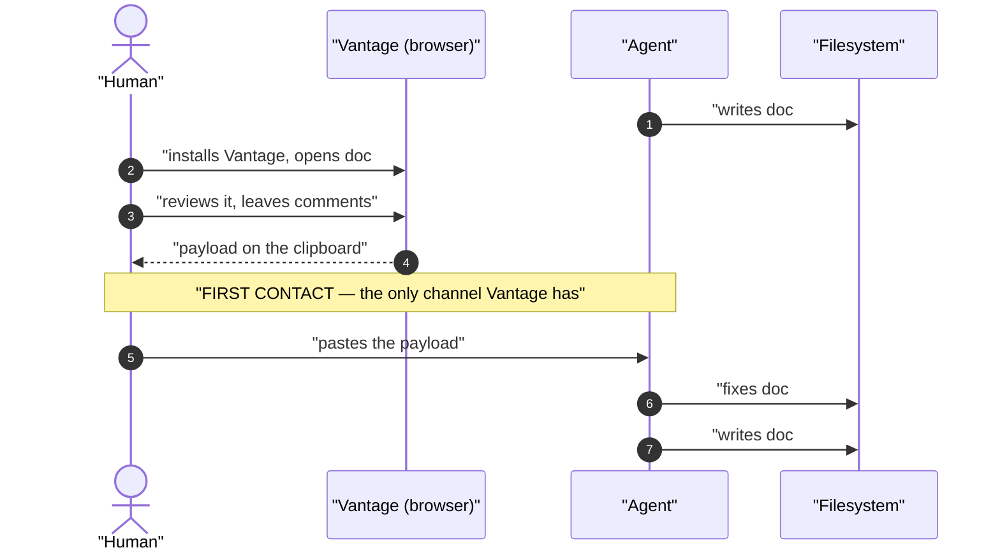

# The first thing we ever say to an agent, and how to make it stick

**Status:** DESIGN SKETCH, 2026-08-31, amended 2026-09-01 with §3.1 and **P6**,
then again the same day: §5.1's packaging facts were wrong, and the packaging
question they raised now has its own doc,
[`pypi-distribution.md`](pypi-distribution.md), which this design **depends
on**. Nothing built. Extends
[`agent-cli.md`](agent-cli.md), which is DECIDED and whose **P1**–**P3** hold
unchanged here. Every claim about existing code was verified against the tree on
2026-08-31.

**The short version.** [`agent-cli.md`](agent-cli.md) §6 put the pointer to
`vantage-check` in the review-comment payload and recorded one limitation: a
document drafted before any review round gets no pointer. That framing
undersells the channel. Vantage is a browser app and the agent is a process on a
filesystem; nothing connects them but a human's clipboard, so the first payload
a human copies is not a *late* touch, it is **first contact** — and it lands
ahead of every document after the one under review. What it says should
therefore do two jobs, not one: a **fixative** instruction that repairs the
document in hand (which exists today) and a **proactive** one that puts the
conventions where the *next* document will see them (which does not). The
proactive half is a new **subcommand of the existing `vantage-check` binary** —
not a second PyPI distribution, and not a second entrypoint.

**The most important sections are [§2](#2-the-payload-is-first-contact-not-a-late-reminder)**,
which is the reframing everything else follows from, **and
[§5](#5-packaging-one-binary-one-distribution-more-subcommands)**, which answers
the packaging question and turns out to depend on a detail of how the wheel is
built.

**Reads with:** [`pypi-distribution.md`](pypi-distribution.md) (**the
dependency** — the checker is not installable until that lands, and it owns the
distribution question this doc used to carry),
[`agent-cli.md`](agent-cli.md) (the CLI this extends, and the
principles it fixed), [`review-state-architecture.md`](review-state-architecture.md)
(why the payload exists at all), and the user-facing
[`../../userguide/vantage-check.md`](../../userguide/guides/vantage-check.md) and
[`../../userguide/style-guide.md`](../../userguide/reference/style-guide.md) (what agents
and humans are told today).

---

## 1. Verdict up front

Keep the payload as the only channel. Make it carry two instructions instead of
one, and build the second one as a subcommand of the binary we already ship.

Two principles join [`agent-cli.md`](agent-cli.md)'s **P1**–**P3**, numbered to
continue that doc's sequence so either can cite either:

- **P4. The payload is a bootstrap, not a reminder.** Vantage cannot call the
  agent (**P1**), so it never speaks first — a human does, by pasting. That
  first paste is the entire budget for everything we might ever want an agent to
  know. Size it as *"what we say if we only get to say it once,"* not as
  *"a note attached to this review."*
- **P5. Persist pointers, never copies.** Anything we help an agent write into
  its own configuration must **fetch** the style guide, not embed it.
  [`agent-cli.md`](agent-cli.md) §2 recorded an out-of-tree copy of the guide
  that exists precisely because there was no way to fetch it; a generator that
  emitted the guide's text would be a copy *factory*, with our name on the
  drift.
- **P6. The payload is idempotent, not a handshake.** It says the same thing
  every turn, and never asks the document — or the agent — whether we have
  spoken before. The state that would answer lives in a context window Vantage
  cannot see and that dies without notice, so every stamp we could read answers
  a weaker question than the one we asked (§3.1).

## 2. The payload is first contact, not a late reminder

Here is the sequence that actually happens when someone adopts Vantage:

Step 5 is the first moment any Vantage-authored text reaches the agent. Before
it there is no channel at all — not a late one, not a weak one, *none*. So the
honest reading of [`agent-cli.md`](agent-cli.md) §6's limitation is not "the
pointer arrives too late." It is:

- **Document #1 is unreachable by anything.** No mechanism we could build
  reaches an agent that has never been handed a byte from Vantage. That is a
  permanent property of **P1**, not a gap to close (see [§6](#6-non-goals)).
- **Every document after #1 is reachable** — *if* first contact is spent well.

Today first contact is spent entirely on document #1. The payload's one pointer
([`useReviewStore.ts:947`](../../frontend/src/stores/useReviewStore.ts#L947))
says: run `uvx vantage-check <this file>` and fix what it reports. That is a
good instruction about the document already written, and it says nothing about
the next one. The knowledge arrives, gets used once, and evaporates with the
context window.

> [!NOTE]
> This is not an argument for a *second* channel. It is an argument that the
> channel we have is more valuable than we treated it as — **P4**. The
> conclusion is a better payload, not more places to write.

## 3. Fixative and proactive

Two instructions, two scopes. The distinction is worth naming because it decides
what each one is allowed to cost.

| | **Fixative** | **Proactive** |
| :--- | :--- | :--- |
| Acts on | The document in hand | Every document the agent writes next |
| Exists today | Yes — [`useReviewStore.ts:947`](../../frontend/src/stores/useReviewStore.ts#L947) | No |
| Command | `uvx vantage-check <file>` | A generator subcommand ([§5](#5-packaging-one-binary-one-distribution-more-subcommands)) |
| Lifetime | This turn | Until the agent's configuration changes |
| Needs | Nothing but the binary | Somewhere the agent will read later |
| Fails when | `uvx` is missing — degrade to delivering anyway | No writable config, or the agent has no persistence |
| Payload cost | Already paid (one paragraph) | Must justify itself in one sentence ([§7](#7-risks)) |

The asymmetry that matters: the fixative instruction needs no state anywhere,
which is why it was safe to ship as an unconditional line. The proactive one
necessarily *persists something*, and persistence is where
[`agent-cli.md`](agent-cli.md) §7's hard line lives — Vantage writes nothing to
anyone's `AGENTS.md`, `CLAUDE.md`, or `.gitignore` on their behalf.

That line is narrower than it first reads, and the userguide already phrases it
precisely: *"Nothing writes to your `AGENTS.md`, `CLAUDE.md` or `.gitignore`
**on your behalf**"*
([`../../userguide/vantage-check.md`](../../userguide/guides/vantage-check.md)). A
generator someone explicitly invokes is not acting on their behalf — it is them
acting. What stays forbidden is the implicit write and the setup precondition.

The unsettled part is who "someone" is when the invoker is an agent following
our payload. That is [OQ-B2](#open-questions), and it is the real decision in
this document.

### 3.1 Why the payload never asks whether the agent already knows

Now that a document can carry Vantage-only markup
([`../reference/inline-markup.md`](../reference/inline-markup.md)), there is an
obvious economy available: send the proactive half only when it is *new*. Have a
bootstrapped agent stamp something — a `vantage:` schema version, a token — and
have the payload builder omit the block when it sees the stamp. I priced it, and
it is a trap for a reason that has nothing to do with the token's size.

**The state we would be probing for is unobservable in principle.** The question
is whether the context window about to read this paste already holds the
conventions. That state lives in a process on the far side of **P1**, and
[§2](#2-the-payload-is-first-contact-not-a-late-reminder) already says what
becomes of it: the knowledge "evaporates with the context window" — silently,
and without touching the filesystem. So every signal we could actually read
answers a different, weaker question:

| Signal | The question it really answers | Footprint |
| :--- | :--- | :--- |
| A schema version or token in the document | "Did an informed writer touch this file, once?" | New markup in the artifact, forever |
| The repo's own `AGENTS.md` already names the checker | "Is this repository set up?" — the closest true proxy, and it needs no markup at all | None |
| A prior agent delivery in review state (`CommentReaction.Actor`, [`models.go:185`](../../internal/model/models.go#L185)) | "Has an agent ever read *a* payload here?" | None — already recorded on disk |

None of them answers *now*, and they share their failure in the expensive
direction. A **false negative** — stamp present, reader cold — suppresses the
bootstrap for a fresh session, a different agent, or a human pasting into a
different tool, which is exactly the population bootstrapping exists for. It
fails silently, and it fails permanently, because nothing ever un-stamps a
document.

The cost side is worse than the saving is good, and this project has already
paid it once. A version or token in the document makes the document a **message
channel with memory** — something a reader consumes, dedupes, and remembers
having seen. That is precisely the protocol
[`../reference/inline-markup.md`](../reference/inline-markup.md) retired: a
directive is *"declarative and idempotent … nothing consumes it,"* unlike the
retired `<!-- changelog -->` protocol, which *"had to dedupe and remember what
it had already seen."* Its **D3** then forbids the narrower form by name — *"no
version negotiation, no minimum-version key"* — and by **D1** a frontmatter
stamp is the one thing in that family GitHub does not hide: it prints
`vantage` as a table row.

Which makes the two footprints the reverse of how they feel. A repeated
instruction costs prompt tokens no human ever reads (**R2** — real, and bounded
at one sentence). A stamp costs bytes in the artifact that every human reads —
in the diff, in `git blame`, on GitHub — in order to save those tokens.

**Ruling: no version, no token, no conditionality — P6.** What idempotence buys
is not elegance but debuggability: an unconditional payload is a pure function
of the document, so the builder is readable and every agent demonstrably saw the
same text. A conditional one has variants, and *"why didn't it get the line?"*
becomes unanswerable after the fact, because the state that decided it is
already gone.

> [!NOTE]
> **There is one legitimate version here, and this is not it.** If the generator
> ([§5](#5-packaging-one-binary-one-distribution-more-subcommands)) ever emits an
> artifact a later run must recognise — a stale `AGENTS.md` stanza to replace —
> that version belongs *in the generated artifact*, inside the user's own
> configuration, and is read by the generator. Never in the reviewed document,
> and never read by the payload. **P5** makes even that close to moot: a
> two-line pointer has nothing to go stale.

## 4. What "proactive" persists

Two artifact shapes, one invariant.

| Shape | Reach | Trigger surface |
| :--- | :--- | :--- |
| An `AGENTS.md` stanza | The portable convention; read by most agents, and plain text besides | Always in context |
| A `SKILL.md` (frontmatter `name` + `description`, body below) | Agents that do progressive disclosure — the description sits in context cheaply, the body loads on demand | The `description` string, so it must name *Markdown documents viewed in Vantage* or it never fires |

These are complements, not competitors: the first is the lowest common
denominator and the second is richer where supported. One command can emit
either, and the user places whichever their agent reads.

**The invariant is P5: the body is a pointer, roughly two lines.** Before
writing, run `vantage-check style-guide`; before delivering, run
`vantage-check <file>`. Not the guide's ~85 lines.

Thin wins on the property that actually matters here. An embedded copy is
correct on the day it is generated and silently wrong after the next edit to
[`styleGuide.ts`](../../packages/vantage-md/src/styleGuide.ts), with nothing to
notice the drift — which is exactly the failure
[`agent-cli.md`](agent-cli.md) §2 documented in the wild. A pointer is correct
forever and needs no regeneration. It costs one command invocation at writing
time, and it inherits the fixative line's existing fallback: if the command is
not available, carry on.

> [!WARNING]
> **Do not "improve" the generated artifact by inlining the style guide to save
> the agent a command.** That trade buys one tool call and sells the single
> source of truth that
> [`../../userguide/style-guide.md`](../../userguide/reference/style-guide.md) exists to
> promise. The out-of-tree copy this project already has is the evidence, not a
> hypothetical — re-verified 2026-08-31 as still referenced nowhere in this
> tree.

## 5. Packaging: one binary, one distribution, more subcommands

The question raised was whether this needs another PyPI package, or whether it
should be another entrypoint on a shared `vantage` distribution. Neither. It is
a subcommand. Three facts settle it, and the second one is specific to how this
repo builds its wheel.

### 5.1 Where the packaging actually stands

Verified against the tree 2026-08-31; the PyPI facts re-checked against
pypi.org on 2026-09-01, which is where the original of this section was wrong.
[`pypi-distribution.md`](pypi-distribution.md) now owns this ground in full —
what follows is only what this design depends on.

- **No `vantage-check` release exists.** `git tag` lists only the app's `v*`
  tags (`v0.0.1` … `v0.5.3`); no `vantage-check@*` tag has ever been pushed.
- **`vantage-check` is not on PyPI** — `pypi.org/pypi/vantage-check/json`
  returns 404. Publishing it needs the project to exist there with a trusted
  publisher naming this repo's
  [`publish.yml`](../../.github/workflows/publish.yml), which is an owner action
  outside this repo; the exact fields are in
  [`pypi-distribution.md`](pypi-distribution.md) §9.
- **A `vantage-md` PyPI project does exist, and it is the *server's* half of the
  name.** npm `vantage-md` carries the library, PyPI `vantage-md` carries the
  executable server: one product name, one registry each, by design. What is
  wrong is the *contents*, not the naming — PyPI froze at `0.4.2` on 2026-04-23
  holding the retired FastAPI app, because `e4e3120` deleted the Python
  packaging in the Go cutover and nothing replaced the wheel job.

> [!WARNING]
> **`uvx vantage-md` today installs a program that is not in this tree** — a
> viewer four months behind `v0.5.3`, with a backend that was deleted. That is
> **R7**, and its fix, its yank, and its `go-to-wheel` shape all live in
> [`pypi-distribution.md`](pypi-distribution.md). Do not re-derive them here.

What no distribution shape changes is that **the payload already tells every
agent to run `uvx vantage-check`, and that promise resolves to nothing today.**
That is [R1](#7-risks), it is live right now, and it is independent of everything
else in this doc. *How* it resolves is
[`pypi-distribution.md`](pypi-distribution.md) `OQ-P2`; that it must resolve is
not open.

### 5.2 How `uvx` actually selects what to run

There is no `--entry` flag; the mechanics are:

| Form | What it does |
| :--- | :--- |
| `uvx vantage-check` | Installs distribution `vantage-check`, runs the executable of the same name |
| `uvx vantage-check style-guide` | Same executable, with `style-guide` as **argv** — a subcommand |
| `uvx --from <dist> <exe>` | Installs one distribution, runs a **differently named executable** from it |
| `uvx <dist>@<version>` | Pins the version |

Row 2 is the one already in production: `style-guide` is not an entrypoint, it
is a branch in `parseArgs`
([`cli.ts:44`](../../packages/vantage-check/src/cli.ts#L44)). Row 3 is the
"another entrypoint" option, and it is the one with a hidden price here.

### 5.3 Why a second entrypoint is expensive and a subcommand is free

The wheel builder carries **no console-script shim** — the compiled binary *is*
the installed script, dropped into `<pkg>-<ver>.data/scripts/`, which is what
lets `uvx` exec a real executable with no interpreter in the path
([`build-wheel.py`](../../scripts/build-wheel.py)). That
design choice is deliberate and stated in the same file: the builder is
*"deliberately zero-dependency — no setuptools, no hatchling, no build
backend,"* because adding a Python build toolchain to a TypeScript project would
cost more than writing the zip out by hand.

The consequence is the whole argument. A second entrypoint in that wheel means
either a **second copy of the binary** — `dist/vantage-check` measured
92,296,392 bytes on 2026-08-31, so roughly 92 MB duplicated per wheel across
five platforms — or introducing the console-script shim, which means Python code
and a build backend, undoing the choice above.

| Option | Cost |
| :--- | :--- |
| **Second distribution** (`vantage-init` on PyPI) | A second registration and trusted-publisher config, a second release matrix, five more ~92 MB wheels, and a version-skew surface between two binaries that must agree about one style guide |
| **Second entrypoint**, same wheel | ~92 MB duplicated per wheel, or a Python build backend the builder deliberately does not have |
| **Subcommand** | One branch in `parseArgs` ([`cli.ts:20-52`](../../packages/vantage-check/src/cli.ts#L20-L52)) and one file under `src/commands/`. Ships with a release that already ships |

Folding this into the Go `vantage` binary is rejected for the reasons already
recorded as **R3** in [`agent-cli.md`](agent-cli.md) — a second implementation
that drifts from the renderer invisibly — with the added point that the Go
binary has no PyPI presence to attach an entrypoint to in the first place.

**Ruling: a subcommand of `vantage-check`.** The prerequisite is not new
packaging work; it is finishing the packaging work the accepted design already
depends on, which is [§8](#8-what-i-would-build-in-order) step 2.

## 6. Non-goals

- **Not a second channel.** No auto-detection of `.claude/` or `AGENTS.md`, no
  write on `vantage serve` startup, no watcher that notices an agent. The
  payload stays the only channel — **P3**, unchanged.
- **Not solving document #1.** An agent that has never received a byte from
  Vantage is unreachable. Accepted permanently, not deferred.
- **Not a copy of the style guide anywhere.** **P5**.
- **Not a second binary, distribution, or entrypoint.** [§5](#5-packaging-one-binary-one-distribution-more-subcommands).
- **Not an unrequested write to anyone's repository.** What "requested" means
  when an agent is the invoker is [OQ-B2](#open-questions); that it must be
  requested is not open.
- **Not a handshake, a schema version, or any other conditionality.** The
  payload is the same text on every turn —
  **P6**, [§3.1](#31-why-the-payload-never-asks-whether-the-agent-already-knows).
- **Not a longer payload than it has to be.** Every line is prompt tokens on
  every review turn, forever.
- **Not a change to the inbox protocol.** The `reply` wrapper stays iceboxed
  where [`agent-cli.md`](agent-cli.md) §10 left it.

## 7. Risks

| Risk | Mitigation |
| :--- | :--- |
| **R1. The payload already promises a command that does not resolve** — `uvx vantage-check` has no PyPI project and no release (§5.1). An agent that tries it once and gets nothing does not try again | Register and tag before anything else here ([§8](#8-what-i-would-build-in-order) step 2). Until then the line's own "deliver anyway" clause keeps it from blocking work, but it is spending first contact on a dead command |
| **R2. Payload bloat** — tokens on every turn, and a long block gets skimmed rather than read | One sentence for the proactive line, measured against the fixative paragraph already there. [OQ-B5](#open-questions). Not by sending it conditionally: that trade is priced and rejected in [§3.1](#31-why-the-payload-never-asks-whether-the-agent-already-knows) |
| **R3. An agent writes to a repo nobody asked it to write to** — following our instructions, which makes it our doing | [OQ-B2](#open-questions). Default to printing, not writing |
| **R4. A persisted pointer outlives the tool's reach** — a skill that says "run `uvx …`" in a sandbox without `uvx` is a dead end on every future document, not just once | The generated text carries the same fallback the fixative line does: if it is not available, carry on |
| **R5. Name lock-in** — the distribution name is unclaimed today and permanent after first publish, while the tool is growing commands that are not checks | Settle it before step 2, not after. [OQ-B4](#open-questions) |
| **R6. Two-mode confusion** — an agent runs the generator instead of the check, or treats the check as setup | Distinct verbs, one sentence each, and the fixative line keeps its current position and wording |
| **R7. A dead distribution still answers to a name we use** — `uvx vantage-md` installs the retired Python app (§5.1). An agent guessing the name, or a human following an old README, gets working-but-abandoned software, which is worse than the 404 `vantage-check` gives | Owned by [`pypi-distribution.md`](pypi-distribution.md) (`OQ-P1` and §4.2 there). Not a blocker for anything in this doc |

**What this deletes.** The premise that a document's quality depends on a review
round having already happened to it. And the last remaining reason for an
out-of-tree copy of the style guide: not just *"there is no way to fetch it"*
(which `style-guide` already answered) but *"there is no way to make fetching it
happen automatically next time."*

## 8. What I would build, in order

1. **Point this repo's own `AGENTS.md` at the guide and the checker** — **done
   2026-09-01 in `879650b`.** Before it, every mention of `vantage-check` in
   that file was about building or testing the package, so in the repo that
   *owns* the tool an agent discovered the checker by having the pre-commit hook
   reject a commit. It now names `vantage-check <file>` and `vantage-check
   style-guide` and says to run them before writing. That bullet is the
   hand-written form of what step 3 generates, which makes it the dogfood — and
   the reason step 3's output must stay a pointer (**P5**) rather than a copy.
2. **Make `uvx vantage-check` resolve.** Clears **R1**, and it is the one step
   this design cannot do for itself: it is
   [`pypi-distribution.md`](pypi-distribution.md) step 4, gated by that doc's
   `OQ-P2` (own project or a seat in `vantage-md`) and by
   [OQ-B4](#open-questions) here if the answer is a new name, since publishing is
   what makes a name permanent. Nothing below is worth much while the command the
   payload names cannot be installed.
3. **The generator subcommand**, printing to stdout only. No writes, no flags
   beyond format selection.
4. **The payload's proactive line.** One sentence, after the fixative
   paragraph — a checker nobody knows to install stays uninstalled.
5. **`--write`**, only if [OQ-B2](#open-questions) rules for it.

## 9. Alternatives considered

- **Leave the payload fixative-only.** Rejected. It spends first contact on one
  document and lets the knowledge evaporate with the context window, which is
  the [§2](#2-the-payload-is-first-contact-not-a-late-reminder) diagnosis.
- **A second PyPI distribution for the proactive half.** Rejected — two
  registrations, two release matrices, ten more wheels, and a skew surface
  between binaries that share one style guide (§5.3).
- **A second entrypoint on one distribution.** Rejected. Free in a normal Python
  project; here it costs ~92 MB duplicated per wheel or the build backend
  `build-wheel.py` deliberately refuses (§5.3).
- **Hang it off the Go `vantage` binary.** Rejected on
  [`agent-cli.md`](agent-cli.md) **R3**, and it has no PyPI presence anyway.
- **Embed the style guide in the generated artifact.** Rejected on **P5**. This
  is the copy that already drifted once.
- **A schema version or handshake token the agent stamps into the document**, so
  the proactive half is sent only when it is new. Rejected in §3.1: it probes a
  state Vantage cannot observe, and it rebuilds the document-as-message-channel
  protocol the directive contract retired.
- **Have Vantage detect and write agent config directly** — scan for `.claude/`
  or `AGENTS.md` on server start. Rejected: [`agent-cli.md`](agent-cli.md) §7,
  and it needs Vantage running to help an agent, against the spirit of **P1**.
- **An MCP server.** Rejected in [`agent-cli.md`](agent-cli.md) §11 and nothing
  here changes it.

## Decision Ledger

| ID | Ruling / Decision | Date | Settled in |
| :--- | :--- | :--- | :--- |
| OQ-B6 | No schema version, token, or conditionality in the payload. Raised and settled the same day: the state it would probe is unobservable, and `inline-markup.md` **D3** already forbids version negotiation | 2026-09-01 | §3.1, **P6** |

## Open Questions

Settled questions move to the [Decision Ledger](#decision-ledger) above.

1. 💬 **OQ-B1: The generator's command surface.** `vantage-check init`?
   `install-guide`? A flag on the existing command
   (`style-guide --format skill`)? This decides what the payload sentence says,
   so it is upstream of step 4.

   _Leaning:_ `init`, printing to stdout, with `--format agents-md|skill`. It
   reads as setup rather than as another check, and it keeps `style-guide`
   meaning exactly one thing.

   **Answer:**

   > _(empty — fill in when decided)_

2. 💬 **OQ-B2: Does the proactive line ask the agent to write, or only to
   read?** "Run `vantage-check init >> AGENTS.md`" persists the pointer without
   the human ever opting in — we would be instructing an agent to modify a repo
   on the strength of a paragraph the human pasted for a different purpose.
   "Run `vantage-check style-guide` before your next document" persists nothing
   and relies on the agent's own memory. This is the closure question for
   [§3](#3-fixative-and-proactive) and gates step 5.

   _Leaning:_ read-only in the payload; `--write` exists but is a
   human-invoked convenience. A pasted review comment is thin consent for a
   config write, and **R3** is the kind of surprise that gets a tool uninstalled.

   **Answer:**

   > _(empty — fill in when decided)_

3. 💬 **OQ-B3: Which formats does the generator emit?** `AGENTS.md` stanza only,
   `SKILL.md` only, both, or a broader set as conventions multiply.

   _Leaning:_ both, and stop there. They cover the portable case and the
   progressive-disclosure case; a third is a maintenance surface with no
   distinct reach.

   **Answer:**

   > _(empty — fill in when decided)_

4. 💬 **OQ-B4: Register `vantage-check` on PyPI now, under that name?** The name
   is unclaimed (404 as of 2026-09-01) and the window closes at first publish
   (**R5**). The tool is already growing commands that are not checks, so the
   name is arguably slightly narrow — but it is the name the payload, the
   userguide, and the wheel builder all hardcode.

   _Leaning:_ register as-is. `check` is the load-bearing command; a marginally
   narrow name costs less than a rename across three surfaces plus a squatted
   PyPI project. The owner action is a repeat, not a first: §5.1 shows it was
   done once for `vantage-md`. Downstream of `OQ-P2` in
   [`pypi-distribution.md`](pypi-distribution.md), which decides whether a second
   name is needed at all.

   **Answer:**

   > _(empty — fill in when decided)_

5. 💬 🤷 **OQ-B5: How much payload budget does the proactive line get?** One
   sentence, or a short block with the install command spelled out per format?
   Pure judgement about a prompt you read more often than I do.

   _Leaning:_ one sentence. The fixative paragraph is already the longest
   non-protocol block in the payload, and **R2** compounds every turn.

   **Answer:**

   > _(empty — fill in when decided)_

6. 🔒 **OQ-B7: One PyPI distribution for both entry points, or two? — MOVED.**
   This is now `OQ-P2` in [`pypi-distribution.md`](pypi-distribution.md), which
   owns the packaging ground and can price it against the server's wheel path
   rather than in the abstract. The ID stays here because commits and §5.1 cite
   it; the deliberation, the options, and the leaning (its own project) live
   there.

   **Answer:**

   > _(see `OQ-P2` in [`pypi-distribution.md`](pypi-distribution.md))_
