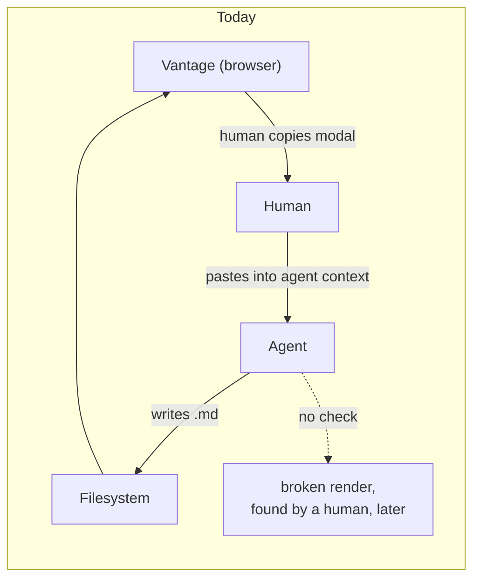

# An agent-facing CLI — closing the loop Vantage cannot close itself

**Status:** DECIDED, 2026-08-24. Reviewed twice and revised the same day; every
open question is settled — see the [Decision Ledger](#decision-ledger). Nothing
built. Every claim about existing code was verified against the tree on
2026-08-24.

**The short version.** Vantage knows two things the writing agent needs: how to
format a document, and whether a given document is actually correct. Today the
first reaches the agent only when a human copies it out of a browser modal, and
the second doesn't reach it at all, because nothing checks the result. I propose
a small CLI — compiled to a **standalone single-file binary**, distributed by
`uvx` and `curl` so it needs no runtime at all — with two commands:
`style-guide` (emit the canonical conventions) and `check` (verify a document
really renders, by **running the real validators** rather than reimplementing
them). The only rules we write ourselves are the ones nobody else can answer:
whether a link resolves against this repo on disk.

**The most important section is [§5](#5-check--delegate-everything-we-can)** —
the design turns on the CLI being an orchestrator of real validators, and on
[§5.2](#52-a-delegates-failure-is-not-automatically-a-finding), which is the
trap that makes orchestration harder than it looks.

**Reads with:** [`review-state-architecture.md`](review-state-architecture.md)
(why the inbox protocol looks the way it does), and the user-facing
[`../../userguide/review-inbox.md`](../../userguide/guides/review-inbox.md) (the
protocol as agents are told it today).

---

## 1. Verdict up front

Build it as a compiled binary, `uvx`-and-`curl`-distributed, with `style-guide`
and `check`.

Three principles do the load-bearing work:

- **P1. The filesystem is the only channel.** Vantage cannot call the agent and
  the agent cannot call Vantage. Anything the CLI does must work with **no
  server running**, no port, no socket. A command that needs a live Vantage is a
  command an agent cannot rely on.
- **P2. Delegate every check a real tool already performs — and classify its
  failures.** We do not reimplement Markdown, Mermaid, or KaTeX parsing; we run
  those projects' own parsers. But a delegate can fail because *our environment
  is wrong* rather than because *the document is wrong*, and reporting the first
  kind as a finding is the fastest way to destroy trust in the tool. See [§5.2](#52-a-delegates-failure-is-not-automatically-a-finding) —
  this is not hypothetical, it is measured.
- **P3. Discovery rides a channel we already control.** The agent's environment
  is not guaranteed to contain anything Vantage-related, and we are **not**
  editing anyone's `AGENTS.md` to fix that. The review-comment payload is copied
  on every review turn and is ours to write — that is where the pointer goes.

## 2. What exists today, precisely

Vantage already has an agent-facing story. It is entirely made of text a human
moves by hand.

**The style guide** lives as a TypeScript string constant,
`STYLE_GUIDE_SNIPPET`, at `frontend/src/components/StyleGuideModal.tsx:13-97`
(as of `3e7d8e4`; [§9](#9-what-i-would-build-in-order) step 1 has since moved it to
[`../../packages/vantage-md/src/styleGuide.ts`](../../packages/vantage-md/src/styleGuide.ts)
and renamed it `STYLE_GUIDE`) — roughly 85 lines covering structure, relative-link rules, frontmatter, Mermaid
label quoting, code and diff fences, callouts, tables, and the `$$...$$` math
rule. It is surfaced through a modal opened from the settings dropdown
([`SettingsDropdown.tsx:221`](../../frontend/src/components/SettingsDropdown.tsx#L221),
wired at
[`ViewerPage.tsx:821`](../../frontend/src/pages/ViewerPage.tsx#L821)) with a copy
button, and the modal tells you to paste it into your agent's context.

> [!WARNING]
> **The style guide is a shipped, undocumented feature.** As of 2026-08-24 there
> are zero mentions of it in `userguide/`, `README.md`, or `docs/`. Whatever else
> this design does, [§9](#9-what-i-would-build-in-order) step 6 should finally write it down.

There is also a copy of substantially this guidance living outside the repo, as
an agent skill file. It is referenced nowhere in this tree and is not this
repo's problem to maintain — but it is *evidence*: a copy got made because there
was no way to **fetch** the guide. A `style-guide` command removes the reason
such copies exist.

**Nothing verifies the output.** There is no linter, no checker. The CLI today is
`serve`, `daemon`, `init-config`, `build`, `install-service`, `perf-report`
([`main.go:24-30`](../../cmd/vantage/main.go#L24-L30)). A document with a
leading-slash link, an unparseable Mermaid diagram, or a `#L400` anchor on a
200-line file is written, delivered, and rendered broken — and the loop only
closes when a human clicks the link.

## 3. The gap



The write path is fine. The **verify path does not exist**, and the knowledge
path runs through a human's clipboard. A CLI closes both, because a CLI is the
one thing an agent can invoke that lives in the same filesystem world Vantage
does.

## 4. Distribution: one compiled artifact, no runtime

Two questions get conflated here, and separating them settles the argument.

**What is it written in?** TypeScript, and this is not really a choice. The
value of `check` is that it answers *"will this render in Vantage"* rather than
*"is this idiomatic Markdown"*, and answering the first means running the actual
pipeline — [`renderMarkdown.ts`](../../packages/vantage-md/src/renderMarkdown.ts)
(131 lines),
[`resolveLinks.ts`](../../packages/vantage-md/src/resolveLinks.ts) (92 lines),
[`frontmatter.ts`](../../packages/vantage-md/src/frontmatter.ts) (94 lines) —
plus the same `mermaid` and `katex` the viewer loads. A Go reimplementation
would be a second implementation of link resolution that drifts from the viewer
*invisibly*: it would pass documents the viewer breaks on.

**How does an agent get it?** Compiled to a **single-file binary**, so the answer
is "it downloads one file and runs it." No Node, no npm, no `npx`, no runtime of
any kind on the target machine.

| Channel | Reach |
| :--- | :--- |
| `uvx` / PyPI wheel carrying the binary | Python-first agent sandboxes, which are common |
| `curl` from GitHub releases | Anything with a shell |
| Distro/`brew` packaging, later | Humans who want it on `PATH` |

Going halfway — shipping an `npx` entrypoint *and* a binary — would mean
maintaining two dependency stories and two failure modes for one tool, and the
`npx` one is strictly the weaker: slower cold, useless without Node, and it puts
a lint-time dependency tree into a package whose library half should never carry
it. Dropping npm entirely also dissolves that packaging question rather than
answering it: **`vantage-md` on npm stays a pure library**, and the CLI is a
sibling workspace package that imports its source and is never published to npm
at all.

**The build cost is one-time setup, then per-release CI.** A cross-compile
matrix (linux x64/arm64, darwin x64/arm64 — Windows was dropped on 2026-09-01,
see [`pypi-distribution.md`](pypi-distribution.md) [§4.4](pypi-distribution.md#44-which-platforms-the-server-wheel-covers)) wired once into the
existing release workflow; no per-user cost, and nothing an agent ever waits on.
The toolchain is already Node 22 (`mise.toml`), so Node's SEA is available;
`bun build --compile` is the other candidate and is not currently installed
here. Either is an implementation detail, not a design commitment.

> [!NOTE]
> **There is no name collision.** The Go binary is built as `-o vantage`
> ([`Justfile:22`](../../Justfile#L22)), so the executable on disk is `vantage`.
> The `Use: "vantage-md"` string at
> [`main.go:17`](../../cmd/vantage/main.go#L17) is a cosmetic mislabel — help
> output names a binary nobody installs. That is a separate one-line fix to an
> existing bug, not a rename, and not a blocker for anything here.

## 5. `check` — delegate everything we can

The command is `check`, not `lint`, because most of what it does is run other
people's validators and collate the results. We should be embarrassed to
hand-write a rule that a real parser already enforces.

```console
$ vantage-check docs/
$ vantage-check docs/design/api.md --format json
```

### 5.1 What we delegate

| Concern | Delegated to | Already a dependency? |
| :--- | :--- | :--- |
| Mermaid diagrams parse | `mermaid`'s own parser — with the caveat in [§5.2](#52-a-delegates-failure-is-not-automatically-a-finding) | Yes — `optionalDependencies` |
| Math expressions compile | `katex` in `throwOnError` mode | Yes — direct dependency |
| Markdown is well-formed | `remark` / `remark-gfm` (the viewer's own parser) | Yes — direct dependency |
| General Markdown hygiene | `remark-lint` presets, opt-in | New |
| Frontmatter is valid | `yaml` / `smol-toml` (the viewer's own parsers) | Yes — both direct deps |

Four of the five are dependencies `vantage-md` **already has**, because the
viewer needs them to render. That is the argument in one line: the validators
are sitting in the package already, and nobody is asking them whether the
document is correct before it ships. A Mermaid diagram that fails `check` then
fails for exactly the reason the viewer would fail on it, in Mermaid's own
words — not our approximation of them.

### 5.2 A delegate's failure is not automatically a finding

This is the part that makes delegation harder than it looks, and it is measured
rather than theorized. Running mermaid 11.12.2 headless under Node 22 on
2026-08-24:

- A **valid** flowchart — `flowchart TD` with a properly quoted
  `a["Client (React SPA)"]` — throws
  `TypeError: DOMPurify.addHook is not a function`.
- An **invalid** one — the same label unquoted — is correctly rejected with a
  real grammar error: `Parse error on line 2 … Expecting 'SQE'`.

So mermaid's grammar layer works fine without a DOM; its post-parse
sanitization step does not. A naive `try { mermaid.parse(src) } catch` would
report **every valid flowchart in the repo as broken** — precisely the
false-positive class that makes an agent stop running the tool.

> [!CAUTION]
> **Do not "fix" this by treating any `mermaid.parse` throw as a finding, and do
> not assume `@mermaid-js/parser` is the drop-in escape hatch.** That package is
> genuinely DOM-free, but as of 11.12.2 it covers only the newer Langium
> grammars — architecture, gitGraph, info, packet, pie, radar, treemap — and
> answers `Unknown diagram type: flowchart`. Flowchart and sequence are the
> diagram types this project actually uses, including the style guide's own
> example.

The rule this generalizes to, and the reason it is written into **P2**: every
delegated validator must have its failures **classified** into *the document is
wrong* (report it) versus *our environment is wrong* (never report it; fail the
run loudly instead, because a checker that cannot check must not report green).
For mermaid specifically that means matching on grammar errors and, if a DOM
shim proves necessary for full coverage, weighing it against binary size — a
question [§4](#4-distribution-one-compiled-artifact-no-runtime)'s compile decision makes real, since jsdom is not small.

### 5.3 What we write ourselves

Only the questions that need *this repo on disk* and Vantage's routing
semantics. No general-purpose tool can answer these, which is precisely why they
are ours:

| Rule | What it catches |
| :--- | :--- |
| `link/leading-slash` | A leading-slash target — breaks web routing and multi-repo scoping |
| `link/uri-scheme` | `file://` schemes, absolute filesystem paths, drive letters |
| `link/missing-target` | Relative link whose target does not exist on disk |
| `link/line-anchor-range` | `#L400` on a 200-line file, or an inverted range |
| `link/dead-section-anchor` | `#some-heading` matching no slug in the target document |

These are the highest-value rules in the set and the first to build. They are
also the ones that must have a **near-zero false-positive rate** — an agent that
sees one bogus error stops running the tool, and we get one chance at that. They
earn that rate by being filesystem-verified rather than heuristic.

> [!TIP]
> A crude grep for links while writing this document flagged
> `` `[Doc](/docs/guide.md)` `` inside inline code as a broken link. The real
> checker must walk the parsed AST, not the raw text — inline code, fenced
> blocks, and autolinks are not links. That one is on the record because it is
> the obvious way to get `link/*` wrong.
>
> And while writing [§5.2](#52-a-delegates-failure-is-not-automatically-a-finding)'s cross-reference I hand-derived its slug and got it
> wrong: an em dash inside a heading leaves **two** hyphens, not one
> (`5-check--delegate-…`). Section slugs are not reasonable to guess — the
> checker must run the same slugger the renderer runs. That is the entire case
> for `link/dead-section-anchor` in one mistake.

### 5.4 Configuration

A repo-level **`.vantage.toml` at the repository root**, shipping in v1 rather
than deferred. It carries rule severities, rule disablement, and exit-code
policy; flags override it; **absent config means working defaults**, so the
zero-setup one-command path stays intact. Discovery walks up from the target
file.

TOML matches what Vantage already speaks — the existing user-level config is
`<UserConfigDir>/vantage/config.toml`
([`config.go:485`](../../internal/config/config.go#L485)). It deliberately does
**not** live in `.vantage/`, which is transient state users are told to
gitignore; committed config inside a gitignored directory is a trap.

Exit codes: non-zero on errors, `--strict` to include warnings, and both
overridable in config.

### 5.5 `--fix`

Narrow if it exists at all: mechanical, unambiguous rewrites only (stripping a
leading slash, tagging a fence whose language is inferable). It never touches
prose, never inserts frontmatter, never rewrites a Mermaid diagram. A `--fix`
that mangles a document is unrecoverable trust damage, and an agent can fix
anything else itself once it has been told what is wrong.

## 6. How the agent finds out any of this exists

**P3** is the part that is easy to skip and fatal to skip. A CLI nobody knows
about is exactly as undiscoverable as a modal nobody knows about — and [§2](#2-what-exists-today-precisely)'s
finding is that we have already shipped one of those.

**We are not touching `AGENTS.md`.** Not writing to it, not requiring a stanza
in it, not making setup a precondition for the tool to be reachable.

Instead the pointer rides the **review-comment payload** — the block assembled
at
[`useReviewStore.ts:938-974`](../../frontend/src/stores/useReviewStore.ts#L938-L974)
and copied to the clipboard on every single review turn. It is a channel we
already own, already write, and that already reaches the agent verbatim. A short
note is enough:

> Before delivering, run `uvx vantage-check <file>` and fix what it reports.

Three properties make this the right hook. It requires **zero setup** from the
user. It is **self-refreshing** — the agent fetches current conventions rather
than reading a copy pasted six months ago. And it arrives **exactly when it is
useful**, at the moment the agent is about to hand work back.

The honest limitation: the payload only exists in the review flow, so a document
being drafted with no review round yet gets no pointer. That is acceptable —
the review loop is where quality feedback belongs — and the `style-guide`
command remains available for anyone who wants to wire it in earlier.

## 7. Non-goals — what this does **not** license

- **Not a bespoke rule engine.** Per **P2**, if a real validator can answer the
  question, we run it. Every hand-written rule must justify why no existing tool
  can check it.
- **Not a network protocol.** No daemon, no RPC, no port, no "is the server
  running" check. Per **P1**, every command works offline against a bare
  checkout. Hard boundary, not a v1 simplification.
- **Not an npm CLI.** `vantage-md` on npm stays a pure library; the CLI is never
  published there.
- **Not editing anyone's agent config.** No `AGENTS.md` writes, no `CLAUDE.md`
  writes, no `.gitignore` writes.
- **Not a writing assistant.** No prose restructuring, no generated frontmatter
  values, no editorial judgment.
- **Not review state, comments, or diffing.** Those need the server and belong
  to it.
- **Not a rewrite of the Go CLI.** The Go binary keeps its six subcommands and
  its job. This is additive.

## 8. Costs and risks

| Risk | Mitigation |
| :--- | :--- |
| **R1. Delegate environment failures reported as document defects** — measured, not hypothetical ([§5.2](#52-a-delegates-failure-is-not-automatically-a-finding)) | Classify every delegate's failures into document-wrong vs environment-wrong. Environment-wrong fails the run loudly; it never becomes a finding, and a checker that cannot check never reports green. |
| **R2. False positives erode trust** — one bogus error and the agent stops running it | Our own rules are filesystem-verified, not heuristic. Ship `link/*` first because it is checkable rather than inferable. R1 is the other half of this. |
| **R3. Two-implementation drift** if the Go binary also grows checks | Don't. Per **P2**, TypeScript owns it. If the Go binary ever needs to check, it shells out or does nothing. |
| **R4. Release-matrix maintenance** — five platform binaries per release | One-time CI wiring into a release pipeline that already exists; no per-user cost. Accepted deliberately over shipping two runtimes. |
| **R5. Binary size** if full Mermaid coverage needs a DOM shim | Weigh jsdom against dropping to grammar-error matching ([§5.2](#52-a-delegates-failure-is-not-automatically-a-finding)). Decide with a measurement, not a guess. |
| **R6. Version skew** — agent runs a newer binary against an older server | Checks describe the *format*, which is stable, not server behavior. |
| **R7. Scope gravity** — "the CLI could also…" is how this becomes a second product | [§7](#7-non-goals--what-this-does-not-license) is the defense. Every proposed command justifies itself against **P1**. |

**What it costs us.** A cross-compile release matrix, a published command
surface that becomes a compatibility promise, and the release discipline of a
tool agents invoke unattended.

**What it deletes.** The reason for out-of-tree copies of the style guide. The
"paste this into your agent and hope" step. And the class of broken-link bugs
that currently reach a human before they reach a check.

## 9. What I would build, in order

1. **Move the style guide into the package** as the single source; rewire
   `StyleGuideModal` to import it. No CLI yet — pure de-duplication, stands
   alone.
2. **The CLI skeleton and compile pipeline**, with `style-guide` as its only
   command. Proves the cross-compile and the release matrix on a command whose
   logic cannot fail.
3. **`check`, our own `link/*` rules only** ([§5.3](#53-what-we-write-ourselves)). The minimum viable useful
   checker and the highest-value slice.
4. **Payload pointer** ([§6](#6-how-the-agent-finds-out-any-of-this-exists)), so the thing is actually reachable. Immediately
   after step 3 — a checker nobody runs scores zero.
5. **Delegated validators** ([§5.1](#51-what-we-delegate)), each landing with its failure classification
   ([§5.2](#52-a-delegates-failure-is-not-automatically-a-finding)) — KaTeX and frontmatter first because they are clean, Mermaid last
   because it is not. Config ([§5.4](#54-configuration)) lands here, since severities are what it
   configures.
6. **Document all of it** in `userguide/` — including, finally, the style guide
   feature that has been shipping undocumented.

`--fix` ([§5.5](#55---fix)) comes after all of it, if at all.

## 10. Icebox

**`reply` — a wrapper over the inbox protocol.** The idea: one command
(`--path`, `--id`, `--round`, `--summary`) generating the nonce and performing
the write-to-scratch-then-`mv` dance, replacing the heredoc in the payload.

The case for it is real but small: the payload spends roughly fifteen lines
defusing a race — write directly to the `.jsonl` name and the watcher fires on
the empty file, consumes it, and deletes it while your write lands in an
unlinked file — and a CLI makes that race structurally unreachable. Those are
prompt tokens on every review turn.

The case against is that **the protocol works well today**, and the heredoc's
virtue is needing nothing but a shell. Trading that for a hard dependency on the
binary being present, in the one flow that currently has no dependencies, would
be a downgrade. Not built for now; revisit if the race ever actually bites
someone.

## 11. Alternatives considered

- **Do nothing; keep copy-paste.** Rejected. It leaves the verify path missing
  entirely, which is the actual gap.
- **Ship an `npx` entrypoint, with or without a binary.** Rejected. Useless
  without Node, slower cold, and it drags a lint-time dependency tree into a
  library package. Shipping it *alongside* a binary is worse than either alone:
  two dependency stories and two failure modes for one tool.
- **Put the checker in the Go binary.** Rejected on **P2** and [§4](#4-distribution-one-compiled-artifact-no-runtime): guaranteed
  invisible drift from the real renderer.
- **Write our own rules for Mermaid, math, and Markdown validity.** Rejected —
  this was the first draft's plan and it was wrong. Those parsers exist, four of
  five are already dependencies, and our approximation would be worse and would
  drift. This is now **P2**.
- **Use `@mermaid-js/parser` instead of dealing with mermaid's DOM dependency.**
  Rejected as a general solution — verified 2026-08-24 to cover only the newer
  Langium grammars, not flowchart or sequence. See the [§5.2](#52-a-delegates-failure-is-not-automatically-a-finding) caution.
- **A `remark-lint` preset as the user-facing surface.** Rejected as the
  surface — it needs a config file and a `remark` install, failing the
  one-command bootstrap. **Adopted as an internal engine** for general Markdown
  hygiene ([§5.1](#51-what-we-delegate)).
- **Ship it as an agent skill / prompt file instead of a tool.** Rejected as a
  substitute. A prompt can state the rules; it cannot check a `#L400` anchor
  against a 200-line file.
- **An MCP server so the agent can talk to Vantage directly.** Rejected. Breaks
  **P1** (needs something running) and solves a problem we do not have — the
  agent does not need to *query* Vantage, it needs the rules and a way to check
  its work.

## Decision Ledger

| ID | Ruling / Decision | Date | Settled in |
| :--- | :--- | :--- | :--- |
| OQ-1 | Both `style-guide` and `check`; the anchor question was a false choice | 2026-08-24 | [§1](#1-verdict-up-front), [§9](#9-what-i-would-build-in-order) |
| OQ-2 | No rename. The `vantage-md` collision is illusory; the Go `Use` string is a separate cosmetic fix | 2026-08-24 | [§4](#4-distribution-one-compiled-artifact-no-runtime) note |
| OQ-3 | Repo-level config ships in v1, not deferred | 2026-08-24 | [§5.4](#54-configuration) |
| OQ-4 | `reply` iceboxed — protocol works; revisit if the race bites | 2026-08-24 | [§10](#10-icebox) |
| OQ-5 | `--fix` narrow, and only if it happens at all | 2026-08-24 | [§5.5](#55---fix) |
| OQ-6 | Non-zero on errors, `--strict` for warnings, policy configurable | 2026-08-24 | [§5.4](#54-configuration) |
| OQ-7 | Dropped — the out-of-tree skill is referenced nowhere in this repo | 2026-08-24 | [§2](#2-what-exists-today-precisely) |
| OQ-A1 | Compile to a standalone binary; `uvx` + `curl`, no `npx`. One-time CI matrix cost | 2026-08-24 | [§4](#4-distribution-one-compiled-artifact-no-runtime) |
| OQ-A2 | Moot once npm is dropped — `vantage-md` stays a pure library, CLI is an unpublished sibling | 2026-08-24 | [§4](#4-distribution-one-compiled-artifact-no-runtime) |
| OQ-A3 | `.vantage.toml` at the repository root | 2026-08-24 | [§5.4](#54-configuration) |

> [!IMPORTANT]
> **Two objections were investigated and are settled — do not re-derive them.**
> (1) There is no `vantage-md` name collision on disk: the Go binary installs as
> `vantage` ([`Justfile:22`](../../Justfile#L22)) and only its help text says
> otherwise. (2) `@mermaid-js/parser` is *not* a drop-in replacement for
> mermaid's DOM-dependent parse path; it does not know what a flowchart is
> ([§5.2](#52-a-delegates-failure-is-not-automatically-a-finding), verified against 11.12.2 on 2026-08-24).

## Open Questions

None. Every question raised in review is recorded in the
[Decision Ledger](#decision-ledger) above. New questions get appended here as
implementation surfaces them; the first likely candidate is R5 — whether full
Mermaid coverage is worth a DOM shim in the binary — which should be settled
with a size measurement rather than a discussion.
