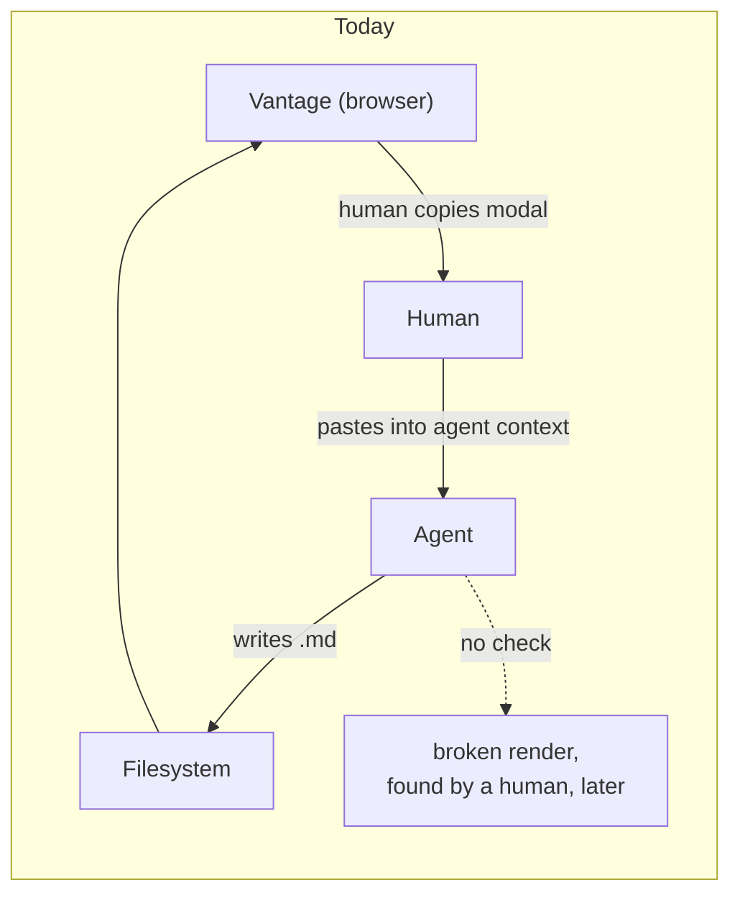

# An agent-facing CLI — closing the loop Vantage cannot close itself

**Status:** DESIGN SKETCH, 2026-08-24. Reviewed and revised 2026-08-24 — see the
[Decision Ledger](#decision-ledger). Nothing built. Every claim about existing
code was verified against the tree on 2026-08-24.

**The short version.** Vantage knows two things the writing agent needs: how to
format a document, and whether a given document is actually correct. Today the
first reaches the agent only when a human copies it out of a browser modal, and
the second doesn't reach it at all, because nothing checks the result. I propose
a small CLI shipped from the already-published `vantage-md` npm package, with
two commands: `style-guide` (emit the canonical conventions) and `check` (verify
a document really renders, by **running the real validators** — `mermaid`,
`katex`, `remark` — rather than reimplementing them). The only rules we write
ourselves are the ones nobody else can check: whether a link resolves against
this repo on disk.

**The most important section is [§5](#5-check-delegate-everything-we-can)** —
the design turns on the CLI being an orchestrator of real validators, not a
bespoke rule engine.

**Reads with:** [`review-state-architecture.md`](review-state-architecture.md)
(why the inbox protocol looks the way it does), and the user-facing
[`../../userguide/review-inbox.md`](../../userguide/review-inbox.md) (the
protocol as agents are told it today).

---

## 1. Verdict up front

Build it, in the npm package, `npx`-first, with `style-guide` and `check`.

Three principles do the load-bearing work:

- **P1. The filesystem is the only channel.** Vantage cannot call the agent and
  the agent cannot call Vantage. Anything the CLI does must work with **no
  server running**, no port, no socket. A command that needs a live Vantage is a
  command an agent cannot rely on.
- **P2. Delegate every check that a real tool already performs.** We do not
  reimplement Markdown parsing, Mermaid parsing, or KaTeX validation. We run
  those projects' own parsers and report what they say. We write rules only for
  the questions no existing tool can answer — the ones that need this repo on
  disk and Vantage's own resolution semantics.
- **P3. Discovery rides a channel we already control.** The agent's environment
  is not guaranteed to contain anything Vantage-related, and we are **not**
  editing anyone's `AGENTS.md` to fix that. The review-comment payload is copied
  on every review turn and is ours to write — that is where the pointer goes.

## 2. What exists today, precisely

Vantage already has an agent-facing story. It is entirely made of text a human
moves by hand.

**The style guide** lives as a TypeScript string constant,
`STYLE_GUIDE_SNIPPET`, at
[`StyleGuideModal.tsx:13-97`](../../frontend/src/components/StyleGuideModal.tsx#L13-L97)
— roughly 85 lines covering structure, relative-link rules, frontmatter, Mermaid
label quoting, code and diff fences, callouts, tables, and the `$$...$$` math
rule. It is surfaced through a modal opened from the settings dropdown
([`SettingsDropdown.tsx:221`](../../frontend/src/components/SettingsDropdown.tsx#L221),
wired at
[`ViewerPage.tsx:813`](../../frontend/src/pages/ViewerPage.tsx#L813)) with a copy
button, and the modal tells you to paste it into your agent's context.

> [!WARNING]
> **The style guide is a shipped, undocumented feature.** As of 2026-08-24 there
> are zero mentions of it in `userguide/`, `README.md`, or `docs/`. Whatever else
> this design does, §9 step 6 should finally write it down.

There is also a copy of substantially this guidance living outside the repo, as
an agent skill file. It is referenced nowhere in this tree and is not this
repo's problem to maintain — but it is *evidence*: a copy got made because there
was no way to **fetch** the guide. A `style-guide` command removes the reason
such copies exist.

**Nothing verifies the output.** There is no linter, no checker. The CLI today is
`serve`, `daemon`, `init-config`, `build`, `install-service`, `perf-report`
([`main.go:24-30`](../../cmd/vantage/main.go#L24-L30)). A document with a
leading-slash link, an unparseable Mermaid diagram, or a `#L400` anchor on a
200-line file is written, delivered, and rendered broken — and the loop only
closes when a human clicks the link.

## 3. The gap



The write path is fine. The **verify path does not exist**, and the knowledge
path runs through a human's clipboard. A CLI closes both, because a CLI is the
one thing an agent can invoke that lives in the same filesystem world Vantage
does.

## 4. Distribution: one artifact, several front doors

Two questions get conflated here, and separating them settles the argument.

**What language is it written in?** TypeScript, and this is not really a choice.
The value of `check` is that it answers *"will this render in Vantage"* rather
than *"is this idiomatic Markdown"*, and answering the first question means
running the actual pipeline —
[`renderMarkdown.ts`](../../packages/vantage-md/src/renderMarkdown.ts) (131
lines), [`resolveLinks.ts`](../../packages/vantage-md/src/resolveLinks.ts) (92
lines), [`frontmatter.ts`](../../packages/vantage-md/src/frontmatter.ts) (94
lines) — plus the same `mermaid` and `katex` the viewer loads. Those are
TypeScript, already published as `vantage-md` v0.1.7, with a release pipeline
that exists (`just release-md`, OIDC trusted publishing). A Go reimplementation
would be a second implementation of link resolution that drifts from the viewer
*invisibly* — it would pass documents the viewer breaks on.

**How does an agent get it?** This is the open half, and `npx` is the start
rather than the whole answer.

| Channel | Reach | Cost | Verdict |
| :--- | :--- | :--- | :--- |
| `npx vantage-md check docs/` | Any env with Node | A `bin` entry on a package that already ships `dist/` — near free | **v1.** |
| `npm i -g` | Same, but fast and offline after once | Free, it is the same artifact | **Documented as the fast path.** |
| `uvx` / PyPI wheel | Envs with `uv` but no Node — common in Python-first agent sandboxes | Needs a compiled single-file binary (`bun build --compile` or Node SEA) wrapped in a wheel | **Genuinely open — [OQ-1](#open-questions).** |
| Standalone binary via GitHub releases | Anything with `curl` | Same compile step as the wheel; falls out of it | Ships with the wheel if we do it. |
| A script Vantage writes into `.vantage/` | Good — appears next to the docs | Cannot run the pipeline | **Rejected.** Reinvents distribution badly. |

The important structural point: **the compile-to-binary step, if we take it,
unlocks `uvx` and `curl` together**, and it does not change the implementation
language. So "npx or uvx" is not a fork in the road — it is a question of
whether Node-less agent environments are common enough to pay for a build step.

> [!NOTE]
> **There is no real name collision.** The Go binary is built as `-o vantage`
> ([`Justfile:22`](../../Justfile#L22)), so the executable on disk is `vantage`.
> The `Use: "vantage-md"` string at
> [`main.go:17`](../../cmd/vantage/main.go#L17) is a cosmetic mislabel — help
> output names a binary nobody installs. So the npm package can take a
> `vantage-md` bin with zero disruption, and the Go `Use` string is a separate
> one-line fix to an existing bug, not a rename.

## 5. `check` — delegate everything we can

The command is `check`, not `lint`, because most of what it does is run other
people's validators and collate the results. We should be embarrassed to
hand-write a rule that a real parser already enforces.

```console
$ npx vantage-md check docs/
$ npx vantage-md check docs/design/api.md --format json
```

### 5.1 What we delegate

| Concern | Delegated to | Already a dependency? |
| :--- | :--- | :--- |
| Mermaid diagrams parse | `mermaid`'s own parser (`mermaid.parse()`) | Yes — `optionalDependencies` |
| Math expressions compile | `katex` in `throwOnError` mode | Yes — direct dependency |
| Markdown is well-formed | `remark` / `remark-gfm` (already the viewer's parser) | Yes — direct dependency |
| General Markdown hygiene | `remark-lint` presets, opt-in | New dev-side dep |
| Frontmatter is valid | `yaml` / `smol-toml` (the viewer's own parsers) | Yes — both direct deps |

Four of the five are dependencies `vantage-md` **already has**, because the
viewer needs them to render. That is the whole argument in one line: the
validators are sitting in the package already, and nobody is asking them
whether the document is correct before it ships.

This also means a Mermaid diagram that fails `check` fails for exactly the
reason the viewer would fail on it, in Mermaid's own words — not our
approximation of them.

### 5.2 What we write ourselves

Only the questions that need *this repo on disk* and Vantage's routing
semantics. No general-purpose tool can answer these, which is precisely why
they are ours:

| Rule | What it catches |
| :--- | :--- |
| `link/leading-slash` | A leading-slash target — breaks web routing and multi-repo scoping |
| `link/uri-scheme` | `file://` schemes, absolute filesystem paths, drive letters |
| `link/missing-target` | Relative link whose target does not exist on disk |
| `link/line-anchor-range` | `#L400` on a 200-line file, or an inverted range |
| `link/dead-section-anchor` | `#some-heading` matching no slug in the target document |

These are the highest-value rules in the set and the first to build. They are
also the ones that must have a **near-zero false-positive rate** — an agent that
sees one bogus error stops running the tool, and we get one chance at that. They
earn that rate by being filesystem-verified rather than heuristic.

> [!TIP]
> A crude grep for links while writing this document flagged
> `` `[Doc](/docs/guide.md)` `` inside inline code as a broken link. The real
> checker must walk the parsed AST, not the raw text — inline code, fenced
> blocks, and autolinks are not links. That one is on the record because it is
> the obvious way to get `link/*` wrong.

### 5.3 Configuration

A repo-level config file, in v1 rather than deferred. Rule severities, rule
disablement, and exit-code policy live there; flags override it; **absent config
means working defaults**, so the zero-install one-command path stays intact.

The open part is where it lives and what it is called: Vantage's existing config
is *user*-level at `<UserConfigDir>/vantage/config.toml`
([`config.go:485`](../../internal/config/config.go#L485)), and this is the first
*repo*-level config the project would have. See [OQ-3](#open-questions).

### 5.4 `--fix`

Narrow if it exists at all: mechanical, unambiguous rewrites only (stripping a
leading slash, tagging a fence whose language is inferable). It never touches
prose, never inserts frontmatter, never rewrites a Mermaid diagram. A `--fix`
that mangles a document is unrecoverable trust damage, and an agent can fix
anything else itself once it has been told what is wrong.

## 6. How the agent finds out any of this exists

**P3** is the part that is easy to skip and fatal to skip. A CLI nobody knows
about is exactly as undiscoverable as a modal nobody knows about — and §2's
finding is that we have already shipped one of those.

**We are not touching `AGENTS.md`.** Not writing to it, not requiring a stanza
in it, not making setup a precondition for the tool to be reachable.

Instead the pointer rides the **review-comment payload** — the block assembled
at
[`useReviewStore.ts:896-932`](../../frontend/src/stores/useReviewStore.ts#L896-L932)
and copied to the clipboard on every single review turn. It is a channel we
already own, already write, and that already reaches the agent verbatim. A short
note is enough:

> Before delivering, run `npx vantage-md check <file>` and fix what it reports.

Three properties make this the right hook. It requires **zero setup** from the
user. It is **self-refreshing** — the agent fetches current conventions rather
than reading a copy pasted six months ago. And it arrives **exactly when it is
useful**, at the moment the agent is about to hand work back.

The honest limitation: the payload only exists in the review flow, so a document
being drafted with no review round yet gets no pointer. That is acceptable —
the review loop is where quality feedback belongs — and the `style-guide`
command remains available for anyone who wants to wire it in earlier.

## 7. Non-goals — what this does **not** license

- **Not a bespoke rule engine.** Per **P2**, if a real validator can answer the
  question, we run it. Every hand-written rule must justify why no existing tool
  can check it.
- **Not a network protocol.** No daemon, no RPC, no port, no "is the server
  running" check. Per **P1**, every command works offline against a bare
  checkout. Hard boundary, not a v1 simplification.
- **Not editing anyone's agent config.** No `AGENTS.md` writes, no `CLAUDE.md`
  writes, no `.gitignore` writes.
- **Not a writing assistant.** No prose restructuring, no generated frontmatter
  values, no editorial judgment.
- **Not review state, comments, or diffing.** Those need the server and belong
  to it.
- **Not a rewrite of the Go CLI.** The Go binary keeps its six subcommands and
  its job. This is additive.

## 8. Costs and risks

| Risk | Mitigation |
| :--- | :--- |
| **R1. Two-implementation drift** if the Go binary also grows checks | Don't. Per **P2**, TypeScript owns it. If the Go binary ever needs to check, it shells out or does nothing. |
| **R2. False positives erode trust** — one bogus error and the agent stops running it | Delegated checks inherit the real parser's verdict; our own rules are filesystem-verified, not heuristic. Ship `link/*` first because it is checkable rather than inferable. |
| **R3. Dependency weight** — lint deps landing on library consumers of `vantage-md` | Keep the CLI in its own entrypoint so `import "vantage-md"` never pays for it. This is a real packaging constraint — [OQ-2](#open-questions). |
| **R4. `npx` latency, and Node-less environments** | `npm i -g` as the fast path; [OQ-1](#open-questions) decides whether `uvx` is worth a compile step. |
| **R5. Version skew** — agent runs `@latest` against an older server | Checks describe the *format*, which is stable, not server behavior. |
| **R6. Scope gravity** — "the CLI could also…" is how this becomes a second product | §7 is the defense. Every proposed command justifies itself against **P1**. |

**What it costs us.** A `bin` entry, a CLI dependency tree the library half of
the package does not want, a published command surface that becomes a
compatibility promise, and the release discipline of a tool agents invoke
unattended.

**What it deletes.** The reason for out-of-tree copies of the style guide. The
"paste this into your agent and hope" step. And the class of broken-link bugs
that currently reach a human before they reach a check.

## 9. What I would build, in order

1. **Move the style guide into the package** as the single source; rewire
   `StyleGuideModal` to import it. No CLI yet — pure de-duplication, stands
   alone.
2. **`style-guide` command.** Smallest possible `bin`; proves the packaging.
3. **`check`, our own `link/*` rules only** (§5.2). The minimum viable useful
   checker and the highest-value slice.
4. **Payload pointer** (§6), so the thing is actually reachable. Immediately
   after step 3 — a checker nobody runs scores zero.
5. **Delegated validators** (§5.1) — Mermaid, KaTeX, frontmatter, then opt-in
   `remark-lint`. Config (§5.3) lands with these, since severities are what it
   configures.
6. **Document all of it** in `userguide/` — including, finally, the style guide
   feature that has been shipping undocumented.

`--fix` (§5.4) comes after all of it, if at all.

## 10. Icebox

**`reply` — a wrapper over the inbox protocol.** The idea: one command
(`--path`, `--id`, `--round`, `--summary`) generating the nonce and performing
the write-to-scratch-then-`mv` dance, replacing the heredoc in the payload.

The case for it is real but small: the payload spends roughly fifteen lines
defusing a race — write directly to the `.jsonl` name and the watcher fires on
the empty file, consumes it, and deletes it while your write lands in an
unlinked file — and a CLI makes that race structurally unreachable. Those are
prompt tokens on every review turn.

The case against is that **the protocol works well today**, and the heredoc's
virtue is needing nothing but a shell. Trading that for a hard `npx` dependency
in the one flow that currently has no dependencies would be a downgrade. Not
built for now; revisit if the race ever actually bites someone.

## 11. Alternatives considered

- **Do nothing; keep copy-paste.** Rejected. It leaves the verify path missing
  entirely, which is the actual gap.
- **Put the checker in the Go binary.** Rejected on **P2** and §4: guaranteed
  invisible drift from the real renderer, and no zero-install story comparable
  to `npx`.
- **Write our own rules for Mermaid, math, and Markdown validity.** Rejected —
  this was the original draft's plan and it was wrong. Those parsers exist, four
  of the five are already dependencies of this package, and our approximation of
  them would be worse and would drift. This is now **P2**.
- **A `remark-lint` preset as the user-facing surface.** Rejected as the
  surface — it needs a config file and a `remark` install, which fails the
  one-command bootstrap. **Adopted as an internal engine** for general Markdown
  hygiene (§5.1).
- **Ship it as an agent skill / prompt file instead of a tool.** Rejected as a
  substitute. A prompt can state the rules; it cannot check a `#L400` anchor
  against a 200-line file.
- **An MCP server so the agent can talk to Vantage directly.** Rejected. Breaks
  **P1** (needs something running) and solves a problem we do not have — the
  agent does not need to *query* Vantage, it needs the rules and a way to check
  its work.

## Decision Ledger

| ID | Ruling / Decision | Date | Settled in |
| :--- | :--- | :--- | :--- |
| OQ-1 | Both `style-guide` and `check`; the anchor question was a false choice | 2026-08-24 | §1, §9 |
| OQ-2 | No rename. npm package takes a `vantage-md` bin; the Go `Use` string is a separate cosmetic fix | 2026-08-24 | §4 note |
| OQ-3 | Repo-level config ships in v1, not deferred | 2026-08-24 | §5.3 |
| OQ-4 | `reply` iceboxed — protocol works; revisit if the race bites | 2026-08-24 | §10 |
| OQ-5 | `--fix` narrow, and only if it happens at all | 2026-08-24 | §5.4 |
| OQ-6 | Non-zero on errors, `--strict` for warnings, policy configurable | 2026-08-24 | §5.3 |
| OQ-7 | Dropped — the out-of-tree skill is referenced nowhere in this repo and is out of scope | 2026-08-24 | §2 |

> [!IMPORTANT]
> **The original OQ-2 objection was investigated and is false.** There is no
> `vantage-md` name collision on disk: the Go binary installs as `vantage`
> ([`Justfile:22`](../../Justfile#L22)) and only its help text says otherwise.
> Do not re-derive this as a blocker for giving the npm package a `vantage-md`
> bin.

## Open Questions

1. 💬 **OQ-A1: Is `uvx` worth a compile step?** `npx` covers Node environments;
   Python-first agent sandboxes with `uv` and no Node are common enough to ask
   about. Reaching them means compiling the TS CLI to a single-file binary
   (`bun build --compile` or Node SEA) and wrapping it in a wheel — which also
   yields a `curl`-able release binary for free. This decides whether v1 has one
   delivery channel or three, and it is a build-pipeline commitment, not a
   code-level one.

   _Leaning:_ `npx` for v1, structured so the compile step can be added without
   rework. I do not have data on how many agent environments lack Node, and
   that number is the whole decision — if you have a read on it, it settles this.

   **Answer:**
   > _(empty — fill in when decided)_

2. 💬 **OQ-A2: Same package or a sibling?** `check` pulls in validator
   dependencies that library consumers of `vantage-md` should never pay for.
   Options: a separate `./cli` entrypoint in the same package (one version, one
   release, deps still in the tree); a sibling package depending on
   `vantage-md` (clean deps, two releases to keep in step).

   _Leaning:_ Same package, separate entrypoint. Version skew between a checker
   and the pipeline it checks against is a worse problem than an unused
   dependency, and `mermaid` is already `optionalDependencies` — the pattern for
   "heavy, not everyone needs it" is established here.

   **Answer:**
   > _(empty — fill in when decided)_

3. 💬 **OQ-A3: Where does repo-level config live, and what is it called?** This
   is the project's first repo-level config; the existing one is user-level at
   `<UserConfigDir>/vantage/config.toml`
   ([`config.go:485`](../../internal/config/config.go#L485)). Options:
   `.vantage.toml` at the repo root (matches the existing TOML convention,
   discovered by walking up); a `vantage` key in `package.json` (idiomatic for
   an npm CLI, invisible to the Go side); or `.vantage/config.toml`, reusing the
   directory the inbox already lives in.

   _Leaning:_ `.vantage.toml` at the root. TOML matches what Vantage already
   speaks, and `.vantage/` is currently *transient state that users are told to
   gitignore* — putting committed config inside a gitignored directory is a trap.

   **Answer:**
   > _(empty — fill in when decided)_
