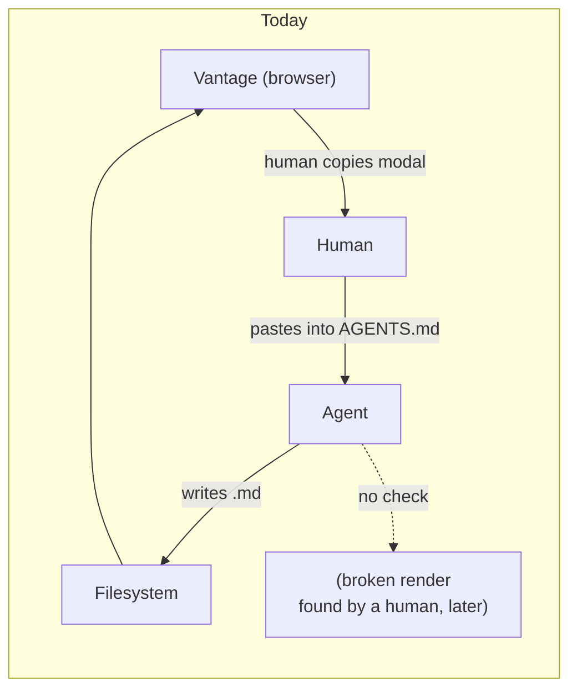
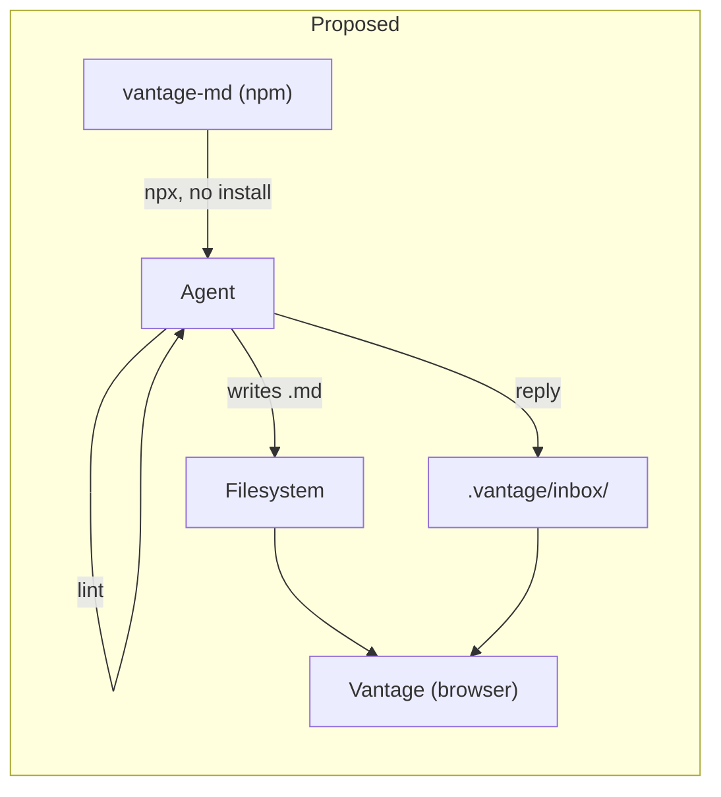

# An agent-facing CLI — closing the loop Vantage cannot close itself

**Status:** DESIGN SKETCH, 2026-08-24. Nothing built. Every claim about existing
code was verified against the tree on 2026-08-24.

**The short version.** Vantage knows three things the writing agent needs: how
to format a document, whether a given document is actually correct, and how to
deliver a review response. Today all three reach the agent only when a human
copies them out of a browser — a modal snippet, a clipboard payload — and the
second one doesn't reach it at all, because nothing checks the result. I propose
a small CLI, shipped from the already-published `vantage-md` npm package so
`npx` makes it zero-install, with three commands: `style-guide` (emit the
canonical conventions), `lint` (verify a document renders correctly *in
Vantage*, using Vantage's own pipeline), and `reply` (perform the inbox
write-then-rename correctly). The linter is the reason to build this; the other
two are cheap and fall out of the same package.

**The most important section is [§4](#4-distribution-is-the-design)** —
distribution is not a packaging detail here, it is the constraint that picks the
implementation language and therefore the whole shape of the tool.

**Reads with:** [`review-state-architecture.md`](review-state-architecture.md)
(why the inbox protocol looks the way it does), and the user-facing
[`../../userguide/review-inbox.md`](../../userguide/review-inbox.md) (the
protocol as agents are told it today).

---

## 1. Verdict up front

Build it, in the npm package, `npx`-first, and lead with the linter.

Three principles do the load-bearing work:

- **P1. The filesystem is the only channel.** Vantage cannot call the agent and
  the agent cannot call Vantage. Anything the CLI does must work with **no
  server running**, no port, no socket, no config. A command that needs a live
  Vantage is a command an agent cannot rely on.
- **P2. Accuracy comes from sharing the renderer, not from re-describing it.**
  A linter that reimplements "what Vantage does with this link" in a second
  language is a linter that will disagree with the viewer. The rules must run on
  the same remark/rehype pipeline the viewer runs.
- **P3. One human paste bootstraps everything.** The agent's environment is not
  guaranteed to contain anything Vantage-related. So the one thing a human
  pastes must not be the whole payload — it must be the pointer that tells the
  agent how to fetch the rest and how to check its own work.

## 2. What exists today, precisely

Vantage already has an agent-facing story. It is entirely made of text a human
moves by hand.

**The style guide** lives as a TypeScript string constant,
`STYLE_GUIDE_SNIPPET`, at
[`StyleGuideModal.tsx:13-97`](../../frontend/src/components/StyleGuideModal.tsx#L13-L97)
— roughly 85 lines covering structure, relative-link rules, frontmatter, Mermaid
label quoting, code and diff fences, callouts, tables, and the `$$...$$` math
rule. It is surfaced through a modal opened from the settings dropdown
([`SettingsDropdown.tsx:221`](../../frontend/src/components/SettingsDropdown.tsx#L221),
wired at
[`ViewerPage.tsx:813`](../../frontend/src/pages/ViewerPage.tsx#L813)) with a copy
button, and the modal itself tells you to paste it into `CLAUDE.md`, `AGENTS.md`,
or a system prompt.

Two problems with that, both structural:

> [!WARNING]
> **The style guide is undocumented and duplicated.** As of 2026-08-24 there are
> zero mentions of the feature in `userguide/`, `README.md`, or `docs/` — it is
> a shipped, undiscoverable feature. And a second, independently maintained copy
> of substantially the same guidance lives outside the repo entirely, as a
> ~140-line agent skill file. The two have already diverged: the skill has a
> section on Open Questions and Decision Ledgers the modal lacks. Two sources of
> truth for one style guide is the bug this design has to fix on the way past.

**The comment protocol** is a filesystem mailbox at `<repo>/.vantage/inbox/`,
documented at length in
[`../../userguide/review-inbox.md`](../../userguide/review-inbox.md). The
clipboard payload the reviewer copies is assembled at
[`useReviewStore.ts:896-932`](../../frontend/src/stores/useReviewStore.ts#L896-L932)
and hands the agent a ready-to-run heredoc: write to a `.writing` scratch name,
then `mv` it onto `<flattened-path>.$RANDOM.jsonl`. The rename is the completion
signal.

This works well. It is also carrying a footgun the prose has to keep defusing —
the payload spends a full paragraph on *"do not write directly to the `.jsonl`
name"*, because doing so creates the file empty, the watcher fires on the
creation, and Vantage consumes and deletes an empty delivery while the write
lands in an unlinked file. The user guide spends another paragraph on the same
hazard.

**Nothing verifies the output.** There is no linter, no checker, no `vantage
lint`. The CLI today is `serve`, `daemon`, `init-config`, `build`,
`install-service`, `perf-report`
([`main.go:24-30`](../../cmd/vantage/main.go#L24-L30)). A document with a
leading-slash link, an unquoted Mermaid label, or a `#L400` anchor on a 200-line
file is written, delivered, and rendered broken — and the loop only closes when
a human clicks the link.

## 3. The gap



The write path is fine. The **verify path does not exist**, and the knowledge
path runs through a human's clipboard. A CLI closes both, because a CLI is the
one thing an agent can invoke that lives in the same filesystem world Vantage
does.



## 4. Distribution is the design

This is the section that decides everything else, so it goes before the command
surface rather than after it.

The constraint from **P1** and the user's framing: *the agent's environment is
not guaranteed to contain anything Vantage-related.* A tool the agent cannot
obtain in one command is a tool that will not be used. That rules out anything
requiring a prior install step, a `go install`, a package manager the agent
doesn't have, or a running server.

| Option | Obtainability | Renderer fidelity | Verdict |
| :--- | :--- | :--- | :--- |
| **A.** Subcommands on the Go binary (`vantage lint`) | Poor — needs the binary already present; no `npx` equivalent for Go | Poor — would reimplement the remark/rehype pipeline in Go, violating **P2** | **Rejected as primary.** Thin aliases only, if at all. |
| **B.** `bin` on the existing `vantage-md` npm package | Excellent — `npx vantage-md@latest lint docs/` works in any Node env with zero install | Perfect — the package *is* the pipeline | **Accepted.** |
| **C.** A new, separate npm package (`vantage-agent`) | Same as B | Same as B, but must depend on `vantage-md` | Plausible; see [OQ-2](#open-questions). |
| **D.** A script Vantage writes into `.vantage/` | Good — appears next to the docs | Poor — a shell script cannot run the pipeline | **Rejected.** Reinvents distribution badly. |

**B is the answer, and the reason is P2.** The linter's whole value proposition
is that it answers *"will this render correctly in Vantage"* rather than *"is
this idiomatic Markdown"* — the second question already has good answers
(`markdownlint`, `remark-lint`) and we should not compete with them. Answering
the first question means running the actual pipeline:
[`renderMarkdown.ts`](../../packages/vantage-md/src/renderMarkdown.ts) (131
lines), [`resolveLinks.ts`](../../packages/vantage-md/src/resolveLinks.ts) (92
lines), [`frontmatter.ts`](../../packages/vantage-md/src/frontmatter.ts) (94
lines). Those are TypeScript, they are already published to npm as `vantage-md`
v0.1.7, and the release pipeline for them already exists (`just release-md`,
trusted publishing via OIDC).

Adding a `bin` entry to a package that already ships `dist/` is close to free.
Reimplementing link resolution and Mermaid label parsing in Go is a second
implementation that will drift from the first — and the drift will be invisible,
because it shows up as a linter that passes documents the viewer breaks on.

> [!IMPORTANT]
> **Naming collision, flagged early.** The Go root command already calls itself
> `vantage-md` — [`main.go:17`](../../cmd/vantage/main.go#L17) sets
> `Use: "vantage-md"` — and the npm package is also named `vantage-md`. Give the
> npm package a `bin` under that name and `npx vantage-md` and the installed
> `vantage-md` become two different programs answering to one name. This must be
> resolved before anything ships; see [OQ-2](#open-questions).

## 5. Command surface

Sketches, not specifications. Exit codes and flag names are settled at build
time; the shape is what needs checking now.

### 5.1 `style-guide`

```console
$ npx vantage-md style-guide            # canonical Markdown, to stdout
$ npx vantage-md style-guide --format json
$ npx vantage-md style-guide --rules    # just the rule ids the linter enforces
```

The point is not the command — it is that adding it forces the snippet to become
**one artifact with one home**, in the package, consumed by the modal, the CLI,
and (by generation, not by hand) the agent skill. The duplication described in
§2 dies here, and this is the cheapest command to build, so it goes first.

### 5.2 `lint`

```console
$ npx vantage-md lint docs/
$ npx vantage-md lint docs/design/api.md --format json
$ npx vantage-md lint docs/ --fix
```

Rules split by confidence, because the split is what determines whether agents
trust the tool:

**Errors — this is broken in Vantage, verified against the filesystem:**

| Rule | What it catches |
| :--- | :--- |
| `link/leading-slash` | `[Doc](/docs/guide.md)` — breaks web routing and multi-repo scoping |
| `link/uri-scheme` | `file:///workspace/...`, `C:\...`, absolute filesystem paths |
| `link/missing-target` | Relative link whose target does not exist on disk |
| `link/line-anchor-range` | `#L400` on a 200-line file, or `#L58-L42` inverted |
| `link/dead-section-anchor` | `#some-heading` matching no slug in the target doc |
| `mermaid/parse-error` | The diagram does not parse — includes the unquoted-label case |
| `math/single-dollar-display` | `$...$` used where `$$...$$` was meant |

**Warnings — renders, but not to the standard:**

`link/missing-extension`, `link/backticks-outside`, `fence/untagged`,
`frontmatter/absent`, `frontmatter/unknown-status`, `heading/no-h1`.

Two properties matter more than the rule list. **Errors must have a near-zero
false-positive rate** — an agent that learns the linter cries wolf will stop
running it, and we get one chance at that. And **`link/missing-target` and the
anchor rules are the highest-value rules in the set**, because they are the ones
no generic Markdown linter can check: they need the repo on disk and Vantage's
own resolution semantics.

`--fix` is deliberately narrow: mechanical, unambiguous rewrites only
(leading-slash stripping, fence tagging where the language is inferable). It
never touches prose. See [OQ-5](#open-questions).

### 5.3 `reply`

```console
$ npx vantage-md reply --path docs/design/api.md --id abcd1234 \
    --round 2 --summary "Split the intro into two paragraphs."
```

One command replaces the heredoc in the clipboard payload: generate a fresh
nonce, write to a scratch name, `mv` it onto the committed `.jsonl` name. The
race described in §2 becomes structurally unreachable rather than something the
prompt has to keep warning about, and the payload drops from ~15 lines of
protocol explanation to one line plus a fallback.

The user's read is that this protocol *works well today*, and that is right —
which is why this command ships last and why **the payload must keep offering
the raw heredoc as a fallback**. The heredoc's virtue is that it needs nothing
but a shell. Trading that for a hard dependency on `npx` would be a downgrade.
See [OQ-4](#open-questions).

## 6. How the agent finds out any of this exists

**P3** is the part that is easy to skip and fatal to skip. A CLI nobody knows
about is exactly as undiscoverable as a modal nobody knows about — and §2's
finding is that we have already shipped one of those.

The chain has to start with the one human action we can count on: a paste. So
the pasted snippet changes character. Instead of *being* the whole style guide,
it becomes a bootstrap that ends with something like:

> Before you finish a document, run `npx vantage-md lint <file>` and fix what it
> reports. Run `npx vantage-md style-guide` for the full conventions.

That is short enough to live in an `AGENTS.md` without crowding it, and it makes
the guide self-refreshing: the agent fetches current conventions instead of
reading a copy that was pasted six months ago. The clipboard comment payload
gets the same treatment for `reply`.

Two secondary hooks worth considering, neither load-bearing: `vantage
init-config` could offer to write the `AGENTS.md` stanza and add `.vantage/` to
`.gitignore` (which the user guide currently makes a manual step), and the
`style-guide` command could emit an `AGENTS.md`-shaped block directly.

## 7. Non-goals — what this does **not** license

- **Not a general Markdown linter.** No prose style, no line-length, no
  heading-increment nagging. `markdownlint` and `remark-lint` exist and are
  good. We check Vantage-specific correctness; anything a generic linter already
  catches is out of scope, and users who want it can run both.
- **Not a network protocol.** No daemon, no RPC, no port, no "is the server
  running" check. Per **P1**, every command works offline against a bare
  checkout. This is a hard boundary, not a v1 simplification.
- **Not a writing assistant.** `--fix` performs mechanical rewrites. It does not
  restructure documents, rewrite prose, generate frontmatter values, or make
  editorial judgments.
- **Not a replacement for the inbox protocol.** `reply` is a convenience wrapper
  over a protocol that stays exactly as it is and stays independently usable.
- **Not review state, not comments, not diffing.** Those need the server and
  belong to it.
- **Not a rewrite of the Go CLI.** The Go binary keeps its six subcommands and
  its job. This is additive.

## 8. Costs and risks

| Risk | Mitigation |
| :--- | :--- |
| **R1. Two-implementation drift** if the Go binary also grows lint rules | Don't. Per **P2**, TypeScript owns the rules. If the Go binary ever needs to lint, it shells out or does nothing. |
| **R2. False positives erode trust** — an agent that sees one bogus error stops running the linter | Errors are filesystem-verified and conservative; anything heuristic is a warning. Ship the link rules first precisely because they are checkable, not inferable. |
| **R3. `npx` latency and offline agents** — a cold `npx` is seconds, and some sandboxes have no network | Document `npm i -g` as the fast path; keep the raw heredoc fallback for `reply` so the review flow never hard-depends on network. |
| **R4. Version skew** — agent runs `npx vantage-md@latest` against an older server | Rules must describe the *format*, which is stable, not server behavior. Pin guidance in the bootstrap snippet if this bites. |
| **R5. Name collision** (§4) between the Go binary's `Use` string and the npm `bin` | Must be resolved pre-ship — [OQ-2](#open-questions). |
| **R6. Scope gravity** — "the CLI could also…" is how this becomes a second product | §7 is the defense. Every proposed command must justify itself against **P1**. |

**What it costs us.** A `bin` entry, a CLI dependency tree the library half of
`vantage-md` does not want (keep the CLI's deps in a separate entrypoint so
library consumers don't pay for them), a published command surface that becomes
a compatibility promise, and the release discipline of a tool agents invoke
unattended.

**What it deletes.** The duplicated style guide (§2). Roughly fifteen lines of
protocol explanation from the clipboard payload. The "paste this into your agent
and hope" step. And the class of broken-link bugs that currently reach a human
before they reach a check.

## 9. What I would build, in order

1. **Move the style guide into the package** as the single source, rewire
   `StyleGuideModal` to import it. No CLI yet — this is pure de-duplication and
   it stands on its own.
2. **`style-guide` command.** Smallest possible `bin`, proves the packaging and
   settles the naming question in practice.
3. **`lint`, link rules only** — the four `link/*` errors. This is the minimum
   viable useful linter and the highest-value slice.
4. **Bootstrap snippet rewrite** (§6), so the thing is actually reachable. Ship
   this immediately after step 3, not at the end; a linter nobody runs scores
   zero.
5. **Remaining rules** — Mermaid parse, math delimiters, then the warnings.
6. **`--fix`** for the mechanical subset.
7. **`reply`**, with the heredoc fallback retained in the payload.
8. **Document all of it** in `userguide/` — including, finally, the style guide
   feature that has been shipping undocumented.

## 10. Alternatives considered

- **Do nothing; keep copy-paste.** Rejected. It leaves the verify path missing
  entirely, which is the actual gap — the knowledge path at least works today.
- **Put the linter in the Go binary.** Rejected on **P2**: guaranteed drift from
  the real renderer, and Go has no zero-install distribution story comparable to
  `npx`.
- **Ship it as an agent skill / prompt file instead of a tool.** Rejected as a
  substitute, kept as a complement. A prompt can tell an agent the rules; it
  cannot check a `#L400` anchor against a 200-line file. The skill should be
  *generated from* the package, not maintained beside it.
- **A `remark-lint` preset instead of a bespoke CLI.** Genuinely tempting for
  the rule engine, and worth reconsidering as an implementation detail inside
  `lint`. Rejected as the user-facing surface: it needs a config file and a
  `remark` install, which fails **P3**'s one-paste bootstrap.
- **An MCP server so the agent can talk to Vantage directly.** Rejected for this
  design. It breaks **P1** (needs something running), and it solves a problem we
  do not have — the agent does not need to *query* Vantage, it needs to know the
  rules and check its work. Worth revisiting only if a genuine two-way need
  appears.

## Open Questions

1. 💬 **OQ-1: Is `lint` the anchor, or is `style-guide`?** This design leads with
   the linter and treats the style guide as the cheap side effect. The opposite
   framing — the CLI is a distribution mechanism for conventions, and lint is a
   bonus — would change the sequencing in §9 and probably the name.

   _Leaning:_ Lint is the anchor. The style guide already has a delivery
   mechanism that works when a human uses it; there is no verify path at all.

   **Answer:**
   > _(empty — fill in when decided)_

2. 💬 **OQ-2: What is it called, given `vantage-md` is already taken twice?**
   The npm package is `vantage-md` and the Go binary's `Use` string is also
   `vantage-md` ([`main.go:17`](../../cmd/vantage/main.go#L17)). Options: add a
   differently-named `bin` to the existing package (`vantage-lint`,
   `vantage-agent`); publish a separate package; or rename the Go root command
   to `vantage` and let npm keep `vantage-md`. This blocks step 2 of §9.

   _Leaning:_ Rename the Go root to `vantage` — it is what the docs and the
   service already call it — and give the npm package a `vantage-md` bin. Least
   total confusion, but it is a user-visible rename and deserves a ruling.

   **Answer:**
   > _(empty — fill in when decided)_

3. 💬 **OQ-3: Does the CLI ever read config, or is it stateless?** A `.vantage.toml`
   with per-repo rule severities is the obvious next ask. It is also how a
   zero-install tool grows an install step and how "run this one command" becomes
   "run this command after setting up the config."

   _Leaning:_ Stateless for v1, flags only. Revisit only when someone hits a
   concrete false positive they cannot suppress inline.

   **Answer:**
   > _(empty — fill in when decided)_

4. 💬 **OQ-4: Ship `reply` at all?** Your read is the comment protocol works well
   today, and it does. Against that: the payload spends ~15 lines defusing a
   race the CLI would make unreachable, and those are prompt tokens on every
   review turn.

   _Leaning:_ Build it, but last (§9 step 7), and keep the heredoc in the payload
   as a fallback. If it slips, nothing is lost.

   **Answer:**
   > _(empty — fill in when decided)_

5. 💬 **OQ-5: How aggressive is `--fix`?** Narrow-and-boring (strip leading
   slashes, tag inferable fences) versus opinionated (insert frontmatter
   skeletons, quote Mermaid labels, rewrite `$` to `$$`). The wider version is
   more useful and much easier to get wrong on someone's document.

   _Leaning:_ Narrow. An agent can fix the rest itself once told; a `--fix` that
   mangles a document is unrecoverable trust damage.

   **Answer:**
   > _(empty — fill in when decided)_

6. 💬 🤷 **OQ-6: Exit-code policy.** Non-zero on errors only, or on warnings too?
   Affects whether this can sit in a pre-commit hook unconfigured.

   _Leaning:_ Pure preference. Non-zero on errors, `--strict` to include
   warnings, is the conventional shape.

   **Answer:**
   > _(empty — fill in when decided)_

7. 💬 **OQ-7: Does the generated agent skill live in this repo?** §2 notes the
   style guide has a second life as a ~140-line skill file maintained outside the
   tree, already diverged. Generating it from the package fixes the drift — but
   only if the generated artifact has a home and something regenerates it.

   _Leaning:_ Yes — check a generated `agent-skill.md` into the repo and have
   `check-ci` fail when it is stale, the same way lockfiles are enforced.

   **Answer:**
   > _(empty — fill in when decided)_
