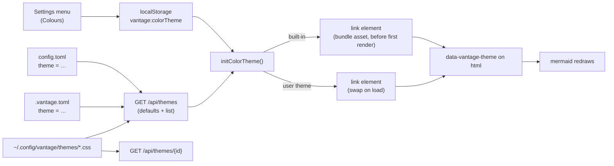

# Colour themes — a runtime palette over the colours the app already uses

**Status:** PROTOTYPE (2026-09-21), built as a pull request in answer to "feel
free to send a PR with your theme, but we might need a theme system too". The
mechanism below is implemented, and the five questions this design opened were
ruled on 2026-09-21 — they are in the [Decision Ledger](#decision-ledger), and
two of the rulings are built in the sections they govern
([§2.2](#22-a-built-in-is-a-stylesheet-not-a-string-in-the-bundle),
[§2.4](#24-a-repository-may-offer-a-default)). One call is still open,
[OQ-CT6](#OQ-CT6), and nothing here waits on it.

**The short version.** A colour theme is a CSS stylesheet that sets custom
properties on `:root` (light) and `:root.dark` (dark — the class the app already
toggles). Only the active theme's stylesheet is in the page. That is enough to
recolour almost the whole interface **without touching a component**, because
Tailwind v4 compiles every colour utility to `var(--color-<family>-<step>)` and
emits the defaults in `@layer theme`, which any unlayered stylesheet outranks.
Three things did not read a variable — the typography plugin's inlined palette,
the syntax-highlighting colours, and the scrollbars — and each is routed through
one in a way that restates the old value exactly. With the built-in look
selected, the page is the page it was before this change.

User-facing documentation: [Colour Themes](../../userguide/guides/themes.md).

**The most important section is [§4](#4-the-zero-change-guarantee-and-how-each-piece-keeps-it)**
— the guarantee is what makes this reviewable as a small change, and every piece
of the design is shaped by it.

---

## 1. The corpus, measured

The question that decided the design was how the components choose their
colours today. Counted over the component sources when this was designed — the
`.ts`/`.tsx` files under `frontend/src` and `packages/vantage-md/src`, tests
excluded, matching each class token of a string literal against
`<prefix>-<family>-<step>` (plus `white`, `black` and the opacity form), and
pairing a class with its `dark:` twin when both sit in the same literal:

| Measure | Count |
| --- | --- |
| Tailwind colour utility classes | 1,368 |
| Distinct light/dark pairings (`bg-white dark:bg-slate-900` counts once) | 193 |
| Of the classes, in the `slate` family | 925 |
| Literal colours (hex and `rgb()`) in [`frontend/src/index.css`](../../frontend/src/index.css) — review UI, anchor and flash highlights, print styles | about 300 |

Two readings of those numbers matter. First, the palette is **already
indirect**: 1,368 classes resolve through a few dozen variables, so recolouring
those variables recolours the classes. Second, the app speaks in Tailwind's
families by *role* — two-thirds of it is `slate`, the neutral — and it picks a
step within a family for its lightness. That is a contract, even though nobody
wrote it down; this design writes it down.

## 2. The contract

A theme may set:

- **The ramps**: `--color-<family>-<step>` for `slate` (neutral surfaces and
  text), `blue` (accent), `purple` (review, secondary accent), `red` (danger),
  `amber` (warning), `green` (success), and the minor families `gray`, `indigo`,
  `emerald`, `yellow` and `orange`. Each ramp must stay in Tailwind's order, `50`
  lightest to `950` darkest, because that order is the only thing a component's
  choice of step relies on.
- **`--color-white` and `--color-black`.** White is two roles at once — the
  light page and the ink on accent buttons — which is why the built-in
  Catppuccin sets it to the flavour's base in light mode and leaves it white in
  dark.
- **Tones**: `--vantage-tone-<tone>-{accent,ink,wash,chip}`, which already
  existed as variables in `packages/vantage-md`'s directive stylesheet.
- **Code roles**: `--vantage-code-{fg,comment,keyword,string,number,title,tag,attr,builtin,meta,addition,deletion}`.
- **Scrollbars**: `--vantage-scrollbar-thumb` and `--vantage-scrollbar-thumb-hover`.

Mermaid diagrams are part of the contract without variables of their own: under
a theme, the seven colours Vantage hands mermaid are read back from the `slate`
steps the built-in hex values were chosen from.

### 2.1 Delivery



- **Built-ins ship with the bundle**, as stylesheets rather than as text inside
  it. `default` (named "Vantage") has no stylesheet; `catppuccin` is
  [`frontend/src/themes/catppuccin.css`](../../frontend/src/themes/catppuccin.css)
  and `lila` is [`frontend/src/themes/lila.css`](../../frontend/src/themes/lila.css),
  each emitted as a build asset and loaded through the same `<link>` a reader's
  own theme takes ([§2.2](#22-a-built-in-is-a-stylesheet-not-a-string-in-the-bundle)).
  A stored built-in still applies **before the first paint**, because its link is
  appended before the first render — a property of when the link goes in, not of
  whether the CSS travelled inside the chunk.
- **Catppuccin and Lila are built-ins the project maintains.** A palette in the
  tree is what keeps the contract honest — a gap in it shows up in a theme the
  maintainers look at — and Catppuccin doubles as the worked example the user
  guide points at. A theme may be as small as one ramp, so a further community
  palette costs about as much as the file it is written in.
- **The control is called Colours**, a native select under the Light/Dark
  buttons. Light and dark are what the user guide already calls themes, so the
  palette needs the other word; the prose writes "colour" and the identifiers
  write `color`, as everywhere else in this repository.
- **User themes are files.** `GET /api/themes` lists
  `~/.config/vantage/themes/*.css`, re-reading the directory on every request so
  a new file needs no restart, and `GET /api/themes/{id}` serves one with
  `Cache-Control: no-cache`. An id must match `^[a-z0-9][a-z0-9_-]{0,63}$`,
  which is also what closes path traversal: no dot, so no `..` and no dotfile.
  It is lowercase because macOS's filesystem folds case and Linux's does not:
  with capitals, `Catppuccin.css` listed beside the built-in it meant to
  replace and `Default.css` slipped past the reserved id on a Mac. For the same
  reason a stylesheet is served only under an id the listing shows, compared
  byte for byte, never by opening `<id>.css` and letting the filesystem match
  it. Only regular files count (a symlink to one is followed), so a FIFO or a
  directory named `x.css` is not a theme.
  Both routes are global rather than per-repository, because a palette is a
  reader's setting. The server side is
  [`internal/api/theme_handlers.go`](../../internal/api/theme_handlers.go).
- **One managed element.** The active theme is a single element with id
  `vantage-color-theme`, appended at the end of `<head>` so it follows the app
  stylesheet. A theme's `<link>`, built-in or user, is added beside the previous
  theme and swapped in only on `load`, and only then is `data-vantage-theme` set
  on `<html>` — so mermaid, which watches that attribute, redraws once, with the
  variables already live. A theme that fails to load is dropped and the previous
  one stays. The client side is
  [`frontend/src/lib/colorTheme.ts`](../../frontend/src/lib/colorTheme.ts).
- **Precedence.** A choice stored in this browser, then `theme = "…"` from the
  user's `config.toml` (read at startup by `config.LoadUserTheme`, in serve and
  daemon mode alike), then `theme = "…"` from the repository's `.vantage.toml`
  ([§2.4](#24-a-repository-may-offer-a-default)), then the built-in look.
  Choosing the built-in look in the menu stores `"default"` explicitly, so
  neither a configured default nor a repository's offer can override a reader
  who chose it.
- **A user theme with a built-in's id replaces the built-in.** That is how a
  reader tweaks Catppuccin: copy it into the themes directory and edit. The id
  `default` cannot be taken, because it means "no stylesheet". A stored
  built-in is applied at once and the same-id user file replaces it when
  `/api/themes` answers, so the id alone does not say which palette is live:
  `data-vantage-theme-source` (`built-in` or `user`) is set beside the id, and
  mermaid's palette key includes it, or diagrams drawn in between would be
  served from the cache in the built-in's colours.
- **Static exports get the built-ins only.** There is no server to list or serve
  a user's files, and neither default — the reader's configured one nor the
  repository's — is in the export; both live in files the export does not carry.

### 2.2 A built-in is a stylesheet, not a string in the bundle

The built-in palettes started out compiled *into* the JavaScript: `?inline` hands
Vite's compiled text to the module, which put about 23 KB of theme in the entry
chunk every reader downloads and parses — including one who never leaves the
built-in look — and each further built-in would have added its own. They are
`?url` imports now, hashed assets the browser fetches and caches like any other
file, and they reach the page the way a reader's own theme does: as a `<link>`
[`applyColorTheme`](../../frontend/src/lib/colorTheme.ts) appends. There is one
path for both kinds, which matters because the interesting half of that module is
the swap, and a second route into it is a second way to get the swap wrong.

**The property that had to survive is "no flash", and it is a property of _when_
the link is appended, not of what kind of element carries the CSS.**
`initColorTheme()` is called from
[`frontend/src/main.tsx`](../../frontend/src/main.tsx) before
`createRoot(…).render(…)`, and it appends a stored theme's link before it returns
— which it can, because `?url` makes the href a constant the build already
resolved. A stylesheet pending in `<head>` is one the browser will not paint
without, so the first frame the reader sees is already in their palette. The call
is deliberately not awaited: what the paint needs is the link in the document,
not the bytes in hand.

Anything that makes the href arrive later breaks that and nothing else will say
so — a dynamic `import()` of the asset, waiting for `/api/themes` first,
deferring the append to an idle callback. Each of those moves the append past the
first paint, and the reader gets one frame of the built-in look and then a
repaint. Deferring is the natural-looking optimisation here, because theme CSS in
the critical path is exactly what a performance audit tells you to take out of it.

> [!WARNING]
> **That regression is invisible where it is written.** On localhost the asset is
> a cache hit and the unthemed frame is gone inside one frame; a cold load over a
> real network is what shows it, which is to say somebody else's machine. What to
> check is where the append happens relative to the first render — not a
> screenshot taken locally.

The `load` handler still owns the *swap* — setting `data-vantage-theme` and
dropping the previous sheet — for both kinds of theme, for the mermaid reason in
[§2.1](#21-delivery). At startup that costs nothing, because the browser is not
painting until the sheet is there in any case.

### 2.3 A theme with no dark half says so

`:root` applies in both modes and `:root.dark` is layered over it, which the user
guide's ["The structure"](../../userguide/guides/themes.md#the-structure)
explains as the thing an author has to know. The consequence is that a theme
which sets only `:root` renders its **light** palette in dark mode. It is not
broken — how legible it is depends on nothing more than whether its ramps stayed
in order — but on the page it reads as a bug in Vantage rather than as an
omission in the theme: the reader presses Shift+D and the page does not go dark.

So `GET /api/themes` reports `has_dark` per user theme, and the settings picker
labels one without a dark half **(light only)**. Only the server can answer it:
the browser has the file only as a sheet it has already applied, and reading the
CSS of a theme nobody picked would mean fetching it first. The answer comes from
searching the file for `:root.dark` (or `.dark:root`, the same selector the other
way round) in
[`internal/api/theme_handlers.go`](../../internal/api/theme_handlers.go), with
comments stripped first — a theme's header usually explains the very selectors it
uses, and a sentence about `:root.dark` is not one. The read is bounded by
`maxThemeRead`, one mebibyte, and a file over it is refused rather than truncated:
a truncated read could miss a dark half past the cut and confidently report the
opposite. Serving one theme skips this read entirely, or fetching a stylesheet
would read every other file in the directory to answer a question the response
does not carry.

The test is textual, and deliberately so: a dark half written some third way
(`html.dark`) is labelled light-only although it works, and a theme too large or
unreadable is labelled the same. Those are wrong labels on a working theme, which
is cosmetic; the alternative is a CSS parser in Go, a second implementation of
what the browser is already doing, carried for the sake of a word in a picker.

**Nothing is rejected.** A light-only theme is a legitimate thing to write; a
reader who never leaves light mode has no reason to write the other half. The
label is the whole intervention, and it moves the surprise from the page to the
picker. Where the flag is unknown — a stored id the listing did not return, so a
file this side never saw — it counts as having a dark half: "(light only)" on a
theme that has one is a worse lie than silence about a theme that has not.

```json
{
  "default": "",
  "repo_defaults": { "": "catppuccin" },
  "themes": [{ "id": "ocean", "name": "ocean", "has_dark": true }]
}
```

### 2.4 A repository may offer a default

A repository names a theme with a **top-level** `theme = "…"` in
`.vantage.toml`, beside the `[starred]` table the server already reads there. Top
level because a key under the checker's own table is an `unknown key`, exit 2,
for that repository's own check run — see
[`repo-config.md` §1.1](repo-config.md#11-the-checker-already-tolerates-it-by-construction),
which is also where the rest of this reader's behaviour is settled: the
repository root only, no upward walk, a malformed file
[rejected whole rather than half](repo-config.md#23-rejected-whole-never-half),
and a re-stat at most once every two seconds rather than a read per request.

> [!WARNING]
> **In TOML, "top level" means _above the first table header_, and that is where
> this key is most easily written wrong.** `theme = "catppuccin"` placed after a
> `[check]` header is `check.theme`, inside the checker's table — the server
> reads past it and finds nothing, and `vantage-check` refuses the key and fails
> the repository's own run with `unknown key check.theme`. So the mistake does
> not present as a theme that did not apply; it presents as a red check on an
> unrelated file. Every place this key is documented says "before any `[table]`
> header" for that reason.

**A repository offers; it never overrides.** Highest first:

1. The choice stored in this browser — picking **Vantage** is a choice.
2. `theme` in the reader's `~/.config/vantage/config.toml`.
3. `theme` in the repository's `.vantage.toml`.
4. The built-in look.

A palette is a property of the reader's eyes and their room, not of the project,
which is why the repository sits below both of the reader's own levels. What a
repository legitimately has is a suggestion — the palette its screenshots and
diagrams were drawn in — and a suggestion is what level 3 is.

**The two `theme` keys refresh differently, and the names give no hint of it.**
The repository's rides `internal/repoconfig`'s lazy reload, so an edit to
`.vantage.toml` is in effect on the next page load; the reader's own is read once
at startup by `config.LoadUserTheme` and needs a restart. That asymmetry is not a
choice made for themes — it is each reader's existing contract, and the level a
value came from is what decides which one it gets.

**Both defaults are held to the same charset**, with `api.ValidThemeID` — the
repository's offer and the reader's own `theme` alike — because an id outside what
the theme routes serve can only ever become a permanent 404 on
`/api/themes/{id}`, which the browser would store and keep asking for. One that
fails is dropped with a warning that names it, rather than passed on: a reader who
typed `Catppuccin` in their config is otherwise left to guess why the page never
changed. A repository whose config does not parse is dropped the same way, by the
repository's name, and served as though it had said nothing — so in daemon mode
one contributor's typo cannot decide what colour anybody else's page is. A
repository naming a *valid* id the reader does not have is simply no default,
exactly as a configured default that names nothing is.

**The limitation is worth stating plainly: the browser decides which repository
it is in from the first path segment of the URL.** `repo_defaults` is keyed by
repository name, `""` in single-directory mode, and the frontend looks itself up
in that map. In daemon mode every document lives under `/{repo}/…`, so that is
the case it covers; a URL whose first segment is not a repository name — the
project list at `/`, and anything served above the repositories — matches no key
and gets no repository default. That is the right failure rather than a gap to
close: at `/` there is no repository whose default it would be.

## 3. The three things that did not read a variable

### 3.1 Prose: the typography plugin inlines its palette

`@tailwindcss/typography` writes `prose-slate` as literal colours into
`--tw-prose-*`, so a theme could recolour every component and still leave the
document body — the part a reader looks at most — in Tailwind's slate. The fix
restates each `--tw-prose-*` and `--tw-prose-invert-*` value in `.prose-slate` as
the step it came from (`var(--color-slate-700)` for body text, and so on),
unlayered so it outranks the plugin's copy in `@layer utilities`.

That restatement has a trap, and it is the one place this design can be built
wrong in a way that looks right in light mode. Unlayered, the restated
`--tw-prose-body` also outranks the plugin's *invert* mapping, so dark mode
would render light-mode prose colours. The block after it re-asserts
`--tw-prose-X: var(--tw-prose-invert-X)` for both ways the app asks for inversion
(`.prose-invert`, and `.dark\:prose-invert:where(.dark, .dark *)`, which is what
`dark:prose-invert` compiles to under the app's `@custom-variant dark`).

### 3.2 Code: GitHub's highlight.js palette is literal

The built-in look keeps `highlight.js/styles/github.css` and the existing
`.dark .hljs-*` overrides untouched. The role rules apply **only** under
`:root[data-vantage-theme]` (and `:root[data-vantage-theme].dark`), with
`!important` because the dark override they replace uses it. Each role falls back
to a step of the theme's own ramps — keyword to `purple`, string to `green`,
title to `blue` — so a theme that only sets ramps still gets code that belongs to
it. The rules sit in `@media screen`: their selectors outrank the print block's
`.prose * { color: … !important }`, so unscoped they printed a theme's syntax
colours — Mocha's pastels — on print's near-white `pre`. A themed page prints as
the built-in look does.

### 3.3 Scrollbars

The four thumb colours read `--vantage-scrollbar-thumb(-hover)` with the old hex
as the fallback. Nothing in the built-in look sets the variable.

## 4. The zero-change guarantee, and how each piece keeps it

With the built-in look the app must be pixel-identical to what it was. The
guarantee is kept **by construction** rather than by tuning, piece by piece:

| Piece | Why the built-in look is unchanged |
| --- | --- |
| Theme stylesheet | Under `default` there is no managed element in the page at all |
| `data-vantage-theme` | Absent under `default`, so every rule gated on it — the code roles — matches nothing |
| Prose restatement | Each value is the very `slate` step, `white` or `black` the plugin inlined, and Tailwind's own variables still define those steps |
| Invert re-assertion | Restores the mapping the plugin already had; it only exists because of the restatement above |
| Scrollbars | The variable is unset, so the fallback — the old hex — applies |
| Mermaid | The palette key is exactly the old mode key (`default` / `dark`), so the SVG cache and loader behave as before; the theme variables are the old hard-coded hex, verbatim, with no DOM read and no colour conversion to round |
| Tones, print styles, review UI | Untouched |

The check for a change to any of these is a before/after screenshot comparison
with the built-in look selected, in both modes, on a document with prose, code,
callouts, a table and a mermaid diagram.

## 5. Why runtime variables now, and not a semantic-token migration

The obvious "proper" theme system is semantic tokens: `bg-surface`,
`text-muted`, `border-subtle`, each a variable a theme sets. It is the better end
state, and this design is not an argument against it. It is an argument about
order:

- **It is a rewrite of nearly every component.** 1,368 classes and 193 distinct
  pairings have to be mapped onto a token vocabulary, and each mapping is a
  judgement. That is not a diff a maintainer can review for correctness, and on a
  `main` that moves daily it would conflict with everything in flight.
- **The token vocabulary is the maintainer's design decision**, not a
  contributor's. Choosing names in a drive-by PR presumes the answer.
- **It cannot keep the zero-change guarantee cheaply.** 193 pairings collapse
  onto fewer tokens, so the default look shifts somewhere unless every pairing
  gets its own token — which is the Tailwind palette again under new names.
- **Nothing here is wasted by doing it later.** A future semantic token is
  defined *in terms of* the ramps (`--surface: var(--color-slate-50)`), so
  themes written against this contract keep working through a migration.

**Later is next.** Semantic tokens are ruled in as the style-system layer above
this one — a named token vocabulary defined over the ramps — and as a series of
its own, one area of the app per PR so that each diff stays reviewable
([OQ-CT1](#decision-ledger)). The vocabulary is named before the first area
moves, because every PR after that one is a mapping onto it, and a mapping onto a
vocabulary still in flight has to be redone.

## 6. Alternatives considered

- **Themes compiled at build time** (a Tailwind `@theme` block per theme, one CSS
  bundle each). Rejected: the frontend is embedded in the binary, so a reader
  could never add a theme without rebuilding Vantage.
- **Every theme in the page, scoped by selector** (`[data-theme=x] { … }`).
  Rejected: user themes are arbitrary files, so the server would have to rewrite
  their selectors, and authors could no longer write the plain `:root` /
  `:root.dark` they would write anywhere else. One active stylesheet keeps
  specificity to two cases.
- **A palette as data** (TOML or JSON of colours, turned into variables by the
  server). Rejected: it needs a schema and a validator in two languages, and it
  loses what CSS already gives an author for free — `color-mix()`, `oklch()`,
  one variable defined from another. Catppuccin's ramps are derived that way.
- **Filters** (`hue-rotate`, `invert`). Rejected: they recolour images and
  diagrams along with the chrome.
- **Converting the review UI's literals in this change.** Deferred, not
  dropped: most of those values (301 of the 342) are Tailwind **v3** palette
  steps written as `rgb()`, and most of the 41 hex ones are GitHub's own
  (`#d0d7de`, `#24292f` …). Tailwind v4 defines its steps in `oklch()`, which
  differ from the v3 values in the last digits, so moving them onto ramps shifts
  the built-in look, which breaks
  [§4](#4-the-zero-change-guarantee-and-how-each-piece-keeps-it). The conversion
  is ruled in as a PR that does only that, carrying before/after screenshots so
  the shift is what the review is about ([OQ-CT2](#decision-ledger)) — which is
  the same reason it is not here: inside this change the shift would have been
  reviewed as a side effect of something else.

## 7. What is not themed yet

- **The review UI's roughly 300 literal colours** in
  [`frontend/src/index.css`](../../frontend/src/index.css) — highlights, inline
  comment cards and their states. Under a dark theme whose surfaces differ much
  from Tailwind's slate, these are the parts that will look out of place.
- **A few accents outside the review UI**, literal in the same file: the heading
  `¶` anchors and the `#L42` line-anchor highlight are Tailwind v3's blue, and
  the content-changed flash and the copy-error toast are amber. Tailwind v4's
  steps are `oklch()` values that differ from those `rgb()` literals in the
  last digits, so moving them onto `var(--color-blue-500)` would shift the
  built-in look; they go with the conversion PR ([OQ-CT2](#decision-ledger)).
- **Print**, deliberately: the print styles ignore the theme, so a themed page
  prints exactly as the built-in look does in the same mode. That forces prose
  text and surfaces light; in dark mode code keeps the built-in dark token
  colours, as it did before themes existed.
- **Static exports** carry the built-ins only ([§2.1](#21-delivery)).

## 8. Risks

- **The contract is Tailwind's variable names.** A Tailwind major that renames
  `--color-*` breaks every theme silently. The mitigation is that the names are
  written down in one place, the user guide, and a rename would be as visible to
  a reviewer as any other breaking change there.
- **A new family nobody themes.** A component that starts using, say, `teal` is
  unthemed until themes set it. The role table in the user guide is where a new
  family has to be added.
- **Equal specificity resolves by order.** The tone variables in the directive
  stylesheet are declared on `:root`, like a theme's light values, so a theme
  wins only because its element comes later in `<head>`. The production bundle
  guarantees that; a future lazily-loaded stylesheet that also sets `:root`
  variables would not.
- **A theme is served to anyone who can reach the server** — the same audience as
  the documents — and CSS can fetch remote fonts and images. It is the reader's
  own file in their own config directory, so this is noted rather than
  mitigated.

## 9. Follow-ups

1. Semantic tokens, defined over the ramps, as a series of their own with the
   vocabulary named first ([OQ-CT1](#decision-ledger),
   [§5](#5-why-runtime-variables-now-and-not-a-semantic-token-migration)). It
   needs a design note before it is implementable: the vocabulary is the thing
   being decided, and the migration is only the consequence.
2. The review UI's literals onto ramps or tone variables, in a PR that does only
   that and shows before/after ([OQ-CT2](#decision-ledger),
   [§6](#6-alternatives-considered)).
3. More community palettes as built-ins. A theme may be as small as one ramp, so
   each is roughly the cost of its own file, and every one of them tests the
   contract in a place the two existing built-ins do not
   ([OQ-CT5](#decision-ledger)).
4. A display name for user themes. The menu shows the id today, because the
   directory listing has nothing else to go on (`ThemeInfo.name` exists for
   this and equals the id until then); a leading comment such as
   `/* name: Solarized Dark */` would be enough. A user theme replacing a
   built-in already keeps the built-in's name.
5. A theme specimen page beside [`docs/gallery/`](../gallery/README.md), so a
   theme author can check every ramp step, tone and code role on one screen.

## Decision Ledger

| ID | Ruling / Decision | Date | Settled in |
| :--- | :--- | :--- | :--- |
| OQ-CT1 | **Semantic tokens next**, as the style-system layer over this one: a named token vocabulary defined over the ramps, as a series of its own after this, one area of the app per PR so each diff stays reviewable. It needs a design note first, because the vocabulary is the decision and the migration only follows from it | 2026-09-21 | [§5](#5-why-runtime-variables-now-and-not-a-semantic-token-migration), [§9](#9-follow-ups) |
| OQ-CT2 | **Convert the review UI's literals**, accepting the slight shift in the built-in look, in a PR that does only that and carries before/after screenshots — so the shift is reviewed on its own rather than hidden inside a larger change | 2026-09-21 | [§6](#6-alternatives-considered), [§7](#7-what-is-not-themed-yet) |
| OQ-CT3 | The control stays **Colours**. Settled by indifference, not by argument: no preference was expressed, so what carries it is the leaning's one reason — it does not collide with light/dark, which the user guide already calls themes | 2026-09-21 | [§2.1](#21-delivery) |
| OQ-CT4 | **Yes, narrowed to an offer.** A repository may name a default in `.vantage.toml`; it may never override the reader. Highest first: the reader's choice in their browser, the reader's `config.toml`, then the repository. Narrower than the question asked, and ruled in now rather than deferred as the leaning had it | 2026-09-21 | [§2.4](#24-a-repository-may-offer-a-default) |
| OQ-CT5 | **Ship both** Catppuccin and Lila as built-ins — the project maintains two palettes, which is what keeps the contract honest. More community favourites may follow, cheaply, because a theme can be as small as one ramp | 2026-09-21 | [§2.1](#21-delivery), [§9](#9-follow-ups) |

## Open Questions

Settled questions move to the [Decision Ledger](#decision-ledger) above.

1. 💬 **OQ-CT6: May a repository ship theme _files_, not just name one?**
   [§2.4](#24-a-repository-may-offer-a-default) lets a repository name a theme,
   which means the palette it wants must already be in the reader's themes folder
   or in the bundle — so the case that motivates the key at all, a project whose
   diagrams and screenshots are drawn in its own palette, is the one it cannot
   serve. Serving a stylesheet committed in the repository would close that — from
   a folder the key names, since `.vantage/` is transient state a repository is
   told to gitignore — and it moves the trust boundary: every stylesheet Vantage
   serves today is one the reader wrote in their own config directory, which is
   the whole of why [§8](#8-risks) notes that hazard rather than mitigating it. A
   CSS file can fetch remote fonts and images, so a themed `git clone` would reach
   the network on first paint, from the reader's address, with nothing on the page
   that looks like a request. What this decides is whether a repository's palette
   is a suggestion the reader already holds or a file of the repository's that the
   reader's browser fetches on its behalf.

   <!-- vantage: oq id=OQ-CT6 leaning="Read and list a repository's theme files, but do not apply one until the reader has accepted it once for that repository — a repository-supplied stylesheet fetches remote fonts and images from the reader's address, which is a different trust question from a file in their own config directory. Consent rather than sanitising: stripping url() and @import means a CSS parser of our own." -->

   _Leaning:_ the mechanism yes, unasked no. List a repository's theme files and
   apply one only once the reader has accepted it for that repository — the shape
   `allowed_read_roots` already uses, where what a repository's files may reach is
   something the reader granted rather than something the repository declared.
   Sanitising instead (refuse `url()` and `@import`) is the tempting shortcut, and
   it is a CSS parser of our own — which
   [§2.3](#23-a-theme-with-no-dark-half-says-so) has just declined to write for a
   far smaller job.

   **Answer:**

   > _(empty — fill in when decided)_
