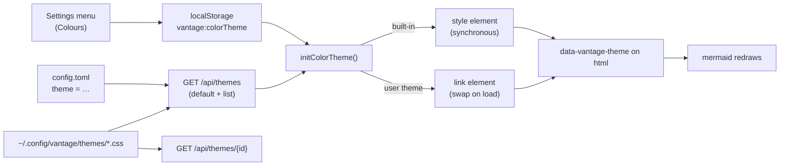

# Colour themes — a runtime palette over the colours the app already uses

**Status:** PROTOTYPE (2026-09-21), built as a pull request in answer to "feel
free to send a PR with your theme, but we might need a theme system too". The
mechanism below is implemented; the [Open Questions](#open-questions) are the
calls that belong to the maintainer, and none of them blocks merging this shape.

**The short version.** A colour theme is a CSS stylesheet that sets custom
properties on `:root` (light) and `:root.dark` (dark — the class the app already
toggles). Only the active theme's stylesheet is in the page. That is enough to
recolour almost the whole interface **without touching a component**, because
Tailwind v4 compiles every colour utility to `var(--color-<family>-<step>)` and
emits the defaults in `@layer theme`, which any unlayered stylesheet outranks.
Three things did not read a variable — the typography plugin's inlined palette,
the syntax-highlighting colours, and the scrollbars — and each is routed through
one in a way that restates the old value exactly. With the built-in look
selected, the page is the page it was before this change.

User-facing documentation: [Colour Themes](../../userguide/guides/themes.md).

**The most important section is [§4](#4-the-zero-change-guarantee-and-how-each-piece-keeps-it)**
— the guarantee is what makes this reviewable as a small change, and every piece
of the design is shaped by it.

---

## 1. The corpus, measured

The question that decided the design was how the components choose their
colours today. Counted over the component sources when this was designed — the
`.ts`/`.tsx` files under `frontend/src` and `packages/vantage-md/src`, tests
excluded, matching each class token of a string literal against
`<prefix>-<family>-<step>` (plus `white`, `black` and the opacity form), and
pairing a class with its `dark:` twin when both sit in the same literal:

| Measure | Count |
| --- | --- |
| Tailwind colour utility classes | 1,368 |
| Distinct light/dark pairings (`bg-white dark:bg-slate-900` counts once) | 193 |
| Of the classes, in the `slate` family | 925 |
| Literal colours (hex and `rgb()`) in [`frontend/src/index.css`](../../frontend/src/index.css) — review UI, anchor and flash highlights, print styles | about 300 |

Two readings of those numbers matter. First, the palette is **already
indirect**: 1,368 classes resolve through a few dozen variables, so recolouring
those variables recolours the classes. Second, the app speaks in Tailwind's
families by *role* — two-thirds of it is `slate`, the neutral — and it picks a
step within a family for its lightness. That is a contract, even though nobody
wrote it down; this design writes it down.

## 2. The contract

A theme may set:

- **The ramps**: `--color-<family>-<step>` for `slate` (neutral surfaces and
  text), `blue` (accent), `purple` (review, secondary accent), `red` (danger),
  `amber` (warning), `green` (success), and the minor families `gray`, `indigo`,
  `emerald`, `yellow` and `orange`. Each ramp must stay in Tailwind's order, `50`
  lightest to `950` darkest, because that order is the only thing a component's
  choice of step relies on.
- **`--color-white` and `--color-black`.** White is two roles at once — the
  light page and the ink on accent buttons — which is why the built-in
  Catppuccin sets it to the flavour's base in light mode and leaves it white in
  dark.
- **Tones**: `--vantage-tone-<tone>-{accent,ink,wash,chip}`, which already
  existed as variables in `packages/vantage-md`'s directive stylesheet.
- **Code roles**: `--vantage-code-{fg,comment,keyword,string,number,title,tag,attr,builtin,meta,addition,deletion}`.
- **Scrollbars**: `--vantage-scrollbar-thumb` and `--vantage-scrollbar-thumb-hover`.

Mermaid diagrams are part of the contract without variables of their own: under
a theme, the seven colours Vantage hands mermaid are read back from the `slate`
steps the built-in hex values were chosen from.

### 2.1 Delivery

- **Built-ins ship in the bundle.** `default` (named "Vantage") has no
  stylesheet; `catppuccin` is
  [`frontend/src/themes/catppuccin.css`](../../frontend/src/themes/catppuccin.css)
  and `lila` is [`frontend/src/themes/lila.css`](../../frontend/src/themes/lila.css),
  both inlined at build time so a stored choice applies **before the first paint**
  rather than after a request.
- **User themes are files.** `GET /api/themes` lists
  `~/.config/vantage/themes/*.css`, re-reading the directory on every request so
  a new file needs no restart, and `GET /api/themes/{id}` serves one with
  `Cache-Control: no-cache`. An id must match `^[a-z0-9][a-z0-9_-]{0,63}$`,
  which is also what closes path traversal: no dot, so no `..` and no dotfile.
  It is lowercase because macOS's filesystem folds case and Linux's does not:
  with capitals, `Catppuccin.css` listed beside the built-in it meant to
  replace and `Default.css` slipped past the reserved id on a Mac. For the same
  reason a stylesheet is served only under an id the listing shows, compared
  byte for byte, never by opening `<id>.css` and letting the filesystem match
  it. Only regular files count (a symlink to one is followed), so a FIFO or a
  directory named `x.css` is not a theme.
  Both routes are global rather than per-repository, because a palette is a
  reader's setting. The server side is
  [`internal/api/theme_handlers.go`](../../internal/api/theme_handlers.go).
- **One managed element.** The active theme is a single element with id
  `vantage-color-theme`, appended at the end of `<head>` so it follows the app
  stylesheet. A user theme's `<link>` is added beside the previous theme and
  swapped in only on `load`, and only then is `data-vantage-theme` set on
  `<html>` — so mermaid, which watches that attribute, redraws once, with the
  variables already live. A theme that fails to load is dropped and the previous
  one stays. The client side is
  [`frontend/src/lib/colorTheme.ts`](../../frontend/src/lib/colorTheme.ts).
- **Precedence.** A choice stored in this browser, then `theme = "…"` from the
  user's `config.toml` (read at startup by `config.LoadUserTheme`, in serve and
  daemon mode alike), then the built-in look. Choosing the built-in look in the
  menu stores `"default"` explicitly, so a configured default cannot override a
  reader who chose none.
- **A user theme with a built-in's id replaces the built-in.** That is how a
  reader tweaks Catppuccin: copy it into the themes directory and edit. The id
  `default` cannot be taken, because it means "no stylesheet". A stored
  built-in is applied at once and the same-id user file replaces it when
  `/api/themes` answers, so the id alone does not say which palette is live:
  `data-vantage-theme-source` (`built-in` or `user`) is set beside the id, and
  mermaid's palette key includes it, or diagrams drawn in between would be
  served from the cache in the built-in's colours.
- **Static exports get the built-ins only.** There is no server to list or serve
  a user's files, and the configured default lives in the reader's config, not
  in the export.

## 3. The three things that did not read a variable

### 3.1 Prose: the typography plugin inlines its palette

`@tailwindcss/typography` writes `prose-slate` as literal colours into
`--tw-prose-*`, so a theme could recolour every component and still leave the
document body — the part a reader looks at most — in Tailwind's slate. The fix
restates each `--tw-prose-*` and `--tw-prose-invert-*` value in `.prose-slate` as
the step it came from (`var(--color-slate-700)` for body text, and so on),
unlayered so it outranks the plugin's copy in `@layer utilities`.

That restatement has a trap, and it is the one place this design can be built
wrong in a way that looks right in light mode. Unlayered, the restated
`--tw-prose-body` also outranks the plugin's *invert* mapping, so dark mode
would render light-mode prose colours. The block after it re-asserts
`--tw-prose-X: var(--tw-prose-invert-X)` for both ways the app asks for inversion
(`.prose-invert`, and `.dark\:prose-invert:where(.dark, .dark *)`, which is what
`dark:prose-invert` compiles to under the app's `@custom-variant dark`).

### 3.2 Code: GitHub's highlight.js palette is literal

The built-in look keeps `highlight.js/styles/github.css` and the existing
`.dark .hljs-*` overrides untouched. The role rules apply **only** under
`:root[data-vantage-theme]` (and `:root[data-vantage-theme].dark`), with
`!important` because the dark override they replace uses it. Each role falls back
to a step of the theme's own ramps — keyword to `purple`, string to `green`,
title to `blue` — so a theme that only sets ramps still gets code that belongs to
it. The rules sit in `@media screen`: their selectors outrank the print block's
`.prose * { color: … !important }`, so unscoped they printed a theme's syntax
colours — Mocha's pastels — on print's near-white `pre`. A themed page prints as
the built-in look does.

### 3.3 Scrollbars

The four thumb colours read `--vantage-scrollbar-thumb(-hover)` with the old hex
as the fallback. Nothing in the built-in look sets the variable.

## 4. The zero-change guarantee, and how each piece keeps it

With the built-in look the app must be pixel-identical to what it was. The
guarantee is kept **by construction** rather than by tuning, piece by piece:

| Piece | Why the built-in look is unchanged |
| --- | --- |
| Theme stylesheet | Under `default` there is no managed element in the page at all |
| `data-vantage-theme` | Absent under `default`, so every rule gated on it — the code roles — matches nothing |
| Prose restatement | Each value is the very `slate` step, `white` or `black` the plugin inlined, and Tailwind's own variables still define those steps |
| Invert re-assertion | Restores the mapping the plugin already had; it only exists because of the restatement above |
| Scrollbars | The variable is unset, so the fallback — the old hex — applies |
| Mermaid | The palette key is exactly the old mode key (`default` / `dark`), so the SVG cache and loader behave as before; the theme variables are the old hard-coded hex, verbatim, with no DOM read and no colour conversion to round |
| Tones, print styles, review UI | Untouched |

The check for a change to any of these is a before/after screenshot comparison
with the built-in look selected, in both modes, on a document with prose, code,
callouts, a table and a mermaid diagram.

## 5. Why runtime variables now, and not a semantic-token migration

The obvious "proper" theme system is semantic tokens: `bg-surface`,
`text-muted`, `border-subtle`, each a variable a theme sets. It is the better end
state, and this design is not an argument against it. It is an argument about
order:

- **It is a rewrite of nearly every component.** 1,368 classes and 193 distinct
  pairings have to be mapped onto a token vocabulary, and each mapping is a
  judgement. That is not a diff a maintainer can review for correctness, and on a
  `main` that moves daily it would conflict with everything in flight.
- **The token vocabulary is the maintainer's design decision**, not a
  contributor's. Choosing names in a drive-by PR presumes the answer.
- **It cannot keep the zero-change guarantee cheaply.** 193 pairings collapse
  onto fewer tokens, so the default look shifts somewhere unless every pairing
  gets its own token — which is the Tailwind palette again under new names.
- **Nothing here is wasted by doing it later.** A future semantic token is
  defined *in terms of* the ramps (`--surface: var(--color-slate-50)`), so
  themes written against this contract keep working through a migration. See
  [OQ-CT1](#OQ-CT1).

## 6. Alternatives considered

- **Themes compiled at build time** (a Tailwind `@theme` block per theme, one CSS
  bundle each). Rejected: the frontend is embedded in the binary, so a reader
  could never add a theme without rebuilding Vantage.
- **Every theme in the page, scoped by selector** (`[data-theme=x] { … }`).
  Rejected: user themes are arbitrary files, so the server would have to rewrite
  their selectors, and authors could no longer write the plain `:root` /
  `:root.dark` they would write anywhere else. One active stylesheet keeps
  specificity to two cases.
- **A palette as data** (TOML or JSON of colours, turned into variables by the
  server). Rejected: it needs a schema and a validator in two languages, and it
  loses what CSS already gives an author for free — `color-mix()`, `oklch()`,
  one variable defined from another. Catppuccin's ramps are derived that way.
- **Filters** (`hue-rotate`, `invert`). Rejected: they recolour images and
  diagrams along with the chrome.
- **Converting the review UI's literals in this change.** Deferred: most of
  those values (301 of the 342) are Tailwind **v3** palette steps written as
  `rgb()`, and most of the 41 hex ones are GitHub's own (`#d0d7de`, `#24292f` …).
  Tailwind v4 defines its steps in `oklch()`, which differ from the v3 values in
  the last digits, so moving them onto ramps shifts the built-in look,
  which breaks [§4](#4-the-zero-change-guarantee-and-how-each-piece-keeps-it). See
  [OQ-CT2](#OQ-CT2).

## 7. What is not themed yet

- **The review UI's roughly 300 literal colours** in
  [`frontend/src/index.css`](../../frontend/src/index.css) — highlights, inline
  comment cards and their states. Under a dark theme whose surfaces differ much
  from Tailwind's slate, these are the parts that will look out of place.
- **A few accents outside the review UI**, literal in the same file: the heading
  `¶` anchors and the `#L42` line-anchor highlight are Tailwind v3's blue, and
  the content-changed flash and the copy-error toast are amber. Tailwind v4's
  steps are `oklch()` values that differ from those `rgb()` literals in the
  last digits, so moving them onto `var(--color-blue-500)` would shift the
  built-in look; they belong with [OQ-CT2](#OQ-CT2).
- **Print**, deliberately: the print styles ignore the theme, so a themed page
  prints exactly as the built-in look does in the same mode. That forces prose
  text and surfaces light; in dark mode code keeps the built-in dark token
  colours, as it did before themes existed.
- **Static exports** carry the built-ins only ([§2.1](#21-delivery)).

## 8. Risks

- **The contract is Tailwind's variable names.** A Tailwind major that renames
  `--color-*` breaks every theme silently. The mitigation is that the names are
  written down in one place, the user guide, and a rename would be as visible to
  a reviewer as any other breaking change there.
- **A new family nobody themes.** A component that starts using, say, `teal` is
  unthemed until themes set it. The role table in the user guide is where a new
  family has to be added.
- **Equal specificity resolves by order.** The tone variables in the directive
  stylesheet are declared on `:root`, like a theme's light values, so a theme
  wins only because its element comes later in `<head>`. The production bundle
  guarantees that; a future lazily-loaded stylesheet that also sets `:root`
  variables would not.
- **A theme is served to anyone who can reach the server** — the same audience as
  the documents — and CSS can fetch remote fonts and images. It is the reader's
  own file in their own config directory, so this is noted rather than
  mitigated.

## 9. Follow-ups

1. Semantic tokens, defined over the ramps ([OQ-CT1](#OQ-CT1)).
2. The review UI's literals onto ramps or tone variables ([OQ-CT2](#OQ-CT2)).
3. A display name for user themes. The menu shows the id today, because the
   directory listing has nothing else to go on (`ThemeInfo.name` exists for
   this and equals the id until then); a leading comment such as
   `/* name: Solarized Dark */` would be enough. A user theme replacing a
   built-in already keeps the built-in's name.
4. A theme specimen page beside [`docs/gallery/`](../gallery/README.md), so a
   theme author can check every ramp step, tone and code role on one screen.

## Decision Ledger

| ID | Ruling / Decision | Date | Settled in |
| :--- | :--- | :--- | :--- |

No question is settled yet; rulings move here from the list below.

## Open Questions

Settled questions move to the [Decision Ledger](#decision-ledger) above.

1. 💬 **OQ-CT1: Migrate the components to semantic tokens next?** The contract
   in [§2](#2-the-contract) is Tailwind's families by role. A token layer
   (`--surface`, `--text-muted`, …) defined over those ramps would make themes
   easier to write and the components easier to read, at the cost of the rewrite
   [§5](#5-why-runtime-variables-now-and-not-a-semantic-token-migration)
   describes. Existing themes keep working either way.

   <!-- vantage: oq id=OQ-CT1 leaning="Yes, but after this lands and as its own series: a token vocabulary you name, defined over the ramps, migrated one area of the app per PR so each diff stays reviewable." -->

   _Leaning:_ yes, but after this lands and as its own series: a token
   vocabulary you name, defined over the ramps, migrated one area of the app per
   PR so each diff stays reviewable.

   **Answer:**

   > _(empty — fill in when decided)_

2. 💬 **OQ-CT2: Convert the review UI's literal colours, even though it shifts
   the built-in look slightly?** About 300 literals in
   [`frontend/src/index.css`](../../frontend/src/index.css) ignore every theme.
   Snapping each to the nearest ramp step makes them themeable but moves some of
   them by a shade in the built-in look, which this change promised not to do.

   <!-- vantage: oq id=OQ-CT2 leaning="Yes, in a separate PR that does only that, with before/after screenshots, so the shift is reviewed on its own rather than hidden inside the theme system." -->

   _Leaning:_ yes, in a separate PR that does only that, with before/after
   screenshots, so the shift is reviewed on its own rather than hidden inside the
   theme system.

   **Answer:**

   > _(empty — fill in when decided)_

3. 💬 🤷 **OQ-CT3: What should the settings control be called?** It is
   **Colours** today, a native select under the Light/Dark buttons. "Theme" is
   the obvious word, but the user guide already calls light and dark "themes"
   (the Dark Mode section of the features page), so the two controls would share
   a name. The repo's prose writes "colour"; the code's
   identifiers write `color`.

   <!-- vantage: oq id=OQ-CT3 leaning="Keep Colours: it says what changes and does not collide with light/dark, which the user guide already calls themes." -->

   _Leaning:_ keep **Colours**: it says what changes and does not collide with
   light/dark, which the user guide already calls themes.

   **Answer:**

   > _(empty — fill in when decided)_

4. 💬 **OQ-CT4: Should a repository be able to choose a theme?** The key would
   live in `.vantage.toml`, beside the starred list the server already reads
   there. Today a theme is purely the reader's setting.

   <!-- vantage: oq id=OQ-CT4 leaning="Not now. A palette is a reader's preference; if a repository ever gets a say, it should be a default below the reader's own choice, never above it." -->

   _Leaning:_ not now. A palette is a reader's preference; if a repository ever
   gets a say, it should be a default below the reader's own choice, never above
   it.

   **Answer:**

   > _(empty — fill in when decided)_

5. 💬 **OQ-CT5: Ship Catppuccin and Lila as built-ins, or only the mechanism?**
   A built-in is a palette the project then maintains. Catppuccin is the worked
   example the user guide points at, and the proof that the contract is complete
   enough to restyle the whole app. Lila is the theme this PR's author uses day
   to day — the palette his terminal, editor and window borders share — and the
   one that shows a theme may break ramp order on purpose (its recessed dark
   chrome). Either could equally live outside the tree as a user theme.

   <!-- vantage: oq id=OQ-CT5 leaning="Ship Catppuccin: a built-in keeps the contract honest, because any gap shows up in a theme the maintainers look at, and it doubles as the documentation's example. Lila is optional — it can move out to a user theme if two built-ins are one more than you want to maintain." -->

   _Leaning:_ ship Catppuccin. A built-in keeps the contract honest, because any
   gap shows up in a theme the maintainers look at, and it doubles as the
   documentation's example. Lila is optional: it can move out to a user theme if
   two built-ins are one more than you want to maintain.

   **Answer:**

   > _(empty — fill in when decided)_
