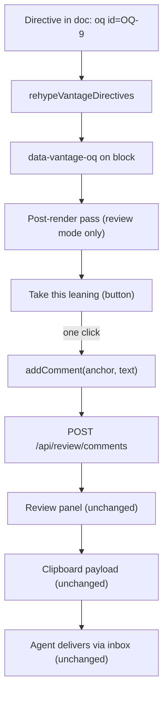

# Inline markup GitHub cannot see

**Status:** DECIDED, 2026-08-31. Reviewed and revised the same day; all five
open questions are settled — see the [Decision Ledger](#decision-ledger). The
sanitiser hardening in [§8](#8-security-the-injection-surface-and-how-it-closes)
is being built now; the directive work is not started. Every claim about
existing code was verified against the tree on 2026-08-31, and the pipeline and
CSS-output behaviour in §2.2 and §8 was **measured** by running the real chain,
not read off the plugin docs.

**The short version.** Carry Vantage-only markup in **HTML comments with a
`vantage:` sentinel** — `<!-- vantage: callout tone=warning -->`. GitHub drops
them, every other Markdown renderer drops them, and a text editor shows one dim
line. A new remark/rehype plugin, `rehypeVantageDirectives`, sits in the **one
slot where comments still exist** — after `rehype-raw`, before `rehype-sanitize`
— and compiles each comment into `data-vantage-*` attributes on the block that
follows it. Directive values are never CSS and never colours: they are
**semantic tokens** — `note`, `warning`, `caution` — that the *theme* maps to
colour, so a document says what a section means and light, dark, and every
future theme decide how it looks. The one-click Open Question button is not a
new protocol at all — it is a pre-filled call to the reviewer command that the
comment popover already calls.

**The most important sections are [§7](#7-the-degradation-rules) and
[§8](#8-security-the-injection-surface-and-how-it-closes)** — the degradation
rules are the contract the rest of the doc is held to, and §8 is where this
feature pays a debt it did not create: the sanitiser lets arbitrary inline CSS
through today, and closing that is **step 1 of the build order**, ahead of any
directive work.

**Reads with:** [`agent-cli.md`](agent-cli.md) (the checker that would validate
this markup, and the house style this doc follows),
[`review-state-architecture.md`](review-state-architecture.md) (why §5.2 rides
an existing command instead of inventing a channel), and the user-facing
[`../../userguide/review-inbox.md`](../../userguide/review-inbox.md) (the
protocol as agents are told it today).

---

## 1. Verdict up front

**Use HTML comments with a `vantage:` sentinel.** Nothing else degrades as well,
and the alternatives that degrade at all (§12) buy nothing for the cost.

Five principles carry the design. Later sections cite them by number.

- **P1. The document is the artifact; markup annotates it.** A directive may
  change how a block *looks* or what affordances hang off it, never what the
  document *says*. Delete every directive and the prose is unchanged — that is
  the test.
- **P2. Values are semantic tokens — never styles, never colours.** A directive
  names what a section *is* (`tone=warning`), never what it should *look like*.
  The theme owns the mapping from token to colour, so one document renders
  correctly in light, in dark, and in themes that do not exist yet. No directive
  ever contributes a byte to a `style` attribute. Hard boundary, not a v1
  simplification.
- **P3. Unknown is inert, never fatal.** An unrecognised name, key, or value is
  dropped silently where it fails to resolve — no error state, no red box, no
  console spew a reader can trigger with a typo. This is what makes an older
  Vantage safe against a newer document.
- **P4. Ride existing channels.** Review affordances go through the reviewer
  commands that already exist (§5.2). We do not open a second path from document
  to server; [`review-state-architecture.md`](review-state-architecture.md) is
  what happens when a document *becomes* a channel.
- **P5. Markup is a hint.** Every capability answers "what if it isn't there?"
  with today's behaviour, unchanged.

> [!IMPORTANT]
> **This is not the `<!-- changelog -->` protocol coming back.** That design
> failed because the document was used as a *message channel* — writes that had
> to be consumed, deduped, and remembered
> ([`review-state-architecture.md`](review-state-architecture.md) §1). A
> directive here is **declarative and idempotent**: it is read on every render,
> means the same thing every time, and nothing consumes it. Re-reading it a
> thousand times has no effect. The failure mode that killed the changelog block
> — "is this re-read a new message or one I already recorded?" — is not
> expressible here, because there are no messages. Per **P4**, anything that
> *would* be a message goes through the command endpoints instead.

## 2. What exists today, precisely

### 2.1 There is one copy of the pipeline

The remark/rehype chain is defined once, in
[`pipeline.ts`](../../packages/vantage-md/src/pipeline.ts), and three call sites
consume it:

| Where | What it is |
| :--- | :--- |
| [`pipeline.ts:96-108`](../../packages/vantage-md/src/pipeline.ts#L96-L108) | `buildPipeline(options)` — the only place the plugin list and its order exist. |
| [`renderMarkdown.ts:82-97`](../../packages/vantage-md/src/renderMarkdown.ts#L82-L97) | String-in, HTML-out. Feeds the CLI checker, `resolveLinks`, and `renderMermaidBlocks`. |
| [`MarkdownViewer.tsx:725-726`](../../frontend/src/components/MarkdownViewer.tsx#L725-L726) | The app's `<ReactMarkdown>`, handed both lists as props. |
| [`vantage-md/src/MarkdownViewer.tsx:221-222`](../../packages/vantage-md/src/MarkdownViewer.tsx#L221-L222) | The package's own exported React viewer, likewise. |

The order is `rehypeRaw` → `rehypeSourceLines` → `rehypeSanitize` →
`rehypeSlug` → `rehypeHighlight` → `rehypeKatex`, with
`allowDangerousHtml: true` passed to `remark-rehype`
([`renderMarkdown.ts:95`](../../packages/vantage-md/src/renderMarkdown.ts#L95)),
which is why raw HTML reaches `rehype-raw` at all. `rehypeSlug`'s position after
the sanitiser is load-bearing, not incidental: `rehype-sanitize`'s default schema
clobbers `id` with the prefix `user-content-`, so slugging first turns every
`#heading` link in every document into a dead anchor.

> [!WARNING]
> **The duplication this feature had to remove first.** Until step 2 of §11 the
> chain was written out three times, in the same order each time, and none of
> the three arrays was derived from another — they were copies kept in sync by
> hand. A directive plugin added to one would have produced a document that
> styles in the app and renders bare through the package's own viewer, or
> through the checker, with no error anywhere; and a checker that does not see
> directives is a checker that cannot validate them (§5.3). That is why §6.4 was
> a prerequisite rather than a nicety, and it is the reason `pipeline.ts` exists.
> The mdast half was in fact copied a **fourth** time, in the checker's own
> [`core/document.ts`](../../packages/vantage-check/src/core/document.ts), under
> a comment claiming it was "the same processor the viewer parses with"; it now
> calls `buildRemarkPlugins()` and the claim is true.

### 2.2 What actually happens to a comment (measured)

This is the fact the implementation turns on, so I ran it. Feeding
`<!-- vantage: section tone=warning -->` through the real chain:

- **After `rehype-raw`:** the comment is a first-class hast node —
  `{type: "comment", value: " vantage: section tone=warning "}` — sitting at root
  level as a sibling of the surrounding blocks, and it **carries full position
  data** (`start.line`, `end.line`), exactly like an element does.
- **After `rehype-sanitize`:** the node is **gone**. `rehype-sanitize` drops
  comment nodes outright; they are not in its `tagNames` allowlist and there is
  no schema key that readmits them. The rendered HTML contains no trace.

Two consequences:

1. **There is exactly one slot for the plugin**: after `rehypeRaw`, before
   `rehypeSanitize`. Downstream of the sanitiser the information no longer
   exists. This is the same slot `rehypeSourceLines` already occupies
   ([`pipeline.ts:98`](../../packages/vantage-md/src/pipeline.ts#L98)), which is
   convenient: the precedent is set and the ordering constraint is already
   understood in this codebase. Since step 2 the slot is marked in the code —
   [`pipeline.ts:100-104`](../../packages/vantage-md/src/pipeline.ts#L100-L104) —
   so wiring the plugin in is one `push` in one file.
2. **The sanitiser deleting comments is a feature.** The plugin consumes the
   comment and emits attributes; the sanitiser removes the original. Nothing
   Vantage-specific reaches the DOM except attributes we deliberately
   allowlisted, and an unrecognised directive leaves *nothing* — **P3** for free.

Also measured, because it bears on scoping: a comment immediately before a
heading parses as that heading's preceding sibling whether or not a blank line
separates them. "Attach to the next block" is positionally well-defined.

### 2.3 How review affordances attach today

Not through React. [`useReviewHighlights`](../../frontend/src/hooks/useReviewHighlights.ts)
is an imperative post-render pass over the container: it finds blocks by
`[data-source-line="N"]`, wraps matched text in `<mark>`
([`useReviewHighlights.ts:280`](../../frontend/src/hooks/useReviewHighlights.ts#L280)),
and injects comment cards, reply textareas, and buttons as raw DOM nodes
([`useReviewHighlights.ts:470-562`](../../frontend/src/hooks/useReviewHighlights.ts#L470-L562),
[`786-861`](../../frontend/src/hooks/useReviewHighlights.ts#L786-L861)).

That matters twice. It is the **precedent** for how §5.2's button gets on the
page — an existing pattern, not a new one. And it is the reason `data-*`
attributes are the right compilation target: the hook already navigates the
rendered DOM by attribute, so a directive that lands as an attribute is
immediately reachable by exactly the machinery that reads anchors today.

### 2.4 How an Open Question gets answered today

Four actions. Hover a block in review mode, click it
([`MarkdownViewer.tsx:530-570`](../../frontend/src/components/MarkdownViewer.tsx#L530-L570)),
type into `ReviewCommentPopover`, press Ctrl/Cmd-Enter
([`ReviewCommentPopover.tsx:104`](../../frontend/src/components/ReviewCommentPopover.tsx#L104)).
That calls `addComment(anchor, comment, fallbackText)`
([`useReviewStore.ts:463-495`](../../frontend/src/stores/useReviewStore.ts#L463-L495)),
which optimistically appends to local state and then `POST`s to
`/review/comments` through `runCommand`
([`useReviewStore.ts:414-444`](../../frontend/src/stores/useReviewStore.ts#L414-L444)).

The agent picks the comment up when the reviewer copies the thread to the
clipboard, and answers via the inbox
([`../../userguide/review-inbox.md`](../../userguide/review-inbox.md)).

**The typing is the only manual part.** The anchor comes from the click; the
delivery is one function call. A button calling `addComment` with a pre-composed
string is not a new protocol — it is the same command with the textarea skipped.
That is the whole of §5.2, and why it is cheap.

### 2.5 Static export renders client-side — which cuts both ways

I assumed static export rendered Markdown to HTML in Go. It does not, and the
truth is better for §7's D5 and worse for D4.

`vantage build` pre-renders **every API response to JSON** and copies the
embedded SPA alongside it
([`builder.go:110-140`](../../internal/static/builder.go#L110-L140)); document
content is written out **verbatim as Markdown**
([`builder.go:284-291`](../../internal/static/builder.go#L284-L291)), and
`index.html` gets a `window.__VANTAGE_STATIC__=true` sentinel
([`builder.go:346`](../../internal/static/builder.go#L346)) that an axios
interceptor uses to rewrite API calls into fetches of those JSON files
([`staticMode.ts:121-131`](../../frontend/src/lib/staticMode.ts#L121-L131)).
There is no Go Markdown library in the tree at all. **The exported site runs the
same React viewer**, so it gets directive styling for free — D5 costs nothing
for anything decorative.

> [!WARNING]
> **Review mode is not disabled in static builds, and that is a trap for §5.2.**
> The Review toggle is gated only on `!showRaw` and a `.md` extension
> ([`ViewerPage.tsx:1148-1174`](../../frontend/src/pages/ViewerPage.tsx#L1148-L1174))
> — there is no `isStaticMode()` check. Meanwhile `internal/static/scheme.go`
> emits no `review` paths, and the interceptor coerces every write to a GET of a
> file that does not exist. So review mode in an exported site *renders*, and
> every write silently fails. A one-click button inherits that: it would look
> live and do nothing. **D4 therefore requires an explicit static-mode gate**
> (§5.2), which is a gate the existing typed-answer path arguably needs too.

There is also a **raw view** — a `<pre>` of the source text
([`ViewerPage.tsx:1467-1491`](../../frontend/src/pages/ViewerPage.tsx#L1467-L1491)).
Directives are visible there, as literal comment text. That is correct: raw view
shows the file, and the file contains the comment.

## 3. Choosing the carrier

Five candidates, measured against the same document on GitHub and in the chain.

| Carrier | On GitHub | Reaches the tree? | Scoped to a place? | Verdict |
| :--- | :--- | :--- | :--- | :--- |
| **HTML comment** `<!-- vantage: … -->` | Invisible | Yes — comment node with position (§2.2) | Yes, positionally | **Adopted** |
| Fenced block, unknown info string | **Visible code block** | Yes | Yes | Rejected — fails D1 outright |
| Link-reference definition | Invisible | **No** — stripped in mdast, never reaches hast | No — definitions are file-scoped | Rejected |
| Frontmatter key | Rendered as a metadata card | Yes, out-of-band | **No** — whole-file only | Rejected as *the* carrier; kept for file-scope (§4.5) |
| `:::note` directive syntax | **Visible literal `:::note`** | Only with `remark-directive` | Yes | Rejected — fails D1 |

Measured, not assumed: a fence tagged ` ```vantage ` renders as
`<pre><code class="language-vantage">` — a grey box of config in the middle of
the prose on GitHub. `:::note{color=blue}` renders as a literal paragraph
reading `:::note{color=blue}`. Both are exactly the "garbage text" outcome D1
exists to forbid.

The link-reference definition is the interesting near-miss: genuinely invisible
on GitHub — `[vantage-style]: #s "color=blue"` emits nothing — so it passes D1.
It fails on **placement**. `remark-parse` lifts definitions out of the content
flow into a file-level table, so by the time anything can read them, "which
section was this next to?" is unanswerable. A carrier for section styling that
cannot name its section is not a carrier. Rejected, but honourably.

## 4. Syntax specification

### 4.1 Grammar

```text
directive   := "<!--" ws* "vantage:" ws* name ( ws+ pair )* ws* "-->"
name        := [a-z][a-z0-9-]*
pair        := key "=" value
key         := [a-z][a-z0-9-]*
value       := [A-Za-z0-9_.:#-]+ | quoted
quoted      := '"' [^"]* '"'
```

One directive per comment. The `vantage:` sentinel is mandatory — it is what
keeps ordinary editorial comments (`<!-- TODO: rewrite this -->`) from being
parsed as markup, and it makes the parse a cheap prefix test on every comment
node rather than a grammar attempt.

**Why the full word rather than a terser `v:`.** Two reasons, and neither is
readability — the authors and readers of these directives are **agents**, not
people skimming a document. First, it is **greppable**: `rg 'vantage:'` finds
every directive in a tree with no false positives, which is what R3's
orphan-detection rule and any future migration depend on. Second, it is long
enough not to collide — with a human's own `<!-- v: … -->` shorthand, or with
another tool that decides to claim a one-letter prefix in a Markdown comment.
Six characters bought once per directive is a cheap price for a namespace that
is actually ours.

Anything that does not match is **not a directive**. It is left alone, the
sanitiser removes it as it removes every comment today, and nothing is logged
(**P3**).

### 4.2 Scoping

Three scopes, distinguished by where the directive sits — not by a `scope=` key,
because position is already unambiguous and a key that can disagree with
position is a bug generator.

| Placement | Scope | Meaning |
| :--- | :--- | :--- |
| Immediately before a **heading** | That heading **and its section** — everything until the next heading of the same or shallower depth | Section styling |
| Immediately before a **non-heading block** | That one block | Block styling, badges |
| Inside **frontmatter** (`vantage:` key) | The whole file | Document-level chrome (§4.5) |

There is deliberately **no range syntax** — no `<!-- vantage: end -->`, no
paired open/close. A paired form has an unmatched-close failure mode, and
Markdown's heading structure already provides the only ranges anyone asked for.
If a real need for arbitrary ranges appears, it can be added later without
breaking any of this; adding it now buys a failure mode for a use case nobody
has stated.

Two directives before the same target **merge**, last-key-wins on conflict. A
directive with nothing after it (end of document) is inert.

### 4.3 The token vocabulary is semantic, never chromatic

**A document never names a colour.** It names what a section *is*; the theme
decides what that looks like. This is **P2**, and it is the difference between
markup that works in one theme and markup that works in all of them.

The vocabulary is the **GFM alert set Vantage already renders** — `note`, `tip`,
`important`, `warning`, `caution` — plus `muted` for de-emphasis:

| Key | Tokens | Means |
| :--- | :--- | :--- |
| `tone` | `note` `tip` `important` `warning` `caution` `muted` | The section's role — same five meanings as a `> [!WARNING]` callout, plus de-emphasis |
| `emphasis` | `strong` `normal` `quiet` | How much the section should pull the eye |
| `collapsed` | `true` `false` | Section renders inside `<details>`, closed |
| `badge` | `draft` `stale` `blocked` `done` `wip` | A small chip beside the heading |

**Why reuse the alert vocabulary rather than invent an importance scale.** An
author who knows `> [!WARNING]` already knows this — no second concept to learn,
and the words already carry agreed meanings, including on GitHub. And the
vocabulary is *closed by something other than our taste*: it is GitHub's set, so
"can we add one more?" has a principled answer instead of a debate.

> [!WARNING]
> **Vantage does not render GFM alerts today — verified 2026-08-31.** I nearly
> justified this choice on "the theme mapping already exists," and it does not.
> `remark-gfm` does not implement alerts; `> [!WARNING]` renders as a plain
> blockquote with the literal text `[!WARNING]` visible, and there is no alert
> CSS anywhere in `frontend/src` or `packages/vantage-md/src/styles/`. Worth
> knowing twice over, because
> [`styleGuide.ts`](../../packages/vantage-md/src/styleGuide.ts) instructs
> authors to write callouts that Vantage then renders as literal bracket text —
> a live gap, independent of this design.
>
> This makes the reuse argument *stronger*, not weaker. Building the `tone`
> palette produces exactly the six-colour light/dark treatment that rendering
> real GFM alerts needs, so the two features share one palette instead of
> arriving with two. Whoever ships alert rendering should consume these tokens.

`emphasis` is separate from `tone` on purpose: "this is a warning" and "shout
about it" are different claims, and collapsing them forces an author to
overstate severity to get visual weight.

**The mapping mechanism.** A token resolves to a **CSS custom property owned by
the theme**, never to a literal colour anywhere near the document:

| Token | Resolves to | Light | Dark |
| :--- | :--- | :--- | :--- |
| `tone=warning` | `var(--vantage-tone-warning)` | amber-toned | amber-toned, dark-adjusted |
| `tone=caution` | `var(--vantage-tone-caution)` | red-toned | red-toned, dark-adjusted |
| `tone=note` | `var(--vantage-tone-note)` | blue-toned | blue-toned, dark-adjusted |

The document carries `data-vantage-tone="warning"`. A stylesheet selects on that
attribute and reads the custom property; the property is defined once per theme.
**Adding a theme later touches one custom-property block and zero documents** —
that is the entire payoff of refusing colour names, and why it is worth the
small loss of expressive power. Light and dark are what exist today; the
mechanism does not care how many there eventually are.

There is no interpolation anywhere in the path, which is what makes §8.3 short.
It also sidesteps a build problem: this is Tailwind v4 with an empty `extend`
([`tailwind.config.js:7-8`](../../frontend/tailwind.config.js#L7-L8)) and a
`@source` scan over the package
([`index.css:8`](../../frontend/src/index.css#L8)), so a *computed* Tailwind
class name would never be emitted. Attribute selectors and custom properties in
a plain stylesheet have no such dependency.

### 4.4 What each capability looks like

Section styling — a warning-toned section, played loud, flagged stale:

```markdown
<!-- vantage: section tone=warning emphasis=strong badge=stale -->

## Migration path

The steps below predate the 2026-07 rewrite.
```

A collapsed appendix:

```markdown
<!-- vantage: section collapsed=true -->

## Appendix B — raw measurement dumps
```

A single block framed as a callout without blockquote syntax:

```markdown
<!-- vantage: block tone=important -->

Every delivery carries a nonce.
```

A one-click Open Question answer (§5.2):

```markdown
<!-- vantage: oq id=OQ-9 leaning="Back of the queue" -->

9. 💬 **OQ-9: Queue position on re-entry.** …

   _Leaning:_ Back of the queue.
```

Document-level chrome, in frontmatter (§4.5):

```yaml
---
title: "Adaptive levelling"
vantage:
  status-chip: in-review
  toc: section
---
```

**On GitHub, every one of these renders as the plain Markdown with the comment
line absent.** No box, no marker, no gap beyond the blank line that was already
there. That is the whole point of the carrier.

### 4.5 Frontmatter for file scope

Frontmatter is rejected as *the* carrier (§3) because it cannot point at a
section. It is the right home for genuinely file-scoped chrome, under a single
`vantage:` key so it stays out of the way of a user's own keys. Vantage already
parses and displays frontmatter, so this costs no new parsing — only a decision
to special-case one key.

## 5. Capabilities

Ranked by value over effort. §5.1 and §5.2 are the ask; §5.3 is what else earns
a place; §5.4 is what does not.

### 5.1 Section styling

**Value: medium. Effort: low** — it is the plugin plus a stylesheet.

Covered by `tone`, `emphasis`, `collapsed`, `badge` (§4.3). The plugin sets
`data-vantage-tone="warning"` and friends; CSS selects on the attribute and
reads a theme-owned custom property, so there is no class-name computation in
JavaScript at all — the mapping lives entirely in a stylesheet, which is the
least injectable form it could take.

Section-wide treatment needs one structural decision, and it is settled:
**stamp, do not wrap.** An attribute on the heading cannot style the paragraphs
after it — they are siblings, not children — so the plugin stamps every block in
the section rather than wrapping them in a `<section>`.

> [!WARNING]
> **Do not "clean this up" by introducing a wrapper element.** It is the tidier
> CSS and it is the wrong trade. The review anchor system, the `#L42` line
> anchors, and hover-to-comment block resolution all walk a **flat sibling
> structure** — `MarkdownViewer` resolves an anchor by climbing to the closest
> `[data-source-line]` whose tag is in `ANCHOR_TAGS`
> ([`MarkdownViewer.tsx:97`](../../frontend/src/components/MarkdownViewer.tsx#L97))
> — and inserting a container between the prose root and the blocks is exactly
> the change that breaks one of those subtly rather than loudly. Extra
> attributes are cheap; a restructured tree is not.

Degradation: **D1** (invisible elsewhere), **D2** (unknown token → no styling),
**D5** (static export gets the same attributes, since it shares the plugin).

### 5.2 One-click Open Question answers

**Value: high. Effort: low.** This is the best thing in the doc, and it is
almost entirely built already.

```markdown
<!-- vantage: oq id=OQ-9 leaning="Back of the queue — the fix might interact with things that merged while it was out." -->
```

In review mode, Vantage renders a single button beside the question, labelled
**"Take this leaning"**. Clicking it calls `addComment(anchor, text, fallbackText)`
— [the same function the popover calls](../../frontend/src/stores/useReviewStore.ts#L463-L495)
— with:

- **anchor**: derived from the block the directive is attached to, using the
  existing `data-source-line` mechanism (§2.3), identical in shape to what a
  click-and-type would have produced.
- **text**: the `leaning` value, or a default of `"Take the stated leaning."`
  when `leaning` is absent.

The key is `leaning=` and the label is "Take this leaning" — deliberately the
same word, so the directive an agent writes and the button a reviewer clicks
name the same thing. **There is exactly one button, and it is affirmative
only.** A "Reject" button was considered and rejected: a rejection almost always
needs a reason, which means typing anyway, so the button would mostly produce
content-free rejections the agent then has to chase. The affirmative case is the
one where the reviewer genuinely has nothing to add, and it is the only case
worth a shortcut.

From there **nothing is new**. The comment is a comment. It rides `runCommand`
to `POST /review/comments`, appears in the panel, gets copied to the agent in
the ordinary clipboard payload, and is answered through the inbox. The agent
needs no new instructions, the server needs no new endpoint, and the inbox
protocol is untouched. Per **P4** this is a **macro over an existing command**,
which is the strongest form the feature could take.



Everything from `addComment` rightward already exists. The new code is the
plugin, the attribute, and a button.

Degradation: **D1**, **D4**, **D6** (a malformed `oq` directive yields no
button, never a broken one). The reviewer can *always* still type an answer; the
button never removes a path, only adds one.

D4 has teeth here. The button renders only when **all** of these hold: review
mode is on, the directive parsed, and `isStaticMode()` is false. That last
condition is the §2.5 trap — without it, an exported document shows a live-looking
button whose click is swallowed by the static interceptor. A button that fails
silently is worse than no button, because the reviewer believes they answered.

> [!TIP]
> The `leaning` string should restate the leaning rather than say `"yes"`. The
> comment is what the agent reads, and it is read with no memory of which button
> was clicked. `"yes"` next to a two-branch question is a support ticket.

### 5.3 What else earns a place

- **Per-section review status** (`badge=blocked`) — reuses the badge machinery
  from §5.1 for free. Ships with it.
- **Stale markers** (`badge=stale`) — same. The value is that a reader sees
  staleness *in the section*, not in a changelog nobody reads.
- **Document status chip** (frontmatter `status-chip`) — a small chip near the
  title. Cheap, and it makes `status: draft` in frontmatter visible rather than
  buried in a metadata card.
- **Machine-readable metadata for tooling** — this is the sleeper. Directives
  are already a structured, greppable, position-carrying annotation layer. The
  checker described in [`agent-cli.md`](agent-cli.md) can validate directive
  names and tokens with no rendering at all, which means typos get caught before
  a human sees a section that mysteriously did not style. Costs one rule in a
  tool that is being built anyway.

### 5.4 Explicitly iced

- **Diagram theming.** Mermaid has its own theming
  ([`MermaidDiagram.tsx`](../../packages/vantage-md/src/MermaidDiagram.tsx)).
  Piping directive tokens in means owning a translation layer between two theme
  vocabularies that will drift — and mermaid's `%%{init}%%` already does it,
  on GitHub too.
- **A TOC directive.** The outline is already computed from headings and
  navigable. A second one is maintenance for a feature the sidebar provides.
- **Author-chosen colours of any kind** — hex values, palette names, `bg=`.
  This was the original shape of "set a background colour", and the answer is
  no on two counts: it breaks the moment a second theme exists (§4.3), and a
  colour-shaped value is the injection surface §8.3 exists to not have. Semantic
  tokens cover the real need, which is *distinguishing* sections by meaning.

## 6. Implementation sketch

### 6.1 Where it lives

`packages/vantage-md/src/rehypeVantageDirectives.ts`, exported from
[`index.ts`](../../packages/vantage-md/src/index.ts) alongside
`rehypeSourceLines`. The package is the shared floor under both viewers and the
checker; anything less shared reintroduces §2.1's drift.

> [!NOTE]
> **`vantage-md` has no test runner of its own** — no test files, no vitest
> dependency, and `package.json` exposes only `build`, `dev`, `typecheck`,
> `prepublishOnly`. Its pipeline is tested from the *frontend* suite, which
> resolves `vantage-md` to the package's TypeScript source through a vitest
> alias, exactly as
> [`sourceLines.test.ts`](../../frontend/src/lib/sourceLines.test.ts) does for
> `rehypeSourceLines`. That is the pattern for this plugin's tests too: they
> live in `frontend/src/` and run under `npm run test` there.

### 6.2 The plugin

Between `rehypeRaw` and `rehypeSanitize` (§2.2 — the only slot). Per pass:

1. Walk the root's children. For each `comment` node, prefix-test for
   `vantage:`. Non-matches are skipped and left for the sanitiser.
2. Parse the grammar (§4.1). A parse failure drops the directive (**P3**).
3. Resolve `name` and each `key=value` against the **closed vocabulary**. An
   unknown name, key, or value is dropped — individually, so one bad key does
   not void a directive's good keys.
4. Determine the target from position (§4.2): the next sibling element.
5. Stamp `data-vantage-*` properties on the target (and, for section scope, on
   every following sibling until the next heading of same-or-shallower depth).
6. Leave the comment node in place. The sanitiser removes it.

Ordering note: it must run **before** `rehypeSourceLines` or after it, but never
depend on `rehypeSlug`, which runs post-sanitise
([`pipeline.ts:106`](../../packages/vantage-md/src/pipeline.ts#L106))
and so cannot supply heading ids to the plugin. If a directive ever needs a
slug, it computes its own.

### 6.3 The sanitiser change

Small and closed. In
[`sanitize.ts:43-48`](../../packages/vantage-md/src/sanitize.ts#L43-L48), add
the specific `data-vantage-*` properties to the `*` attribute list — **named
individually**, not by wildcard:

```diff
   "*": [
     ...(defaultSchema.attributes?.["*"] || []),
     "className",
     "style",
     "dataSourceLine",
+    "dataVantageTone",
+    "dataVantageEmphasis",
+    "dataVantageBadge",
+    "dataVantageCollapsed",
+    "dataVantageOq",
   ],
```

`rehype-sanitize` also supports value-level allowlisting (`["attr", …values]`)
— the belt to §6.2's braces. Even if a future refactor lets an unvalidated value
reach the tree, the sanitiser refuses anything outside the vocabulary. Both
layers, not either.

Note that `style` stays on the `*` list. It is not this change that makes it
safe — the declaration filter of §8.2 does, and that lands first (§11).

### 6.4 Prerequisite: one chain, not three — done

§2.1's duplication went first, as step 2 of §11. `vantage-md` exports
**`buildPipeline(options)`**, which returns `{ remarkPlugins, rehypePlugins }`,
and all three render sites consume it rather than re-declaring the order. The
package is the single place the chain is defined, which is the only reason R1 is
a mitigated risk rather than a certainty.

Two things the sketch above got wrong, and how they landed:

- **Both halves, not just rehype.** A `buildRehypePlugins({ bodyLineOffset })`
  would let a caller desync the `math` toggle, which spans both halves —
  `remark-math` parses the delimiters and `rehype-katex` renders the result. One
  options object covers both. The rehype-only builder stays module-private; the
  remark half is also exported on its own as `buildRemarkPlugins`, because the
  checker's mdast parser
  ([`core/document.ts`](../../packages/vantage-check/src/core/document.ts)) is a
  real single-half consumer and was itself a fourth copy.
- **The five toggles survive.** `renderMarkdown` gates `gfm`, `math`,
  `highlight`, `sourceLines` and `sanitize` on options while the two React
  viewers register everything; a fixed array would have silently changed what
  the CLI checker renders. `PipelineOptions` carries all five plus
  `bodyLineOffset`.

The checker's *lint-only* processor
([`rules/markdown.ts`](../../packages/vantage-check/src/rules/markdown.ts))
deliberately does **not** share the list. It omits `remark-math` on purpose, and
the omission changes findings: measured on two `$$…$$` blocks containing
`\left[ a, b \right]` and `a[0] = b[1]`, `no-undefined-references` reports three
findings without `remark-math` and none with it.

### 6.5 Frontend consumption

- **Styling**: pure CSS on attribute selectors. No JavaScript, so it works
  identically in the SPA and in static export.
- **The button** (§5.2): an addition to the existing post-render pass (§2.3),
  gated on `isReviewMode`, finding `[data-vantage-oq]` the same way the
  highlighter finds `[data-source-line]`.

## 7. The degradation rules

The user asked for graceful degradation and left the definition to me. Here it
is, as eight rules the rest of the doc is held to.

1. **D1 — Invisible elsewhere.** On GitHub, in any other Markdown renderer, and
   in a plain text editor, a document carrying this markup renders as if the
   markup were not there. Not "renders acceptably" — renders *identically*, with
   no visible artifact. This is what eliminates fenced blocks and `:::` syntax
   (§3).
2. **D2 — Unknown is inert.** An unrecognised directive name, key, or value
   produces *no styling* and no error. Per-key, not per-directive: one bad key
   does not discard its siblings.
3. **D3 — Forward compatible.** An older Vantage meeting a newer directive hits
   D2 and renders the plain document. There is no version negotiation and no
   minimum-version key, because D2 makes both unnecessary.
4. **D4 — Review affordances are additive, and never lie.** Anything
   review-related appears only in review mode, and never removes an existing
   path: with review mode off there is no button and no trace of one; with it
   on, typing an answer works exactly as it does today. **And a control that
   cannot work must not render** — per §2.5 that means an explicit
   `isStaticMode()` gate, because an exported site runs review mode with every
   write silently failing.
5. **D5 — Every renderer agrees.** The live viewer, the package's exported
   viewer, and the CLI checker share one plugin and one vocabulary. Static
   export is free here — it ships the same SPA (§2.5) — but the three
   hand-copied chains (§2.1) are not, which is why §6.4 is a prerequisite. A
   directive must not mean one thing in the app and another through the
   checker.
6. **D6 — Malformed degrades to plain, never to broken.** A hostile or
   malformed directive yields an unstyled document. It never yields a broken
   render, a thrown exception, an injected style, or a mis-wired button.
7. **D7 — Print and plain views are unaffected.** Styling is decorative;
   removing it loses nothing but decoration. `collapsed=true` in particular must
   **expand for print** — a collapsed section that prints as a closed
   `<details>` is content loss, which violates **P1**.
8. **D8 — The prose is authoritative.** Per **P1**, directives never change what
   the document says. A reader on GitHub gets the complete document. This is the
   rule that ices §5.4's content-changing ideas.

## 8. Security: the injection surface, and how it closes

### 8.1 The hole this feature closes

While verifying the sanitiser I measured something that is **not** caused by
this design and that this design must not make worse.

> [!CAUTION]
> **`style` is allowlisted on every element today, with no value filtering.**
> [`sanitize.ts:43-48`](../../packages/vantage-md/src/sanitize.ts#L43-L48) puts
> `"style"` on the `*` list, and `rehype-sanitize` does not parse CSS. Verified
> by running the real chain on 2026-08-31: a document containing
> `<div style="position:fixed;top:0;left:0;width:100vw;height:100vh;z-index:9999">`
> renders that div verbatim, full-viewport overlay and all. So does
> `style="background:url(https://evil.example/x.png)"`, which fires an
> outbound request when the block renders.
>
> This is not script execution — `expression()` is long dead and browsers block
> `javascript:` in CSS URLs — but it is a real full-page-overlay and
> render-time-beacon surface, reachable by anyone who can put a file in a served
> repository.

There is also **no sanitisation test anywhere in the repo** — grepping all 33
test files outside `packages/vantage-check/` for `sanitiz`, `xss`, `<script>`,
or `javascript:` returns nothing, so `sanitizeSchema` has zero coverage today.

**This feature fixes it rather than routing around it.** The hardening is step 1
of the build order (§11), ahead of any directive work, because §8.3 asserts a
security story against this sanitiser and that assertion should not rest on a
component known to pass arbitrary CSS. §8.2 is what was built; the paragraph
above describes the behaviour it replaced.

### 8.2 The hardening

Built as part of this work, in `packages/vantage-md/src/sanitize.ts`. It is
**not** a new pipeline stage — it uses `rehype-sanitize`'s own value-allowlist
form, `["style", SAFE_STYLE]`, so the filter runs inside the sanitiser that was
already there. Two constants carry it: `SAFE_STYLE_PROPERTIES`, a typographic
property allowlist, and `SAFE_STYLE`, the regex a whole `style` value must match.

Three rules do the work:

1. **Property allowlist.** A declaration whose property is not in
   `SAFE_STYLE_PROPERTIES` fails the match.
2. **No parentheses, anywhere.** This is what closes `url(…)` and
   `expression(…)` in one stroke — the network-beacon and legacy-script vectors
   — and it costs nothing, because KaTeX never emits a parenthesis.
3. **`position` may only be `static`, `relative`, or `absolute`.** `fixed` and
   `sticky` are the two that let an element escape its container and cover the
   page, and they are the two that are dropped.

Matching is **all-or-nothing**: one unrecognised declaration drops the entire
attribute, and the element renders unstyled rather than half-styled. That is the
safe direction to fail, and it satisfies **D6** — plain, never broken.

**Measured 2026-08-31, by rendering through the real chain rather than by
inspection:**

- **GFM tables need no inline CSS.** `remark-gfm` emits alignment as
  `align="left"` attributes on `th`/`td`. The `td`/`th` `style` entries in the
  schema were serving nothing the pipeline generates.
- **KaTeX needs a great deal.** A spread of twelve formulas emits **168** style
  attributes across ten distinct properties: `border-bottom-width`, `height`,
  `margin-left`, `margin-right`, `min-width`, `padding-left`, `position`, `top`,
  `vertical-align`, `width`.
- **The filter admits every one of them and rejects all six attack payloads**
  tested (`position:fixed` viewport takeover, `background:url(…)` beacon,
  `expression(…)`, `position:sticky`, a `data:` URL, and `calc()`). Widening the
  battery to twelve families and 258 attributes still rejects none — that is the
  assertion the sanitisation test makes, so a KaTeX release that starts using a
  new property fails the build instead of silently losing the attribute.

> [!CAUTION]
> **`position` cannot be banned outright without breaking KaTeX.** Measured:
> `$$\int_0^\infty f(x)dx$$` emits
> `margin-right:0.1945em;position:relative;top:-0.0006em;` — KaTeX uses
> `position:relative` to place integral limits. A blanket `position` ban renders
> integrals visibly wrong, which is why the rule enumerates values rather than
> dropping the property.

> [!WARNING]
> **KaTeX does not emit `style="true"`, and a first pass at this measurement
> said it did.** The claim came from matching `style="([^"]*)"` against KaTeX's
> output, which also matches the tail of MathML's `displaystyle="true"` on
> `<mstyle>`. Measuring with a word boundary — `\sstyle="` — the count is 258
> attributes and **zero** rejections.
>
> It is recorded rather than quietly deleted because the mistake is a trap
> anyone auditing this filter will hit: any measurement of "what does KaTeX put
> in `style`" that greps for `style="` is counting MathML booleans as CSS, and
> will conclude the filter is dropping real declarations when it is not.

**The honest residual.** A property allowlist does **not** fully close the
overlay class. `position: absolute` is permitted, so an element can still
overlap its neighbours *inside* the article container — smaller than a viewport
takeover, but not nothing. Closing it completely means containment in the
stylesheet rather than rules in the sanitiser, and it is not worth breaking
KaTeX's layout for a threat model where the attacker can already put files in
the repository.

That residual is a second, independent reason the directive vocabulary is
**closed tokens rather than CSS** (**P2**): the directive path adds no CSS at
all, so it inherits none of this.

### 8.3 Why directives cannot widen it

The attack this feature could introduce is
`<!-- vantage: section tone="url(https://evil/x)" -->` — an untrusted value
reaching a `style` attribute. Three independent things stop it, each sufficient
alone:

1. **The vocabulary is closed (P2).** `tone` accepts six token names. Anything
   else is not a value; it is dropped at step 3 of §6.2. There is no free-text
   value in the grammar that reaches rendering.
2. **The compilation target is not `style`.** Tokens become `data-vantage-*`
   attributes; the styling is a stylesheet selecting on them and reading a
   theme-owned custom property (§4.3, §6.5). No code path concatenates a
   directive value into a style string, because no code path builds a style
   string at all. A token cannot name a colour, so there is no colour-shaped
   value for an attacker to aim at.
3. **The sanitiser re-checks (§6.3).** Value-level allowlisting means an
   attribute carrying an unexpected value is stripped even if the plugin somehow
   emitted it.

The `oq` directive's `leaning` string is the one genuinely free-text value. It is
not a style and never becomes markup: it is the *body of a review comment*, and
it lands in the same store, through the same endpoint, as text a reviewer typed.
It inherits whatever escaping that path already applies and adds no new surface.

> [!WARNING]
> **Do not "simplify" the vocabulary into a colour passthrough.** It looks like a
> small generalisation — accept a hex value, put it in `style` — and it gives up
> two things at once: the theme independence that is the whole point of §4.3,
> and a design with no injection surface, in exchange for one whose only defence
> is the property allowlist and its acknowledged residual (§8.2).

### 8.4 Denial of service

None added. Ten thousand directives is ten thousand comments, which the parser
already handles, and the plugin is one linear pass over an unambiguous grammar.

## 9. Non-goals — what this does not license

- **Not a template language, and never text-changing.** No variables, no
  conditionals, no includes, no loops, no `<!-- vantage: replace … -->`. A
  document must read the same on GitHub as in Vantage — **P1** and **D8**, not
  negotiable.
- **Not a styling API, and not a palette.** No CSS, no class-name passthrough,
  no `style=` — and **no colour names at all**. A document says what a section
  means; the theme says what that looks like (§4.3). Extending the vocabulary is
  a code change with a review (**P2**).
- **Not a second review channel.** A directive never triggers a write on
  render — per **P4** and the changelog history, that is the failure mode we
  removed at cost. §5.2's button writes because a *human clicked it*, which is
  categorically different.
- **Not a layout engine.** No columns, no floats, no positioning, no widths.
- **Not frontmatter's replacement.** File-scoped chrome lives in frontmatter
  under one key (§4.5); the comment carrier exists for things frontmatter cannot
  point at.
- **Not a GitHub-rendering change.** We never ask readers to install anything or
  view documents anywhere in particular. If it does not degrade, it does not
  ship.

## 10. Risks

| Risk | Mitigation |
| :--- | :--- |
| **R1. Chain drift** — the plugin lands in one of the **three** hand-copied chains (§2.1) | **Closed in code.** §6.4 shipped as step 2: `buildPipeline` in `packages/vantage-md/src/pipeline.ts` is the one definition, all three render sites consume it, and a test asserts every renderer produces the same `data-source-line` numbers, the same unprefixed heading ids, and the same sanitiser result for one fixture. |
| **R2. Vocabulary creep** — every request adds a token until it is CSS by accretion | §9 is the defence, and §8.3 is the reason. Each new token is a code change; a request to name colours is a request to give up theme independence (§4.3). |
| **R3. Markup rot** — directives outlive the sections they describe, and `badge=stale` is itself stale | Checker rule (§5.3): a directive whose target no longer exists is a finding. Cheap because the checker is already being built. |
| **R4. Agents overuse it** — every document arrives rainbow-coloured | A style-guide rule, not a code rule. The `style-guide` command in [`agent-cli.md`](agent-cli.md) is where "use sparingly" belongs. |
| **R5. Section stamping is wrong for nested structure** — a directive on `##` stamping through a `###` that wanted its own treatment | Last-directive-wins within a section, resolved at stamp time. Stamping is settled (§5.1); this is the one detail of it to verify against a real nested document before shipping. |
| **R6. The one-click answer makes shallow answers easy** | Real, and partly the point — the cost being removed is typing, not thinking. §5.2's tip (restate the leaning) keeps the *comment* substantive even when the click is fast. |
| **R7. A live-looking button in a static export that silently does nothing** (§2.5) | The `isStaticMode()` gate in §5.2, enforced by **D4**. Worth noting the same hole exists for typed answers today — the gate is a fix to review mode generally, which this feature merely forces. |
| **R8. No sanitisation test exists** (§8.1), so a regression is invisible | Step 1 of §11 ships the repo's first sanitisation tests, covering the property allowlist, the `url(`/`expression(` rejection, and the `position` rule. |
| **R9. The style filter breaks KaTeX** — measured, not hypothetical: KaTeX emits ten properties including `position:relative` (§8.2) | Enumerate `position` values rather than dropping the property; match all-or-nothing so garbage drops silently instead of throwing. Pinned by a KaTeX battery in the sanitisation test, which fails if a KaTeX release starts emitting something new. |

**What it costs.** A vocabulary that becomes a compatibility promise, a
stylesheet that grows with it, and one more thing the checker must know about.

**What it deletes.** Nothing. This is purely additive — which is itself a mild
argument against it, and the reason §11 starts with the capability that has a
concrete complaint behind it.

## 11. What I would build, in order

1. **Harden the sanitiser** (§8.2) — the `style` value filter, with the repo's
   first sanitisation tests. **First, and before any directive work.**
   Not because the directive path depends on it — it deliberately does not — but
   because §8.3 asserts a security story *about this sanitiser*, and that
   assertion should not be written against a component that passes arbitrary
   CSS. It stands entirely alone and is worth doing if nothing else here ever
   ships.
2. **De-duplicate the render chain** (§6.4) — **done.** `buildPipeline` in
   `packages/vantage-md/src/pipeline.ts`, consumed by all three render sites and
   by the checker's mdast parser; the dead duplicate of `rehypeSourceLines` under
   `frontend/src/lib/` is gone. Fixed a real drift hazard and unblocks
   everything after it. No user-visible change: `renderMarkdown`'s output is
   byte-identical across two fixtures × eight option sets.
3. **The plugin and the `oq` directive only** (§5.2). Highest value, and it
   exercises the whole path — carrier, parse, attribute, sanitiser, post-render
   pass — on one directive with a concrete complaint behind it.
4. **The semantic vocabulary** (§5.1) — `tone`, `emphasis`, `badge`, with the
   theme's custom-property block. Attribute-selector CSS only, stamped not
   wrapped.
5. **`collapsed`**, with the print rule (**D7**) in the same commit. Separate
   because it is the one token that restructures rather than decorates.
6. **Checker rules** (§5.3) — directive name and token validation, plus R3's
   orphan check. Lands in the CLI, not here.
7. **Frontmatter chrome** (§4.5) — the status chip. Last because it is the
   smallest win.

Icebox in §5.4. Nothing there should ship without a new argument.

## 12. Alternatives considered

- **Fenced block with an unknown info string.** Rejected. Measured: renders as a
  visible grey code block on GitHub (§3). Fails **D1**, which is the constraint
  the user cared most about.
- **`:::note` container directives.** Rejected. Measured: renders as literal
  `:::note{color=blue}` text without `remark-directive`, which GitHub does not
  run. Fails **D1**. It is the nicest syntax to *write*, and that is not enough.
- **Link-reference definitions.** Rejected, narrowly (§3). Invisible on GitHub —
  it passes D1 — but `remark-parse` lifts definitions into a file-level table
  before rehype, so a directive cannot say which section it means.
- **Frontmatter as the only carrier.** Rejected as *the* carrier: cannot address
  a section. Adopted for file scope (§4.5).
- **A sidecar file** (`doc.md.vantage.json`). Rejected. Perfect degradation —
  GitHub never sees it — and it fails on everything else: it desynchronises the
  moment anyone edits the Markdown, doubles the files an agent must write, and
  makes "which section" a line number, which is the most fragile possible
  anchor.
- **Free-form CSS in directives.** Rejected on §8. This is the version a naive
  reading of "set a background colour" produces, and it is an injection vector
  with the current sanitiser.
- **A chromatic vocabulary** — `accent=amber`, `bg=blue`, palette names rather
  than hex. Rejected, and this was my original proposal. It reads as safe
  because the values are a closed set, and the safety is not the problem: a
  document that names a colour has **decided how it looks in every theme**,
  including themes that do not exist yet. Vantage already has light and dark, so
  the breakage is not hypothetical — an amber wash chosen against a light
  background is a different decision on a dark one. Semantic tokens move that
  decision to the only place that can make it correctly, which is the theme.
- **A bespoke importance scale** (`level=1..4`) instead of the GFM alert words.
  Rejected. It needs a legend nobody will read, whereas `warning` and `caution`
  already mean something to anyone who has written a callout — and the alert
  vocabulary already has light and dark treatments in the codebase, so the
  mapping exists rather than needing invention.
- **Extending the GFM callout syntax** (`> [!WARNING]`) with extra tokens —
  i.e. using the callout itself as the carrier. Rejected: GitHub renders an
  unknown callout type as a plain blockquote with the literal `[!FOO]` visible,
  so it fails **D1**. Note this is the *carrier* being rejected, not the
  vocabulary — §4.3 adopts the alert **words** while carrying them in a comment.
- **A directive that posts an answer directly to the server on render.**
  Rejected hard, on **P4** and on
  [`review-state-architecture.md`](review-state-architecture.md): that is the
  document-as-message-channel design that was removed at real cost. §5.2 writes
  only on a human click, through the reviewer's own command.

## Decision Ledger

| ID | Ruling / Decision | Date | Settled in |
| :--- | :--- | :--- | :--- |
| — | HTML comment with `vantage:` sentinel is the carrier | 2026-08-31 | §1, §3 |
| — | Plugin slots between `rehypeRaw` and `rehypeSanitize` — the only slot where comments exist | 2026-08-31 | §2.2, §6.2 |
| — | Values are closed-vocabulary tokens; no CSS reaches a `style` attribute, ever | 2026-08-31 | §4.3, §8.3 |
| — | Scope is positional (heading / block / frontmatter); no paired open-close range syntax | 2026-08-31 | §4.2 |
| — | One-click answers ride `addComment`, not a new endpoint or a new inbox verb | 2026-08-31 | §5.2 |
| — | Render-chain de-duplication is a prerequisite, not a follow-up | 2026-08-31 | §6.4, R1 |
| — | Diagram theming and TOC directives are iced | 2026-08-31 | §5.4 |
| OQ-1 | Keep the `vantage:` spelling — but on greppability and collision-resistance, **not** human readability; agents are the readership | 2026-08-31 | §4.1 |
| OQ-2 | **Stamp, do not wrap.** A wrapper element would restructure the flat sibling tree that review anchors, line anchors, and hover-to-comment all walk | 2026-08-31 | §5.1 |
| OQ-3 | **The vocabulary is semantic, never chromatic.** Reuse the GFM alert words; the theme owns the token → custom-property mapping, so a document never names a colour | 2026-08-31 | §4.3 |
| OQ-4 | One button, affirmative only, labelled **"Take this leaning"**; the directive key is `leaning=` to match | 2026-08-31 | §5.2 |
| OQ-5 | **Bundle the `style` hardening into this work** as step 1, ahead of any directive work | 2026-08-31 | §8.2, §11 |

> [!IMPORTANT]
> **Three findings were measured and must not be re-derived from assumption.**
> (1) HTML comments survive `rehype-raw` with position data and are deleted by
> `rehype-sanitize`, which is why the plugin has exactly one slot (§2.2).
> (2) GFM tables need no inline CSS — alignment is an `align=` attribute — but
> **KaTeX emits ten style properties including `position:relative`**, so a
> blanket `position` ban breaks integral rendering (§8.2).
> (3) Any measurement of KaTeX's `style` output must match on a word boundary:
> a bare `style="` grep also catches MathML's `displaystyle="true"` and will
> report declarations the filter is not actually dropping (§8.2).
> (4) Vantage does **not** render GFM alerts — `> [!WARNING]` becomes a plain
> blockquote with the bracket text visible. Do not justify anything on an alert
> theme that exists; it does not (§4.3).

## Open Questions

**None.** All five questions raised in review were answered on 2026-08-31 and
are recorded in the [Decision Ledger](#decision-ledger) above.

Two of those answers changed the design rather than merely confirming it, and
are worth knowing about if you are reading this cold:

- **OQ-3 replaced a colour vocabulary with a semantic one.** The original draft
  let a document say `bg=amber`. It cannot; it says `tone=warning` and the theme
  decides the colour. §4.3 is substantially rewritten as a result, and the
  rejected chromatic version is preserved in §12 with the reasoning.
- **OQ-5 pulled the sanitiser hardening inside this feature.** It was written as
  an adjacent, pre-existing problem for someone else's doc; it is now step 1 of
  the build order (§11).

New questions get appended here as implementation surfaces them. The most likely
first candidate is the residual in §8.2 — whether an in-container overlay built
from `position: relative` and large margins is worth closing further, which
should be settled by trying the attack rather than by discussion.
