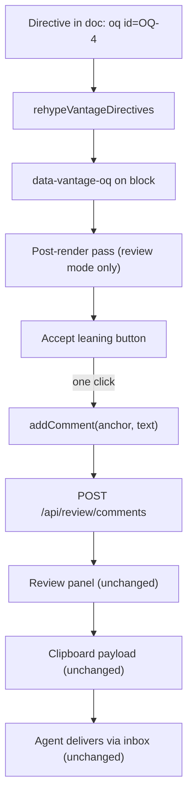

# Inline markup GitHub cannot see

**Status:** DESIGN SKETCH, 2026-08-31. Nothing built. Every claim about existing
code was verified against the tree on 2026-08-31, and the pipeline behaviour in
[§2.2](#22-what-actually-happens-to-a-comment-measured) was **measured** by
running the real chain, not read off the plugin docs.

**The short version.** Carry Vantage-only markup in **HTML comments with a
`vantage:` sentinel** — `<!-- vantage: callout tone=warning -->`. GitHub drops
them, every other Markdown renderer drops them, and a text editor shows one dim
line. A new remark/rehype plugin, `rehypeVantageDirectives`, sits in the **one
slot where comments still exist** — after `rehype-raw`, before `rehype-sanitize`
— and compiles each comment into `data-vantage-*` attributes on the block that
follows it. Directive values are never CSS: they are **tokens from a closed
vocabulary**, styled by CSS attribute selectors, so a hostile document has
nothing to inject into. The one-click Open Question button is not a new protocol
at all — it is a pre-filled call to the reviewer command that the comment
popover already calls.

**The most important sections are [§7](#7-the-degradation-rules) and
[§8](#8-security-the-injection-surface-and-how-it-closes)** — the degradation
rules are the contract the rest of the doc is held to, and §8 documents a
**live, pre-existing hole** this design must not widen.

**Reads with:** [`agent-cli.md`](agent-cli.md) (the checker that would validate
this markup, and the house style this doc follows),
[`review-state-architecture.md`](review-state-architecture.md) (why §5.2 rides
an existing command instead of inventing a channel), and the user-facing
[`../../userguide/review-inbox.md`](../../userguide/review-inbox.md) (the
protocol as agents are told it today).

---

## 1. Verdict up front

**Use HTML comments with a `vantage:` sentinel.** Nothing else degrades as well,
and the alternatives that degrade at all (§13) buy nothing for the cost.

Five principles carry the design. Later sections cite them by number.

- **P1. The document is the artifact; markup annotates it.** A directive may
  change how a block *looks* or what affordances hang off it, never what the
  document *says*. Delete every directive and the prose is unchanged — that is
  the test.
- **P2. Values are tokens, not styles.** A directive names a token from a closed
  vocabulary (`tone=warning`); Vantage maps tokens to presentation in a stylesheet. No directive
  ever contributes a byte to a `style` attribute. This is the whole of §8, and a
  hard boundary rather than a v1 simplification.
- **P3. Unknown is inert, never fatal.** An unrecognised name, key, or value is
  dropped silently where it fails to resolve — no error state, no red box, no
  console spew a reader can trigger with a typo. This is what makes an older
  Vantage safe against a newer document.
- **P4. Ride existing channels.** Review affordances go through the reviewer
  commands that already exist (§5.2). We do not open a second path from document
  to server; [`review-state-architecture.md`](review-state-architecture.md) is
  what happens when a document *becomes* a channel.
- **P5. Markup is a hint.** Every capability answers "what if it isn't there?"
  with today's behaviour, unchanged.

> [!IMPORTANT]
> **This is not the `<!-- changelog -->` protocol coming back.** That design
> failed because the document was used as a *message channel* — writes that had
> to be consumed, deduped, and remembered
> ([`review-state-architecture.md`](review-state-architecture.md) §1). A
> directive here is **declarative and idempotent**: it is read on every render,
> means the same thing every time, and nothing consumes it. Re-reading it a
> thousand times has no effect. The failure mode that killed the changelog block
> — "is this re-read a new message or one I already recorded?" — is not
> expressible here, because there are no messages. Per **P4**, anything that
> *would* be a message goes through the command endpoints instead.

## 2. What exists today, precisely

### 2.1 There are three copies of the pipeline

The remark/rehype chain is written out **three times**, in the same order each
time, and any new plugin has to land in all three:

| Where | What it is |
| :--- | :--- |
| [`renderMarkdown.ts:96-108`](../../packages/vantage-md/src/renderMarkdown.ts#L96-L108) | String-in, HTML-out. Feeds the CLI checker, `resolveLinks`, and `renderMermaidBlocks`. |
| [`MarkdownViewer.tsx:702-711`](../../frontend/src/components/MarkdownViewer.tsx#L702-L711) | The app's `<ReactMarkdown>`. Imports `rehypeSourceLines` and `sanitizeSchema` from `vantage-md`, then re-declares the plugin *order* inline. |
| [`vantage-md/src/MarkdownViewer.tsx:224-232`](../../packages/vantage-md/src/MarkdownViewer.tsx#L224-L232) | The package's own exported React viewer. A third hand-written copy of the same array. |

The order is identical in all three: `rehypeRaw` → `rehypeSourceLines` →
`rehypeSanitize` → `rehypeSlug` → `rehypeHighlight` → `rehypeKatex`, with
`allowDangerousHtml: true` passed to `remark-rehype`
([`renderMarkdown.ts:118`](../../packages/vantage-md/src/renderMarkdown.ts#L118)),
which is why raw HTML reaches `rehype-raw` at all.

> [!WARNING]
> **The duplication is a live drift hazard for this feature.** None of the three
> arrays is derived from another; they are three copies kept in sync by hand. A
> directive plugin added to one produces a document that styles in the app and
> renders bare through the package's own viewer, or through the checker, with no
> error anywhere — and a checker that does not see directives is a checker that
> cannot validate them (§5.3). §6.4 makes de-duplicating the chain a
> prerequisite rather than a nicety.

### 2.2 What actually happens to a comment (measured)

This is the fact the implementation turns on, so I ran it. Feeding
`<!-- vantage: section bg=amber -->` through the real chain:

- **After `rehype-raw`:** the comment is a first-class hast node —
  `{type: "comment", value: " vantage: section bg=amber "}` — sitting at root
  level as a sibling of the surrounding blocks, and it **carries full position
  data** (`start.line`, `end.line`), exactly like an element does.
- **After `rehype-sanitize`:** the node is **gone**. `rehype-sanitize` drops
  comment nodes outright; they are not in its `tagNames` allowlist and there is
  no schema key that readmits them. The rendered HTML contains no trace.

Two consequences:

1. **There is exactly one slot for the plugin**: after `rehypeRaw`, before
   `rehypeSanitize`. Downstream of the sanitiser the information no longer
   exists. This is the same slot `rehypeSourceLines` already occupies
   ([`renderMarkdown.ts:101-104`](../../packages/vantage-md/src/renderMarkdown.ts#L101-L104)),
   which is convenient: the precedent is set and the ordering constraint is
   already understood in this codebase.
2. **The sanitiser deleting comments is a feature.** The plugin consumes the
   comment and emits attributes; the sanitiser removes the original. Nothing
   Vantage-specific reaches the DOM except attributes we deliberately
   allowlisted, and an unrecognised directive leaves *nothing* — **P3** for free.

Also measured, because it bears on scoping: a comment immediately before a
heading parses as that heading's preceding sibling whether or not a blank line
separates them. "Attach to the next block" is positionally well-defined.

### 2.3 How review affordances attach today

Not through React. [`useReviewHighlights`](../../frontend/src/hooks/useReviewHighlights.ts)
is an imperative post-render pass over the container: it finds blocks by
`[data-source-line="N"]`, wraps matched text in `<mark>`
([`useReviewHighlights.ts:279`](../../frontend/src/hooks/useReviewHighlights.ts#L279)),
and injects comment cards, reply textareas, and buttons as raw DOM nodes
([`useReviewHighlights.ts:469-561`](../../frontend/src/hooks/useReviewHighlights.ts#L469-L561),
[`785-860`](../../frontend/src/hooks/useReviewHighlights.ts#L785-L860)).

That matters twice. It is the **precedent** for how §5.2's button gets on the
page — an existing pattern, not a new one. And it is the reason `data-*`
attributes are the right compilation target: the hook already navigates the
rendered DOM by attribute, so a directive that lands as an attribute is
immediately reachable by exactly the machinery that reads anchors today.

### 2.4 How an Open Question gets answered today

Four actions. Hover a block in review mode, click it
([`MarkdownViewer.tsx:509-547`](../../frontend/src/components/MarkdownViewer.tsx#L509-L547)),
type into `ReviewCommentPopover`, press Ctrl/Cmd-Enter
([`ReviewCommentPopover.tsx:104`](../../frontend/src/components/ReviewCommentPopover.tsx#L104)).
That calls `addComment(anchor, comment, fallbackText)`
([`useReviewStore.ts:463-495`](../../frontend/src/stores/useReviewStore.ts#L463-L495)),
which optimistically appends to local state and then `POST`s to
`/review/comments` through `runCommand`
([`useReviewStore.ts:414-444`](../../frontend/src/stores/useReviewStore.ts#L414-L444)).

The agent picks the comment up when the reviewer copies the thread to the
clipboard, and answers via the inbox
([`../../userguide/review-inbox.md`](../../userguide/review-inbox.md)).

**The typing is the only manual part.** The anchor comes from the click; the
delivery is one function call. A button calling `addComment` with a pre-composed
string is not a new protocol — it is the same command with the textarea skipped.
That is the whole of §5.2, and why it is cheap.

### 2.5 Static export renders client-side — which cuts both ways

I assumed static export rendered Markdown to HTML in Go. It does not, and the
truth is better for §7's D5 and worse for D4.

`vantage build` pre-renders **every API response to JSON** and copies the
embedded SPA alongside it
([`builder.go:110-140`](../../internal/static/builder.go#L110-L140)); document
content is written out **verbatim as Markdown**
([`builder.go:284-291`](../../internal/static/builder.go#L284-L291)), and
`index.html` gets a `window.__VANTAGE_STATIC__=true` sentinel
([`builder.go:346`](../../internal/static/builder.go#L346)) that an axios
interceptor uses to rewrite API calls into fetches of those JSON files
([`staticMode.ts:121-131`](../../frontend/src/lib/staticMode.ts#L121-L131)).
There is no Go Markdown library in the tree at all. **The exported site runs the
same React viewer**, so it gets directive styling for free — D5 costs nothing
for anything decorative.

> [!WARNING]
> **Review mode is not disabled in static builds, and that is a trap for §5.2.**
> The Review toggle is gated only on `!showRaw` and a `.md` extension
> ([`ViewerPage.tsx:1148-1174`](../../frontend/src/pages/ViewerPage.tsx#L1148-L1174))
> — there is no `isStaticMode()` check. Meanwhile `internal/static/scheme.go`
> emits no `review` paths, and the interceptor coerces every write to a GET of a
> file that does not exist. So review mode in an exported site *renders*, and
> every write silently fails. A one-click button inherits that: it would look
> live and do nothing. **D4 therefore requires an explicit static-mode gate**
> (§5.2), which is a gate the existing typed-answer path arguably needs too.

There is also a **raw view** — a `<pre>` of the source text
([`ViewerPage.tsx:1467-1491`](../../frontend/src/pages/ViewerPage.tsx#L1467-L1491)).
Directives are visible there, as literal comment text. That is correct: raw view
shows the file, and the file contains the comment.

## 3. Choosing the carrier

Five candidates, measured against the same document on GitHub and in the chain.

| Carrier | On GitHub | Reaches the tree? | Scoped to a place? | Verdict |
| :--- | :--- | :--- | :--- | :--- |
| **HTML comment** `<!-- vantage: … -->` | Invisible | Yes — comment node with position (§2.2) | Yes, positionally | **Adopted** |
| Fenced block, unknown info string | **Visible code block** | Yes | Yes | Rejected — fails D1 outright |
| Link-reference definition | Invisible | **No** — stripped in mdast, never reaches hast | No — definitions are file-scoped | Rejected |
| Frontmatter key | Rendered as a metadata card | Yes, out-of-band | **No** — whole-file only | Rejected as *the* carrier; kept for file-scope (§4.5) |
| `:::note` directive syntax | **Visible literal `:::note`** | Only with `remark-directive` | Yes | Rejected — fails D1 |

Measured, not assumed: a fence tagged ` ```vantage ` renders as
`<pre><code class="language-vantage">` — a grey box of config in the middle of
the prose on GitHub. `:::note{color=blue}` renders as a literal paragraph
reading `:::note{color=blue}`. Both are exactly the "garbage text" outcome D1
exists to forbid.

The link-reference definition is the interesting near-miss: genuinely invisible
on GitHub — `[vantage-style]: #s "color=blue"` emits nothing — so it passes D1.
It fails on **placement**. `remark-parse` lifts definitions out of the content
flow into a file-level table, so by the time anything can read them, "which
section was this next to?" is unanswerable. A carrier for section styling that
cannot name its section is not a carrier. Rejected, but honourably.

## 4. Syntax specification

### 4.1 Grammar

```text
directive   := "<!--" ws* "vantage:" ws* name ( ws+ pair )* ws* "-->"
name        := [a-z][a-z0-9-]*
pair        := key "=" value
key         := [a-z][a-z0-9-]*
value       := [A-Za-z0-9_.:#-]+ | quoted
quoted      := '"' [^"]* '"'
```

One directive per comment. The `vantage:` sentinel is mandatory — it is what
keeps ordinary editorial comments (`<!-- TODO: rewrite this -->`) from being
parsed as markup, and it means the parse is a cheap prefix test on every comment
node rather than a grammar attempt.

Anything that does not match is **not a directive**. It is left alone, the
sanitiser removes it as it removes every comment today, and nothing is logged
(**P3**).

### 4.2 Scoping

Three scopes, distinguished by where the directive sits — not by a `scope=` key,
because position is already unambiguous and a key that can disagree with
position is a bug generator.

| Placement | Scope | Meaning |
| :--- | :--- | :--- |
| Immediately before a **heading** | That heading **and its section** — everything until the next heading of the same or shallower depth | Section styling |
| Immediately before a **non-heading block** | That one block | Block styling, badges |
| Inside **frontmatter** (`vantage:` key) | The whole file | Document-level chrome (§4.5) |

There is deliberately **no range syntax** — no `<!-- vantage: end -->`, no
paired open/close. A paired form has an unmatched-close failure mode, and
Markdown's heading structure already provides the only ranges anyone asked for.
If a real need for arbitrary ranges appears, it can be added later without
breaking any of this; adding it now buys a failure mode for a use case nobody
has stated.

Two directives before the same target **merge**, last-key-wins on conflict. A
directive with nothing after it (end of document) is inert.

### 4.3 The token vocabulary

Per **P2**, values are tokens. The initial vocabulary, deliberately small:

| Key | Tokens | Renders as |
| :--- | :--- | :--- |
| `tone` | `note` `tip` `important` `warning` `caution` `success` `muted` | The existing GFM-callout palette, reused |
| `accent` | `slate` `blue` `green` `amber` `red` `purple` `teal` | A left accent bar in that hue |
| `bg` | same seven, plus `none` | A tinted section background |
| `title` | `default` `accent` `muted` | Heading colour treatment |
| `collapsed` | `true` `false` | Section renders inside `<details>`, closed |
| `badge` | `draft` `stale` `blocked` `done` `wip` | A small chip beside the heading |

The hues are stock Tailwind palette names, which is what the frontend already
uses — [`tailwind.config.js:7-8`](../../frontend/tailwind.config.js#L7-L8) has
an empty `extend`, so there is no bespoke palette to reconcile with.

Every token compiles to a **fixed `data-vantage-*` attribute value**, styled by
CSS attribute selectors (§6.5). There is no interpolation anywhere in the path,
which is what makes §8 short — and it sidesteps a second problem: this is
Tailwind v4 with an empty `extend`
([`tailwind.config.js:7-8`](../../frontend/tailwind.config.js#L7-L8)) and a
`@source` scan over the package
([`index.css:8`](../../frontend/src/index.css#L8)), so a *computed* Tailwind
class name would not be emitted at all. Attribute selectors in a plain
stylesheet have no such dependency.

> [!NOTE]
> Seven hues is a guess at the right size, not a researched number. It is small
> enough that the class set can be written out literally (a requirement, since
> Tailwind's JIT only emits classes it can see as complete strings) and large
> enough to distinguish sections at a glance. See [OQ-3](#open-questions).

### 4.4 What each capability looks like

Section styling — a warning-toned section with an amber wash and a stale badge:

```markdown
<!-- vantage: section tone=warning bg=amber badge=stale -->

## Migration path

The steps below predate the 2026-07 rewrite.
```

A collapsed appendix:

```markdown
<!-- vantage: section collapsed=true -->

## Appendix B — raw measurement dumps
```

A single block framed as a callout without blockquote syntax:

```markdown
<!-- vantage: block tone=important -->

Every delivery carries a nonce.
```

A one-click Open Question answer (§5.2):

```markdown
<!-- vantage: oq id=OQ-4 accept="Back of the queue" -->

4. 💬 **OQ-4: Queue position on re-entry.** …

   _Leaning:_ Back of the queue.
```

Document-level chrome, in frontmatter (§4.5):

```yaml
---
title: "Adaptive levelling"
vantage:
  status-chip: in-review
  toc: section
---
```

**On GitHub, every one of these renders as the plain Markdown with the comment
line absent.** No box, no marker, no gap beyond the blank line that was already
there. That is the whole point of the carrier.

### 4.5 Frontmatter for file scope

Frontmatter is rejected as *the* carrier (§3) because it cannot point at a
section. It is the right home for genuinely file-scoped chrome, under a single
`vantage:` key so it stays out of the way of a user's own keys. Vantage already
parses and displays frontmatter, so this costs no new parsing — only a decision
to special-case one key.

## 5. Capabilities

Ranked by value over effort. §5.1 and §5.2 are the ask; §5.3 is what else earns
a place; §5.4 is what does not.

### 5.1 Section styling

**Value: medium. Effort: low** — it is the plugin plus a stylesheet.

Covered by `tone`, `accent`, `bg`, `title`, `collapsed`, `badge` (§4.3). The
plugin sets `data-vantage-tone="warning"` and friends on the heading element;
CSS selects on the attribute (`[data-vantage-tone="warning"]`) so there is no
class-name computation in JavaScript at all — the mapping lives entirely in a
stylesheet, which is the least injectable form it could take.

Section *backgrounds* need one structural decision: an attribute on the heading
cannot tint the paragraphs after it, because they are siblings, not children.
Either wrap the section in a `<section>`, or stamp every block in it. I lean to
**stamping** — wrapping restructures the tree that `rehypeSourceLines` and the
review anchors both navigate (§2.3). See [OQ-2](#open-questions).

Degradation: **D1** (invisible elsewhere), **D2** (unknown token → no styling),
**D5** (static export gets the same attributes, since it shares the plugin).

### 5.2 One-click Open Question answers

**Value: high. Effort: low.** This is the best thing in the doc, and it is
almost entirely built already.

```markdown
<!-- vantage: oq id=OQ-4 accept="Back of the queue — the fix might interact with things that merged while it was out." -->
```

In review mode, Vantage renders an **Accept leaning** button beside the
question. Clicking it calls `addComment(anchor, text, fallbackText)` —
[the same function the popover calls](../../frontend/src/stores/useReviewStore.ts#L463-L495)
— with:

- **anchor**: derived from the block the directive is attached to, using the
  existing `data-source-line` mechanism (§2.3), identical in shape to what a
  click-and-type would have produced.
- **text**: the `accept` value, or a default of `"Accept the stated leaning."`
  when `accept` is absent.

From there **nothing is new**. The comment is a comment. It rides `runCommand`
to `POST /review/comments`, appears in the panel, gets copied to the agent in
the ordinary clipboard payload, and is answered through the inbox. The agent
needs no new instructions, the server needs no new endpoint, and the inbox
protocol is untouched. Per **P4** this is a **macro over an existing command**,
which is the strongest form the feature could take.



Everything from `addComment` rightward already exists. The new code is the
plugin, the attribute, and a button.

Degradation: **D1**, **D4**, **D6** (a malformed `oq` directive yields no
button, never a broken one). The reviewer can *always* still type an answer; the
button never removes a path, only adds one.

D4 has teeth here. The button renders only when **all** of these hold: review
mode is on, the directive parsed, and `isStaticMode()` is false. That last
condition is the §2.5 trap — without it, an exported document shows a live-looking
button whose click is swallowed by the static interceptor. A button that fails
silently is worse than no button, because the reviewer believes they answered.

> [!TIP]
> The `accept` string should restate the leaning rather than say `"yes"`. The
> comment is what the agent reads, and it is read with no memory of which button
> was clicked. `"yes"` next to a two-branch question is a support ticket.

### 5.3 What else earns a place

- **Per-section review status** (`badge=blocked`) — reuses the badge machinery
  from §5.1 for free. Ships with it.
- **Stale markers** (`badge=stale`) — same. The value is that a reader sees
  staleness *in the section*, not in a changelog nobody reads.
- **Document status chip** (frontmatter `status-chip`) — a small chip near the
  title. Cheap, and it makes `status: draft` in frontmatter visible rather than
  buried in a metadata card.
- **Machine-readable metadata for tooling** — this is the sleeper. Directives
  are already a structured, greppable, position-carrying annotation layer. The
  checker described in [`agent-cli.md`](agent-cli.md) can validate directive
  names and tokens with no rendering at all, which means typos get caught before
  a human sees a section that mysteriously did not style. Costs one rule in a
  tool that is being built anyway.

### 5.4 Explicitly iced

- **Diagram theming.** Mermaid has its own theming
  ([`MermaidDiagram.tsx`](../../packages/vantage-md/src/MermaidDiagram.tsx)).
  Piping directive tokens in means owning a translation layer between two theme
  vocabularies that will drift — and mermaid's `%%{init}%%` already does it,
  on GitHub too.
- **A TOC directive.** The outline is already computed from headings and
  navigable. A second one is maintenance for a feature the sidebar provides.
- **Arbitrary colours** (`bg="#ff00aa"`). The request behind "set a background
  colour", and the answer is no — see §8. Tokens cover the real need, which is
  *distinguishing* sections, not matching a brand.

## 6. Implementation sketch

### 6.1 Where it lives

`packages/vantage-md/src/rehypeVantageDirectives.ts`, exported from
[`index.ts`](../../packages/vantage-md/src/index.ts) alongside
`rehypeSourceLines`. The package is the shared floor under both viewers and the
checker; anything less shared reintroduces §2.1's drift.

> [!NOTE]
> **`vantage-md` has no test runner of its own** — no test files, no vitest
> dependency, and `package.json` exposes only `build`, `dev`, `typecheck`,
> `prepublishOnly`. Its pipeline is tested from the *frontend* suite, which
> resolves `vantage-md` to the package's TypeScript source through a vitest
> alias, exactly as
> [`sourceLines.test.ts`](../../frontend/src/lib/sourceLines.test.ts) does for
> `rehypeSourceLines`. That is the pattern for this plugin's tests too: they
> live in `frontend/src/` and run under `npm run test` there.

### 6.2 The plugin

Between `rehypeRaw` and `rehypeSanitize` (§2.2 — the only slot). Per pass:

1. Walk the root's children. For each `comment` node, prefix-test for
   `vantage:`. Non-matches are skipped and left for the sanitiser.
2. Parse the grammar (§4.1). A parse failure drops the directive (**P3**).
3. Resolve `name` and each `key=value` against the **closed vocabulary**. An
   unknown name, key, or value is dropped — individually, so one bad key does
   not void a directive's good keys.
4. Determine the target from position (§4.2): the next sibling element.
5. Stamp `data-vantage-*` properties on the target (and, for section scope, on
   every following sibling until the next heading of same-or-shallower depth).
6. Leave the comment node in place. The sanitiser removes it.

Ordering note: it must run **before** `rehypeSourceLines` or after it, but never
depend on `rehypeSlug`, which runs post-sanitise
([`renderMarkdown.ts:106`](../../packages/vantage-md/src/renderMarkdown.ts#L106))
and so cannot supply heading ids to the plugin. If a directive ever needs a
slug, it computes its own.

### 6.3 The sanitiser change

Small and closed. In
[`sanitize.ts:43-48`](../../packages/vantage-md/src/sanitize.ts#L43-L48), add
the specific `data-vantage-*` properties to the `*` attribute list — **named
individually**, not by wildcard:

```diff
   "*": [
     ...(defaultSchema.attributes?.["*"] || []),
     "className",
     "style",
     "dataSourceLine",
+    "dataVantageTone",
+    "dataVantageAccent",
+    "dataVantageBg",
+    "dataVantageBadge",
+    "dataVantageOq",
   ],
```

`rehype-sanitize` also supports value-level allowlisting (`["attr", …values]`)
— the belt to §6.2's braces. Even if a future refactor lets an unvalidated value
reach the tree, the sanitiser refuses anything outside the vocabulary. Both
layers, not either.

### 6.4 Prerequisite: one chain, not three

§2.1's duplication has to go first. `vantage-md` should export the plugin
*list* — something like `buildRehypePlugins({ bodyLineOffset })` — and all three
call sites should consume it rather than re-declaring the order. The package
becomes the single place the chain is defined. This is worth doing on its own
merits, is strictly smaller than the feature it unblocks, and is the only reason
R1 is a mitigated risk rather than a certainty.

### 6.5 Frontend consumption

- **Styling**: pure CSS on attribute selectors. No JavaScript, so it works
  identically in the SPA and in static export.
- **The button** (§5.2): an addition to the existing post-render pass (§2.3),
  gated on `isReviewMode`, finding `[data-vantage-oq]` the same way the
  highlighter finds `[data-source-line]`.

## 7. The degradation rules

The user asked for graceful degradation and left the definition to me. Here it
is, as eight rules the rest of the doc is held to.

1. **D1 — Invisible elsewhere.** On GitHub, in any other Markdown renderer, and
   in a plain text editor, a document carrying this markup renders as if the
   markup were not there. Not "renders acceptably" — renders *identically*, with
   no visible artifact. This is what eliminates fenced blocks and `:::` syntax
   (§3).
2. **D2 — Unknown is inert.** An unrecognised directive name, key, or value
   produces *no styling* and no error. Per-key, not per-directive: one bad key
   does not discard its siblings.
3. **D3 — Forward compatible.** An older Vantage meeting a newer directive hits
   D2 and renders the plain document. There is no version negotiation and no
   minimum-version key, because D2 makes both unnecessary.
4. **D4 — Review affordances are additive, and never lie.** Anything
   review-related appears only in review mode, and never removes an existing
   path: with review mode off there is no button and no trace of one; with it
   on, typing an answer works exactly as it does today. **And a control that
   cannot work must not render** — per §2.5 that means an explicit
   `isStaticMode()` gate, because an exported site runs review mode with every
   write silently failing.
5. **D5 — Every renderer agrees.** The live viewer, the package's exported
   viewer, and the CLI checker share one plugin and one vocabulary. Static
   export is free here — it ships the same SPA (§2.5) — but the three
   hand-copied chains (§2.1) are not, which is why §6.4 is a prerequisite. A
   directive must not mean one thing in the app and another through the
   checker.
6. **D6 — Malformed degrades to plain, never to broken.** A hostile or
   malformed directive yields an unstyled document. It never yields a broken
   render, a thrown exception, an injected style, or a mis-wired button.
7. **D7 — Print and plain views are unaffected.** Styling is decorative;
   removing it loses nothing but decoration. `collapsed=true` in particular must
   **expand for print** — a collapsed section that prints as a closed
   `<details>` is content loss, which violates **P1**.
8. **D8 — The prose is authoritative.** Per **P1**, directives never change what
   the document says. A reader on GitHub gets the complete document. This is the
   rule that ices §5.4's content-changing ideas.

## 8. Security: the injection surface, and how it closes

### 8.1 The pre-existing hole

While verifying the sanitiser I measured something that is **not** caused by
this design and that this design must not make worse.

> [!CAUTION]
> **`style` is allowlisted on every element today, with no value filtering.**
> [`sanitize.ts:43-48`](../../packages/vantage-md/src/sanitize.ts#L43-L48) puts
> `"style"` on the `*` list, and `rehype-sanitize` does not parse CSS. Verified
> by running the real chain on 2026-08-31: a document containing
> `<div style="position:fixed;top:0;left:0;width:100vw;height:100vh;z-index:9999">`
> renders that div verbatim, full-viewport overlay and all. So does
> `style="background:url(https://evil.example/x.png)"`, which fires an
> outbound request when the block renders.
>
> This is not script execution — `expression()` is long dead and browsers block
> `javascript:` in CSS URLs — but it is a real full-page-overlay and
> render-time-beacon surface, reachable by anyone who can put a file in a served
> repository. It is **orthogonal to this proposal** and should be fixed
> regardless; it is recorded here because it is exactly the class of hole this
> feature would open if directives carried CSS.

There is also **no sanitisation test anywhere in the repo** — grepping all 33
test files outside `packages/vantage-check/` for `sanitiz`, `xss`, `<script>`,
or `javascript:` returns nothing, so `sanitizeSchema` has zero coverage today.
The schema change in §6.3 should ship with the first one.

### 8.2 Why directives cannot widen it

The attack this feature could introduce is
`<!-- vantage: section bg="url(https://evil/x)" -->` — an untrusted value
reaching a `style` attribute. Three independent things stop it, each sufficient
alone:

1. **The vocabulary is closed (P2).** `bg` accepts seven token names. Anything
   else is not a value; it is dropped at step 3 of §6.2. There is no free-text
   value in the grammar that reaches rendering.
2. **The compilation target is not `style`.** Tokens become `data-vantage-*`
   attributes, and the styling is CSS in a stylesheet selecting on them (§6.5).
   No code path concatenates a directive value into a style string, because no
   code path builds a style string at all.
3. **The sanitiser re-checks (§6.3).** Value-level allowlisting means an
   attribute carrying an unexpected value is stripped even if the plugin somehow
   emitted it.

The `oq` directive's `accept` string is the one genuinely free-text value. It is
not a style and never becomes markup: it is the *body of a review comment*, and
it lands in the same store, through the same endpoint, as text a reviewer typed.
It inherits whatever escaping that path already applies and adds no new surface.

> [!WARNING]
> **Do not "simplify" the token vocabulary into a colour passthrough.** It looks
> like a small generalisation — accept a hex value, put it in `style` — and it
> converts a design with no injection surface into one whose only defence is the
> hole documented in §8.1. If free colours are ever genuinely needed, §8.1 must
> be fixed first, with a real CSS value parser.

### 8.3 Denial of service

None added. Ten thousand directives is ten thousand comments, which the parser
already handles, and the plugin is one linear pass over an unambiguous grammar.

## 9. Non-goals — what this does not license

- **Not a template language, and never text-changing.** No variables, no
  conditionals, no includes, no loops, no `<!-- vantage: replace … -->`. A
  document must read the same on GitHub as in Vantage — **P1** and **D8**, not
  negotiable.
- **Not a styling API.** No CSS, no hex colours, no class-name passthrough, no
  `style=`. The vocabulary is closed and extending it is a code change with a
  review (**P2**).
- **Not a second review channel.** A directive never triggers a write on
  render — per **P4** and the changelog history, that is the failure mode we
  removed at cost. §5.2's button writes because a *human clicked it*, which is
  categorically different.
- **Not a layout engine.** No columns, no floats, no positioning, no widths.
- **Not frontmatter's replacement.** File-scoped chrome lives in frontmatter
  under one key (§4.5); the comment carrier exists for things frontmatter cannot
  point at.
- **Not a GitHub-rendering change.** We never ask readers to install anything or
  view documents anywhere in particular. If it does not degrade, it does not
  ship.

## 10. Risks

| Risk | Mitigation |
| :--- | :--- |
| **R1. Chain drift** — the plugin lands in one of the **three** hand-copied chains (§2.1) | §6.4 is a prerequisite, not a follow-up. One chain, defined once in the package, imported everywhere. |
| **R2. Vocabulary creep** — every request adds a token until it is CSS by accretion | §9 is the defence, and §8.2 is the reason. Each new token is a code change; a request for free values is a request to fix §8.1 first. |
| **R3. Markup rot** — directives outlive the sections they describe, and `badge=stale` is itself stale | Checker rule (§5.3): a directive whose target no longer exists is a finding. Cheap because the checker is already being built. |
| **R4. Agents overuse it** — every document arrives rainbow-coloured | A style-guide rule, not a code rule. The `style-guide` command in [`agent-cli.md`](agent-cli.md) is where "use sparingly" belongs. |
| **R5. Section stamping is wrong for nested structure** — a directive on `##` stamping through a `###` that wanted its own treatment | Last-directive-wins within a section, resolved at stamp time. Verify against a real nested document before shipping (OQ-2). |
| **R6. The one-click answer makes shallow answers easy** | Real, and partly the point — the cost being removed is typing, not thinking. §5.2's tip (restate the leaning) keeps the *comment* substantive even when the click is fast. |
| **R7. A live-looking button in a static export that silently does nothing** (§2.5) | The `isStaticMode()` gate in §5.2, enforced by **D4**. Worth noting the same hole exists for typed answers today — the gate is a fix to review mode generally, which this feature merely forces. |
| **R8. No sanitisation test exists** (§8.1), so a schema regression is invisible | The §6.3 change ships with the repo's first sanitiser test, covering both the new attributes and the values they refuse. |

**What it costs.** A vocabulary that becomes a compatibility promise, a
stylesheet that grows with it, and one more thing the checker must know about.

**What it deletes.** Nothing. This is purely additive — which is itself a mild
argument against it, and the reason §11 starts with the capability that has a
concrete complaint behind it.

## 11. What I would build, in order

1. **De-duplicate the render chain** (§6.4). Stands alone, fixes a real drift
   hazard, and unblocks everything else. Ships with no user-visible change.
2. **The plugin and the `oq` directive only** (§5.2). Highest value, and it
   exercises the whole path — carrier, parse, attribute, sanitiser, post-render
   pass — on one directive with a concrete complaint behind it.
3. **The styling vocabulary** (§5.1) — `tone`, `accent`, `title`, `badge`.
   Attribute-selector CSS only. `bg` waits for OQ-2's stamping decision.
4. **`collapsed`**, with the print rule (**D7**) in the same commit. Separate
   because it is the one token that restructures rather than decorates.
5. **Checker rules** (§5.3) — directive name and token validation, plus R3's
   orphan check. Lands in the CLI, not here.
6. **Frontmatter chrome** (§4.5) — the status chip. Last because it is the
   smallest win.

Icebox in §5.4. Nothing there should ship without a new argument.

## 12. Alternatives considered

- **Fenced block with an unknown info string.** Rejected. Measured: renders as a
  visible grey code block on GitHub (§3). Fails **D1**, which is the constraint
  the user cared most about.
- **`:::note` container directives.** Rejected. Measured: renders as literal
  `:::note{color=blue}` text without `remark-directive`, which GitHub does not
  run. Fails **D1**. It is the nicest syntax to *write*, and that is not enough.
- **Link-reference definitions.** Rejected, narrowly (§3). Invisible on GitHub —
  it passes D1 — but `remark-parse` lifts definitions into a file-level table
  before rehype, so a directive cannot say which section it means.
- **Frontmatter as the only carrier.** Rejected as *the* carrier: cannot address
  a section. Adopted for file scope (§4.5).
- **A sidecar file** (`doc.md.vantage.json`). Rejected. Perfect degradation —
  GitHub never sees it — and it fails on everything else: it desynchronises the
  moment anyone edits the Markdown, doubles the files an agent must write, and
  makes "which section" a line number, which is the most fragile possible
  anchor.
- **Free-form CSS in directives.** Rejected on §8. This is the version a naive
  reading of "set a background colour" produces, and it is an injection vector
  with the current sanitiser.
- **Extending the GFM callout syntax** (`> [!WARNING]`) with extra tokens.
  Rejected: GitHub renders an unknown callout type as a plain blockquote with
  the literal `[!FOO]` visible. Fails **D1**.
- **A directive that posts an answer directly to the server on render.**
  Rejected hard, on **P4** and on
  [`review-state-architecture.md`](review-state-architecture.md): that is the
  document-as-message-channel design that was removed at real cost. §5.2 writes
  only on a human click, through the reviewer's own command.

## Decision Ledger

| ID | Ruling / Decision | Date | Settled in |
| :--- | :--- | :--- | :--- |
| — | HTML comment with `vantage:` sentinel is the carrier | 2026-08-31 | §1, §3 |
| — | Plugin slots between `rehypeRaw` and `rehypeSanitize` — the only slot where comments exist | 2026-08-31 | §2.2, §6.2 |
| — | Values are closed-vocabulary tokens; no CSS reaches a `style` attribute, ever | 2026-08-31 | §4.3, §8.2 |
| — | Scope is positional (heading / block / frontmatter); no paired open-close range syntax | 2026-08-31 | §4.2 |
| — | One-click answers ride `addComment`, not a new endpoint or a new inbox verb | 2026-08-31 | §5.2 |
| — | Render-chain de-duplication is a prerequisite, not a follow-up | 2026-08-31 | §6.4, R1 |
| — | Diagram theming, TOC directives, and free colours are iced | 2026-08-31 | §5.4 |

*(No `OQ-N` rows yet — every ruling above is mine, made in drafting. The rows
below in [Open Questions](#open-questions) are the ones I do not think I should
make alone.)*

## Open Questions

1. 💬 **OQ-1: Is the `vantage:` sentinel the right spelling?** The grammar
   requires a prefix so ordinary editorial comments are not parsed as markup
   (§4.1). `vantage:` is explicit but verbose at the top of every directive;
   `v:` is terser; `@vantage` reads like a mention. This is a **compatibility
   promise** — documents written with the wrong one need migrating — which is
   why it is worth a ruling before step 2 of §11 rather than after.

   _Leaning:_ `vantage:`. Verbosity is paid once per directive by the author and
   read by every human who meets an unfamiliar comment in a document; `v:` saves
   six characters and costs the reader the ability to guess what it is. It is
   also the greppable form, which matters for R3's checker rule.

   **Answer:**
   > _(empty — fill in when decided)_

2. 💬 **OQ-2: Section backgrounds — wrap or stamp?** Tinting a whole section
   needs either a `<section>` wrapper inserted by the plugin, or the same
   attribute stamped onto every block in the section (§5.1). Wrapping is cleaner
   CSS and one attribute; stamping is more attributes but leaves the tree flat.
   This decides whether `bg` ships in step 3 or waits, and it is the one
   decision here that could **destabilise review anchoring** — §2.3 shows how
   much navigates the rendered tree by `data-source-line`.

   _Leaning:_ Stamp. The review anchor system, the line-anchor system, and the
   hover-to-comment block resolution all walk a flat sibling structure
   ([`MarkdownViewer.tsx:106`](../../frontend/src/components/MarkdownViewer.tsx#L106)),
   and inserting a wrapper element between the container and the blocks is
   exactly the kind of change that breaks one of them subtly. Extra attributes
   are cheap; a restructured tree is not.

   **Answer:**
   > _(empty — fill in when decided)_

3. 💬 🤷 **OQ-3: How big should the token vocabulary be?** §4.3 proposes seven
   hues and five tones as a starting guess. Smaller is more consistent across
   documents and easier to keep looking deliberate; larger is more expressive
   and more likely to satisfy a specific request without a code change. Every
   token is a permanent compatibility promise (R2).

   _Leaning:_ Genuinely your call — this is a taste question about how much
   variation you want to see across your own documents, and I have no technical
   basis for preferring seven over four. My weak instinct is to start at four
   hues and add on demand, because R2 is one-directional: adding a token later
   is easy, removing one breaks documents.

   **Answer:**
   > _(empty — fill in when decided)_

4. 💬 **OQ-4: Should the one-click button also exist for a plain "yes"?** §5.2
   renders one button carrying the stated leaning. An obvious extension is a
   second button — "Reject" or "Needs discussion" — which turns the OQ block
   into a two- or three-way control. The stakes: one button is a shortcut for
   the common case, several buttons make the document feel like a form and
   invite answering without reading.

   _Leaning:_ One button, and only when `accept` is present. The complaint being
   solved is "I have to type *yes*" — the affirmative case. A rejection almost
   always needs a reason, which means typing anyway, so a Reject button would
   mostly produce content-free rejections the agent then has to chase.

   **Answer:**
   > _(empty — fill in when decided)_

5. 💬 **OQ-5: Fix the `style` hole (§8.1) as part of this, or separately?** It is
   a pre-existing surface, orthogonal to this design, and this design is
   deliberately built not to depend on it. But it is the reason free colours are
   refused, and shipping a styling feature while a wide-open styling hole sits
   next to it is an odd posture.

   _Leaning:_ Separately, and soon. Bundling it makes this design's security
   story depend on a CSS-parsing change with its own risk of breaking legitimate
   documents that use `style` today; §8.2's three defences hold either way. But
   it should get its own doc rather than living only in a `> [!CAUTION]` block
   here.

   **Answer:**
   > _(empty — fill in when decided)_
