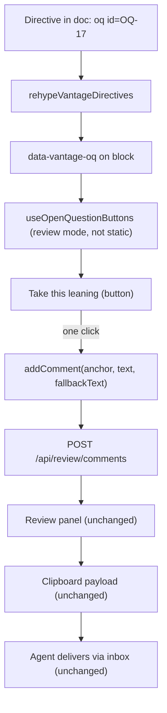

# Inline markup GitHub cannot see

**Status:** IMPLEMENTED, 2026-08-31. Designed, reviewed, revised and built the
same day, in ten commits: `fd7411c` (the sanitiser), `d47e3c3` (one chain),
`561c69a` (comment bodies), `70217d3` (the plugin), `7585681` (the button),
`e5e7ac5` (the theme layer), `fcc4f3d` (`collapsed`), `25fe999` (the checker
rules), `2c6657a` (frontmatter chrome), `1312c5c` (the static gate). §11 is the
build order as it actually ran, including the two steps the design did not have.

Everything below is present tense about a shipped feature. Where the design was
wrong, the correction is in the body rather than beside it, and the
[Decision Ledger](#decision-ledger) carries all twenty-two implementation
rulings (A1–A22) with the section each is settled in. Every claim about existing
code was re-verified against the tree on 2026-08-31, after the last commit.

**The short version.** Carry Vantage-only markup in **HTML comments with a
`vantage:` sentinel** — `<!-- vantage: section tone=warning -->`. GitHub drops
them, every other Markdown renderer drops them, and a text editor shows one dim
line. A rehype plugin, `rehypeVantageDirectives`, sits in the **one slot where
comments still exist** — after `rehype-raw`, before `rehype-sanitize` — and
compiles each comment into `data-vantage-*` attributes on the block that follows
it. Directive values are never CSS and never colours: they are **semantic
tokens** — `note`, `warning`, `caution` — that the *theme* maps to colour, so a
document says what a section means and light, dark, print, and every future
theme decide how it looks. The one-click Open Question button is not a new
protocol at all — it is a pre-filled call to the reviewer command that the
comment popover already calls.

**The most important section is [§7](#7-the-degradation-rules)** — the eight
degradation rules are the contract everything else is held to, and every ruling
in the Ledger that overturned a design decision was decided by one of them.
[§8](#8-security-the-injection-surface-and-how-it-closes) is where this feature
paid a debt it did not create: the sanitiser let arbitrary inline CSS through,
and closing that was step 1, ahead of any directive work.

**Reads with:** [`agent-cli.md`](agent-cli.md) (the checker that validates this
markup, and the house style this doc follows),
[`review-state-architecture.md`](review-state-architecture.md) (why §5.2 rides
an existing command instead of inventing a channel), and the user-facing
[`../../userguide/review-inbox.md`](../../userguide/review-inbox.md) (the
protocol as agents are told it today).

---

## 1. Verdict up front

**Use HTML comments with a `vantage:` sentinel.** Nothing else degrades as well,
and the alternatives that degrade at all (§12) buy nothing for the cost.

Five principles carry the design. Later sections cite them by number.

- **P1. The document is the artifact; markup annotates it.** A directive may
  change how a block *looks* or what affordances hang off it, never what the
  document *says*. Delete every directive and the prose is unchanged — that is
  the test, and it is a test in
  [`vantageDirectives.test.ts`](../../frontend/src/lib/vantageDirectives.test.ts).
- **P2. Values are semantic tokens — never styles, never colours.** A directive
  names what a section *is* (`tone=warning`), never what it should *look like*.
  The theme owns the mapping from token to colour, so one document renders
  correctly in light, in dark, in print, and in themes that do not exist yet. No
  directive ever contributes a byte to a `style` attribute. Hard boundary, not a
  v1 simplification.
- **P3. Unknown is inert, never fatal.** An unrecognised name, key, or value is
  dropped silently where it fails to resolve — no error state, no red box, no
  console spew a reader can trigger with a typo. This is what makes an older
  Vantage safe against a newer document. The *only* thing that ever reports a
  dropped directive is the CLI checker (§5.3).
- **P4. Ride existing channels.** Review affordances go through the reviewer
  commands that already exist (§5.2). We do not open a second path from document
  to server; [`review-state-architecture.md`](review-state-architecture.md) is
  what happens when a document *becomes* a channel.
- **P5. Markup is a hint.** Every capability answers "what if it isn't there?"
  with today's behaviour, unchanged. Every capability also answers "what if the
  JavaScript isn't there?" — which is what forced the collapse gate in §4.3.

> [!IMPORTANT]
> **This is not the `<!-- changelog -->` protocol coming back.** That design
> failed because the document was used as a *message channel* — writes that had
> to be consumed, deduped, and remembered
> ([`review-state-architecture.md`](review-state-architecture.md) §1). A
> directive here is **declarative and idempotent**: it is read on every render,
> means the same thing every time, and nothing consumes it. Re-reading it a
> thousand times has no effect. The failure mode that killed the changelog block
> — "is this re-read a new message or one I already recorded?" — is not
> expressible here, because there are no messages. Per **P4**, anything that
> *would* be a message goes through the command endpoints instead.

## 2. What exists today, precisely

### 2.1 There is one copy of the pipeline

The remark/rehype chain is defined once, in
[`pipeline.ts`](../../packages/vantage-md/src/pipeline.ts), and every renderer
consumes it:

| Where | What it is |
| :--- | :--- |
| [`pipeline.ts:129-134`](../../packages/vantage-md/src/pipeline.ts#L129-L134) | `buildPipeline(options)` — the only place the plugin list and its order exist. |
| [`renderMarkdown.ts:82-97`](../../packages/vantage-md/src/renderMarkdown.ts#L82-L97) | String-in, HTML-out. Feeds the CLI checker, `resolveLinks`, and `renderMermaidBlocks`. |
| [`MarkdownViewer.tsx:725-726`](../../frontend/src/components/MarkdownViewer.tsx#L725-L726) | The app's `<ReactMarkdown>`, handed both lists as props. |
| [`vantage-md/src/MarkdownViewer.tsx:221-222`](../../packages/vantage-md/src/MarkdownViewer.tsx#L221-L222) | The package's own exported React viewer, likewise. |
| [`core/document.ts:37-43`](../../packages/vantage-check/src/core/document.ts#L37-L43) | The checker's mdast-only parser, via `buildRemarkPlugins()`. |

The order is `rehypeRaw` → `rehypeSourceLines` → **`rehypeVantageDirectives`** →
`rehypeSanitize` → `rehypeSlug` → `rehypeHighlight` → `rehypeKatex`, with
`allowDangerousHtml: true` passed to `remark-rehype`
([`renderMarkdown.ts:95`](../../packages/vantage-md/src/renderMarkdown.ts#L95)),
which is why raw HTML reaches `rehype-raw` at all. `rehypeSlug`'s position after
the sanitiser is load-bearing, not incidental: `rehype-sanitize`'s default schema
clobbers `id` with the prefix `user-content-`, so slugging first turns every
`#heading` link in every document into a dead anchor. Measured — a hand-written
`<a id="raw">` becomes `id="user-content-raw"` while rehype-slug's post-sanitise
ids are untouched.

The directive plugin takes **no option of its own**
([`pipeline.ts:103-109`](../../packages/vantage-md/src/pipeline.ts#L103-L109)).
A flag would be a way for two renderers to disagree about what a document means,
which is exactly **D5**.

> [!NOTE]
> **The duplication this feature had to remove first — history, kept because the
> shape of the hazard recurs.** Until step 2 the chain existed in **four** copies,
> none derived from another: three full ones (the two React viewers and
> `renderMarkdown`) and a fourth mdast half inside the checker's own
> `core/document.ts`, under a comment claiming it was "the same processor the
> viewer parses with". Beside them sat a dead, stale duplicate of the
> `rehypeSourceLines` *plugin* at `frontend/src/lib/rehypeSourceLines.ts` — typed
> `Plugin<[], Root>`, no `offset` support, imported by nothing: a decoy for
> anyone grepping. A directive plugin added to one copy would style in the app and
> render bare through the package's viewer or the checker, with no error anywhere,
> and a checker that cannot see directives cannot validate them (§5.3). The four
> are now one call; the decoy is deleted.
>
> A **fifth, partial copy deliberately stays**: the checker's lint-only processor
> ([`rules/markdown.ts:24-42`](../../packages/vantage-check/src/rules/markdown.ts#L24-L42)).
> It omits `remark-math` on purpose and the omission changes findings — measured,
> on two `$$…$$` blocks containing `\left[ a, b \right]` and `a[0] = b[1]`,
> `no-undefined-references` reports three findings without `remark-math` and
> **none** with it. Sharing the viewer's list there would silently change which
> hygiene findings the tool reports, so one duplicated option stays duplicated,
> with the measurement written next to it. Whether that should become an explicit
> option on the shared builder instead is [OQ-9](#open-questions).

### 2.2 What actually happens to a comment (measured)

This is the fact the implementation turns on, so I ran it. Feeding
`<!-- vantage: section tone=warning -->` through the real chain:

- **After `rehype-raw`:** the comment is a first-class hast node —
  `{type: "comment", value: " vantage: section tone=warning "}` — sitting as a
  sibling of the surrounding blocks, and it **carries full position data**
  (`start.line`, `end.line`), exactly like an element does.
- **After `rehype-sanitize`:** the node is **gone**, and the mechanism is worth
  naming precisely. Comments are not elements, so `tagNames` never applied to
  them; `hast-util-sanitize` (5.0.2 here) gates them on a single boolean,
  `allowComments`, which defaults to `false` and which `sanitizeSchema`
  deliberately never sets. There *is* therefore a switch that readmits them —
  measured, flipping it puts `<!-- vantage: section tone=warning -->` and a
  malformed `<!-- vantage: bogus -->` alike straight into the rendered HTML — so
  what holds the guarantee is the schema plus a test, not the absence of an API:
  [`vantageDirectives.test.ts:1290`](../../frontend/src/lib/vantageDirectives.test.ts#L1290)
  asserts the rendered markup contains no `<!--` and no `vantage:`, and fails the
  moment anyone turns it on.

Two consequences:

1. **There is exactly one slot for the plugin**: after `rehypeRaw`, before
   `rehypeSanitize`. Downstream of the sanitiser the information no longer
   exists. This is the same slot `rehypeSourceLines` already occupies
   ([`pipeline.ts:100-102`](../../packages/vantage-md/src/pipeline.ts#L100-L102)),
   and the slot is spelled out in the code
   ([`pipeline.ts:103-109`](../../packages/vantage-md/src/pipeline.ts#L103-L109))
   so nobody has to re-derive it.
2. **The sanitiser deleting comments is a feature.** The plugin consumes the
   comment and emits attributes; the sanitiser removes the original. Nothing
   Vantage-specific reaches the DOM except attributes we deliberately
   allowlisted, and an unrecognised directive leaves *nothing* — **P3** for free.

Also measured, because both bear on scoping:

- A comment immediately before a heading parses as that heading's preceding
  sibling **whether or not** a blank line separates them. "Attach to the next
  block" is positionally well-defined, and a rule that told the two spacings
  apart would have to re-read line numbers to do it.
- Comment nodes are **not confined to the root**. `rehype-raw` leaves them
  inside `blockquote`, inside `li`, inside `td`, and inline inside `p`. That one
  fact is why the plugin walks the whole tree (§6.2) — the real Open Questions
  layout puts the `oq` directive inside a list item, so a root-only walk finds
  zero of them.

### 2.3 How review affordances attach today

Not through React. [`useReviewHighlights`](../../frontend/src/hooks/useReviewHighlights.ts)
is an imperative post-render pass over the container: it finds blocks by
`[data-source-line="N"]`, wraps matched text in `<mark>`
([`useReviewHighlights.ts:272`](../../frontend/src/hooks/useReviewHighlights.ts#L272)),
and injects comment cards and reply textareas as raw DOM nodes
([`498-577`](../../frontend/src/hooks/useReviewHighlights.ts#L498-L577),
[`814-881`](../../frontend/src/hooks/useReviewHighlights.ts#L814-L881)).

That matters three times. It is the **precedent** for how §5.2's button and
§4.3's caret get on the page — an existing pattern, not a new one. It is the
reason `data-*` attributes are the right compilation target: the hook already
navigates the rendered DOM by attribute, so a directive that lands as an
attribute is immediately reachable by exactly the machinery that reads anchors
today. And the *way* it injects is a constraint on everything here: a comment
card lands as a **sibling of the block it belongs to**
([`useReviewHighlights.ts:384-397`](../../frontend/src/hooks/useReviewHighlights.ts#L384-L397)),
inserted into the block's parent. Two design decisions fall out of that single
line — see §4.3 (`data-vantage-run`) and §5.1 (no wrapper element).

### 2.4 How an Open Question gets answered today

Four actions. Hover a block in review mode, click it
([`MarkdownViewer.tsx:531-574`](../../frontend/src/components/MarkdownViewer.tsx#L531-L574)),
type into `ReviewCommentPopover`, press Ctrl/Cmd-Enter
([`ReviewCommentPopover.tsx:104`](../../frontend/src/components/ReviewCommentPopover.tsx#L104)).
That calls `addComment(anchor, comment, fallbackText)`
([`useReviewStore.ts:505-537`](../../frontend/src/stores/useReviewStore.ts#L505-L537)),
which optimistically appends to local state and then `POST`s to
`/review/comments` through `runCommand`
([`useReviewStore.ts:440-486`](../../frontend/src/stores/useReviewStore.ts#L440-L486)).

The agent picks the comment up when the reviewer copies the thread to the
clipboard, and answers via the inbox
([`../../userguide/review-inbox.md`](../../userguide/review-inbox.md)).

**The typing is the only manual part.** The anchor comes from the click; the
delivery is one function call. A button calling `addComment` with a pre-composed
string is not a new protocol — it is the same command with the textarea skipped.
That is the whole of §5.2, and why it is cheap.

### 2.5 Static export renders client-side — which cuts both ways

I assumed static export rendered Markdown to HTML in Go. It does not, and the
truth is better for §7's D5 and worse for D4.

`vantage build` pre-renders **every API response to JSON** and copies the
embedded SPA alongside it
([`builder.go:110-140`](../../internal/static/builder.go#L110-L140)); document
content is written out **verbatim as Markdown**
([`builder.go:284-291`](../../internal/static/builder.go#L284-L291)), and
`index.html` gets a `window.__VANTAGE_STATIC__=true` sentinel
([`builder.go:346`](../../internal/static/builder.go#L346)) that an axios
interceptor uses to rewrite API calls into fetches of those JSON files — forcing
every method to `get` on the way
([`staticMode.ts:121-131`](../../frontend/src/lib/staticMode.ts#L121-L131)).
There is no Go Markdown library in the tree at all. **The exported site runs the
same React viewer**, so it gets directive styling for free — D5 costs nothing
for anything decorative, and that is why the frontmatter chip is deliberately
*not* gated on static mode (§4.5).

> [!WARNING]
> **Review mode used to render in a static export with every write silently
> failing — fixed in `1312c5c`, and the fix is wider than a button gate.** The
> Review toggle was gated only on `!showRaw` and a `.md` extension, while
> `internal/static/scheme.go` emits no `review` paths and the interceptor coerces
> every write to a GET of a file that does not exist. A reviewer could enter
> review mode, type an answer, press Ctrl-Enter, watch the comment appear
> (`addComment` appends optimistically) and lose it on reload. The reviewer
> believed they answered — which is the failure mode **D4** exists to forbid.
>
> Closing it took three gates, because the toggle was not the only route in:
> the toggle is hidden in static mode in both toolbar variants
> ([`ViewerPage.tsx:246-252`](../../frontend/src/pages/ViewerPage.tsx#L246-L252));
> `loadReview` no longer restores `isReviewMode: true` there, because the
> per-file preference lives in `localStorage`, which is keyed by *origin* rather
> than by server, so a live Vantage on a port hands its persisted toggle to any
> export later served from the same one; and `runCommand` refuses to send at all,
> reporting "Not saved" and keeping the draft on screen. That last gate matters
> because on a host with an SPA fallback the coerced GET returns `index.html` at
> **200** — nothing throws, nothing is logged, and silence is what made this
> expensive. Verified against a real `vantage build` served over HTTP, not only
> in jsdom.
>
> The lesson generalises past this feature: **an exported site is a renderer with
> no server, and every control has to be asked whether it can work there.**

There is also a **raw view** — a `<pre>` of the source text
([`ViewerPage.tsx:1475-1499`](../../frontend/src/pages/ViewerPage.tsx#L1475-L1499)).
Directives are visible there, as literal comment text. That is correct: raw view
shows the file, and the file contains the comment.

## 3. Choosing the carrier

Five candidates, measured against the same document on GitHub and in the chain.

| Carrier | On GitHub | Reaches the tree? | Scoped to a place? | Verdict |
| :--- | :--- | :--- | :--- | :--- |
| **HTML comment** `<!-- vantage: … -->` | Invisible | Yes — comment node with position (§2.2) | Yes, positionally | **Adopted** |
| Fenced block, unknown info string | **Visible code block** | Yes | Yes | Rejected — fails D1 outright |
| Link-reference definition | Invisible | **No** — stripped in mdast, never reaches hast | No — definitions are file-scoped | Rejected |
| Frontmatter key | Rendered as a metadata card | Yes, out-of-band | **No** — whole-file only | Rejected as *the* carrier; kept for file-scope (§4.5) |
| `:::note` directive syntax | **Visible literal `:::note`** | Only with `remark-directive` | Yes | Rejected — fails D1 |

Measured, not assumed: a fence tagged ` ```vantage ` renders as
`<pre><code class="language-vantage">` — a grey box of config in the middle of
the prose on GitHub. `:::note{color=blue}` renders as a literal paragraph
reading `:::note{color=blue}`. Both are exactly the "garbage text" outcome D1
exists to forbid.

The link-reference definition is the interesting near-miss: genuinely invisible
on GitHub — `[vantage-style]: #s "color=blue"` emits nothing — so it passes D1.
It fails on **placement**. `remark-parse` lifts definitions out of the content
flow into a file-level table, so by the time anything can read them, "which
section was this next to?" is unanswerable. A carrier for section styling that
cannot name its section is not a carrier. Rejected, but honourably.

## 4. Syntax specification

### 4.1 Grammar

```text
directive   := "<!--" ws* "vantage:" ws* name ( ws+ pair )* ws* "-->"
name        := [a-z][a-z0-9-]*
pair        := key "=" value
key         := [a-z][a-z0-9-]*
value       := [A-Za-z0-9_.:#-]+ | quoted
quoted      := '"' [^"]* '"'
ws          := [ \t\r\n]
```

One directive per comment. `ws` includes `\n` because a directive may legally
wrap: a multi-line comment is **one** node whose value contains the newlines.
The parser is
[`parseVantageDirective`](../../packages/vantage-md/src/vantageDirectives.ts) in
a zero-import module — not even a type import — because two callers need it and
only one of them has a tree (§6.1).

The `vantage:` sentinel is mandatory. It is what keeps ordinary editorial
comments (`<!-- TODO: rewrite this -->`) from being parsed as markup, and it
makes the common case a cheap prefix test on every comment node rather than a
grammar attempt. It must be the **first** thing in the comment: `<!--- vantage: x
-->` is not a directive, because the inner text begins with the extra `-`.

**Why the full word rather than a terser `v:`.** Two reasons, and neither is
readability — the authors and readers of these directives are **agents**, not
people skimming a document. First, it is **greppable**: `rg 'vantage:'` finds
every directive in a tree with no false positives, which is what R3's
orphan-detection rule and any future migration depend on. Second, it is long
enough not to collide — with a human's own `<!-- v: … -->` shorthand, or with
another tool that decides to claim a one-letter prefix in a Markdown comment.
Six characters bought once per directive is a cheap price for a namespace that
is actually ours.

Anything that does not match is **not a directive**. It is left alone, the
sanitiser removes it as it removes every comment today, and nothing is logged
(**P3**).

> [!WARNING]
> **`quoted` means what it says: there is no `--` restriction, and inventing one
> is the trap.** An early reading of this grammar concluded that `--` was
> unrepresentable inside a comment. It is not. Measured through the real chain,
> `<!-- vantage: section tone="a--b" -->` reaches the tree with `tone="a--b"`
> intact, and `leaning="a--b"` reaches the DOM: HTML5 comment tokenisation closes
> on `-->` or `--!>` and on **nothing else**
> ([`vantageDirectives.ts:221-230`](../../packages/vantage-md/src/vantageDirectives.ts#L221-L230)).
> A hand-written scanner — the checker's, which reads source text rather than a
> parsed tree — therefore has to handle `--!>` as a terminator too.
>
> What a value genuinely cannot hold is a **terminator**. A `-->` inside a quoted
> value ends the comment early and spills the tail into the document as literal
> text, and an unclosed `<!--` swallows the whole rest of the file. Neither is
> expressible as a parser rule, because by the time the parser runs the damage is
> already in the tree — so both are checker findings (`vantage/unterminated`).

### 4.2 Names, position, and extent

Two different jobs, and keeping them apart is what makes the scoping rule and
the examples agree. **Position picks the target; the name picks the extent.**

The name set is closed and is exactly **three** names
([`vantageDirectives.ts:43`](../../packages/vantage-md/src/vantageDirectives.ts#L43)):

| Name | Target | Extent |
| :--- | :--- | :--- |
| `section` before a **heading** | the next sibling element, **stampable tags only** | the heading **and** every following *stampable* sibling until the first heading of same-or-shallower depth |
| `section` before a **non-heading** | the next sibling element, **stampable tags only** | degrades to that one block |
| `block` | the next sibling element, **stampable tags only** | that one block only, even in front of a heading |
| `oq` | the next sibling element, **anchor-capable tags only** | that one block only |

An **unknown name drops the whole directive** — there is no target semantics
without a name. An unknown *key* or *value* drops only that pair; **D2** is
per-key, not per-directive.

**"Stampable" is a closed list of sixteen tags**, not "any element":
[`VANTAGE_STYLE_TARGETS`](../../packages/vantage-md/src/vantageDirectives.ts#L109-L126)
— `p`, `h1`–`h6`, `li`, `blockquote`, `pre`, `table`, `tr`, `ul`, `ol`, `hr`,
`div` — deliberately `rehypeSourceLines`'s own block list, so the styling surface
and the anchor surface coincide and a stamped block is always a block a review
anchor can name. The list bites in two different ways, and the asymmetry is
measured:

- **As the target it is fatal.** A directive whose next sibling element is not on
  the list stamps *nothing at all* and does not look further: `block tone=note`
  above a raw-HTML `<figure>`, or `section tone=tip` above a `<section>`, is inert.
- **In the range it is a hole.** A non-stampable sibling *inside* a section's span
  is **skipped, not treated as a terminator** — the section continues past it. So
  `<figure>`, `<dl>`, `<details>`, `<aside>` written as raw HTML inside a toned
  section get no stamp while the paragraphs on both sides do, §4.3's "one
  continuous vertical rule" visibly breaks there, and because the `run` markers are
  computed over stamped members only the upward bleed **jumps the gap** rather than
  stopping at it (measured: `start`, `middle`, `middle`, `end` across a range
  holding two unstamped elements).

Nothing reports either case. `vantage/orphan` inspects the target and the plugin
did stamp *something* in the range case, so this is the one failure mode in the
feature that is visible only to the author looking at the page.

There is still no `scope=` key, and position is still what identifies the target,
so the original reason for refusing one stands: a key that can disagree with
position is a bug generator. The *name* cannot disagree with position — it only
says how far the stamp reaches.

The third scope is out-of-band: a `vantage:` key **inside frontmatter** scopes to
the whole file (§4.5).

There is deliberately **no range syntax** — no `<!-- vantage: end -->`, no
paired open/close. A paired form has an unmatched-close failure mode, and
Markdown's heading structure already provides the only ranges anyone asked for.
If a real need for arbitrary ranges appears, it can be added later without
breaking any of this; adding it now buys a failure mode for a use case nobody
has stated.

Two directives before the same target **merge**, last-key-wins on conflict —
defined on the tree, not on the source, so blank lines between them change
nothing. A directive with nothing after it (end of document, or a run of text
rather than a block) is inert.

### 4.3 The token vocabulary is semantic, never chromatic

**A document never names a colour.** It names what a section *is*; the theme
decides what that looks like. This is **P2**, and it is the difference between
markup that works in one theme and markup that works in all of them.

The `tone` vocabulary is the **GFM alert set** — `note`, `tip`, `important`,
`warning`, `caution` — plus `muted` for de-emphasis:

| Key | Tokens | Means |
| :--- | :--- | :--- |
| `tone` | `note` `tip` `important` `warning` `caution` `muted` | The section's role — same five meanings as a `> [!WARNING]` callout, plus de-emphasis |
| `emphasis` | `strong` `normal` `quiet` | How much the section should pull the eye |
| `collapsed` | `true` `false` | The section's body blocks start hidden behind a caret on the heading — a flat stamp, no wrapper. `false` is the default written down (§4.3) |
| `badge` | `draft` `stale` `blocked` `done` `wip` | A small chip after the heading text |

**Why reuse the alert vocabulary rather than invent an importance scale.** An
author who knows `> [!WARNING]` already knows this — no second concept to learn,
and the words already carry agreed meanings, including on GitHub. And the
vocabulary is *closed by something other than our taste*: it is GitHub's set, so
"can we add one more?" has a principled answer instead of a debate.

> [!WARNING]
> **Vantage does not render GFM alerts — verified 2026-08-31.** I nearly
> justified this choice on "the theme mapping already exists," and it does not.
> `remark-gfm` does not implement alerts; `> [!WARNING]` renders as a plain
> blockquote with the literal text `[!WARNING]` visible, and before this work
> there was no alert CSS anywhere in `frontend/src` or
> `packages/vantage-md/src/styles/`. Worth knowing twice over, because
> [`styleGuide.ts`](../../packages/vantage-md/src/styleGuide.ts) instructs
> authors to write callouts that Vantage then renders as literal bracket text —
> a live gap, independent of this design, and the only user-visible one this work
> left behind. It is tracked as [OQ-10](#open-questions), with the counts:
> twenty-one alerts in this file alone.
>
> This makes the reuse argument *stronger*, not weaker. The `tone` palette that
> shipped **is** the six-colour light/dark treatment that rendering real GFM
> alerts needs. Whoever ships alert rendering should consume these tokens rather
> than build a second palette.

`emphasis` is separate from `tone` on purpose: "this is a warning" and "shout
about it" are different claims, and collapsing them forces an author to
overstate severity to get visual weight.

#### The mapping mechanism

A token resolves to a **CSS custom property owned by the theme**, never to a
literal colour anywhere near the document. The document carries
`data-vantage-tone="warning"`; a stylesheet selects on that attribute and reads
the property; the property is defined once per theme. **Adding a theme later
touches one custom-property block and zero documents** — that is the entire
payoff of refusing colour names.

The stylesheet is
[`packages/vantage-md/src/styles/directives.css`](../../packages/vantage-md/src/styles/directives.css),
and **both halves of its wiring are load-bearing**: it is re-exported from that
directory's [`index.css:16`](../../packages/vantage-md/src/styles/index.css#L16)
so the published package and the package's own viewer are styled, **and**
imported by relative source path from
[`frontend/src/index.css:23`](../../frontend/src/index.css#L23) so the app is.
Either half alone is a **D5** break: package-only CSS reaches nobody in this
repo, and frontend-only CSS leaves the exported viewer bare while the app looks
perfect. The app half is not only that `@import`: it also *feeds the package a
number*, `--vantage-tone-heading-gutter: 1.5em` at
[`index.css:198-208`](../../frontend/src/index.css#L198-L208), which is fact 6
below.

Six mechanisms in this wiring are fragile in ways that are invisible until they
break, so they are written down rather than left to be rediscovered.

> [!CAUTION]
> **The six load-bearing CSS facts, all measured in real Chrome against the
> real Tailwind v4 build.**
>
> 1. **`directives.css` must stay UNLAYERED. Never wrap it in `@layer`.** The
>    specificity fight is won by **cascade layers, not specificity**: every
>    `@tailwindcss/typography` variant utility flattens to exactly one class —
>    `:where()` and `:not(:where(…))` both contribute zero — and all of them sit
>    inside `@layer utilities`. Unlayered normal declarations outrank every layer
>    regardless of specificity, which is the only reason plain attribute
>    selectors win at all. Wrapping the file in `@layer components` "to be tidy"
>    makes it instantly lose to every prose utility.
> 2. **The import position is part of the mechanism.** It sits at
>    [`index.css:23`](../../frontend/src/index.css#L23), *before*
>    [`@plugin`/`@custom-variant`](../../frontend/src/index.css#L24) and before
>    the app's own rules. CSS requires every `@import` to precede other at-rules
>    and Tailwind's importer obeys that literally: from below them the file is
>    **silently discarded** — measured, `vantage-chip` went from 24 occurrences
>    in `dist/assets/*.css` to zero, with no warning from vite and every test
>    green. It must also precede the app's own rules, because the lone-block tone
>    wash and the transient-state backgrounds (`.line-anchor-highlight`,
>    `.review-highlight-block`, `.review-block-hovered`) are all one-class
>    specificity, so source order is the entire tie-break — and a transient state
>    has to beat a document's standing tone. That is also why the wash selector
>    is written `[data-vantage-tone]:where([data-vantage-run="only"])`: dropping
>    the `:where()` takes it to two classes and silently swallows the review
>    highlight on exactly those blocks.
> 3. **Import by relative source path, never by package subpath.**
>    `@import "vantage-md/styles/directives.css"` does not resolve — no such
>    subpath in the `exports` map. `@import "vantage-md/styles"` *does* resolve —
>    to `dist/styles.css`, which is **gitignored and publish-only**, so it works
>    off a stale local build and fails in CI or a fresh clone.
> 4. **The accent `var()` has no fallback, and the absence *is* the D2
>    mechanism.** `background-color: var(--vantage-tone-accent)` with nothing
>    behind it means an unrecognised token leaves the variable unset, the value is
>    invalid at computed-value time, and the rule computes to `transparent`.
>    Measured: `tone=chartreuse` → fully transparent, `tone=warning` →
>    `rgb(180,83,9)`. A well-meaning "safety" fallback would paint every typo'd
>    token grey, which violates **D2**. Use the `background-color` longhand and
>    never the `background` shorthand — an invalid-at-computed-value failure on
>    the shorthand resets `background-image` too.
> 5. **`emphasis=strong` must exclude headings, `pre` and `table`.** Because the
>    file is unlayered, a bare `font-weight: 500` beats the layered
>    `prose-headings:font-semibold` and **de-bolds** a toned heading from 600 to
>    500. The exclusion is at
>    [`directives.css:196`](../../packages/vantage-md/src/styles/directives.css#L196).
> 6. **The toned-heading gutter must stay numerically equal to the ¶-anchor
>    `padding-left`.** This one lives in the app, not in `directives.css`.
>    `.prose :is(h1..h6)` is pulled left by `padding-left: 1.5em; margin-left:
>    -1.5em` to open the heading-anchor gutter
>    ([`index.css:193-197`](../../frontend/src/index.css#L193-L197)), and an
>    absolutely positioned `::before` lays out against the *padding* box — so a
>    toned heading would draw its slice of the section rule 1.5em to the left of a
>    paragraph's, and `em` resolves per level: measured h2 −36px, h3 −30px, p 0px
>    inside one section. `index.css:206-208` sets
>    `--vantage-tone-heading-gutter: 1.5em` on toned prose headings only and
>    [`directives.css:158-160`](../../packages/vantage-md/src/styles/directives.css#L158-L160)
>    adds it back inside the `left: calc(…)`. The package defaults the variable to
>    `0em`, which is what makes the app rule look like dead CSS from either side —
>    it is not, and the two numbers have to move together.
>
> [`directiveTheme.test.ts`](../../frontend/src/lib/directiveTheme.test.ts) and
> [`directiveCssWiring.test.ts`](../../frontend/src/lib/directiveCssWiring.test.ts)
> guard all six as text-level assertions over the stylesheet — fact 6 by comparing
> the two declarations to each other
> ([`:89-114`](../../frontend/src/lib/directiveCssWiring.test.ts#L89-L114)), which
> catches both the retuned-gutter and the deleted-rule mutations. They have to be
> text-level: jsdom cannot test the geometry — `getComputedStyle(el, "::before")`
> throws, `var()` indirection is not resolved, and media queries are not
> evaluated (A22).

There is no interpolation anywhere in the path, which is what makes §8.3 short.
It also sidesteps a build problem: this is Tailwind v4, whose live configuration
is `@plugin "@tailwindcss/typography"` and `@custom-variant dark` in
[`index.css:24-25`](../../frontend/src/index.css#L24-L25) plus a `@source` scan
over the package
([`index.css:30`](../../frontend/src/index.css#L30)), so a *computed* Tailwind
class name would never be emitted. Attribute selectors and custom properties in
a plain stylesheet have no such dependency.

> [!WARNING]
> **`frontend/tailwind.config.js` is inert — do not cite it, and do not "fix"
> anything by editing it.** Tailwind v4 loads a JS config only via `@config`, and
> `index.css` has none. The `darkMode: "class"` and `plugins: [typography]` in
> that file do nothing at all. An earlier draft of this section cited
> `tailwind.config.js:7-8` as evidence for the claim above; the conclusion was
> right and the citation pointed at a dead file.

#### `data-vantage-run`: an attribute the design did not have

A section's tone is stamped on **every** block, so a per-element
border-plus-background renders one section as N stacked boxes. Instead each
member draws a slice of one continuous vertical rule, bled upward to meet its
predecessor — and "am I the first member?" has to be an **attribute**, not an
adjacent-sibling selector.

`[data-vantage-run]` takes `start | middle | end | only`. It is not cosmetic and
not hypothetical: review mode inserts a comment `<div>` as a sibling **inside**
the stamped run (§2.3), so `[tone] + [tone]` severs at every commented paragraph
and bleeds across the boundary between two adjacent runs of different tone. The
run selector must be **positive** —
`:is([data-vantage-run="middle"], [data-vantage-run="end"])` — never
`:not([data-vantage-run="start"])`, which with the attribute missing entirely
(older plugin, newer CSS) hangs the rule above the heading: exactly the
old-meets-new case **D3** is about.

The other half of the same problem is solved on the review side rather than here:
`joinToneRun`
([`useReviewHighlights.ts:376-382`](../../frontend/src/hooks/useReviewHighlights.ts#L376-L382))
copies the host block's tone and `run="middle"` onto the inserted comment
wrapper, so a comment inside a toned section does not punch a gap taller than
the bleed. Only a card that really is *between* two members joins — after an
`end`, or beside a lone `only`, a stamped card would hang the rule below the
section it belongs to.

#### `collapsed`: a flat stamp, triple-gated

`collapsed=true` emits **no `<details>` and no wrapper**. On the flat sibling run
it stamps `data-vantage-collapse-toggle="N"` on the heading, and
`data-vantage-collapsed="true"` plus `data-vantage-collapse-group="N"` on each
body block. The heading takes a *different* attribute from the blocks it hides,
and that asymmetry is the whole design: a nested `###` inside a collapsed `##`
must be both a hidden member of group 1 and the toggle for group 2, and sharing
one attribute would make it permanently invisible and unreachable by either
toggle.

The hiding is CSS and it is **triple-gated**:

```css
@media not print {
  [data-vantage-collapse-ready]
    [data-vantage-collapsed="true"][data-vantage-collapse-armed] {
    display: none;
  }
}
```

All three gates are the point.

`[data-vantage-collapse-ready]` is set on the prose container by
[`useCollapseSections`](../../frontend/src/hooks/useCollapseSections.ts) *after*
it attaches its handlers, so any renderer without that pass — the CLI checker's
`renderMarkdown` HTML, a static export read with JS off, an external consumer of
the package's viewer — hides nothing and shows the whole document. **A bare
`[data-vantage-collapsed="true"] { display: none }` is content loss**, and hidden
content with no way to reveal it violates **P1** and **D8**.

`[data-vantage-collapse-armed]` is that same invariant *per block*, because the
container marker does not imply it: "a control exists somewhere in this document"
is not "this block can be reopened". The pass arms only the blocks of a group it
actually gave a caret, so a collapsed block whose group has no toggle — or one
written in raw HTML with no group at all, a shape the sanitiser allows by name and
value — stays on the page rather than becoming text no caret and no
`revealCollapsedBlock` walk can reach. It is deliberately an attribute no document
can write: not on the sanitiser's allowlist, so it cannot be forged into the very
value it guards.

And `@media not print` is not the same thing as a `display: revert` counter-rule:
`not print` means the declaration **does not exist** in the print stylesheet, so
no third rule can defeat it — where a counter-rule can be defeated by a fourth. A
section that printed closed is the same content loss on paper (**D7**), so the
print rule shipped in the same commit.

The residual, stated plainly: `display` is in the sanitiser's
`SAFE_STYLE_PROPERTIES`, so a document can always hide its own block with
`style="display: none"`. *That* allowance is the boundary, not these gates. What
the gates guarantee is narrower and is the guarantee that matters here — nothing
this pipeline stamps is ever hidden without a control that opens it.

Three refusals fall out of the same principle, and all three are in the plugin: a
`block` scope drops `collapsed`, a `section` that degraded onto a non-heading
drops it, and a heading with no body blocks gets no toggle. In the first two,
hiding a lone paragraph leaves nothing on screen to bring it back; in the third,
a caret that hides nothing is an affordance that lies.

`collapsed=false` is **the default written down, not an exception mechanism**. It
stamps nothing at all — "not collapsed" is not a thing an attribute can usefully
say — and its one real effect is overriding a `collapsed=true` earlier in the
*same* merged directive run, since `stampRun` is last-key-wins. That is why it is
in the vocabulary rather than being an unknown value that drops.

It **cannot** cancel an *enclosing* collapsed section, and no amount of writing it
will: a nested heading inside a collapsed `##` is a hidden member of the outer
group by design — the asymmetry above is what makes nesting work at all — and
`styleRange` stamps the outer heading's whole sibling span before any inner
directive has been resolved. Opting a subsection out would mean excluding its
entire run from the outer group, so closing the outer section would leave a
subsection stranded on screen. That is a feature with its own question to answer,
and it is not implemented; the plugin's behaviour is pinned by a test so the
documented semantics and the shipped ones cannot drift apart again.

The caret is a **real `<button>`** the pass injects, not a third pseudo-element:
`::before` is already the tone rule and `::after` is the badge, and one heading
can carry all three. Being a button is also what keeps a toggle click from
opening the comment popover (the review click handler bails on `button`), and it
is where `aria-expanded` is allowed to live — a heading is not. The glyph is
drawn in CSS so the document's *text content* stays byte-identical to what every
other renderer produces: no block hash, clipboard payload or anchor shifts
because the JS ran.

### 4.4 What each capability looks like

Section styling — a warning-toned section, played loud, flagged stale:

```markdown
<!-- vantage: section tone=warning emphasis=strong badge=stale -->

## Migration path

The steps below predate the 2026-07 rewrite.
```

A collapsed appendix — the heading keeps a caret, and the body blocks are hidden
only once the toggle JS says it is safe to hide them:

```markdown
<!-- vantage: section collapsed=true -->

## Appendix B — raw measurement dumps

Three hundred lines of numbers.
```

A single block framed as a callout without blockquote syntax:

```markdown
<!-- vantage: block tone=important -->

Every delivery carries a nonce.
```

A one-click Open Question answer (§5.2). **Note the indentation** — the
directive lives *inside* the list item, never at column 0 between two items:

```markdown
1. **OQ-17: Queue position on re-entry.**

   <!-- vantage: oq id=OQ-17 leaning="Back of the queue" -->

   _Leaning:_ Back of the queue.
```

Document-level chrome, in frontmatter (§4.5):

```yaml
---
title: "Adaptive levelling"
status: in-review # draft | in-review | accepted | deprecated
vantage:
  status-chip: true
---
```

The `status:` key is not decoration in that example: `status-chip: true`
*inherits* it, so the same block without it renders **no chip at all** and is a
`vantage/status-chip-stale` warning ("this document has no `status:` key, so no
chip is rendered") in any document that copies it — which is what the first draft
of this section shipped. A `yaml` fence is a whole document — frontmatter is the
first bytes of a file — and the doc gate cannot catch it, because a fenced example
is code to the checker. A test in
[`directives.test.ts`](../../packages/vantage-check/test/directives.test.ts)
therefore runs every `vantage:`-carrying yaml example here and in the style guide
through the checker as a standalone document.

**On GitHub, every one of the four _comment_ forms above renders as the plain
Markdown with the comment line absent.** No box, no marker, no gap beyond the
blank line that was already there. That is the whole point of the carrier — and it
is a property of that carrier alone. The frontmatter block is the one example here
a GitHub reader can see, which §4.5 records as the deliberate **D1** exception it
is.

> [!CAUTION]
> **A directive at column 0 between two list items is not a legal placement, and
> the first draft of this section used one.** Measured: `9. Question nine` /
> blank / `<!-- vantage: oq -->` / blank / `10. Question ten` renders as **two**
> `<ol>`s — `<ol start="9">` followed by `<ol start="10">` — where deleting the
> comment renders **one loose** `<ol>`. Tight versus loose is 16px of
> `prose-p:my-[16px]` per item, so the directive *visibly changes the document*,
> on GitHub too. That fails **D1** outright and fails **P1**'s
> delete-and-compare test structurally: the one thing a directive must never do.
>
> The indented form above renders one `<ol>` with numbering and every
> `data-source-line` intact, and its target is the `_Leaning:_` paragraph. This
> is the single strongest reason the plugin walks the whole tree rather than the
> root (§6.2), and it is why `vantage/list-split` is an **error** in the checker
> rather than a warning.
>
> **A list is not special here — it is only what we measured first.** A comment at
> the start of a line ends whatever multi-line construct it lands in: a GFM table
> drops its remaining rows onto the page as literal `| … |` text, one paragraph
> becomes two, one block quote becomes two, a setext heading's `===` stops being
> an underline and lands on the page, and an indented code block splits in half
> even with blank lines on both sides. So the checker does not enumerate them:
> `vantage/block-split` runs **P1's own test** — delete the comment lines,
> re-parse, compare the block structure — over a slice around the directive, and
> reports any construct the deletion changes. `vantage/list-split` stays as the
> list-shaped instance because its fix ("indent it inside the item") is worth
> spelling out, and it reports first when both apply.

### 4.5 Frontmatter for file scope

Frontmatter is rejected as *the* carrier (§3) because it cannot point at a
section. It is the right home for genuinely file-scoped chrome, under a single
reserved `vantage:` key so it stays out of the way of a user's own keys. Vantage
already parses and displays frontmatter, so this costs no new parsing — only a
decision to special-case one key, read by
[`vantageFrontmatter.ts`](../../packages/vantage-md/src/vantageFrontmatter.ts).

One key today: **`status-chip`**, which *promotes* the document's lifecycle status
to a chip above the metadata card (§5.3) — promotes, not moves. Five things about
it were forced by the tree rather than chosen:

- **The vocabulary is `status:`'s own** — `draft | in-review | accepted |
  deprecated`, the set `styleGuide.ts` already tells every agent to write — and
  **not** `badge`'s. `in-review` is not a badge word at all, so under the badge
  set the literal form this section's example originally used —
  `status-chip: in-review` — would have been illegal, and the value the example
  now inherits still is not a badge word. The chip borrows the badge *colours*
  through `.vantage-chip--<tone>`, so a `draft` chip and a `badge=draft` chip are
  one visual object sharing one rule; the badge can only be a pseudo-element and
  the chip is a real element, so they share the rule and not the mechanism.
- **`status-chip: true` inherits `status:`** and is the recommended form. A
  second independent value can disagree with `status:`, which recreates exactly
  the drift the feature exists to remove. The literal form is still accepted and
  the disagreement is a checker finding (`vantage/status-chip-stale`), not a
  render decision.
- **The reserved key is filtered out of the metadata card.** Left in,
  `FrontmatterDisplay`'s `isPlainObject` branch prints it as a monospace
  `{"status-chip": "draft"}` row — shipping the chip *and* the burial the chip
  exists to remove.
- **The `status:` row is not.** `flattenEntries` filters the reserved `vantage`
  key and nothing else, so a document with `status: in-review` and a chip renders
  "in-review" **twice**. That is the settled outcome, not a leak: the card is a
  faithful view of the frontmatter, and a chip that consumed its own source key
  would make the card lie about the file. The chip surfaces the value where a
  reader lands; it does not own it. Pinned end to end in
  [`MarkdownViewer.test.tsx:213-256`](../../frontend/src/components/MarkdownViewer.test.tsx#L213-L256),
  which locates the chip by title rather than by text precisely because the
  string is on the page twice. Anyone adding a second file-scoped chip should
  copy that, not assume the key is consumed.
- **No `isStaticMode()` gate.** D4's gate is for controls that *write*; the chip
  is a non-interactive `<span>` that cannot fail, and gating it would delete it
  from every exported site — the one place §2.5 says D5 costs nothing.

**This carrier is the one place D1 does not hold, and the exception is deliberate.**
**D1** is written about the comment carrier, which GitHub deletes; a frontmatter
key it does not. Measured 2026-08-31 against a real GitHub blob payload
(`github/docs`'s own `content/index.md`): GitHub renders a `.md` file's frontmatter
as a visible table of `<th>key</th><td>value</td>` rows, and a **nested mapping**
as a row whose cell is a sub-table — so `vantage:` / `status-chip: true` adds a
visible `vantage` row to that table for every non-Vantage reader. No GitHub path
hides it: `POST api.github.com/markdown`, which has no frontmatter handling at all,
renders the whole block as a literal setext `<h2>` reading `title: … status: …
vantage: status-chip: true`. So the honest statement of the frontmatter carrier's
degradation is **inert everywhere else, not invisible** — no other renderer *acts*
on the key, and one of them prints it.

Accepted on three counts, not shrugged off: the table is already visible for
`title:` and `status:`, so one more row is chrome beside chrome rather than an
artifact in the prose; a file scope has no invisible carrier at all (§3 — the whole
reason the comment carrier exists is that frontmatter cannot point at a section);
and the alternative was a sidecar file, rejected in §12 for worse reasons. It is
recorded here rather than left for a reader to infer from D1, because the §3 table's
"Rendered as a metadata card" row is about *choosing* the carrier and is easy to
read as history.

> [!CAUTION]
> **The two carriers have one collision, and it destroys the frontmatter: a
> directive on line 1, above the opening `---`.** `parseFrontmatter` is
> start-anchored — it reads frontmatter only when the document's *first bytes* are
> `---` or `+++`
> ([`frontmatter.ts:59-67`](../../packages/vantage-md/src/frontmatter.ts#L59-L67))
> — so a comment on line 1 pushes the delimiter to line 2 and the whole block
> becomes body text: an `<hr>` plus a setext `<h2>` reading `title: X status:
> draft`. Every field is gone with it — the metadata card, the `status:` chip, and
> every `vantage:` setting — and because `hr` is a stampable target the directive
> then stamps the rule it created, so the markup looks like it worked. A single
> stray blank line does the same thing.
>
> **The parser is deliberately not taught to skip leading comments.** Measured:
> `marked` and bare CommonMark render that document exactly as Vantage does, and
> GitHub, Hugo and `gray-matter` are all start-anchored too. Tolerating it in
> Vantage alone would make the viewer the odd one out — D1 in reverse — while every
> other reader still lost the metadata, and `parseFrontmatter` is exported from the
> published package, so its contract is not this feature's to move. It is a
> checker finding instead: `frontmatter/not-at-top`, an error, which strips the
> leading comments, re-parses, and reports when the block would have parsed one
> line higher.

## 5. Capabilities

Ranked by value over effort. §5.1 and §5.2 are the ask; §5.3 is what else earns
a place; §5.4 is what does not.

### 5.1 Section styling

**Value: medium. Effort: low** — it is the plugin plus a stylesheet.

Covered by `tone`, `emphasis`, `collapsed`, `badge` (§4.3). The plugin sets
`data-vantage-tone="warning"` and friends; CSS selects on the attribute and
reads a theme-owned custom property, so there is no class-name computation in
JavaScript at all — the mapping lives entirely in a stylesheet, which is the
least injectable form it could take.

Section-wide treatment needs one structural decision, and it is settled:
**stamp, do not wrap.** An attribute on the heading cannot style the paragraphs
after it — they are siblings, not children — so the plugin stamps every block in
the section rather than wrapping them in a `<section>`.

> [!WARNING]
> **Do not "clean this up" by introducing a wrapper element.** It is the tidier
> CSS and it is the wrong trade — and the reason is *not* that the review system
> walks a flat sibling structure. It does not: `resolveAnchorBlock` climbs
> ancestors from the clicked node
> ([`MarkdownViewer.tsx:95-101`](../../frontend/src/components/MarkdownViewer.tsx#L95-L101))
> and the block index is a `querySelectorAll`
> ([`useReviewHighlights.ts:169-171`](../../frontend/src/hooks/useReviewHighlights.ts#L169-L171)),
> so both would survive an extra container. That justification was wrong; the
> ruling is right, on four things that were **measured** when `<details>` was
> tried as the wrapper for `collapsed`:
>
> 1. **Comment cards land inside `<summary>`.** They are inserted into the host
>    block's `parentNode`
>    ([`useReviewHighlights.ts:384-397`](../../frontend/src/hooks/useReviewHighlights.ts#L384-L397)),
>    so a comment on a heading that had become a `<summary>`'s child would render
>    inside the summary.
> 2. **The summary click also opens the comment popover.** The container click
>    handler bails only on links, `button`, and the review UI's own markers
>    ([`MarkdownViewer.tsx:539-548`](../../frontend/src/components/MarkdownViewer.tsx#L539-L548))
>    — a `<summary>` is none of those. This is also why the caret is a real
>    `<button>` rather than a click handler on the heading.
> 3. **`@tailwindcss/typography`'s margin resets stop matching.** `h2 + *` and
>    `> :first-child` no longer apply across a wrapper boundary, so *every*
>    collapsed section gains a visible spacing regression.
> 4. **It is the restructuring OQ-2 settled against**, for the general reason
>    that extra attributes are cheap and a restructured tree is not.
>
> Each one costs minutes to check and weeks to find in production, which is why
> they are here rather than in a commit message.

Degradation: **D1** (invisible elsewhere), **D2** (unknown token → no styling),
**D5** (static export gets the same attributes, since it shares the plugin),
**D7** (print keeps the information and drops the colour).

### 5.2 One-click Open Question answers

**Value: high. Effort: low.** This is the best thing in the doc, and it was
almost entirely built already.

```markdown
1. **OQ-17: Queue position on re-entry.**

   <!-- vantage: oq id=OQ-17 leaning="Back of the queue — the fix might interact with things that merged while it was out." -->

   _Leaning:_ Back of the queue.
```

In review mode, Vantage renders a single button beside the question, labelled
**"Take this leaning"**. Clicking it calls `addComment(anchor, text, fallbackText)`
— [the same function the popover calls](../../frontend/src/stores/useReviewStore.ts#L505-L537)
— with:

- **anchor**: derived from the block the directive is attached to, using the
  existing `data-source-line` mechanism (§2.3), identical in shape to what a
  click-and-type would have produced.
- **text**: the `leaning` value, or a default of `"Take the stated leaning."`
  when `leaning` is absent.
- **fallbackText**: `stripBlockText(blockVisibleText(block))`, **byte-identical**
  to the popover's own `displayText`. Not free, and not optional: that value is
  rendered back to the reviewer in `.review-outdated-quote` and handed to the
  agent as the clipboard payload's `**Selected text:**`. It is lowercased, which
  is existing behaviour rather than a bug to fix here.

The key is `leaning=` and the label is "Take this leaning" — deliberately the
same word, so the directive an agent writes and the button a reviewer clicks
name the same thing. **There is exactly one button, and it is affirmative
only.** A "Reject" button was considered and rejected: a rejection almost always
needs a reason, which means typing anyway, so the button would mostly produce
content-free rejections the agent then has to chase. The affirmative case is the
one where the reviewer genuinely has nothing to add, and it is the only case
worth a shortcut.

From there **nothing is new**. The comment is a comment. It rides `runCommand`
to `POST /review/comments`, appears in the panel, gets copied to the agent in
the ordinary clipboard payload, and is answered through the inbox. The agent
needs no new instructions, the server needs no new endpoint, and the inbox
protocol is untouched. Per **P4** this is a **macro over an existing command**,
which is the strongest form the feature could take.



Everything from `addComment` rightward already existed. The new code is the
plugin, the attribute, and a button.

Degradation: **D1**, **D4**, **D6** (a malformed `oq` directive yields no
button, never a broken one). The reviewer can *always* still type an answer; the
button never removes a path, only adds one.

D4 has teeth here. The button renders only when **all** of these hold: review
mode is on, the directive parsed, and `isStaticMode()` is false. That last
condition is the §2.5 trap — without it, an exported document shows a
live-looking button whose click is swallowed by the static interceptor. A button
that fails silently is worse than no button, because the reviewer believes they
answered.

> [!WARNING]
> **The button is a sibling pass, not an addition inside the highlighter — and
> "an addition to the existing post-render pass" would have shipped a button
> nobody ever saw.** `useReviewHighlights`'s effect returns early when there are
> no comments
> ([`:146-149`](../../frontend/src/hooks/useReviewHighlights.ts#L146-L149)) and
> again when none are unresolved
> ([`:161-165`](../../frontend/src/hooks/useReviewHighlights.ts#L161-L165)) —
> which is the state of **every fresh review**, exactly when a one-click answer
> matters most. So
> [`useOpenQuestionButtons`](../../frontend/src/hooks/useOpenQuestionButtons.ts)
> is its own pass over the same container, with its own explicit review-mode
> gate: the hook is called unconditionally from `MarkdownViewer` and review mode
> is expressed by passing an empty comments array, so the gate is not inherited
> and had to be written.
>
> Two more things the sketch did not have. `addComment` mints a fresh id and
> appends with **no dedupe**, so two clicks are two identical comments the agent
> has to chase: the button disables on click, and on the next pass it is replaced
> by a non-interactive **"Leaning taken"** chip whenever a comment with the same
> anchor and the same text already exists, resolved or not. And every node the
> pass injects carries a marker attribute that `REVIEW_UI_SELECTOR` excludes from
> block hashes — without which the button would change the hash of the block it
> sits in and make every comment anchored there read as drifted.

> [!TIP]
> The `leaning` string should restate the leaning rather than say `"yes"`. The
> comment is what the agent reads, and it is read with no memory of which button
> was clicked. `"yes"` next to a two-branch question is a support ticket.

### 5.3 What else earns a place

- **Per-section review status** (`badge=blocked`) — reuses the badge machinery
  from §5.1 for free. Shipped with it.
- **Stale markers** (`badge=stale`) — same. The value is that a reader sees
  staleness *in the section*, not in a changelog nobody reads.
- **Document status chip** (frontmatter `status-chip`) — it makes `status: draft`
  visible rather than only buried in a metadata card (the row stays; §4.5). It is
  **not** "a chip near the
  title", which is how this line originally read and is unimplementable: **there
  is no document title anywhere in the UI.** The header bar shows a path
  breadcrumb, `document.title` is `Vantage: <repoName>`, frontmatter `title`
  appears only as a `<td>` inside the metadata card, and the `#` H1 is ordinary
  prose. The chip is therefore **the first element of the content column, above
  the metadata card** — rendered as `FrontmatterDisplay`'s first child, which is
  where both viewers get it with no call-site edit and no way to drift.
- **Machine-readable metadata for tooling** — this was the sleeper, and it is
  now the largest single piece of the feature. Directives are a structured,
  greppable, position-carrying annotation layer, so the checker in
  [`agent-cli.md`](agent-cli.md) validates them with no rendering at all:
  thirteen rules under `vantage/*`
  ([`registry.ts:92-179`](../../packages/vantage-check/src/rules/registry.ts#L92-L179)),
  covering unterminated comments, malformed grammar, unknown names, keys and
  values, list splits, the general restructuring case, duplicate keys, orphans,
  and the four frontmatter cases.
  **The checker is not a nicety here — it is the only thing that ever reports a
  directive that did nothing**, because the viewer is silent by design (**P3**).

### 5.4 Explicitly iced

- **Diagram theming.** Mermaid has its own theming
  ([`MermaidDiagram.tsx`](../../packages/vantage-md/src/MermaidDiagram.tsx)).
  Piping directive tokens in means owning a translation layer between two theme
  vocabularies that will drift — and mermaid's `%%{init}%%` already does it,
  on GitHub too.
- **A TOC directive.** The outline is already computed from headings and
  navigable. A second one is maintenance for a feature the sidebar provides.
  (An early example in §4.4 showed `toc: section` in frontmatter; it is an
  unknown key, and therefore inert.)
- **Author-chosen colours of any kind** — hex values, palette names, `bg=`.
  This was the original shape of "set a background colour", and the answer is
  no on two counts: it breaks the moment a second theme exists (§4.3), and a
  colour-shaped value is the injection surface §8.3 exists to not have. Semantic
  tokens cover the real need, which is *distinguishing* sections by meaning.

## 6. Implementation sketch

### 6.1 Where it lives

Two modules in `packages/vantage-md/src/`, exported from
[`index.ts`](../../packages/vantage-md/src/index.ts) alongside
`rehypeSourceLines`:

- [`vantageDirectives.ts`](../../packages/vantage-md/src/vantageDirectives.ts) —
  the grammar and the whole closed vocabulary, **zero-import, not even a type
  import**. Two callers need it and only one of them has a tree: the rehype
  plugin stamps attributes, and the CLI checker validates directives with no
  rendering at all, importing this file **by relative path**. A checker with its
  own copy of the grammar is a checker that disagrees with the renderer, which
  is precisely the failure **D5** names.
- [`rehypeVantageDirectives.ts`](../../packages/vantage-md/src/rehypeVantageDirectives.ts)
  — the plugin (§6.2). It knows hast; it knows no vocabulary.

The package is the shared floor under both viewers and the checker; anything less
shared reintroduces §2.1's drift.

> [!NOTE]
> **`vantage-md` has no test runner, linter or formatter of its own** — no test
> files, no vitest dependency, and `package.json` exposes only `build`, `dev`,
> `typecheck`, `prepublishOnly`. Its pipeline is tested from the *frontend*
> suite, which resolves `vantage-md` to the package's TypeScript source through
> a vitest alias, exactly as
> [`sourceLines.test.ts`](../../frontend/src/lib/sourceLines.test.ts) does for
> `rehypeSourceLines`. That is the pattern every test for this work follows:
> they live in `frontend/src/` and run under `npm run test` there.
>
> This is convenient for tests and a genuine hole for everything else — see
> [OQ-6](#open-questions).

### 6.2 The plugin

Between `rehypeRaw` and `rehypeSanitize` (§2.2 — the only slot). Per pass:

1. **Walk the whole tree**, resolving each directive **within its own parent's
   `children` array** — never outside it, so a directive inside a `blockquote` or
   an `li` cannot stamp past it
   ([`rehypeVantageDirectives.ts:380-417`](../../packages/vantage-md/src/rehypeVantageDirectives.ts#L380-L417)).
   For each `comment` node, prefix-test for `vantage:`; non-matches are skipped
   and left for the sanitiser.
2. Parse the grammar (§4.1). A parse failure drops the directive (**P3**).
3. Resolve `name` and each `key=value` against the **closed vocabulary** (§4.2).
   An unknown name drops the whole directive; an unknown key or value drops only
   that pair.
4. **Determine the target from position.** Walk forward, skipping
   whitespace-only `text` nodes, **all** `comment` nodes (directive or not), and
   `doctype`. Stop on the first `element` — that is the target — or on any
   non-whitespace `text`, in which case the directive is inert. A whitespace text
   node always sits between a block-level comment and its target, with or without
   a blank line in the source, so it cannot be treated as a blocker. Every
   directive consumed on the way merges onto the same target, last-key-wins.
5. Stamp `data-vantage-*` properties on the target — nothing at all if the target's
   tag is not stampable (§4.2) — and for `section` scope stamp the **run
   treatments**, `tone` and `emphasis`, on every following *stampable* sibling in
   the range (§4.2), plus the `run` marker across those. A sibling that is not
   stampable is skipped, and the range continues past it. `badge` is a **point
   marker**, not a run treatment: it stays on the target, because the chip is
   drawn as `[data-vantage-badge]::after` and a range-wide stamp paints the word
   once per paragraph, list, table and fence in the section instead of once
   beside the heading (§4.3). A section whose only key is `badge` therefore
   stamps no `run` marker either — there is no rule to join its blocks up with,
   which is the same reason a collapse-only section stamps none.
   Values are **always strings** (§6.3).
6. Leave the comment node in place. The sanitiser removes it.

> [!IMPORTANT]
> **Walk the whole tree, not just the root — a root-only walk finds zero `oq`
> directives in a real Open Questions list.** The first sketch of this section
> said "walk the root's children", and one of two independent recon passes
> assumed the same for the checker. Both were wrong for the same measured reason:
> `rehype-raw` leaves comment nodes inside `blockquote`, inside `li`, inside `td`
> and inline inside `p` (§2.2), and the legal `oq` authoring form is indented
> **inside** the list item (§4.4). The plugin and the checker must walk
> identically, or **D5** breaks in the one place nothing would report it.

Recursion order is also what resolves a nested section with no extra machinery:
an inner heading's directive necessarily sits at a higher child index than the
outer directive that ranged over it, so each property is simply last-write-wins,
and the inner section restarts the run so its rule terminates.

Ordering note: the plugin may run before or after `rehypeSourceLines`, but it
must never depend on `rehypeSlug`, which runs post-sanitise
([`pipeline.ts:111`](../../packages/vantage-md/src/pipeline.ts#L111))
and so cannot supply heading ids to it. If a directive ever needs a slug, it
computes its own.

### 6.3 The sanitiser change

Small and closed. In the `*` attribute list at
[`sanitize.ts:196-231`](../../packages/vantage-md/src/sanitize.ts#L196-L231),
**nine** `data-vantage-*` properties are named **individually** — never by a
`data-vantage-*` wildcard, which would readmit whatever a future bug emits and
whatever a document hand-writes as raw HTML:

```diff
   "*": [
     ...(defaultSchema.attributes?.["*"] || []),
     "className",
     ["style", SAFE_STYLE],
     "dataSourceLine",
+    ["dataVantageTone", ...VANTAGE_TONES],
+    ["dataVantageEmphasis", ...VANTAGE_EMPHASIS],
+    ["dataVantageBadge", ...VANTAGE_BADGES],
+    ["dataVantageCollapsed", ...VANTAGE_COLLAPSED],
+    ["dataVantageCollapseGroup", COLLAPSE_GROUP_ID],
+    ["dataVantageCollapseToggle", COLLAPSE_GROUP_ID],
+    ["dataVantageRun", ...VANTAGE_RUNS],
+    ["dataVantageOq", "true"],
+    "dataVantageLeaning",
   ],
```

Three things in that diff are not decoration.

- **`["style", SAFE_STYLE]`, not a bare `"style"`.** The value filter of §8.2
  landed first, and a diff written against the earlier tree would silently revert
  it. Anything touching this list has to carry the filter forward.
- **The value lists are imported from the one module that defines the
  vocabulary**, so the closed set is closed in the plugin *and* here from a
  single source. That is the belt to §6.2's braces: even if a refactor let an
  unvalidated value reach the tree, the sanitiser still refuses it.
- **The two collapse counters take a `RegExp`, not a value list.** They are
  plugin-minted integers with no vocabulary to allowlist, and the toggle JS
  interpolates the value into a `[data-vantage-collapse-group="…"]` selector, so
  `COLLAPSE_GROUP_ID` is `/^[0-9]+$/` and a hand-written non-numeric group is
  stripped.

> [!IMPORTANT]
> **Attribute values are always strings — emit `"true"`, never the boolean
> `true`.** Measured: `dataVantageOq: true` serialises as a **bare**
> `data-vantage-oq` through `rehype-stringify` but as `data-vantage-oq="true"`
> through `react-markdown`. Different markup from the checker and the app is a
> **D5** violation with no error anywhere, and `data-vantage-oq` is exactly the
> attribute a presence selector would have hidden the difference behind.

Note that `style` stays on the `*` list. It is not this change that makes it
safe — the declaration filter of §8.2 does, and it landed first (§11).

### 6.4 Prerequisite: one chain, not four — done

§2.1's duplication went first, as step 2 of §11. `vantage-md` exports
**`buildPipeline(options)`**, which returns `{ remarkPlugins, rehypePlugins }`,
and every render site consumes it rather than re-declaring the order. The
package is the single place the chain is defined, which is the only reason R1 is
a discharged risk rather than a certainty.

Two things the sketch got wrong, and how they landed:

- **Both halves, not just rehype.** A `buildRehypePlugins({ bodyLineOffset })`
  would let a caller desync the `math` toggle, which spans both halves —
  `remark-math` parses the delimiters and `rehype-katex` renders the result. One
  options object covers both. The rehype-only builder stays module-private; the
  remark half is also exported on its own as `buildRemarkPlugins`, because the
  checker's mdast parser
  ([`core/document.ts:37-43`](../../packages/vantage-check/src/core/document.ts#L37-L43))
  is a real single-half consumer and was itself a fourth copy.
- **The five toggles survive.** `renderMarkdown` gates `gfm`, `math`,
  `highlight`, `sourceLines` and `sanitize` on options while the two React
  viewers register everything; a fixed array would have silently changed what
  the CLI checker renders. `PipelineOptions` carries all five plus
  `bodyLineOffset`. The directive plugin is deliberately **not** a sixth toggle.

The checker's *lint-only* processor deliberately does **not** share the list, for
a reason that was measured rather than assumed — see the note in §2.1.

### 6.5 Frontend consumption

- **Styling**: pure CSS on attribute selectors (§4.3). No JavaScript, so it
  works identically in the SPA and in static export.
- **The Open Question button** (§5.2):
  [`useOpenQuestionButtons`](../../frontend/src/hooks/useOpenQuestionButtons.ts)
  — a sibling post-render pass, gated on review mode **and** `!isStaticMode()`,
  finding `[data-vantage-oq]` the same way the highlighter finds
  `[data-source-line]`.
- **The collapse toggle** (§4.3):
  [`useCollapseSections`](../../frontend/src/hooks/useCollapseSections.ts) in the
  same idiom, over
  [`collapseSections.ts`](../../frontend/src/lib/collapseSections.ts). The DOM
  helpers are split out of the hook because **three** unrelated callers must be
  able to force a section open — the hook, the `#L42` line anchor, and the review
  highlighter — and only one of them is a React hook. A reader arriving at a line
  anchor or an unresolved comment inside a collapsed section would otherwise be
  scrolled to something invisible; both walk up **by group**, not by DOM
  ancestry, because a nested `###` is both a hidden member of the outer group and
  the toggle for its own.

Both passes sweep the nodes they injected at the top of every run, so a re-render
replaces a control rather than stacking a second one, and both mark their nodes
so `REVIEW_UI_SELECTOR` keeps them out of block hashes.

## 7. The degradation rules

The user asked for graceful degradation and left the definition to me. Here it
is, as eight rules the rest of the doc is held to. Every ruling in the Ledger
that overturned a design decision was decided by one of these.

1. **D1 — Invisible elsewhere.** On GitHub, in any other Markdown renderer, and
   in a plain text editor, a document carrying this markup renders as if the
   markup were not there. Not "renders acceptably" — renders *identically*, with
   no visible artifact. This is what eliminates fenced blocks and `:::` syntax
   (§3), and what makes a column-0 directive between list items illegal (§4.4).
   It is a rule about the **comment carrier**. The `vantage:` frontmatter key of
   §4.5 is the deliberate exception and has a weaker story — inert in every other
   renderer, but *visible* on GitHub, which prints frontmatter as a table and
   therefore prints one `vantage` row (measured; §4.5).
2. **D2 — Unknown is inert.** An unrecognised directive name, key, or value
   produces *no styling* and no error. Per-key, not per-directive: one bad key
   does not discard its siblings. In the stylesheet this is enforced by the
   cascade — an unset custom property with no fallback (§4.3) — rather than by
   enumerating tokens in every selector.
3. **D3 — Forward compatible.** An older Vantage meeting a newer directive hits
   D2 and renders the plain document. There is no version negotiation and no
   minimum-version key, because D2 makes both unnecessary. The mirror case
   matters too — newer CSS meeting an older plugin's output — which is why the
   run selector is positive rather than negated (§4.3).
4. **D4 — Review affordances are additive, and never lie.** Anything
   review-related appears only in review mode, and never removes an existing
   path: with review mode off there is no button and no trace of one; with it
   on, typing an answer works exactly as it does today. **And a control that
   cannot work must not render** — per §2.5 that means an explicit
   `isStaticMode()` gate for anything that writes. A non-interactive chip is not
   a control and is deliberately not gated (§4.5).
5. **D5 — Every renderer agrees.** The live viewer, the package's exported
   viewer, the exported static site and the CLI checker share one plugin, one
   parser and one vocabulary. Static export is free here — it ships the same SPA
   (§2.5) — but the hand-copied chains (§2.1) were not, which is why §6.4 was a
   prerequisite. A directive must not mean one thing in the app and another
   through the checker, and it must not *serialise* differently either (§6.3).
6. **D6 — Malformed degrades to plain, never to broken.** A hostile or
   malformed directive yields an unstyled document. It never yields a broken
   render, a thrown exception, an injected style, or a mis-wired button. This is
   why `oq` refuses tags no review anchor can resolve, and why the button refuses
   `pre` and `table` even though the plugin will stamp them.
7. **D7 — Print and plain views are unaffected.** Styling is decorative;
   removing it loses nothing but decoration. `collapsed=true` in particular must
   **expand for print** — a collapsed section that printed closed is content
   loss, which violates **P1**. That is `@media not print` rather than a
   counter-rule, and it shipped in the same commit as the hiding rule (§4.3).
8. **D8 — The prose is authoritative.** Per **P1**, directives never change what
   the document says. A reader on GitHub gets the complete document, and so does
   a reader whose JavaScript never ran — which is the whole reason the collapse
   rule is gated on a readiness marker *and* on a per-block armed marker (§4.3):
   no JS means everything visible, and so does a collapsed block whose group
   ended up with no control. This is the rule that ices §5.4's
   content-changing ideas.

## 8. Security: the injection surface, and how it closes

### 8.1 The hole this feature closed

While verifying the sanitiser I measured something that was **not** caused by
this design and that this design must not make worse.

> [!NOTE]
> **History, kept for the auditor: `style` was allowlisted on every element with
> no value filtering — closed in `fd7411c`, step 1.** `"style"` sat bare on the
> `*` list and `rehype-sanitize` does not parse CSS. Verified by running the real
> chain: a document containing
> `<div style="position:fixed;top:0;left:0;width:100vw;height:100vh;z-index:9999">`
> rendered that div verbatim, full-viewport overlay and all. So did
> `style="background:url(https://evil.example/x.png)"`, which fired an outbound
> request when the block rendered.
>
> Not script execution — `expression()` is long dead and browsers block
> `javascript:` in CSS URLs — but a real full-page-overlay and
> render-time-beacon surface, reachable by anyone who can put a file in a served
> repository. **That is the threat model this whole section adopts**, and §8.2 is
> what replaced it.

There was also **no sanitisation test anywhere in the repo** — grepping all 33
test files outside `packages/vantage-check/` for `sanitiz`, `xss`, `<script>`
or `javascript:` returned nothing, so `sanitizeSchema` had zero coverage. It now
has [`sanitize.test.ts`](../../frontend/src/lib/sanitize.test.ts), which is where
the KaTeX battery below lives.

**This feature fixed it rather than routing around it.** The hardening was step 1
of the build order (§11), ahead of any directive work, because §8.3 asserts a
security story against this sanitiser and that assertion should not rest on a
component known to pass arbitrary CSS.

### 8.2 The hardening

In [`sanitize.ts`](../../packages/vantage-md/src/sanitize.ts). It is **not** a
new pipeline stage — it uses `rehype-sanitize`'s own value-allowlist form,
`["style", SAFE_STYLE]`, so the filter runs inside the sanitiser that was
already there. Two constants carry it: `SAFE_STYLE_PROPERTIES`, a typographic
property allowlist, and
[`SAFE_STYLE`](../../packages/vantage-md/src/sanitize.ts#L132-L140), the regex a
whole `style` value must match.

Three rules do the work:

1. **Property allowlist.** A declaration whose property is not in
   `SAFE_STYLE_PROPERTIES` fails the match.
2. **No parentheses, anywhere.** This is what closes `url(…)` and
   `expression(…)` in one stroke — the network-beacon and legacy-script vectors
   — and it costs nothing, because KaTeX never emits a parenthesis.
3. **`position` may only be `static`, `relative`, or `absolute`.** `fixed` and
   `sticky` are the two that let an element escape its container and cover the
   page, and they are the two that are dropped.

Matching is **all-or-nothing**: one unrecognised declaration drops the entire
attribute, and the element renders unstyled rather than half-styled. That is the
safe direction to fail, and it satisfies **D6** — plain, never broken.

**A fourth property the grammar must have, alongside the three rules: it must be
unambiguous.** `;` is the only separator between declarations, and the value
class absorbs the padding on both sides of one. That is not cosmetic. A value may
legitimately contain whitespace (`margin: 0 auto`), so the value class contains
whitespace too — and if whitespace could *also* end a declaration, the two
constructs would compete for the same characters and the match would fork at
every declaration. See §8.4: the first form of this regex did exactly that, and
it turned a 200-character `style` attribute into a 94-second stall on whichever
thread called the renderer.

**Measured 2026-08-31, by rendering through the real chain rather than by
inspection:**

- **GFM tables need no inline CSS.** `remark-gfm` emits alignment as
  `align="left"` attributes on `th`/`td`. The `td`/`th` `style` entries in the
  schema were serving nothing the pipeline generates.
- **KaTeX needs a great deal.** A spread of twelve formulas emits **168** style
  attributes across ten distinct properties: `border-bottom-width`, `height`,
  `margin-left`, `margin-right`, `min-width`, `padding-left`, `position`, `top`,
  `vertical-align`, `width`.
- **The filter admits every one of them and rejects all six attack payloads**
  tested (`position:fixed` viewport takeover, `background:url(…)` beacon,
  `expression(…)`, `position:sticky`, a `data:` URL, and `calc()`). Widening the
  battery to twelve families and 258 attributes still rejects none — that is the
  assertion the sanitisation test makes, so a KaTeX release that starts using a
  new property fails the build instead of silently losing the attribute.

> [!CAUTION]
> **`position` cannot be banned outright without breaking KaTeX.** Measured:
> `$$\int_0^\infty f(x)dx$$` emits
> `margin-right:0.1945em;position:relative;top:-0.0006em;` — KaTeX uses
> `position:relative` to place integral limits. A blanket `position` ban renders
> integrals visibly wrong, which is why the rule enumerates values rather than
> dropping the property.

> [!WARNING]
> **KaTeX does not emit `style="true"`, and a first pass at this measurement
> said it did.** The claim came from matching `style="([^"]*)"` against KaTeX's
> output, which also matches the tail of MathML's `displaystyle="true"` on
> `<mstyle>`. Measuring with a word boundary — `\sstyle="` — the count is 258
> attributes and **zero** rejections.
>
> It is recorded rather than quietly deleted because the mistake is a trap
> anyone auditing this filter will hit: any measurement of "what does KaTeX put
> in `style`" that greps for `style="` is counting MathML booleans as CSS, and
> will conclude the filter is dropping real declarations when it is not.

**The honest residual.** A property allowlist does **not** fully close the
overlay class. `position: absolute` is permitted, so an element can still
overlap its neighbours *inside* the article container — smaller than a viewport
takeover, but not nothing. Closing it completely means containment in the
stylesheet rather than rules in the sanitiser, and it is not worth breaking
KaTeX's layout for a threat model where the attacker can already put files in
the repository.

That residual is a second, independent reason the directive vocabulary is
**closed tokens rather than CSS** (**P2**): the directive path adds no CSS at
all, so it inherits none of this.

### 8.3 Why directives cannot widen it

The attack this feature could introduce is
`<!-- vantage: section tone="url(https://evil/x)" -->` — an untrusted value
reaching a `style` attribute. Three independent things stop it, each sufficient
alone:

1. **The vocabulary is closed (P2).** `tone` accepts six token names. Anything
   else is not a value; it is dropped at step 3 of §6.2. No free-text value in
   the *styling* grammar reaches rendering.
2. **The compilation target is not `style`.** Tokens become `data-vantage-*`
   attributes; the styling is a stylesheet selecting on them and reading a
   theme-owned custom property (§4.3, §6.5). No code path concatenates a
   directive value into a style string, because no code path builds a style
   string at all. A token cannot name a colour, so there is no colour-shaped
   value for an attacker to aim at.
3. **The sanitiser re-checks (§6.3).** Value-level allowlisting means an
   attribute carrying an unexpected value is stripped even if the plugin somehow
   emitted it.

#### `leaning` is the exception, and it has two defences, not three

`oq`'s `leaning` string is the one genuinely free-text value, and saying it has
three defences would imply a layer it does not have. **The value allowlist cannot
apply to it**, because there is no closed set for a sentence: its sanitiser entry
is name-only (§6.3). So it keeps defence 2 in full, keeps defence 3 only as a
*name* check — the attribute is allowlisted, its value is not — and does not have
defence 1 at all.

It is also not true that it "never becomes markup". It **does** become markup —
an attribute value on the rendered block. What survives is that it never becomes
**executable or styling** markup, and that is measured rather than assumed:
`hast` escapes the value on serialisation (`"` → `&#x22;`, `&` → `&#x26;`), so no
breakout is possible; `hast-util-sanitize` applies no protocol check to a non-URL
key and needs none; React sets it through the DOM property path, which never
concatenates strings. The plugin also collapses whitespace and caps it at 500
characters, because a review-comment body is not prose.

> [!CAUTION]
> **The design claimed `leaning` "inherits whatever escaping that path already
> applies and adds no new surface." That was FALSE when it was written. There was
> no escaping on that path at all, and this work had to add it (`561c69a`) before
> the button could ship.**
>
> Comment bodies were rendered with `marked.parse()` and assigned straight to
> `innerHTML`. `marked` does not sanitise. Measured:
>
> ```text
> in :      out: 
> in : [click](javascript:alert(1))     out: <a href="javascript:alert(1)">click</a>
> ```
>
> Before the button, that sink was reachable only by a reviewer typing locally or
> an agent writing the review file. **The button makes it reachable from document
> content** — the untrusted input §8.1 already adopted. So
> `leaning=""` → one click → stored comment →
> `innerHTML` → fires.
>
> The fix follows this doc's own precedent (OQ-5 pulled the `style` hardening
> inside the feature rather than routing around it):
> [`commentMarkdown.ts`](../../frontend/src/lib/commentMarkdown.ts) renders
> comment bodies through `marked` and then DOMPurify with a **tight allowlist
> appropriate to a comment card** — no `img`, no `svg`/MathML, no `iframe`, no
> `input` (and so no GFM task-list checkbox, which is UI-spoofing surface inside
> the app's own chrome), no `class` or `style`, no headings. It is deliberately a
> *second* sanitisation policy rather than a reuse of `sanitizeSchema`: different
> medium (a comment card is not a document and has no business holding KaTeX's
> MathML surface) and different sink (a synchronous string→string clean at
> `innerHTML`, not a hast tree inside an async unified run).
>
> **And one trap that would have made the whole thing a no-op: DOMPurify breaks
> two different ways without a usable DOM, and the guard is what covers both.**
> Measured 2026-08-31 against every copy installed in this tree (3.3.1 under
> `frontend`, 3.3.3 under `vantage-md`, 3.4.14 under `vantage-check`), because the
> first draft of this paragraph named only one branch:
>
> - **A DOM, but `isSupported` false** — a degenerate `document.implementation`.
>   `sanitize()` **returns its input unchanged**: `purify.es.mjs` carries
>   `/* Return dirty HTML if DOMPurify cannot run */ if (!DOMPurify.isSupported)
>   return dirty;`. It fails **open**, silently. This is the branch the guard's
>   own test simulates, since a test always has jsdom.
> - **No DOM at all.** `createDOMPurify` returns before it ever assigns
>   `sanitize`, so `isSupported` is false *and* `DOMPurify.sanitize` is
>   `undefined`: the call throws `TypeError: DOMPurify.sanitize is not a
>   function`, taking the render pass with it. Loud, and not a pass-through.
>
> So testing `DOMPurify.isSupported` **before** the call — not around it — is what
> makes both branches degrade to plain escaped text: no markup, but nothing
> executable either. Moving the guard below the call would trade a fail-open for a
> crash, which is why a test pins the ordering rather than only the escaping.

> [!WARNING]
> **Do not "simplify" the vocabulary into a colour passthrough.** It looks like a
> small generalisation — accept a hex value, put it in `style` — and it gives up
> two things at once: the theme independence that is the whole point of §4.3,
> and a design with no injection surface, in exchange for one whose only defence
> is the property allowlist and its acknowledged residual (§8.2).

### 8.4 Denial of service

**None added by the directive layer, and it was measured rather than asserted.**
Ten thousand directives is ten thousand comments, which the parser already
handles, and the plugin is one linear pass per parent over an unambiguous
grammar, consuming each run exactly once. Measured through the real chain:
`renderMarkdown` over a document of 10,000 `block` directives costs a flat 111 µs
per directive from 1,000 up to 10,000; one `section` directive stamping a
10,000-block run is linear in the run; and the tokenizer is flat on every
pathological single comment tried (a megabyte of attribute pairs, an unterminated
quoted value, a 200 kB unquoted one).

**The style filter, though, did add one, and it is the reason §8.2 now insists
the grammar be unambiguous.** In its first form (`fd7411c`) declarations were
separated by `\s*;?\s*` while the value class also matched whitespace, so each
whitespace-separated declaration doubled the number of ways to split the input
and a value that ultimately *failed* made the engine explore all of them.
Measured on the shipped regex: `"color:red "` × 12 plus a `(` took 12 ms, × 16
took 950 ms, × 20 — 201 characters — took **94 seconds**; and the shape needs no
contrivance, since ordinary-looking `"color: red; "` × 28 (353 characters) took
**20 seconds**. That is document-controlled input under the
threat model of §8.1, and it was not just a slow tab: `renderMarkdown` is what
`vantage-check` runs over every Markdown file in the repository, so one such file
in `docs/` would have wedged the pre-commit hook and CI itself, and `vantage
build` with it.

The fix is the grammar, not a length cap or a timeout: `;` is mandatory between
declarations, which pins each declaration's extent to the delimiter positions, so
there is exactly one way to parse any input. The same payloads now resolve in
under a millisecond at 200 kB. It is pinned by a flat-time test in
[`sanitize.test.ts`](../../frontend/src/lib/sanitize.test.ts) that climbs the
payload length in small steps and asserts a budget on each rung — so a
reintroduced ambiguity fails on an early rung in about a second, rather than
wedging the suite the way the bug wedged the gate.

One behaviour changed with it, in the safe direction: declarations run together
without a `;` (`color:red font-size:2px`, and even `color:redcolor:red`) were
accepted by the old regex as a side effect of the same ambiguity, and are now
rejected. KaTeX always emits `;`, and the battery of §8.2 confirms it still —
258 style attributes across twelve formula families, zero rejections.

## 9. Non-goals — what this does not license

- **Not a template language, and never text-changing.** No variables, no
  conditionals, no includes, no loops, no `<!-- vantage: replace … -->`. A
  document must read the same on GitHub as in Vantage — **P1** and **D8**, not
  negotiable.
- **Not a styling API, and not a palette.** No CSS, no class-name passthrough,
  no `style=` — and **no colour names at all**. A document says what a section
  means; the theme says what that looks like (§4.3). Extending the vocabulary is
  a code change with a review (**P2**).
- **Not a second review channel.** A directive never triggers a write on
  render — per **P4** and the changelog history, that is the failure mode we
  removed at cost. §5.2's button writes because a *human clicked it*, which is
  categorically different.
- **Not a layout engine.** No columns, no floats, no positioning, no widths.
- **Not a way to hide content.** `collapsed` hides nothing that the reader cannot
  reveal, nothing in print, and nothing at all where the toggle JS did not run
  (§4.3). A directive that could make text unreachable would be a **D8**
  violation wearing a decoration's clothes.
- **Not frontmatter's replacement.** File-scoped chrome lives in frontmatter
  under one key (§4.5); the comment carrier exists for things frontmatter cannot
  point at.
- **Not a GitHub-rendering change.** We never ask readers to install anything or
  view documents anywhere in particular. If it does not degrade, it does not
  ship.

## 10. Risks

| Risk | Status and mitigation |
| :--- | :--- |
| **R1. Chain drift** — the plugin lands in one of the hand-copied chains (§2.1) | **Discharged, `d47e3c3`.** `buildPipeline` in `pipeline.ts` is the one definition, every render site consumes it, the dead duplicate is deleted, and [`pipelineAgreement.test.tsx`](../../frontend/src/lib/pipelineAgreement.test.tsx) asserts every renderer produces the same `data-source-line` numbers, the same unprefixed heading ids, and the same sanitiser result for one fixture. |
| **R2. Vocabulary creep** — every request adds a token until it is CSS by accretion | **Live, by design.** §9 is the defence and §8.3 is the reason. Each new token is a code change in one module, and a request to name colours is a request to give up theme independence (§4.3). |
| **R3. Markup rot** — directives outlive the sections they describe, and `badge=stale` is itself stale | **Mitigated, `25fe999`.** `vantage/orphan` reports a directive with no block it can attach to; `vantage/status-chip-stale` reports a chip that disagrees with `status:`. Cheap, because the checker was being built anyway. |
| **R4. Agents overuse it** — every document arrives rainbow-coloured | **Mitigated, `25fe999`, and not by code.** The style guide says one or two per document, and says why: "a document where everything is toned says nothing." A `vantage-check` rule counting them would be a taste rule pretending to be a correctness rule. |
| **R5. Section stamping is wrong for nested structure** — a directive on `##` stamping through a `###` that wanted its own treatment | **Discharged by construction and by test.** Pass order makes each property last-write-wins, so an inner section overrides one key and inherits the rest, and it restarts the run so its rule terminates instead of bleeding (§6.2). Both are cases in `vantageDirectives.test.ts`. |
| **R6. The one-click answer makes shallow answers easy** | **Live, and partly the point** — the cost being removed is typing, not thinking. §5.2's tip keeps the *comment* substantive even when the click is fast, and the style guide repeats it. |
| **R7. A live-looking button in a static export that silently does nothing** (§2.5) | **Closed, `1312c5c`, and wider than the button.** The gate turned out to be needed at three levels — the toggle, the persisted `localStorage` preference, and `runCommand` itself — because the toggle was not the only route into review mode. The button carries its own `isStaticMode()` check as well. |
| **R8. No sanitisation test exists** (§8.1), so a regression is invisible | **Discharged, `fd7411c`.** `sanitize.test.ts` is the repo's first sanitisation test: the property allowlist, the `url(`/`expression(` rejection, the `position` rule, and the KaTeX battery. |
| **R9. The style filter breaks KaTeX** — measured, not hypothetical (§8.2) | **Mitigated.** `position` values are enumerated rather than the property dropped; matching is all-or-nothing so garbage drops silently instead of throwing; pinned by the KaTeX battery, which fails if a release starts emitting something new. |
| **R10. The stylesheet's mechanisms are invisible until they break** — an `@layer` added "to be tidy", the import moved, a `var()` fallback added for "safety", the toned-heading gutter retuned on one side only | **Mitigated, `e5e7ac5`.** Each of the six facts in §4.3 has a text-level assertion in `directiveTheme.test.ts` / `directiveCssWiring.test.ts`, including the attribute-name cross-check against the sanitiser allowlist — the test that would have caught `data-vantage-run` being missing from it — and the heading-gutter equality, which is the one piece of *geometry* with a guard, because two declarations that must be numerically equal can be compared as text. Rendered pixel positions are still uncovered: jsdom cannot evaluate them (A22), and no e2e spec was written. |
| **R11. The style filter is itself a denial-of-service surface** — the value it inspects is document-controlled, and the thread it runs on is the renderer's, the static export's and the CI checker's | **Was live and unnoticed; now closed.** The regex as shipped in `fd7411c` was exponentially ambiguous and a 200-character `style` attribute stalled the gate for 94 seconds — §8.4 has the measurements. Closed by making `;` a mandatory separator, so the grammar has exactly one parse; pinned by a flat-time test that fails on an early rung rather than hanging. The general lesson is the one §8.4 now records: "adds no DoS" is a claim to *measure*, not to assert, and a regex over document-controlled text is where to look first. |

**What it costs.** A vocabulary that becomes a compatibility promise, a
stylesheet whose six mechanisms — one of them a number the app and the package
have to agree on — have to be guarded by text assertions because jsdom cannot see
geometry, thirteen rules the checker must keep in step with the plugin, and a
second sanitisation policy in the tree.

**What it deletes.** Two dead duplicates — `frontend/src/lib/rehypeSourceLines.ts`
and `frontend/src/lib/frontmatter.ts`, each a stale copy imported by nothing but
its own test — and one unfiltered `style` attribute. The feature itself is
additive, which is why §11 started with the capability that had a concrete
complaint behind it.

## 11. What was built, in order

Ten commits, all 2026-08-31. **Two steps were added that the design did not
have**, and both were forced by the same thing: a security claim in §8.3 that
turned out to be false, and a degradation claim in §2.5 that turned out to be
untested. Both are marked **added** below.

1. **Harden the sanitiser** (§8.2) — `fd7411c`. The `style` value filter, with
   the repo's first sanitisation tests. First, and before any directive work.
   Not because the directive path depends on it — it deliberately does not — but
   because §8.3 asserts a security story *about this sanitiser*, and that
   assertion should not be written against a component that passes arbitrary
   CSS. It stands entirely alone.
2. **De-duplicate the render chain** (§6.4) — `d47e3c3`. `buildPipeline`,
   consumed by every render site and by the checker's mdast parser; the dead
   duplicate of `rehypeSourceLines` deleted. No user-visible change:
   `renderMarkdown`'s output is byte-identical across two fixtures × eight
   option sets.
3. **Sanitise the comment-body render path** (§8.3) — `561c69a`. **Added.** The
   `leaning` value's safety rested on escaping that did not exist, and the
   button would have made an existing `innerHTML` sink reachable from document
   content. Ships with its own tests, ahead of the button.
4. **The plugin and the `oq` directive** (§6.2, §6.3) — `70217d3`. Highest
   value, and it exercises the whole path — carrier, parse, attribute,
   sanitiser — on one directive with a concrete complaint behind it.
5. **The `oq` button** (§5.2) — `7585681`. A sibling post-render pass, not an
   addition inside the highlighter.
6. **The semantic vocabulary** (§5.1, §4.3) — `e5e7ac5`. `tone`, `emphasis`,
   `badge`, with the theme's custom-property block, in
   `packages/vantage-md/src/styles/directives.css` and wired at both ends.
   Attribute-selector CSS only, stamped not wrapped.
7. **`collapsed`**, with the print rule (**D7**) in the same commit — `fcc4f3d`.
   It is *not* "the one token that restructures rather than decorates", which is
   how the design described it: there is no `<details>` and no wrapper, so it is
   the same shape as step 6 plus a toggle pass (§4.3).
8. **Checker rules** (§5.3) — `25fe999`. Twelve rules under `vantage/*`, plus
   the directive section of the agent style guide, so the guide and the rules
   are one contract: a test asserts every fenced example the guide tells an
   agent to copy passes the rules that agent's document is judged by.
9. **Frontmatter chrome** (§4.5) — `2c6657a`. The status chip. Last of the
   capabilities because it is the smallest win — and it is where the dropped
   `directives.css` import was found (§4.3).
10. **The static-mode gate** (§2.5, D4/R7) — `1312c5c`. **Added.** R7 was
    written as a condition on the new button; measuring it showed the existing
    typed-answer path had the same hole, at three levels, with the worst
    possible failure mode (a 200 from an SPA fallback, so nothing throws and
    nothing logs).

Then this step: reconcile the doc with what shipped. Icebox in §5.4 — nothing
there should ship without a new argument.

## 12. Alternatives considered

- **Fenced block with an unknown info string.** Rejected. Measured: renders as a
  visible grey code block on GitHub (§3). Fails **D1**, which is the constraint
  the user cared most about.
- **`:::note` container directives.** Rejected. Measured: renders as literal
  `:::note{color=blue}` text without `remark-directive`, which GitHub does not
  run. Fails **D1**. It is the nicest syntax to *write*, and that is not enough.
- **Link-reference definitions.** Rejected, narrowly (§3). Invisible on GitHub —
  it passes D1 — but `remark-parse` lifts definitions into a file-level table
  before rehype, so a directive cannot say which section it means.
- **Frontmatter as the only carrier.** Rejected as *the* carrier: cannot address
  a section. Adopted for file scope (§4.5).
- **`<details>` for `collapsed`.** Rejected on four measurements, not on taste
  (§5.1). It is the obvious implementation, and the first reason it fails is that
  this app injects review UI as a *sibling* of the block the comment belongs to,
  which inside a `<details>` means inside the `<summary>`.
- **A sidecar file** (`doc.md.vantage.json`). Rejected. Perfect degradation —
  GitHub never sees it — and it fails on everything else: it desynchronises the
  moment anyone edits the Markdown, doubles the files an agent must write, and
  makes "which section" a line number, which is the most fragile possible
  anchor.
- **Free-form CSS in directives.** Rejected on §8. This is the version a naive
  reading of "set a background colour" produces, and it is an injection vector
  with the sanitiser as it was.
- **A chromatic vocabulary** — `accent=amber`, `bg=blue`, palette names rather
  than hex. Rejected, and this was my original proposal. It reads as safe
  because the values are a closed set, and the safety is not the problem: a
  document that names a colour has **decided how it looks in every theme**,
  including themes that do not exist yet. Vantage already has light, dark and a
  print stylesheet, so the breakage is not hypothetical — an amber wash chosen
  against a light background is a different decision on a dark one, and in print
  it is discarded outright (`.prose, .prose * { color: #1a1a1a !important }`).
  Semantic tokens move that decision to the only place that can make it
  correctly, which is the theme.
- **A bespoke importance scale** (`level=1..4`) instead of the GFM alert words.
  Rejected. It needs a legend nobody will read, whereas `warning` and `caution`
  already mean something to anyone who has written a callout.
- **Extending the GFM callout syntax** (`> [!WARNING]`) with extra tokens —
  i.e. using the callout itself as the carrier. Rejected: GitHub renders an
  unknown callout type as a plain blockquote with the literal `[!FOO]` visible,
  so it fails **D1**. Note this is the *carrier* being rejected, not the
  vocabulary — §4.3 adopts the alert **words** while carrying them in a comment.
- **A directive that posts an answer directly to the server on render.**
  Rejected hard, on **P4** and on
  [`review-state-architecture.md`](review-state-architecture.md): that is the
  document-as-message-channel design that was removed at real cost. §5.2 writes
  only on a human click, through the reviewer's own command.

## Decision Ledger

Design decisions and review rulings first, then the twenty-two implementation
rulings. Both id sets are cited outside this file — `A3` and `A4` appear in
commit messages, in `rehypeVantageDirectives.ts` and in a test name — so neither
is ever renumbered or re-spelled.

| ID | Ruling / Decision | Date | Settled in |
| :--- | :--- | :--- | :--- |
| — | HTML comment with `vantage:` sentinel is the carrier | 2026-08-31 | §1, §3 |
| — | Plugin slots between `rehypeRaw` and `rehypeSanitize` — the only slot where comments exist | 2026-08-31 | §2.2, §6.2 |
| — | Values are closed-vocabulary tokens; no CSS reaches a `style` attribute, ever | 2026-08-31 | §4.3, §8.3 |
| — | Scope is positional (heading / block / frontmatter); no paired open-close range syntax | 2026-08-31 | §4.2 |
| — | One-click answers ride `addComment`, not a new endpoint or a new inbox verb | 2026-08-31 | §5.2 |
| — | Render-chain de-duplication is a prerequisite, not a follow-up | 2026-08-31 | §6.4, R1 |
| — | Diagram theming and TOC directives are iced | 2026-08-31 | §5.4 |
| OQ-1 | Keep the `vantage:` spelling — but on greppability and collision-resistance, **not** human readability; agents are the readership | 2026-08-31 | §4.1 |
| OQ-2 | **Stamp, do not wrap.** Re-justified on four measured `<details>` breakages, not on the flat-sibling claim, which was false | 2026-08-31 | §5.1, A3 |
| OQ-3 | **The vocabulary is semantic, never chromatic.** Reuse the GFM alert words; the theme owns the token → custom-property mapping | 2026-08-31 | §4.3 |
| OQ-4 | One button, affirmative only, labelled **"Take this leaning"**; the directive key is `leaning=` to match | 2026-08-31 | §5.2 |
| OQ-5 | **Bundle the `style` hardening into this work** as step 1, ahead of any directive work | 2026-08-31 | §8.2, §11 |
| A1 | The name set is exactly `{section, block, oq}`. Position picks the target, the **name picks the extent** — within the closed stampable-tag list: a non-stampable target is inert, a non-stampable sibling in the range is skipped rather than terminating it. Unknown name drops the whole directive; unknown key or value drops that pair | 2026-08-31 | §4.2 |
| A2 | `leaning` gets a **name-only** sanitiser entry — free text cannot be value-allowlisted, so it has **two** defences, not three | 2026-08-31 | §6.3, §8.3 |
| A3 | `collapsed` emits **no `<details>` and no wrapper**: a flat stamp, heading and body taking different attributes, and hiding gated on two JS-set markers — the container's readiness *and* the block's own armed marker, so a group with no toggle is not hidden either | 2026-08-31 | §4.3, §5.1 |
| A4 | The plugin walks the **whole tree**, resolving within each parent's own children. A root-only walk finds zero `oq` directives | 2026-08-31 | §6.2, §2.2 |
| A5 | `directives.css` lives in `vantage-md`, re-exported from its `styles/index.css` **and** imported by the frontend. Neither half alone works | 2026-08-31 | §4.3 |
| A6 | The legal `oq` authoring form is **indented inside the list item**. Column 0 between two items splits the list and fails D1 — and the general case, not just the list, is checked by deleting the comment and re-parsing (`vantage/block-split`) | 2026-08-31 | §4.4 |
| A7 | **Sanitise the comment-body `innerHTML` path before the button ships.** The design's claim that escaping already existed was false | 2026-08-31 | §8.3, §11 |
| A8 | Attribute values are **always strings** — `"true"`, never boolean `true`, which serialises differently in two renderers | 2026-08-31 | §6.3 |
| A9 | **No `--` restriction** in quoted values; HTML5 closes a comment on `-->` or `--!>` only, and a hand-written scanner must handle both | 2026-08-31 | §4.1 |
| A10 | The button disables on click and degrades to a chip when an identical comment exists; `fallbackText` must be byte-identical to the popover's `displayText` | 2026-08-31 | §5.2 |
| A11 | The button is a **sibling pass** with its own review-mode gate — the highlighter returns early on the documents that need it most | 2026-08-31 | §5.2, §6.5 |
| A12 | **There is no document title in the UI.** The status chip is the first element of the content column; the reserved key is filtered from the card, but the `status:` row is not — the chip **promotes** the value, it does not move it; the vocabulary is `status:`'s own; no static gate. The key is **visible on GitHub** as a row in its frontmatter table — the one accepted **D1** exception, since a file scope has no invisible carrier | 2026-08-31 | §4.5, §5.3, D1 |
| A13 | Export **`buildPipeline`**, not a rehype-only builder — `math` spans both halves. Preserve all five toggles. The checker's lint-only processor stays separate, measurably | 2026-08-31 | §6.4, §2.1 |
| A14 | `directives.css` must stay **UNLAYERED**; cascade layers, not specificity, are what beat the typography utilities | 2026-08-31 | §4.3 |
| A15 | `data-vantage-run` is an attribute the design did not have (`start\|middle\|end\|only`), selected **positively**, never negated, because review mode inserts a sibling inside the run | 2026-08-31 | §4.3 |
| A16 | **No `var()` fallback on the accent** — the absence is the D2 mechanism. `background-color` longhand, never the shorthand | 2026-08-31 | §4.3 |
| A17 | `@media not print`, not `display: revert !important`: a declaration that does not exist cannot be defeated by a third rule | 2026-08-31 | §4.3 |
| A18 | `emphasis=strong` must exclude headings, `pre` and `table`, or an unlayered `font-weight: 500` de-bolds a toned heading | 2026-08-31 | §4.3 |
| A19 | Import the stylesheet by **relative source path**; the resolvable package subpath points at a gitignored `dist/` | 2026-08-31 | §4.3 |
| A20 | Import **position** and the `:where()` on the lone-block wash are load-bearing; both are pinned by text assertions | 2026-08-31 | §4.3 |
| A21 | **`frontend/tailwind.config.js` is inert** — Tailwind v4 reads a JS config only via `@config`. Cite `index.css` instead | 2026-08-31 | §4.3 |
| A22 | jsdom cannot test the geometry, so assert **plugin output plus text-level drift guards** over the CSS; geometry documents rather than guards — except the toned-heading-gutter equality, which is two declarations that must match numerically and is therefore text-guarded | 2026-08-31 | §4.3, R10 |

> [!IMPORTANT]
> **Ten findings were measured and must not be re-derived from assumption.**
> (1) HTML comments survive `rehype-raw` with position data and are deleted by
> `rehype-sanitize`, which is why the plugin has exactly one slot (§2.2).
> (2) Comment nodes appear inside `li`, `blockquote`, `td` and inline inside
> `p` — **not only at root** — which is why the walk recurses (§6.2).
> (3) `dataVantageOq: true` serialises as a bare attribute through
> `rehype-stringify` and as `="true"` through `react-markdown`, so every value
> must be a **string** (§6.3).
> (4) GFM tables need no inline CSS — alignment is an `align=` attribute — but
> **KaTeX emits ten style properties including `position:relative`**, so a
> blanket `position` ban breaks integral rendering (§8.2).
> (5) Any measurement of KaTeX's `style` output must match on a word boundary:
> a bare `style="` grep also catches MathML's `displaystyle="true"` (§8.2).
> (6) Vantage does **not** render GFM alerts — `> [!WARNING]` becomes a plain
> blockquote with the bracket text visible. Do not justify anything on an alert
> theme that exists; it does not (§4.3).
> (7) **Cascade layers, not specificity, decide the tone rules**, so
> `directives.css` must stay unlayered (§4.3).
> (8) **Adjacent-sibling run logic is broken in this app**, not hypothetically:
> the review highlighter inserts a `<div>` as a sibling inside a stamped run,
> which is why `data-vantage-run` exists (§4.3).
> (9) `@import "vantage-md/styles"` resolves — to a **gitignored `dist/`**, so it
> is green off a stale local build and red in CI (§4.3).
> (10) **DOMPurify breaks two ways without a usable DOM**, and neither is a safe
> default: with a DOM but `isSupported` false it returns its input **unchanged**
> (fails open), and with no DOM at all `sanitize` is never assigned, so the call
> **throws**. Check `isSupported` before calling, never after (§8.3).

## Open Questions

The five design questions raised in review were all answered on 2026-08-31 and
are compacted into the [Decision Ledger](#decision-ledger). Two of those answers
changed the design rather than confirming it, and are worth knowing cold: **OQ-3**
replaced a colour vocabulary with a semantic one (the original draft let a
document say `bg=amber`; §4.3 is substantially rewritten as a result, and the
rejected version is preserved in §12), and **OQ-5** pulled the sanitiser
hardening inside this feature (§11 step 1).

Implementation left **five** questions genuinely open, and none of them is a
ruling this design is waiting on — which is why the frontmatter still reads
`status: accepted`: the design is settled and shipped. Four are about the **tooling
around** the feature rather than the feature itself, and were found *because* this
work touched code in three packages at once. The fifth, **OQ-10**, is different in
kind: it is about the **product**, it is the only one a reader can see, and it is
here because §4.3 measured the gap and then handed a successor an instruction with
nowhere to live.

1. 💬 **OQ-6: `packages/vantage-md` is outside the quality gate, and the
   frontend's type-check is a no-op.** The package this feature's core lives in
   is never prettier-checked and never eslint-checked: `just format` covers
   `frontend` and `packages/vantage-check` only, and `check-ci`
   ([`Justfile:74-75`](../../Justfile#L74-L75)) runs `format:check` and `lint` in
   those two packages, neither of which `packages/vantage-md/package.json`
   defines — four files there fail prettier today. Worse, the frontend's
   `npx tsc --noEmit` resolves
   [`frontend/tsconfig.json`](../../frontend/tsconfig.json), which is a solution
   file (`"files": []` plus project references) — measured with `--listFiles`, it
   type-checks **zero files**. The package's own `npm run typecheck` is never
   invoked by the gate either.

   _Leaning:_ Fix both, in one change: give `vantage-md` `format`/`format:check`/`lint`
   scripts and add it to the three loops it is missing from, and point the
   frontend's gate at `tsconfig.app.json` (or use `tsc --build`). The risk is
   that turning either on lights up pre-existing findings, which is a reason to
   schedule it, not to leave a whole package unguarded.

   **Answer:**
   > _(empty — fill in when decided)_

2. 💬 **OQ-7: the katex/mermaid drift guard pins two copies neither renderer
   uses.** [`deps.test.ts`](../../packages/vantage-check/test/deps.test.ts)
   asserts that the CLI's `katex` matches `vantage-md`'s, on the stated claim
   that "the tool validates with the engines the *viewer* renders with". Measured
   2026-08-31, the versions installed are: `packages/vantage-check` **0.18.0**,
   `packages/vantage-md` **0.18.0** — so the test is green — while
   `frontend/node_modules/katex` is **0.16.33** and the copy `vantage-md`'s own
   `rehype-katex` resolves is a nested **0.16.47**. So three KaTeX versions are in
   play, measured with Node's own resolver from each importing file: 0.16.33 in
   the browser bundle, 0.16.47 behind `renderMarkdown`'s `rehype-katex` (which is
   what the `render/pipeline` rule runs), and 0.18.0 as each package's top-level
   copy (which is what the `katex/parse` rule imports directly). The guard
   compares only the third against itself. `mermaid` is the same shape: 11.12.2 in
   the frontend, 11.16.0 in both packages.

   _Leaning:_ The guard should compare what is *resolved from each entry point*
   rather than what is installed at each tree's top level, and the frontend
   belongs in the comparison because the browser is the viewer the claim is
   about. Whether the answer is "make all three agree" or "state which one is
   normative" is the real question; today the test asserts an agreement that
   does not hold where it matters.

   **Answer:**
   > _(empty — fill in when decided)_

3. 💬 **OQ-8: three copies of the anchorable-tag list, none tied to the
   others.** The same eleven tags are written out in three places, in three
   different shapes: `ANCHOR_TAGS` as a selector string
   ([`MarkdownViewer.tsx:38`](../../frontend/src/components/MarkdownViewer.tsx#L38)),
   `ANCHORABLE_BLOCK_SELECTOR` as a longer selector string
   ([`reviewAnchor.ts:48-49`](../../frontend/src/lib/reviewAnchor.ts#L48-L49)),
   and `VANTAGE_ANCHOR_TARGETS` as an array
   ([`vantageDirectives.ts:133`](../../packages/vantage-md/src/vantageDirectives.ts#L133)).
   A fourth, `OQ_HOST_TAGS`, is deliberately *narrower* — it drops `pre` and
   `table`, which the plugin will stamp but which cannot host a button — so it is
   a real distinction, not a duplicate. `useReviewHighlights` at least imports
   `ANCHORABLE_BLOCK_SELECTOR` rather than re-typing it, but no assertion anywhere
   relates any two of the three constants. The failure mode is quiet: adding a tag
   to one gives the plugin a target the review pass never indexes, which renders as
   a button that builds an anchor nothing can resolve.

   The fourth copy is closed: `OQ_HOST_TAGS` is now
   [`VANTAGE_OQ_HOST_TARGETS`](../../packages/vantage-md/src/vantageDirectives.ts#L153-L172),
   an explicit `pre`/`table` subtraction in the shared module, read by both the
   hook and the checker's `oq` branch. While they were two hand-written lists they
   *disagreed*: the checker's `vantage/orphan` used the wider anchor list, so an
   `oq` above a fence or a table stamped an attribute, rendered no button and was
   reported by nobody — while the finding's own message offered "code block, table"
   as legal hosts. That was a **D5** break, and it is the reason the enumeration in
   that message is now derived from the list rather than typed out. The three
   review-side copies remain.

   _Leaning:_ Derive the remaining three from `VANTAGE_ANCHOR_TARGETS`, which
   already lives in the zero-import module both the app and the checker read.
   Cheap; the only reason it did not happen here is that it touches the review
   system, which was not this feature's to refactor.

   **Answer:**
   > _(empty — fill in when decided)_

4. 💬 🤷 **OQ-9: should the checker's lint-only processor ever share the remark
   builder?** [`rules/markdown.ts`](../../packages/vantage-check/src/rules/markdown.ts)
   is the one surviving partial copy of the chain, and the reason it stays a copy
   is measured and good: omitting `remark-math` changes `no-undefined-references`
   from three findings to zero on a `$$…$$` fixture (§2.1). But "deliberately
   different" and "accidentally drifted" look identical in a diff, and the only
   thing distinguishing them today is a comment.

   _Leaning:_ Leave it duplicated, but make the divergence executable — have it
   call `buildRemarkPlugins({ math: false })` if that turns out to produce the
   same list, so the difference is one named option instead of a re-typed array.
   I have not checked whether the remaining options line up, which is why this is
   a question and not a task.

   **Answer:**
   > _(empty — fill in when decided)_

5. 💬 **OQ-10: Vantage renders no GFM alerts, and the style guide tells every
   agent to write them.** The product gap §4.3 measures. `remark-gfm` does not
   implement alerts, so `> [!WARNING]` renders as a plain blockquote with the
   literal `[!WARNING]` on the page; nothing downstream removes it (no component
   override in either viewer, no alert CSS anywhere), while
   [`styleGuide.ts`](../../packages/vantage-md/src/styleGuide.ts) instructs authors
   to write all five forms and
   [`rules/markdown.ts`](../../packages/vantage-check/src/rules/markdown.ts) allows
   the labels past `no-undefined-references` for exactly that reason. Measured
   2026-08-31: **this document alone opens twenty-one of them** — 8 WARNING,
   5 CAUTION, 4 IMPORTANT, 3 NOTE, 1 TIP, including every load-bearing security and
   CSS box — and `docs/` plus `userguide/` hold forty-one. So the canonical
   document for this feature is also the worst-affected file in the repository.
   Recorded as work rather than only as a fact (finding (6) above) because §4.3
   hands a successor an instruction — "whoever ships alert rendering should consume
   these tokens" — and an instruction with no work item is a comment.

   _Leaning:_ Ship it on this feature's palette rather than a second one, which is
   what makes it cheap: `tone`'s six custom properties in `directives.css` already
   *are* the light/dark/print treatment an alert needs, and the five alert labels
   are the five `tone` tokens by construction (§4.3), so the work is a pass that
   turns the label into `data-vantage-tone` plus a title row on the blockquote —
   no new colours and no new vocabulary. Deliberately not done here: it changes how
   **ordinary Markdown** renders, which is a different blast radius from a
   directive nobody else can see, and it would have been the one part of this
   feature that could regress a document carrying no directives at all.

   **Answer:**
   > _(empty — fill in when decided)_

Beyond those five, the residual in §8.2 is still open in principle — whether an
in-container overlay built from `position: absolute` and large margins is worth
closing further — and it should be settled by trying the attack rather than by
discussion.
