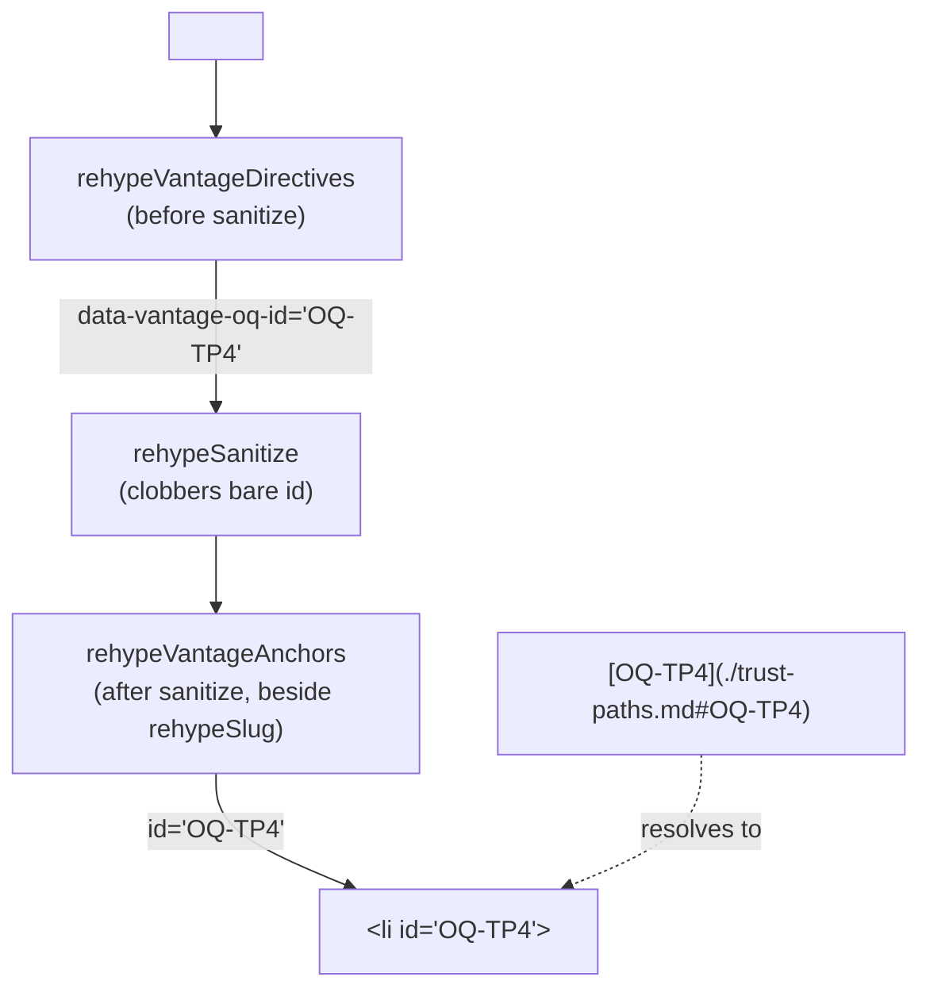

# Linked references — making OQ ids, § refs and filenames clickable, and erroring when they are not

**Status:** DECIDED (2026-09-04). Nothing built yet; every question ruled.

**The short version.** Our docs are full of references written as plain text —
`OQ-TP4`, `§4.1`, `` `agent-cli.md` `` — that read like pointers and behave like
prose. A new `ref/*` rule family in `vantage-check` errors when one of those
appears outside a link. Two of the three are cheap because the link target
already exists; the OQ one is not, because **an Open Question has no anchor
today** — `rehypeVantageDirectives` deliberately drops the directive's `id`
before it reaches the DOM. So this design is one renderer change (give an OQ a
real, navigable `id`) and three checker rules that make writing the reference
without the link an error.

**The most important section is [§4.1](#41-the-anchor-an-oq-id-has-to-survive-the-sanitiser)** — the
sanitiser ordering constraint is the one place this design can be built wrong in
a way that type-checks, passes its tests, and produces dead links in every
document.

**Reads with:** [`agent-cli.md`](agent-cli.md) (the checker's design, whose P1/P2
this extends), [`inline-markup.md`](../reference/inline-markup.md) (the
directive vocabulary as built).

---

## 1. Verdict, and the principles behind it

Build all three rules at `error`, and fix this repo's own corpus in the same
change. The rules are worth having only if they are on.

Three principles, cited by number later:

**P1. A reference is a link or it is a lie.** `OQ-TP4` in prose asserts that a
question by that name exists somewhere findable. If the reader cannot click it,
the assertion is unverifiable by the reader and unverified by anyone — which is
exactly how `OQ-TP4` outlives the question it names.

**P2. Only report when the tree has settled it.** Inherited from the existing
link rules ([`links.ts:20`](../../packages/vantage-check/src/rules/links.ts#L20)):
walk the AST, never the raw text, and stay silent on anything ambiguous. A
checker that invents one finding stops being run.

**P3. The rule may not require something the renderer cannot deliver.** Requiring
`[OQ-TP4](./trust-paths.md#OQ-TP4)` while `#OQ-TP4` resolves to nothing would
trade one broken reference for another. The anchor ships first, in the same
change.

---

## 2. What exists today

Verified against the code 2026-09-04.

| Piece | Where | What it does |
| :--- | :--- | :--- |
| `vantage/oq-missing` | [`directives.ts:1203`](../../packages/vantage-check/src/rules/directives.ts#L1203) | Errors on a 💬 question with a leaning and no `oq` directive |
| `link/dead-section-anchor` | [`links.ts`](../../packages/vantage-check/src/rules/links.ts) | Errors on a `#fragment` matching no heading in the target |
| `link/missing-target` | [`links.ts`](../../packages/vantage-check/src/rules/links.ts) | Errors on a relative link whose target is not on disk |
| `documentAnchors` | [`slugs.ts:57`](../../packages/vantage-check/src/core/slugs.ts#L57) | Heading slugs + hand-written HTML ids — the set a fragment may target |
| `oq` vocabulary | [`vantageDirectives.ts:209`](../../packages/vantage-md/src/vantageDirectives.ts#L209) | `{ id: null, leaning: null }` — `null` meaning "free text, no closed set" |

Two facts do the shaping.

**An OQ id never reaches the DOM.** `stampOq` sets `data-vantage-oq` and
`data-vantage-leaning` and drops `id` on purpose
([`rehypeVantageDirectives.ts:322`](../../packages/vantage-md/src/rehypeVantageDirectives.ts#L322)):
*"`id` resolves and is deliberately not stamped: nothing in the DOM reads it …
an attribute nobody reads is a sanitiser entry bought for nothing. It stays in
the source for the checker and for `rg`."* That reasoning was correct when the
id had no reader. This design gives it one.

**Definition sites are not headings.** The convention writes a question as a
bold list item — `1. **OQ-1: Should the gallery live under docs/?**` — so it
gets no slug from `rehype-slug` either. There is no fallback anchor to point at.

### 2.1 The corpus, measured

Counted across `docs/`, `userguide/`, `README.md`, `AGENTS.md`, `roadmap.md` on
2026-09-04:

| Reference kind | Total | Already linked | Would become findings |
| :--- | ---: | ---: | ---: |
| `§N` section refs | 145 | 39 | 106, across 9 files |
| Filename in inline code, resolvable doc-relative | 306 file-ish | — | 63, across 8 files |
| Filename, resolvable doc-relative *or* repo-root | 306 file-ish | — | 106, across 14 files |

The last row is why [§4.4](#44-refunlinked-file) resolves doc-relative only.
Repo-root resolution turns every passing mention of `package.json` in a document
five directories down into a demand to link one specific manifest out of the
four in this workspace.

---

## 3. The gap

`link/*` already answers *"does this link work?"* — every one of them. Nothing
answers *"should this have been a link at all?"*, and that is where the rot is:
a reference written as text cannot be dead, so no rule can ever notice it went
stale. The 106 unlinked `§N` refs in our own tree are not broken today; they are
unfalsifiable, which is worse, and three of them already name section numbers
that moved.

---

## 4. The proposed shape

Four rules and one renderer change. The renderer change is what makes the first
rule requirable at all (P3).



### 4.1 The anchor: an OQ id has to survive the sanitiser

> [!WARNING]
> Stamping a bare `id` inside `rehypeVantageDirectives` is the obvious
> implementation and it is wrong. The plugin runs **before** `rehypeSanitize`
> (it must — it reads HTML comments, which the sanitiser deletes), and the
> sanitiser's default schema clobbers `id` with the prefix `user-content-`.
> `rehypeSlug` is registered *after* the sanitiser for exactly this reason
> ([`pipeline.ts:19`](../../packages/vantage-md/src/pipeline.ts#L19)). A bare
> `id` stamped early becomes `user-content-OQ-TP4`, every `#OQ-TP4` link in
> every document dies, and nothing errors anywhere.

The id therefore travels in two hops:

1. **Before sanitize**, `stampOq` sets `data-vantage-oq-id` alongside the
   attributes it already sets. The schema allowlists it **by pattern**, not by
   name alone — the same treatment `data-vantage-collapse-group` gets
   ([`sanitize.ts:252`](../../packages/vantage-md/src/sanitize.ts#L252)) — so a
   document cannot smuggle an arbitrary `id` into the page through raw HTML.
2. **After sanitize**, a promotion step registered beside `rehypeSlug` moves
   `data-vantage-oq-id` onto `id` and removes the data attribute.

Ordering against `rehypeSlug` is **before it**, and this is a behavioral choice,
not a detail: `rehype-slug` skips an element that already has an `id`, so
promoting first means a question written as a heading keeps its OQ id rather
than acquiring a slug. Where both could apply, the OQ id wins.

**The id is stamped verbatim**, case preserved — `#OQ-TP4`, not `#oq-tp4`.
Heading slugs are lowercased by `github-slugger`; OQ ids are author-chosen
tokens that already appear verbatim in prose, and a reference that reads
`OQ-TP4` should link to `#OQ-TP4`. HTML ids are case-sensitive, so the two
namespaces cannot collide by accident.

**Degenerate cases:**

- **Two `oq` directives with the same id in one document** — the second is a
  duplicate `id` in the DOM and `#id` resolves to the first. The renderer stamps
  both (it has no cross-document memory and must stay a pure per-node stamp);
  the *checker* reports it, see [§4.5](#45-vantageoq-id-format-and-vantageoq-id-duplicate).
- **An `oq` directive with no `id`** — legal today and stays legal. It gets a
  button and no anchor. Nothing to promote, nothing to report.
- **An `oq` whose target is not a host tag** — already `vantage/orphan`. No
  anchor is stamped on a target that never renders, because the stamp happens on
  the resolved target or not at all.

### 4.2 The id grammar

```
OQ-<prefix?><digits>      prefix: [A-Z][A-Z0-9]{0,5}
```

`OQ-9`, `OQ-TP6`, `OQ-A03` are valid. `OQ-foo`, `OQ-tp6`, `OQ-` are not. `OQ6`
with no hyphen is not recognised as a reference at all — it is not the
convention and inferring it would fire on ordinary prose.

The optional prefix is what makes an id unique once documents reference each
other's questions: `trust-paths.md` `OQ-4` and this document's `OQ-4` are
different questions, and a bare number cannot say which one a cross-doc
reference means. **A document that references another document's questions
should use prefixed ids in both.** That is guidance, not a rule — nothing
mechanically detects that two files' bare ids have started colliding, and a rule
that demanded prefixes everywhere would fire on every single-document design
sketch, which is most of them.

### 4.3 `ref/unlinked-oq` and `ref/unlinked-section`

Both rules have the same shape. Walk the mdast; for each `text` and `inlineCode`
node **not inside a `link`**, find matches of the reference pattern; report each.

- `ref/unlinked-oq` — pattern `OQ-<prefix?><digits>` per [§4.2](#42-the-id-grammar).
- `ref/unlinked-section` — pattern `§` followed by digits and dot-separated
  digits (`§4`, `§4.1`, `§10.2.3`).

**What is not a reference,** and must never be reported:

| Not a reference | Why |
| :--- | :--- |
| The definition site — the paragraph or list item the `oq` directive targets | It *is* the question; a self-link is noise |
| Text inside the `<!-- vantage: … -->` comment | Comments are not mdast text nodes, so this is structural, not a special case |
| A heading's own number — `## 4.1 The id grammar` | A heading names itself; `§`-prefixed references are the ones that point elsewhere |
| Anything inside a fenced code block | `code` nodes are not `text` nodes (P2) |
| Any occurrence already inside a `link` node, at any depth | That is the state the rule wants |

**Both rules check that the link points at the right thing.**

For `ref/unlinked-oq` this is two-tier, because an OQ has two lifecycle phases
and only the first one has an anchor:

- **In flight** — the question is a live `oq` directive, so `#OQ-4` resolves.
  A reference whose fragment equals the id is checked by
  `link/dead-section-anchor` for free.
- **Compacted** — the question is a Decision Ledger row and the directive is
  gone, so nothing declares `OQ-4` any more. The reference must still be a link,
  and its fragment must still resolve *somewhere* in the target document —
  `#decision-ledger` being the honest target. The rule does not demand a
  fragment equal to the id, because after compaction no such anchor exists.

> [!NOTE]
> This two-tier shape is not elegant and it is not an oversight. Compaction
> deliberately destroys the `oq` directive — that is what compaction is — and
> nothing should reintroduce a per-row anchor just to keep a fragment alive.
> Writing `<a id="OQ-4"></a>` into a ledger cell does not work either: raw HTML
> ids are clobbered to `user-content-OQ-4` by the sanitiser, the same trap
> [§4.1](#41-the-anchor-an-oq-id-has-to-survive-the-sanitiser) is about, and the
> checker's `htmlAnchors` would accept it while the viewer refused to navigate
> to it.

For `ref/unlinked-section`, the rule resolves `§N` against the target document's
headings: a heading whose text begins with that number followed by a `.` or a
space. A link pointing at a different heading is a finding. When the target has
**no numbered headings at all**, the rule requires the link and says nothing
about where it points — an unnumbered document has no §N to resolve against, and
guessing would invent findings on every doc that never adopted the convention.

**Degenerate cases:**

- **`OQ-TP4` referenced but declared nowhere** — the link is required, and
  `link/dead-section-anchor` (same doc) or `link/missing-target` (cross-doc)
  reports the dangling target. `ref/*` does not re-report it; one finding per
  defect.
- **A reference inside a table cell, blockquote, or list item** — all contain
  `text` nodes; all are checked. Depth is irrelevant.
- **A reference inside emphasis inside a link** — the ancestor test is
  "any `link` ancestor", not "immediate parent".
- **`§` with no digits** (`§`, `§ 4`) — not matched. The space form is rare
  enough that matching it would cost more in false positives than it catches.

### 4.4 `ref/unlinked-file`

Fires on a `text` or `inlineCode` node, outside a link, whose content is a bare
path-shaped token that **resolves to an existing file relative to the document's
own directory**. Repo-root resolution is deliberately not attempted
([§2.1](#21-the-corpus-measured)).

The token must look like a path — no whitespace, at least one dot, a 1–6
character extension. `agent-cli.md`, `../design/agent-cli.md`,
`scripts/build-wheel.py` qualify. `just build`, `v0.5.4`, `8.0` do not.

**Degenerate cases:**

- **The document's own path** — never reported. A doc naming itself is not a
  reference.
- **A directory that exists** — not reported. The rule is about files; a
  directory mention is usually a location, not a pointer.
- **A token inside a fenced block or a shell snippet in inline code** — a fenced
  block is structurally exempt; inline code containing whitespace fails the
  path-shape test, which is what keeps `` `npm ci` `` and
  `` `git config core.hooksPath` `` silent.
- **A generic manifest name that happens to resolve** — `` `package.json` `` in
  a root-level document still fires, and gets linked rather than exempted. An
  exemption list of "generic" manifest names would be a second vocabulary
  maintained against nothing in particular, and in a repo that serves its own
  files a link to `go.mod` is genuinely useful. Revisit if it hurts in a repo
  carrying more manifests than this one.

**The link must point at the file it names.** `` `agent-cli.md` `` written as
`[agent-cli.md](./pypi-distribution.md)` is a finding: the rule resolves both the
token and the link target against the document's directory and compares them.
Unlike the section case this has nothing to trip over — both sides are paths,
and the file provably exists.

### 4.5 `vantage/oq-id-format` and `vantage/oq-id-duplicate`

Two small rules on the declaration side, in the existing `vantage/*` family
because their subject is our own markup:

- **`vantage/oq-id-format`** (error) — an `oq` directive whose `id` is outside
  [§4.2](#42-the-id-grammar). Today `id` is `null` in the vocabulary — free text
  with no closed set — so anything at all is accepted silently.
- **`vantage/oq-id-duplicate`** (error) — the same `id` on two `oq` directives in
  one document. The second is an unreachable anchor, which makes every reference
  to it silently land on the wrong question. This is the one failure the reader
  cannot detect: the link works.

### 4.6 What each rule defaults to

| Rule | Default | Why |
| :--- | :--- | :--- |
| `ref/unlinked-oq` | `error` | P1; the anchor exists, so there is always a correct form |
| `ref/unlinked-section` | `error` | P1 |
| `ref/unlinked-file` | `error` | P1, and the target provably exists |
| `vantage/oq-id-format` | `error` | The parsed tree settles it |
| `vantage/oq-id-duplicate` | `error` | Produces a working link to the wrong place |

All five are configurable per-repo through the existing `[check.rules]` table in
`.vantage.toml`, like every other rule. `ref` is a new namespace and is **not**
an open namespace — an unknown `ref/*` id in config is a typo, same as
`link/*`.

### 4.7 What ships alongside the code

- **The style guide** ([`styleGuide.ts`](../../packages/vantage-md/src/styleGuide.ts)),
  which is the canonical convention text the `style-guide` command prints: the
  id grammar, the anchor, and the rule that a reference is a link.
- **`userguide/guides/vantage-check.md`**, which lists the rules.
- **This repo's corpus** — 106 `§` refs and 63 filename mentions, in the same
  commit as the rules ([§6](#6-sequencing)).
- **The `vantage-docs` skill** is user-level and read-only from inside the jail.
  Its §2 says "Stable ID (`OQ-N`)" and needs the prefixed form added. This is
  the one deliverable that has to be applied host-side by hand.

---

## 5. What this does NOT propose

- **No auto-fixing.** `--fix` stays what `agent-cli.md` §5.4 scoped it to:
  mechanical, unambiguous rewrites. Choosing which heading `§4.1` meant is not
  mechanical, and a `--fix` that guesses wrong rewrites a correct document into
  a plausible lie.
- **No cross-document OQ index.** The checker does not build a registry of every
  OQ id in the tree. Each reference is validated through the link it carries,
  which is a per-file question with a per-file answer.
- **No rule requiring prefixed ids** ([§4.2](#42-the-id-grammar)).
- **No prose or structure opinions.** Unchanged from `agent-cli.md` §6: the
  checker does not judge whether a term is defined or whether questions have
  been compacted.
- **No new link syntax.** References use ordinary Markdown links. Nothing here
  introduces `[[wiki]]` forms or an `@OQ-4` shorthand.

---

## 6. Sequencing

What I would build, in order. Each step leaves the gate green.

1. **The anchor.** `data-vantage-oq-id` through the schema, the promotion step
   after sanitize, the ordering against `rehype-slug`. Frontend tests cover
   `vantage-md` through the source alias, per `AGENTS.md`.
2. **The checker's view of it.** `documentAnchors` learns OQ ids, so
   `link/dead-section-anchor` validates `#OQ-TP4` before any rule requires it.
   At this point a hand-written OQ link works end to end and nothing errors yet.
3. **`vantage/oq-id-format` and `vantage/oq-id-duplicate`.** Declaration-side,
   small, and they clean the ids before anything references them.
4. **The three `ref/*` rules with the corpus fix.** One commit: rules at
   `error`, tests, and the ~170 corpus edits that make the gate pass with them
   on.
5. **The conventions.** Style guide, user guide, and the note that the skill
   needs a host-side edit.

---

## 7. Risks

| Risk | Mitigation |
| :--- | :--- |
| The bare-`id` trap in [§4.1](#41-the-anchor-an-oq-id-has-to-survive-the-sanitiser) is taken and every OQ link dies silently | A test asserting the rendered id is exactly `OQ-1`, not `user-content-OQ-1` — the failure is invisible without it |
| `ref/unlinked-file` fires on generic manifest names | Doc-relative resolution only; accepted residue in [OQ-2](#decision-ledger) |
| The corpus fix mislinks a `§` ref to the wrong section | `link/dead-section-anchor` catches a *dead* target but not a *wrong* one; [OQ-1](#decision-ledger) decides whether the rule closes that hole |
| A `ref/*` error blocks an unrelated commit on a doc nobody is editing | The whole corpus is fixed in the same commit, so the steady state is zero findings |
| Quadratic cost on a long Open Questions list | These rules walk the tree once and do no re-parsing, unlike `vantage/block-split` — no new cost of that shape |

---

## 8. Success criteria

- A `<!-- vantage: oq id=OQ-4 … -->` in a document produces an element with
  `id="OQ-4"` in the rendered page, and `#OQ-4` scrolls to it in the viewer.
- `[OQ-4](#OQ-4)` and `[OQ-TP6](./trust-paths.md#OQ-TP6)` both pass the checker;
  changing either fragment to a name nothing declares fails it.
- Writing `OQ-4` or `§4.1` or `` `agent-cli.md` `` in prose, unlinked, fails the
  checker with a message naming the reference and the form it should take.
- `just check` is green on this repo with all five rules at `error`.
- `uvx vantage-check style-guide` prints the id grammar and the linking rule.

---

## Decision Ledger

| ID | Ruling / Decision | Date | Settled in |
| :--- | :--- | :--- | :--- |
| OQ-1 | `ref/unlinked-section` resolves `§N` to the heading beginning with that number and reports a mismatch; silent when the target has no numbered headings | 2026-09-04 | [§4.3](#43-refunlinked-oq-and-refunlinked-section) |
| OQ-2 | No exemption list — a resolvable manifest name is a finding and gets linked | 2026-09-04 | [§4.4](#44-refunlinked-file) |
| OQ-3 | `ref/unlinked-file` compares the resolved link target to the resolved token | 2026-09-04 | [§4.4](#44-refunlinked-file) |
| OQ-4 | A compacted OQ has no `#id` anchor; the reference links to the ledger instead, and the rule requires only that the fragment resolve | 2026-09-04 | [§4.3](#43-refunlinked-oq-and-refunlinked-section) |

> [!NOTE]
> OQ-4 was not in the original draft. It surfaced while compacting this very
> document: three body references pointed at `#open-questions`, that section
> became the ledger, and the rule being designed had no answer for what a
> reference to an already-compacted question should link to.
