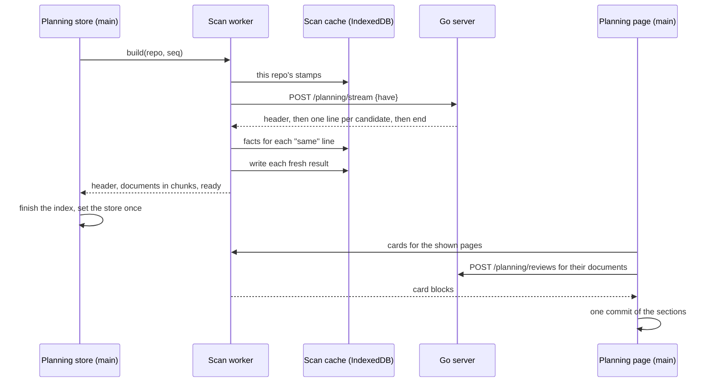

# The planning index at scale — page through it, and never hand the page the corpus

**Status:** DECIDED, 2026-09-29. Both questions are ruled; nothing is built. Evidence verified
against the tree at `70a05b3`; the timings are the 2026-09-29 measurements summarized in
[§2](#2-what-the-measurements-say).

> **In short.** `g p` is slow because the planning page renders every card before it paints,
> and the index is slow because the browser scans the whole corpus, fetched as one string, on
> its main thread. Render one page of each section from card blocks the scan already cut, and
> scan in a worker fed only the files that changed, and nothing on the way to a paint grows with
> the repository.

**Why it matters.** On 2026-09-29 `g p` changed the URL and then nothing moved for 5+ seconds on
a large repository. The fits put that at 5.8 s for 300 documents and 18.8 s for 1,000, with a
21 MB body on every page load and a heap near 300 MB.

**The shape.** A scan worker behind a scanner client, a scan cache keyed by content hash, one
stream endpoint that sends only what changed, and a planning page that paints its frame first
and then each section's current page in one commit.

**Cost.** The batch endpoint, `ready.sources` and the card's second parse are deleted. A second
JavaScript chunk ships (about 87 KB gzipped), and the browser keeps each file's derived facts and
card text ([§8](#8-the-scan-cache)). [`planning-index.md`](planning-index.md) gets a dated
pointer in each section this changes ([§14](#14-what-this-changes-in-the-planning-index-design)).

**Start at [§4](#4-the-three-costs-and-what-removes-each)**, the three costs and what removes
each. Everything else is how.

**Needs your ruling:** None.

**Reads with:** [`planning-index.md`](planning-index.md) (the design this amends) and
[`planning-index-at-scale-plan.md`](planning-index-at-scale-plan.md) (the build plan, completed
against the tree and build-ready).

---

## 1. Verdict, and the principles

Build both halves, and ship them in one release ([§18](#18-sequencing)). Paging alone fixes
`g p` once the index is built, but it still fetches the whole corpus as one string, scans it on
the main thread (a 1 MiB file is a single half-second task) and keeps it in memory: the "bomb" is
still there. The worker alone leaves `g p` rendering every card before it paints. Neither half
is worth shipping without the other.

The principles, numbered so later sections can cite them:

- **S1. A paint waits only on work bounded by what it shows.** No work on the way to a paint
  grows with the number of documents, apart from deriving the sections, which takes
  0.4–1.5 ms at 1,005 documents.
- **S2. The main thread never holds the corpus's text.** It holds facts about planning documents
  and the Markdown of the cards on screen, and nothing else from the files.
- **S3. Only what changed crosses the wire.** A file whose content hash the browser already
  knows is answered with its hash, not its text.
- **S4. One parser, in TypeScript** ([P4](planning-index.md#1-verdict-and-the-principles)). The
  scan is vantage-md's, now run inside a worker. The Go server lists, reads, hashes and streams
  bytes. It never parses Markdown.
- **S5. Late data never moves painted content** (the user's rule, 2026-09-29). What arrives after
  a paint goes into space reserved for it, room left over, or the next render the reader causes
  ([§11](#11-late-data-never-moves-painted-content)).
- **S6. The file name wins** ([ruled 2026-09-28](planning-index.md#decision-ledger)). No late item
  narrows a file name, in the header, the tree or a card.

## 2. What the measurements say

Measured on `70a05b3`: the production bundle in headless Chromium at 1440×900, unless marked.
This repository has 41 candidates, 15 planning documents, 760 KB of Markdown and 6 cards. The
scale series used 15 to 60 renamed copies of four real documents: 20.4 KB and 3.75 cards per
document on average. The raw runs and harnesses sit outside the tree, in scratch worktrees.

| Cost | Measured | Grows with |
| :--- | :--- | :--- |
| `g p`, index ready, this repository | 97–117 ms cold, 83–103 warm, 57–66 revisit; dev 181–229. Frame, first card and last card land in **one paint** | cards |
| `g p`, index ready, 15 → 60 documents | 444–457 → 1,297–1,342 ms; fit 197 ms + 18.6 ms per document (r² ≥ 0.995), about 5 ms per card | documents |
| of which, a second parse of each listed document | about 7–9 ms per document; 32–33 ms of this repository's 97–117 | listed documents |
| of which, card Markdown | 28–37 ms here; each of [`agent-bootstrap.md`](agent-bootstrap.md)'s five cards renders the same 4,587-character list, 4.6 ms apiece | block size × cards |
| Scan on the main thread | 0.37–0.56 ms per KB: 256–335 ms of CPU here, 336–487 ms of wall time; a 1 MiB file is one task of about 0.5 s | candidate bytes |
| Transport | 6–14 ms for 0.8 MB, `JSON.parse` under 2 ms; sent uncompressed | bytes |
| JS heap after GC | 8.9 MB + 0.29 MB per document; cards cost about 61 KB each | documents, cards |
| Direct load of the page, 60 documents | the index lands, then every card renders in one synchronous task of 1,105–1,140 ms | cards |
| Late content | the page grows 80 px when a review comment lands, 10–40 ms after first paint, and 35 px when a Mermaid diagram draws | — |
| Document pages (earlier baseline) | layout shift after first paint 0.11–0.66 on planning documents; the index lands 375–586 ms after the document paints; the header's git info 45–140 ms after | — |

Extrapolated linearly from those fits: at 300 documents `g p` shows nothing new for 5.8 s and
the body is 6.4 MB; at 1,000 documents it is 18.8 s, 21 MB, about 300 MB of heap and 223,000
DOM elements.

**Why the URL changes and nothing else does.** React Router 7's `BrowserRouter` wraps every
navigation in a [transition](https://react.dev/reference/react/startTransition), so React leaves
the old page on screen under the new URL until the planning page's whole tree has rendered and
committed. Every card renders first, and nothing paints until the last one is done.

Measured for this design, on this repository with Bun 1.4:

- **The second parse is as costly as the scan.** Scanning all 42 candidates took 277–286 ms, and
  parsing just the 15 planning documents again took 241–254 ms. That second parse is what builds
  each card's outline today.
- **Walking a root that is already parsed costs 0.29 ms** for the five largest planning
  documents (230 KB). That is what cutting card blocks inside the scan costs
  ([§7.4](#74-card-blocks-cut-from-the-scans-own-parse)).
- **The facts are small.** 2.8 KB of JSON per planning document, 84% of it links. The six cards'
  Markdown is 25,148 characters, of which 6,800 are distinct.
- **The worker chunk would be 300 KB minified, 87 KB gzipped** (a `bun build` of the scan
  entry), with no KaTeX, highlight.js or React in it.

From the three proposals' own runs, in headless Chromium: an IndexedDB put of 840 records
(2.8 MB) took 50–69 ms; reading every stamp 3.3–7.5 ms; reading every document 20–23 ms for
2.14 MB and 36–38 ms for 4.27 MB; 30 single reads 0.9–1.2 ms. A structured clone of 300
documents' facts took 6.4–6.7 ms. In Go on this repository, listing took 0.78–1.13 ms, reading
and hashing all 44 candidates 0.73–0.87 ms, and SHA-256 of 20 MiB 12.5 ms.

## 3. Terms

Every term here is *coined here* unless it links elsewhere. The planning index's own terms,
[planning index](planning-index.md#3-the-planning-index),
[candidate and planning document](planning-index.md#31-which-files-it-reads),
[live question](planning-index.md#33-a-question) and
[routed](planning-index.md#61-the-roadmap), keep their meanings.

| Term | Means | Is not |
| :--- | :--- | :--- |
| **Scan worker** | The one dedicated [Web Worker](https://developer.mozilla.org/en-US/docs/Web/API/Web_Workers_API) per tab that runs vantage-md's planning scan | a Service Worker, or anything on the server |
| **Helper** | An extra worker the scan worker uses during a cold build, then discards ([§7.5](#75-helpers-for-a-cold-build)) | a second scan worker; a helper writes nothing |
| **Scanner client** | The main-thread object the planning store calls to build, refresh and fetch cards. The *inline client* runs the same code on the main thread | the store; the store still owns ordering |
| **Content hash** | The first 128 bits of [SHA-256](https://csrc.nist.gov/pubs/fips/180-4/upd1/final) over a file's bytes, as 32 lowercase hex digits | a modification time |
| **Scan cache** | The browser's [IndexedDB](https://developer.mozilla.org/en-US/docs/Web/API/IndexedDB_API) database of scan results, one per candidate, keyed by content hash ([§8](#8-the-scan-cache)) | an HTTP cache |
| **Scanner id** | The version of the code that produced a scan result ([§8.2](#82-the-scanner-id)) | the app's release version |
| **Warm build** | A build that starts with at least one scan-cache entry for its repository under the current scanner id. Any other build is **cold** | a build that happens to be fast |
| **The stream** | `POST …/planning/stream`'s answer, [NDJSON](https://github.com/ndjson/ndjson-spec): one JSON object per line ([§6.1](#61-the-stream)) | the old batch, which was one JSON object |
| **Card block** | The Markdown a question's card renders and its line offset, exactly what `questionCardSource` returns today | the question's unit, the `<li>` inside it |
| **Frame** | The planning page's header, section bar and notices, painted first | the sections |
| **Section bar** | One line under the header naming each non-empty section with its exact count | a pager |
| **Page** (of a section) | A fixed run of one section's entries, chosen by a URL query parameter ([§10.2](#102-pages)) | a browser page |
| **Page inputs** | What the shown pages' cards need before they may paint: their card blocks, their documents' reviews, and their Mermaid diagrams drawn | the index |
| **Preview card** | A card drawn from the index alone, for a question whose card block is too large to render unasked ([§10.4](#104-cards)) | a summary shown instead of every card |
| **Placement** | Matching a comment to a listed question by its anchor line, for a card that has not been rendered ([§10.5](#105-comments-and-copy-answers)) | the card's own scoping, which reads the rendered block |
| **The hold** | A document's first paint waiting, at most 150 ms, for data already on its way ([§11.3](#113-the-hold)) | a wait for a cold build |

A **long task** is a main-thread task over 50 ms ([Long Tasks API](https://w3c.github.io/longtasks/)).
**CLS** is the browser's score for how far painted content moved
([cumulative layout shift](https://web.dev/articles/cls)).

## 4. The three costs, and what removes each

| Cost | What causes it | What removes it |
| :--- | :--- | :--- |
| **Every card renders before anything paints** | The router's transition waits for the whole page. Every card renders, and each listed document is parsed a second time to cut its card ([`cardSource.ts`](../../packages/vantage-md/src/planning/cardSource.ts#L97-L139)) | The frame paints first ([§10.1](#101-frame-first)). Then each section shows one page of at most 10 cards and 32 KiB of Markdown ([§10.2](#102-pages)), cut from blocks the scan already made ([§7.4](#74-card-blocks-cut-from-the-scans-own-parse)), and the cards are memoized ([§10.4](#104-cards)) |
| **The index is built on the main thread from one string, on every load** | `axios.get` of the whole batch ([`usePlanningStore.ts`](../../frontend/src/stores/usePlanningStore.ts#L297-L301)), then a scan sliced at 8 ms ([`:212-238`](../../frontend/src/stores/usePlanningStore.ts#L212-L238)), and nothing kept across loads | The scan worker ([§7](#7-the-scan-worker)), reading the stream one line at a time ([§6.1](#61-the-stream)), with the scan cache making a warm load scan almost nothing ([§8](#8-the-scan-cache)) |
| **The corpus is held in memory** | The batch string, then `ready.sources`, which keeps every planning document's text for the session ([`:55-56`](../../frontend/src/stores/usePlanningStore.ts#L55-L56)), plus every card's DOM | No text on the main thread ([§9](#9-the-index-on-the-main-thread)); card blocks fetched for the shown pages only; quoted context fetched for pending answers only ([§10.5](#105-comments-and-copy-answers)) |

The server's part is small and stays within P4: it hashes what it already reads, and sends a
file's text only when the browser's hash disagrees.

## 5. The shape

### 5.1 Components

| Component | Runs in | Owns, as the one writer | New |
| :--- | :--- | :--- | :--- |
| Stream endpoint | Go server | nothing: it reads files and writes lines | new |
| Single-path mode | Go server | nothing | gains `hash` |
| Reviews batch | Go server | nothing: it reads the review store | new |
| Scan worker | a dedicated worker | the scan cache | new |
| Helpers | up to 3 workers, during a cold build only | nothing | new |
| Scanner client | main thread | the scan worker's lifetime | new |
| Planning store | main thread | the index on screen, and every ordering decision | changed |
| Planning page | main thread | its page parameters (in the URL) and its page-inputs cache | changed |
| Scan cache | IndexedDB, per origin | written only by the scan worker | new |



### 5.2 A build, step by step

Warm and cold are one algorithm. A cold build simply has nothing to send as `have`.

1. The store numbers the build (`seq`), exactly as it numbers a batch today, and calls
   `build(repo, seq)` on the scanner client.
2. The scan worker opens the scan cache ([§8](#8-the-scan-cache)) and reads this repository's
   stamps (path, hash and kind, no facts). It tells the store whether the build is warm, which is
   what the hold reads ([§11.3](#113-the-hold)).
3. It posts the stamps as `have` to the stream, and meanwhile reads this repository's stored
   facts.
4. The header line carries the config, the candidate count and the refusal. The store starts a
   builder from it.
5. For each later line:
   - `same`: the stored result is used. If it is missing (another tab collected it in between),
     the file is fetched through the single-path mode and scanned;
   - `file`: the file is scanned once, for its facts and its card blocks, and the result is queued
     for the cache;
   - `skipped` or `unreadable`: recorded as it is.
6. Results reach the store in chunks of at most 100 documents or 256 KiB (a single larger
   document travels alone), so no message costs the main thread more than about 3 ms to receive.
7. At `end` the worker posts `ready`. Once idle, it deletes this repository's cache entries that
   the stream did not name.
8. The store finishes the index (one sort), replays the changes it held while the build was out,
   and sets the store once. No partial index is ever shown, because a partial index would quietly
   under-report ([planning-index.md §3.5](planning-index.md#35-limits-and-what-happens-past-them)).

**A superseded build** (a rescan sent while it was out) is cancelled. The worker aborts its fetch
and drops anything not yet posted. Cache writes already made stay, because every one is a pure
function of the file.

### 5.3 A change push

It works as today, with one hop added. The store numbers a refresh and asks the scanner client.
The worker fetches the single-path mode ([§6.2](#62-one-path)), scans the file, writes the cache
and answers with a *scanned entry*: today's one-path answer with the text replaced by the scan
result. The store then applies it under exactly today's rules.

### 5.4 Ordering

**The store's request numbering, held changes and removal guards
([`usePlanningStore.ts`](../../frontend/src/stores/usePlanningStore.ts#L135-L173)) stay on the
main thread, unchanged.** The worker makes no ordering decision of its own. It answers each
request, and the store decides which answer wins, just as it decided between fetch responses.

A worker is one thread: a refresh that arrives during a build runs between two files, so it waits
at most one file's scan. Builds for different repositories in daemon mode interleave the same way.

## 6. The server

### 6.1 The stream

`POST /api/planning/stream`, and `/api/r/{repo}/planning/stream` in daemon mode.

**Request.** `{"have": {"docs/a.md": "<content hash>", …}}`. An empty object, or no body, asks
for a cold build. The body is capped at 1 KiB per `max-candidates`, and never below 4 MiB; a
larger one is refused with `413`. A `have` entry costs its path and about 40 B more, so a
repository at its limit fits with room to spare, and raising the limit raises the cap: a fixed
4 MiB answered every warm build past about 54,000 candidates with a `413`. A body that is not
that shape is a `400`. A path in `have` that is not a candidate is ignored. The candidates are
listed before the body is read, and the body is read one entry at a time, keeping only an entry
that could make a line `same` ([§6.4](#64-what-the-server-holds)).

**Response.** `200`, `Content-Type: application/x-ndjson`, `Cache-Control: no-store`, gzipped
at the fastest level when the request accepts gzip.

```json
{"kind":"header","config":{"roadmap":"roadmap.md","include":["**/*.md"],"exclude":[],"max_file_bytes":1048576,"max_candidates":5000,"stages":null},"candidate_count":41,"refused":false}
{"kind":"same","path":"AGENTS.md","hash":"9f86d081884c7d659a2feaa0c55ad015"}
{"kind":"file","path":"docs/design/a.md","hash":"60303ae22b998861bce3b28f33eec1be","content":"---\nstatus: draft\n---\n…"}
{"kind":"skipped","path":"docs/big.md","size":2097152}
{"kind":"unreadable","path":"docs/bad.md","reason":"not UTF-8"}
{"kind":"end","candidates":41}
```

- **One line per candidate, in listing order**, which is path order. A candidate that vanished
  between the listing and its read is left out, as today; the watcher reports its removal.
- **Every candidate is sent, whatever it holds.** The server never judges which files are
  planning documents: the scan's early exit
  ([`scan.ts:1005`](../../packages/vantage-md/src/planning/scan.ts#L1005)) does, in the worker,
  where a file that is not one costs microseconds (S4).
- **`same`** means the file was read within the limits, is UTF-8, and hashes to exactly what
  `have` gave for it. **The roadmap is never `same`**: it is always sent as `file`, so whether a
  file is the roadmap never has to be part of a cache key ([§8.1](#81-what-it-keeps-and-under-which-key)).
- **The config** is today's object, read the same way (`SettingsNow`, past the reload throttle).
- **Refused** past `max-candidates`: the header says `"refused":true`, then comes `end`, and
  nothing is opened.
- **A name that is not UTF-8** (Linux allows one) makes its candidate `unreadable`, *its name is
  not UTF-8*, and nothing is opened. JSON carries only UTF-8, so the name would arrive with the
  replacement character, U+FFFD, for each invalid byte: a path `?path=` never finds, and a result
  kept under it never `same`.
  Two names that differ only in those bytes still arrive as one path, twice.
- **`end` is mandatory.** A body without it, such as a dropped connection, is a failed build,
  never a smaller index.
- **Flushed** after the header and every 64 KiB, so the first line reaches the worker at once.
- **A client that goes away** stops the reading before the next candidate: the request's
  context is asked before each read. A failed write says so too late, since behind gzip the
  lines reach the connection only at the next 64 KiB flush, about 870 `same` lines.
- **Go's JSON encoder escapes every newline**, so a newline in the body always ends a line.

> [!NOTE]
> **There is no byte sieve** ([OQ-PS2](#decision-ledger)). Sending only the roadmap and the files
> that start with `---` or `+++` or contain `vantage:` looks like a free saving, and it is not
> one. It is a Go copy of the scan's early exit, which makes Go a second judge of what a planning
> document is, the thing S4 exists to prevent, and every new frontmatter form or sentinel would
> have to be taught to it too. What it would save is bytes on a cold build, and only where most
> files are not planning documents: here it passes 19 of 42 candidates, a third of the bytes, but
> on a docs site whose pages carry frontmatter it passes nearly everything. With the cache, a
> non-planning file already costs one `same` line per warm load. The ruling holds
> only while the reader's experience does not degrade for it, so
> [§19](#19-what-done-looks-like)'s D7 and D8 are measured with every candidate streamed.

The old batch, `GET …/planning/sources` without `path`, answers `410 Gone` with the detail *The
planning index moved to a stream; reload the page.* A tab loaded before the upgrade shows that
error with Retry, and a reload fixes it. That is cleaner than reusing the route, where the old
code would have read the new body as the wrong shape.

### 6.2 One path

`GET …/planning/sources?path=` stays exactly as it is ([`sources.go`](../../internal/planning/sources.go#L62-L85)),
and its `file` answer gains `hash`. Change pushes, Show question ([§10.4](#104-cards)) and quoted
context ([§10.5](#105-comments-and-copy-answers)) use it.

### 6.3 Reviews in one request

`POST …/planning/reviews` with `{"paths": [...]}` answers
`{"reviews": [{"path": "…", "review": {…}}]}`: one entry for each path that has a stored review,
in request order, each `review` exactly what `GET /review?path=` returns.

- The body is capped at 1 KiB per `max-candidates`, never below 1 MiB, and at `max-candidates`
  paths. It is read one path at a time, and the path past the limit is a `413` as soon as it is
  read.
- Each path is validated as `GET /review` validates it, and one that fails is left out.
- A store read error leaves that path out with a warning, as `GET /review` degrades to `null`.

It replaces the page's one `GET /review` per listed document
([`usePlanningReviews.ts`](../../frontend/src/hooks/usePlanningReviews.ts#L82-L112)). A
`review_changed` push still refetches its one document through `GET /review`.

### 6.4 What the server holds

- **Memory:** one file, its JSON encoding, the gzip window, the kept `have` and the candidate
  list. Nothing is proportional to the corpus's bytes, nor to the body's: an entry for a path
  that is no candidate, for the roadmap, or with a value that is no content hash's spelling is
  dropped as it is read, so the kept `have` is at most one path and 32 digits per candidate.
  Decoded whole, a body of short distinct keys held about 4.4 times its size, 18.6 MB for one
  just under 4 MiB.
- **CPU:** it reads and hashes every candidate on every build, the same reads as today plus a
  hash, measured at about 1 ms per MB. That is about 1 ms here and an estimated 20–30 ms at 21 MB.
- **No state between requests.** A stat-keyed hash memo would make warm builds stat-only, and is
  deferred until a measurement asks for it ([§16](#16-alternatives-considered)).

## 7. The scan worker

### 7.1 Lifecycle

- **Created once per tab at app boot**, as soon as static mode is known and is off. A static
  export never creates one. One worker serves every repository in daemon mode, and its start
  (20–40 ms) overlaps `/api/repos`.
- **Its own chunk.** A module worker built by Vite from the same `vantage-md/planning` source
  alias the app uses, so there is still one implementation (S4). It carries remark and yaml a
  second time: about 300 KB minified, 87 KB gzipped.
- **This reverses the store's recorded "No Worker"**
  ([`usePlanningStore.ts:224`](../../frontend/src/stores/usePlanningStore.ts#L224)), whose reason
  was a corpus of this repository's size. The corpora that matter now are 300 to 1,000 documents.
- **If it cannot be created**, the scanner client is the inline one ([§7.6](#76-the-inline-client)).
  That covers a worker whose code never loads, which is how it happens in practice: a network
  error, a chunk the server no longer has, a content security policy, or a browser without module
  workers. The browser still creates the worker, and reports the failure later as an `error`
  event. So the worker posts `hello` once its code has loaded, and the client counts an `error` or
  `messageerror` before that `hello` as *cannot be created*. The builds and requests already sent
  to that worker go to the inline client, and so does everything after them.
- **If it dies mid-build** (an `error` or `messageerror` event after its `hello`), that build fails
  with *The planning scan stopped*, and Retry starts a new worker. A refresh in flight is dropped,
  and the next push for that path asks again, as a failed fetch does today.
- **If it dies idle,** the next request starts a new worker, which has seen no header. So each
  `refresh` and `cards` request carries the config of the last header the client relayed for its
  repository. A worker uses it only while it has heard no header of its own, so a push after the
  death still scans under the repository's config.
- **Never terminated** while the tab lives. Idle, it holds its code and no documents.

### 7.2 Messages

Every message is plain JSON-able data, which the planning module already promises
([`index.ts`](../../packages/vantage-md/src/planning/index.ts#L1-L15)).

| Direction | Message | Answer |
| :--- | :--- | :--- |
| main → worker | `build {repo, apiBase, seq, bypassCache}` | `started {seq, warm}`, `header`, `documents` (repeated), `progress` (at most every 100 ms), then `ready` or `failed` |
| main → worker | `cancel {repo, seq}` | none |
| main → worker | `refresh {repo, apiBase, seq, path, config}` | `scanned {seq, entry}` or `failed` |
| main → worker | `cards {repo, reqId, want: [{path, hash, startLine}], full, config}` | `cards {reqId, blocks}`, each a block or `stale` |
| main → worker | `quotes {repo, reqId, want: [{path, hash, lines}]}` | `quotes {reqId, lines}` |
| main → worker | `helper-lost {seq, at}` ([§7.5](#75-helpers-for-a-cold-build)) | none; the worker reads that helper's lines again |
| worker → main | `hello`, once its code has loaded, from the scan worker and from each helper | none |
| worker → main | `helpers {seq, count}` ([§7.5](#75-helpers-for-a-cold-build)) | the main thread creates that many helpers and hands the worker one `MessagePort` for each |

`documents` carries planning documents with their hashes, plus unreadable results. A
not-planning file sends nothing.

### 7.3 Reading the stream

- The body goes through a text decoder into a line splitter. Each complete line is parsed,
  handled and dropped, so the worker holds at most one line and the start of the next. A line is
  at most `max-file-bytes` plus JSON escaping.
- **The next chunk is not read until the line is handled**, so while a large file is scanned,
  TCP holds the server back rather than anything buffering.
- **Cancellation is checked between lines.**
- **Any of these fails the build:** a line that does not parse, a kind it does not know, a
  missing header, or a body that ends without `end`. None of them is ever read as a smaller
  index.

### 7.4 Card blocks, cut from the scan's own parse

- **The scan cuts each question's card block from the root it already parsed**
  ([`scan.ts:1009`](../../packages/vantage-md/src/planning/scan.ts#L1009)), before `readAlerts`
  rewrites blockquotes (`:1013`). The rules are today's, from
  [`cardSource.ts`](../../packages/vantage-md/src/planning/cardSource.ts#L39-L76):
  - the root-level block holding the question;
  - the document's link reference definitions outside it, after one blank line;
  - a block holding a footnote gets the whole document, at offset 0.
- **One block per distinct root-level block.** The five
  [`agent-bootstrap.md`](agent-bootstrap.md) questions share one.
- **The facts gain two numbers per question:** `unitEndLine`, the last line of its unit, which
  placement needs; and `cardChars`, the length of its card block, which paging needs. The blocks
  themselves are not facts. They live in the scan cache, and in the worker's memory when there is
  no cache ([§8.4](#84-without-it)).
- **A block over 32,000 characters is not kept.** Its card is a preview card, and Show question
  asks the worker for it. The worker then fetches the file through the single-path mode, scans
  it, and cuts the block.
- **A request names its document's content hash.** A block from a different version of the file
  comes back `stale`, and the page then refreshes that path ([§10.3](#103-page-inputs-and-one-commit)).
- **The cost** is a walk over a root already parsed, measured at 0.29 ms for 230 KB, where
  today's second parse costs as much as the scan itself.
- **`questionCardSource` and its 32-document outline cache are deleted.** A test holds the new
  blocks equal, byte for byte, to the old function's output over `docs/` and the gallery.

### 7.5 Helpers for a cold build

A cold build at 1,000 documents is about 8–12 s of scanning on one thread. Helpers divide it.

- **When:** during a build, once the `file` lines the scan worker has received and not yet
  scanned exceed 2 MiB of content.
- **How many:** `min(3, hardwareConcurrency − 2)`, and none on a machine reporting two cores or
  fewer, where the main thread and the scan worker already take both.
- **Created by the main thread** at the worker's request, and connected to the scan worker by a
  [`MessageChannel`](https://developer.mozilla.org/en-US/docs/Web/API/MessageChannel). The main
  thread never sees their data, and nothing relies on nested workers.
- **Scheduling:** the scan worker hands each `file` line to whichever of itself and its helpers
  has the fewest bytes queued. A helper's queue is capped at 2 MiB. When every queue is full,
  the scan worker stops reading the stream, which holds the server back.
- **Helpers return results only.** The scan worker alone writes the cache and posts to the store.
  The store sorts at finish, so the order results arrive in does not matter.
- **A helper whose code never loads is dropped, and the build goes on.** The main thread sees an
  `error` before that helper's `hello` and sends the scan worker `helper-lost`, naming the helper
  by its place among the build's ports. The scan worker hands it nothing more. It fetches each
  line it had handed that helper again through the single-path mode, one at a time, since it kept
  none of their content. A helper that dies after its `hello` fails its build, as the scan
  worker's own death does.
- **Ended with the build**, whether it is ready, failed or cancelled.
- **Estimated gain:** 8–12 s down to 2.5–4 s at 1,000 documents with four threads.

### 7.6 The inline client

- **The same core** runs on the main thread: the stream reader, the scan and the cache, sliced
  at 8 ms as today.
- **It serves** unit tests (jsdom has no `Worker`, and no IndexedDB either:
  [§8.1](#81-what-it-keeps-and-under-which-key)) and browsers where the worker cannot be
  created, or its code cannot be loaded ([§7.1](#71-lifecycle)).
- **It is not a fallback for a worker that crashed.** A crash on some file would crash the page
  the same way.

## 8. The scan cache

### 8.1 What it keeps, and under which key

It is one IndexedDB database, `vantage-planning`, per origin. A daemon on `:8000` and a dev
server on `:8201` each have their own.

- **It keeps derived facts and card text** ([OQ-PS1](#decision-ledger)): each planning
  document's titles, headings, link targets and question state, and each question's card block,
  which is the document's own text. For a remote daemon that text sits in the browser profile on
  the reader's machine. It is text the same reader can already open, it is cleared whenever the
  scanner id changes ([§8.2](#82-the-scanner-id)), and it is never used without a matching hash.
- **What is kept is per file, never the index.** The index is still assembled on every page
  load, from the stream and these results. [planning-index.md §3](planning-index.md#3-the-planning-index)'s
  "never stored" therefore no longer holds for a file's scan result
  ([§14](#14-what-this-changes-in-the-planning-index-design)).
- **Behind a storage interface.** The cache's code reads and writes through a small storage
  interface, whose one production implementation is IndexedDB. Unit tests run the same code over
  an in-memory implementation written in this repository, and the Chromium end-to-end tests run
  it over real IndexedDB. The in-memory one is a test double only: a tab without IndexedDB
  behaves as [§8.4](#84-without-it) says, not as a memory-backed cache.

| Store | Key | Value | Read |
| :--- | :--- | :--- | :--- |
| `meta` | `"scanner"` | the scanner id | when the database opens |
| `stamps` | `[repo, path]` | `{hash, kind}`, plus `reason` for an unreadable file | every build, to make `have` |
| `documents` | `[repo, path]` | the planning document's facts | every warm build |
| `cards` | `[repo, path]` | `{hash, blocks}` | for the shown pages only |

- **A result is used only when the stream answers `same`** with the hash it was stored under.
  The key is content, so there is no modification-time race, a `git checkout` that rewrites
  every mtime costs nothing, and two repositories holding identical files are both right.
- **The roadmap is never stored.** The stream never answers `same` for it, so a roadmap setting
  that changes needs nothing special.
- **`repo`** is `""` in single-repo mode and the repository's name in daemon mode. A daemon
  restarted with a different repository under the same name is still served correctly, because a
  result depends only on the path and the content.
- **A record's stamp, document and cards are written in one transaction**, so they never
  disagree.

### 8.2 The scanner id

- **It is three parts, joined:** a schema number (bumped by hand when a stored shape changes), a
  source hash, and `navigator.userAgent`.
- **The source hash** is SHA-256 over every file the worker's code comes from:
  `packages/vantage-md/src/`, the one directory of `frontend/src/` that holds the worker's own
  code, and `package-lock.json`. A production build computes it once. The dev server recomputes it when one
  of those files changes, **so the dev server keeps a warm cache too**.
- **A production build fails** if the worker's build loads a module outside those roots
  (packages under `node_modules` are covered by the lockfile). That is what keeps the id honest.
  The check covers the build's whole module graph, not only the modules rendered into the bundle.
  A module whose one export is a constant has that constant inlined into its importer, and is then
  rendered nowhere.
- **The user agent** is in the id because `leadingMarker`'s `\p{L}` follows the browser's own
  Unicode tables. A browser upgrade therefore gives a new id.
- **A mismatch when the database opens clears every store,** and one cold build follows.

### 8.3 Writes, eviction and failure

- **Writes** go in transactions of 100 records, overlapped with scanning.
- **Garbage collection:** after `end`, the entries of this repository that the stream did not
  name are deleted with a cursor once the worker is idle. A refused build collects nothing.
- **If IndexedDB is missing, over quota or throws** (private windows, storage disabled), the
  worker logs it once and runs without a cache for the rest of the tab ([§8.4](#84-without-it)).
  An evicted database is simply a cold build.
- **A database this code cannot use is made again.** Such a database is at a later version, as a
  newer Vantage leaves it, or lacks one of its stores. Opening it would fail in every tab on every
  load, until the reader cleared the site's data. It is only a cache, so the open deletes it and
  opens once more. The tab runs without a cache only if that fails too, as when another tab holds
  the database open and will not let go.
- **Two tabs** may build the same repository at once. Every write is a pure result, so the last
  write wins and every write is right. Nothing coordinates them.
- **Two tabs on different code** hold different scanner ids, and the second to open clears the
  database and stamps its own. So every read and write reads `meta` in its own transaction, and
  touches no record unless `meta` still holds the id its tab opened with. Otherwise it aborts,
  which turns the cache off for that tab by the rule above. A tab on the older code then neither
  writes results the newer code would trust nor reads the newer code's results. The app reloads
  on a new server version, which makes this rare; it still happens to a tab whose websocket never
  reconnects.
- **Retry sends `bypassCache`**: no `have`, and every entry for the repository is rewritten.
- **A `.vantage.toml` push rescans with the cache.** No setting changes a scan result:
  `include` and `exclude` decide which candidates exist, `stages` enter only the derivations, and
  the roadmap is never cached.

### 8.4 Without it

A tab whose IndexedDB is missing, over quota or throwing
([§8.3](#83-writes-eviction-and-failure)) runs without the cache, and the rest of the design
stands:

- `have` is always empty, so every full page load is a cold build, in the worker.
- Moving between pages without a reload keeps the index, as today.
- Card blocks from this tab's builds stay in the worker's memory, in a cache of at most 8 MiB of
  text, least recently used first out. A miss fetches and scans the file.

[§20](#20-predictions) gives the numbers both ways.

## 9. The index on the main thread

- **`ready` loses `sources` and gains `hashes`**, one per planning document, which card and quote
  requests name.
- **The index is facts only**: 2.8 KB of JSON per planning document here, and an estimated
  5–7 KB for the scale series' link-heavy mix. It is proportional to planning documents, capped by
  `max-candidates`, and never to bytes of text.
- **Every consumer is unchanged**: link badges, Referenced by, the file tree, the `next` link and
  `derivePlanningSections`.
- **Model changes in vantage-md:**
  - the builder gains `addResult(path, result)`, which the existing `add` calls after scanning;
  - `applyScanned(index, entry)` applies a scanned entry, and `applySource` becomes scan then
    `applyScanned`, so `vantage-check` is unchanged;
  - `parseStreamLine` replaces `parsePlanningSources` and is just as strict.
- **`vantage-check index --format json`** shows the two new question fields. Its `version` stays,
  since nothing was renamed or removed.

## 10. The planning page, paged

### 10.1 Frame first

- **The route's first render is the frame and an empty sections region.** The frame is the
  header (Back, title, repository, and Copy answers with its reserved count), the section bar
  and the notices (*Nothing needs you*, no roadmap, no stages, refused). It commits inside the
  router's transition, so something visible changes about 20–45 ms after the keypress.
- **The section bar** is one line naming each non-empty section and its count, for example
  `Needs you 143 · Unrouted 12 · Waiting 7 · Ready 3 · Skipped 1`. Each entry jumps to its section
  without adding a history entry. The counts come from the index, never from rendering, so they
  are exact at first paint.
- **The sections fill the empty region** in one later commit ([§10.3](#103-page-inputs-and-one-commit)),
  below everything already painted.

### 10.2 Pages

| Sections | A page holds |
| :--- | :--- |
| Needs you, Unrouted, Waiting | 10 entries, and also stops early before its cards' Markdown passes 32 KiB. A Waiting document row counts as one entry and as no Markdown; a preview card counts as none |
| Ready, Graduate, Disagrees | 25 document rows |
| Skipped, Could not read | 50 lines |

- **Page boundaries come from the index alone**, from each question's `cardChars`, so they are
  known before anything is fetched. A page always holds at least one entry. This repository's six
  cards total 25,148 characters, so every section here fits on one page, as today.
- **The pager** sits under a section's heading and again after its last entry:
  `1–10 of 143 · ‹ Previous · Next ›`, plus a page select in a long section. Its height is fixed,
  its buttons are disabled at the ends, and a section of one page has no pager.
- **The URL carries the pages**: `/.vantage/planning?needs-you=3&waiting=2`, 1-based, with page
  1 left out. A flip replaces the history entry, so Back from Open document returns to the same
  pages and scroll position, and Back from the planning page leaves it rather than stepping back
  through pages.
- **Out of range:** a page past the end is clamped to the last one, a malformed value reads as 1,
  and either rewrites the URL in place.
- **A flip** keeps the current page on screen until the next page's inputs are ready, then swaps
  it in one commit. The bottom pager then scrolls its section's heading into view; the top pager
  leaves the scroll alone.
- **Prefetch:** the next page's inputs when the pointer or focus reaches a pager. Page 1's inputs
  on the `g` of `g p`, and on hover or focus of the toolbar's planning entry, once the index is
  ready. The usual gap between `g` and `p` hides both requests.
- **No infinite scroll, and no windowing.** The reader pages, as asked.

### 10.3 Page inputs, and one commit

- **The page inputs** for the shown pages are:
  - their card blocks, from the worker (30 cache reads take about 1 ms);
  - the reviews of the documents their cards and rows belong to, in one reviews request;
  - every Mermaid diagram in those blocks, drawn into the viewer's existing SVG cache, so the
    diagram renders at its full size on mount.
- **The sections render only from a complete set,** in one commit inside a transition. The
  render is time-sliced, and at most 30 cards and 96 KiB of card Markdown are committed.
- **A spinner** shows only if the wait passes 150 ms, so an ordinary visit never flashes one.
- **Deadlines:**
  - reviews, 1 s: the sections paint without comments, and comments that arrive later go only
    into each card's reserved count ([§11.2](#112-every-late-datum-and-where-its-space-comes-from));
  - Mermaid, 1 s: a diagram not drawn by then draws later into a fixed 240 px frame, scaled to
    fit.
- **A `stale` block** refreshes its path, and the previous page stays until the refresh lands and
  the blocks are asked for again.
- **An index update** (a push, a rescan) derives the pages again. The page on screen stays until
  the new set's inputs are ready, then changes in one commit. That is a change of data
  ([§11.1](#111-the-rules)), so the page may re-lay out.
- **Each set of inputs is cached** by repository, index version and page parameters, the last 8
  kept. Returning to a history entry whose inputs are cached renders the frame and the sections in
  one commit and then restores the scroll, so the page never flashes at the top first.

### 10.4 Cards

- **A card renders as today**: an embedded viewer over its card block, with everything outside
  the question's unit hidden. [planning-index.md §6.3](planning-index.md#63-a-question-on-the-page)
  holds for every card within the budget.
- **Memoized.** A card re-renders only when its own question, block, badge or document's
  comments change. Today's inline `onScoped` closure
  ([`PlanningPage.tsx:358`](../../frontend/src/pages/PlanningPage.tsx#L358)) becomes one stable
  callback taking the card's key, and badges are memoized per index version. A review answer then
  re-renders only its own document's cards, not every card.
- **A preview card**, for a block over 32,000 characters, shows its file name and badge, the
  question's marker, title, state and leaning, and two controls: **Show question** and **Open
  document**. *Take this leaning* and *Answer…* appear only once it is shown, since both need the
  rendered host block for their anchor. Showing it renders the full card in place. That is the
  reader's own action, so the page may grow.

### 10.5 Comments, and Copy answers

- **Comments present at load are painted with their cards** (the gate in
  [§10.3](#103-page-inputs-and-one-commit)).
- **A push after paint** (`review_changed`, such as the agent's reply) applies at once, as the
  viewer applies it to a document. That is a change of data, not late data
  ([§11.1](#111-the-rules)).
- **Copy answers still covers every listed question on every page**, as
  [OQ-PL4](planning-index.md#decision-ledger) ruled:
  - **a card rendered this visit** reports its exact scoping, from the rendered block, as today;
  - **any other card** uses placement. A comment on document *d* counts for listed question *q*
    of *d* when `q.unitLine ≤ anchor.source_line ≤ q.unitEndLine`, and the innermost such unit
    wins. That is exact unless the comment's block has moved since it was filed. A moved one is
    placed by its old line until its card is rendered. A pending comment is one the agent has not
    answered yet, so its document has rarely changed under it;
  - **the reviews of listed documents not on a shown page** are fetched after the sections paint,
    in one reviews request. The count sits in a slot reserved for four digits in tabular numerals,
    and shows `–` until it is known.
- **Quoted context without the text:**
  - the worker fetches only the documents holding pending comments, returns only the lines each
    quote needs (the anchor line and two either side), and drops the text;
  - it does this when the pending set changes, so the click stays synchronous. That matters
    because some browsers drop the user activation that a copy needs across an `await`;
  - the button is disabled, never hidden, while any group's lines are still coming;
  - the payload builder takes a line lookup instead of a whole text
    ([`useReviewStore.ts:900`](../../frontend/src/stores/useReviewStore.ts#L900)), and a
    one-document payload stays byte-identical to that document's own Copy.

### 10.6 Before the index is ready

- **One fixed-height progress line** stands where the section bar will be: *Reading planning
  documents…* until the header line arrives, then *Scanning planning documents: 412 of 1,000*,
  updated at most every 100 ms. The total is the header's candidate count.
- **When the index is ready**, the section bar and the sections replace that line in one commit.
  Nothing painted sits below it, so nothing moves.
- **A rescan** keeps today's 2 px bar, which is positioned absolutely and moves nothing.
- **Refused and failed** read as they do today.

## 11. Late data never moves painted content

### 11.1 The rules

- **L1.** Whatever arrives after a surface's first paint goes into space reserved for it at
  first paint, or into room left over that exists anyway, or it waits for the next render the
  reader causes: a navigation, a page flip, Show question. It never moves or narrows anything
  painted.
- **L2. A change of data is not late data.** A push saying that a file or a review changed
  re-renders in place, as the viewer re-renders a document it live-reloads. The rule is about data
  that existed when the page painted and reached it afterwards.
- **L3. Nothing is shown on a guess.** The header never says *Untracked file*
  ([`ViewerPage.tsx:1515`](../../frontend/src/pages/ViewerPage.tsx#L1515)) before git status
  has answered.
- **L4. A first paint may wait briefly for data already on its way** ([§11.3](#113-the-hold)),
  and never for work of unknown length.

### 11.2 Every late datum, and where its space comes from

| Datum | Surface | Its space |
| :--- | :--- | :--- |
| The sections | planning page | the empty region below the frame, filled in one commit |
| Section counts | planning page | ready at first paint, from the index |
| Comments filed before the visit | cards | ready at first paint, through the gate |
| Comments past the 1 s review deadline | cards | a fixed-width *N comments* count in the card's control row, which is always there, expanding on click; nothing inline |
| The pending count | planning page header | a slot reserved for four digits |
| Mermaid in a card | cards | drawn before the commit; past its deadline, a fixed 240 px frame |
| KaTeX and highlighting | cards | synchronous, so never late |
| Link badges, index ready within the hold | documents | ready at first paint |
| Link badges, index later | documents | drawn only inside blocks that have not yet been on screen. A link in a block the reader has already seen waits for the next render |
| Referenced by | documents | one line reserved at first paint when the document is a planning document by its own frontmatter or directives. It fills when the index lands, or stays empty if it has nothing to say. With no reservation, it waits for the next render |
| Tree badges | file tree | the room the name leaves, as [planning-index.md §7](planning-index.md#7-referenced-by-and-status-in-the-file-tree) already rules |
| `next` link ids | frontmatter card | the same text becoming a link, at the same size |
| Header git data (status, history, the file's date, *N commits*) | viewer header | requested together with the content, not after it renders. Within the hold, it is in the first paint. Later, an item takes only the room the header has left, or the slot its label reserved at first paint. It never narrows the file name (S6) |
| An index update from a push | everywhere | L2: applied live |

Outside this design, three sources the earlier baseline measured fall under the same rules:
the contents button inserted when the content lands, a folder in the tree filling late, and
review mode's 4 px bar. Each is its own fix.

### 11.3 The hold

- **A document's first paint waits at most 150 ms after its content arrives**, and only for:
  - the planning index, while a warm build for this repository is under way (`started` says so,
    [§7.2](#72-messages));
  - the header's git status and history, once requested.
- **Never for a cold build, and never on the planning page**, which has its own gate. Moving to a
  document when everything is already in hand waits for nothing.
- **While it holds,** the previous document stays up when moving between documents in the app,
  or the app's shell on a first load.
- **Why it is still needed:** a warm build at 1,000 documents is estimated to finish 100–180 ms
  after it starts, and git status and history arrive after the content even when requested
  alongside it.
- **It is measured before it is kept.** If, at the scale fixture, the index and the git data are
  already in hand when the content arrives on at least 95% of warm loads, the hold is removed.

## 12. Failure modes

| Failure | Behavior |
| :--- | :--- |
| The stream request fails, or its first line is not a header (a static host's `index.html`) | `error`, with Retry, as today; the shape message names a static host |
| The stream ends without `end`, or a line does not parse | the build fails: `error` with Retry, as a failed batch is today. Cache writes already made stay valid |
| The worker cannot be created, or its code never loads (an `error` before its `hello`) | the inline client, sliced as today, with what was sent to the worker |
| The worker dies | that build fails with *The planning scan stopped*; Retry starts a new worker |
| A helper's code never loads | the build goes on without it; the scan worker reads that helper's lines again |
| IndexedDB is unavailable, full or throws | no cache for the tab; every load is cold |
| The database is at a later version, or lacks a store | deleted and made again, once; one cold build |
| Another tab, on other code, stamped the database since this tab opened it | no cache for this tab; the other tab's results are untouched |
| The scanner id changed (a release, a browser upgrade, a vantage-md edit in dev) | every store cleared; one cold build |
| A file changes between the stream and the next push | the stream line carries its own hash; the push refreshes it |
| A card block comes back `stale` | the path refreshes; the previous page stays until it lands |
| A card's document is gone from the index | today's *not in the planning index any more* line |
| The reviews request fails | the sections paint without comments, with one line at the top of the region in the same commit (*Comments could not be loaded*), and Copy answers is disabled. A push retries |
| A Mermaid diagram misses its deadline | the fixed 240 px frame |
| A page parameter is out of range or malformed | clamped, or read as page 1 |
| A tab from before the upgrade | the old batch URL answers `410`; the page shows the error and Retry, and a reload fixes it |
| Refused past `max-candidates` | as today |
| Static export | no worker, no requests; today's message |

## 13. Bounds

| Where | Bound |
| :--- | :--- |
| Main thread | facts per planning document (no text); at most 30 rendered cards; at most 96 KiB of card Markdown; the reviews of listed documents (the reader's own data); quoted lines for pending comments |
| Scan worker | its code, one stream line (at most `max-file-bytes` plus escaping), one file's parse, up to 100 queued cache writes, and the facts of a chunk not yet posted |
| Helpers | cold builds only: each holds its code, one queue of at most 2 MiB and one parse, and is ended with the build |
| Scan cache (disk) | facts plus distinct card blocks of at most 32,000 characters each, plus about 100 B per candidate; about 10–15 MB at 1,000 documents |
| Server, per request | one file and its encoding, the gzip window, the candidate list, and the kept `have`, at most one entry per candidate; the body is read as it arrives, capped at 1 KiB per `max-candidates` and never below 4 MiB |
| Wire, warm | a `have` of about 60 B per candidate, and about 75 B per `same` line, plus the roadmap and changed files |
| Wire, cold | every readable candidate once, streamed and never held whole |
| Work before the frame paints | the section derivation, 0.4–1.5 ms at 1,005 documents |
| Work before a section's cards paint | at most 30 cards and 96 KiB of Markdown, independent of the repository |

## 14. What this changes in the planning-index design

[`planning-index.md`](planning-index.md) describes what is built on `main`. Each section below
gets a dated pointer to this document, and its body keeps describing the built system until this
design is built.

| Section | What changes |
| :--- | :--- |
| [§3](planning-index.md#3-the-planning-index) | "rebuilt from the files and never stored" becomes: rebuilt from the files on every load, with each file's derived facts and card blocks kept in the browser under its content hash and never trusted without it ([§8.1](#81-what-it-keeps-and-under-which-key)) |
| [§3.4](planning-index.md#34-when-it-is-built-and-how-it-stays-fresh) | *Full scan* and *Transport* are superseded by [§5.2](#52-a-build-step-by-step), [§6.1](#61-the-stream) and [§7](#7-the-scan-worker). *Incremental*, *Reconnect* and *Ordering* stand, through the worker ([§5.3](#53-a-change-push), [§5.4](#54-ordering)) |
| [§3.5](planning-index.md#35-limits-and-what-happens-past-them) | no new candidate limit. The page adds two render budgets: 32 KiB of Markdown per section page, and 32,000 characters per card before a preview card ([§10.2](#102-pages), [§10.4](#104-cards)) |
| [§5.3](planning-index.md#53-how-a-badge-behaves) | "First render never waits for them" is replaced by the hold and the never-seen-block rule ([§11](#11-late-data-never-moves-painted-content)) |
| [§6](planning-index.md#6-the-planning-page) | frame first, the section bar, pages and pagers ([§10](#10-the-planning-page-paged)). [§6.2](planning-index.md#62-sections-top-to-bottom)'s sections and order are unchanged. [§6.3](planning-index.md#63-a-question-on-the-page) gains comments ready at first paint, preview cards past the budget, and placement for Copy answers |
| [§7](planning-index.md#7-referenced-by-and-status-in-the-file-tree) | Referenced by's reserved line ([§11.2](#112-every-late-datum-and-where-its-space-comes-from)) |
| [§13](planning-index.md#13-risks) and [§15](planning-index.md#15-what-done-looks-like) | the scan-time risk and "ready within 1 s" give way to [§19](#19-what-done-looks-like)'s targets |

**Deleted:** `WriteBatch` and the batch mode of `GET …/planning/sources`,
`parsePlanningSources`, the store's main-thread `scanBatch` and `SLICE_MS`, `ready.sources` and
`Held.sources`, `questionCardSource` and its outline cache, the card's `source` prop, and the
page's per-document `GET /review` fan-out.

## 15. Non-goals

- **A server that builds the index**, whether a `vantage-check` sidecar or a scan in Go
  ([§16](#16-alternatives-considered)).
- **Infinite scroll or windowing.** The reader pages.
- **A total-bytes cap.** The stream makes one unnecessary: nothing holds the corpus.
- **Paging Referenced by's list**, which is one document's and is collapsed by default.
- **Coordinating tabs.** Two tabs may scan the same repository once each.
- **The other layout-shift sources** named at the end of [§11.2](#112-every-late-datum-and-where-its-space-comes-from).
- **Changing `max-candidates` or `max-file-bytes`.**

## 16. Alternatives considered

| Alternative | Verdict |
| :--- | :--- |
| **The stream-worker proposal**: a hashed manifest, then a second request for stale files, a scan worker, IndexedDB, per-section pagers | **Adopted in large part**: the worker and its client, the cache and its rules, memoized cards, blocks from the scan, the helper pool. **Rejected:** two round trips where one `have` request does (its manifest and then a separate request); a scanner id from the hashed chunk URL, which never lets the dev server persist; Copy answers narrowed to the shown pages, which reopens [planning-index.md §12](planning-index.md#12-alternatives-considered)'s rejected "three trips"; comments collapsed behind a count by default; sections revealed one commit at a time, which flashes an empty page before a revisit's scroll restore; and its byte sieve ([§6.1](#61-the-stream)'s note) |
| **The server-index proposal**: a long-lived `vantage-check` sidecar spawned by the server, holding the index and answering pages | **Rejected for now.** Its Bun process measured 73 MB idle and 180–240 MB after one scan here, estimated at 250–600 MB for 1,000 documents, and JavaScriptCore does not give pages back. It is about 5,300 lines plus 2,300 of tests, keeps two modes correct, and needs a version handshake. A server-only install (`go install`, or the `vantage-md` wheel alone) would refuse planning past 8 MiB, so a 20 MB repository would lose its planning page. "Updated · Show" would replace live updates, and bookmarked page numbers would shift. Its per-page byte budget and block dedupe are adopted. The sidecar stays on file as a possible later accelerator for installs that ship both binaries, which would need a ruling on a server dependency on `vantage-check` |
| **The paging-first proposal, as written** | **The winner; amended.** Its Go line slicer and slices endpoint are replaced by blocks cut in the worker, removing a second line-numbering implementation and a round trip per flip. Reviews for every listed document before paint become the shown pages' first and the rest after. NDJSON on the old route becomes a new route plus `410`. Its optional cache becomes core. The user agent joins its cache key |
| Keeping facts in the browser, but no card text | **Rejected** ([OQ-PS1](#decision-ledger)). Warm reloads stay fast, but each shown page's cards are cut by fetching and scanning their documents in the worker, about 10–30 files and 0.2–0.6 s per page on a first visit, while titles, headings and link targets are stored anyway |
| Keeping nothing in the browser | **Rejected** ([OQ-PS1](#decision-ledger)). Every page load is a cold build, 2.4–3.6 s at 300 documents and 8–12 s at 1,000, and badges wait that long. It survives only as the behavior of a tab without IndexedDB ([§8.4](#84-without-it)) |
| A byte sieve in Go, pinned to the scan's early exit by a shared fixture | **Rejected** ([OQ-PS2](#decision-ledger)); why is [§6.1](#61-the-stream)'s note. A fixture catches a drift only once the new form has been added to it |
| One global pager across all sections | **Rejected.** Answering *Needs you* would mean paging past *Unrouted* to reach *Waiting*. The section bar and per-section pagers keep every section one click away |
| Windowing (a virtualized list) | **Rejected.** It is infinite scroll by another name |
| Spawning `vantage-check index` per rescan | **Rejected.** Its listing cannot see per-reader settings, it has no incremental mode, and it starts cold every time |
| Keys by modification time and size | **Rejected.** A same-size edit within one tick is missed, and a checkout rewrites every mtime |
| A stat-keyed hash memo on the server | **Deferred.** Reading and hashing measured about 1 ms per MB; revisit if [§19](#19-what-done-looks-like)'s warm target is missed |
| Trimming links from the main thread's index | **Rejected.** Referenced by needs them, and a second shape of the index saves only facts, which are already small |
| Partial sections while scanning | **Rejected.** They would under-report and reorder as documents arrived |
| Holding first paint until the index is ready, however long | **Rejected.** A cold build at 1,000 documents takes seconds |
| Sending the stream uncompressed | **Rejected** for a remote daemon, where 21 MB compresses several times over. On loopback, compressing costs a little server CPU, overlapped with the scan |

## 17. Risks

| Risk | Mitigation |
| :--- | :--- |
| Cold builds stay slow at scale: the first visit, and every visit after the scanner id changes, rescans everything (8–12 s at 1,000 documents on one thread) | helpers (2.5–4 s); the page stays responsive and shows progress; badges wait. Most releases cost one cold build per repository |
| Ordering bugs across the worker boundary | the store's numbering stays on the main thread; store tests run against the inline client, with the same sequencing tests as today |
| The scanner id misses a file the scan depends on, so a stale result is trusted | the production build fails if the worker's bundle holds a module outside the hashed roots; Retry bypasses the cache |
| IndexedDB is unevenly reliable (Safari, private windows, quota) | memory-only for the tab; correctness never depends on the cache |
| Unit tests cannot see IndexedDB's own behavior, since they run over the in-memory store: a transaction that commits once a task ends with no request pending, structured cloning, key order | the IndexedDB implementation stays a thin adapter over the storage interface, and the Chromium end-to-end tests run the real one through a warm reload, a changed scanner id and a failed open. Other engines' IndexedDB runs in no test |
| Browser storage now holds repository-derived text (titles, headings, question blocks), for a remote daemon on the reader's machine | ruled acceptable ([OQ-PS1](#decision-ledger)): it is text the same reader can already open, kept per origin, cleared when the scanner id changes, never used without a matching hash, and gone when the reader clears the site's data |
| Placement misplaces a comment whose block moved | only for cards not rendered this visit, and only for inclusion in Copy answers, which groups by document; the count's slot is reserved, so a correction moves nothing |
| Late link badges now wait for the next render when the index misses the hold | the hold makes that rare on warm loads; blocks never on screen still get theirs |
| The worker chunk pulls in KaTeX or highlight.js through `pipeline.ts`'s imports | measured absent with `bun build`; the build's size check fails if Rolldown keeps them, and the fix is a module holding only the remark plugins |
| One large file is one long task inside the worker | off the main thread; a refresh waits behind it at most once |
| Heavy test rewrites (the store's 761-line test, the page's 830) | the inline client keeps the store tests' shape; the page tests are rewritten to the new behavior, not relaxed until green |
| Facts dominate main-thread memory at the ceiling: 5,000 planning documents of a link-heavy mix is about 35 MB of JSON | bounded by `max-candidates`, and far below today's text; measured by [§19](#19-what-done-looks-like) |

## 18. Sequencing

One release carries all of it. Building it in order:

1. **vantage-md:** blocks from the scan, the two new question fields, `addResult`,
   `applyScanned` and the stream-line reader.
2. **Server:** the stream, the reviews request, `hash` on the single-path mode. The old batch
   keeps working until step 4 lands.
3. **Worker, client and cache**, tested against the inline client.
4. **The store on the client**, then the old batch answers `410`.
5. **The planning page:** frame, pages, inputs, memoized cards, previews, Copy answers.
6. **Stable first paint** on document pages and in the header.
7. **Helpers.**

Nothing adds a section to [`CHANGELOG.md`](../../CHANGELOG.md): release notes are written at
release time ([Plan Q8](planning-index.md#decision-ledger)).

## 19. What done looks like

Measured with the 2026-09-29 harnesses, re-pointed at the build: production bundle, headless
Chromium at 1440×900, three runs per cell. The scale fixture is the scale series' mix at 15, 30,
45 and 60 documents (about 1.3 MB at 60), never more.

| # | Target | This repository | Scale fixture |
| :--- | :--- | :--- | :--- |
| D1 | `g p`, index ready: the frame painted, ms after the `p` keydown | ≤ 50 cold, ≤ 45 warm and revisit | ≤ 60 at every size |
| D2 | `g p`, index ready: the first section's cards painted | ≤ 130 cold, ≤ 110 warm, ≤ 90 revisit | ≤ 250 at every size |
| D3 | How D2 grows with documents | — | slope ≤ 0.5 ms per document from 15 to 60 (today 18.6) |
| D4 | Dev server, index ready: frame / cards | ≤ 100 / ≤ 250 | ≤ 120 / ≤ 450 |
| D5 | `g p` while the index builds: the frame, with its progress line | ≤ 60 | ≤ 80 |
| D6 | Main-thread long tasks from planning code (scan, index assembly, section commit), any scenario, production | none | none |
| D7 | Index ready after `ensure`, production | warm ≤ 100 ms, cold ≤ 600 ms, off the main thread | warm ≤ 150 ms, cold ≤ 2 s with one thread |
| D8 | A warm reload's stream | no `file` line but the roadmap's | same |
| D9 | Main-thread JS heap after GC, planning page open | ≤ 12 MB | ≤ 14 MB at 60, slope ≤ 0.05 MB per document (today 0.29) |
| D10 | DOM elements on the planning page | ≤ 3,000 | ≤ 3,000 at every size |
| D11 | Review requests per visit | at most 2 POSTs, no per-document GET | same |
| D12 | CLS after first paint | 0 on the planning page in every scenario; 0 from planning decorations and the header on warm loads of [`roadmap.md`](../../roadmap.md), [`planning-index.md`](planning-index.md) and [`agent-bootstrap.md`](agent-bootstrap.md) | 0 on the planning page |
| D13 | Server memory per stream | a Go test with `max-file-bytes` configured down asserts that no more than one file plus 64 KiB is ever buffered | — |

And the behavior:

- The pages, the URL, Back from Open document and a clamped page behave as
  [§10.2](#102-pages) says.
- Copy answers on page 1 includes a pending comment filed on a page-2 question.
- A card over the budget is a preview card, and Show question renders the whole card.
- A tab built before the change sees the `410` message, and a reload fixes it.
- A load whose IndexedDB cannot be opened still builds the index, cold, and the planning page
  renders its cards.

## 20. Predictions

Production unless marked. The dev server is about 1.4–1.9 times slower. Nothing here is measured
end to end; the figures come from the fits in [§2](#2-what-the-measurements-say).

| | This repository | 300 documents (6.4 MB, about 1,125 cards) | 1,000 documents (21 MB, about 3,750 cards) |
| :--- | :--- | :--- | :--- |
| `g p`, index ready: frame | 20–45 ms (today, the frame and cards land together at 57–117) | 25–50 ms | 30–60 ms |
| `g p`, index ready: first cards | 75–110 cold, 60–90 warm, 50–75 revisit | 130–220 ms (today 5.8 s) | 150–250 ms (today 18.8 s) |
| same, dev server | frame 40–90, cards 150–230 | cards 250–450 | cards 300–550 |
| `g p` while the index builds | frame at 20–50; cards 60–110 ms after the index; no long task (today one of 58–72) | same | same |
| Index ready, warm (the cache) | 20–50 ms after `ensure` | 70–130 ms | 100–180 ms |
| Index ready, cold (off the main thread) | 300–450 ms | 2.4–3.6 s; 0.8–1.3 s with helpers | 8–12 s; 2.5–4 s with helpers |
| Index ready without the cache (no IndexedDB, [§8.4](#84-without-it)) | cold on every page load | 2.4–3.6 s, or 0.8–1.3 s, every load | 8–12 s, or 2.5–4 s, every load |
| Direct cold load of the page | frame and progress at about 80 ms; cards 150–250 ms after the index; never frozen | same (today frozen 5.1 s) | same (today frozen 16.8 s) |
| Main-thread heap after GC | 10–12 MB | 15–25 MB (today about 96) | 25–40 MB (today about 300) |
| DOM elements on the page | about 1,500 | 2,000–3,000 (today about 67,000) | 2,000–3,000 (today about 223,000) |
| Bytes per load, warm | about 14 KB, half of it the roadmap (today 809 KB) | about 40 KB (today 6.4 MB) | about 140 KB (today 21 MB) |
| Review requests per visit | 2 POSTs | 2 POSTs (today 300 GETs) | 2 POSTs (today 1,000 GETs) |
| Server work per build | about 1 ms of reading and hashing | about 7 ms | 20–30 ms |

## Decision Ledger

| ID | Ruling / Decision | Date | Settled in | Built |
| :--- | :--- | :--- | :--- | :--- |
| — | User direction: the planning page is paged, not infinitely scrolled; every question stays reachable; the browser is never handed the whole corpus as one payload, and never holds it | 2026-09-29 | [§10.2](#102-pages), [§6.1](#61-the-stream) | — |
| — | User rule: late data never moves painted content. It fills reserved or leftover space, or is ready before first paint, and a paint may be held briefly for it. It replaces "first render never waits" | 2026-09-29 | [§11](#11-late-data-never-moves-painted-content) | — |
| OQ-PS1 | The browser keeps each file's derived facts and its card blocks in IndexedDB, under the file's content hash, cleared whenever the scanner id changes and never used without a matching hash. A warm reload is what makes a 1,000-document repository cheap after the first visit, and the stored text is text the same reader can already open | 2026-09-29 | [§8.1](#81-what-it-keeps-and-under-which-key), [§14](#14-what-this-changes-in-the-planning-index-design), [§16](#16-alternatives-considered) | — |
| OQ-PS2 | No byte sieve in Go: every candidate is streamed, and the scan stays the only judge of what a planning document is. The user ruled it an implementation matter, on the condition that the reader's experience does not degrade for it | 2026-09-29 | [§6.1](#61-the-stream), [§16](#16-alternatives-considered) | — |
| — | Coordinator ruling: this work adds no npm dependency. The scan cache sits behind a storage interface; unit tests run it over an in-memory implementation written in this repository, and the Chromium end-to-end tests over real IndexedDB | 2026-09-29 | [§8.1](#81-what-it-keeps-and-under-which-key), [§17](#17-risks) | — |
