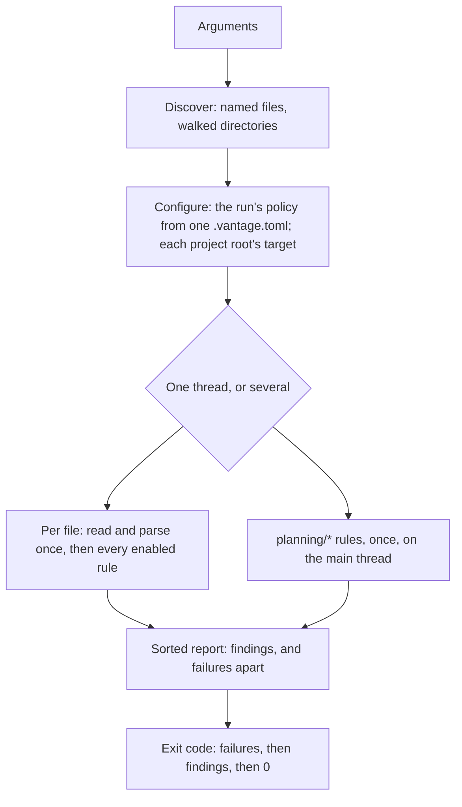

# vantage-check — the agent-facing CLI, and how a check reaches its verdict

**Status:** Verified 2026-10-01 against `2714ee5`. Inside the `covers:` perimeter,
the commit that added this document, `fced33d`, changed only comments, repointing
them here, and the one after it there, `2714ee5`, only added the `planning-perf`
recipe to the `Justfile`, which this document does not describe; so the code it
describes is `7fa8cbf`'s, unchanged. MEASURED: a binary built from the adding
commit's tree, whose code is `7fa8cbf`'s (it names itself a development build of
that commit), was run over scratch documents for this verification; the headless
Mermaid behavior that [§5.4](#54-mermaid-without-a-browser) is built around was
re-measured on 2026-10-01, against the versions [Current values](#current-values)
names; and the gate runs the same compiled checker over this repository's own
documents on every `just check-ci`. Where the checker's verdict and the rendered
page disagree, the rest of this document says so, and [§11](#11-known-gaps) lists
each case.

`vantage-check` is the agent-facing half of Vantage. Vantage knows two things
the agent writing its documents needs: how a document should be written, and
whether a given document actually renders. The CLI carries both to wherever the
agent runs. `style-guide` prints the conventions, from the same source the
viewer's in-app guide shows. `check` reports what is wrong with a document by
running the viewer's own parsers, and Mermaid's and KaTeX's, over the file on
disk. It writes only the rules nobody else can answer, chiefly whether a link
resolves in this repository. It is one self-contained executable per platform,
it never talks to a server or the network, and the text Vantage hands an agent
on every review turn tells it to run the checker before it delivers.

| Component | Lives in |
| :--- | :--- |
| Entry point, argument parsing and dispatch, help text | `packages/vantage-check/src` (`main.ts`; `cli.ts`, with `parseArgs` and `run`; `help.ts`, with `USAGE`) |
| Exit codes | `src/exit.ts` (`EXIT_OK`, `EXIT_FINDINGS`, `EXIT_USAGE`, `EXIT_ENVIRONMENT`) |
| The `check` command and its exit policy | `src/commands/check.ts` (`checkCommand`, `exitCodeFor`) |
| The `style-guide` command | `src/commands/styleGuide.ts` (`styleGuideCommand`) |
| The guide itself | `packages/vantage-md/src/styleGuide.ts` (`STYLE_GUIDE`) |
| One thread's run, and the only way a rule speaks | `src/core` (`checkFiles`, `Collector`, `Finding`, `EnvironmentFailure`) |
| Reading files, parsing them, and answering questions about link targets | `src/core` (`discover`, `loadDocument`, `Workspace`, `indexDocument`) |
| `.vantage.toml` and rule settings | `src/core` (`loadConfig`, `parseConfig`, `Settings`) |
| Every rule and its default | `src/rules/registry.ts` (`RULES`) |
| The link rules and the delegated rules | `src/rules` (`links.ts`, `frontmatter.ts`, `math.ts`, `mermaid.ts`, `render.ts`, `markdown.ts`) |
| Text and JSON reports | `src/report` (`renderFindings`, `renderFailures`, `renderJson`) |
| The single-file build | `packages/vantage-check/scripts/build.ts` |
| The in-app guide | `frontend/src/components/StyleGuideModal.tsx` (`StyleGuideModal`) |
| The pointer in the review payload | `frontend/src/stores/useReviewStore.ts` (`respondingInstructions`) |

**Reads with:** the user guide's
[`vantage-check.md`](../../userguide/guides/vantage-check.md) (the command as
its users are told it),
[`check-performance.md`](check-performance.md) (how a run is sharded
across threads, and why the worker is this program's own entry point),
[`linked-references.md`](linked-references.md) (the `ref/*` rules),
[`inline-markup.md`](inline-markup.md) (the directives the `vantage/*` rules
check), [`planning-index.md`](planning-index.md) (`index` and the `planning/*`
rules), [`checker-version-skew.md`](../design/checker-version-skew.md) (what a
release's checker does with readers on an older viewer, and the `target` key),
[`pypi-distribution.md`](pypi-distribution.md) (how the binary
reaches PyPI, the release archives and Homebrew), and
[`repo-config.md`](repo-config.md) (the server as the second reader of
`.vantage.toml`).

---

## 1. What it is for, and the rules it keeps

Vantage is a browser app and the agent is a process on a filesystem. Nothing
connects them but a human's clipboard and the files themselves. The CLI is the
one thing an agent can invoke that lives in the same world Vantage does: files
on disk. Without it, the conventions reach an agent only when a human copies
them out of a modal, and nothing tells the agent that a document it delivered
renders broken.

### 1.1 Principles

Numbered because sibling documents and code comments cite them;
[`agent-bootstrap.md`](../design/agent-bootstrap.md) continues the sequence
from P4.

- **P1. The filesystem is the only channel.** Vantage cannot call the agent and
  the agent cannot call Vantage. Anything the CLI does must work with **no
  server running**, no port, no socket. A command that needs a live Vantage is a
  command an agent cannot rely on.
- **P2. Delegate every check a real tool already performs — and classify its
  failures.** We do not reimplement Markdown, Mermaid, or KaTeX parsing; we run
  those projects' own parsers. But a delegate can fail because *our environment
  is wrong* rather than because *the document is wrong*, and reporting the first
  kind as a finding is the fastest way to destroy trust in the tool. See
  [§5.4](#54-mermaid-without-a-browser) — this is not hypothetical, it is
  measured.
- **P3. Discovery rides a channel we already control.** The agent's environment
  is not guaranteed to contain anything Vantage-related, and we are **not**
  editing anyone's `AGENTS.md` to fix that. The review-comment payload is copied
  on every review turn and is ours to write — that is where the pointer goes.

### 1.2 Invariants

These are what a change breaks by accident.

- **A finding is about the document; a failure is about the run, and the two
  never mix.** A rule speaks only through its `Collector`, which has two verbs
  of deliberately different shapes: one reports a [finding](../glossary.md#finding), the other
  records a [failure](../glossary.md#failure). A rule that throws has not produced a finding.
  Each delegate decides which of its throws are verdicts on the document
  ([§5.3](#53-delegated-rules-and-how-each-classifies-a-throw)): KaTeX's and
  Mermaid's own parse errors are findings and anything else they throw is a
  failure, and a remark-lint run that throws is a failure. The render pipeline
  is the exception, on purpose: its plugins are pure JavaScript over strings and
  behave here as they do in a browser, so once its canary has rendered, any
  throw from it is a finding.
- **A run that could not check never looks clean.** Any failure makes the run
  exit `3`, ahead of any finding, and no configuration can change that: the
  configurable exit code is a statement about findings only
  ([§3.4](#34-exit-codes)).
- **A delegate proves itself before it judges anyone.** Mermaid and the render
  pipeline each parse a [canary](../glossary.md#canary) first, once in each thread that
  checks. If the canary fails, the rule judges no document: it records a
  failure against each document it would have checked, so the run exits `3`.
- **The viewer's own code wherever the checker can call it.** The checker
  imports `vantage-md`'s TypeScript source by relative path, never a built
  copy, so parsing (the viewer's remark plugin list), frontmatter, line-anchor
  parsing and the whole render are the viewer's functions. Three answers are
  re-derived to match the viewer instead of calling it: where a link resolves,
  which heading slugs a document exposes, and which question ids are anchors
  on the page
  ([§5.2](#52-the-link-rules-ours-because-only-the-filesystem-can-answer)).
  Those are where drift can hide, and the second and third disagree with the
  page today ([§11](#11-known-gaps)). The opt-in hygiene
  family parses with a plugin list of its own
  ([§5.3](#53-delegated-rules-and-how-each-classifies-a-throw)). The workspace
  hoists one `mermaid` that the checker and the viewer share, and
  `packages/vantage-check/test/deps.test.ts` asserts they resolve the same
  file. KaTeX is not shared: the viewer renders math with a separate copy, so
  the checker's KaTeX can accept a formula the viewer's rejects
  ([§11](#11-known-gaps)).
- **The Go binary never checks documents.** Checking is TypeScript's, because
  the renderer is. A check in Go would be a second implementation that drifts
  from the viewer without anything noticing ([R3](#why-its-this-way)).
- **Nothing leaves the machine and nothing is written.** No command opens a
  socket, fetches a URL, or writes a file; a link with a scheme other than
  `file:` is skipped rather than followed. Output goes to stdout and stderr and
  nowhere else.
- **Report only what the filesystem has settled.** A link rule speaks when the
  disk proves the link broken and stays silent when anything is ambiguous: a
  target it cannot read, a section fragment on a file that is not Markdown, an
  id it cannot rule out
  ([§5.2](#52-the-link-rules-ours-because-only-the-filesystem-can-answer)).
- **The same tree gives the same bytes.** Findings are sorted by file, line,
  column and rule before they are printed, and the planning rules run once on
  the main thread, so two runs over one tree print identical output whatever the
  thread count.

## 2. Terms

Every term below is Vantage's own unless its row links elsewhere. The agent-cli
design (2026-08-24), which this reference replaced, coined *delegate*; its text
is in git, and this is now where the term is defined.

| Term | Means | Is not | Origin |
| :--- | :--- | :--- | :--- |
| **Finding** | A statement that a document is wrong: a rule id, a severity, a position and a message | a failure | the [glossary](../glossary.md#finding), which defines it |
| **Failure** | A statement that a check could not run, so the document's status is unknown | a finding, or a usage error (exit `2`) | the [glossary](../glossary.md#failure) |
| **Canary** | A document known to be valid that a delegate must accept before it may judge a real one | a test fixture | the [glossary](../glossary.md#canary) |
| **Delegate** | A parser the checker runs to answer a question it does not answer itself: the viewer's frontmatter parser (over `yaml` and `smol-toml`), KaTeX, Mermaid, remark-lint, and the viewer's whole render pipeline | a rule the checker wrote, or a library it merely calls for plumbing | the agent-cli design |
| **Rule family** | The part of a rule id before the slash, as in `link/*`; configuration can set a whole family at once ([§6](#6-configuration)) | a rule | Vantage's own |
| **Review payload** | The Markdown Vantage copies to the clipboard when a reviewer hands comments to an agent: the comments, then the instructions for answering them ([Review Inbox](../../userguide/guides/review-inbox.md)) | the inbox file the agent writes back | Vantage's own |
| **Workspace cache** | The per-run cache of answers about files other than the one being checked, one per thread | a cache between runs | [`check-performance.md`](check-performance.md#2-terms), which defines it |
| **Project root** | The nearest directory holding `.git` or `.vantage.toml` | the directory a `--config` file sits in | [`planning-index.md` §13.1](planning-index.md#131-the-project-root), which defines it |

## 3. Commands

The command surface is `check`, `style-guide`, `index`, `version` and `help`.
`vantage-check help` lists them with every option and every rule id; that
output is the enumeration of record, and nothing below restates it.

### 3.1 `check`

`check` is the default command. A first argument that is neither a command name
nor an option is a path, so `vantage-check docs/` checks `docs/`: that is the
form the review payload gives agents, and making them remember a subcommand
would be a way to lose them. Two consequences follow, both deliberate.

- **A command's name is not a path.** `vantage-check index` runs `index`; a file
  called `index` is checked as `./index`. Naming a command as the first path
  after an explicit `check` is a usage error that says so.
- **Options come after the first path, or after `check`.** An option in first
  position, other than the help and version flags, is read as an unknown
  command and refused, so `vantage-check --format json docs/` exits `2` where
  `vantage-check docs/ --format json` and
  `vantage-check check --format json docs/` both work. `--` ends the options.

A named file is checked whatever its extension, because naming it is the
intent. A named directory is walked for Markdown only, skipping every
dot-directory (which covers `.git/` and the transient `.vantage/`) and
`node_modules`. Overlapping paths check each file once. With no arguments at all
the CLI prints help and exits `0`; `check` with no paths checks the working
directory.

The options choose the report format, whether warnings fail the run, color,
which config file is read, and how many threads check. The thread count is a
fact about the machine rather than the repository, so a machine's default comes
from an environment variable and never from `.vantage.toml`; how the work is
split is
[`check-performance.md`](check-performance.md#5-parallelism)'s subject.

### 3.2 `style-guide`

`style-guide` prints Vantage's Markdown conventions, from repository-relative
links and line anchors to the directive vocabulary; its output, not this
document, is the list of what they cover. It takes no arguments.

There is one copy of that text in the tree, `STYLE_GUIDE` in `vantage-md`.
The in-app **Style Guide for Agents** modal shows it with a copy button, the
`vantage-md` npm package exports it, and the command prints it. So the
conventions an agent fetches are the ones the viewer of the same release holds
documents to, and nobody maintains a copy. A guide pasted into an agent's
instructions is exactly the copy that drifts; fetching is what makes one
unnecessary.

The command prints one line above the guide naming the release whose
conventions follow, or saying that a development build's may be newer than any
release. Everything after that line is the guide, byte for byte. The line, and
the one thing the command reads (the `target` in the project root's
`.vantage.toml`, which makes a checker too old for the repository refuse), are
[`checker-version-skew.md`](../design/checker-version-skew.md)'s.

### 3.3 `index`, `version` and `help`

`index` prints the project's planning index and, with `--request`, the requests
the planning page copies for an agent. It is documented in
[`planning-index.md` §13.2](planning-index.md#132-vantage-check-index); it
shares the CLI's dispatch, configuration loader and exit codes, and takes no
paths.

`index --filter <text>` shows only the entries a
[planning filter](planning-index.md#611-the-planning-filter) keeps, and prints a
link to the planning page filtered the same way. The text is the one the page's
Filter box and its `filter=` parameter take, read by the same parser in
`vantage-md`'s planning module, so a link an agent hands over is a filter the
human could have typed
([`planning-index.md` §13.4](planning-index.md#134-vantage-check-index---filter)).
Words and quoted phrases search the
index's facts about each entry, `path:` and `is:open` narrow, and a leading `-`
excludes. A text it does not understand exits `2` before the scan, and a
`path:` term that matches no path, with or without its `-`, exits `2` after
it, with stdout empty. A word that matches nothing exits `0`: a search that
finds nothing is an answer. The flag is a flag on purpose: a checker that
predates it exits `2` with *unknown option*, where one that ignored an
environment variable would print the whole index to an agent that believes it
filtered.

**The link is root-relative, `/.vantage/planning?filter=…`, because of
[P1](#11-principles).** Only the browser knows the address the human opens
Vantage at, and the checker may not ask a server: the port falls forward when
8000 is busy, a daemon names a repository by its own rule, and a tunnel or a
container puts the agent's `localhost` on another machine. Nothing stores the
address either, since one machine can serve a repository at several at once.
So the checker prints the link without an origin, and the line it prints says
the two ways to use it: paste it into the Filter box, which reads only its
query, or put an address in front
([`planning-index.md` §13.5](planning-index.md#135-handing-the-human-a-filtered-page)).

`version` names the release a binary was stamped with, or says
`development build` and names the commit for one built from the manifest's
placeholder version ([§8](#8-one-binary-built-and-shipped)). `help` prints the
usage, every
rule with its one-line summary, and a configuration example.

### 3.4 Exit codes

The exit code is a contract: agents and CI branch on it, so its four values are
stated here as well as in the Current values table.

| Code | Meaning | An agent should |
| :--- | :--- | :--- |
| `0` | Nothing fails the run | deliver |
| `1` | Findings fail the run | fix the document |
| `2` | Bad arguments, a path that does not exist, a `.vantage.toml` that cannot be trusted, or a `target` newer than this checker | fix the invocation, or run the checker the refusal names; never edit `.vantage.toml` to quiet it |
| `3` | A check could not run, so the result is unknown | treat it as unverified, never as clean |

What fails the run: any error, and any warning when strict mode is on (the
`--strict` flag or `strict = true`). The code a failing run exits with is `1`
unless `.vantage.toml` sets another, which is how a repository makes the checker
advisory. Failures are decided first and always exit `3`. `index` uses the same
table and never exits `1`, because it reports and does not judge.

### 3.5 Reports: text and JSON

The text report is for people and agents reading a terminal. Findings are
grouped by file, one line each: position, severity, rule id, message, and
indented beneath it any detail, such as a delegate's own words. A one-line
verdict follows unless `--quiet` drops it. Failures go to stderr in a block of
their own whose last line says that the documents were not fully checked,
because an agent that mistakes a failure for a defect goes looking for a defect
that is not there. Color is on when stdout is a terminal unless a flag says
otherwise.

The JSON report keeps failures beside findings rather than among them, so a
consumer looping over one array cannot read "could not check" as "broken". Its
shape is a compatibility promise:

```json
{
  "tool": "vantage-check",
  "version": "0.8.0",
  "filesChecked": 1,
  "summary": { "errors": 1, "warnings": 0, "failures": 0 },
  "findings": [
    {
      "rule": "link/missing-target",
      "severity": "error",
      "message": "`./missing.md` does not exist (looked for `missing.md`).",
      "file": "a.md",
      "line": 3,
      "column": 23
    }
  ],
  "failures": []
}
```

`version` is the release, or `development build`. A finding's `line` counts
from the top of the file, frontmatter included, although Markdown is parsed
with the frontmatter stripped: every position is shifted back into file
coordinates before anyone sees it. A finding may carry a `detail`; a failure
carries a rule, a message, and the file when the check got that far.

A reader that stops reading, as `head` does, ends the output quietly: the
remaining writes are dropped and the command exits with the code it would have
given a reader that read to the end. Any other write error still ends the
process.

## 4. A check run, step by step



1. **Discover.** The paths become a sorted, deduplicated list of files. A path
   that does not exist, or a directory that cannot be read, stops the run with
   exit `2` before anything is checked.
2. **Configure.** The run's policy, its `[check]` table, comes from one
   `.vantage.toml`, found by walking up from the first path, or named by
   `--config`, or skipped by `--no-config` ([§6](#6-configuration)). A run
   never mixes two repositories' severities. Unless `--config` or `--no-config`
   chose the file, the `.vantage.toml` of each project root among the files is
   also read for its `target`, and a release build too old for any of them
   refuses the whole run before the rest of the configuration is read. Unknown
   keys become warnings on stderr. A root's own target before 0.8 also changes
   what step 5 reports for that root's files
   ([`checker-version-skew.md` §4.3](../design/checker-version-skew.md#43-a-target-the-checker-meets)).
3. **Check each file.** A file is read once and parsed once, with the viewer's
   remark plugins and the viewer's frontmatter parser, and every rule reads that
   one tree. The few other parses, of a whole file or a slice of one, are
   [`check-performance.md` §4.5](check-performance.md#45-what-still-parses-a-file-again)'s
   list. The parsed document is offered to the run's
   [workspace cache](#2-terms) before any rule runs, so the next document that
   links to it is answered from memory. Then every enabled rule
   runs over it in a fixed order: links and references; frontmatter, then the
   reserved `vantage:` key inside it; directives and questions; math; Mermaid;
   Markdown hygiene; and the render pipeline last, as the backstop. A file that
   cannot be read is a failure for that file, and the run goes on.
4. **Planning rules.** They need the roadmap and the `[planning]` table, which
   each project root's own `.vantage.toml` supplies for its files (the run's
   file stands in only when it is that root's own, when `--config` or
   `--no-config` chose it, or for files with no project root), so they run once
   over the run's documents on the
   main thread while any worker threads check files
   ([`planning-index.md` §13.3](planning-index.md#133-the-planning-rules)).
5. **Report and exit.** Findings from every thread are joined. Each file's
   question findings are held to the target of its own project root, or of the
   file `--config` names: under one before 0.8, `vantage/oq-deprecated` is
   dropped and `vantage/oq-missing` asks for an `oq`, once, on the main thread,
   so the report is the same at any `--jobs`. They are then sorted and printed;
   the exit code follows [§3.4](#34-exit-codes).

The workspace cache belongs to one run (one per thread, when several check), not to
the process: it caches what the rules ask about
other files (whether a path exists and is a file or a directory, how many lines
a file has, which anchors a Markdown document exposes), so a cross-linked
document set is read and parsed once rather than once per link, and nothing
survives into another run with stale answers.

## 5. The rules

### 5.1 Families, and who owns each

Every rule has an id, a one-line summary and a default setting in one registry,
which is also what `help` prints. The families split by who can answer the
question, and the split is P2.

| Family | The question | Whose answer |
| :--- | :--- | :--- |
| `link/*` | Does this link resolve in this repository, on disk? | Ours: no general tool knows this repository's layout or Vantage's routing ([§5.2](#52-the-link-rules-ours-because-only-the-filesystem-can-answer)) |
| `ref/*` | Should this `OQ-` id, `§N` number or file name have been a link? | Ours ([`linked-references.md`](linked-references.md#the-ref-rules)) |
| `frontmatter/*`, `katex/*`, `mermaid/*`, `render/*` | Does the viewer's parser accept this? | The delegate's, in its own words ([§5.3](#53-delegated-rules-and-how-each-classifies-a-throw)) |
| `vantage/*` | Is Vantage's own markup well formed, when the renderer is silent about it by design? | Ours ([`inline-markup.md`](inline-markup.md)) |
| `planning/*` | Do the planning facts agree with each other? | The planning index's ([`planning-index.md` §13.3](planning-index.md#133-the-planning-rules)) |
| `markdown/*` | General Markdown hygiene | remark-lint's, off by default |

A rule's default is the severity it speaks at when nothing configures it: an
error when the parsed tree has settled that something is broken, a warning when
the document works but is almost certainly not what the author meant. A few
rules are off until a repository turns them on.

### 5.2 The link rules: ours, because only the filesystem can answer

The link rules walk the **parsed** tree, never the text: links, images and
reference definitions are link nodes, and inline code, fenced blocks and prose
are not. A text search reports `` `[Doc](/docs/guide.md)` `` in inline code as a
broken link, and one bogus error is enough to make an agent stop running the
tool. Raw HTML anchors (`<a href>`) are left unchecked on purpose: they are one
opaque HTML node with no parsed target, and guessing at one with a pattern is
the same mistake.

For each link the rules ask these questions in order, and a link gets at most
one finding, except that an inverted range can also run off the end of its
file:

- **A path that is not repository-relative.** A Windows drive letter or a UNC
  path, or the `file:` scheme, is `link/uri-scheme`. A leading slash is
  `link/leading-slash`, because Vantage resolves a link against the current file
  and a leading slash breaks web routing and the scoping of several
  repositories in one server; when the [project root](#2-terms) can be found and
  the file exists there, the message names the relative path that would have
  worked. Any other scheme (`https:`, `mailto:`, a custom one) and a
  protocol-relative `//host` are somebody else's to resolve and are skipped.
- **A target that does not exist.** The path is resolved against the linking
  document's directory, with any query string dropped and percent escapes
  decoded; a directory is a valid target. Missing is `link/missing-target`.
  This resolution is the checker's own, written to agree with how the viewer
  routes a relative link, not a call into the viewer's code.
- **A line anchor**, in any form the viewer's own line-anchor parser accepts
  ([Current values](#current-values)). A range past the end of the file is
  `link/line-anchor-range`. A file ending in a newline is not one line longer,
  which matches what an editor's gutter shows. An inverted range is a warning of
  its own, `link/inverted-range`, because the viewer normalizes it and
  highlights the lines anyway: the link works, so it must not fail a run, but it
  is almost certainly a typo.
- **A section anchor** in a Markdown target. Valid fragments are the heading
  slugs; ids written by hand in raw HTML; and well-formed question ids, which
  the renderer turns into anchors when the directive lands on a block that can
  carry one. The checker counts every well-formed id a question directive
  declares, wherever it lands, so in four cases it accepts a fragment the page
  lacks ([§11](#11-known-gaps)). The checker computes the slugs in its own
  pass over the parsed headings, with `github-slugger`, the slugger the
  renderer's `rehype-slug` runs, over the same heading text in document order.
  That pass slugs every heading, while `rehype-slug` skips a heading that
  already carries a question's id, so the two disagree after a question
  heading ([§11](#11-known-gaps)). A fragment matching none of them is
  `link/dead-section-anchor`, with the nearest real anchor suggested.
  Hand-written ids count even though the sanitizer may rename them, because
  counting one can only hide a dead anchor, while not counting it would invent
  a finding for a link that works. Fragments the renderer generates for
  footnotes are skipped.
- **A botched line anchor** (`#L4x`, `#L42-`). Once the target's real ids are
  ruled out, an uppercase `L` followed by a digit can only be a line anchor the
  viewer cannot parse, which is `link/line-anchor-format`. Lowercase `#l42` is
  left to the dead-anchor rule, because a heading can own that slug.

A section fragment on a file that is not Markdown, or any fragment on a
Markdown file the checker could not read, settles nothing and is never
reported. Line anchors are checked on any file the checker can read, Markdown
or not. A fragment with no path is checked against the linking document itself.

> [!WARNING]
> Do not compute slugs by hand, here or anywhere else. An em dash in a heading
> leaves two hyphens, a trailing colon leaves none, and a repeated heading gets
> a numeric suffix. The checker runs the renderer's slugger in one pass per
> document precisely because a guessed slug is the one way to get
> `link/dead-section-anchor` wrong. Running the same slugger is not enough on
> its own: the pass also has to skip the headings `rehype-slug` skips, and
> it does not ([§11](#11-known-gaps)).

### 5.3 Delegated rules, and how each classifies a throw

Each delegate owes three answers: a valid document produces nothing, an invalid
one produces one finding in the delegate's own words, and a delegate that
cannot run produces a failure rather than a finding. The third is where each
delegate needs its own classification.

- **Frontmatter.** The viewer's frontmatter parser never throws: broken
  frontmatter renders as body text, which is right for a reader and useless for
  an author. It records why instead, and `frontmatter/parse`,
  `frontmatter/unterminated` and `frontmatter/not-a-mapping` surface that record
  in the parser's own words. `frontmatter/not-at-top` is the one frontmatter
  rule the parser cannot inform, because a block below a stray blank line or
  comment is, to the parser, no frontmatter at all. The rule strips what sits
  above the block, re-parses, and reports only when that yields a real table of
  fields whose delimiters touch it, so a paragraph between two horizontal rules
  is never mistaken for lost metadata.
- **Math.** Every `$$...$$` formula, which is the only math delimiter (a single
  `$` is text, as in the viewer), goes to KaTeX with errors thrown and KaTeX's
  strict warnings off, since the viewer does not hold anyone to them. Only
  KaTeX's parse error is a finding, `katex/parse`; anything else KaTeX throws is
  a failure. The KaTeX this rule runs is the workspace's hoisted copy, which is
  not the copy the viewer renders math with ([§11](#11-known-gaps)).
- **Mermaid.** `mermaid/parse` hands every Mermaid fence to Mermaid's own
  parser. A grammar error, an unrecognized diagram type, and a parse failure
  from the newer grammars are findings, positioned on the diagram line the
  error names when it names one. Anything else is a failure. Running Mermaid without a browser
  needs care of its own ([§5.4](#54-mermaid-without-a-browser)).
- **The render pipeline.** `render/pipeline` runs each document through the
  viewer's own render function (the same plugins, in the same order), handing
  it the tree already parsed for the other rules, so nothing is parsed twice.
  It runs last and catches whatever the specific rules do not. Its delegates
  are pure JavaScript over strings and behave here as they do in a browser, so
  once its canary has rendered, a throw is a statement about the document.
- **Markdown hygiene.** `markdown/hygiene` is off by default: remark-lint's
  recommended preset holds opinions about Markdown in general, not about
  whether Vantage can render the page, and the checker's value rests on
  everything it says by default being worth acting on. Turned on, each
  remark-lint message is a finding under `markdown/` plus remark-lint's own rule
  id, and those ids are remark-lint's to change, so configuration accepts ones
  this build has never heard of. GitHub alert labels (`[!NOTE]` and its
  siblings) are not undefined references. This rule runs its own processor, not
  the viewer's plugin list, and leaves out the math plugin on purpose, because
  adding it would change which findings the family reports. The price is that
  brackets inside a `$$...$$` formula, such as `a[0]`, are reported as
  undefined references ([§11](#11-known-gaps)).

### 5.4 Mermaid without a browser

Mermaid's grammar runs headless; its sanitization step does not. Under Node,
Mermaid rejects an invalid flowchart with a real grammar error, but a **valid**
one with a quoted label, such as `a["Client (React SPA)"]`, throws
`TypeError: DOMPurify.addHook is not a function`, because with no DOM the
`dompurify` module exports its factory rather than a configured instance.
Treating that throw as a finding would report every valid flowchart in a
repository as broken.

So the rule loads Mermaid in two ordered steps, once in each thread. It first
gives the `dompurify` export no-op versions of the hook and configuration
methods Mermaid calls (and a pass-through `sanitize` if it lacks one), before
Mermaid is imported, since Mermaid calls them while it initializes. Then it
parses a canary, the style guide's own flowchart example, quoted labels and
all. If the canary fails, the stubs did not take hold (a second copy of
`dompurify`, or a Mermaid release that needs more of a browser), and the rule
checks no diagram: it records a failure against each document that has one.
Sanitized output does not matter to
a parse check, only that the calls exist. No DOM emulation ships in the binary.

> [!WARNING]
> Do not treat any throw from Mermaid's parse as a finding, and do not reach for
> `@mermaid-js/parser` as the browser-free alternative. That package covers only
> Mermaid's newer grammars and answers `Unknown diagram type: flowchart` (and
> the same for `sequence`), the two diagram types this project uses most,
> including the style guide's own example.

## 6. Configuration

Configuration is optional. With no `.vantage.toml` every rule takes its
registry default, so a bare checkout gets the whole check from one command.

The file lives at the **repository root**, never inside `.vantage/`, which holds
transient state users are told to gitignore: committed configuration inside a
gitignored directory is a trap. It is TOML because Vantage's own user
configuration already is. The server reads the same file for its own tables
([`repo-config.md`](repo-config.md#31-who-reads-what)).

A `check` run reads the file in two ways:

- **The run's policy comes from one file.** The `[check]` table is read from
  the first `.vantage.toml` found walking up from the first path the run was
  given, or from the file `--config` names, or from none with `--no-config`,
  and it governs every file the run checks.
- **What describes a project comes from that project's own file.** Each
  project root among the files checked is read for its `target`, so a run that
  spans repositories refuses for any of them that needs a newer checker, and
  so that one before 0.8 changes what is reported about that project's
  questions
  ([`checker-version-skew.md`](../design/checker-version-skew.md#43-a-target-the-checker-meets)); and for
  its `[planning]` table, which is the planning index's
  ([`planning-index.md` §14](planning-index.md#14-configuration)). `--config`
  and `--no-config` replace those reads with the one file they chose, or with
  none.

`[check]` is the run's policy: whether warnings fail the run, the exit code a
run uses when findings fail it, and each rule's severity
([Current values](#current-values) names the keys). A severity is set by exact
rule id, by family (`"link/*"`), or for everything (`"*"`), and the most
specific setting wins. A rule with options takes a table instead, holding an
optional severity and its options, which only an exact id can set. A configured
strict mode cannot be turned off from the command line: `--strict` turns it on
for one run, and no flag turns it off. The configured exit code never touches
the `3` of a run with failures. `vantage-check help` prints an example.

A run's file that cannot be trusted exits `2`, because a configuration that
cannot be trusted is never silently ignored: one that does not parse, is larger
than the server reads, or holds a value the checker cannot take for a key it
knows (a severity that is not a severity, an out-of-range exit code). Another
project root's file, read for its `[planning]` table, is not the run's: a
problem there is a `planning` failure for that root's files, and the rest of
the run goes on. Only a malformed `target` in it still exits `2`, because
targets are read before the rest of the configuration.

A key or rule id the checker does not know is a warning on stderr and is
ignored, because to an older checker every key a newer release adds looks
exactly like a typo
([`checker-version-skew.md`](../design/checker-version-skew.md)). One kind of
unknown name is an error instead: one of the file's own top-level names
(`theme`, `target`, or the server's `[starred]` table) written inside one of
the checker's tables, as a key, a rule id, or a key in a rule's table. TOML
reads a bare key written below a table header as part of that table, so such a
name is misplaced rather than new, and no reader would ever see it there. The
message says to move it above the first table. A `target` that has landed
inside `[starred]` is refused the same way: the server's tables are otherwise
not the checker's to police, but a `target` there is one no checker could
refuse a repository by.

## 7. How an agent finds the checker

A CLI nobody knows about is as undiscoverable as a modal nobody knows about.
Per P3, nothing writes the pointer into an agent's configuration and no setup
is required of the user; the pointer rides text Vantage already writes and a
human already hands to the agent.

**The review payload.** Every review payload's delivery instructions carry,
ahead of the delivery command, one line telling the agent to check the
documents before delivering: run
`uvx vantage-check` with the document paths, from the repository root, and fix
what it reports. Each path reaches the command as one shell word, quoted when
it needs to be, so a file name holding `$(…)` or a space arrives as the literal
name. The same line says
the check is a quality gate and not a delivery dependency: if the command
cannot run, or exits `2`, the agent delivers anyway and leaves `.vantage.toml`
as it is. That sentence exists because an agent told only to "fix what it
reports" would otherwise "fix" a refusal by editing the configuration. The
payload is copied on every review turn, so the pointer reaches whatever
environment the agent has, and it arrives just before the work goes back.

**The planning page.** The agent requests the planning page copies, which
`vantage-check index --request` prints too, end by telling the agent to run
`vantage-check` on every Markdown file it changed
([`planning-index.md`](planning-index.md)).

**The style guide.** The in-app modal and `style-guide` serve one text
([§3.2](#32-style-guide)); the command is how an agent fetches it, and the modal
is how a human finds it.

A document drafted before any review round, with no agent request behind it,
gets no pointer. That gap is
[`agent-bootstrap.md`](../design/agent-bootstrap.md)'s subject.

## 8. One binary, built and shipped

The checker is TypeScript because answering "will this render in Vantage"
means running Vantage's renderer. It ships as **one executable per platform with
its runtime inside**: an agent downloads one file and runs it, with no Node, no
npm and no `npx` on the machine. `bun build --compile` produces it, from
`src/main.ts`, because bun cross-compiles every platform from one host, so the
release builds every target on Linux runners, one matrix leg per target; Node's
single-executable applications can only build for the platform they run on.
The version and the commit are compiled in, so the binary needs nothing at run
time to say what it is. The version is the package manifest's, which holds a
placeholder meaning a development build until the release workflow stamps the
tag into it, so a release build names its release and every ordinary build is a
development build. The gate's `_self-check` also builds one binary stamped with
a stand-in release, beside `dist/`, to prove the stamp reaches a compiled
binary. Most of the binary's size is the runtime.

Because every module lives inside the executable, a worker thread cannot load
a separate worker module: a parallel check runs the entry point again in each
thread, which branches on whether it is the main thread
([`check-performance.md`](check-performance.md#53-the-worker-is-this-programs-own-entry-point)).

The package is a private sibling in the npm workspace, never published to npm.
`vantage-md` on npm stays a pure rendering library, with no lint-time
dependency tree. A release ships the checker three ways, all from the one tag
that ships the server: a PyPI wheel per platform carrying the binary (what
`uvx vantage-check` runs), an archive per platform on the GitHub release
carrying both binaries, and a Homebrew formula that installs both
([`pypi-distribution.md`](pypi-distribution.md), which also owns
which platforms are built and what the archives are named). The release smoke
test runs the wheel's binary over this repository's own documents, so the
checker handed to other people's agents has to pass the tree it ships from.

## 9. Failure modes

| Situation | What happens | Exit |
| :--- | :--- | :--- |
| No arguments | Help on stdout | `0` |
| An unknown option; an option other than help or version in first position, where `check` is implied; arguments to `style-guide`; a command name as the first path after `check` | One message and the usage, on stderr | `2` |
| A named path does not exist; a directory in the walk cannot be read | Each named on stderr; nothing is checked | `2` |
| The run's `.vantage.toml` does not parse, holds a bad value for a known key, holds a top-level name inside one of the checker's tables, is too large, or is a directory; `--config` names nothing | One message naming the file | `2` |
| Another project root's `.vantage.toml`, read for its `[planning]` table, has any of those problems | A `planning` failure for that root's files; the other checks go on | `3` |
| A key or rule id the checker does not know | A warning on stderr; the key is ignored | unchanged |
| The `target` of the run's file or of a checked file's project root names a newer release | A release build refuses, naming the release to run, before the rest of the configuration is read; a development build says it read the target and goes on | `2`, or unchanged |
| A file cannot be read | A `document/read` failure for it; the other files are checked | `3` |
| A delegate cannot load, or fails its canary | The rule judges no document: a failure against each document it would have checked | `3` |
| KaTeX or Mermaid throws something other than its own parse error, or remark-lint throws at all | A failure, never a finding | `3` |
| The render pipeline throws on a document after its canary rendered | A `render/pipeline` finding | `1` at its default severity |
| An exception escapes the command | `internal error` and the stack on stderr | `3` |
| The reader of stdout goes away | Later output is dropped | as computed |

## 10. Non-goals

- **Not a network protocol.** No daemon, no RPC, no port, no "is the server
  running" check, no MCP server, and no fetching of external links (P1). Every
  command works offline against a bare checkout. A hard boundary, not a
  simplification.
- **Not a bespoke rule engine.** If a real validator can answer the question,
  the checker runs it (P2). A rule the project writes itself must say why no
  existing tool can check it.
- **Not an npm CLI.** No `npx` entry point and no npm package, beside the binary
  or instead of it ([OQ-A1](#why-its-this-way), [OQ-A2](#why-its-this-way)).
- **Not editing anyone's agent configuration.** No `AGENTS.md`, `CLAUDE.md` or
  `.gitignore` writes, and no file writes at all.
- **Not a writing assistant.** No prose restructuring, no generated frontmatter
  values, no editorial judgment, and no `--fix`. A `--fix` is not built and not
  planned; were one ever added, it makes only mechanical, unambiguous rewrites
  ([OQ-5](#why-its-this-way)).
- **Not review state, comments or diffing.** Those need the server and belong
  to it. There is no `reply` command wrapping the inbox protocol
  ([OQ-4](#why-its-this-way)).
- **Not part of the Go binary.** The server keeps its own commands and its own
  job, and never checks a document ([R3](#why-its-this-way)).
- **Not raw HTML links.** An `<a href>` in raw HTML is not checked
  ([§5.2](#52-the-link-rules-ours-because-only-the-filesystem-can-answer)).
- **Not a second product.** Every command has to justify itself against P1
  ([R7](#why-its-this-way)).

## 11. Known gaps

Where the checker's verdict and the rendered page disagree. The first three
break invariants in [§1.2](#12-invariants), and fixing them is
[`as-built-defects.md`](../design/as-built-defects.md)'s work; the fourth is the
price of a deliberate choice. Each says how to reproduce it.

- **KaTeX: the checker and the viewer run different copies.** `katex/parse`
  checks with the workspace's hoisted `katex`, which the checker and
  `vantage-md` both resolve. The viewer renders math through `rehype-katex`,
  which depends on an older KaTeX range and so resolves a separate copy nested
  under it. A command only the newer KaTeX knows passes the check and renders as
  red error text: `$$a \mapsfrom b$$` checks clean and renders `\mapsfrom` as
  an error, and `\reflectbox` does the same. `deps.test.ts` does not catch it,
  because it resolves `katex` from the two packages' roots and not from
  `rehype-katex`'s. `npm ls katex` lists every copy.
- **Slugs after a question heading.** A heading that a question directive
  marks takes the question's id as its own, and `rehype-slug`
  leaves any element that already has an id alone, so that heading gets no slug
  and does not advance the slugger's count. The checker's pass slugs it anyway.
  So when a question heading `## Foo` is followed by a second `## Foo`, the
  viewer gives the second one `#foo` while the checker believes it is `#foo-1`,
  and a link to `#foo-1` passes the check and goes nowhere in the viewer. The
  error only ever runs this way: the checker misses a dead link, and never
  reports a working one.
- **Question anchors the page does not carry.** The checker counts every
  well-formed id a question directive declares, while the page carries one only
  where the directive lands on a block that can hold it. So a `#OQ-…` fragment
  passes `link/dead-section-anchor` and goes nowhere in four cases, which
  [`linked-references.md`](linked-references.md#known-gaps) lists. This error
  also runs one way only.
- **Hygiene and brackets in formulas.** With `markdown/hygiene` turned on,
  brackets inside a `$$...$$` formula, such as `a[0]`, are reported as
  `markdown/no-undefined-references`, because the family's processor leaves the
  math plugin out on purpose
  ([§5.3](#53-delegated-rules-and-how-each-classifies-a-throw)). The family is
  off by default, so only a repository that turned it on sees this.

---

## Current values

Verified at `2714ee5`. The prose above explains what each of these is for; this
table is the only place most of them are stated.

| Value | Setting | Defined in |
| :--- | :--- | :--- |
| Exit codes | `0` nothing fails; `1` findings; `2` usage or config; `3` could not check | `EXIT_OK`, `EXIT_FINDINGS`, `EXIT_USAGE`, `EXIT_ENVIRONMENT` in `src/exit.ts` |
| `[check]` keys | `strict`, default `false`; `exit-code`, default `1`, a whole number from `0` to `125`; the `[check.rules]` table | `DEFAULT_POLICY`, `parseConfig` in `src/core/config.ts` |
| Top-level names refused inside a checker table | `theme`, `target`, `starred` | `viewerKeyAdvice` in `src/core/config.ts` |
| Config file | `.vantage.toml`, at most 200 KiB (the server's own cap) | `CONFIG_FILENAME`, `MAX_CONFIG_BYTES` in `src/core/config.ts` |
| Extensions a directory walk checks | `.md`, `.markdown` | `MARKDOWN_EXTENSIONS` in `src/core/discover.ts` |
| Directories a walk skips | every name starting with `.`, and `node_modules` | `walk`, `SKIP_DIRECTORIES` in `src/core/discover.ts` |
| Thread count | `--jobs` / `-j`; else `VANTAGE_CHECK_JOBS`; else `auto`, whose policy is [`check-performance.md`](check-performance.md#52-how-many-threads)'s | `JOBS_ENV`, `jobsFromEnv` in `src/commands/check.ts` |
| Line-anchor forms | `#L42`, `#L42-L50`, `#L42-50` | `parseLineAnchor` in `packages/vantage-md/src/lineAnchor.ts` |
| Fragment prefix never reported | `user-content-` | `checkFragment` in `src/rules/links.ts` |
| KaTeX options | `throwOnError: true`, `strict: false` | `checkMath` in `src/rules/math.ts` |
| `dompurify` methods stubbed for Mermaid | `addHook`, `removeHook`, `setConfig`, `clearConfig`; `sanitize` when missing | `ensureMermaid` in `src/rules/mermaid.ts` |
| Alert labels hygiene accepts | `!NOTE`, `!TIP`, `!IMPORTANT`, `!WARNING`, `!CAUTION` | `ALERT_LABELS` in `src/rules/markdown.ts` |
| The failure for an unreadable file | rule `document/read` | `checkFiles` in `src/core/runner.ts` |
| The KaTeX each side runs | the checker: the workspace's hoisted `katex`; the viewer's math: the `katex` that `rehype-katex` resolves, a separate nested copy ([§11](#11-known-gaps)) | `checkMath` in `src/rules/math.ts`; `rehypeKatex` in `packages/vantage-md/src/pipeline.ts`; `npm ls katex` for the versions |
| The Mermaid each side runs | one hoisted `mermaid`, shared | `packages/vantage-check/test/deps.test.ts` |
| Versions the headless Mermaid behavior was last measured against | `mermaid` 12.0.0 and `@mermaid-js/parser` 2.0.0, on 2026-10-01 | the workspace's `package-lock.json`; `npm ls mermaid` |
| Build | `bun build --compile` of `src/main.ts` to `dist/vantage-check` | `packages/vantage-check/scripts/build.ts`; `just cli` |
| Compile-time identity | `__VANTAGE_CHECK_VERSION__`, `__VANTAGE_CHECK_COMMIT__`; manifest placeholder `0.1.0` means a development build | `scripts/build.ts`, `MANIFEST_PLACEHOLDER` in `src/version.ts` |

---

## Why it's this way

Rulings a maintainer reading only the text above might undo on purpose, each
with the id sibling documents cite. `OQ-` rows ruled the design's open
questions; `R` rows were the design's risks, kept because other documents cite
them or because they still rule what may be added. Ids not listed were absorbed
into the text above or are in git. The numbered `OQ-` ids here carry no
prefix, and [`linked-references.md`](linked-references.md#why-its-this-way)
gives the same id to a different ruling of its own, so cite these with this
document's path.

| ID | Ruling | Date |
| :--- | :--- | :--- |
| OQ-4 | No `reply` command wrapping the inbox protocol. The heredoc in the payload needs nothing but a shell, in the one flow that has no dependencies; a command would trade that for a hard dependency on the binary. Revisit only if the write race it would remove ever actually bites someone ([§10](#10-non-goals)) | 2026-08-24 |
| OQ-5 | A `--fix`, if one is ever built, rewrites only what is mechanical and unambiguous, such as a leading slash. It never touches prose, never inserts frontmatter, and never rewrites a diagram: a fix that mangles a document is unrecoverable trust damage, and an agent can fix anything else once told what is wrong ([§10](#10-non-goals)) | 2026-08-24 |
| OQ-6 | Errors fail the run; warnings fail it only in strict mode; the code a failing run exits with is configurable, and a run that could not check exits `3` whatever is configured ([§3.4](#34-exit-codes), [§6](#6-configuration)) | 2026-08-24 |
| OQ-A1 | One compiled binary per platform, runtime inside, reached through `uvx` and the release archives. No `npx` entry point, beside the binary or instead of it: it is useless without Node, slower to start, and a second dependency story and failure mode for one tool ([§8](#8-one-binary-built-and-shipped)) | 2026-08-24 |
| OQ-A2 | `vantage-md` on npm stays a pure library, and the CLI is an unpublished workspace sibling that imports its source ([§8](#8-one-binary-built-and-shipped)) | 2026-08-24 |
| OQ-A3 | `.vantage.toml` at the repository root, never in `.vantage/`, which is transient and gitignored ([§6](#6-configuration)) | 2026-08-24 |
| R2 | False positives cost the most: one bogus error and an agent stops running the checker. So the checker's own rules report only what the filesystem has settled and stay quiet where anything is ambiguous, and a delegate that cannot run is a failure, never a finding ([§1.2](#12-invariants)) | 2026-08-24 |
| R3 | The Go binary never grows document checks. If it ever needs one, it runs `vantage-check` or does nothing; a Go implementation would drift from the renderer invisibly ([§1.2](#12-invariants)) | 2026-08-24 |
| R5 | The binary's size was at risk if checking Mermaid needed a DOM in the binary. It does not: stubbing `dompurify`'s methods and parsing a canary is enough for every diagram in this repository's own documents, which the gate checks, so no DOM emulation ships, and most of the binary is the runtime ([§5.4](#54-mermaid-without-a-browser), [§8](#8-one-binary-built-and-shipped)) | 2026-08-31 |
| R6 | Version skew between an agent's checker and a reader's viewer is owned by [`checker-version-skew.md`](../design/checker-version-skew.md): checks describe the notation, and a release never gives existing notation a new meaning | 2026-09-30 |
| R7 | "The CLI could also…" is how a checker becomes a second product. Every proposed command justifies itself against P1, and the non-goals are the defense ([§10](#10-non-goals)) | 2026-08-24 |
| — | The command is `check`, not `lint`, because most of what it does is run other projects' validators and collate their answers ([§5.1](#51-families-and-who-owns-each)) | 2026-08-24 |
| — | A tool, not an agent skill or prompt file. A prompt can state the conventions, and `style-guide` serves them, but only a program can check a `#L400` anchor against a 200-line file ([§3.2](#32-style-guide)) | 2026-08-24 |
| — | Mermaid is checked through the full `mermaid` package with stubbed `dompurify` methods and a canary, not through `@mermaid-js/parser`, which knows no flowchart, and not through a DOM emulation shipped in the binary ([§5.4](#54-mermaid-without-a-browser)) | 2026-08-31 |
| — | The binary is built with `bun build --compile`, not Node's single-executable applications, because bun cross-compiles every platform from one host ([§8](#8-one-binary-built-and-shipped)) | 2026-08-24 |
