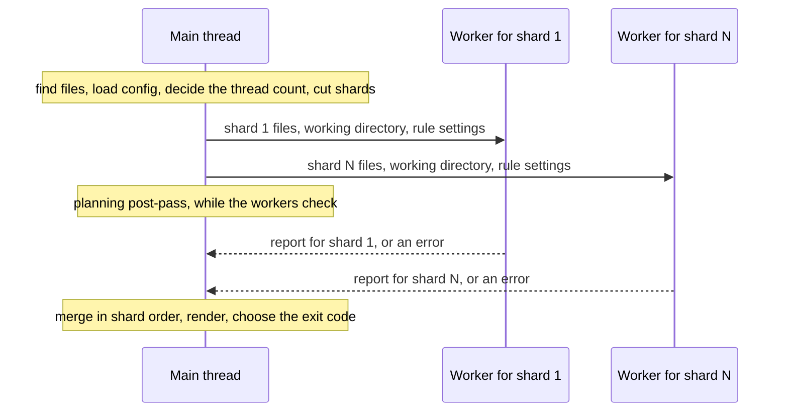

# A vantage-check run — the rules share each file's parse, and worker threads share the files

**Status:** Verified 2026-10-01 against `7fa8cbf`. The commit that added this
document changed only comments inside the `covers:` perimeter, repointing them
here, so the code it describes is `7fa8cbf`'s, unchanged. MEASURED: the thread
ceiling and the gain from parsing each file once were measured against the build
the day it landed, 2026-09-20, on a 32-core machine with the compiled binary, and
the sweep the ceiling rests on is kept beside the constant it set
(`MAX_AUTO_JOBS`, [Current values](#current-values)). On 2026-10-01, at
`7fa8cbf`, the shape held over this repository's `docs/` and `userguide/` on a
32-core machine: three threads roughly halved a one-thread run, six gained
nothing on three, and sixteen were slower than one. UNMEASURED: no machine with
a different core count.

`vantage-check check` runs every per-file rule over every file it is given, and
the planning rules once, apart from them. Two things decide how long that takes:
how many times each file is parsed, and how many threads share the files. Each
file is read and parsed once for its own rules: every per-file rule but `markdown/hygiene`, the
end-to-end render rule included, reads that one tree, and the cache that answers
questions about link targets reuses it for every file the thread has already
checked. The few other parses are named in
[§4.5](#45-what-still-parses-a-file-again). With `auto`, a run large enough to
pay for a second thread is cut into contiguous slices of the sorted file list,
weighted by bytes, and each slice is checked in a worker thread that runs the
program's own entry point again. When every rule returns, the merged report is
byte for byte the report a one-thread run prints, and a thread that never
answers becomes a failure naming its files, never a shorter clean report.

| Component | Lives in |
| :--- | :--- |
| Thread count, sharding, merging, and the worker side | `packages/vantage-check/src/core/parallel.ts` (`resolveJobs`, `shardFiles`, `checkFilesInParallel`, `RunShard`, `workerShard`, `serveShards`) |
| The worker's entry point | `packages/vantage-check/src/main.ts` (`setWorkerEntry`) |
| `--jobs`, `VANTAGE_CHECK_JOBS`, and where the planning rules run | `packages/vantage-check/src/commands/check.ts` (`checkCommand`, `parseJobs`, `JOBS_ENV`) |
| Every per-file rule over a file list, in one thread | `packages/vantage-check/src/core/runner.ts` (`checkFiles`) |
| The one parse | `packages/vantage-check/src/core/document.ts` (`loadDocument`, `parseMarkdown`) |
| The workspace cache | `packages/vantage-check/src/core/workspace.ts` (`Workspace`, `Workspace.offer`) |
| The heading pass | `packages/vantage-check/src/core/slugs.ts` (`indexDocument`, `DocumentIndex`) |
| The render rule | `packages/vantage-check/src/rules/render.ts` (`checkPipeline`) |
| Rendering a tree that is already parsed | `packages/vantage-md/src/renderMarkdown.ts` (`RenderOptions.tree`) |

**Reads with:** [`agent-cli.md`](agent-cli.md#11-principles) (the
checker as a whole: its P1, that files on disk are its only channel, and its P2,
the split between a finding and a failure that this document's P2 applies to
threads), and [`planning-index.md` §13.3](planning-index.md#133-the-planning-rules)
(the planning rules, which run once in the main thread beside the shards). For
readers rather than maintainers: [Large corpora](../../userguide/guides/vantage-check.md#large-corpora)
in the `vantage-check` guide.

---

## 1. What it is for, and the rules it keeps

A check run is worth only as much as its report can be trusted and diffed. Speed
is worth having on those terms and no others, so the rules below come before any
mechanism.

### 1.1 Principles

Numbered because code comments and sibling documents cite them.

**P1. A faster run that answers differently is not faster, it is broken.** The
checker's value rests on its report being trustworthy and diffable — the user
guide promises that "two runs over the same tree print the same bytes". A
parallel run has to produce the sequential run's bytes, not merely an equivalent
set of findings.

**P2. A thread that dies has not checked its files.** The split between a
[finding](../glossary.md#finding) and a [failure](../glossary.md#failure) is the
design the whole tool rests on: a validator that could not run reports
"unknown" (exit `3`), never "clean". A lost shard is exactly that case, and it
gets exactly that treatment.

**P3. Optimize by removing work, not by adding hardware.** Four parses per file
across six threads is still four parses per file. Removing a duplicate parse is
worth more here than adding a thread.

### 1.2 Invariants

What a maintainer breaks by accident. Each is held by a test, by the gate, or by
the shape of the code.

- **A parallel run prints the one-thread run's bytes** (P1), whenever every rule
  returns. It holds by construction
  ([§5.5](#55-determinism-is-structural-not-sorted)), and the gate asserts it with
  the compiled binary, since the unit tests cannot start a thread. A rule that
  throws is the one exception, and the two paths answer it differently: a
  one-thread run prints no report, and a parallel run loses only the shard the
  throw happened in ([§6](#6-failure-modes)). Both exit `3`.
- **A file is counted as checked only when its rules ran** (P2). The count a
  report gives is the sum of what each shard really checked, and a shard that
  never answered adds a failure and nothing to the count
  ([§5.6](#56-a-shard-that-never-answers)).
- **Every per-file rule but `markdown/hygiene` reads the one tree
  `loadDocument` built for the file being checked,** and the render rule renders
  that same tree. Every other parse of a file, or of a slice of one, is named in
  [§4.5](#45-what-still-parses-a-file-again).
- **The render rule runs last.** It hands the shared tree to a pipeline that
  could in principle rewrite it, and running it last means nothing reads the
  tree afterward ([§4.2](#42-the-render-rule-renders-the-tree-the-rules-already-read)).
- **An answer from the workspace cache equals the answer from disk.** A document
  the run has parsed is offered to the cache, and what the cache then says about
  it is exactly what reading it from disk would say, a non-Markdown file's
  missing anchors included ([§4.4](#44-the-workspace-cache-takes-documents-the-run-has-parsed)).
  `packages/vantage-check/test/workspace.test.ts` holds the two equal.
- **The rules never learn which thread they run in.** `checkFiles` is the whole
  per-file checker, and a shard is `checkFiles` over its slice.
- **Only plain data crosses into a thread**: the slice, the working directory,
  and the rule settings as entries, rebuilt into settings on the far side. The
  configuration object, the `[planning]` table and the roadmaps never cross,
  which is why the planning rules run in the main thread.
- **The worker is the program's own entry point,** and the entry point
  registers its own URL for the threads to load
  ([§5.3](#53-the-worker-is-this-programs-own-entry-point)).

---

## 2. Terms

Every term below is Vantage's own unless it links elsewhere. Those marked as from
the check-performance design were coined by that document (2026-09-20), which
this reference replaced; its text is in git.

| Term | Means | Is not | Origin |
| :--- | :--- | :--- | :--- |
| **Finding** | A statement that a document is wrong, such as a link to nothing or a diagram its parser rejects | a failure | the [glossary](../glossary.md#finding), which defines it |
| **Failure** | A statement that the run could not judge something: a file it could not read, a validator that could not start, a thread that never answered; any failure makes the run exit `3`, "unknown" | a finding about the document | the [glossary](../glossary.md#failure) |
| **Worker thread** | A JavaScript thread with its own VM and module graph, started through the [`worker_threads`](https://nodejs.org/api/worker_threads.html) API, which Bun implements | a child process: a worker shares its process, and only its VM and its modules are its own | Node.js |
| **Shard** | One contiguous slice of the run's sorted file list, checked by one worker thread ([§5.4](#54-sharding-contiguous-and-weighted-by-bytes)) | a batch handed out on demand: shards are decided once, before any thread starts | the field's word for one partition of divided work; this sense, the check-performance design |
| **Sequential run** | A run in one thread: `checkFiles` runs in the main thread and no worker starts | a parallel run that happens to have one shard | the check-performance design |
| **Workspace cache** | The per-run cache of answers about files other than the one being checked: whether a path exists, how many lines a file has, and which anchors and numbered headings a Markdown file exposes. Each thread has its own | a cache between runs: nothing is written to disk, and nothing outlives the run | this document, after the `Workspace` class the checker has had since 2026-08-31 (`0174b50`) |
| **Document index** | What one pass over a document's headings yields: its heading slugs in order, every fragment a link can target, and the map from section numbers to slugs ([§4.3](#43-one-heading-pass)) | the parsed tree, which the cache does not keep | this document, after the `DocumentIndex` type the check-performance build added (`f2012d2`) |
| **Post-pass** | The planning rules' one run in `check`'s main thread, separate from the per-file rules | a per-file rule | [`planning-index.md` §2](planning-index.md#2-terms) |

**mdast** is the Markdown syntax tree remark produces ([mdast](https://github.com/syntax-tree/mdast));
"the tree" below always means a document's mdast.

---

## 3. Where a run spends its time

The shape of the cost, which is what every decision below answers to:

- **Parsing dominates.** `remark-parse` with GitHub Flavored Markdown is the
  most expensive single step a file goes through. A render of an already-parsed
  tree, the whole rehype chain from raw HTML through the sanitizer, slugs,
  highlighting and KaTeX to a string, costs markedly less than the parse. So a
  render rule that parsed the text for itself would spend most of its time on a
  second parse.
- **Cost tracks a document's length closely,** because the two dominant steps
  are a parse and a render of the same text. The documents in one set can differ
  in length by well over an order of magnitude, so file count is a poor measure
  of work.
- **Mermaid's first use is a module load,** a fraction of a second, paid once
  per thread; the diagrams themselves are cheap.
- **A worker thread is cheap to start and expensive to have.** Each initializes
  the bundle's several thousand modules in a fresh VM, a few hundred milliseconds
  of CPU even for a thread that then checks one short document, and the total
  grows faster than the thread count: past a handful of threads, that repeated
  work competes with itself.

---

## 4. The parse the rules share

### 4.1 Reading a file

`loadDocument` reads a file, splits off its frontmatter with `vantage-md`'s own
frontmatter parser, and parses the body with the viewer's own remark half
(`buildRemarkPlugins`, consumed from `vantage-md`'s source). The resulting tree
is what every per-file rule but `markdown/hygiene` reads.

Before any rule runs, the document is offered to the workspace cache
([§4.4](#44-the-workspace-cache-takes-documents-the-run-has-parsed)), so a link
from the document to itself, or from any document the same thread checks later,
is answered from the parse just made. A file that cannot be read, or whose
parse throws, is a `document/read` failure; the run moves on to the next file.

### 4.2 The render rule renders the tree the rules already read

`render/pipeline` is the end-to-end backstop: it runs the whole document through
the viewer's renderer, `renderMarkdown`, and reports a throw. It hands over the
tree `loadDocument` built through `RenderOptions.tree`. Rendering is parse, then
run, then stringify; with a tree in hand only the first is skipped, so the
document goes through the same processor with the same plugins in the same
order. The document's text is still passed, for its frontmatter and the line
offset the source-line plugin needs.

The rule runs last in `checkFiles`, so nothing reads the tree after the pipeline
has, and even a plugin that rewrote the tree in place could not change another
rule's verdict.

Before judging any document, the rule renders a
[canary](../glossary.md#canary) once per renderer, which in practice means once
per thread. If the canary throws, the
environment is broken, and every document gets a `render/pipeline` failure
rather than a finding.

> [!WARNING]
> **The tree must come from `vantage-md`'s own remark half** (`buildRemarkPlugins`,
> exported for exactly this). A tree parsed any other way renders through a chain
> the viewer does not use, the one thing the shared pipeline exists to prevent,
> and nothing can detect it: a tree is a tree.

> [!WARNING]
> **Do not move the render rule earlier, or let another rule read the tree after
> it.** Handing over the shared tree is safe only because nothing reads it once
> the pipeline has run.

### 4.3 One heading pass

`indexDocument` walks a document's headings once and returns its **document
index**: the heading slugs, the set of anchors a link can target (heading slugs,
ids written in raw HTML, and question ids), and the map from section numbers to
slugs. Slugs come from the slugger the renderer uses, `github-slugger`, over the
same heading text in the same order.

One pass rather than one per kind of answer matters for correctness as well as
cost. The slugger is stateful: it appends `-1` to a repeated heading, so two
separate passes would agree only by replaying each other exactly. With one pass,
a section number resolved against one slugging and a link checked against
another cannot disagree, by construction. The workspace cache keeps one index per file.

### 4.4 The workspace cache takes documents the run has parsed

`Workspace.offer` takes a document the run has just loaded and records, eagerly,
that it exists, its line count, and, for a Markdown file, its document index. A
later question about that file costs nothing. The tree itself is not kept: the
index is small, and a run over a large corpus should not hold every tree it has
seen.

A Markdown target this thread has not offered yet is read and parsed from disk
the first time a rule needs its anchors or numbered headings, and the result is
kept for the rest of the thread. That covers three kinds of target: one later in
this thread's own list, one in another shard, and one outside the run. A target
later in the thread's own list is parsed once more when its own turn comes, and
`offer` then replaces the index read from disk with one from the new parse,
which is equal to it ([§4.5](#45-what-still-parses-a-file-again)).

> [!IMPORTANT]
> **`offer` gives a non-Markdown file no anchors**, exactly as reading it from
> disk would. A file named on the command line is checked whatever its
> extension, so `notes.txt` reaches `offer` with a tree anyway, and crediting it
> with headings would make a link to `notes.txt#missing` a finding a sequential
> reader of the disk never produces. Faster and answering differently is P1's
> failure, and this guard is what stands between them.

### 4.5 What still parses a file again

Four cases parse a file, or a slice of one, beyond the parse its own rules read.
The first is the cost of checking files one at a time in list order; the other
three are deliberate.

- **A link target the thread reaches later is parsed before its turn.** When a
  document links with a fragment, or makes a section reference (`§N`), to a
  Markdown file this thread has not checked yet, the workspace cache parses that
  file from disk to answer ([§4.4](#44-the-workspace-cache-takes-documents-the-run-has-parsed)),
  and `loadDocument` parses it again when its turn comes. In a parallel run,
  each other thread whose files link into it that way parses it once more for
  its own cache. Removing this would take a pass that parses every file before
  any rule runs, and the checker has no such pass.
- **`vantage/block-split` parses slices of the document.** Its question is what
  a document looks like without a directive, and only a parse can answer that,
  so for each directive run it parses the lines of the block around it twice,
  with the run and without it, and compares the two shapes. The block is the two
  neighboring blocks for a directive at the top level, and the whole enclosing
  top-level block for one inside a list item, a block quote or a footnote; the
  parse with the run is made once per block. It is on by default. Its cost grows
  as the square of the directives in one block, which a long Open Questions list
  reaches, and turning the rule off buys it back
  ([the `vantage-check` guide](../../userguide/guides/vantage-check.md#what-it-checks);
  [`inline-markup.md`](inline-markup.md#validation) owns the rule).
- **`markdown/hygiene`, off by default, lints with a processor of its own.** It
  leaves out `remark-math` on purpose, because sharing the viewer's plugin list
  would change which hygiene findings the family reports. Turning the family on
  costs one more parse per file.
- **The planning rules' post-pass reads planning documents again.** It runs once,
  in the main thread, rather than per file, because a shard is handed neither
  the `[planning]` table nor the roadmaps, and running it outside the shards
  keeps the sequential and parallel reports identical. It reads and scans each
  checked planning document a planning rule could report on, and parses once
  more each one with a question for `planning/question-length` to measure.
  [`planning-index.md` §13.3](planning-index.md#133-the-planning-rules) owns the
  rules themselves.

---

## 5. Parallelism

Every file is an independent unit of work: no rule writes anything another
file's rules read. The only shared state is the workspace cache, and that is a
cache rather than a channel. Each thread builds its own and answers the same
questions, without the benefit of what the others already looked up. That is the
entire cost of parallelism here.

### 5.1 How a run is arranged

The main thread finds the files, loads the configuration and decides the thread
count ([§5.2](#52-how-many-threads)).

- **One thread:** the main thread runs the planning post-pass, then `checkFiles`
  over the whole list. No worker starts.
- **More than one:** the main thread cuts the list into shards
  ([§5.4](#54-sharding-contiguous-and-weighted-by-bytes)), starts one worker per
  shard, all at once, and posts each its shard. It runs the planning post-pass
  while they work, then waits for every shard and merges the reports in shard
  order ([§5.5](#55-determinism-is-structural-not-sorted)).

A worker serves exactly one shard and is terminated once it answers. There is no
pool.



### 5.2 How many threads

`auto`, the default, spends one thread per fixed batch of files, never more than
the machine's available parallelism, and never more than a small ceiling. A run
too small to fill two batches is therefore sequential: a thread is only worth its
startup when there is enough work to pay for it. An explicit count is honored up
to one thread per file, since an empty shard is a thread's startup cost for
nothing.

The count is a ceiling on shards rather than an exact number. A shard is cut only
where it lands closest to its share of the bytes, so a list whose bytes cannot be
divided gets fewer shards: a list of empty files is one shard however many
threads were asked for.

**Why a low ceiling.** Past the ceiling, this workload gets *slower*, and the
cause shows in CPU rather than wall time: total CPU for the same work grows much
faster than the thread count. That is the per-thread module initialization of
[§3](#3-where-a-run-spends-its-time) repeated and then competing with itself,
not contention on a lock. At every measured corpus size large enough for `auto`
to reach the ceiling, the ceiling was the fastest thread count, so `auto` does
not take the core count. Smaller runs get fewer threads from `auto` anyway. The
sweep is in `MAX_AUTO_JOBS`'s doc comment. How far a runtime scales is a fact
about the machine, which is what `--jobs` is for
([§5.7](#57-the-option-surface)).

> [!WARNING]
> **Do not raise the ceiling to the core count.** On the many-core machine the
> ceiling was measured on, one thread per core was several times slower than the
> ceiling; the sweep in `MAX_AUTO_JOBS`'s doc comment has the figures.

> [!WARNING]
> **Do not move shards to child processes for the speed alone.** Separate
> processes, each a run with `--jobs 1`, measured faster than threads on corpora
> above a few hundred files, because each is a fresh runtime with nothing to
> contend over. But a process shard needs a request and a response over stdio,
> and it needs to rebuild the command that re-runs this program, which differs
> between the compiled binary and a run from source and can only be told apart
> by sniffing `process.argv`. That is a second mechanism and a new class of
> failure (orphans, signals, a half-written response). It takes a design of its
> own.

### 5.3 The worker is this program's own entry point

A worker thread runs `packages/vantage-check/src/main.ts` again, with
`isMainThread` false, rather than a worker module of its own. It is the only
arrangement that works in the shipped artifact. `bun build --compile` puts every
module *inside* the executable, so a separate worker module is not a path
anything can load:

```text
error: Cannot find module '/$bunfs/root/checkWorker.js'
```

Adding it as a second build entry point does not help either: it lands in the
bundle under a name the parent cannot address. The entry point, by contrast, is
addressable from inside the bundle *and* is a real file when the program is run
from source, so both take the same route. `main.ts` branches on `isMainThread`:
the main thread runs the command, and a worker serves one shard.

`main.ts` registers its own URL (`setWorkerEntry`) rather than letting
`parallel.ts` derive one. In the compiled binary, `import.meta.url` is the
executable from anywhere in the bundle, so deriving it would work there, and it
would silently start a thread listening to nothing when run from source, where
it is the deriving module's own path. A parallel run with no entry registered
fails each shard rather than hanging.

> [!WARNING]
> **Do not give the worker a module of its own.** It passes every unit test,
> since none of them starts a thread, and dies in the compiled binary, which the
> gate runs with threads twice: in its agreement check
> ([§5.5](#55-determinism-is-structural-not-sorted)) always, and in its document
> check, which the pre-commit hook also runs whenever a document is staged, on
> any machine with more than one core.

### 5.4 Sharding: contiguous, and weighted by bytes

Shards are **contiguous slices of the sorted file list**, sized by total bytes
rather than file count:

- *Contiguous*, because documents that link to each other sit near each other
  in a sorted list. Dealing files round-robin would make every thread re-read
  every other thread's targets.
- *By bytes*, because cost tracks length ([§3](#3-where-a-run-spends-its-time))
  and the spread is wide. Equal-count shards would leave one thread doing several
  times the work of another, and the run takes as long as its slowest thread. A
  file whose size cannot be read weighs nothing; it is about to be reported as
  `document/read` by whichever shard gets it.

The cut goes where a shard lands **closest** to its share of the bytes still
unassigned, not at the first file that reaches it, and never so early that a
later shard would be left without a file. A "cut when full" rule fails in a
specific way: one large document at the end of a run of small ones means no
prefix ever reaches a share, the whole list stays in one shard, and every other
thread idles.

### 5.5 Determinism is structural, not sorted

Each shard checks its files in list order, and shards are merged in shard order,
so the merged per-file findings and failures are in exactly the sequential run's
order. Findings are sorted by file, line, column and rule when the report is
written, with a stable sort that keeps that order among ties, but failures never
are sorted, so their order is the structural one. The planning post-pass's
findings and failures join after the per-file ones on both paths. Nothing
depends on which thread finished first (P1).

The gate asserts it where it can be asserted. `just check` runs the compiled
binary over the documents the gate covers twice, at one thread and at several,
and diffs the JSON. It turns the `markdown/hygiene` family up to warnings for
that run, because the tree is otherwise clean, and two empty finding lists agree
however badly a merge is ordered. The unit tests cannot start a thread: a worker
loads the entry point, which vitest cannot load as a worker because in the
source tree it is TypeScript. So `packages/vantage-check/test/parallel.test.ts`
drives the same `RunShard` seam in-process, with a runner that checks a shard in
the calling thread, and the gate drives the threads.

### 5.6 A shard that never answers

A worker that throws where nothing catches it, runs out of memory, exits without
answering, or whose `checkFiles` throws becomes one `run/shard` **failure**
naming the files it was holding. The other shards' findings are still reported,
the count of checked files leaves that shard's files out, and the run exits `3`,
saying which documents were not checked (P2).

`checkFiles` catches only a file's read and parse, not a rule. So a rule that
throws on one file costs that file's whole shard in a parallel run, the files
it had already checked included, and in a one-thread run it costs the whole
report: the throw reaches the entry point, which prints an internal error and
exits `3` with nothing on standard output.

> [!WARNING]
> **The `exit` handler matters as much as the `error` one.** A thread that exits
> without posting a response would otherwise leave the run waiting forever, and a
> hang is a worse answer than a failure.

### 5.7 The option surface

`--jobs` (`-j`) takes `auto` or a whole number of threads of 1 or more; `--jobs 1`
is a sequential run. `VANTAGE_CHECK_JOBS` sets a machine's default, and `--jobs`
beats it; unset or empty, it is `auto`. `vantage-check help` and the
[`vantage-check` guide](../../userguide/guides/vantage-check.md#large-corpora)
give the full usage.

**There is deliberately no `jobs` key in `.vantage.toml`.** How many threads to
use is a fact about the *machine*, not about the repository: a committed
`jobs = 16` is wrong for everyone who checks the tree out on a laptop. The
environment variable is the durable home for a machine-level default, which is
what a CI runner wants.

A value that is not a thread count, in the flag, or in the variable when no
`--jobs` is given, is a usage error (exit `2`) before anything is checked, never
a silent fallback to `auto`. A typo in the variable would otherwise make an
explicit choice disappear with nothing said. The variable is not read at all
when the flag is given, so a bad value there goes unremarked until a run without
the flag. A thread count is whatever JavaScript's `Number` reads as a whole
number of 1 or more, so `4.0`, ` 4 ` and `0x4` all mean four threads.

---

## 6. Failure modes

| Failure | Behavior |
| :--- | :--- |
| A file cannot be read, or its parse throws | A `document/read` failure for that file; the rest are checked; exit `3` |
| A worker throws, runs out of memory, or exits without answering | A `run/shard` failure naming its files; the other shards are reported; exit `3` ([§5.6](#56-a-shard-that-never-answers)) |
| A per-file rule throws, in a worker | The worker posts the error, and it becomes the same `run/shard` failure for the whole shard; the other shards are reported; exit `3` |
| A per-file rule throws, in a one-thread run | No report at all: the entry point prints `vantage-check: internal error` and the stack to standard error; exit `3` |
| A parallel run with no worker entry registered (a caller that did not start from `main.ts`) | Each shard fails as `run/shard`, naming its files |
| The render pipeline cannot run in this environment | The canary fails once per thread, and each document gets a `render/pipeline` failure, never a finding; exit `3` |
| `--jobs`, or `VANTAGE_CHECK_JOBS` with no `--jobs`, is not `auto` or a whole number of 1 or more | Exit `2`, before any file is checked |
| The planning post-pass throws | A `planning` failure; exit `3` ([`planning-index.md` §13.3](planning-index.md#133-the-planning-rules)) |

---

## 7. Non-goals

- **No in-process git library, no server, no network.** The checker answers
  every question from files on disk.
- **No faster Markdown parser.** Parsing the way the viewer parses *is* the
  checker's claim. The speed comes from parsing once, not from parsing
  differently.
- **No thread pool with work stealing.** One shard per thread, decided up front.
  Byte weighting captures most of the variance, and handing files out on demand
  would trade the cache locality of
  [§5.4](#54-sharding-contiguous-and-weighted-by-bytes) for balance this workload
  does not need at the few threads `auto` uses.
- **No cache between runs.** Nothing is written to disk. A cache that outlived
  the run, keyed by content under `.vantage/`, would be a separate design with
  a separate invalidation problem.
- **No `jobs` key in `.vantage.toml`** ([§5.7](#57-the-option-surface)).
- **No child-process shards** without a design of their own
  ([§5.2](#52-how-many-threads)).

---

## Current values

Verified at `7fa8cbf`. The prose above explains what each of these is for; this
table is the only place most of the numbers are stated.

| Value | Setting | Defined in |
| :--- | :--- | :--- |
| Files per thread that `auto` asks for | 12 | `MIN_FILES_PER_JOB` in `core/parallel.ts` |
| `auto`'s ceiling | 6 threads | `MAX_AUTO_JOBS`, same file; its doc comment holds the measured sweep |
| `auto` | `min(availableParallelism(), 6, ⌊files ÷ 12⌋)`, at least 1 | `resolveJobs`, same file |
| An explicit count | capped at the number of files; a run of no files is one thread | `resolveJobs` |
| The flag | `-j`, `--jobs <n>\|auto` | `parseCheck` in `src/cli.ts`, `parseJobs` in `commands/check.ts` |
| The machine default | `VANTAGE_CHECK_JOBS`; unset or empty is `auto` | `JOBS_ENV` in `commands/check.ts` |
| Exit code for a bad count | 2 | `EXIT_USAGE` in `src/exit.ts` |
| Exit code for any failure | 3 | `EXIT_ENVIRONMENT` in `src/exit.ts`, `exitCodeFor` in `commands/check.ts` |
| A lost shard's failure | `run/shard` | `checkFilesInParallel` |
| An unreadable file's failure | `document/read` | `checkFiles` in `core/runner.ts` |
| Extensions given anchors | `.md`, `.markdown`, any case | `isMarkdown` in `core/workspace.ts` |
| The gate's agreement check | `--jobs 1` against `--jobs 4`, `--format json`, over `doc_paths` and `CHANGELOG.md`, with `markdown/hygiene` at `warning` and `exit-code = 0` | `_self-check` in the `Justfile` |
| The gate's document check | no `--jobs`, so `auto`, over `doc_paths`; run by `_self-check`, and by the pre-commit hook when a document is staged | `_check-docs` in the `Justfile`; `scripts/check-fast.sh` |

---

## Why it's this way

Rulings a maintainer reading only the text above might undo on purpose, each with
the id the check-performance design gave it. Ids not listed were absorbed into the
text above, or are in git.

| ID | Ruling | Date |
| :--- | :--- | :--- |
| OQ-CP2 | The render rule renders the tree `loadDocument` already parsed rather than parsing the text again; safe because it runs last ([§4.2](#42-the-render-rule-renders-the-tree-the-rules-already-read)) | 2026-09-20 |
| OQ-CP3 | Worker threads, not child processes, although processes measured faster above a few hundred files: one mechanism, and no rebuilding of the command line ([§5.2](#52-how-many-threads)) | 2026-09-20 |
| OQ-CP4 | `auto` stops at six threads, not the core count, because past six this workload gets slower ([§5.2](#52-how-many-threads)) | 2026-09-20 |
| OQ-CP5 | The worker is the program's own entry point, registered by `main.ts`, because a compiled bundle has no second loadable module ([§5.3](#53-the-worker-is-this-programs-own-entry-point)) | 2026-09-20 |
| OQ-CP6 | Shards are contiguous and weighted by bytes, cut where a shard lands closest to its share rather than when it is full ([§5.4](#54-sharding-contiguous-and-weighted-by-bytes)) | 2026-09-20 |
| OQ-CP7 | `--jobs` and `VANTAGE_CHECK_JOBS`, and no `.vantage.toml` key: the thread count is a property of the machine, not the repository ([§5.7](#57-the-option-surface)) | 2026-09-20 |
| OQ-CP8 | A lost shard is a `run/shard` failure naming its files (exit `3`), never a quietly shorter clean run ([§5.6](#56-a-shard-that-never-answers)) | 2026-09-20 |
