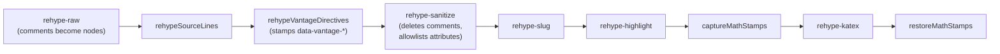

# Vantage directives — Vantage-only markup inside ordinary Markdown

**Status:** CURRENT as of 2026-09-01, verified against `3134838`.

A **directive** is an HTML comment carrying a `vantage:` sentinel —
`<!-- vantage: section tone=warning -->` — that Vantage compiles into
`data-vantage-*` attributes on the block that follows it. GitHub drops it, every
other Markdown renderer drops it, and a text editor shows one dim line, so a
document carrying directives reads identically everywhere else.

Directive values are never CSS and never colours. They are **semantic tokens** —
`note`, `warning`, `caution` — that the *theme* maps to colour, so a document
says what a section means and each theme decides how it looks.

| Component | Lives in |
| :--- | :--- |
| Grammar, vocabulary, tag sets (zero-import, shared by every consumer) | `vantage-md` (`vantageDirectives.ts` — `parseVantageDirective`, `DIRECTIVE_VOCABULARY`) |
| The rehype plugin that stamps attributes | `vantage-md` (`rehypeVantageDirectives.ts`) |
| Re-applying stamps that `rehype-katex` destroys | `vantage-md` (`rehypeVantageMathStamps.ts`) |
| The one definition of the render chain | `vantage-md` (`pipeline.ts` — `buildPipeline`) |
| Attribute allowlisting and the inline-`style` filter | `vantage-md` (`sanitize.ts` — `sanitizeSchema`, `SAFE_STYLE`) |
| The theme layer | `vantage-md` (`styles/directives.css`) |
| File-scoped chrome | `vantage-md` (`vantageFrontmatter.ts`, `DocumentStatusChip.tsx`) |
| The one-click Open Question control | `frontend` (`hooks/useOpenQuestionButtons.ts`) |
| Collapse: DOM half and React half | `frontend` (`lib/collapseSections.ts`, `hooks/useCollapseSections.ts`) |
| Comment-body sanitisation | `frontend` (`lib/commentMarkdown.ts` — `renderCommentMarkdown`) |
| Validation | `vantage-check` (`rules/directives.ts`, `rules/vantageFrontmatter.ts`) |

**Reads with:** [`../design/agent-cli.md`](../design/agent-cli.md) (the checker
that validates this markup),
[`../design/review-state-architecture.md`](../design/review-state-architecture.md)
(why the one-click control rides an existing command instead of inventing a
channel), and [`../../userguide/review-inbox.md`](../../userguide/guides/review-inbox.md).

---

## Principles

Cited by number from code comments and from the rest of this doc.

- **P1. The document is the artifact; markup annotates it.** A directive may
  change how a block *looks* or what affordances hang off it, never what the
  document *says*. Delete every directive and the prose is unchanged — that is
  the test, and it is a real test in `vantageDirectives.test.ts`.
- **P2. Values are semantic tokens — never styles, never colours.** A directive
  names what a section *is*, never what it should look like. The theme owns the
  token-to-colour mapping, so one document renders correctly in light, in dark,
  in print, and in themes that do not exist yet. No directive ever contributes a
  byte to a `style` attribute. Hard boundary, not a simplification.
- **P3. Unknown is inert, never fatal.** An unrecognised name, key, or value is
  dropped silently where it fails to resolve — no error state, no red box, no
  console output a reader can trigger with a typo. This is what makes an older
  Vantage safe against a newer document. The *only* thing that reports a dropped
  directive is the CLI checker.
- **P4. Ride existing channels.** Review affordances go through reviewer commands
  that already exist. There is no second path from document to server.
- **P5. Markup is a hint.** Every capability answers "what if it isn't there?"
  with today's behaviour unchanged — and "what if the JavaScript isn't there?",
  which is what forces the collapse gating.

> [!IMPORTANT]
> **A directive is declarative and idempotent.** It is read on every render,
> means the same thing every time, and nothing consumes it. Re-reading it a
> thousand times has no effect. This is the property that distinguishes it from
> the retired `<!-- changelog -->` protocol, which used the document as a
> *message channel* and had to dedupe and remember what it had already seen. Per
> **P4**, anything that would be a message goes through a command endpoint.

## Invariants

The eight rules everything else is held to. A change that breaks one of these is
a bug, not a trade-off.

1. **D1 — Invisible elsewhere.** On GitHub, in any other renderer, and in a text
   editor, a document carrying directives renders *identically* to one without
   them — not "acceptably", identically. This is a rule about the **comment
   carrier**. The `vantage:` frontmatter key is the deliberate exception: inert
   everywhere, but GitHub prints frontmatter as a table and therefore prints one
   `vantage` row.
2. **D2 — Unknown is inert, per key.** An unrecognised name, key, or value
   produces no styling and no error, and one bad key does not discard its
   siblings. In the stylesheet this is the cascade's job — an unset custom
   property with no fallback — not an enumeration in every selector.
3. **D3 — Forward compatible.** An older Vantage meeting a newer directive hits
   D2 and renders plain. No version negotiation, no minimum-version key. The
   mirror case matters equally: newer CSS meeting an older plugin's output, which
   is why the run selector is positive rather than negated.
4. **D4 — Review affordances are additive, and never lie.** They appear only in
   review mode and never remove an existing path. **A control that cannot work
   must not render**, which means an explicit static-mode gate for anything that
   writes. A non-interactive chip is not a control and is deliberately not gated.
5. **D5 — Every renderer agrees.** The live viewer, the package's exported
   viewer, the exported static site, and the CLI checker share one plugin, one
   parser, and one vocabulary. A directive must not mean one thing in the app and
   another through the checker — and must not *serialise* differently either.
6. **D6 — Malformed degrades to plain, never to broken.** A hostile or malformed
   directive yields an unstyled document, never a broken render, a thrown
   exception, an injected style, or a mis-wired button.
7. **D7 — Print and plain views are unaffected.** Styling is decorative.
   `collapsed` must expand for print; a section that printed closed is content
   loss.
8. **D8 — The prose is authoritative.** A reader on GitHub gets the complete
   document, and so does a reader whose JavaScript never ran.

## The carrier and the grammar

```text
directive   := "<!--" ws* "vantage:" ws* name ( ws+ pair )* ws* "-->"
name        := [a-z][a-z0-9-]*
pair        := key "=" value
key         := [a-z][a-z0-9-]*
value       := [A-Za-z0-9_.:#-]+ | quoted
quoted      := '"' [^"]* '"'
ws          := [ \t\r\n]
```

One directive per comment. `ws` includes `\n` because a directive may legally
wrap — a multi-line comment is one node whose value contains the newlines. The
sentinel is mandatory and must be the **first** thing in the comment, so
`<!--- vantage: x -->` is not a directive. Anything that does not match is left
alone and removed by the sanitiser like any other comment, silently (**P3**).

The parser is `parseVantageDirective` in `vantageDirectives.ts`, a **zero-import
module** — not even a type import — because two callers need it and only one of
them has a tree. That module is also where the closed vocabulary lives, so the
viewer and the checker cannot disagree about what a token means (**D5**).

> [!WARNING]
> **There is no `--` restriction, and inventing one is the trap.** A careful
> reading of the grammar suggests `--` is unrepresentable inside an HTML comment.
> It is not: `tone="a--b"` reaches the tree intact, because HTML5 comment
> tokenisation closes on `-->` or `--!>` and on nothing else. A hand-written
> scanner — the checker's, which reads source text rather than a parsed tree —
> must therefore handle `--!>` as a terminator too.
>
> What a value genuinely cannot hold is a **terminator**. A `-->` inside a quoted
> value ends the comment early and spills the tail into the document as text; an
> unclosed `<!--` swallows the rest of the file. Neither is expressible as a
> parser rule, because by the time the parser runs the damage is in the tree — so
> both are checker findings (`vantage/unterminated`).

## Names, position, and extent

Two different jobs. **Position picks the target; the name picks the extent.**

The name set is closed and is exactly three, in `DIRECTIVE_NAMES`:

| Name | Target | Extent |
| :--- | :--- | :--- |
| `section` before a **heading** | next sibling element, stampable tags only | the heading and every following *stampable* sibling until the first heading of same-or-shallower depth |
| `section` before a **non-heading** | next sibling element, stampable tags only | that one block |
| `block` | next sibling element, stampable tags only | that one block, even in front of a heading |
| `oq` | next sibling element, **anchor-capable** tags only | that one block |

An unknown *name* drops the whole directive — there is no target semantics
without a name. An unknown *key* or *value* drops only that pair.

The target walk skips whitespace-only text, all comments, and doctype nodes; it
stops at the first element, or at any non-whitespace text (which makes the
directive inert). A whitespace text node always sits between a block-level
comment and its target, blank line or not.

Two directives before the same target **merge**, last-key-wins. Merging is
defined on the tree, not the source, so blank lines between them change nothing.
A directive with nothing after it is inert.

There is no `scope=` key and no range syntax — no paired open/close. Position
already identifies the target unambiguously, and a paired form would add an
unmatched-close failure mode for a use case nobody has asked for.

**"Stampable" is a closed tag list**, `VANTAGE_STYLE_TARGETS`, deliberately the
same block list `rehypeSourceLines` uses — so the styling surface and the anchor
surface coincide and a stamped block is always one a review anchor can name. The
list bites asymmetrically:

- **As the target it is fatal.** A directive whose next sibling element is not on
  the list stamps nothing and does not look further. `block tone=note` above a
  raw-HTML `<figure>` is inert.
- **In the range it is a hole.** A non-stampable sibling *inside* a section's
  span is skipped, not treated as a terminator, so the section continues past it.
  Raw-HTML `<figure>`, `<dl>`, `<details>` inside a toned section get no stamp
  while the paragraphs around them do, and the section's vertical rule visibly
  breaks there.

Nothing reports either case: `vantage/orphan` inspects the target, and in the
range case the plugin did stamp *something*. This is the one failure mode in the
feature visible only to an author looking at the page.

## Where the plugin runs

`rehypeVantageDirectives` occupies the **only slot where comment nodes exist** —
after `rehype-raw` creates them, before `rehype-sanitize` deletes them. The chain
is defined once, in `buildPipeline`, and consumed by `renderMarkdown`, both React
viewers, and the checker's mdast parser.



Two ordering facts are load-bearing and must not be "tidied":

- **`rehype-slug` must stay after `rehype-sanitize`.** The default schema clobbers
  `id` with a `user-content-` prefix, so a slug generated before the sanitiser
  comes out renamed.
- **`rehype-katex` runs after `rehype-sanitize`**, which means KaTeX's own output
  is never filtered. See [Security](#security).

The sanitiser deleting comments is a feature: the plugin consumes the comment and
emits attributes, and nothing Vantage-specific reaches the DOM except attributes
deliberately allowlisted in `sanitizeSchema`. An unrecognised directive leaves
nothing at all — **P3** for free.

> [!WARNING]
> **Attribute values are always strings, never booleans.** A hast property set to
> boolean `true` serialises as a bare attribute through `rehype-stringify` but as
> `="true"` through `react-markdown`. Different markup from the checker and the
> app, with no error anywhere — a silent **D5** violation.

### Display math destroys stamps, and they are put back

`$$…$$` and a ` ```math ` fence both reach rehype as `<pre><code
class="language-math">`. `pre` is stampable, so the plugin stamps the block and
counts it as a run member — and then `rehype-katex` **replaces** the element with
a fresh `katex-display` span, taking `data-vantage-*` and `data-source-line` with
it. The symptoms were an unpainted gap in the section rule, no `#L` anchor on the
formula, and `collapsed` hiding the prose while leaving the formula visible under
a closed heading.

`rehypeVantageMathStamps` fixes it with a pair of plugins that **bracket**
`rehype-katex`: snapshot the stamps before, re-apply them to the replacement span
after, finding it again by the sibling before it, whose identity survives the
splice. Both halves run after the sanitiser, which matters twice — the sanitiser
rebuilds the tree, so identities taken earlier would be stale, and every
attribute carried is one the schema already passed.

Not counting the block would have made the run markers honest and left the visual
hole exactly as wide. Carrying the stamp makes the counted member the painting
member.

## The token vocabulary

A document never names a colour. The tokens are the **GFM alert set** plus
`muted`; the full enumerations live in `vantageDirectives.ts`
(`VANTAGE_TONES`, `VANTAGE_EMPHASIS`, `VANTAGE_BADGES`, `VANTAGE_COLLAPSED`).

| Key | Means |
| :--- | :--- |
| `tone` | The section's role — the same five meanings as a `> [!WARNING]` callout, plus de-emphasis |
| `emphasis` | How much the section should pull the eye |
| `collapsed` | The section's body blocks start hidden behind a caret on the heading |
| `badge` | A small chip after the heading text |

Reusing GitHub's alert words means an author who knows `> [!WARNING]` already
knows this, and the set is closed by something other than our taste — so "can we
add one more?" has a principled answer. `emphasis` is separate from `tone` on
purpose: "this is a warning" and "shout about it" are different claims, and
fusing them forces an author to overstate severity to get visual weight.

A token resolves to a **CSS custom property owned by the theme**, never to a
literal colour anywhere near the document. Adding a theme touches one
custom-property block and zero documents.

### The theme layer

`styles/directives.css`, and **both halves of its wiring are load-bearing**: it
is re-exported from that directory's `index.css` so the published package and the
package's own viewer are styled, *and* imported by relative source path from
`frontend/src/index.css` so the app is. Neither half alone reaches every renderer.

Five things about this stylesheet break silently if changed:

> [!WARNING]
> **Never wrap it in `@layer`.** Every `@tailwindcss/typography` variant utility
> flattens to `(0,1,0)` and sits inside `@layer utilities`. Plain imported CSS
> lands unlayered, and unlayered declarations outrank every layer regardless of
> specificity. Wrapping this file in a layer "to be tidy" makes it lose to every
> prose utility.

- **Import by relative source path, never `vantage-md/styles`.** That specifier
  resolves to the gitignored, publish-only `dist/styles.css` — it works off a
  stale local build and fails in CI or a fresh clone.
- **The import stays near the top of `frontend/src/index.css`**, before the app's
  own rules. The lone-block wash ties at `(0,1,0)` with the line-anchor and
  review-highlight backgrounds, which are declared later and must win, so a
  transient state still shows on a toned block.
- **No `var()` fallback on the accent.** Its absence *is* the D2 mechanism: an
  unrecognised token leaves the property unset, the value is
  invalid-at-computed-value-time, and it computes to transparent. A "safety"
  fallback would style every typo'd token grey. Use the `background-color`
  longhand, never the `background` shorthand, for the same reason.
- **`emphasis=strong` must exclude headings, `pre`, and `table`**, or unlayered
  `font-weight` de-bolds a toned heading below its prose weight.

The section rule is an absolutely-positioned `::before` on each stamped member,
offset out into the heading-anchor gutter, with a per-heading-level `em`
compensation — headings are pulled left by `1.5em` *of their own font size*, so a
plain `border-left` would draw the "continuous" rule at three different x
positions. Members are joined by an upward bleed keyed off `data-vantage-run`
(`start` / `middle` / `end` / `only`), which the plugin stamps.

> [!WARNING]
> **`data-vantage-run` exists because adjacent-sibling CSS cannot work here.**
> The review highlighter inserts its comment card as a *sibling inside* the
> stamped run, so `[tone] + [tone]` severs at every commented paragraph and bleeds
> across the boundary between two adjacent runs. The run selector must also stay
> **positive** — a negated form bleeds the first member above its heading in
> exactly the older-plugin/newer-CSS case **D3** covers.

> [!WARNING]
> **A scroll container clips its own `::before`.** Typography puts
> `overflow-x: auto` on `pre`, which forces computed `overflow-y: auto`, so a code
> fence clipped the rule to nothing and punched a gap taller than the bleed could
> repair. The fix moves the horizontal scroller to the `code` child, which nothing
> is positioned against. Any future member tag that scrolls needs the same
> treatment. Computed-style assertions cannot catch this — the pseudo-element's
> `left` was correct all along; it simply did not paint. Only a pixel test sees it.

## Collapse without a wrapper

`collapsed=true` stamps a flat sibling run — a toggle attribute on the heading, a
collapsed attribute plus a group id on each body block — and a click handler
flips the group. There is no `<details>` and no wrapper element.

The heading carries a *different* attribute from the group members on purpose: a
nested heading inside a collapsed section must be both a hidden member of the
outer group and the toggle for its own, and sharing one attribute would make it
permanently invisible and unreachable by either control.

The hiding rule is **triple-gated**, and each gate answers a distinct way content
could become unreachable:

- `@media not print` — so the declaration does not exist in the print stylesheet
  at all (**D7**). This beats a `display: revert` counter-rule, which a third rule
  could defeat.
- A readiness marker the JS sets on the prose container *after* attaching — so a
  renderer without the toggle JS, such as the CLI checker's HTML or an external
  consumer of the package, hides nothing (**P5**, **D8**).
- A per-block armed marker — so a collapsed block whose group ended up with no
  control renders visible rather than being hidden with nothing able to reveal it.

Anything that scrolls to a block must **reveal before measuring**: a hidden target
has a zero-height box, so the scroll lands somewhere wrong with no cue. The shared
helper is `anchorScroll.ts`; the callers are the `#L` line anchor, in-document
`#slug` links, the heading hover anchor, and the review highlighter.

## The one-click Open Question answer

An `oq` directive renders one button in review mode, labelled **"Take this
leaning"**. Clicking it calls the same `addComment` the comment popover calls,
with an anchor identical in shape to what click-and-type produces. The comment
text is the `leaning` value, or a fixed default when absent.

**The affordance sits in its own row, inserted as the question block's next
sibling** — never appended into the block. Appended, it landed after the
question's last word, and inside a blockquote it landed *before* typography's
generated closing quotation mark (`content: close-quote` on the paragraph's
`::after`), reading as part of the quote. The row is also what gives the taken
state room for two controls side by side, and it keeps every injected node out of
the subtree a block hash is taken over.

The row stays inside its parent, so a question in a list item keeps the item's
indentation, and it copies a toned block's `data-vantage-tone`/`run` the way
`insertInlineCommentAfter` does — an unstamped sibling between two members of a
section is a gap the rule's upward bleed cannot span.

> [!WARNING]
> **Not the gutter.** A per-block gutter control was built and deleted
> (`7652eb7`, `docs/design/review-mode.md`): its hit zone broke on tall blocks,
> and the principle adopted in its place is to pick the natural unit rather than
> a sub-region of it. There is also nowhere to put one — the prose column carries
> 16–32px of left padding, the section tone rule already claims 12px of it, and
> the scroller's computed `overflow-x: auto` clips anything further left instead
> of scrolling to it.

Everything downstream is unchanged: the comment rides the existing command to the
review endpoint, appears in the panel, reaches the agent in the ordinary clipboard
payload, and is answered through the inbox. There is no new endpoint and no new
inbox verb — per **P4** this is a *macro over an existing command*.

The button renders only when **all three** hold: review mode is on, the directive
parsed, and static mode is off. The static gate is not optional — an exported site
runs review mode with every write silently coerced into a GET, so an ungated
button would look live and do nothing, which is worse than no button.

There is exactly one button and it is **affirmative only**. A rejection almost
always needs a reason, which means typing anyway, so a Reject button would mostly
produce content-free rejections the agent then has to chase.

### Taken, and the way back out

Once the leaning is taken the button is replaced by a **"Leaning taken" chip and
an Undo button**, in the same row. Undo is `deleteComment` — the action the
inline card's `×` already calls — so taking writes one comment and Undo removes
it, and nothing new reaches the server.

Undo is offered **only while the take is still the whole thread**. Once any
reaction exists, deleting the comment would discard the reply with it and nothing
brings a deleted comment back, so the chip renders alone and carries a `title`
saying where the thread is. D4: a control that would destroy something
unrecoverable must not be the one offered.

> [!WARNING]
> **`resolved` is deliberately ignored**, so dismissing a taken leaning does not
> re-arm the button — otherwise the reviewer gets a fresh duplicate for a thread
> they closed. That is why Undo has to exist *here*. Before it did, dismissing
> was the only thing that looked like an undo, and it left an inert chip with no
> tooltip beside the question while the comment moved to a collapsed section at
> the top of the document, the minimap mark disappeared and the toolbar count
> went to zero. The escape hatch was a two-click delete behind a hover-hidden
> trash icon in the panel, and nothing said so.

Whether a leaning is already taken is decided by the comment's **body, the
block's hash, a whole-block selection, and the line within
`NEIGHBOR_RADIUS`** — the same radius `useReviewHighlights` re-anchors within,
shared from `reviewAnchor.ts` rather than written twice. The line is a tolerance
and not an equality, and that is a fix rather than a nicety: while this pass
compared `source_line` exactly and the highlighter walked a neighbourhood,
inserting a line above an `oq` block rendered the chip **and** a live button on
one paragraph — one surface saying the comment was still attached, the other
saying the leaning had never been taken. It stays a tolerance rather than being
dropped so that two identical questions carrying identical leanings, far apart in
one document, keep separate buttons.

> [!WARNING]
> **Do not place a directive at column 0 between list items.** It terminates the
> list: one loose `<ol>` becomes two, which is a visible change on GitHub and so a
> **D1** violation. Indent the directive inside the list item instead. This is why
> the plugin walks the whole tree rather than only the root — in a real Open
> Questions list the comment is a child of an `<li>`, and a root-only walk finds
> no `oq` directives at all. `vantage/list-split` and `vantage/block-split` catch
> it.

> [!WARNING]
> **Every injected review affordance must be excluded from block-text hashing**,
> via the one selector in `reviewAnchor.ts`. Miss it and every anchor on that
> block silently drifts.

## File-scoped chrome

Frontmatter cannot point at a section, so it is not the carrier — but it is the
right home for genuinely file-scoped chrome, under a single `vantage:` key so it
stays out of the way of a user's own keys. The reserved key is filtered out of the
rendered metadata card; unfiltered it would appear there as a JSON blob, shipping
the chip *and* the burial the chip exists to remove.

```yaml
---
title: "Adaptive levelling"
status: in-review
vantage:
  status-chip: true
---
```

`status-chip` draws from the document **lifecycle** set (`DOC_STATUSES`), not from
the badge tokens, and `status-chip: true` inherits the document's own `status:`
key rather than duplicating it — a second value that can disagree with `status:`
is the drift the chip exists to remove. The chip renders as the first element of
the content column; there is no document title in the UI to put it beside.

The chip is **not** static-gated: **D4**'s gate is for controls that write, and a
non-interactive span cannot fail.

## Security

The threat model is a document nobody vetted, in a repository Vantage serves.

**Directives add no injection surface.** Three independent things stop
`<!-- vantage: section tone="url(https://evil/x)" -->`: the vocabulary is closed,
so anything outside it is dropped at resolution; the compilation target is a data
attribute rather than `style`, and no code path anywhere builds a style string;
and the sanitiser re-checks with value-level allowlists.

For **`data-vantage-leaning`** — the one free-text value in the design — there are
**two** of those three, not three. A free-text value cannot be value-allowlisted,
so that attribute is allowlisted by name only. It is safe because hast escapes
attribute values on serialisation and React sets them through the DOM property
path, so no breakout is possible; and because it never becomes executable or
styling markup. It *does* become markup — an escaped, inert attribute value.

**Comment bodies are sanitised.** The `leaning` string becomes the body of a
review comment, and comment bodies are rendered as Markdown into `innerHTML`. That
path had no sanitiser at all until this work added one (`renderCommentMarkdown`,
with a tight allowlist appropriate to comment bodies). Without it, document
content reached an XSS sink through one button click.

> [!WARNING]
> **DOMPurify with no DOM is not a sanitiser that fails open — it is not callable
> at all.** `isSupported` is false and `sanitize` is not a function. The module
> guards on `isSupported` and escapes instead. An earlier note recorded this as
> "fails open, returns input unchanged", which is wrong in a way that matters: a
> security comment that misdescribes its own threat is worse than none.

### The inline-`style` filter

`style` is allowlisted on every element, and `SAFE_STYLE` is what makes that safe.
It enforces a property allowlist, **no parentheses anywhere** (which closes
`url(…)` and `expression(…)` in one stroke), and now bans `position` outright.
Matching is **all-or-nothing**: one unrecognised declaration drops the whole
attribute, so an element renders unstyled rather than half-styled (**D6**).

> [!IMPORTANT]
> **KaTeX output never passes through this filter, and the filter's original
> rationale was wrong because of it.** `rehype-katex` runs *after*
> `rehype-sanitize`, so every style attribute KaTeX emits is injected
> post-sanitisation and is never examined. Measured: with a schema that forbids
> `style` outright, KaTeX's style attributes still survive in the shipped order
> and vanish in the reversed one.
>
> So "strip `style` and rendered math falls apart" was false, and so was
> "`position` cannot be banned without breaking integrals". The measurement behind
> the second claim was real; the inference was not. Banning `position` outright
> broke nothing and closed the overlap residual the property allowlist otherwise
> leaves open.
>
> The filter still does real work, for the reason the original rationale
> obscured: **document-authored** `style` attributes *do* pass through the
> sanitiser, and that is the actual threat. The KaTeX battery in the test suite
> still earns its place by pinning what KaTeX emits — but it does not, and never
> did, demonstrate anything about the filter.

> [!WARNING]
> **`SAFE_STYLE` must stay unambiguous, and `;` is what makes it so.** An earlier
> form let a declaration's value class and the following separator both claim the
> same whitespace, so every declaration doubled the parse count and a failing
> ~200-character value took seconds. Because `renderMarkdown` feeds the CLI
> checker, that hung `just check-ci` and CI itself, not merely a browser tab. Any
> future edit to this regex must keep exactly one parse of any input.
>
> A wall-clock regression test for this is itself a hazard: a synchronous regex
> cannot be interrupted and vitest's timeout never fires for a blocking test body,
> so a naive budget assertion hangs the suite forever instead of failing. The
> shipped test is an ascending ladder that asserts on each rung and aborts before
> the length that would hang.

Denial of service is otherwise not a concern: ten thousand directives is ten
thousand comments, and the plugin is one linear pass over an unambiguous grammar.

## Validation

The `vantage/*` rule family in `vantage-check` validates directives with no
rendering, so a typo is caught before anyone sees a section that mysteriously did
not style. It imports the parser and vocabulary from `vantageDirectives.ts` by
relative source path — a second parser would be a **D5** violation by
construction. The rule ids and their default settings are enumerated in
`rules/registry.ts`.

Two rules are worth knowing by name. `vantage/unterminated` catches an unclosed
`<!--`, which silently deletes the rest of the document from the render — the
highest-value rule in the family, and not about styling at all.
`vantage/block-split` runs **P1's own test**: it deletes the directive, re-parses,
and compares the block structure, which catches every construct a stray
column-0 comment can restructure rather than enumerating the ones anyone thought
of.

> [!IMPORTANT]
> **The checker's target resolution must match the plugin's exactly** — whole-tree
> walk, same skip rules, same stampable and anchor-capable tag sets. They share
> the vocabulary module; they do not share the walk, so this is maintained by
> agreement and by test.

`just _self-check` runs the built CLI over `docs/` and `userguide/`, so any rule
that fires on a fenced example in the documentation turns the gate red. Tests in
`vantage-check` pin that the rules stay silent on this repo's own docs and on
every example the style guide tells agents to copy.

## Non-goals — what this does not license

- **Not a template language, and never text-changing.** No variables, no
  conditionals, no includes, no `<!-- vantage: replace … -->`.
- **Not a styling API, and not a palette.** No CSS, no class-name passthrough, no
  `style=`, and **no colour names at all**. Extending the vocabulary is a code
  change with a review.
- **Not a second review channel.** A directive never triggers a write on render.
  The button writes because a human clicked it, which is categorically different.
- **Not a layout engine.** No columns, no floats, no positioning, no widths.
- **Not a way to hide content.** `collapsed` hides nothing the reader cannot
  reveal, nothing in print, and nothing at all where the toggle JS did not run.
- **Not frontmatter's replacement.** File-scoped chrome lives under one
  frontmatter key; the comment carrier exists for what frontmatter cannot address.
- **Not a GitHub-rendering change.** Readers are never asked to install anything.
  If it does not degrade, it does not ship.

## Known gaps

- **Vantage does not render GFM alerts.** `remark-gfm` does not implement them, so
  `> [!WARNING]` renders as a plain blockquote with the literal bracket text
  visible — while `styleGuide.ts` instructs every agent to write them. Tracked as
  **OQ-10**, cited from `rules/markdown.ts`. The `tone` palette that shipped *is*
  the six-colour light/dark treatment alert rendering needs; whoever ships it
  should consume these tokens rather than build a second palette.
- **Non-stampable siblings inside a section leave an unreported hole**, as
  described under [extent](#names-position-and-extent).

## Current values

Verified at `3134838`. The prose above explains what each of these is for; this
table is the only place the values themselves are stated.

| Value | Setting | Defined in |
| :--- | :--- | :--- |
| Section rule width | `3px` | `--vantage-tone-rule-width`, `styles/directives.css` |
| Rule offset into the gutter | `0.75rem` | `--vantage-tone-rule-offset`, same |
| Upward bleed joining run members | `2.5rem` | `--vantage-tone-run-bleed`, same |
| Heading gutter compensation | `1.5em` | `--vantage-tone-heading-gutter`, set by `frontend/src/index.css` |
| Per-tone properties | `accent`, `wash`, `chip`, `ink` — light on `:root`, dark under `.dark` | `styles/directives.css` |
| Collapse group id format | digits only | `COLLAPSE_GROUP_ID`, `sanitize.ts` |
| Max `leaning` length carried to the DOM | 500 characters, whitespace-collapsed | `rehypeVantageDirectives.ts` |
| Directive attribute names | `data-vantage-` + `tone`/`emphasis`/`badge`/`collapsed`/`collapse-group`/`collapse-toggle`/`run`/`oq`/`leaning` | `sanitize.ts` |

## Why it's this way

Rulings a maintainer would otherwise undo on purpose. IDs are the original ones,
cited from code comments.

| ID | Ruling |
| :--- | :--- |
| OQ-1 | Keep the full `vantage:` spelling, on **greppability and collision-resistance** — not readability. Agents are the readership, and `rg 'vantage:'` finding every directive with no false positives is what orphan detection and any future migration depend on. |
| OQ-2 | **Stamp, do not wrap.** A `<details>` wrapper puts comment cards inside `<summary>`, makes a summary click also open the comment popover, and breaks typography's `h2 + *` margin reset. The often-repeated justification — that the review system walks a flat sibling structure — is *false*; it climbs ancestors. The ruling stands on the four measured breakages, not on that claim. |
| OQ-3 | **Semantic, never chromatic.** A document that names a colour has decided how it looks in every theme, including ones that do not exist yet. The theme owns the mapping. |
| OQ-4 | **One button, affirmative only,** labelled to match the `leaning=` key. |
| OQ-10 | The GFM alert gap is a real product defect, filed rather than fixed here. See [Known gaps](#known-gaps). |
