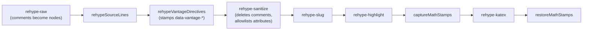

# Vantage directives — Vantage-only markup inside ordinary Markdown

**Status:** CURRENT as of 2026-09-01, verified against `3134838`.

A **directive** is an HTML comment carrying a `vantage:` sentinel —
`<!-- vantage: section tone=warning -->` — that Vantage compiles into
`data-vantage-*` attributes on the block that follows it. GitHub drops it, every
other Markdown renderer drops it, and a text editor shows one dim line, so a
document carrying directives reads identically everywhere else.

Directive values are never CSS and never colors. They are **semantic tokens** —
`note`, `warning`, `caution` — that the *theme* maps to color, so a document
says what a section means and each theme decides how it looks.

| Component | Lives in |
| :--- | :--- |
| Grammar, vocabulary, tag sets (zero-import, shared by every consumer) | `vantage-md` (`vantageDirectives.ts` — `parseVantageDirective`, `DIRECTIVE_VOCABULARY`) |
| The rehype plugin that stamps attributes | `vantage-md` (`rehypeVantageDirectives.ts`) |
| Re-applying stamps that `rehype-katex` destroys | `vantage-md` (`rehypeVantageMathStamps.ts`) |
| The one definition of the render chain | `vantage-md` (`pipeline.ts` — `buildPipeline`) |
| Attribute allowlisting and the inline-`style` filter | `vantage-md` (`sanitize.ts` — `sanitizeSchema`, `SAFE_STYLE`) |
| The theme layer | `vantage-md` (`styles/directives.css`) |
| File-scoped chrome | `vantage-md` (`vantageFrontmatter.ts`, `DocumentStatusChip.tsx`) |
| The one-click Open Question control | `frontend` (`hooks/useOpenQuestionButtons.ts`) |
| Collapse: DOM half and React half | `frontend` (`lib/collapseSections.ts`, `hooks/useCollapseSections.ts`) |
| Comment-body sanitization | `frontend` (`lib/commentMarkdown.ts` — `renderCommentMarkdown`) |
| Validation | `vantage-check` (`rules/directives.ts`, `rules/vantageFrontmatter.ts`) |

**Reads with:** [`../design/agent-cli.md`](../design/agent-cli.md) (the checker
that validates this markup),
[`../design/review-state-architecture.md`](../design/review-state-architecture.md)
(why the one-click control rides an existing command instead of inventing a
channel), and [`../../userguide/review-inbox.md`](../../userguide/guides/review-inbox.md).

---

## Principles

Cited by number from code comments and from the rest of this doc.

- **P1. The document is the artifact; markup annotates it.** A directive may
  change how a block *looks* or what affordances hang off it, never what the
  document *says*. Delete every directive and the prose is unchanged — that is
  the test, and it is a real test in `vantageDirectives.test.ts`.
- **P2. Values are semantic tokens — never styles, never colors.** A directive
  names what a section *is*, never what it should look like. The theme owns the
  token-to-color mapping, so one document renders correctly in light, in dark,
  in print, and in themes that do not exist yet. No directive ever contributes a
  byte to a `style` attribute. Hard boundary, not a simplification.
- **P3. Unknown is inert, never fatal.** An unrecognized name, key, or value is
  dropped silently where it fails to resolve — no error state, no red box, no
  console output a reader can trigger with a typo. This is what makes an older
  Vantage safe against a newer document. The *only* thing that reports a dropped
  directive is the CLI checker.
- **P4. Ride existing channels.** Review affordances go through reviewer commands
  that already exist. There is no second path from document to server.
- **P5. Markup is a hint.** Every capability answers "what if it isn't there?"
  with today's behavior unchanged — and "what if the JavaScript isn't there?",
  which is what forces the collapse gating.

> [!IMPORTANT]
> **A directive is declarative and idempotent.** It is read on every render,
> means the same thing every time, and nothing consumes it. Re-reading it a
> thousand times has no effect. This is the property that distinguishes it from
> the retired `<!-- changelog -->` protocol, which used the document as a
> *message channel* and had to dedupe and remember what it had already seen. Per
> **P4**, anything that would be a message goes through a command endpoint.

## Invariants

The eight rules everything else is held to. A change that breaks one of these is
a bug, not a trade-off.

1. **D1 — Invisible elsewhere.** On GitHub, in any other renderer, and in a text
   editor, a document carrying directives renders *identically* to one without
   them — not "acceptably", identically. This is a rule about the **comment
   carrier**. The `vantage:` frontmatter key is the deliberate exception: inert
   everywhere, but GitHub prints frontmatter as a table and therefore prints one
   `vantage` row.
2. **D2 — Unknown is inert, per key.** An unrecognized name, key, or value
   produces no styling and no error, and one bad key does not discard its
   siblings. In the stylesheet this is the cascade's job — an unset custom
   property with no fallback — not an enumeration in every selector.
3. **D3 — Forward compatible.** An older Vantage meeting a newer directive hits
   D2 and renders plain. No version negotiation, no minimum-version key. The
   mirror case matters equally: newer CSS meeting an older plugin's output, which
   is why the run selector is positive rather than negated.
4. **D4 — Review affordances are additive, and never lie.** They appear only in
   review mode and never remove an existing path. **A control that cannot work
   must not render**, which means an explicit static-mode gate for anything that
   writes. A non-interactive chip is not a control and is deliberately not gated.
5. **D5 — Every renderer agrees.** The live viewer, the package's exported
   viewer, the exported static site, and the CLI checker share one plugin, one
   parser, and one vocabulary. A directive must not mean one thing in the app and
   another through the checker — and must not *serialize* differently either.
6. **D6 — Malformed degrades to plain, never to broken.** A hostile or malformed
   directive yields an unstyled document, never a broken render, a thrown
   exception, an injected style, or a mis-wired button.
7. **D7 — Print and plain views are unaffected.** Styling is decorative.
   `collapsed` must expand for print; a section that printed closed is content
   loss.
8. **D8 — The prose is authoritative.** A reader on GitHub gets the complete
   document, and so does a reader whose JavaScript never ran.

## The carrier and the grammar

```text
directive   := "<!--" ws* "vantage:" ws* name ( ws+ pair )* ws* "-->"
name        := [a-z][a-z0-9-]*
pair        := key "=" value
key         := [a-z][a-z0-9-]*
value       := [A-Za-z0-9_.:#-]+ | quoted
quoted      := '"' [^"]* '"'
ws          := [ \t\r\n]
```

One directive per comment. `ws` includes `\n` because a directive may legally
wrap — a multi-line comment is one node whose value contains the newlines. The
sentinel is mandatory and must be the **first** thing in the comment, so
`<!--- vantage: x -->` is not a directive. Anything that does not match is left
alone and removed by the sanitizer like any other comment, silently (**P3**).

The parser is `parseVantageDirective` in `vantageDirectives.ts`, a **zero-import
module** — not even a type import — because two callers need it and only one of
them has a tree. That module is also where the closed vocabulary lives, so the
viewer and the checker cannot disagree about what a token means (**D5**).

> [!WARNING]
> **There is no `--` restriction, and inventing one is the trap.** A careful
> reading of the grammar suggests `--` is unrepresentable inside an HTML comment.
> It is not: `tone="a--b"` reaches the tree intact, because HTML5 comment
> tokenization closes on `-->` or `--!>` and on nothing else. A hand-written
> scanner — the checker's, which reads source text rather than a parsed tree —
> must therefore handle `--!>` as a terminator too.
>
> What a value genuinely cannot hold is a **terminator**. A `-->` inside a quoted
> value ends the comment early and spills the tail into the document as text; an
> unclosed `<!--` swallows the rest of the file. Neither is expressible as a
> parser rule, because by the time the parser runs the damage is in the tree — so
> both are checker findings (`vantage/unterminated`).

## Names, position, and extent

Two different jobs. **Position picks the target; the name picks the extent.**

The name set is closed and is exactly three, in `DIRECTIVE_NAMES`:

| Name | Target | Extent |
| :--- | :--- | :--- |
| `section` before a **heading** | next sibling element, stampable tags only | the heading and **every** following sibling element until the first heading of same-or-shallower depth |
| `section` before a **non-heading** | next sibling element, stampable tags only | that one block |
| `block` | next sibling element, stampable tags only | that one block, even in front of a heading |
| `oq` | next sibling element, **anchor-capable** tags only | that one block |

An unknown *name* drops the whole directive — there is no target semantics
without a name. An unknown *key* or *value* drops only that pair.

The target walk skips whitespace-only text, all comments, and doctype nodes; it
stops at the first element, or at any non-whitespace text (which makes the
directive inert). A whitespace text node always sits between a block-level
comment and its target, blank line or not.

Two directives before the same target **merge**, last-key-wins. Merging is
defined on the tree, not the source, so blank lines between them change nothing.
A directive with nothing after it is inert.

There is no `scope=` key and no range syntax — no paired open/close. Position
already identifies the target unambiguously, and a paired form would add an
unmatched-close failure mode for a use case nobody has asked for.

**"Stampable" is a closed tag list**, `VANTAGE_STYLE_TARGETS`, deliberately the
same block list `rehypeSourceLines` uses — so the styling surface and the anchor
surface coincide and a directive's target is always a block a review anchor can
name. **It gates the target and nothing else.** A directive whose next sibling
element is not on the list stamps nothing and does not look further:
`block tone=note` above a raw-HTML `<figure>` is inert, and `vantage/orphan`
reports it.

A `section`'s **range** is not gated by it. Every sibling element in the span is
stamped, on the list or not, and the two lists answering different questions is
the point: a *target* must be addressable, because a directive pointing at
something no anchor can name has no addressable effect; a *member* only has to
be a box in the flow, because all it does is carry the run's tone across itself.

Until 2026-09-03 the range was gated too, and both halves of that were bugs a
reader saw and nothing reported. A raw-HTML `<figure>`, `<dl>` or `<details>`
between two stamped paragraphs got no stamp, so the section's one continuous
vertical rule had a hole the height of the block — 44px for a one-line figure,
against the 40px a neighbor can bleed upward, and arbitrarily large for
anything taller. And `collapsed=true` hid the paragraphs while leaving the
figure on the page under a closed heading.

## Where the plugin runs

`rehypeVantageDirectives` occupies the **only slot where comment nodes exist** —
after `rehype-raw` creates them, before `rehype-sanitize` deletes them. The chain
is defined once, in `buildPipeline`, and consumed by `renderMarkdown`, both React
viewers, and the checker's mdast parser.


```mermaid
flowchart LR
  raw["rehype-raw<br/>(comments become nodes)"] --> sl["rehypeSourceLines"]
  sl --> dir["rehypeVantageDirectives<br/>(stamps data-vantage-*)"]
  dir --> san["rehype-sanitize<br/>(deletes comments,<br/>allowlists attributes)"]
  san --> slug["rehype-slug"] --> hl["rehype-highlight"]
  hl --> cap["captureMathStamps"] --> katex["rehype-katex"] --> res["restoreMathStamps"]
```

Two ordering facts are load-bearing and must not be "tidied":

- **`rehype-slug` must stay after `rehype-sanitize`.** The default schema clobbers
  `id` with a `user-content-` prefix, so a slug generated before the sanitizer
  comes out renamed.
- **`rehype-katex` runs after `rehype-sanitize`**, which means KaTeX's own output
  is never filtered. See [Security](#security).

The sanitizer deleting comments is a feature: the plugin consumes the comment and
emits attributes, and nothing Vantage-specific reaches the DOM except attributes
deliberately allowlisted in `sanitizeSchema`. An unrecognized directive leaves
nothing at all — **P3** for free.

> [!WARNING]
> **Attribute values are always strings, never booleans.** A hast property set to
> boolean `true` serializes as a bare attribute through `rehype-stringify` but as
> `="true"` through `react-markdown`. Different markup from the checker and the
> app, with no error anywhere — a silent **D5** violation.

### Display math destroys stamps, and they are put back

`$$…$$` and a ` ```math ` fence both reach rehype as `<pre><code
class="language-math">`. `pre` is stampable, so the plugin stamps the block and
counts it as a run member — and then `rehype-katex` **replaces** the element with
a fresh `katex-display` span, taking `data-vantage-*` and `data-source-line` with
it. The symptoms were an unpainted gap in the section rule, no `#L` anchor on the
formula, and `collapsed` hiding the prose while leaving the formula visible under
a closed heading.

`rehypeVantageMathStamps` fixes it with a pair of plugins that **bracket**
`rehype-katex`: snapshot the stamps before, re-apply them to the replacement span
after, finding it again by the sibling before it, whose identity survives the
splice. Both halves run after the sanitizer, which matters twice — the sanitizer
rebuilds the tree, so identities taken earlier would be stale, and every
attribute carried is one the schema already passed.

Not counting the block would have made the run markers honest and left the visual
hole exactly as wide. Carrying the stamp makes the counted member the painting
member.

## The token vocabulary

A document never names a color. The tokens are the **GFM alert set** plus
`muted`; the full enumerations live in `vantageDirectives.ts`
(`VANTAGE_TONES`, `VANTAGE_EMPHASIS`, `VANTAGE_BADGES`, `VANTAGE_COLLAPSED`).

| Key | Means |
| :--- | :--- |
| `tone` | The section's role — the same five meanings as a `> [!WARNING]` callout, plus de-emphasis |
| `emphasis` | How much the section should pull the eye |
| `collapsed` | The section's body blocks start hidden behind a caret on the heading |
| `badge` | A small chip after the heading text |

Reusing GitHub's alert words means an author who knows `> [!WARNING]` already
knows this, and the set is closed by something other than our taste — so "can we
add one more?" has a principled answer. `emphasis` is separate from `tone` on
purpose: "this is a warning" and "shout about it" are different claims, and
fusing them forces an author to overstate severity to get visual weight.

A token resolves to a **CSS custom property owned by the theme**, never to a
literal color anywhere near the document. Adding a theme touches one
custom-property block and zero documents.

### The theme layer

`styles/directives.css`, and **both halves of its wiring are load-bearing**: it
is re-exported from that directory's `index.css` so the published package and the
package's own viewer are styled, *and* imported by relative source path from
`frontend/src/index.css` so the app is. Neither half alone reaches every renderer.

Five things about this stylesheet break silently if changed:

> [!WARNING]
> **Never wrap it in `@layer`.** Every `@tailwindcss/typography` variant utility
> flattens to `(0,1,0)` and sits inside `@layer utilities`. Plain imported CSS
> lands unlayered, and unlayered declarations outrank every layer regardless of
> specificity. Wrapping this file in a layer "to be tidy" makes it lose to every
> prose utility.

- **Import by relative source path, never `vantage-md/styles`.** That specifier
  resolves to the gitignored, publish-only `dist/styles.css` — it works off a
  stale local build and fails in CI or a fresh clone.
- **The import stays near the top of `frontend/src/index.css`**, before the app's
  own rules. The lone-block wash ties at `(0,1,0)` with the line-anchor and
  review-highlight backgrounds, which are declared later and must win, so a
  transient state still shows on a toned block.
- **No `var()` fallback on the accent.** Its absence *is* the D2 mechanism: an
  unrecognized token leaves the property unset, the value is
  invalid-at-computed-value-time, and it computes to transparent. A "safety"
  fallback would style every typo'd token gray. Use the `background-color`
  longhand, never the `background` shorthand, for the same reason.
- **`emphasis=strong` must exclude headings, `pre`, and `table`**, or unlayered
  `font-weight` de-bolds a toned heading below its prose weight.

The section rule is an absolutely-positioned `::before` on each stamped member,
offset out into the heading-anchor gutter, with a per-heading-level `em`
compensation — headings are pulled left by `1.5em` *of their own font size*, so a
plain `border-left` would draw the "continuous" rule at three different x
positions. Members are joined by an upward bleed keyed off `data-vantage-run`
(`start` / `middle` / `end` / `only`), which the plugin stamps.

> [!WARNING]
> **`data-vantage-run` exists because adjacent-sibling CSS cannot work here.**
> The review highlighter inserts its comment card as a *sibling inside* the
> stamped run, so `[tone] + [tone]` severs at every commented paragraph and bleeds
> across the boundary between two adjacent runs. The run selector must also stay
> **positive** — a negated form bleeds the first member above its heading in
> exactly the older-plugin/newer-CSS case **D3** covers.

> [!WARNING]
> **A scroll container clips its own `::before`.** Typography puts
> `overflow-x: auto` on `pre`, which forces computed `overflow-y: auto`, so a code
> fence clipped the rule to nothing and punched a gap taller than the bleed could
> repair. The fix moves the horizontal scroller to the `code` child, which nothing
> is positioned against. Any future member tag that scrolls needs the same
> treatment. Computed-style assertions cannot catch this — the pseudo-element's
> `left` was correct all along; it simply did not paint. Only a pixel test sees it.

> [!WARNING]
> **An image or a drawing has no `::before` at all.** A raw `` or a bare
> `<svg>` written as an HTML block of its own is stamped like any other member,
> but both are replaced elements, which generate no pseudo-elements, so the rule
> stopped beside each one: 84px beside a 92px image. They draw their slice as a
> border image pushed out of the box instead. That slice is on the run's x only
> if the box starts at the column's edge, so it is withheld from an image that is
> floated, offset by a `margin` or by `hspace`, or preceded by inline content on
> its line. It is withheld too where the document drew a border, which a border
> image would erase. Those keep the gap. In the app `hspace` offsets nothing,
> because Tailwind's preflight resets every element's margin, so an image
> written with it keeps the gap without having moved. The condition is there for
> the package's own viewer, where `hspace` does move the image. A drawing inside
> a `<div>`, the form [Inline SVG](#inline-svg) recommends, needs none of this,
> because the `<div>` is the member.

**On paper the rule is gray, and it needs its gutter there too.** The print
block in `styles/directives.css` recolors it `#57606a`, and the host's print
block zeroes the content wrapper's padding. Together those put the rule outside
the page area, where Chrome clips, so until 2026-09-28 no toned document printed
a rule at all. The host now gives the wrapper a left padding of
`--vantage-tone-rule-offset`, and only when the page holds a toned block.

## GFM alerts

`> [!WARNING]` and its four siblings are compiled by `rehypeVantageAlerts` into
`data-vantage-alert` on the blockquote, with the marker removed from the text and
a title element prepended. It is a **pipeline** plugin, so all four renderers get
it — the live viewer, the package's exported viewer, the static export, and the
CLI checker's `renderMarkdown` (**D5**).

The five kinds resolve to the **same per-tone properties** the `tone` vocabulary
resolves, so `[!WARNING]` and `<!-- vantage: block tone=warning -->` cannot drift
apart and a new theme is still one custom-property block. They stay two closed
lists because they are closed by different authorities: `muted` is ours and is not
an alert word. A test asserts the alert set is a strict subset of the tones.

An alert is a **heavier** treatment than a tone, deliberately: a real left border,
a full wash and a visible title, because the author asked for a callout. A tone
annotates a block that reads perfectly well without it.

> [!IMPORTANT]
> **Alerts resolve to `--vantage-alert-*`, never to `--vantage-tone-*`, and the
> separation is a bug fix rather than tidiness.** Custom properties inherit. A
> `[!CAUTION]` inside a `tone=important` section is both an alert *and* a stamped
> run member, so resolving both onto `--vantage-tone-accent` let the alert's kind
> win on that element — and the section's own vertical rule turned red for the
> height of the alert plus the 2.5rem it bleeds upward. The section read as three
> colors and looked broken.

Three `@tailwindcss/typography` defaults have to be overridden, and all three are
why an unrendered alert looked far worse than merely plain: typography italicizes
blockquotes, grays their text, and draws `open-quote`/`close-quote` around the
first paragraph. So a callout rendered as an italic *quotation* whose opening
words were the literal `[!WARNING]`.

An unrecognized marker is **left exactly as written** — `[!HINT]` is not an alert
on GitHub either, and silently swallowing it would hide a typo that reads as a
callout on no renderer at all. The marker must also be alone on the blockquote's
first line, which is what keeps a paragraph that merely *begins* with bracketed
text from being eaten.

> [!NOTE]
> The title is a real element rather than CSS `content`, unlike the collapse
> caret. The caret is injected by app JS that may never run, so its glyph had to
> stay out of the document's text; this plugin is in the shared pipeline and
> always runs. It is a `div` rather than a `p` so it carries no
> `data-source-line` and therefore cannot become the block a review comment
> anchors to — `anchorBlockWithin` filters candidates to those with a finite
> line.

## Collapse without a wrapper

`collapsed=true` stamps a flat sibling run — a toggle attribute on the heading, a
collapsed attribute plus a group id on each body block — and a click handler
flips the group. There is no `<details>` and no wrapper element.

The heading carries a *different* attribute from the group members on purpose: a
nested heading inside a collapsed section must be both a hidden member of the
outer group and the toggle for its own, and sharing one attribute would make it
permanently invisible and unreachable by either control.

The hiding rule is **triple-gated**, and each gate answers a distinct way content
could become unreachable:

- `@media not print` — so the declaration does not exist in the print stylesheet
  at all (**D7**). This beats a `display: revert` counter-rule, which a third rule
  could defeat.
- A readiness marker the JS sets on the prose container *after* attaching — so a
  renderer without the toggle JS, such as the CLI checker's HTML or an external
  consumer of the package, hides nothing (**P5**, **D8**).
- A per-block armed marker — so a collapsed block whose group ended up with no
  control renders visible rather than being hidden with nothing able to reveal it.

Anything that scrolls to a block must **reveal before measuring**: a hidden target
has a zero-height box, so the scroll lands somewhere wrong with no cue. The shared
helper is `anchorScroll.ts`; the callers are the `#L` line anchor, in-document
`#slug` links, the heading hover anchor, and the review highlighter.

## The one-click Open Question answer

An `oq` directive on an open question renders one button in review mode,
labeled **"Take this leaning"**. Clicking it calls the same `addComment` the
comment popover calls, with an anchor identical in shape to what click-and-type
produces. The comment text is the `leaning` value, or a fixed default when
absent. A 🔒 blocked or ✅ answered question gets no button
([below](#the-count-and-why-the-gate-needed-one)).

**The affordance sits in its own row, inserted as the question block's next
sibling** — never appended into the block. Appended, it landed after the
question's last word, and inside a blockquote it landed *before* typography's
generated closing quotation mark (`content: close-quote` on the paragraph's
`::after`), reading as part of the quote. The row is also what gives the taken
state room for two controls side by side, and it keeps every injected node out of
the subtree a block hash is taken over.

The row stays inside its parent, so a question in a list item keeps the item's
indentation, and it copies a toned block's `data-vantage-tone`/`run` the way
`insertInlineCommentAfter` does — an unstamped sibling between two members of a
section is a gap the rule's upward bleed cannot span.

> [!WARNING]
> **Not the gutter.** A per-block gutter control was built and deleted
> (`7652eb7`, `docs/design/review-mode.md`): its hit zone broke on tall blocks,
> and the principle adopted in its place is to pick the natural unit rather than
> a sub-region of it. There is also nowhere to put one — the prose column carries
> 16–32px of left padding, the section tone rule already claims 12px of it, and
> the scroller's computed `overflow-x: auto` clips anything further left instead
> of scrolling to it.

Everything downstream is unchanged: the comment rides the existing command to the
review endpoint, appears in the panel, reaches the agent in the ordinary clipboard
payload, and is answered through the inbox. There is no new endpoint and no new
inbox verb — per **P4** this is a *macro over an existing command*.

### The same comment, from the planning page

The [planning page](../../userguide/guides/planning.md#the-planning-page) lists
questions from many documents, each on a card, and its **Take this leaning**
files a comment indistinguishable from this button's: the same body, the same
anchor and the same fallback text. The planning design requires that
([`planning-index.md` §6.3](../design/planning-index.md#63-a-question-on-the-page)),
and the card meets it by taking this button's route rather than a second one.
It renders the question's block through the viewer's own pipeline, finds the
question's host in it with `answerableOpenQuestions`, builds the anchor with
`buildWholeBlockAnchor` over that host, and reads the body with
`leaningComment` off the stamped element: the calls this pass makes, over the
same rendered block. The request is the one `addComment` sends, posted for the
card's document by `postCommentTo`, because `addComment` posts only for the
document on screen. **Answer…** files typed text on the same anchor.

> [!WARNING]
> **Do not build a card's comment from the planning index.** The index's
> `leaning` and the stamped attribute pass through the same normalization
> today, but they are two readings of the directive, one from the Markdown tree
> and one from the rendered page, and a take is recognized by its exact body:
> `findTaken` compares it byte for byte. Were the two ever to differ, a take
> filed from the card would read as untaken in the document, which would offer
> its button again, and the agent would get the leaning twice. Read off the
> rendered element, as the button reads it, the body is equal by construction.
> The index's `leaning` only decides whether the card offers a take.

The card differs from the button in two ways. It offers **Take this leaning**
only when the question states a leaning, as the planning design specifies,
where the button falls back to its default text. And it offers no Undo: a taken
leaning shows as the chip alone, and Undo is in the document.
`PlanningQuestionCard.test.tsx` files from the card and from the in-page button
over the same documents and asserts the two comments equal, question by
question.

### The count, and why the gate needed one

The button renders only in review mode, which is correct and was also, on its
own, a dead end: a document carrying three `oq` directives with leanings
rendered as three ordinary paragraphs, and **nothing anywhere said the affordance
existed**. The reader had to already know.

So the viewer reports how many questions in a document offer the button —
after the state filter below, and before the gates, so the number is right
whether or not review mode is on — and the Review toggle's **tooltip** carries
it while review mode is off. Clicking the toggle is what makes the count
actionable, which is why it lives there rather than in the document: the count
is not a second control, it is a label on the control that already existed.

It is a tooltip and not a chip beside the label. A number rendered on the button
reads as an unread badge on a toolbar that has no other notification, so it
claimed more urgency than "this document has answerable questions" deserves; the
sentence in the tooltip says the same thing and says what it is for.

`answerableOpenQuestions` is exported and **shared with the render pass**, so the
count and the buttons cannot disagree. A count of five against three buttons
would send the reader hunting for controls that were never there — and five is
what a naive count of `[data-vantage-oq]` gives on a document that also stamps a
`pre` and a `table`.

The table of contents is a third caller, and it takes the list *before* the
state filter: it lists every question the function finds and tallies them by
state, 🔒 and ✅ included
([`contents-open-questions.md`](../design/contents-open-questions.md)). So the
column can list more questions than there are buttons, and that is deliberate:
a blocked or answered question is still one a reader of the document wants to
see. What the column must not do is promise an action the page does not offer,
so its tally's tooltip says how many of its questions can be answered in one
click, the number the Review toggle gives, rather than implying that all of them
can. It still takes its list from `answerableOpenQuestions` rather than
re-querying the attribute, so it never lists a stamped `pre` or `table`, which
has no button in any state and is no question to the planning index either. The
planning page's card is the fourth caller, finding its question's host
([above](#the-same-comment-from-the-planning-page)).

The button renders only when **all four** hold: review mode is on, the directive
parsed, static mode is off, and the question is open. The static gate is not
optional — an exported site runs review mode with every write silently coerced
into a GET, so an ungated button would look live and do nothing, which is worse
than no button.

**Open** means marked 💬, or carrying no marker, which counts as open. A 🔒
question cannot be answered yet and a ✅ one has been ruled, so neither has a
leaning left to take, and neither gets a row at all: no button, no taken chip
and no Undo, even when an earlier take exists. The planning design ruled this
for the page and the viewer alike (its Decision Ledger row *Plan Q5*,
[`planning-index.md` §6.3](../design/planning-index.md#63-a-question-on-the-page)).
The state is read as the table of contents reads it, from the question's title
and then its marker (`questionLabel`), so the column's glyph and the button can
never disagree about which state a question is in. The filter runs after
`answerableOpenQuestions`, never inside it, because the column lists from that
function.

There is exactly one button and it is **affirmative only**. A rejection almost
always needs a reason, which means typing anyway, so a Reject button would mostly
produce content-free rejections the agent then has to chase.

### Taken, and the way back out

Once the leaning is taken the button is replaced by a **"Leaning taken" chip and
an Undo button**, in the same row. Undo is `deleteComment` — the action the
inline card's `×` already calls — so taking writes one comment and Undo removes
it, and nothing new reaches the server.

Undo is offered **only while the take is still the whole thread**. Once any
reaction exists, deleting the comment would discard the reply with it and nothing
brings a deleted comment back, so the chip renders alone and carries a `title`
saying where the thread is. D4: a control that would destroy something
unrecoverable must not be the one offered.

> [!WARNING]
> **`resolved` is deliberately ignored**, so dismissing a taken leaning does not
> re-arm the button — otherwise the reviewer gets a fresh duplicate for a thread
> they closed. That is why Undo has to exist *here*. Before it did, dismissing
> was the only thing that looked like an undo, and it left an inert chip with no
> tooltip beside the question while the comment moved to a collapsed section at
> the top of the document, the minimap mark disappeared and the toolbar count
> went to zero. The escape hatch was a two-click delete behind a hover-hidden
> trash icon in the panel, and nothing said so.

Whether a leaning is already taken is decided by the comment's **body, the
block's hash, a whole-block selection, and the line within
`NEIGHBOR_RADIUS`** — the same radius `useReviewHighlights` re-anchors within,
shared from `reviewAnchor.ts` rather than written twice. The line is a tolerance
and not an equality, and that is a fix rather than a nicety: while this pass
compared `source_line` exactly and the highlighter walked a neighborhood,
inserting a line above an `oq` block rendered the chip **and** a live button on
one paragraph — one surface saying the comment was still attached, the other
saying the leaning had never been taken. It stays a tolerance rather than being
dropped so that two identical questions carrying identical leanings, far apart in
one document, keep separate buttons.

> [!WARNING]
> **Do not place a directive at column 0 between list items.** It terminates the
> list: one loose `<ol>` becomes two, which is a visible change on GitHub and so a
> **D1** violation. Indent the directive inside the list item instead. This is why
> the plugin walks the whole tree rather than only the root — in a real Open
> Questions list the comment is a child of an `<li>`, and a root-only walk finds
> no `oq` directives at all. `vantage/list-split` and `vantage/block-split` catch
> it.

> [!WARNING]
> **Every injected review affordance must be excluded from block-text hashing**,
> via the one selector in `reviewAnchor.ts`. Miss it and every anchor on that
> block silently drifts.

## File-scoped chrome

Frontmatter cannot point at a section, so it is not the carrier — but it is the
right home for genuinely file-scoped chrome, under a single `vantage:` key so it
stays out of the way of a user's own keys. The reserved key is filtered out of the
rendered metadata card; unfiltered it would appear there as a JSON blob, shipping
the chip *and* the burial the chip exists to remove.

```yaml
---
title: "Adaptive leveling"
status: in-review
vantage:
  status-chip: true
---
```

`status-chip` draws from the document **lifecycle** set (`DOC_STATUSES`), not from
the badge tokens, and `status-chip: true` inherits the document's own `status:`
key rather than duplicating it — a second value that can disagree with `status:`
is the drift the chip exists to remove. The chip renders as the first element of
the content column; there is no document title in the UI to put it beside.

The chip is **not** static-gated: **D4**'s gate is for controls that write, and a
non-interactive span cannot fail.

## Security

The threat model is a document nobody vetted, in a repository Vantage serves.

**Directives add no injection surface.** Three independent things stop
`<!-- vantage: section tone="url(https://evil/x)" -->`: the vocabulary is closed,
so anything outside it is dropped at resolution; the compilation target is a data
attribute rather than `style`, and no code path anywhere builds a style string;
and the sanitizer re-checks with value-level allowlists.

For **`data-vantage-leaning`** — the one free-text value in the design — there are
**two** of those three, not three. A free-text value cannot be value-allowlisted,
so that attribute is allowlisted by name only. It is safe because hast escapes
attribute values on serialization and React sets them through the DOM property
path, so no breakout is possible; and because it never becomes executable or
styling markup. It *does* become markup — an escaped, inert attribute value.

**Comment bodies are sanitized.** The `leaning` string becomes the body of a
review comment, and comment bodies are rendered as Markdown into `innerHTML`. That
path had no sanitizer at all until this work added one (`renderCommentMarkdown`,
with a tight allowlist appropriate to comment bodies). Without it, document
content reached an XSS sink through one button click.

> [!WARNING]
> **DOMPurify with no DOM is not a sanitizer that fails open — it is not callable
> at all.** `isSupported` is false and `sanitize` is not a function. The module
> guards on `isSupported` and escapes instead. An earlier note recorded this as
> "fails open, returns input unchanged", which is wrong in a way that matters: a
> security comment that misdescribes its own threat is worse than none.

### The inline-`style` filter

`style` is allowlisted on every element but `input`, and `SAFE_STYLE` is what
makes that safe. It enforces a property allowlist, **no parentheses anywhere**
(which closes `url(…)` and `expression(…)` in one stroke), and now bans
`position` outright. Matching is **all-or-nothing**: one unrecognized
declaration drops the whole attribute, so an element renders unstyled rather
than half-styled (**D6**).

**An `input` keeps no `style` at all.** GFM emits one only as a task list's
checkbox, and never with a style. The task-list stylesheet positions that
checkbox itself, so a `style` on it could place and size a box over the page:
measured in Chromium while the checkbox was positioned absolutely, a white
9000px square set by `top`, `left`, `width` and `height` covered the whole
content pane. A document needed no class for it:
GFM gives a task's `li` the class that rule matches, and a checkbox typed into
the task's text is a child of that `li` too. The schema therefore lists `style`
on each element's own entry rather than on `*`. `rehype-sanitize` consults `*`
whenever an element's own entry yields nothing, so no entry on `input` could
refuse what `*` admits.

**`display` takes a listed keyword, and never `contents`.** An element with
`display: contents` generates no box, so it is no containing block. The app
places two things absolutely inside a document's elements: a toned block's rule
is a `::before` inside the block, and a heading's link anchor sits inside the
heading. A document may write `data-vantage-tone` by hand, because the
sanitizer checks that attribute's value, not who wrote it. On an element written
`display: contents`, both were placed against the nearest positioned ancestor,
which is outside the scroll container, so the scroll container neither clipped
them nor scrolled them. Measured in Chromium at 1280x800: a toned paragraph's
rule was a bar the full height of the content pane. On a heading, the heading's
font size moved that bar, and the anchor, which takes clicks, anywhere across
the pane.

Three fixes were open, and the one taken closes the most:

- **Refusing the value closes the whole class.** A document cannot position an
  element, because `position` is refused, so every containing block inside the
  document is one a stylesheet made. Taking an element's box away is the only
  way a document can remove one, and `display: contents` is the only value that
  does it and keeps the element's contents on screen. Measured in Chromium, each
  other value tried, which was every listed keyword and the ruby, two-keyword
  and CSS-wide ones besides, leaves a toned block a rule as tall as the block,
  or generates no rule at all (`none`, `table-column`, `table-column-group`). So the rule, the anchor and the
  task-list checkbox are all covered by one refusal, and so is any positioned
  box a stylesheet adds later.
- **Refusing a hand-written tone** cannot be done. By the time the sanitizer
  runs, the tone a directive stamped and the one a document wrote are the same
  attribute, as with the kept class names below. It would also leave the heading
  anchor open, since the anchor needs no tone.
- **Containing the rule in its stylesheet**, as the checkbox's float does, fixes
  one box at a time and leaves the next positioned rule open.

The values are listed rather than `contents` refused, for two reasons. A CSS
comment is legal between the colon and the keyword, so a filter that refused
the word would keep `display:/**/contents`. And a CSS-wide keyword such as
`inherit` names no value of its own. The two-keyword forms (`block flow`) are
refused too: each has a one-keyword spelling on the list.
[Current values](#current-values) lists the keywords, and
`frontend/e2e/boxless.spec.ts` measures that the rule and the anchor stay in
the scroll container.

> [!IMPORTANT]
> **KaTeX output never passes through this filter, and the filter's original
> rationale was wrong because of it.** `rehype-katex` runs *after*
> `rehype-sanitize`, so every style attribute KaTeX emits is injected
> post-sanitization and is never examined. Measured: with a schema that forbids
> `style` outright, KaTeX's style attributes still survive in the shipped order
> and vanish in the reversed one.
>
> So "strip `style` and rendered math falls apart" was false, and so was
> "`position` cannot be banned without breaking integrals". The measurement behind
> the second claim was real; the inference was not. Banning `position` outright
> broke nothing and closed the overlap residual the property allowlist otherwise
> leaves open.
>
> The filter still does real work, for the reason the original rationale
> obscured: **document-authored** `style` attributes *do* pass through the
> sanitizer, and that is the actual threat. The KaTeX battery in the test suite
> still earns its place by pinning what KaTeX emits — but it does not, and never
> did, demonstrate anything about the filter.

> [!WARNING]
> **`SAFE_STYLE` must stay unambiguous, and `;` is what makes it so.** An earlier
> form let a declaration's value class and the following separator both claim the
> same whitespace, so every declaration doubled the parse count and a failing
> ~200-character value took seconds. Because `renderMarkdown` feeds the CLI
> checker, that hung `just check-ci` and CI itself, not merely a browser tab. Any
> future edit to this regex must keep exactly one parse of any input.
>
> A wall-clock regression test for this is itself a hazard: a synchronous regex
> cannot be interrupted and vitest's timeout never fires for a blocking test body,
> so a naive budget assertion hangs the suite forever instead of failing. The
> shipped test is an ascending ladder that asserts on each rung and aborts before
> the length that would hang.

Denial of service is otherwise not a concern: ten thousand directives is ten
thousand comments, and the plugin is one linear pass over an unambiguous grammar.

### The `class` allowlist

A document's `class` is kept only on the elements where the pipeline puts one
itself, and only with the names it puts there: a fenced block's language, GFM
task lists and footnotes, and an alert's title. [Current values](#current-values)
lists them. Every other class a document writes is dropped, and the element
stays.

**A class is a style by another name.** The app's stylesheet carries the
[Tailwind](https://tailwindcss.com/docs/styling-with-utility-classes) utility
classes its own markup uses, and `class` used to be kept with any value on every
element. So `<div class="fixed inset-0 z-50 bg-white">` laid a white sheet over
the whole window, header and sidebar included. That is the overlay the `style`
filter bans `position` to prevent, through an attribute the filter never reads.
A document could also borrow a class the app's own code looks for, such as the
one the outline strips from a heading's text. Comment bodies were never open to
this: their sanitizer refuses `class` outright.

- **The names are measured, not listed from memory.** A test records every
  class on the tree on both sides of the sanitizer, over a document that uses
  every feature that emits one. It fails if the sanitizer takes any of them but
  the two `remark-math` names below, and if a plugin starts emitting a new one.
- **A class added after the sanitizer needs no entry,** and that is most of what
  the page styles: the highlighter's token classes, KaTeX's output, Mermaid's
  diagrams, and everything the app's components add. A document that writes one
  of those on an element keeps nothing.
- **Mermaid source is the one route left, and the diagram bounds it.** Mermaid
  renders after the sanitizer, and it copies the class names a diagram's source
  gives a node, with `:::name`, `class A name` or `classDef`, onto that node. So
  a diagram can carry any of the app's utilities on its own nodes: measured,
  `hidden` hid one and `animate-spin` spun one. None of it reaches past the
  drawing. `position` does nothing on an SVG group, the diagram's `svg` clips
  what is inside it, and a `classDef` that sets `position: fixed` on a label
  leaves the label inside the `foreignObject` that holds it. An end-to-end test
  measures that bound.
- **`remark-math`'s `math-display` and `math-inline` are dropped, as they always
  were.** KaTeX finds math by `language-math` alone, and tells a display formula
  from an inline one by whether it sits in a `pre`.
- **A document may still write the kept names on their own elements.** By the
  time the sanitizer runs, a hand-written `<li class="task-list-item">` and the
  one GFM emitted are the same node, and none of the names can lay an element
  over anything outside the document's scroll container. The task list's
  checkbox took three fixes to get there. An `input` keeps no `style` (see
  [The inline-`style` filter](#the-inline-style-filter)), and the stylesheet
  floats the checkbox instead of positioning it absolutely. An absolutely
  positioned box is placed against its nearest positioned ancestor, and an item
  written with `display: contents` has no box to be one. So the checkbox was
  placed against an ancestor outside the scroll container: with the item's
  `font-size` at 600px, a 630px square over the content pane that stayed put
  when the document scrolled. The third fix is the style filter's refusal of
  `display: contents`, which took the same escape away from the tone rule and
  the heading anchor.

> [!WARNING]
> **The footnote label is visible in the app only because nothing Tailwind scans
> spells its class.** Tailwind generates a utility for every class name it finds
> in the files it scans, comments included, and it scans all of `frontend/` and
> `packages/vantage-md/src`. The label's class, `sr-only`, is a Tailwind utility
> that hides an element from sight. Written in either tree, it generates that
> rule, and the label disappears as it does on GitHub. That is why `sanitize.ts`
> reads the name from `rehype-sanitize`'s default schema and the tests spell it
> in halves.

### Inline SVG

Raw `<svg>` is admitted as static drawing: shapes, paths, text, groups and
`switch`, with geometry, stroke, fill and font attributes. What can run code or
fetch is refused. That covers `script`, `image`, `use` and `feImage`, the
`animate` and `set` family, and event handlers. It also covers `href` and
`xlink:href` on the drawing's elements and every attribute that takes a `url(…)`
reference: `filter`, `mask`, `clip-path`, `marker-*`, `cursor`, and a `url()`
paint. An `<a href>` inside a drawing is the exception: it survives as an
ordinary link, protocol-filtered like a Markdown link. Gradients and patterns
are unsupported because they are reachable only through `url(#id)`, and the
sanitizer prefixes every `id`. SVG child elements require an `svg` ancestor.

**Inline SVG is Vantage-only.** GitHub drops the drawing, leaves the words of
its `<text>` elements as loose text, and prints a `<title>` as literal markup, so
for a document read on GitHub, commit the drawing as a file and embed it with
``.

**Write a drawing as a `<div>` on a line of its own around the `<svg>`, with no
blank line anywhere inside it.** Markdown decides where raw HTML ends before the
sanitizer sees any of it:

```html
<div>
<svg xmlns="http://www.w3.org/2000/svg" width="120" height="40" viewBox="0 0 120 40" role="img" aria-label="Two boxes, A and B">
  <rect x="1" y="1" width="50" height="38" fill="none" stroke="currentColor"/>
  <text x="26" y="25" text-anchor="middle" fill="currentColor">A</text>
  <rect x="69" y="1" width="50" height="38" fill="none" stroke="currentColor"/>
  <text x="94" y="25" text-anchor="middle" fill="currentColor">B</text>
</svg>
</div>
```

- **The `<div>` line opens an HTML block that runs to the next blank line.** So
  everything inside reaches the sanitizer as markup, including an `<svg` start
  tag spread over several lines, which is how Inkscape lays one out.
- **Without the `<div>`, only a single-line start tag works.** A `<svg …>` start
  tag complete on a line of its own opens the same kind of block. One spread
  over several lines does not, and the drawing is read as a paragraph with tags
  in it: `*adj*` inside a `<text>` became emphasis, which closed the `svg` there
  and lost the rest of the drawing.
- **A blank line ends either block.** The next indented line became a code
  block, which printed the rest of the drawing as source.
- **The `<div>` is also the drawing's anchor.** It carries the
  `data-source-line` that a `#L` link and a review comment resolve against, and
  the `svg` itself carries none.

`vantage-check` reports none of these breakages; the rendered page is the only
place they show.

**Give a drawing a `width` and a `height` as well as a `viewBox`.** Without a
size, a drawing is as wide as the column, however little it holds. A drawing
wider than the column shrinks to fit only if it has a `viewBox`. Without one
nothing scales it, and it is cropped at the column's edge. An `<svg>` in a
sentence stays on its line in a paragraph, a list item, a table cell, a heading,
a `<summary>`, a definition list or a `<figcaption>`. Inside a `<div>` it is a
block, which is what makes the `<div>` the right wrapper for a drawing.

`fill` and `stroke` take only a keyword, a color name or a hex color, for the
reason `style` refuses parentheses. **A refused paint is replaced by what the
element inherits, which is rarely what was drawn.**

- **A refused `fill` takes its parent's fill, and SVG's initial fill is
  black.** So `fill="rgb(219, 234, 254)"` and `fill="url(#g)"` both paint a
  black shape, unless an ancestor sets a fill. A Figma export sets
  `fill="none"` on the `<svg>`, and there a shape whose paint was refused is not
  drawn at all.
- **A refused `stroke` draws no outline**, because SVG's initial stroke is
  `none`.
- **Paint written in `style` is dropped with the rest of the attribute,**
  because `SAFE_STYLE` has no `fill` or `stroke`, and that is how Inkscape and
  matplotlib write every color. `style="fill:none;stroke:#1f77b4"` turns an
  outline into a solid black shape, so their drawings render as black
  silhouettes. A matplotlib chart becomes one black rectangle: its text is black
  on black, and under the default `svg.fonttype` there is no text at all,
  because each glyph is drawn by a refused `<use>`. An Inkscape drawing also
  loses its text size, which it writes in the same `style` as the paint. Embed
  a drawing from either as `` instead.
- **A draw.io export depends on how it writes color.** One that writes every
  color as `rgb(…)`, as older versions did, loses every outline and connector,
  and its filled headers turn black over their black labels. One that writes
  hex colors renders in the light theme, but its dark-theme colors are a
  `light-dark()` in `style`, which is refused, so in dark mode its black lines
  and text sit on the dark page.

Black is also what disappears in dark mode, where text with no fill, or
`fill="black"`, sits on the dark page at about 1.2:1. For anything that has to
read in both themes, write `fill="currentColor"` or `stroke="currentColor"`: it
takes the prose text color, which follows the theme.

A refused element is normally *unwrapped*: the tag goes and its children stay.
Inside an `<svg>`, the containers whose children are never meant to be painted
where they stand are instead removed with everything inside them: `defs`,
`clipPath`, `mask`, `pattern`, `marker`, `symbol`, `linearGradient`,
`radialGradient`, `filter`, `metadata`, `foreignObject`, `title` and `desc`.
Unwrapped, a Figma export's clip rectangle painted over the whole drawing, and
the HTML inside a `foreignObject` escaped into the page. `switch` is kept, so a
draw.io export draws each label's `<text>` fallback.

Outside a drawing those names are unwrapped like any other tag, because removing
them there removed far more than the tag. A bare `<pattern>` on a line of its
own is an HTML element that nothing closes, so every block after it is parsed
into it, and removing it took the rest of the document. Unwrapped, it loses only
the tag. The tag is still dropped, so put a tag name in a code span.

`title` and `desc` are removed, and `aria-label` on the `<svg>` is the drawing's
accessible name. Both are places where the parser reads HTML, and requiring an
`svg` ancestor did not keep a `<title>` out of the page's `<head>`. Under
`<math>` the `svg` keeps MathML context, which React hoists a `title` out of,
and `<svg><desc><title>` re-parses from `renderMarkdown`'s string output as an
HTML `title`. Either one set the tab title.

`role` on the `<svg>` is kept only as `img`, or as `presentation` or `none` for
a decoration, and is dropped otherwise. Any other value let a document present
its drawing to assistive technology as an alert, a button or a dialog, under a
label the document wrote.

`transform` is accepted on the elements inside an `<svg>` and refused on the
`<svg>` itself. There it is a CSS transform of an in-flow box, and
`transform="translate(-300 -300) scale(80)"` painted a 10-pixel drawing as an
800-pixel one over the paragraphs around it. Inside, it moves shapes within the
drawing's viewport, which clips them. The residual is that clip: `style` may set
`overflow: visible` on the `<svg>`, and then a large child `transform` overlaps
the neighbors the same way. That is the negative-`margin` residual by another
route: it stays in the flow and the scroll container clips it.

`stroke-dasharray` is refused too, so a dashed line renders solid. It is the one
presentation attribute whose paint cost a few bytes can make unbounded: the dash
count is the path's length over the dash period, both in user units the document
chooses. Fifty short paths with a `0.0011` dash took 21 seconds to paint in
headless Chromium, and a floor on the dash length does not help, because scaling
the user units by a thousand costs the same 15 seconds with a `1.1` dash.

## Validation

The `vantage/*` rule family in `vantage-check` validates directives with no
rendering, so a typo is caught before anyone sees a section that mysteriously did
not style. It imports the parser and vocabulary from `vantageDirectives.ts` by
relative source path — a second parser would be a **D5** violation by
construction. The rule ids and their default settings are enumerated in
`rules/registry.ts`.

Two rules are worth knowing by name. `vantage/unterminated` catches an unclosed
`<!--`, which silently deletes the rest of the document from the render — the
highest-value rule in the family, and not about styling at all.
`vantage/block-split` runs **P1's own test**: it deletes the directive, re-parses,
and compares the block structure, which catches every construct a stray
column-0 comment can restructure rather than enumerating the ones anyone thought
of.

> [!IMPORTANT]
> **The checker's target resolution must match the plugin's exactly** — whole-tree
> walk, same skip rules, same stampable and anchor-capable tag sets. They share
> the vocabulary module; they do not share the walk, so this is maintained by
> agreement and by test.

`just _self-check` runs the built CLI over `docs/` and `userguide/`, so any rule
that fires on a fenced example in the documentation turns the gate red. Tests in
`vantage-check` pin that the rules stay silent on this repo's own docs and on
every example the style guide tells agents to copy.

## Non-goals — what this does not license

- **Not a template language, and never text-changing.** No variables, no
  conditionals, no includes, no `<!-- vantage: replace … -->`.
- **Not a styling API, and not a palette.** No CSS, no class-name passthrough, no
  `style=`, and **no color names at all**. Extending the vocabulary is a code
  change with a review.
- **Not a second review channel.** A directive never triggers a write on render.
  The button writes because a human clicked it, which is categorically different.
- **Not a layout engine.** No columns, no floats, no positioning, no widths.
- **Not a way to hide content.** `collapsed` hides nothing the reader cannot
  reveal, nothing in print, and nothing at all where the toggle JS did not run.
- **Not frontmatter's replacement.** File-scoped chrome lives under one
  frontmatter key; the comment carrier exists for what frontmatter cannot address.
- **Not a GitHub-rendering change.** Readers are never asked to install anything.
  If it does not degrade, it does not ship.

## Known gaps

- **A block the app inserts into a run after render is the app's to bridge.**
  The pipeline stamps every element it can see, but review mode adds inline
  comment cards as siblings *inside* a stamped run, and those are stamped by
  `useReviewHighlights` rather than here. Anything else that splices a sibling
  into rendered prose has to do the same or it punches a hole in the rule.
- **An inline element written as an HTML block of its own draws a short slice
  in the wrong place.** A raw `<a>` or `<span>` alone on its lines is an inline
  box. Its `::before` is one line of text tall however tall the image inside it,
  and it starts at the element rather than at the column's edge, so a row of
  linked badges written that way draws one short slice per badge, the second in
  the middle of the column. Put such a row in a `<p>`.
- **Without Tailwind's preflight an `<svg>` is inline.** The rule that keeps an
  image from drawing mid-column assumes a drawing is a block, which it is in the
  app. Under `vantage-md/prose` alone, a drawing that shares a line with an image
  can draw its slice beside the image instead of on the rule.

## Current values

Verified at `3134838`. The prose above explains what each of these is for; this
table is the only place the values themselves are stated.

| Value | Setting | Defined in |
| :--- | :--- | :--- |
| Section rule width | `5px` (`strong` 6px, `quiet` 4px) | `--vantage-tone-rule-width`, `styles/directives.css` |
| Alert border width | `4px` | `--vantage-alert-rule-width`, same |
| Rule offset into the gutter | `0.75rem` | `--vantage-tone-rule-offset`, same |
| Upward bleed joining run members | `2.5rem` | `--vantage-tone-run-bleed`, same |
| Heading gutter compensation | `1.5em` | `--vantage-tone-heading-gutter`, set by `frontend/src/index.css` |
| Member border compensation | `0px` default; `0.25em` blockquote, `1px` `pre` (app), `4px` alert (package) | `--vantage-tone-border-compensation`, declared wherever the border is |
| `quiet` fade | `0.88` | `styles/directives.css` |
| Per-tone properties | `accent`, `wash`, `chip`, `ink` — light on `:root`, dark under `.dark` | `styles/directives.css` |
| Collapse group id format | digits only | `COLLAPSE_GROUP_ID`, `sanitize.ts` |
| Max `leaning` length carried to the DOM | 500 characters, whitespace-collapsed | `rehypeVantageDirectives.ts` |
| Directive attribute names | `data-vantage-` + `tone`/`emphasis`/`badge`/`collapsed`/`collapse-group`/`collapse-toggle`/`run`/`oq`/`leaning` | `sanitize.ts` |
| Elements that keep no `style` | `input` | `UNSTYLED_TAGS`, `sanitize.ts` |
| `display` values a `style` may set | `none`, `block`, `inline`, `inline-block`, `flow-root`, `flex`, `inline-flex`, `grid`, `inline-grid`, `table`, `inline-table`, `table-row`, `table-row-group`, `table-header-group`, `table-footer-group`, `table-cell`, `table-column`, `table-column-group`, `table-caption`, `list-item`; each may end in `!important` | `DISPLAY_VALUES`, `sanitize.ts` |
| Classes a document may write | `code`: `language-*`; `ul` and `ol`: `contains-task-list`; `li`: `task-list-item`; `section`: `footnotes`; `h2`: `sr-only`; `a`: `data-footnote-backref`; `div`: `vantage-alert-title`; none on any other element | `PIPELINE_CLASSES`, `sanitize.ts` |

## Why it's this way

Rulings a maintainer would otherwise undo on purpose. IDs are the original ones,
cited from code comments.

| ID | Ruling |
| :--- | :--- |
| OQ-1 | Keep the full `vantage:` spelling, on **greppability and collision-resistance** — not readability. Agents are the readership, and `rg 'vantage:'` finding every directive with no false positives is what orphan detection and any future migration depend on. |
| OQ-2 | **Stamp, do not wrap.** A `<details>` wrapper puts comment cards inside `<summary>`, makes a summary click also open the comment popover, and breaks typography's `h2 + *` margin reset. The often-repeated justification — that the review system walks a flat sibling structure — is *false*; it climbs ancestors. The ruling stands on the four measured breakages, not on that claim. |
| OQ-3 | **Semantic, never chromatic.** A document that names a color has decided how it looks in every theme, including ones that do not exist yet. The theme owns the mapping. |
| OQ-4 | **One button, affirmative only,** labeled to match the `leaning=` key. |
| OQ-10 | **Settled.** The alert gap was filed rather than fixed, and now is fixed: `rehypeVantageAlerts` compiles `> [!WARNING]` into `data-vantage-alert` and consumes the tone palette rather than building a second one — which is what the gap entry said whoever fixed it should do. See [GFM alerts](#gfm-alerts). |
