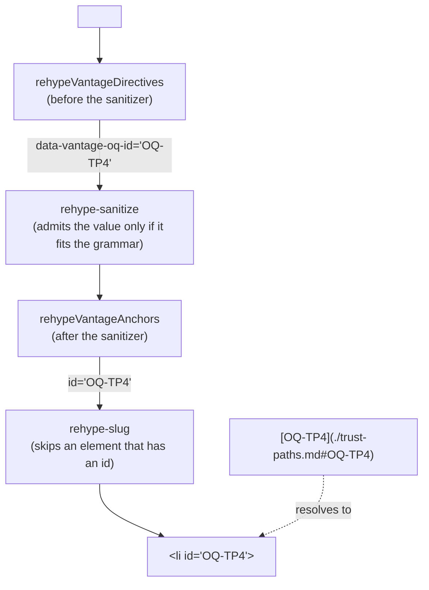

# Linked references — question anchors, and the rules that make a reference a link

**Status:** Verified 2026-10-01 against `fced33d`, the commit that added this
document. Inside the `covers:` perimeter it changed only comments, repointing them
here and correcting two that contradicted the code, so the code it describes is
`7fa8cbf`'s, unchanged. MEASURED: the five rules run over this repository's own
documents in every `just check-ci`, and the anchor's path through the sanitizer is
held by tests that render real Markdown. [Known gaps](#known-gaps) lists where the
code breaks the invariants below.

Documents in this tree are full of **references** — an Open Question id, a
section number, a filename — that read like pointers. This system makes each one
a link that can be followed and checked, in two halves:

- **The question anchor.** The `id` on a question directive becomes the `id` of
  the block the directive marks, verbatim, so a `#OQ-…` fragment lands on the
  question. The id has to be carried past the HTML sanitizer, which renames any
  `id` it sees, and that is the one part of this system that can be built wrong
  without anything failing.
- **The `ref/*` rules** in `vantage-check`. Each reports a reference written as
  text instead of a link. Where a link exists they check its target as far as
  the tree settles it: a § link against the numbered headings of the document it
  targets, a filename against the file the link opens, and a question id only
  for the presence of a fragment. Two declaration-side rules,
  `vantage/oq-id-format` and `vantage/oq-id-duplicate`, keep the ids worth
  pointing at.

| Component | Lives in |
| :--- | :--- |
| The id grammar | `vantage-md` (`VANTAGE_OQ_ID` in `vantageDirectives.ts`) |
| Stamping the id on the question's block | `vantage-md` (`rehypeVantageDirectives`, its `stampQuestion`) |
| Admitting it through the sanitizer | `vantage-md` (`sanitizeSchema` in `sanitize.ts`) |
| Promoting it to `id`, and the plugin order | `vantage-md` (`rehypeVantageAnchors`; `buildPipeline` in `pipeline.ts`) |
| The checker's view of a document's anchors and numbered headings | `vantage-check` `core/` (`indexDocument` in `slugs.ts`; `collectOqIds` and `oqAnchors` in `openQuestions.ts`) |
| `ref/unlinked-oq`, `ref/unlinked-section`, `ref/unlinked-file` | `vantage-check` (`checkReferences` in `rules/references.ts`) |
| `vantage/oq-id-format`, `vantage/oq-id-duplicate` | `vantage-check` (`checkOpenQuestionIds` in `rules/directives.ts`) |
| Rule ids, summaries and default severities | `vantage-check` (`RULES` in `rules/registry.ts`) |
| The convention as writers are told it | `vantage-md` (`styleGuide.ts`), printed by `vantage-check style-guide` |

**Reads with:** [`inline-markup.md`](inline-markup.md) (the directive grammar,
which blocks a directive can mark, and the sanitizer), the
[planning index](planning-index.md) (the question directives it counts, and how a
`#OQ-…` link routes a question to a roadmap), and
[the checker's reference](agent-cli.md) (whose link rules these extend).
For writers rather than maintainers: the
[`vantage-check` guide](../../userguide/guides/vantage-check.md#what-it-checks).

---

## What it is for, and the rules it keeps

`link/*` answers *"does this link work?"*. Nothing else answered *"should this
have been a link at all?"*, and that is where references rot: one written as
text cannot be dead, so no rule can ever notice that it went stale. An id
outlives the question it named, a section number outlives the renumbering, and a
filename outlives the move.

### Principles

Numbered so they can be cited.

**P1. A reference is a link or it is a lie.** An Open Question id in prose
asserts that a question by that name exists somewhere findable. If the reader cannot click it,
the assertion is unverifiable by the reader and unverified by anyone — which is
exactly how an id outlives the question it names.

**P2. Only report when the tree has settled it.** Inherited from the existing
link rules ([`links.ts`](../../packages/vantage-check/src/rules/links.ts)):
walk the AST, never the raw text, and stay silent on anything ambiguous. A
checker that invents one finding stops being run.

**P3. The rule may not require something the renderer cannot deliver.** Requiring
a reference to link to a question's anchor, while that anchor resolves to
nothing, would trade one broken reference for another. The anchor is what makes
the rule requirable at all.

### Invariants

What a maintainer breaks by accident.

- **Nothing writes `id` upstream of the sanitizer.** `rehype-sanitize`'s default
  schema renames every `id` it sees with the prefix `user-content-`, so an `id`
  set before it reaches the page renamed and every link to it dies, with no
  error anywhere ([The question anchor](#the-question-anchor)).
- **The question anchor is promoted before `rehype-slug` runs.** The slugger
  leaves an element that already has an `id` alone, and does not count it
  toward the `-1`, `-2` suffixes of repeated headings, which is what lets a
  question written as a heading keep its question id.
- **One declaration grammar.** `VANTAGE_OQ_ID` is the one definition of what a
  question id may be. The sanitizer's allowlist imports it, and so does the
  checker's `collectOqIds`, which feeds both `vantage/oq-id-format` and the
  anchors the checker accepts, and the planning index reads it too. The directive
  plugin does not consult it: it stamps any non-empty id and leaves refusing a
  malformed one to the sanitizer. Four patterns restate the shape rather than
  import it, and each must change with it: `OQ_REFERENCE` and `OQ_EXACT` in the
  `ref/*` rules, and an `OQ_TOKEN` in each of the planning scan and
  `FrontmatterDisplay`. `OQ_EXACT` is a word-for-word copy of it.
- **The checker's anchors are the page's anchors.** A fragment the checker
  accepts must be one the page carries, so the checker counts a question id as
  an anchor only when it is well formed — the sanitizer refuses the rest — and
  takes heading slugs from the slugger `rehype-slug` uses, `github-slugger`, run
  over the same text. The code breaks this in five cases, in each of which it
  counts an anchor the page does not carry: four question ids, and the slug of
  a heading that carries a question anchor. Each is a defect in the checker,
  not a ruling ([Known gaps](#known-gaps)).
- **One finding per defect.** `ref/*` requires the link. Whether its target
  exists is `link/missing-target`'s finding and whether its fragment resolves is
  `link/dead-section-anchor`'s. One overlap remains: a § link whose fragment
  resolves nowhere, to a target whose numbered headings carry that number, is
  reported by both, because `ref/unlinked-section` compares the fragment with
  the slug the number names rather than with the target's anchors.
- **A fenced block is never read.** It is how a writer puts a specimen on the
  page on purpose, so no rule here may reach into one.

---

## Terms

| Term | Means | Is not | Origin |
| :--- | :--- | :--- | :--- |
| **Reference** | Text that names something findable elsewhere: an Open Question id, a section number written as the section sign followed by digits, or a filename | any mention of a concept; and not necessarily a link — whether it is one is what the rules check | coined by the design this document replaced, 2026-09-04 |
| **Question directive** | An `oq` or `question` directive, which declares a question and its id | the prose convention around it | the [planning index's terms](planning-index.md#2-terms) |
| **Question anchor** | The `id` a question directive's id becomes on the block the directive marks | a heading slug, which is lowercased and derived from text | coined here |
| **Definition site** | Where an id is declared rather than referred to: the question's own bold title, or the id cell of a Decision Ledger row | the directive, an HTML comment that no `ref/*` rule reads | coined by the design this document replaced |
| **Decision Ledger** | The table where a design document records its settled questions, one row per ruling, its first column the question's id | the Open Questions list, where a question lives while it is being decided | the `design-doc` convention this repository's planning documents follow |
| **Compaction** | Moving a ruled question out of the Open Questions list and into the Decision Ledger, which deletes its directive and therefore its question anchor | answering it, which keeps the directive | the same convention |
| **Live** (question) | One still carrying its question directive, so its id is an anchor | *open*: a 🔒 or ✅ question is live too | the [planning index's terms](planning-index.md#2-terms), which define it |
| **Directive run** | Consecutive directives with nothing but other directives between them, which merge onto the one block after the last | a *check run*, one invocation of `vantage-check` | coined here, for the run [`inline-markup.md`](inline-markup.md#names-position-and-extent) describes |

---

## The question anchor



The directive plugin has to run before the sanitizer, because it reads HTML
comments and the sanitizer deletes them, and the sanitizer renames any `id` it
finds. So the id crosses it in three steps:

1. **Before the sanitizer**, `stampQuestion` puts the id in a data attribute on
   the block the directive marks, beside the attributes the question already
   carries. It stamps on any block a question directive can mark — a paragraph,
   heading, list item, block quote, code block or table
   ([which blocks](inline-markup.md#names-position-and-extent)) — so a question
   directive above a code block or a table gives that block an anchor, although
   it declares no question there and offers no one-click button.
2. **The sanitizer admits that attribute by pattern**, matching its value
   against `VANTAGE_OQ_ID`, the same treatment the collapse-group counters get.
   A document cannot use it to smuggle an arbitrary value into the page's `id`
   namespace through raw HTML.
3. **After the sanitizer**, `rehypeVantageAnchors` moves the value onto `id` and
   deletes the data attribute, so no second copy of the id is left in the markup
   for a later reader to use by mistake. It runs before `rehype-slug`, so where
   a heading is the question, the question id wins over the heading slug.

> [!WARNING]
> Do not stamp `id` directly in `rehypeVantageDirectives`. It is the obvious
> implementation, it renders a valid page and passes every other test, and the
> element arrives carrying the id behind the sanitizer's `user-content-` prefix:
> every link to that question in every document lands nowhere, and nothing
> errors. The renderer's anchor tests,
> [`oqAnchors.test.ts`](../../frontend/src/lib/oqAnchors.test.ts), assert that
> the prefixed id is absent. They run against `vantage-md`'s source through the
> frontend's alias, since the package has no test runner of its own.

**The id is stamped verbatim, case and all.** Heading slugs are lowercased by
`github-slugger`; question ids are tokens an author chose and writes verbatim in
prose, so a reference links to the id as written. HTML ids are case sensitive,
so the two namespaces cannot collide by accident.

**How each edge case renders, and what the checker makes of it:**

| The document has | The page gets | The checker |
| :--- | :--- | :--- |
| A question directive with no `id`, or an empty one | A question with no anchor | Nothing to report: legal |
| A malformed id | The plugin stamps it anyway — naming the mistake is the checker's job, and a renderer that dropped it would hide it — and the sanitizer refuses it, so the block has no anchor | `vantage/oq-id-format`; the id is not an anchor |
| The same id on two questions | Both blocks carry it and `#id` lands on the first. The renderer stays a per-node stamp with no memory of other blocks | `vantage/oq-id-duplicate` on the second |
| A question written as a heading | The heading's `id` is the question id. `rehype-slug` skips it, so it gets no slug and the slugs of later repeated headings are counted without it | Counts the question id, and also slugs the heading, so its slugs diverge from the page's (a [known gap](#known-gaps)) |
| A directive whose target cannot carry a question (a list, say, rather than a list item) | No stamp at all | `vantage/orphan` warns, and the id still counts as an anchor (a [known gap](#known-gaps)) |
| A question on a raw-HTML element that has its own `id` | The element keeps its own `id`, already renamed by the sanitizer, and the question gets no anchor of its own | Counts the question id as an anchor (a [known gap](#known-gaps)) |
| A question on a `$$` display-math block | The id is promoted onto the block, and then `rehype-katex` replaces the block with an element of its own. The math-stamp pass carries the source line and the `data-vantage-*` stamps across to it, and deliberately not `id`: no anchor | `vantage/orphan` warns, and the id still counts as an anchor (a [known gap](#known-gaps)) |
| Two directives in one directive run declaring different ids | One question, whose anchor is the id written last in the run | `vantage/duplicate-key` warns, and both ids count as anchors (a [known gap](#known-gaps)) |

A question directive's id reaches the anchor the same way whichever name
declares it: `oq` on an open question, `question` on a 🔒 or ✅ one. Directives
that merge onto one block declare one question with one anchor, its keys merged
across the run with the last value of each winning.

In the viewer, `anchorTarget`
([`anchorScroll.ts`](../../frontend/src/lib/anchorScroll.ts)) resolves a
fragment by trying the id as written and then with the sanitizer's prefix, so a
question anchor, which is never renamed, is found on the first try.

### What the checker counts as an anchor

The checker has the parsed Markdown and no rendered page, so it reads question
ids from the directive comments themselves (`collectOqIds`), through the same
directive parser the renderer uses. Within one directive it resolves a repeated
`id=` as the renderer does, on its last value; across a directive run it does
not, and counts each directive's id ([Known gaps](#known-gaps)).
`indexDocument` then builds one set of the fragments a link may target — heading
slugs, ids written in raw HTML (an `id` or a `name` attribute), and the
well-formed question ids. The heading slugs and the section numbers come from
one slugger pass, so a section number resolved against the set and a link
checked against it cannot disagree.

Ids written in raw HTML are counted although the sanitizer renames them on the
page. Counting one can only make the checker miss a dead fragment; not counting
it would invent a finding for a link that works, through the viewer's prefix
fallback. Given the choice, the checker errs quiet (P2).

That choice covers ids written in raw HTML and nothing else. Every other anchor
the checker counts and the page does not carry is a defect, listed under
[Known gaps](#known-gaps): those anchors are knowable from the Markdown,
and P2's quiet is for what the tree has not settled.

---

## The id grammar

```text
OQ-<prefix?><digits>      prefix: [A-Z][A-Z0-9]{0,5}

OQ-9      valid
OQ-TP6    valid
OQ-A03    valid
OQ-foo    no
OQ-tp6    no
OQ-       no
OQ6       not a reference at all
```

The last row matters: `OQ` and digits with no hyphen is not the convention, and
inferring it would fire on ordinary prose.

The optional prefix is what makes an id unique once documents reference each
other's questions: two documents can each hold a fourth question, and a bare
number cannot say which one a cross-document reference means. **A document that
references another document's questions should use prefixed ids in both.** That
is guidance, not a rule: nothing detects that two files' bare ids have started
colliding, and a rule demanding prefixes everywhere would fire on every
single-document sketch.

---

## The `ref/*` rules

### What they read

All three walk the parsed Markdown tree and read two kinds of node: plain text
and inline code. Each rule walks the tree on its own — `ref/unlinked-oq` twice,
once to find the Decision Ledgers' id cells and once for the text — and none
re-parses anything: the cost is linear in the document, with no per-directive
re-parse of the kind `vantage/block-split` makes.

| Read | Never read |
| :--- | :--- |
| Text in paragraphs, headings, list items, block quotes and table cells, at any depth | Fenced code blocks: a specimen, not a claim |
| Inline code | HTML comments, directives included |
| Text between inline HTML tags | A block of raw HTML, which the tree holds as one opaque node |
| | Frontmatter |

A reference **inside a link, at any depth** — inside emphasis inside a link, for
instance — counts as linked: the walk tracks the enclosing link, not the
immediate parent. An inline link, `[text](url)`, counts, and so does an
autolink, `<https://…>`, whose text is its URL. A reference-style link,
`[text][label]`, is not resolved through its definition, so a reference written
that way is reported as bare, although the `link/*` rules do read definitions
([Known gaps](#known-gaps)).

A heading's own number is not a reference: the section sign is what marks one
that points elsewhere, and a numbered heading carries none.

### `ref/unlinked-oq`

Matches the id grammar's shape anywhere in a text or inline-code node.

```markdown
1. 💬 **OQ-4: Does a fixed PR go to the back of the queue?**   <- a definition site

OQ-4 is still open.                       <- a finding: not a link
See [OQ-4](other.md).                     <- a finding: no fragment
See [OQ-4](#OQ-4).                        <- live, in this document
See [OQ-4](other.md#OQ-4).                <- live, in another document
See [OQ-4](other.md#decision-ledger).     <- compacted
```

A match outside a link is a finding, unless it is a definition site:

- **A question's own title** — the id in bold, followed at once by a colon.
  Recognized by that shape, not by whether the document declares
  the id. A document that declares a question may also refer to it further down,
  and that reference needs a link like any other; and a question may carry no
  directive at all, so "the ids this document declares" does not find every
  title. The shape is read narrowly: the id and the colon must be plain text
  inside the bold, so a title whose id is in inline code (``**`OQ-N`: …**``,
  where `OQ-N` stands for any id) is not recognized, and neither is a question
  written as a heading (`## OQ-N: …`), which has no bold. The id in either is
  reported; link it, or leave it out of the heading.
- **The id cell of a Decision Ledger row** — a table whose header's first cell
  is `ID` (in any letter case), and in it a first cell that is exactly an id.
  Both halves matter: the header alone would also excuse the rest of the row,
  whose section references are real references and need links.

A match inside a link must carry a **fragment**. A link to a document with no
fragment lands at its top and leaves the reader to hunt, so it is a finding.
The rule does not require the fragment to be the id, because a question has two
phases and only the first has an anchor:

- **Live**, the reference names the question anchor itself, in this
  document or another.
- **Compacted**, the directive is gone and nothing declares that id any more.
  The reference links to the Decision Ledger instead, `#decision-ledger`.

Whether the fragment resolves is left to `link/dead-section-anchor`. That a
fragment names the same question as the link's text is not checked: a link
whose text is one id and whose fragment is another live id passes.

> [!WARNING]
> Do not give a compacted question a per-row anchor to keep a fragment alive —
> not with a directive, and not with a hand-written `<a id=…>` in the ledger
> cell. Compaction deletes the directive on purpose; the row is the record, and
> the ledger is the honest target. A hand-written id is also renamed by the
> sanitizer, reachable only through the viewer's prefix fallback, and tied to
> its row by nothing any rule checks.

### `ref/unlinked-section`

Matches the section sign followed by digits and dot-separated digits. The
section sign alone, or one followed by a space, is not matched: that form is
rare enough that matching it would cost more in false positives than it catches.

A match outside a link is a finding. Inside one, the rule checks that the link
goes to the section the number names, **in the document the link targets**:

1. The target is the link's path resolved against this document's directory,
   percent-decoding first, or this document itself when the link is a bare
   fragment. A link with no fragment, or to a file that is not Markdown, is
   accepted without further checks. A malformed percent escape in the path
   makes the rule throw, which fails the check run rather than reporting the
   link ([Known gaps](#known-gaps)).
2. The target's **numbered headings** are those whose text opens with a dotted
   number followed by a period, a closing parenthesis or whitespace. When two
   headings carry the same number, the first claims it.
3. When the number names a heading in the target and the link's fragment is
   anything but that heading's slug — another heading, a question anchor, or a
   fragment that resolves nowhere — that is a finding.

When the target has **no numbered headings at all**, or none carrying that
number, the rule requires the link and says nothing about where it points: an
unnumbered document has nothing to resolve against, and guessing would invent
findings on every document that never adopted the convention.

Headings come from the checker's per-file index, so a document with many
section references indexes each target once.

> [!WARNING]
> **A section number beside a filename cannot be resolved mechanically.** A
> reference naming a document and then a number means *that document's*
> section, but the rule sees a link and a number with no way to know the number
> belongs to the neighbor. A reference that names a neighboring file and then
> links the number to *this* file's section of the same number passes every
> check and goes to the wrong place. The defense is a convention, not a rule:
> put the document inside the link, so the number and its file travel together.
>
> ```markdown
> [`other.md` §4](other.md#4-the-shape)     <- one link, one target
> [`other.md`](other.md) §4                 <- ambiguous: whose §4?
> ```

### `ref/unlinked-file`

Fires on a **path-shaped** token that resolves to an existing file **relative to
the document's own directory**, outside a link or linked to a different file.

- **Tokens.** Inline code is one token, trimmed. Prose is split on whitespace,
  and each piece loses the brackets, quotes and sentence punctuation around it.
- **Path-shaped** means only word characters, dots, slashes and hyphens, ending
  in a dot and a short extension. A space disqualifies a token, which is what
  keeps inline-code commands silent with no allowlist of commands. A version
  number has the shape too; it is dropped because no file by that name exists.
- **Skipped:** a token starting with a slash, before anything is looked up. An
  absolute path escapes doc-relative resolution entirely — it would be answered
  against the checker's own filesystem — and naming system files is a runbook's
  whole job. The link form of the same mistake is `link/leading-slash`'s.
- **Silent:** a token that resolves to nothing beside the document (a file in
  another repository, a configuration key, a name in passing — the checker
  cannot tell which), to a directory, or to the document itself.

```text
agent-cli.md               qualifies, if it exists beside the document
../design/agent-cli.md     qualifies, if it exists
scripts/build-wheel.py     qualifies, if it exists

just build                 no — whitespace
/etc/mkinitcpio.conf       no — absolute
```

A linked token must link to **the file it names**: the link's path, its
fragment stripped and percent-decoded, is resolved against the document's
directory and compared with the token's resolution. A link anywhere else —
another file, or an external URL — is a finding, because a reference that names
one file and opens another is worse than no link. A query string is not
stripped, so a correct link that carries one (`f.md?plain=1`) is reported as a
different file, although the `link/*` rules accept it
([Known gaps](#known-gaps)).

Resolution is against the document's directory only, never the repository root
([Why it's this way](#why-its-this-way)).

---

## The declaration-side rules

Two rules in the `vantage/*` family, because their subject is Vantage's own
markup. Both read every question directive, `oq` and `question` alike, and both
are silent without a checker: the page renders correctly either way.

- **`vantage/oq-id-format`** reports a question directive whose id falls outside
  the grammar. The sanitizer refuses it, so the block has no anchor and every
  `#` link to it goes nowhere. A directive with no id, or an empty one, is not
  reported.
- **`vantage/oq-id-duplicate`** reports the second and later question in one
  document carrying an id an earlier one already has, across both directive
  names. The anchor lands on the first, so every reference to the second
  silently reaches the wrong question — the one failure a reader cannot detect
  by clicking, because the link works. Directives that merge onto one block are
  one question, so an id repeated among them is not a duplicate;
  `vantage/duplicate-key` reports the repeated key instead.

---

## Configuration

All five rules are on by default at error, and each can be set per repository
under `[check.rules]` in `.vantage.toml`, like any other rule; `"ref/*"` sets
the whole family. `ref` is the checker's own family, not an open one: an id in
it this checker does not have is an unknown rule — a typo, or a rule from a
newer checker — reported on stderr and ignored, exactly as one under `link/*`
is. Only `markdown/*`, whose names belong to remark-lint, accepts ids the
checker has never heard of.

The style guide (`styleGuide.ts`) states the grammar, the anchor and the rule
that a reference is a link, and `vantage-check style-guide` prints it.

---

## Non-goals — what this does not license

- **No auto-fixing.** The checker has no `--fix`, and if it grows one it is for
  [mechanical, unambiguous rewrites](agent-cli.md#10-non-goals). Choosing
  which heading a section number meant is not mechanical, and a fix that guessed
  wrong would rewrite a correct document into a plausible lie.
- **No registry of question ids.** The `ref/*` rules consult no list of every
  question in the tree — the planning index holds one, and is not their input.
  Each reference is validated through the link it carries, which is a per-file
  question with a per-file answer.
- **No rule requiring prefixed ids** ([The id grammar](#the-id-grammar)).
- **No prose or structure opinions.** Unchanged from
  [the checker's non-goals](agent-cli.md#10-non-goals):
  the checker does not judge whether a term is defined or whether questions have
  been compacted.
- **No new link syntax.** References use ordinary Markdown links: no `[[wiki]]`
  forms, no at-sign shorthand.

---

## Known gaps

Behavior the code has that breaks an invariant above, or a neighboring rule's
contract. Each is a defect in the code, not a ruling, and fixing it is
[`as-built-defects.md`](../design/as-built-defects.md)'s work; when one is
fixed, its entry goes and the section that describes the behavior changes with
it.

- **The checker accepts question anchors the page does not carry.** It counts
  every well-formed id a question directive declares, wherever the directive
  lands, so `link/dead-section-anchor` passes a `#OQ-…` fragment that navigates
  nowhere in four cases: the directive's target cannot carry a question (a list
  rather than a list item); the target is a raw-HTML element with its own `id`;
  the target is a `$$` display-math block; and a directive run declares two
  different ids, of which the page keeps only the last.
- **The checker slugs a heading the page does not.** The checker's index slugs
  every heading, while `rehype-slug` skips a heading that already carries a
  question anchor and does not count it. So a question written as a heading
  leaves a slug in the checker's set that the page lacks, every later repeated
  heading's `-N` suffix is one off from the page's, and when the heading is
  numbered `ref/unlinked-section` resolves its number to the missing slug: it
  reports a section link to the question anchor, which works, and passes one to
  the heading's slug, which is dead.
- **A malformed percent escape fails the check run.** `ref/unlinked-section`
  and `ref/unlinked-file` percent-decode a link's path without a guard, so a
  path such as `bad%zz.md` makes the rule throw, where the `link/*` rules report
  the same link as `link/missing-target`. A one-thread check run ends with an
  internal error and prints no report; in a parallel one, the file's whole shard
  becomes a `run/shard` failure and the other shards are reported. Both exit
  `3` ([`check-performance.md` §5.6](check-performance.md#56-a-shard-that-never-answers)).
- **A query string makes a correct filename link "a different file".**
  `ref/unlinked-file` strips a link's fragment but not its query; the `link/*`
  rules strip both.
- **A reference-style link counts as bare.** The `ref/*` rules recognize only
  inline links and autolinks, so `[OQ-N][q]`, `[§N][s]` and ``[`f.md`][f]`` are
  each reported as a bare reference, although the `link/*` rules resolve the
  same definitions.
- **A dead § fragment is reported twice**, by `link/dead-section-anchor` and by
  `ref/unlinked-section` ([Invariants](#invariants)).

---

## Current values

Verified at `fced33d`. The prose above explains what each of these is for; this
table is the only place most of the exact values are stated.

| Value | Setting | Defined in |
| :--- | :--- | :--- |
| Question id grammar | `^OQ-(?:[A-Z][A-Z0-9]{0,5})?[0-9]+$` | `VANTAGE_OQ_ID` in `packages/vantage-md/src/vantageDirectives.ts` |
| The id's data attribute | `data-vantage-oq-id` (hast `dataVantageOqId`) | `OQ_ID_PROPERTY` in `rehypeVantageDirectives.ts` and `rehypeVantageAnchors.ts`; admitted in `sanitizeSchema` |
| The sanitizer's prefix for a hand-written `id` | `user-content-` | `rehype-sanitize`'s default schema |
| Blocks a question anchor can land on | `p`, `h1`–`h6`, `li`, `blockquote`, `pre`, `table` | `VANTAGE_ANCHOR_TARGETS` in `vantageDirectives.ts` |
| Id search in prose (`ref/unlinked-oq`) | `OQ-(?:[A-Z][A-Z0-9]{0,5})?[0-9]+`, unanchored | `OQ_REFERENCE` in `rules/references.ts` |
| Section reference | `§[0-9]+(?:\.[0-9]+)*` | `SECTION_REFERENCE` in `rules/references.ts` |
| A heading's number | `^([0-9]+(?:\.[0-9]+)*)[.)\s]` over the trimmed heading text | `indexDocument` in `core/slugs.ts` |
| Path-shaped token | `^[\w./-]+\.[A-Za-z0-9]{1,6}$` | `PATH_SHAPED` in `rules/references.ts` |
| Decision Ledger header | first header cell `ID`, any letter case | `ledgerIdCells` in `rules/references.ts` |
| Default severity of the five rules | `error` | `RULES` in `packages/vantage-check/src/rules/registry.ts` |

---

## Why it's this way

Rulings a maintainer reading only the text above might undo on purpose. The ids
are the ones the replaced design used. They carry no prefix, and
[`agent-cli.md`](agent-cli.md#why-its-this-way) gives the fourth to a different
ruling of its own, so cite them with this document's path.

| ID | Ruling | Date |
| :--- | :--- | :--- |
| OQ-1 | `ref/unlinked-section` resolves a section number to the target's heading that opens with it and reports a link with any other fragment; it is silent about where a link points when the target has no numbered headings ([`ref/unlinked-section`](#refunlinked-section)) | 2026-09-04 |
| OQ-2 | No exemption list for generic manifest names: a `package.json` that resolves beside the document is a finding and gets linked. A list of "generic" names would be a second vocabulary maintained against nothing in particular, and in a repository that serves its own files a link to a manifest is useful. Revisit only if it hurts in a repository carrying more manifests than this one ([`ref/unlinked-file`](#refunlinked-file)) | 2026-09-04 |
| OQ-3 | `ref/unlinked-file` compares the resolved link target with the resolved token, so a filename linked to a different file is a finding, not a pass ([`ref/unlinked-file`](#refunlinked-file)) | 2026-09-04 |
| OQ-4 | A compacted question has no question anchor; a reference to it links to the Decision Ledger, and the rule requires only that the link carry a fragment. Nothing reintroduces a per-row anchor ([`ref/unlinked-oq`](#refunlinked-oq)) | 2026-09-04 |
| — | `ref/unlinked-file` resolves against the document's directory, never the repository root. Measured on this repository when the rule was built, root resolution turned every passing mention of a manifest in a deeply nested document into a demand to link one specific manifest out of the four in the workspace | 2026-09-04 |
| — | A token starting with a slash is skipped before it is looked up: it was answered against the checker's filesystem, told a runbook its system files existed beside it, and offered a link that resolved nowhere ([`ref/unlinked-file`](#refunlinked-file)) | 2026-09-11 |
| — | A question's title is recognized by its shape, a bold id and a colon, not by the ids the document declares. Keying off declared ids excused every mention of a locally declared id, including the references the rule exists to catch ([`ref/unlinked-oq`](#refunlinked-oq)) | 2026-09-04 |
| — | The renderer stamps a malformed id rather than dropping it, and leaves refusing it to the sanitizer: dropping it would hide the mistake that naming is `vantage/oq-id-format`'s job ([The question anchor](#the-question-anchor)) | 2026-09-04 |
