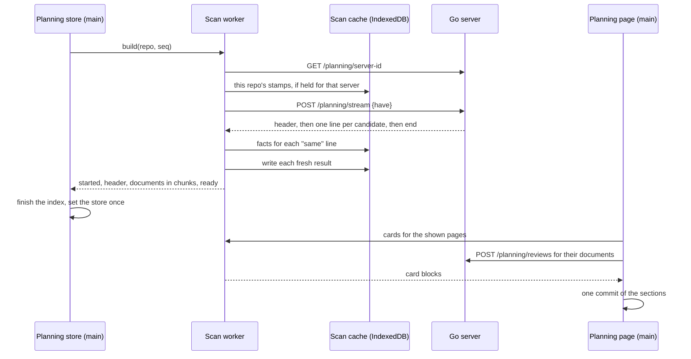

# The planning index — planning facts written once, and shown wherever they are linked

**Status:** Verified 2026-09-30 against `0a872d9`, the commit that added this
document. Inside the `covers:` perimeter it changed only comments and the tests that
read these documents, repointing them here, so the code it describes is `9507cac`'s,
unchanged. The Post-pass row in [§2](#2-terms) and the post-pass paragraph in
[§13.3](#133-the-planning-rules), which said the post-pass runs after every file,
were corrected on 2026-10-01 and re-verified against `7fa8cbf`.
**MEASURED at scale on 2026-10-01**, against `46c4091`'s code: every scale target
in [§18](#18-scale-targets-and-what-has-been-measured) has been run against the
build, or is held by a test. The scale fixture meets every target but D6 as the
harness counts it and D3's cold slope, which the runs cannot resolve, and this
repository misses D2, D4's cards and D9. Each of those waits on a ruling or a run
in [its own piece of work](../design/planning-index-measurement.md).
The note in [§12.3](#123-the-hold) and the record of what has been run were
rewritten from those runs. Amended 2026-10-01, in the commit after `936e24b`, and
read from that commit's code: the Unit row and the coined terms *answered by a
comment* and *counted* in [§2](#2-terms) and
[§6.7](#67-answering-and-copy-answers), [§3.3](#33-questions),
[§6.2](#62-sections-top-to-bottom), [§6.6](#66-question-cards),
[§6.7](#67-answering-and-copy-answers),
[§6.8](#68-several-roadmaps-on-the-page), the need-you row of
[§12.2](#122-every-late-datum-and-where-its-space-comes-from), and the question
rows of [Current values](#current-values). Nothing else was re-verified.

The **planning index** is Vantage's model of a repository's planning documents:
their frontmatter, their open questions and the links between them. It is
rebuilt from the files on every page load, and every surface that shows planning
state is a view of it: a badge after each link to a planning document or
question, a planning page that lists what needs a ruling, a *Referenced by* line
on each planning document, a badge in the file tree, and `vantage-check index`
for agents. A roadmap holds only the order and the reason for it; everything else
it would have copied is shown beside its links.

The index is assembled on the main thread from facts only. The Markdown is
parsed in a dedicated Web Worker, fed by a stream from the Go server that sends a
file's text only when the browser does not already hold a scan of that exact
content, and each file's scan result is kept in IndexedDB under its content hash.
Vantage never writes into a document.

| Component | Lives in |
| :--- | :--- |
| The scan, the index model, badges, routing and sections, the section guide and agent requests, card blocks, the `[planning]` resolution and the pattern matcher | `packages/vantage-md/src/planning/` (`scanPlanningDocument`, `PlanningIndex`, `derivePlanningSections`, `PLANNING_SECTION_GUIDE`, `planningAgentRequest`, `badgeFor`, `PlanningConfig`, `compileIgnorePatterns`) |
| Candidates, the stream, the single-path mode, reads and the content hash | `internal/planning` (`Matcher`, `Stream`, `Lookup`) |
| The four HTTP endpoints | `internal/api` (`PlanningStream`, `PlanningSources`, `PlanningReviews`, `PlanningServerID`) |
| `[planning]` as the server reads it, and the roadmap test | `internal/repoconfig` (`PlanningSettings`, `Planning.IsRoadmap`) |
| The scan worker, its helpers, the scanner client and the scan cache | `frontend/src/planningScan/` (`scannerCore`, `ScannerClient`, `ScanCache`, `ScanStore`, `planningLimits`) |
| The index as the viewer holds it | `frontend/src/stores/usePlanningStore.ts` (`usePlanningStore`, `PlanningLoad`) |
| The planning page | `frontend/src/pages/PlanningPage.tsx`, `frontend/src/lib/planningPages.ts`, `frontend/src/hooks/usePlanningPageInputs.ts` |
| Link badges, Referenced by, the tree badge | `frontend/src/hooks/usePlanningLinkBadges.ts`, `frontend/src/components/ReferencedBy.tsx`, `frontend/src/components/PlanningTreeBadge.tsx` |
| The CLI and the planning rules | `packages/vantage-check/src/commands/index.ts`, `packages/vantage-check/src/rules/planning.ts` |

**Reads with:** [`repo-config.md`](repo-config.md) (the `.vantage.toml`
file both readers share), [`inline-markup.md`](inline-markup.md) (the `question`
directive this index counts, with `oq`, the deprecated name it replaces, and the
one-click answer it reuses),
[`technical_spec.md`](../design/technical_spec.md) (where the planning routes and
the scan worker sit in the whole system), and
[the brainstorm](../brainstorm/planning-index.md) (the ideas this was chosen from,
and the ones still parked). For readers rather than maintainers:
[Planning Documents](../../userguide/guides/planning.md).

---

## 1. What it is for, and the rules it keeps

A roadmap goes stale because it copies each design document's state. If every
planning fact has exactly one home and every other mention of it is a plain
link, Vantage can show the current value beside the link, and the roadmap
shrinks to the one thing only a person can write: the order.

### 1.1 Principles

Numbered because code comments and sibling documents cite them.

- **P1. One home per fact.** A *derived* fact (computable from the tree) is
  computed wherever it is shown. A *judged* fact (someone has to decide it) is
  written once, and everything else links to it. Both terms were coined in
  [the brainstorm](../brainstorm/planning-index.md).
- **P2. Decorate and index; never generate.** Vantage may add a badge next to
  what an author wrote, and may build pages that are not documents. It never
  writes into a document, never transcludes one document into another, and has
  no template language.
- **P3. Only markup with a fixed meaning.** That means frontmatter keys, the
  question directives `question` and `oq`, and Markdown links. Prose conventions, such as the `**Status:**`
  line, a roadmap's tables, or a Decision Ledger's columns, are never parsed.
- **P4. One parser.** The planning scan lives in `vantage-md` and is shared by
  the viewer and `vantage-check`. It is internal to that package: both consume
  it from source, as they already consume the rest of the package, and it is not
  exported from the published entry point. The one public addition is an
  optional `linkIds` prop on `FrontmatterDisplay`, the component that draws a
  document's header, so that `next` can link its ids
  ([§3.4](#34-the-header-of-record-stage-next-depends-on)). The Go server serves
  files and reads TOML; it never parses Markdown ([`AGENTS.md`](../../AGENTS.md)).
- **P5. A roadmap owns priority, and nothing another document owns.** Its order
  and its one-clause reasons are the only judged facts it holds about a planning
  document. A repository may keep several roadmaps ([§4](#4-roadmaps-and-routing));
  each owns the order of what it links, and none is merged into another's. Prose
  kept beneath an entry holds only facts with no other home, such as an upstream
  blocker's unblock condition.
- **P6. Conventions plug in through `.vantage.toml`.** Nothing specific to one
  set of planning conventions is hard-coded. A repository that declares no
  stages still gets every surface that needs only directives and links.
- **P7. Agents see what the human sees.** Each surface has a `vantage-check`
  equivalent that is computed from the same scan.

> [!WARNING]
> **Do not answer staleness by generating a table into the roadmap**, or by a
> directive that renders a live table inside a document. Either writes into a
> document (P2), the second is a template language by another name and invisible
> on GitHub, and a badge beside each link already shows the same facts.

### 1.2 Principles at scale

The rules that keep `g p` and the index cheap on a repository of a thousand
planning documents, numbered for the same reason.

- **S1. A paint waits only on work bounded by what it shows.** No work on the way
  to a paint grows with the number of documents, apart from deriving the
  sections, which is a single cheap pass over facts.
- **S2. The main thread never holds the corpus's text.** It holds facts about
  planning documents and the Markdown of the cards on screen, and nothing else
  from the files.
- **S3. Only what changed crosses the wire.** A file whose content hash the
  browser already knows is answered with its hash, not its text.
- **S4. One parser, in TypeScript** (P4). The scan is vantage-md's, run inside a
  worker. The Go server lists, reads, hashes and streams bytes. It never parses
  Markdown.
- **S5. Late data never moves painted content** (the user's rule, 2026-09-29).
  What arrives after a paint goes into space reserved for it, room left over, or
  the next render the reader causes ([§12](#12-late-data-never-moves-painted-content)).
- **S6. The file name wins** (the user's ruling, 2026-09-28). No late item
  narrows a file name, in the header, the tree or a card.

### 1.3 Invariants

What a maintainer breaks by accident. Each is held by a test or by the shape of
the code, and each is the first thing to check when changing the area it names.

- **No partial index is ever shown.** A build either reaches the stream's `end`
  line and replaces the index in one step, or fails; a repository past
  `max-candidates` gets a visible refusal, never a smaller index. A partial index
  would quietly under-report questions.
- **The index and the contents column agree on every question and its state**,
  with one named exception, a directive inside a raw HTML block
  ([§3.3](#33-questions)). The index reads from source and the column from the
  rendered page, so `frontend/src/lib/planningAgreement.test.tsx` renders every
  document in `docs/` through the app's viewer and holds the two equal.
- **The server and the planning module apply one roadmap test and one candidate
  matcher.** `internal/repoconfig/testdata/` holds the shared fixtures
  (`planning-patterns.json`, `planning-config.json`, `planning-roadmaps.json`,
  `planning-candidates.json`, `version-skew-config.json`) that both readers' suites
  run, and
  `internal/planning/testdata/stream-lines.ndjson` holds the stream's line shapes
  to one spelling on both ends.
- **A badge is never part of the text a review anchor hashes**
  ([§5.3](#53-how-a-badge-behaves)), so a count that changes cannot move a comment.
- **The planning store owns ordering; the scan worker owns the scan cache.** The
  worker answers every request and decides nothing about which answer wins
  ([§8.3](#83-staying-fresh-change-pushes-reconnects-and-ordering)); only the
  worker writes the cache ([§11](#11-the-scan-cache)), or the inline client when
  it runs in the worker's place ([§10.6](#106-the-inline-client)), and never the
  planning store or the page.
- **No roadmap is ever answered `same` or kept in the scan cache**, so whether a
  file is a roadmap is never part of a cache key ([§9.1](#91-the-stream)).
- **Nothing the page shows is stored by the page.** No snooze, no assignment, no
  read state; comments live in the review store Vantage already has. The one
  thing remembered is the roadmap a reader picked ([§6.8](#68-several-roadmaps-on-the-page)).
- **The page and `vantage-check` derive from the same functions** (P7), so the
  page, `index` and the planning rules cannot disagree.

---

## 2. Terms

Every term below is Vantage's own unless it links elsewhere. Most were coined by
the two designs this document replaced: the planning-index design (2026-09-28
to 2026-09-30) and its amendment for large repositories (2026-09-29). Their text
is in git; this is now where the terms are defined.

| Term | Means | Is not | Origin |
| :--- | :--- | :--- | :--- |
| **Planning index** | The model of a repository's planning documents that every planning surface reads ([§3](#3-the-planning-index-what-it-reads-and-holds)) | a stored database; it is assembled anew on each page load | the brainstorm, 2026-09-25 |
| **Candidate** | A Markdown file the server lists that `[planning]` includes ([§3.1](#31-candidates-and-planning-documents)) | every file in the tree | the planning-index design |
| **Planning document** | A candidate with a `status` or `stage` key, or a question directive, or that is a roadmap | any Markdown file | the planning-index design |
| **Question directive** | A `question` directive, on a question in any state, or an `oq`, the deprecated name it replaces ([§3.3](#33-questions)) | the prose convention around it | [`checker-version-skew.md` OQ-VS4](../design/checker-version-skew.md#decision-ledger), 2026-09-30, and the user's review of it, 2026-10-01 |
| **Question** | A question directive on a block that could host the one-click button, identified by document path and id ([§3.3](#33-questions)) | a prose question with no directive | the planning-index design |
| **Live** (question) | Every question the index holds, whatever its state; compaction, which deletes the directive, is what ends it | *open*, which is one state of a live question | the planning-index design |
| **Stage role** | What a stage word means to the planning page: `open`, `ready`, `built` or `done` ([§3.4](#34-the-header-of-record-stage-next-depends-on)) | the stage word itself, which is the repository's own | the planning-index design |
| **Roadmap** | A planning document whose links set an order ([§4.1](#41-which-files-are-roadmaps)) | the only roadmap: a repository may have several | the planning-index design |
| **Roadmap test** | The test on a path alone that says whether it is a roadmap: listed in `roadmap`, or, with none listed, named `roadmap.md` | candidacy, which is decided separately | the implementation plan for several roadmaps |
| **Roadmap order** | Fewer path segments first, then path order ([§4.2](#42-roadmap-order-state-and-the-default)) | the order a configured list was written in | the planning-index design |
| **Roadmap state** | Whether a roadmap routes, and why not when it does not: `routes`, `done`, `skipped`, `unreadable`, `missing` | a document's status | the planning-index design |
| **Default roadmap** | The first roadmap in roadmap order that routes | the first entry of a configured list | the planning-index design |
| **Routed** (question) | One some roadmap links, directly or through its document ([§4.3](#43-routing)) | *on the page*: an unrouted question is listed too | the planning-index design |
| **Chosen roadmap** | The one roadmap *Needs you* follows: the reader's pick, `--roadmap`, or the default | a merge of every roadmap | the planning-index design |
| **Section guide** | Each section's title, the one line that explains it, and its actor, kept once in `packages/vantage-md/src/planning/guide.ts` ([§6.2](#62-sections-top-to-bottom)) | the section ids, which never change | the section retitling, 2026-10-01 |
| **Actor** (of a section) | Who acts next on its entries: `you`, the reader; `agent`, an agent given its request; or `nobody` | who wrote the documents | the section retitling, 2026-10-01 |
| **Agent section** | A section whose actor is `agent`: *Not on a roadmap*, *Ready to build*, *Ready to graduate* and *Stage conflict* | the only sections an agent reads: `index` prints every one | the section retitling, 2026-10-01 |
| **Agent request** | The self-contained instruction, for every entry of one or more agent sections, that the page copies and `vantage-check index --request` prints ([§6.2](#62-sections-top-to-bottom)) | a stored prompt: it is generated from the index each time it is asked for | the section retitling, 2026-10-01 |
| **Roadmap line** | The line of the planning page's frame holding the roadmap picker, shown only when two or more roadmaps route ([§6.8](#68-several-roadmaps-on-the-page)) | the roadmap notice, which says why none routes | the planning-index design |
| **App shell** | The frame the viewer draws around a document — sidebar, pickers, dialogs, shortcuts — which the planning page is drawn in too ([§6.1](#61-the-url-the-route-and-the-app-shell)) | the header alone | the planning-index design |
| **Planning outline** | What the contents column shows on the planning page, in place of a document's table of contents ([§6.9](#69-the-planning-outline)) | the section bar, though it is drawn from the same index | the planning-index design |
| **Project root** | The nearest ancestor of a directory holding `.git` or `.vantage.toml` ([§13.1](#131-the-project-root)) | the directory a `--config` file sits in | the planning-index design |
| **Unit** (of a question) | The blocks a question is: its list item; or, outside a list, its host block and the blocks after it up to the next heading, rule or question ([§3.3](#33-questions)) | the card block, which can hold several units | the first implementation plan; outside a list, amended 2026-10-01 |
| **Single-path mode** | The planning endpoint answering for one `?path=` ([§9.2](#92-one-path-the-single-path-mode)) | the content endpoint, which it deliberately is not | the first implementation plan |
| **Post-pass** | The planning rules' one run in `check`'s main thread, apart from the per-file work, whose findings join the report after it ([§13.3](#133-the-planning-rules)) | a per-file rule | the first implementation plan |
| **Narrow index** | The index `check` builds from the roadmaps plus the run's own files, with no count of the tree | the full index `index` builds | the first implementation plan |
| **Content hash** | The first 128 bits of [SHA-256](https://csrc.nist.gov/pubs/fips/180-4/upd1/final) over a file's bytes, as 32 lowercase hex digits | a modification time | the at-scale amendment |
| **The stream** | `POST …/planning/stream`'s answer, [NDJSON](https://github.com/ndjson/ndjson-spec): one JSON object per line ([§9.1](#91-the-stream)) | the old batch, which was one JSON object | the at-scale amendment |
| **Scan worker** | The one dedicated [Web Worker](https://developer.mozilla.org/en-US/docs/Web/API/Web_Workers_API) per tab that runs vantage-md's planning scan ([§10](#10-the-scan-worker)) | a Service Worker, or anything on the server | the at-scale amendment |
| **Helper** | An extra worker the scan worker uses during a cold build, then discards ([§10.5](#105-helpers-for-a-cold-build)) | a second scan worker; a helper writes nothing | the at-scale amendment |
| **Scanner client** | The main-thread object the planning store and page call to build, refresh and fetch cards | the store, which still owns ordering | the at-scale amendment |
| **Inline client** | The scanner client that runs the same core on the main thread ([§10.6](#106-the-inline-client)) | a fallback for a worker that crashed | the at-scale amendment |
| **Scan cache** | The browser's [IndexedDB](https://developer.mozilla.org/en-US/docs/Web/API/IndexedDB_API) database of scan results, one per candidate, keyed by content hash ([§11](#11-the-scan-cache)) | an HTTP cache, or a store of the index | the at-scale amendment |
| **Scan store** | The storage interface the scan cache is written against, with an IndexedDB implementation and an in-memory test double | the cache's policy, which is the cache's own | the at-scale implementation plan |
| **Scanner id** | The version of the code that produced a scan result ([§11.2](#112-the-scanner-id-and-the-owner)) | the app's release version | the at-scale amendment |
| **Server id** | An opaque name for the server answering at an origin ([§9.5](#95-the-server-id)) | a repository's name: a daemon has one for all of them | the at-scale amendment |
| **Owner** | The scanner id and the server id together: whose results the scan cache holds | either half alone | the at-scale amendment |
| **Warm build** | A build that starts with at least one scan-cache entry for its repository under the current owner. Any other build is **cold** | a build that happens to be fast | the at-scale amendment |
| **Card block** | The Markdown a question's card renders, with its line offset ([§10.4](#104-card-blocks)) | the question's unit | the at-scale amendment |
| **Frame** | The planning page's header, roadmap line, section bar and notices, painted first ([§6.3](#63-the-frame-and-the-section-bar)) | the sections | the at-scale amendment |
| **Section bar** | One line under the frame's header naming each non-empty section with its exact count | a pager | the at-scale amendment |
| **Page** (of a section) | A run of one section's entries, chosen by a URL query parameter ([§6.4](#64-pages)) | a browser page | the at-scale amendment |
| **Page inputs** | What the shown pages' cards need before they may paint: their card blocks, their documents' reviews, and their Mermaid diagrams drawn ([§6.5](#65-page-inputs-and-one-commit)) | the index | the at-scale amendment |
| **Preview card** | A card drawn from the index alone, for a question whose card block is too large to render unasked ([§6.6](#66-question-cards)) | a summary shown instead of every card | the at-scale amendment |
| **Placement** | Matching a comment to a listed question by its anchor line, for a card not rendered this visit ([§6.7](#67-answering-and-copy-answers)) | the card's own scoping, which reads the rendered block | the at-scale amendment |
| **Answered by a comment** | A question with a comment pending for the agent on it, by scoping or placement: the human's answer, whatever its text ([§6.7](#67-answering-and-copy-answers)) | the ✅ *answered* state, which only the document's marker gives | coined in this document, from the user's ruling of 2026-10-01 |
| **Counted** (document) | One whose reviews the page's need-you numbers read: held when the page opened, when a set of sections committed, or answered from the page ([§6.7](#67-answering-and-copy-answers)) | every document whose reviews are held | coined in this document, 2026-10-01 |
| **The hold** | A document's first paint waiting briefly for data already on its way ([§12.3](#123-the-hold)) | a wait for a cold build | the at-scale amendment |
| **Limits module** | `frontend/src/planningScan/limits.ts`: every number the worker, the page and the hold enforce, in one object tests configure down | `[planning]`, which a repository sets | the at-scale implementation plan |
| **Scale fixture** | The repository the scale targets are measured on: 15, 30, 45 or 60 planning documents, each a renamed copy of one of four real documents ([§18](#18-scale-targets-and-what-has-been-measured)) | a fixture in the tree, or a large input: it never holds more than 60 documents | the at-scale amendment |

A **long task** is a main-thread task over 50 ms
([Long Tasks API](https://w3c.github.io/longtasks/)). **CLS** is the browser's
score for how far painted content moved
([cumulative layout shift](https://web.dev/articles/cls)).

---

## 3. The planning index: what it reads and holds

The index is a model of the repository's planning documents, assembled on every
page load from the files. The index itself is never stored. What the viewer
keeps is each file's scan result, in the browser under the file's content hash,
and it never uses one without a matching hash ([§11](#11-the-scan-cache)).

Its shape is `PlanningIndex` in `packages/vantage-md/src/planning/model.ts`: the
resolved config, the candidate count of the last build, whether that build was
refused, and three path-sorted lists — the planning documents, the candidates
skipped for size, and the candidates that could not be read. Every function over
it is pure and returns a new index, and everything is plain JSON-able data: no
`Map`, `Set` or class crosses the module's boundary, so a result can be posted
between threads or printed as JSON without translation.

### 3.1 Candidates and planning documents

- **Candidate:** a Markdown file the server lists that is matched by
  `[planning] include` and not by `[planning] exclude`
  ([§14](#14-configuration)). A roadmap that `roadmap` lists
  ([§4.1](#41-which-files-are-roadmaps)) is a candidate whenever the server lists
  it, even when `include` or `exclude` would rule it out. A listed roadmap the
  listing leaves out — in a hidden directory, or matched by `.vantageignore` — is
  not read, and counts as missing. A roadmap found by its file name has no such
  exemption: it is a roadmap because it is a candidate, and `include` and
  `exclude` are how a reader hides one.
- **Patterns** use the gitignore-style matcher that `[starred] promote` uses,
  quirks included, and the planning module ports that matcher line for line
  (`compileIgnorePatterns`, with an [RE2](https://github.com/google/re2/wiki/Syntax)
  translator in `re2.ts`) rather than using a library. It is not git's: `?` is a
  literal character; a pattern with a slash inside it is not anchored to the
  root, so `docs/gallery/**` also matches `x/docs/gallery/a.md`, and only a
  leading `/`, or a `dir/…*.ext` shape the library anchors for itself, anchors;
  `[`, `(`, `\`, `{`, `+`, `|`, `^` and `$` keep their meaning in an RE2 regular
  expression, so a line RE2 cannot compile is ignored; and the last matching line
  wins, a `!` line clearing only a match an earlier line made. Keeping one
  matcher means a pattern means the same thing to the server, the checker and
  `promote`.
- **Planning document:** a candidate whose frontmatter has `status` or `stage`,
  or that contains at least one question directive, `question` or `oq`. Every
  roadmap is a planning document, even with neither.
- Only planning documents contribute anything: facts, questions, or links. Any
  other candidate is read, found to be neither, and dropped before its body is
  parsed, which is what keeps a full scan cheap: the scan tests the frontmatter
  keys and whether the body holds the `vantage:` sentinel before it parses.

By default everything is included and nothing is excluded, so a repository that
has never configured this still gets an index; it opts files out with `exclude`.

> [!WARNING]
> **Do not replace the ported matcher with npm's `ignore`, or copy
> `starred.Promote`'s split of literal lines.** `ignore` follows git's semantics
> and the server's matcher does not, so the two readers would disagree on every
> pattern; and as a pattern, `include = ["roadmap.md"]` also matches
> `docs/roadmap.md`, which a literal split would not.

> [!WARNING]
> **Another tool's top-level `stage` key makes a file a planning document.** A
> site generator's `stage: production` is shown as a stage on every link to that
> file. The checker holds `stage` to a vocabulary only when stages are declared,
> and a repository whose files use the key for something else lists them in
> `exclude`. A foreign `next` is read only in a file that is already a planning
> document.

### 3.2 What a document contributes

`PlanningDocument` in `packages/vantage-md/src/planning/scan.ts`:

| Field | Source | Notes |
| :--- | :--- | :--- |
| `path` | repo-relative | identity |
| `status` | frontmatter `status` | kept only when it is one of the four statuses; the key's presence still makes the file a planning document |
| `stage`, `next`, `dependsOn` | frontmatter ([§3.4](#34-the-header-of-record-stage-next-depends-on)) | each with its problems in `headerProblems` |
| `questions` | every question, in document order | [§3.3](#33-questions) |
| `links` | every Markdown link to a path inside the repository, with the nearest heading above it | links in code and HTML comments are not links, and neither is a link in a block a [fallback](inline-markup.md#fallback-blocks) withholds, which the page never shows; links to itself are kept in the index and dropped by every reader |
| `ids` | every `OQ-…`-shaped token anywhere in the text | only to tell *ruled* from *not found* ([§5.2](#52-what-a-badge-says)) |
| `directiveIds` | every id a well-formed question directive carries, a question's or not | only to tell *not a question* from *ruled* |

The index keeps every repo-relative link, because a target's candidacy can change
between scans; `vantage-check index` narrows each document's links to other
candidates only when it prints them.

### 3.3 Questions

A question is identified by **(document path, id)** and carries a **state**, a
**title**, the **directive** that declared it (`question` or `oq`), a
**leaning** (the directive's `leaning=`, which may be absent), and the lines it
spans.

- **State** is read from the emoji before its bold title, with the map the
  directive vocabulary already defines: 💬 is *open*, 💬 🤷 is *open* flagged as
  a preference, 🔒 is *blocked*, and ✅ is *answered*, awaiting compaction. A
  question with no marker counts as *open*.
- **Two names declare a question, and the state is never the name's.** A
  `question` declares one in any state; an `oq` is the name it replaces,
  deprecated and still read, which every viewer before 0.8 offers to answer
  whatever its marker says. Both take `id` and `leaning`, and a 🔒 or ✅
  question may carry a leaning, which nothing offers to take. A run holding
  both is an `oq`, and only the `oq`'s keys apply, as it is to a viewer that
  predates `question` and drops the rest; the run's id stands when the first
  comment in the document to declare it is one of the run's own
  ([`inline-markup.md`](inline-markup.md#names-position-and-extent)).
  `vantage-check` reports an `oq` on a 🔒 or ✅ question as an error
  (`vantage/question-name`) and any other `oq` as a warning
  (`vantage/oq-deprecated`).
- **A question with no question directive does not exist to the index.** That
  is why a question keeps its directive in every state, until compaction.
- **No id, a malformed id, or a repeated one** still makes a question. It is
  counted, badged and listed like any other, with no id: a link to its document
  routes it, but no `#OQ-…` link can name it. The first occurrence of a repeated
  id keeps that id.
- **Inside a raw HTML block,** where the directive and the paragraph after it are
  written as HTML and Markdown sees one opaque block, a question directive is not
  a question to the index, although the viewer stamps that paragraph and the
  contents column lists it. That is the one disagreement allowed between the
  index and the column, and the agreement test names it.
- **In a withheld block,** one a `<!-- vantage: fallback -->` run lands on, a
  question is no question: Vantage never renders the block
  ([fallback blocks](inline-markup.md#fallback-blocks)), so the page shows no
  button, the contents column no entry, and the planning page no card. A
  question directive written in the same run as the `fallback` goes with the
  block. A
  raw `<div>` with blank lines inside it is withheld whole, so the questions and
  links between its opening and closing tags are read by neither.
- **Outside a list item, the question starts at the block its directive lands
  on, and runs over the blocks after it** in the same parent, up to the first
  heading (for a question written as a heading, the first of its level or
  higher, so it runs to the end of its section), thematic break, or block that
  is or holds another question's host (`unitEnd` in the scan,
  `questionUnitBlocks` in the app, held equal by `planningAgreement.test.tsx`).
  Link definitions, comments and a withheld fallback render nothing there, so
  they neither end a question nor belong to one. Its marker and title are read
  from the block the directive lands on, as the column reads them: a directive
  written below a bold title marked ✅ lands on the block after it, so the
  index, like the column, reads that block's marker, which is none, and the
  question as open. `vantage-check` reports that layout under
  `vantage/question-name` when the title above is marked 🔒 or ✅, and says to
  put the directive above the title.
- **Live.** Every question the index holds is live, whatever its state.
  Compacting a question deletes its directive, so the index no longer holds it,
  and that is the only way a question stops being live.
- **Lines.** `line` is the block the in-page button anchors on (the paragraph
  after the directive, not the list item); `unitLine` and `unitEndLine` span the
  question's unit; `block` is the root-level block holding it, or, for a
  question outside a list at the root, its directive run to the unit's last
  line; and `cardChars` is the length of its card block, which the page pages
  by ([§6.4](#64-pages)). `unitEndLine` has no rendered twin — a rendered
  `<li>` carries only its start line — so it is tested against parse
  positions, and placement by it against the page's own reading of every
  block of every document under `docs/`.

Which directives are questions, and what their markers say, is the contents
column's own reading, predicted from the parse: the scan uses the same host-target
rules as `vantage/orphan` (`directiveTargets.ts`) and mirrors the column's
`questionLabel`. A directive above a list, a fence or a table yields no question,
and two directives on one block are one question.

### 3.4 The header of record: `stage`, `next`, `depends-on`

Three **top-level** frontmatter keys sit beside `status`. They are facts about the
document, while `vantage:` holds only Vantage chrome, and at the top level
GitHub's frontmatter table shows each as its own labeled row.
**`stage:` is the only place Vantage reads a stage**: a prose status line, where a
repository keeps one, carries the date and the reason, not the word, because a
frontmatter key can be read and held to a vocabulary and a prose line cannot (P3).

```yaml
status: in-review
stage: DESIGN
next: "Rule OQ-B2 — the payload's install step waits on it"
depends-on:
  - pypi-distribution.md
```

| Key | Type | Rules |
| :--- | :--- | :--- |
| `stage` | one word | Displayed as written, trimmed; a value that is not a non-empty string is ignored. Matching against `[planning.stages]` is exact and case-sensitive, so `Decided` is not `DECIDED`. When stages are declared, a word outside them is a checker error, and its badge is drawn in the warning tone |
| `next` | a string on one line | Plain text; a value that is not a one-line string is ignored. A bare `OQ-…` id in it is linked to this document's question when one of this document's questions carries that id. An id found only in the text, such as a compacted one kept in the Decision Ledger, stays plain |
| `depends-on` | a list of relative paths, each optionally with `#OQ-…` | A single path counts as a one-entry list, and an entry that is not a string is dropped. Resolved like links. A target that does not exist or lies outside the repository, or whose `#OQ-…` id appears nowhere in its text, is a checker error |

A frontmatter block that does not parse — invalid YAML, an unterminated block, or
not a mapping — makes its whole file unreadable to the index, question
directives included ([§15](#15-failure-modes)). A value of the wrong shape is ignored with a
`HeaderProblem`, which the checker reports.

**There is no `priority` key.** Priorities written separately into each document
cannot be compared with each other (P5).

**Stage roles.** Roles come from a closed set of four, and a repository maps its
own words onto them under `[planning.stages]`:

| Role | Meaning | On the planning page |
| :--- | :--- | :--- |
| `open` | still being decided | nothing extra |
| `ready` | decided, not built | **Ready to build**, when it has no open questions |
| `built` | built | **Ready to graduate**, when it has no live questions |
| `done` | not a live proposal | **contributes to no section:** its questions are not routed and appear nowhere on the page, a `depends-on` naming it never makes its dependent wait, and a roadmap with this role routes nothing. Badges, Referenced by and the file tree still show it |

A document with no `stage`, or whose repository declares no stages (no
`[planning.stages]` table, or an empty one), has no role. It still appears under
*Needs you*, *Not on a roadmap* and *Blocked*, because those sections depend only
on questions and links.

### 3.5 What writers are told

Vantage's style guide (`vantage-check style-guide`, generated from
`packages/vantage-md/src/styleGuide.ts`) and the user guide's style-guide page
state these conventions to whoever writes the documents: `stage`, `next` and
`depends-on` as top-level keys, frontmatter as the stage's one home, a
`question` directive on every question, in every state, a question written in its
parts (a title line, short context, the options as a list, and the leaning and
the Answer as paragraphs of their own), a roadmap as ordered links with a
one-clause reason each, and the `[planning]` table, including that a file named
`roadmap.md` is a roadmap wherever it sits unless `roadmap` lists them instead.
`packages/vantage-check/test/styleGuidePlanning.test.ts` holds that text to this
behavior.

---

## 4. Roadmaps and routing

### 4.1 Which files are roadmaps

A repository may have no roadmap, one, or several, decided one of two ways:

- **Found by name, by default.** With no `roadmap` key under `[planning]`, every
  candidate whose file name is `roadmap.md` is a roadmap, in any directory. The
  file name, the path's last segment, is compared ASCII case-insensitively —
  only `A` to `Z` fold — so `ROADMAP.md` and `docs/plans/Roadmap.md` are
  roadmaps, and `roadmap.markdown`, `my-roadmap.md` and a directory named
  `roadmap.md` are not. Nothing needs configuring. The normal exclusions are how a
  reader hides one: a hidden directory, a `.vantageignore` match, and `include`
  and `exclude`.
- **Listed, when configured.** `roadmap` names exactly the roadmaps, as one path or
  a list, and finding by name is off: a `roadmap.md` the list leaves out is an
  ordinary document. A listed path need not be named `roadmap.md`, and it is read
  even when `include` or `exclude` would rule it out. `roadmap = []` names none.

Both readers implement this **roadmap test** — `isRoadmapPath` in the planning
module and `Planning.IsRoadmap` in `internal/repoconfig` — and
`planning-roadmaps.json` holds them to one answer. It is a test on a path, not
Markdown parsing, so the server may apply it without breaking P4.

> [!WARNING]
> **Finding by name looks only among candidates, and the default `include` is
> case-sensitive.** `**/*.md` does not match `ROADMAP.MD`, so the server lists that
> file but it is not a candidate, and so not a roadmap, until `include` matches
> it. The name alone never makes a roadmap.

> [!WARNING]
> **A stray `roadmap.md` — a vendored package's, a test fixture's, an old plan's —
> becomes a roadmap and takes the questions it routes off *Not on a roadmap*.** That is
> accepted: every roadmap is listed by the picker and by `vantage-check index`, so
> a stray one is visible; `exclude` hides it, and a `done` stage retires one kept
> on purpose.

### 4.2 Roadmap order, state and the default

**Roadmap order** is fewer path segments first, then path order: `roadmap.md`,
then `docs/roadmap.md`, then `docs/plans/roadmap.md`. Every list of roadmaps uses
it (`compareRoadmaps`), and the order a configured list is written in changes
nothing. The **default roadmap** is the first in roadmap order that routes.

Each roadmap has one **state** (`RoadmapState`, `roadmapsOf` in
`packages/vantage-md/src/planning/sections.ts`), which the notices, the picker and
`vantage-check index` all report:

| State | When | Routes |
| :--- | :--- | :--- |
| `routes` | read as a planning document, and its stage has no `done` role | yes |
| `done` | read, but its stage has the `done` role | no. This is how an archived roadmap stays in the tree without holding questions off *Not on a roadmap* |
| `skipped` | over `max-file-bytes` | no |
| `unreadable` | under *Unreadable* | no |
| `missing` | listed, and the index holds nothing at that path: it does not exist, or the server does not list it | no. A roadmap found by name is never missing |

### 4.3 Routing

Each roadmap that routes has its own order. Its links, taken in document order,
**route** questions:

- A link to a question (`x.md#OQ-X`) routes that question.
- A bare link to a document, with no fragment, routes every live question in it,
  in document order, at that position. Linking a whole document under a heading
  such as *Building* is normal, and must not flag that document's questions as
  forgotten.
- A link to a heading (`x.md#some-heading`) routes nothing, although its badge is
  the document's. A compacted question is cited through its document's
  `#decision-ledger` heading, and routing that citation would route the
  document's unrelated open questions.
- A question one roadmap reaches twice keeps its first position in that
  roadmap's order.
- Links to non-planning documents are ignored, and so are the questions of a
  document whose stage has the `done` role. A roadmap's links to itself route
  nothing.
- **A link to another roadmap is an ordinary link.** A bare link from
  `roadmap.md` to `docs/plans/roadmap.md` routes the questions written in
  `docs/plans/roadmap.md`, not the questions that roadmap routes: routing never
  passes through a roadmap.

**A question is routed when any roadmap routes it,** and unrouted when none does.
The **chosen roadmap** is the one *Needs you* follows: the reader's pick on the
page ([§6.8](#68-several-roadmaps-on-the-page)), `--roadmap` in
`vantage-check index` ([§13.2](#132-vantage-check-index)), and otherwise the
default roadmap.

---

## 5. Link badges

### 5.1 Which links get a badge

A link gets a badge when all of the following hold:

1. It is a rendered Markdown link, not text inside code.
2. Its target is a planning document in the same repository.
3. The badge has something to show. A badge for a document needs a `status`, a
   `stage`, or at least one open or blocked question, so a document with neither
   status nor stage whose only questions are ✅ answered gets no badge rather
   than an empty one. A badge for a question always has its state to show.
4. It points to another document. Links within a document get no badge, because
   the contents column already covers them.

Being a roadmap changes nothing here. A badge says what its target holds, never
who routes it. A link from one repository into another is never decorated:
`resolveRepoLink` refuses any path that climbs out of the repository's root, and
each repository is its own root.

### 5.2 What a badge says

`badgeFor` and `badgeText` in `packages/vantage-md/src/planning/badges.ts`:

| Link to | Badge |
| :--- | :--- |
| a document | its status chip, then `stage`, then `💬 N` for open questions and `🔒 M` for blocked ones. Zero counts are left out, and a badge left with nothing is not drawn |
| `…#OQ-X`, and a question carries the id | that question's state: `💬 open`, `🔒 blocked` or `✅ answered` |
| `…#OQ-X`, and a directive carries the id but is no question's: an orphan, or one in raw HTML | `⚠ not a question`. Nothing compacted it, so it is not ruled, and whoever reconciles must not compact it |
| `…#OQ-X`, no directive, but the id appears in the target's text | `✅ ruled`. The design-document compaction rule keeps a compacted id in the Decision Ledger, so the ledger never has to be parsed (P3) |
| `…#OQ-X`, and the id appears nowhere | `⚠ not found`. The checker's `link/dead-section-anchor` reports it too |
| `…#some-heading` | the same as a link to the document |

A screen reader hears the badge as words after the link (`badgeSpeech`): status,
stage and counts, with no glyphs, such as *in review, design, five open
questions*; a stage outside the declared ones says so in words.

### 5.3 How a badge behaves

- **It is appended after the link**, as a sibling element. It is not part of the
  link's text, and clicking it does nothing, in review mode included.
- **Review comment anchors ignore badges.** A comment anchor hashes a block's
  visible text, so a badge that changed with the counts would move every comment
  on a roadmap line. Badges are left out of the anchor text, the contents column,
  copied selections, the delta flash's snapshots, and the visible text
  `vantage-check`'s agreement tests use.
- **Its spacing is a CSS margin inside the badge element.** A space text node
  beside it would survive the strip, so `x.` would hash as `x .` once badges
  appeared.
- **Badges appear once the index is ready, and change as it updates.** A
  document's first paint waits for them only during the hold
  ([§12.3](#123-the-hold)). A badge that arrives after the paint is drawn only in
  blocks that have not been on screen yet, so it never moves what the reader has
  seen; a block already seen gets its badges at the next render the reader causes.
- **In print**, a badge prints as plain text.
- **On GitHub there are no badges.** A roadmap there is ordered links with their
  reasons, which are the judged part; the derived part is one click away, in each
  document's frontmatter table. That is accepted as the cost of writing nothing
  into the file.

> [!WARNING]
> **Do not parse a rendered `href` back into a path.** It carries `/{repo}/` in
> daemon mode and an unnormalized `..`. The viewer stamps
> `resolveRepoLink(currentPath, href)` on each link as `data-vantage-link-target`,
> and the badge pass reads that.

---

## 6. The planning page

A page for each repository, built entirely from the index and the review comments
Vantage already keeps. It **stores nothing** of its own, and nothing a reader
does on it changes its order: filing an answer never reorders the page, which
changes only when the documents do.

### 6.1 The URL, the route and the app shell

Its URL is `/.vantage/planning`, and `/.vantage/planning/<repo>` in daemon mode,
reached by `g p` and by the planning entry in the sidebar's header. Viewer URLs
are `/<path>` and `/<repo>/<path>`, so a bare `/planning` would hide every
document under a top-level `planning/` directory, and a whole repository named
`planning`. The server never serves a `.vantage` path as a document, so this URL
hides nothing. The history and recents pages keep `/history` and `/recent`, and
the user guide says each hides a top-level directory of that name.

**It is drawn in the app shell**, one layout route around the viewer and the
planning page (`frontend/src/components/AppShell.tsx`), so going from a document
to the planning page and back replaces the main column and nothing else: the
sidebar is not drawn again, its tree keeps its expanded folders and scroll
position, and nothing it shows is asked for again. The header is the viewer's,
fitted by the same yield steps: the sidebar button, the contents-column and
full-width toggles, the breadcrumb with the page's name, and **Copy answers**.

- A document's controls (Raw, Path, history, review) have no meaning here and are
  not drawn, and the keys that act on a document do nothing, so the shortcuts
  help (`?`) leaves them out.
- The two toggles are the viewer's own preferences, so the page stores nothing
  new for them. Cards keep a reading width, and full width widens them to the
  pane. The page's one preference of its own, **Expand all** / **Collapse all**
  ([§6.6](#66-question-cards)), is a display preference of the same kind, kept
  the same way.
- The pane is what scrolls, so the page's saved and restored scroll position is
  the pane's, and a page opened with the focus on nothing gives the pane the
  focus, without scrolling it, so the browser's scrolling keys work.
- The page mounts the push socket as a page that is not the viewer: the planning
  index and the review epochs follow every push, and nothing reloads a document
  that is not on screen.

### 6.2 Sections, top to bottom

`derivePlanningSections` in `packages/vantage-md/src/planning/sections.ts` decides
what each section holds, and `guide.ts` beside it holds the *section guide*: each
section's title, the line that explains it, and its actor.

| Section (id) | Contains | Order | Actor |
| :--- | :--- | :--- | :--- |
| **Needs you** (`needs-you`) | Questions the chosen roadmap routes whose state is *open* or *answered* | the chosen roadmap's order | you |
| **Not on a roadmap** (`unrouted`) | Open questions no roadmap routes | path, then document order | agent |
| **Blocked** (`waiting`) | Blocked questions; also documents with a `depends-on` entry that still waits. An entry naming a question waits while that question is open (💬); one naming a document waits while that document has an open question | path | nobody |
| **Ready to build** (`ready`) | Documents whose stage has the `ready` role and no open questions, *Blocked* or not | path | agent |
| **Ready to graduate** (`graduate`) | Documents whose stage has the `built` role and no live questions, *Blocked* or not | path | agent |
| **Stage conflict** (`disagrees`) | Documents whose stage says `ready` or `built` while they still have open questions | path | agent |
| **Too large** (`skipped`) / **Unreadable** (`could-not-read`) | [§16](#16-limits-and-bounds), [§15](#15-failure-modes) | path | you |

- **A title completes "these …" and is display text; the id is the interface.**
  URLs, heading anchors, the outline, `--request` and the JSON carry the id, and
  it never changes, because a release never gives existing notation a new meaning
  ([`checker-version-skew.md`](../design/checker-version-skew.md), P0). The titles
  were Needs you, Unrouted, Waiting, Ready, Graduate, Disagrees, Skipped and Could
  not read until 2026-10-01; the ids are those names still.
- **Every section explains itself** in one line under its heading, painted with
  it (`sectionExplanation`), such as *Built, with no questions left. An agent
  turns it into a reference doc.* With no roadmap chosen, *Needs you*'s line is
  *Open questions, by document. Rule each, then Copy answers.*, since there is no
  roadmap order for it to follow.
- **Each agent section has an agent request** (`planningAgentRequest`), generated
  from the index each time it is asked for, so it names what the documents say
  now in the stage words `[planning.stages]` declares now, in code-unit order. It
  names the repository, then for each agent section that holds an entry what the
  section means, what to do and every entry on every page — a question by path,
  line, id and title, a document by path and stage, a *Stage conflict* document
  with its open questions' ids — and ends with how to verify: `vantage-check` on
  every changed Markdown file, then `vantage-check index`. Markdown only, because
  `vantage-check` reads any file it is given as Markdown, so a code file's `§N`
  comments would read as broken references. What each asks:

  | Section | The agent is asked to |
  | :--- | :--- |
  | Not on a roadmap | propose each question's place on a roadmap, with a one-clause reason, and leave priority to the human: show the proposals, and edit a roadmap only once they confirm the order |
  | Ready to build | build each from its plan and give it a `built` stage; or, if one should not be built, ask the human and only with their agreement give it the `done` stage they choose |
  | Ready to graduate | write each as a reference document of the system as built, verified against the code, saying what it covers and the commit it was verified at, with the stage the repository's other reference documents carry (the `done` words are listed) or none; delete the design document and any plan written for it, repoint every link and citation of them in documents, code comments and tests, and keep every question id other documents cite resolvable |
  | Stage conflict | find which is wrong, the stage or the questions, and fix a wrong stage with an `open` one, or propose moving a follow-up question to a new document; rule and answer nothing, and ask the human for rulings |

  **A blocked document is marked, not left out.** *Ready to build* and *Ready to
  graduate* keep a document *Blocked* also lists, because `sections.ready` and
  `sections.graduate` mean that in the JSON and a published key keeps its
  meaning (P0). So the request says what holds it, as `(stage DECIDED; blocked
  on docs/a.md, 🔒 line 20)`: each `depends-on` entry that still waits, then
  each 🔒 question of its own. When one of a section's entries is so marked, the
  section's paragraph ends *Skip any entry marked blocked: it waits on something
  else first.*

  **The `done` role holds words that differ in meaning,** such as this
  repository's CURRENT for a reference and SUPERSEDED for a replaced design, so
  no request offers them as one choice: retiring a design leaves the word to the
  human, or names it when only one is declared, and a new reference document
  follows the repository's other reference documents.

  Each agent section that holds an entry has a **Copy agent request** button for
  its own entries, at the end of its heading's line, and the page a **Copy all
  agent requests** for every agent section at once, on the section bar's line
  before Expand all / Collapse all, which paints with the bar: beside Copy
  answers it would arrive after the header had painted, and move it. Both copy
  the request built in the browser from the index in hand when pressed, so they
  work offline and with nothing selected, and print hides them. Their label
  reads *Copied* for two seconds in room kept for the longer label, so nothing
  moves. The request names the repository by the root path `/info` reports,
  asked for once when the page opens and read only when a button is pressed;
  until it answers, by the repository's name in daemon mode, or `.`.
  `vantage-check index --request` prints the same text, naming the project root
  ([§13.2](#132-vantage-check-index)), so the two agree wherever the server
  serves a repository's root.

- An empty section is not shown.
- A document whose stage has the `done` role appears in no section.
- If no document outside the `done` role has an open question, the page says
  **Nothing needs you**. That line can sit above a *Needs you* holding only ✅
  answered questions, which await compaction rather than a ruling. It says so
  too when every open question is *answered by a comment*
  ([§6.7](#67-answering-and-copy-answers)), adding that every open question has
  the human's answer, waiting on the agent; that line stands at the head of the
  sections rather than among the notices, since it is drawn from the reviews the
  sections are painted with.
- **A question only another roadmap routes** is in neither *Needs you* nor
  *Not on a roadmap*: it is routed, just not by the chosen roadmap. The page counts those
  questions beside its roadmap picker rather than listing them in a section of
  their own.
- If no roadmap routes — there is none, or every one is `done`, `skipped`,
  `unreadable` or `missing` — *Needs you* lists every open question grouped by
  document, *Not on a roadmap* disappears, and a single line says what the page looked
  for and how to point it at a roadmap ([§6.8](#68-several-roadmaps-on-the-page)).
- If no stages are declared, the three stage sections disappear, and a single
  line says how to declare stages.

Every notice's wording is `PLANNING_NOTICES`, shared with `vantage-check index`
(P7).

### 6.3 The frame and the section bar

`g p` is slow if the page renders every card before it paints: React Router's
`BrowserRouter` wraps every navigation in a
[transition](https://react.dev/reference/react/startTransition), so the old page
stays on screen under the new URL until the new page's whole tree has committed.
So the route's first render is only the **frame** and an empty sections region,
and it commits inside the transition at once.

- **The frame** is the header ([§6.1](#61-the-url-the-route-and-the-app-shell)),
  then, while the contents column is drawn, the planning outline with the roadmap
  picker at its head, and otherwise the roadmap line when two or more roadmaps
  route; then the section bar and the notices (*Nothing needs you*, no roadmap, a
  listed roadmap not read, no stages, refused).
- **The section bar** names each non-empty section and its count, for example
  `Needs you 143 · Not on a roadmap 12 · Blocked 7 · Ready to build 3 · Too large 1`. Each entry
  jumps to its section without adding a history entry and moves the keyboard's
  focus to the section's heading. Its link is the section's `#id`, so a page
  opened on one scrolls to that section once the sections render, unless the visit
  restores a scroll position of its own. The counts come from the index, never
  from rendering, so they are exact at first paint, and every count is written in
  one format, `1,200`, in the bar, the headings and the pagers alike. At the end
  of the bar's line, whenever a section holds question cards, is **Expand all**
  or **Collapse all** ([§6.6](#66-question-cards)), drawn with the bar.
- Once sections are on screen, the roadmap line, the bar and the notices are drawn
  from the index those sections were laid out from, so an index update changes
  them in the commit that changes the sections.
- **The sections fill the empty region** in one later commit
  ([§6.5](#65-page-inputs-and-one-commit)), below everything already painted.
- **The first sections a visit shows start rendering only once the frame has
  painted** (`afterNextPaint`). On `g p`, page 1's inputs were asked for on the
  `g` and are usually in hand when the frame commits, and rendering their cards at
  once would hold the main thread when the frame was due to paint.

### 6.4 Pages

Each section shows one page of its entries:

| Sections | A page holds |
| :--- | :--- |
| Needs you, Not on a roadmap, Blocked | a handful of entries, and stops early before its cards' Markdown passes a budget. A Blocked document row counts as one entry and as no Markdown; a preview card counts as none |
| Ready to build, Ready to graduate, Stage conflict | a couple of dozen document rows |
| Too large, Unreadable | a few dozen lines |

The exact sizes are in [Current values](#current-values).

- **Page boundaries come from the index alone**, from each question's
  `cardChars`, so they are known before anything is fetched. A page always holds
  at least one entry. Pure functions of the index and the limits module lay a page
  out (`frontend/src/lib/planningPages.ts`), so the page, its inputs and every
  prefetch agree.
- **The pager** sits under a section's heading and again after its last entry —
  `1–10 of 143 · ‹ Previous · Next ›`, plus a page select in a long section. Its
  height is fixed, and a section of one page has no pager. Its buttons are inert
  at the ends but stay focusable (`aria-disabled`, not `disabled`): a focused
  button that becomes disabled drops the keyboard's focus to the page's body.
- **The pager's controls go on from the page asked for**, the URL's; its range
  shows the page on screen. The two differ only while a flip waits for its inputs,
  so a second Next during that wait asks for the page after the one asked for.
- **The URL carries the pages**, `/.vantage/planning?needs-you=3&waiting=2`,
  1-based, with page 1 left out, and the chosen roadmap as `roadmap=` when there
  is a choice. A flip replaces the history entry, so Back from a document the
  page opened in this tab returns to the same pages and scroll position, and
  Back from the planning page leaves it rather than stepping back through pages.
  A replace navigation gets a new `location.key`, so a flip carries the saved
  scroll position over.
- **Out of range:** a page past the end is clamped to the last one, a malformed
  value reads as 1, and either rewrites the URL in place.
- **A flip** keeps the current page on screen until the next page's inputs are
  ready, then swaps it in one commit. The bottom pager then scrolls its section's
  heading into view and moves the focus to it, unless the reader has put the focus
  outside the section meanwhile; the top pager leaves both alone. A polite live
  region in the section says where the flip went (*Not on a roadmap, page 2 of 3, entries
  11–20 of 27*), and says nothing for the page a visit opens on.
- **Prefetch:** the next page's inputs when the pointer or focus reaches a pager.
  Page 1's inputs on the `g` of `g p`, and on hover or focus of the sidebar's
  planning entry, once the index is ready; the usual gap between `g` and `p` hides
  both requests.
- **No infinite scroll, and no windowing.** The reader pages.

### 6.5 Page inputs, and one commit

- **The page inputs** for the shown pages are their card blocks, from the scanner
  client; the reviews of the documents their cards and rows belong to, in one
  reviews request ([§9.3](#93-reviews-in-one-request)); and every Mermaid diagram
  in those blocks, drawn into the viewer's SVG cache through `getMermaid()`, so
  the diagram renders at its full size on mount.
- **The sections render only from a complete set,** in one commit inside a
  transition. The render is time-sliced and bounded in cards and in Markdown per
  commit. A visit's first set also waits for the frame's paint, and on a page
  opened before its index was ready, for the Markdown pipeline's warm-up
  ([§6.10](#610-before-the-index-is-ready)).
- **A spinner** shows only if the wait passes a short delay, so an ordinary visit
  never flashes one.
- **Deadlines.** Reviews get a deadline of about a second: past it the sections
  paint without comments, and comments that arrive later go only into each card's
  reserved count. Mermaid gets the same: a diagram not drawn by then draws later
  into a fixed-height frame, scaled to fit.
- **A `stale` block** (one from another version of its file) refreshes its path,
  and the previous page stays until the refresh lands and the blocks are asked for
  again.
- **An index update** (a push, a rescan) derives the pages again. The page on
  screen stays until the new set's inputs are ready, then changes in one commit,
  the section bar's counts and the notices with it. That is a change of data
  ([§12.1](#121-the-rules)), so the page may re-lay out.
- **Each set of inputs is cached** by repository, index version, chosen roadmap
  and page parameters, a few kept. A prefetch asks for the roadmap the page would
  choose: the remembered one, else the default. Returning to a history entry whose
  inputs are cached renders the frame and the sections in one commit and then
  restores the scroll, so the page never flashes at the top first.

> [!WARNING]
> **Pre-draw Mermaid through `getMermaid()`, never by importing `mermaid`.** The
> loader applies Mermaid's `secure` key list; a pre-draw that imported it directly
> would let a diagram's `themeCSS` rewrite the page's own keyframes.

### 6.6 Question cards

Each question appears as a card:

- **The question itself,** rendered by the viewer's own pipeline from its card
  block ([§10.4](#104-card-blocks)) in an embedded viewer, with everything outside
  the question's unit hidden, and laid out to be read
  (`frontend/src/lib/planningCardParts.ts`). Its bold title is the card's
  headline, after its status marker; its leaning paragraph — found by
  `LEANING_MARKER`, the one marker every reader of a leaning uses — is a block of
  its own; a filled-in `**Answer:**` is shown whole and an empty one not at all;
  the badges on links inside it are drawn muted. The rest is cut to a few lines
  while the card is folded (below). Every word shown is the document's, and what
  is not shown is hidden, not removed, so an answer's anchor reads the question as
  its document has it. The layout, and the fold the card opens with, are decided
  before the card paints, so nothing moves afterwards.
- **Its fold.** A folded card that hides anything — its first block runs past its
  lines, or blocks after it are folded away — fades its last shown line, which is
  the **cut** *(coined here)*: the end of that first block, where the reader sees
  the question stop. **Show full question** sits directly under it, in an element
  the card keeps at the cut inside the rendered question and that no anchor or
  hash reads (`REVIEW_UI_SELECTOR`); unfolded, the card offers **Show less** after
  the question instead. A question that fits its lines shows neither, and keeps
  no room for them. The fade is a mask over the text, so it dissolves into
  whatever the card is drawn on in every theme; in forced colors (Windows High
  Contrast) there is none, since it would dim the reader's own contrast. Both
  controls are buttons with `aria-expanded` and `aria-controls`, described by the
  card's headline, which tells one card's apart from another's in a list of the
  page's buttons. Pressing one keeps the card's top where it was on screen, unless
  folding would leave the whole card above the pane, when its top comes into view,
  and gives the focus the control had to what the press revealed: unfolding, the
  question itself, focusable for as long as it holds the focus, so reading goes on
  into the text it showed; folding, Show full question at the cut. Either is
  brought into the pane if the fold left it out — Show less, at the end of a long
  question with the card's top kept, would often be below it. A link in the cut-off
  lines that the reader tabs to unfolds the card, and nothing scrolls the folded
  block itself, so a folded card always opens on the start of its question. Paper
  prints every card unfolded, with no fade and no controls.
- **Its document,** by name, with that document's badge. The name opens the
  document in this tab, at its top, and saves the page's scroll position first
  (the card's `onOpenHere`), so **Back** returns to the same pages at the same
  scroll.
- **Its controls, which follow its state.** An open question offers **Take this
  leaning**, whichever name declared it, with the document row's default text
  when it states no leaning, **Answer…** and **Open document**. A ✅ answered
  question has been ruled, so it offers **Answer…** and **Open document**. A 🔒
  blocked question, listed under *Blocked*, cannot be answered yet and offers
  only **Open document**.
- **Whether it is answered by a comment** ([§6.7](#67-answering-and-copy-answers)),
  by the document row's own rule (`questionOffer`,
  [`inline-markup.md`](inline-markup.md#a-comment-on-a-question-is-its-answer)),
  so the card and the row never offer different controls for one question.
  While its own take is pending for the agent, *Leaning taken* stands where
  Take this leaning would, with **Undo** while the take is the whole thread;
  while any other comment on it is, *Answered — waiting on the agent*, alone.
  Either way the answer is filed and Answer… goes. Once a take is no longer
  pending — the agent replied, or the reviewer dismissed it — the chip says
  so, *Leaning taken — the agent replied* or *— dismissed*, and Answer… is back
  beside it, with Undo while the take is still the whole thread; Take this
  leaning is not offered again, which would file a duplicate. The comment is
  listed below, marked *waiting on the agent* while it is pending.
- **Any comments already filed on it,** each marked *waiting on the agent* while
  it is still pending, painted with the card through the gate of
  [§6.5](#65-page-inputs-and-one-commit). Comments that arrive later go only into
  the card's comment count, which is always there, until it is opened.
- **Memoized.** A card re-renders only when its own question, block, badge or
  document's comments change: the page hands every card one stable callback
  taking the card's key, and badges are memoized per index version, so a review
  answer re-renders only its own document's cards.
- **Its id** is `pq-`, its document's path percent-encoded, `--`, and its
  question's `id=`, or `L` and its unit's first line when it has none
  (`planningCardId`). A question appears on the page at most once, so the id is
  unique.

**Expand all / Collapse all**, at the end of the section bar's line, unfolds or
folds every card on the page and sets how every card rendered later opens — on
another page, in another section, on the next visit. It is a display preference
like full width, not planning state: remembered under
`vantage:planningCardsExpanded` and followed across tabs, where another tab's
choice opens the cards rendered later its way and moves none on screen. Its label
names what a press does to the cards on screen, which the page's opening or this
tab's last press brought them to, so another tab's choice changes neither them
nor the label, and the first press here after it does what it says. A press is
announced to a screen reader, which does not read out a button's new name. A card
the reader folds or unfolds keeps that fold for the visit, across a flip away and
back, until the next press, which brings every card to the page's; with every card
unfolded by hand, Expand all still reads Expand all, and its press sets the
default and moves nothing.

**A preview card**, for a question whose card block is over the card limit, shows
its document's name and badge, the question's marker, title, state and leaning,
and two controls: **Show question** and **Open document**. *Take this leaning*
and *Answer…* appear only once it is shown, since both need the rendered host
block for their anchor. Showing it renders the full card in place, unfolded —
the reader's own action, so the page may grow. Show question goes away with the
preview, so the focus it had moves to the card; while the block loads, the button
is inert rather than disabled.

**Open document opens the document in a new tab, at its top**, not at the
question. A new tab, because its icon, lucide's `ExternalLink`, says the link
opens elsewhere, and that is what a reader expects of it: it is a link with
`target="_blank"` and `rel="noopener noreferrer"`, whose accessible name adds a
visually hidden *(opens in a new tab)*. The planning page stays where it is in
its own tab, so Open document saves nothing on the way out; the document's name
above the question is the way to open it in this tab, with Back to return.
`AppLink` leaves a link with any `target` but `_self` to the browser, so a click
never navigates this tab as well. At the top, because a question that cannot be
answered from its own card usually needs the wider document, and no anchor can
point at "the context"; from the top, the contents column lists the question one
click away. Opening a document either way neither sets nor clears its persisted
review mode.

> [!WARNING]
> **A card's DOM holds its block's other questions.** A card renders the whole
> root-level block, and several questions are often items of one list, so a card
> must find its own host — the stamped element whose anchor block's line equals
> the question's `line` — and scope comments to its own unit, never by
> `getElementById` across the page. Hiding siblings also renumbers an ordered
> list, so the card sets `value` on the unit's `<li>` and its ancestors to their
> place in the document.

**The viewer's review mode follows the same rule.** It offers **Take this
leaning** and **Answer…** on open questions only, whichever name declared them,
never on a 🔒 or ✅ one, in one row at the end of the question, and the chip in
their place once a comment answers it. The Review toggle's count of questions
answerable in one click counts only the takes on offer. The contents column
still lists every question, in every state; the filter runs after
`documentQuestions`, never inside it
([`inline-markup.md`](inline-markup.md#the-one-click-open-question-answer)).

### 6.7 Answering, and Copy answers

**Answering** files a comment on the question in its own document. That comment is
**indistinguishable from one filed with the in-page button**: the same body, the
same anchor and the same fallback text, because the card takes that button's
route — `documentQuestions` over the rendered card, `buildWholeBlockAnchor`
over the host, the body read off the stamped element, and the request `addComment`
sends, posted for the card's document by `postCommentTo`. Filing does not reorder
the page.

**Copy answers** hands the answers to the agent in one trip. The button sits in the
header and shows how many answers are pending, in a slot reserved for a few digits
in tabular numerals that shows `–` until the count is known. It copies every
comment still pending for the agent on a question listed on the page — on every
page, not only the shown ones, and under every roadmap: *Needs you* under each
roadmap that routes, *Not on a roadmap* and *Blocked* — grouped by document. Choosing
another roadmap therefore never changes what it copies or its count. Each group
is the block that document's own Copy produces, and one set of responding
instructions closes the payload; a one-document payload is byte-identical to that
document's own Copy. The button is disabled when nothing is pending. Other
comments in the same documents are not included.

Which comments belong to which listed question is decided two ways, never both for
one card:

- **A card rendered this visit** reports its exact scoping, from the rendered
  block. The report names what it was read from, the question and its document's
  comments, and it holds after the card leaves the page, until the index has
  another version of the question or the document's comments change.
- **Any other card** uses **placement**: a comment on document *d* counts for listed
  question *q* of *d* when its anchor's source line falls within *q*'s unit
  (`unitLine` to `unitEndLine`), the innermost such unit winning. That is exact
  unless the comment's block has moved since it was filed, in which case it is
  placed by its old line until its card is rendered. A pending comment is one the
  agent has not answered yet, so its document has rarely changed under it.

The page inputs' reviews request holds the shown pages' documents and every
listed document holding a question that needs the human — open, or ✅ awaiting
compaction — on any page and under any roadmap (`needYouDocuments`), since a
comment in one of those can take a question off the numbers below; the reviews
of every other listed document are fetched after the sections paint, in a
second reviews request.

**A comment on a question is its answer** (the user's ruling of 2026-10-01). A
question is *answered by a comment* *(coined here)* while a comment pending for
the agent is on it, by the scoping or placement above: a take, an Answer…, or a
comment typed on any block of its unit in its document, which is how a reviewer
who does not take the leaning answers. Not the ✅ state, which the document's
marker gives; the question keeps its state and its place, and is answered for
exactly as long as the comment is pending. Then:

- **Its card says so** ([§6.6](#66-question-cards)), and Copy answers copies the
  comment, as it copies every pending comment on a listed question.
- **It stops counting as needing the human.** The picker's *(N need you)*, the
  line counting questions that need you on other roadmaps, and *Nothing needs
  you* leave it out (`frontend/src/lib/planningAnswers.ts`), while its section
  keeps listing it, marked, so the human sees what they answered. The section's
  own count, and the section bar's, still count it, since they count entries,
  and say beside it how many of those are answered, as *Needs you 3 (3
  answered)*, so neither reads as contradicting *Nothing needs you* above it.
- **A take no longer pending needs the human again.** Once the agent replies to
  a take, or the reviewer dismisses it, the take is not pending, so the
  question counts again; its card and its row say what became of the take and
  offer Answer… beside it ([§6.6](#66-question-cards)). Take this leaning is not
  offered again, which would file a duplicate: the question is answered again
  by a comment on it, or, while the take is the whole thread, by Undo and a
  fresh take.
- **`vantage-check index` does not subtract it.** The CLI reads documents and no
  reviews, so its counts are the index's alone; the page holds the reviews.

What these numbers read is late data on a page painted before its reviews, and
which reviews each reads depends on what it would move. **The picker's counts
and the other-roadmaps line** keep the room of the index's count, which an
answer only lowers ([§6.8](#68-several-roadmaps-on-the-page)), so they read
every review the page holds, the moment it arrives. ***Nothing needs you***, which
adds a line, and the sections' answered counts read only the reviews of the
**counted** documents *(coined here)*: those whose reviews were held when the
page opened, then every document whose reviews are held when a set of sections
commits — the first, a flip, a roadmap picked, an index update — and the
document of an answer filed on the page. A document whose reviews first arrive
after its sections painted — past the reviews deadline, since every document
these numbers read is in the page inputs' request — waits for the next such
commit; a counted document's reviews changing is a change of data, which
applies at once ([§12.1](#121-the-rules), L1 and L2). Until 2026-10-01 every
number read the counted documents alone, and the documents another roadmap
routes came in the second request, so a cold visit counted none of their
answers until the reader picked another roadmap and came back.

**Quoted context comes without the text.** The scanner client fetches only the
documents holding pending comments, returns only the lines each quote needs (the
anchor line and a couple either side), and drops the text. It does this when the
pending set changes, so the click stays synchronous: some browsers drop the user
activation a copy needs across an `await`. The button is disabled, never hidden,
while any group's lines are still coming.

### 6.8 Several roadmaps on the page

**The roadmap line** stands directly above the section bar, shown only when two or
more roadmaps route. With one, or none, there is no line. While the contents
column is drawn, the picker stands at the head of the planning outline instead, so
there is only ever one picker.

- **The picker** is a native select with the visible label **Roadmap**. It offers
  every roadmap that routes, in roadmap order, each by its full repo-relative path
  followed by its *Needs you* count less the questions answered by a comment
  ([§6.7](#67-answering-and-copy-answers)), as `docs/plans/roadmap.md (4 need
  you)`. The drawn count keeps the room the index's count takes, so a count
  lowered after the line painted moves nothing.
  Every such file is usually named `roadmap.md`, so the path is the only name that
  tells them apart, and it is never shortened. A closed native select clips its
  value to one line, so the page draws the chosen option's text itself, wrapping,
  under a transparent select that still takes the pointer and the keyboard, opens
  the platform's menu and is what a screen reader hears.
- **After the picker,** when some questions need you only on other roadmaps, the
  line says so: *3 more questions need you on other roadmaps*. It counts the open
  and answered questions another roadmap routes and the chosen one does not, each
  once, less those answered by a comment, and keeps the room its index count
  takes; with every one answered it says *No more questions need you on other
  roadmaps*. It is text, not a control.
- **Which roadmap is chosen,** in order: the URL's `roadmap=`, when it names one
  that routes; else the one this browser remembers for this repository, when it
  still routes; else the default roadmap. With two or more roadmaps the page then
  writes the choice into the URL in place, with no history entry, so a copied link
  shows the same roadmap to anyone; with fewer it removes the parameter. Both
  spellings of an escaped `/` are read.
- **Picking a roadmap** replaces the URL's `roadmap` with no history entry, as a
  flip does, and drops `needs-you`, since that section's order is another
  roadmap's now. It also remembers the choice, in `localStorage`, per origin,
  keyed by the repository. Only a pick is remembered, never a visit to a URL that
  names one. The remembered choice is read once per visit, so another tab's pick
  never swaps *Needs you* under a reader part-way through answering it, and
  storage that fails remembers nothing and says nothing.
- **The swap is a flip.** The picker shows the roadmap asked for at once; *Needs
  you*, the section bar's counts and the line's own count change together in one
  commit once the new page's inputs are in hand, with the spinner beside the
  picker in room kept for it.
- **When the chosen roadmap stops routing** — deleted, renamed, excluded or given a
  `done` stage — the page falls back as above and rewrites the URL in place. That
  is a change of data, which may re-lay the page out.

**The notice names what was looked for.** When no roadmap routes, one line says
why, in words the page and `vantage-check index` share (P7): that nothing named
`roadmap.md` was found, or which roadmaps were found or listed and why each does
not route, and the remedy that fits. When every roadmap was read and is retired by
a `done` stage, the remedy is its stage, since the path is right and finding by
name would find the same file. When at least one roadmap routes and a *listed* one
is `missing`, `skipped` or `unreadable`, a line under the section bar names it; a
`done` listed roadmap gets no such line, since a `done` stage is a deliberate
retirement, and neither does one found by name, since *Too large* and
*Unreadable* already list it. The words are `PLANNING_NOTICES.roadmapNotice` and
`ROADMAP_STATE_PHRASES`.

### 6.9 The planning outline

The contents column shows the planning outline, drawn from the frame's index, so it
paints with the section bar and changes when it does
(`frontend/src/lib/planningOutline.ts`, `frontend/src/components/PlanningOutline.tsx`).

- **Each non-empty section,** with its count. Clicking one scrolls to its heading
  and gives it the focus, as the section bar does.
- **Under a section of cards or rows,** the documents it lists, in the section's
  order, up to a cap and then a line with how many more. Each shows its file name,
  the folder under it, and how many of its questions the section holds, or under
  *Stage conflict* how many are open. Clicking one flips its section to the page
  holding the document's first entry, with no history entry, then scrolls to that
  entry, 16 px below the pane's top as the contents column brings a heading
  (`ANCHOR_MARGIN`), and focuses it. The cards a flip puts above the entry draw
  the fold controls at their cuts in a pass of their own, after the page's
  (`afterClampMeasures`), so the scroll is made again once they have, before
  anything paints. The count wraps under the name rather than take its width:
  the file name wins (S6).
- **It follows the scroll.** The section being read, and the document whose entry
  is at the top of the pane, are marked; scrolled to the end, the last entry on
  screen is.
- **Every entry is a link.** A document's names its page and its entry as the
  fragment, as `?unrouted=2#pq-plans%2Fb.md--L12`; a row's id is `pr-`, its
  section, `--`, and its path encoded. A page opened on such a link scrolls to that
  entry once its sections are in, where the click would have, and so does one
  whose query the page rewrites as it opens: the rewrite keeps the fragment.
- **The roadmap picker** stands at its head when two or more roadmaps route, its
  path and count whole, wrapping in the column's width. On a narrow screen, where
  the column is not drawn, it stays on its line. Nothing of the column is drawn
  before the outline is, its head included: a label painted first was pushed down
  by the picker arriving above it.

### 6.10 Before the index is ready

- **One fixed-height progress line** stands where the section bar will be: *Reading
  planning documents…* until the stream's header arrives, then *Scanning planning
  documents: 412 of 1,000*, updated at the scanner's progress rate. The total is the
  header's candidate count.
- **When the index is ready**, the roadmap line (when there is one), the section bar
  and the sections replace that line in one commit. The box that held the progress
  line is replaced too, never reused for the section bar: reused, it is a painted
  box the roadmap line, inserted above it, pushes down, which the browser scores as
  a layout shift on every cold load.
- **The Markdown pipeline is warmed once while the index builds**
  (`frontend/src/lib/warmMarkdown.ts`), after the progress line has painted, over
  a few short samples of what a card holds, one per task, and the first sections
  wait for that run. The pipeline's first run in a page load costs several times
  any later one — none of its code is compiled yet, and syntax highlighting builds
  its grammars — and React yields between cards but cannot split one, so without
  this the first card is a long task on a direct load. A page opened with its index
  ready skips it: `g p` comes from a document, which ran the pipeline.
- **A rescan** keeps a thin absolutely-positioned progress bar, which moves nothing.
- **Refused and failed** builds show their messages ([§15](#15-failure-modes)).

---

## 7. Referenced by, and the file tree

Both come from the index; neither needs anything of its own from the server.

### 7.1 Referenced by

One line below a planning document's frontmatter card, or first in the document
when it has no card. It answers the two questions a reader asks of a document on
its own page, *is this on the roadmap?* and *who depends on it?*, and the list of
who links to it waits behind the line until someone asks for it. The line has up
to three parts, joined by *·* in this order (`referenceSummary` in
`packages/vantage-md/src/planning/sections.ts`, worded in
`frontend/src/components/ReferencedBy.tsx`):

| Part | When | It reads |
| :--- | :--- | :--- |
| Count | A planning document links here | *Referenced by N documents* |
| Roadmap | A roadmap routes the document or one of its questions | With one roadmap that routes: *on the roadmap under Building*, naming the roadmap heading of the first link that routes it, or *on the roadmap* when that link sits above every heading. With several: *on plans/roadmap.md under Building*, naming the first roadmap in roadmap order that routes it, then *and N other roadmaps* when more do |
| Not on a roadmap | The document has open questions no roadmap routes | *K open questions not on the roadmap*, in the warning tone; with several roadmaps, *…not on any roadmap*. The page's section of that name lists the same questions |

- **The not-on-a-roadmap part says what the roadmap leaves out, not that the
  document is off it,** because both can be true at once: a roadmap may link the
  document only by heading, which routes nothing, and a roadmap's own page holds
  questions it does not route without being off itself. It counts questions, not
  the document, which is why *K open questions not on the roadmap* can follow
  *on the roadmap under Building* on one line. When nothing links to the
  document the part stands alone, because the line is then the only place the
  document says so.
- **N** counts the planning documents that link to this one or to one of its
  questions, once each however many links they hold; each roadmap counts as one.
  The document's links to itself are not counted. When nothing links to it and
  every one of its open questions is routed, there is no line.
- **Routing is read exactly as the planning page reads it,** so the line and the
  page cannot disagree. A `done` document contributes nothing, so its line is the
  count alone, and so is every line when no roadmap routes. A roadmap is never on
  itself, though it may be on another roadmap that links it.
- **The line never reads the page's chosen roadmap,** so every reader, in every
  browser, sees the same line for a document. With several roadmaps, a roadmap is
  named by the fewest trailing directories that tell it from the other roadmaps
  that route, compared ASCII case-insensitively, as a roadmap's file name is found.
- **Opening the line** shows one row per linking document: the roadmaps that route
  first, in roadmap order, and then the rest by path. A row is the document's file
  name, with its full path on hover (two documents with the same file name each
  show the fewest trailing directories that tell them apart), then the headings its
  links sit under, in document order and each once, up to a few and then *+M more*,
  which opens that row. Each heading links to the first line under it that links
  here, and the file name to the link above every heading, or else to the top of
  the document. A roadmap's row names it exactly as the line does.
- **The line is a disclosure button** when a document links here, collapsed on every
  document load, with nothing stored. In print, the line prints, and the list prints
  only when it is open, with every heading of every row.
- **From the `sm` width up the line is one line,** cut off at its end, with the
  whole of it on hover; below that it wraps, since the end is the roadmap's answer
  and a touch screen has no hover. When it fills the line reserved for it at first
  paint ([§12.2](#122-every-late-datum-and-where-its-space-comes-from)) it is one
  line at every width.
- **It sits inside the prose container** and is built from elements nothing there
  reads as the document: no heading, which the contents column would list; no
  question attribute (`[data-vantage-question]`, `[data-vantage-oq]`); no `p` or
  `li`, which review mode would offer to comment on;
  and no `data-source-line`, so no review anchor can land on it.

### 7.2 The file tree's badge

A planning document's row shows a badge after its name. **The file name has the
first claim on the row's width** (S6), and four rules follow from that:

1. **A name is never narrower than it would be with no badge.** It gets the width
   it had before the tree had badges, and a name too long for its row truncates
   exactly as it did then.
2. **The badge uses only the room the name leaves, and is drawn only when all of it
   fits there.** It is never cut off. When it does not fit, it is not drawn, and
   the name's tooltip and the row's accessible name still say what it would have
   said.
3. **The badge is compact:** a dot in the color of the document's status chip, and
   `💬 N` in small muted text when it has open questions.
   - A stage outside the declared words draws the dot as a ring in the warning
     tone, so it does not read as `in-review`, whose chip is the warning tone too.
   - A declared stage with no status draws a muted dot.
   - A document whose only state is its open questions shows the count alone.
   - In forced colors every dot and ring is drawn in the text color: the ring still
     marks an undeclared stage, and the status is in the words.

   The words are the tooltip of the name and of the badge, and the badge's
   accessible name, heard once after the file name. They are phrased as a link's
   badge is — status, stage and open questions — and the tooltip spells a stage
   outside the declared words as written, *stage “design” is not a declared stage*,
   because matching is exact and a lowercased word would hide why. Blocked questions
   are not counted here. The full status chip stays where there is room for it:
   beside links, and in the document's header when it asks for one.
4. **A row with no badge is unchanged.** That is every file that is not a planning
   document, every directory, and every planning document with nothing to show.

The dot's only visual cue for the status is its color, and it takes the chip's
tones, so amber and green are colors the tree also uses for a modified and an
untracked file; the git-change dot is the smaller one, and always the last thing in
the row. Both are accepted to keep the badge a few pixels wide; a shape for each
status, or the words on focus, would be a new ruling.

---

## 8. How the index is built

### 8.1 Components, and who writes what

| Component | Runs in | Owns, as the one writer |
| :--- | :--- | :--- |
| Stream endpoint | Go server | nothing: it reads files and writes lines |
| Single-path mode | Go server | nothing |
| Reviews batch | Go server | nothing: it reads the review store |
| Server id | Go server | nothing |
| Scan worker | a dedicated worker | the scan cache |
| Helpers | a few workers, during a cold build only | nothing |
| Scanner client | main thread | the scan worker's lifetime; as the inline client, the scan cache in the worker's place |
| Planning store | main thread | the index on screen, and every ordering decision |
| Planning page | main thread | its page parameters (in the URL) and its page-inputs cache |
| Scan cache | IndexedDB, per origin | written only by the scan worker, or by the inline client in its place; never by the planning store or the page |



### 8.2 A build, step by step

A full build runs once per repository per page session, on first need, and the
index is kept while the reader moves between pages. First need is opening any
document, the planning page, or the file tree. Nothing waits on it but the planning
page, which shows its progress, and a document's first paint, which may hold
briefly for a build the cache has made nearly free ([§12.3](#123-the-hold)). The
store does not start one until the repository list has loaded, nor in daemon mode
before a repository is current; in a static export it fails at once with no
request.

Warm and cold builds are one algorithm; a cold build simply has nothing to send as
`have`.

1. The store numbers the build (`seq`) and calls the scanner client.
2. The scan worker asks the server for its server id ([§9.5](#95-the-server-id)),
   binds the scan cache to it, and reads this repository's stamps (path, hash and
   kind, no facts). It reports `started`, saying whether the build is warm, which
   is what the hold reads. A tab without a cache asks for no server id.
3. It posts the stamps as `have` to the stream, and meanwhile reads this
   repository's stored facts.
4. The header line carries the config, the candidate count and the refusal; the
   store starts a builder from it.
5. For each later line:
   - `same`: the stored result is used. If it is missing — another tab collected it
     in between — or the path is a roadmap, the file is fetched through the
     single-path mode and scanned;
   - `file`: the file is scanned once, for its facts and its card blocks, and the
     result is queued for the cache;
   - `skipped` or `unreadable`: recorded as it is.
6. Results reach the store in chunks bounded in entries and in bytes (a single
   larger document travels alone), so no message costs the main thread more than a
   few milliseconds to receive. A file that is not a planning document sends
   nothing.
7. At `end` the worker reports `ready`. Once idle, it deletes this repository's
   cache entries that the stream did not name, except those a refresh newer than the
   build wrote ([§11.3](#113-writes-collection-and-failure)).
8. The store finishes the index with one sort, replays the changes it held while
   the build was out, and sets the store once, so no subscriber re-renders per
   chunk and no partial index is ever shown.

**A superseded build** — a rescan sent while it was out — is cancelled: the worker
aborts its fetch and drops anything not yet posted. Cache writes already made stay,
because every one is a pure function of the file.

### 8.3 Staying fresh: change pushes, reconnects and ordering

- **A change push.** When the push socket's `files_changed` names a path, only that
  file is asked about: the store numbers a refresh, the worker fetches the
  single-path mode, scans the file, writes the cache and answers with a *scanned
  entry* — the one-path answer with the text replaced by the scan result
  (`ScannedEntry`, applied by `applyScanned`). A new or deleted file joins or leaves
  the index. A path joins only when the server answers `file`, which carries the
  listing rules, the patterns, the size limit and the UTF-8 test, so there is no
  matcher on the client. An answer that changes nothing returns the index itself,
  so a save of a file that is not a planning document is not a new index.
- **A directory renamed or removed** arrives in `removed_dirs`, and every entry under
  it leaves the index (`withoutDirectory`).
- **A change to the root `.vantage.toml`** triggers a full rescan, which still uses
  the scan cache: no setting changes a scan result.
- **A reconnect.** Pushes sent while the socket is down are lost, so when it drops
  and comes back while a page is open, a ready index is rescanned in full and stays
  shown (`rescanning: true`) until the new scan lands. Only a genuine reconnect does
  this; a page's first connection is not one. A push lost while moving between
  pages stays lost until that file changes again or the index is rescanned.
- **Retry** rescans with `bypassCache`: no `have`, and every entry for the
  repository is rewritten.
- **Ordering.** The store numbers every request per repository, builds and
  refreshes from one sequence. A refreshed entry is discarded when a newer request
  covering its path has been sent; a build is discarded whole — config, count and
  refusal included — when a later rescan has been sent; and an entry newer than a
  build still in flight is held and applied on top of that build when it lands.
  Scanning is a pure function of file contents, so re-running it is always safe.

The scan worker makes no ordering decision of its own: it answers each request, and
the store decides which answer wins. A worker is one thread, so a refresh that
arrives during a build runs between two files, waiting at most one slice of
scanning; once its answer is back the build lets it finish its body read, scan and
cache write before it scans another file. Builds for different repositories in
daemon mode interleave the same way.

### 8.4 The index on the main thread

- **The ready index is facts only**, plus one content hash per planning document,
  which card and quote requests name so the scanner client answers from exactly the
  version the index read (`PlanningLoad` in `usePlanningStore.ts`). It is
  proportional to planning documents, capped by `max-candidates`, and never to
  bytes of text.
- **Every consumer reads the same index**: link badges, Referenced by, the file
  tree, the `next` link and the planning page's sections.
- **vantage-md's model** builds one file at a time (`planningIndexBuilder`, with
  `add`, `addResult` and `addScanned`) and applies one path's answer
  (`applySource`, which scans and then `applyScanned`), so the checker's own walk
  and the viewer's worker share one model. `parseStreamLine` reads a stream line
  and refuses any other shape: a missing field, a wrong type, an unknown kind, a
  non-object, or a header whose config lacks `roadmaps`.

> [!WARNING]
> **Do not trim the main thread's index**, for instance by dropping links.
> Referenced by needs them, and a second shape of the index saves only facts, which
> are already small.

---

## 9. The server

The planning routes are repo-scoped: `/api/planning/…` in single-repo mode and
`/api/r/{repo}/planning/…` in daemon mode. Every one reads the repository's
`[planning]` with `SettingsNow`, past the config's reload throttle, because the
request it most often answers is the rescan a `.vantage.toml` push just caused. A
table that cannot be used is logged and the defaults are served, so one
contributor's typo costs the reader their exclusions, never the index.

### 9.1 The stream

`POST …/planning/stream` (`Handlers.PlanningStream` in `internal/api`, the lines
written by `Stream.Write` in `internal/planning`).

**Request.** `{"have": {"docs/a.md": "<content hash>", …}}`. No body, `{}`, or an
empty or null `have` asks for a cold build. The body is capped in proportion to
`max-candidates`, with a floor, and a larger one is refused with `413`; a body that
is not exactly that shape is a `400`. The candidates are listed before the body is
read, and the body is read one entry at a time, keeping only an entry that could
make a line `same` (`Stream.Wants`): a path that is a candidate and no roadmap,
with a value spelled as a content hash.

**Response.** `200`, `Content-Type: application/x-ndjson`, `Cache-Control:
no-store`, gzipped at the fastest level when the request accepts gzip.

```json
{"kind":"header","config":{"roadmaps":null,"include":["**/*.md"],"exclude":[],"max_file_bytes":1048576,"max_candidates":5000,"stages":null},"candidate_count":41,"refused":false}
{"kind":"same","path":"AGENTS.md","hash":"9f86d081884c7d659a2feaa0c55ad015"}
{"kind":"file","path":"docs/design/a.md","hash":"60303ae22b998861bce3b28f33eec1be","content":"---\nstatus: draft\n---\n…"}
{"kind":"skipped","path":"docs/big.md","size":2097152}
{"kind":"unreadable","path":"docs/bad.md","reason":"not UTF-8"}
{"kind":"end","candidates":41}
```

- **One line per candidate, in listing order**, which is path order. A candidate
  that vanished between the listing and its read is left out; the watcher reports
  its removal.
- **Every candidate is sent, whatever it holds.** The server never judges which
  files are planning documents: the scan's early exit does, in the worker, where a
  file that is not one costs microseconds (S4).
- **`same`** means the file was read within the limits, is UTF-8, and hashes to
  exactly what `have` gave for it. **No roadmap is ever `same`**: every roadmap is
  always sent as `file`, so whether a file is a roadmap never has to be part of a
  cache key. The cost is accepted: every warm load sends every roadmap whole.
- **Which paths are roadmaps is the header's to say, and no line's.** The header's
  config carries `roadmaps`: `null` when they are found by name, or the configured
  list, `[]` included. The server applies the roadmap test to it, and the worker
  applies the same test to the same header. A `same` line for a path the worker
  holds to be a roadmap is never answered from the cache: the worker fetches that
  file and scans it, which keeps a disagreeing server from putting a stored
  non-roadmap result where a roadmap belongs.
- **The config** is the resolved `[planning]` table, `repoconfig.Planning`, with
  snake_case keys.
- **Refused** past `max-candidates`: the header says `"refused":true`, then comes
  `end`, and nothing is opened.
- **A name that is not UTF-8** makes its candidate `unreadable`, *its name is not
  UTF-8*, and nothing is opened. JSON carries only UTF-8, so the name would arrive
  with U+FFFD in place of each invalid byte: a path the single-path mode never
  finds, and a result kept under it that never matches.
- **`end` is mandatory**, refused or not. A body without it, such as a dropped
  connection, is a failed build, never a smaller index.
- **Flushed** after the header and then every so many KiB of lines, so the first
  line reaches the worker at once and what is unflushed is bounded. Behind gzip the
  compressor is flushed before the response.
- **A client that goes away** stops the reading before the next candidate: the
  request's context is asked before each read. A failed write would say so too
  late, since behind gzip the lines reach the connection only at the next flush.
- **No write deadline.** A worker that reads slowly, because it scans each line
  before reading the next, holds the server back by TCP, which is the stream's
  backpressure.
- **Go's JSON encoder escapes every newline**, so a newline in the body always ends
  a line; `<`, `>` and `&` are written as themselves.

> [!WARNING]
> **Do not add a byte sieve that sends only files that look like planning
> documents** ([OQ-PS2](#why-its-this-way)). A Go copy of the scan's early exit makes
> Go a second judge of what a planning document is, the thing S4 exists to prevent,
> and every new frontmatter form or sentinel would have to be taught to it too.
> With the cache, a non-planning file already costs one `same` line per warm load.

> [!WARNING]
> **Do not decode a planning request's body with `decodeBody`.** It answers `400`
> for every decode error, but an empty body (`io.EOF`) must be a cold build and a
> body past the cap (`*http.MaxBytesError`) must be `413`. `readObject` reads the
> body token by token and tells them apart.

**The old batch.** `GET …/planning/sources` without `path` was the whole corpus in
one body, which the stream replaced. It answers `410 Gone` with a detail meant for a
direct API caller, and reads nothing. No release ever requested the batch, so only
a tab of an unreleased build can still ask; that tab shows its store's own load
error with Retry, and a reload fixes it.

### 9.2 One path: the single-path mode

`GET …/planning/sources?path=` (`Handlers.PlanningSources`, `planning.Lookup`)
answers for one path, applying the stream's own tests to it: it must be listed, it
must be a candidate, and then it is read within the size limit exactly as the stream
reads it. It answers one entry of four kinds — `file` (with `hash` and `content`),
`skipped`, `unreadable`, or `absent` (missing, or not a candidate, so the answer
never says whether a file the listing keeps out exists). The candidate limit is not
applied: refusal is a property of the whole stream. An empty `path` is a `400`.
Change pushes, Show question and quoted context use it.

> [!WARNING]
> **A per-file refresh never uses the content endpoint.** `/content` serves paths the
> listing never yields — the watcher pushes edits to files such as
> `.github/pull_request_template.md`, which would then be indexed until the next
> rescan — has no size limit, and answers a missing file and an unreadable one with
> the same `400`.

### 9.3 Reviews in one request

`POST …/planning/reviews` with `{"paths": [...]}` answers
`{"reviews": [{"path": "…", "review": {…}}]}`: one entry for each distinct path that
has a stored review, in request order, each `review` exactly what `GET /review`
returns. `reviews` is `[]`, never null.

- The body is capped in proportion to `max-candidates`, with a floor, and at
  `max-candidates` paths; the path past that is a `413` as soon as it is read. A
  body that is not exactly that shape, an empty one included, is a `400`.
- Each path is validated as `GET /review` validates it, and one that fails is left
  out. A store read error leaves that path out with a warning, as `GET /review`
  degrades to `null`.

It replaces one `GET /review` per listed document. A `review_changed` push still
refetches its one document through `GET /review`.

### 9.4 What the server holds

- **Memory:** one file, its JSON encoding, the gzip window, the kept `have` and the
  candidate list. Nothing is proportional to the corpus's bytes, nor to the
  request body's: an entry that could not make a line `same` is dropped as it is
  read, so the kept `have` is at most one path and 32 digits per candidate. A Go
  test with `max-file-bytes` and the flush interval configured down asserts that no
  more than one file and one flush interval are ever buffered (D13).
- **CPU:** it reads and hashes every candidate on every build — the reads the batch
  made, plus a hash.
- **No state between requests**, apart from a small bounded cache of compiled
  matchers, keyed by the roadmaps, include and exclude as they marshal, so `null`
  and `[]` are two keys.

> [!NOTE]
> A stat-keyed hash memo on the server would make warm builds stat-only. It is
> deferred until a measurement asks for it: reading and hashing measured cheap
> beside the scan.

### 9.5 The server id

`GET …/planning/server-id` answers `{"server_id": "<32 hex digits>"}`, sent
`no-store` (`Handlers.PlanningServerID`): the first 128 bits of SHA-256 over the
host name and, after a NUL, the key the server's bookmarks are filed under
(`starred.RootKey`): a single-repo server's repository root, or a daemon's config
file. The scan cache files every result under it.

- **One per server, not per repository.** Every repository a daemon serves answers
  the same id, so moving between them empties nothing. Another repository started
  on the same port, or a local tunnel port pointed at another machine, answers
  another.
- **The same across a restart**, so a warm cache survives one, the dev server's
  included.
- **Asked before every build, never remembered.** The server at an origin can
  change under an open tab, and a reconnect's rescan is the first thing the new
  server hears from it. A tab without a cache does not ask.
- **It is no secret, and no proof.** `/info` already answers the root path. What the
  id prevents is the viewer's own code handing one server what it kept from
  another. Two machines with the same host name serving the same path look like one
  server, and only that protection is lost between them: a result is still used
  only under a matching hash.

---

## 10. The scan worker

`frontend/src/planningScan/`: `core.ts` is the one implementation, and `worker.ts`
and the inline client are thin adapters over it.

### 10.1 Lifecycle

- **Created once per tab at boot** (`startPlanningScanner` in `main.tsx`), beside
  the app's first requests, unless the page is a static export, which never makes
  one. One worker serves every repository in daemon mode.
- **Its own chunk.** A module worker built by Vite from the same
  `vantage-md/planning` source alias the app uses, so there is still one
  implementation (S4). It carries remark and yaml a second time, and none of KaTeX,
  highlight.js, React or Mermaid; the production build fails if it does
  ([§11.2](#112-the-scanner-id-and-the-owner)).
- **If it cannot be created**, the scanner client is the inline one. In practice
  that is a worker whose code never loads — a network error, a chunk the server no
  longer has, a content security policy, a browser without module workers — and the
  browser reports that only later, as an `error` event. So the worker posts `hello`
  once its code has loaded, and the client counts an `error` or `messageerror`
  before that `hello` as *cannot be created*; the requests already sent move to the
  inline client, and so does everything after them.
- **If it dies mid-build** (an `error` or `messageerror` after its `hello`), that
  build fails with *The planning scan stopped*, and Retry starts a new worker. A
  refresh in flight answers `null`, and the next push for that path asks again.
- **If it dies with no build out**, the index stays ready and the next request
  starts a new worker. That worker has read no header, so it would not know which
  files are roadmaps; each `refresh` therefore carries the config of the index it is
  for, and each `cards` request the config of the last header relayed for its
  repository. A worker that has seen a header uses the header's.
- **Never terminated** while the tab lives. Idle, it holds its code and no
  documents.

> [!WARNING]
> **Vite finds a worker only from `new Worker(new URL("./worker.ts",
> import.meta.url), { type: "module" })` written literally.** The app compiles
> against the `DOM` library, and adding `WebWorker` beside it clashes, so
> `worker.ts` types `self` with a minimal local interface.

### 10.2 Messages

Every message is plain JSON-able data. The full set is `WorkerRequest` and
`WorkerReply` in `core.ts`; the shape is:

- **Main to worker:** `build`, `cancel`, `refresh`, `cards` and `quotes`, each
  numbered so its answer can be matched, plus `helpers` (the ports of the helpers a
  build asked for) and `helper-lost`.
- **Worker to main:** `hello` once, then each build's events — `started`, `header`,
  `documents` (repeated), `progress` (throttled), then `ready` or `failed` — and the
  answers `scanned`, `cards`, `quotes`, or `refused` for a cards or quotes request
  that could not be answered; and `helpers`, asking the main thread to make that
  many helpers for a build.
- **A dev build's worker also takes `limits`**, so the end-to-end tests can configure
  its own copy of the limits module down; a production build ignores it.

### 10.3 Reading the stream

- The body goes through a fatal UTF-8 text decoder into a line splitter. Each
  complete line is parsed, handled and dropped, so the worker holds at most the
  chunk being handled and the start of the next line. A line is at most
  `max-file-bytes` plus JSON escaping.
- **The next chunk is not read until the line is handled**, so while a large file is
  scanned, TCP holds the server back rather than anything buffering.
- **Cancellation is checked between lines.**
- **Any of these fails the build:** a line that does not parse, a kind it does not
  know, a missing header (a first line that is not one is a *shape* failure, as a
  static host's `index.html` is), invalid UTF-8, or a body that ends without `end`.
  None of them is ever read as a smaller index.

### 10.4 Card blocks

A **card block** is the Markdown a question's card renders, with its line offset, the
number of file lines before its first line, so every `data-source-line` in the card
is the document's own (`CardBlock`, cut by `cutCardBlocks` in
`packages/vantage-md/src/planning/cardSource.ts`).

- **The scan cuts each block from the root it already parsed**, before it rewrites
  blockquotes into alerts, so nothing parses a document a second time for its cards.
  The rules:
  - the root-level block holding the question; a root-level directive's block
    starts at its run's first comment, so the slice keeps the directive;
  - then the document's link reference definitions outside it, after one blank line,
    since a definition directly after a paragraph is lazy continuation text;
  - a block holding a footnote reference gets the whole document, at offset 0,
    because footnotes are numbered in document order and a slice would renumber them
    and change the anchor hash.
- **One block per distinct root-level block**, shared by every question in it.
- **The blocks are not facts.** They live in the scan cache, and in the worker's
  memory when there is no cache or the file is a roadmap.
- **A block over the card limit is not kept.** Its card is a preview card, and Show
  question asks for it in full: the worker fetches the file through the single-path
  mode, scans it, and cuts the block.
- **A request names its document's content hash.** A block from a different version
  of the file comes back `stale`, and the page refreshes that path.
- `frontend/src/lib/planningCard.test.ts` keeps the old parse-based cut as an oracle,
  and holds the scan's blocks equal to it, byte for byte, over `docs/`, the gallery
  and the end-to-end fixtures.

### 10.5 Helpers for a cold build

A cold build of a large repository is seconds of scanning on one thread, so helpers
divide it.

- **When:** during a build, once the `file` lines the scan worker has received and
  not yet scanned pass a threshold.
- **How many:** a few at most, leaving two cores to the main thread and the scan
  worker, and so none on a machine reporting two cores or fewer (`helpersFor`).
- **Made by the main thread** at the worker's request, from the same chunk — a
  worker whose first message is a `helper` start serves as a helper, so it runs
  exactly the code whose scanner id the results are stored under — and connected to
  the scan worker by a
  [`MessageChannel`](https://developer.mozilla.org/en-US/docs/Web/API/MessageChannel).
  The main thread never sees their data, and nothing relies on nested workers.
- **Scheduling:** the scan worker hands each `file` line to whichever of itself and
  its helpers has the fewest bytes queued and room for it, each helper's queue
  capped. When every queue is full, the scan worker stops reading the stream, which
  holds the server back. A line handed to a helper is held by that helper alone.
- **Helpers return results only.** The scan worker alone writes the cache and posts
  to the store; the store sorts at finish, so the order results arrive in does not
  matter.
- **A helper whose code never loads is dropped, and the build goes on.** The main
  thread sees an `error` before that helper's `hello` and sends `helper-lost`,
  naming the helper by its place among the build's ports; the scan worker hands it
  nothing more and fetches each line it had handed that helper again, one at a
  time, through the single-path mode. A helper that dies after its `hello` fails its
  build, as the scan worker's own death does.
- **Ended with the build**, whether it is ready, failed or cancelled.

### 10.6 The inline client

- **The same core** runs on the main thread — the stream reader, the scan and the
  cache — sliced so the page can paint.
- **It serves** the unit tests (jsdom has neither `Worker` nor IndexedDB) and
  browsers where the worker cannot be created or its code cannot be loaded.
- **It is not a fallback for a worker that crashed.** A crash on some file would
  crash the page the same way.

---

## 11. The scan cache

`frontend/src/planningScan/cache.ts` holds the policy; `store.ts` is the storage
interface (`ScanStore`) and its one production implementation, `idbScanStore`, a
thin adapter over IndexedDB; `memoryStore.ts` is an in-memory implementation for
unit tests only.

### 11.1 What it keeps, and under which key

One IndexedDB database per origin. A daemon and a dev server on different ports
each have their own; servers that answer at one origin in turn share it, which is
why it is filed under the server id as well.

- **It keeps derived facts and card text** ([OQ-PS1](#why-its-this-way)): each
  planning document's titles, headings, link targets and question state, and each
  question's card block, which is the document's own text. For a remote daemon that
  text sits in the browser profile on the reader's machine. It is text the same
  reader can already open from the one server it came from, kept per origin and per
  server, cleared whenever the owner changes, never used without a matching hash,
  and gone when the reader clears the site's data.
- **What is kept is per file, never the index.** The index is still assembled on
  every page load, from the stream and these results.

| Store | Key | Value | Read |
| :--- | :--- | :--- | :--- |
| `meta` | `"scanner"`, `"server"` | the owner: the scanner id and the server id | when the database opens, and in every other transaction |
| `stamps` | `[repo, path]` | `{hash, kind}`, plus `reason` for an unreadable file | every build, to make `have` |
| `documents` | `[repo, path]` | the planning document's facts | every warm build |
| `cards` | `[repo, path]` | `{hash, blocks}` | for the shown pages only |

- **A result is used only when the stream answers `same`** with the hash it was
  stored under. The key is content, so there is no modification-time race, a
  `git checkout` that rewrites every mtime costs nothing, and two repositories
  holding identical files are both right.
- **No roadmap is ever stored.** The stream never answers `same` for one, so a
  `roadmap` setting that changes, or a file that becomes a roadmap or stops being
  one, needs nothing special; a roadmap's card blocks are kept in the worker's
  memory only, and a stored record from before a file became a roadmap is
  collected.
- **`repo`** is `""` in single-repo mode and the repository's name in daemon mode. A
  daemon restarted with a different repository under the same name is still served
  correctly, because a result depends only on the path and the content.
- **A record's stamp, document and cards are written in one transaction**, so they
  never disagree.

> [!WARNING]
> **An IndexedDB transaction commits once a task ends with no request pending.**
> Awaiting anything else inside one — a fetch, a scan, a message — ends it, and the
> next request throws `TransactionInactiveError`. Gather a batch, then write it in
> one transaction with no other `await` inside. The in-memory store cannot show
> this; only the Chromium end-to-end tests over real IndexedDB do, and no test runs
> another engine's IndexedDB. Its keys are
> `[repo, path]`, and arrays sort after strings, so
> `IDBKeyRange.bound([repo], [repo, []])` spans exactly one repository.

> [!WARNING]
> **The in-memory store is a test double, never the fallback.** A tab without
> IndexedDB sends no `have` ([§11.4](#114-without-it)); a memory-backed cache would
> make its rescans warm, which Vantage deliberately does not do. It `structuredClone`s on
> every read and write, so a test cannot pass on a shared reference IndexedDB would
> have copied, and it lives beside the interface rather than in `src/test/`, so
> `tsc --build` checks it against `ScanStore`.

### 11.2 The scanner id, and the owner

- **The scanner id is three parts, joined:** a schema number, bumped by hand when a
  stored shape changes; a source hash; and `navigator.userAgent`.
- **The source hash** is SHA-256 over every file the worker's code comes from:
  `packages/vantage-md/src/`, `frontend/src/planningScan/` (tests aside) and
  `package-lock.json`, which stands for every package under `node_modules`. A Vite
  plugin (`frontend/src/planningScan/scannerId.ts`) serves it as the virtual module
  `virtual:planning-scanner-id`. A production build computes it once; the dev server
  recomputes it and invalidates the module whenever one of those files changes, so
  a dev session never trusts results from the code before an edit and still keeps a
  warm cache between edits.
- **The production build fails** if the worker's build loads a module outside those
  roots and outside `node_modules`, since a change to such a module would change
  what the scan produces without changing the id. It looks at the build's whole
  module graph, because a module whose one export is a constant is inlined into its
  importer and then sits in no chunk. It fails too when the worker's bundle holds
  KaTeX, highlight.js, React or Mermaid, which the scan never needs, or a package's
  DOM build (`*.dom.js`), which throws in a worker the moment it loads.
- **The user agent** is in the id because the scan's `\p{L}` follows the browser's
  own Unicode tables, so a browser upgrade gives a new id.
- **The owner** is the scanner id and the server id together. The worker asks for the
  server id before each build and binds the cache to it (`ScanCache.bind`). Until a
  build has had one, and for a build that could not, nothing is read or written: the
  build is cold, sends no `have`, and keeps its card blocks in memory, without
  turning the cache off. A change of server also forgets every block held in memory.
- **A mismatch of either when the database opens clears every store,** and one cold
  build follows.
- **Every read and write checks the owner again,** in its own transaction. A tab that
  opened the database before another tab cleared it — for newer code, or for another
  server — is refused from its next request on, and runs without the cache until it
  reloads. Checked only at open, it would go on writing its results under the new
  owner's name and reading the new owner's as its own.

> [!WARNING]
> **Keep every worker-side module in `frontend/src/planningScan/` or
> `packages/vantage-md/src/`,** and keep `virtual:planning-scanner-id` out of
> `core.ts` and `cache.ts`. The virtual module resolves only under `vite.config.ts`,
> not in `vitest.config.ts`, so the core takes the scanner id as an argument, and
> only the worker's entry and `main.tsx` import it.

### 11.3 Writes, collection and failure

- **Writes** go in transactions of a fixed batch of records, at most one in flight,
  overlapped with scanning.
- **Collection:** after `end`, the entries of this repository that the stream did not
  name are deleted with a cursor once the worker is idle. An entry a refresh newer
  than the build wrote is kept, such as one for a file made after the listing. A
  refused build collects nothing.
- **Writes follow the store's numbering.** The worker keeps a write only where the
  store keeps the answer it comes from: a build's record is dropped if a newer
  refresh has written its path, checked when its batch is written; a refresh's
  result is dropped if a newer refresh has written the path or a newer build has
  begun; and a card request's own read of a file is dropped if either has happened
  since the request looked. So within a tab the cache holds the version of each file
  that the index on screen holds, whichever answer lands last.
- **If IndexedDB is missing, over quota or throws** (private windows, storage
  disabled), the worker logs it once and runs without a cache for the rest of the
  tab. An evicted database is simply a cold build.
- **A database this code cannot use is made again** — one at a later version, as a
  newer Vantage leaves it, or one lacking a store, which would otherwise fail to open
  in every tab on every load until the reader cleared the site's data. It is only a
  cache, so the open deletes it and opens once more; the tab runs without a cache
  only if that fails too, as when another tab holds the database open.
- **Two tabs** may build the same repository at once. Every write is a pure result,
  so the last write wins and every write is right; one tab may leave an older version
  than the other's index holds, and that tab's card request is then answered `stale`
  and its page refreshes the path.
- **Two tabs on different code, or reading different servers,** hold different
  owners: the second to open clears the database and stamps its own, and every read
  and write of the first is then refused. The app reloads on a new server version,
  which makes this rare.

### 11.4 Without it

A tab whose IndexedDB is missing, over quota or throwing runs without the cache, and
the rest stands:

- `have` is always empty, so every full page load is a cold build, in the worker.
- Moving between pages without a reload keeps the index.
- Card blocks from this tab's builds stay in the worker's memory, in a bounded cache
  of text, least recently used first out. A miss fetches and scans the file.

---

## 12. Late data never moves painted content

### 12.1 The rules

The user's rule of 2026-09-29 (S5), as the code applies it. Code comments cite these
by number.

- **L1.** Whatever arrives after a surface's first paint goes into space reserved for
  it at first paint, or into room left over that exists anyway, or it waits for the
  next render the reader causes: a navigation, a page flip, Show question. It never
  moves or narrows anything painted.
- **L2. A change of data is not late data.** A push saying that a file or a review
  changed re-renders in place, as the viewer re-renders a document it live-reloads.
  The rule is about data that existed when the page painted and reached it
  afterwards.
- **L3. Nothing is shown on a guess.** The header never says *Untracked file* before
  git status has answered, nor when the request failed: a failure ends the hold like
  an answer, and the header shows neither that label nor a date until a push or the
  next visit asks again.
- **L4. A first paint may wait briefly for data already on its way**
  ([§12.3](#123-the-hold)), and never for work of unknown length.

### 12.2 Every late datum, and where its space comes from

| Datum | Surface | Its space |
| :--- | :--- | :--- |
| The sections | planning page | the empty region below the frame, filled in one commit |
| Section counts | planning page | ready at first paint, from the index |
| The roadmap line | planning page | ready at first paint, from the index and the remembered choice, which is read synchronously; it takes the progress line's place with the section bar |
| Comments filed before the visit | cards | ready at first paint, through the gate |
| Comments past the reviews deadline | cards | a fixed-width *N comments* count in the card's control row, which is always there, expanding on click; nothing inline |
| The planning outline's head: its label and the roadmap picker | planning page, contents column | drawn with the outline, in the commit that draws the section bar; the column's width is held by its empty frame meanwhile |
| Whether a question runs past its folded lines | cards | measured before the card paints, and again when its size changes, which a reader's resize does, all cards of a page in one pass of reads before any write; the fade and *Show full question* at the cut are drawn in that pass, and the clamp is on from the first paint |
| The fold a card opens with | cards | ready at first paint: the reader's own fold from earlier in the visit, else the remembered *Expand all* / *Collapse all*, read synchronously; another tab's change opens only the cards rendered after it |
| The pending count | planning page header | a slot reserved for a few digits |
| Questions answered by a comment, in the need-you numbers | planning page | every document holding a question that needs you is in the page inputs' reviews request, so a cold visit paints with their answers; the picker's count and the other-roadmaps line keep the room of the index's count, which an answer only lowers, and read every review as it arrives; *Nothing needs you* from answers, and each section's answered count, read the counted documents' reviews alone, so one arriving after its sections painted waits for the next commit of sections, and the line stands at the head of the sections, drawn with them |
| A question's controls in review mode | documents | a layout effect, so the row is in the document's first paint; comments arriving later change what the row holds, one line high in every state, and the controls a state drops are its last |
| Mermaid in a card | cards | drawn before the commit; past its deadline, a fixed-height frame |
| KaTeX and highlighting | cards | synchronous, so never late |
| Link badges, index ready within the hold | documents | ready at first paint |
| Link badges, index later | documents | drawn only inside blocks that have not yet been on screen; a block the reader has seen waits for the next render |
| Referenced by | documents | one line reserved at first paint when the document is a planning document by its own frontmatter or directives. It fills when the index lands, cut to that one line at every width, or stays empty if it has nothing to say. With no reservation, it waits for the next render |
| Tree badges | file tree | the room the name leaves ([§7.2](#72-the-file-trees-badge)) |
| `next` link ids | frontmatter card | the same text becoming a link, at the same size |
| Header git data (status, history, the file's date, *N commits*, and the Path button's root) | viewer header | requested together with the content, not after it renders. Within the hold, it is in the first paint. Later, an item takes only the room the header has left, or the slot its label reserved at first paint (`frontend/src/lib/headerFit.ts`); where that is not room enough, the item is not drawn until the header next has room for it. It never collapses a painted folder, folds a painted action or narrows the file name (S6) |
| An index update from a push | everywhere | L2: applied live |

Two other sources of layout shift fall under the same rules and are not the planning
index's: a folder in the file tree filling late, and review mode's 4 px bar. Each is a
fix of its own, which is why D12 holds only planning decorations and the header to
zero; `frontend/e2e/stable_paint.spec.ts` records both without asserting them.

### 12.3 The hold

**The hold** is a document's first paint waiting, at most a short fixed time after its
content arrives, for data already on its way (`useFirstPaintHold`, with what it waits
on in `ViewerPage`'s `firstPaintWaiting`). It waits only for:

- the planning index, while a warm build for this repository is under way, or a build
  whose `started` has not yet said whether it is cold — git's answers usually arrive
  before `started` does, and a hold that read that silence as cold ended on them and
  missed a warm index by milliseconds;
- the header's git status and history, once requested;
- on a first load, the recent-files list, which the header takes an untracked file's
  date from, and the repository's `/info`, which the Path button's root comes from.

It never waits for a cold build — the moment `started` says so the wait ends — and
never on the planning page, which has its own gate. Nor for a live reload, a
directory or an error, which show at once. Moving to a document when everything is
already in hand waits for nothing. While it holds, the previous document stays up
when moving between documents in the app, or the app's shell on a first load.

> [!NOTE]
> **Measured, and kept.** The hold was to be removed if, on warm loads of the scale
> fixture, the index and the git data were nearly always in hand when the content
> arrived. On 2026-10-01 they never were. On 60 warm loads (15 at each size: the
> roadmap's reload and the first copy of each source document), the index was set
> ready 18 to 57 ms after the content arrived, 35 at the median. Git status, history,
> the recent-files list and `/info` were in hand on 3, 12, 0 and 8 of the 60 loads,
> and otherwise arrived within 7 ms. Every datum arrived inside the hold, so all 60
> first paints held the index and the header's git data. Without the hold, each
> would have painted without them, and its link badges in the blocks on screen would
> have waited for the next render
> ([§12.2](#122-every-late-datum-and-where-its-space-comes-from)). The hold costs that
> wait, and it moves the held document's first render into the task that sets the
> index ready, which is where D6's counted tasks come from
> ([§18](#18-scale-targets-and-what-has-been-measured)).

---

## 13. `vantage-check index`, and the planning rules

### 13.1 The project root

`vantage-check index [--format text|json] [--request [<section>…]] [--roadmap <path>]
[--config <path> | --no-config]` scans the **project root**: the nearest ancestor of the current
directory holding `.git` or `.vantage.toml`, or the current directory itself when
there is none (`repositoryRoot` in `packages/vantage-check/src/core/projectRoot.ts`).
`check` finds its roadmaps from the same kind of root, looking up from each file it
checks, so the two commands agree on the project. With no root, `check` finds no
roadmap and `planning/unrouted` reports nothing.

`--config` chooses which config is read, never which project is scanned, so a config
file kept outside the tree — the gate's `_self-check` passes one from `mktemp` — does
not move the scan with it. Without `--config` or `--no-config`, both commands read
`[planning]` from the project root's own `.vantage.toml` and nothing above it, the one
file the server reads for the repository
([`repo-config.md` §3.2](repo-config.md#32-the-server-reads-the-repository-roots-file-only)).
`check` still finds its own `[check]` table by walking up from its first target, and a
file found that way above the root rules nothing about this project's planning.

**Candidates are found as the server finds them, from the repository's own rules
only** (`packages/vantage-check/src/core/candidates.ts`): `.md` files,
case-insensitively, skipping hidden directories, the default excluded directories such
as `node_modules` and `dist`, linked worktrees, `.vantageignore` matches and symlinks,
with a directory matched as `rel` and again as `rel/` so directory-only patterns prune.
The server's list is also shaped by settings that belong to one reader rather than to
the repository, such as its `exclude_dirs` setting and the user ignore file. The
checker cannot see those, so where they are set, `index` can list a file the planning
page does not. This walk is not `discover`, which takes `.markdown`, descends into
`dist/` and `build/`, and ignores `.vantageignore`.

### 13.2 `vantage-check index`

`index` prints the planning page's sections as text, each under its title and count
with its explanation line beneath, unindented, so only an entry is ever indented. A
section whose actor is `you` adds *· for the human* to its heading, as in *Needs you
(4) · for the human*: on the page *you* is the reader, and this output's reader is
usually an agent, which must not take *Rule each* as meant for it:

```text
Ready to graduate (1)
Built, with no questions left. An agent turns it into a reference doc.
  docs/d.md  [accepted · BUILT]
```

A *Blocked* document's line names what it waits on, as `docs/c.md  blocked on
docs/a.md`. When an agent section holds an entry, a line after the sections says
`Agent requests: vantage-check index --request`. Then comes the chosen roadmap's own
source with each link's badge written inline in brackets. With `--format json` it
prints the whole index plus those sections, with a format `version`, which is not the
tool's: the tool's version is `toolVersion`. It exits `0` when it ran, `2` for bad
arguments or a bad config, and `3` when it could not run, which includes a project
past `max-candidates`. It never exits `1`, because `index` reports and does not judge.
`index` is a command word, so `vantage-check index` no longer checks a path named
`./index`.

**Several roadmaps, for an agent.** Every roadmap is listed and one is chosen, as on
the page, with no memory between runs:

- **`--roadmap <path>`** chooses the roadmap *Needs you* follows and whose source is
  printed. The path is repo-relative, as every path `index` prints is, with one
  leading `./` dropped; given twice, the last wins. Without it the default roadmap is
  chosen. A path that is not a roadmap that routes exits `2` with a message naming
  the roadmaps that do, or saying there is none. Past `max-candidates` the exit is `3`
  whatever `--roadmap` says, since nothing was read to check it against.
- **Text** puts the notices first, including the page's line for questions on other
  roadmaps followed by *Choose one with --roadmap \<path\>*. With two or more roadmaps
  in any state it then prints a block before *Needs you*:

  ```text
  Roadmaps (3)
    roadmap.md  3 need you  (chosen)
    docs/old/roadmap.md  ignored: has a stage with the done role
    docs/plans/roadmap.md  4 need you
  ```

  A roadmap that does not route says why: *ignored* for one a `done` stage retires,
  which was read, and *not read* for one that is `missing`, `skipped` or
  `unreadable`. The other roadmaps' sources are not printed; `--roadmap` prints any
  one of them.
- **JSON** is format version 2:

  ```json
  {
    "tool": "vantage-check",
    "toolVersion": "0.8.0",
    "version": 2,
    "root": "/home/me/project",
    "index": { "config": { "roadmaps": null, "…": "…" }, "…": "…" },
    "sections": {
      "roadmaps": [
        { "path": "roadmap.md", "state": "routes", "needsYouCount": 3 },
        { "path": "docs/old/roadmap.md", "state": "done", "needsYouCount": 0 },
        { "path": "docs/plans/roadmap.md", "state": "routes", "needsYouCount": 4 }
      ],
      "chosenRoadmap": "roadmap.md",
      "needsYou": [{ "path": "docs/a.md", "id": "OQ-1", "line": 12, "heading": "Now" }],
      "onOtherRoadmaps": [
        { "path": "docs/b.md", "id": "OQ-4", "line": 30, "heading": "Later", "roadmap": "docs/plans/roadmap.md" }
      ],
      "unrouted": [],
      "…": "…"
    },
    "sectionGuide": [
      {
        "id": "needs-you",
        "key": "needsYou",
        "title": "Needs you",
        "explanation": "Open or answered questions on this roadmap, in its order. Rule each open one, then Copy answers.",
        "actor": "you"
      },
      { "id": "unrouted", "key": "unrouted", "title": "Not on a roadmap", "…": "…" }
    ],
    "roadmaps": [
      { "path": "roadmap.md", "state": "routes", "chosen": true, "links": [] },
      { "path": "docs/old/roadmap.md", "state": "done", "chosen": false, "links": [] },
      { "path": "docs/plans/roadmap.md", "state": "routes", "chosen": false, "links": [] }
    ]
  }
  ```

  `index` is the index with each document's links narrowed to other candidates.
  `sections` is `derivePlanningSections` as it serializes: `roadmaps` lists every
  roadmap in roadmap order with its state and how many *Needs you* entries it gives
  when chosen, `chosenRoadmap` is `null` when none routes, and `onOtherRoadmaps` holds
  the questions the page counts beside its picker, each with the first roadmap that
  routes it. The top-level `roadmaps` has one entry per entry of `sections.roadmaps`,
  in the same order, each with its links, badges included, and `links` empty unless
  the file was read, which is the `routes` and `done` states. `sectionGuide` is
  `planningSectionGuide`: every section in page order with its `id`, the `key` of
  `sections` that holds its entries, its `title`, its `explanation` line and its
  `actor` (`you`, `agent` or `nobody`). A refused project prints `null` for
  `sections`, `sectionGuide` and `roadmaps`. Version 1 had a single top-level
  `roadmap` and `index.config.roadmap`. A change to an existing key's shape or meaning
  bumps the version; a new key does not, which is why `sectionGuide` came in version 2.

**`--request` prints an agent request instead** ([§6.2](#62-sections-top-to-bottom)):
for the agent sections named after it — `unrouted`, `ready`, `graduate`,
`disagrees`, by id — or for all four when none is named, the words up to the next
option. The text is `planningAgentRequest` over the index the command built, with the
project root as the repository, then a newline: exactly what the page's buttons copy
for the same tree when the server reports the same root. Sections are covered in page
order however they are named, and an empty one is left out; when no section asked for
has an entry, being empty or not shown for want of a roadmap or of stages, stdout stays
empty, as the page shows no button, and stderr says so, with exit `0`. Any other word
after `--request` and `--format json` are bad arguments (exit `2`); the help and that
message pair each id with its title, since the two differ.
`--roadmap` is checked as usual, though no request depends on it: the agent sections are
the same under every roadmap.

### 13.3 The planning rules

`check` has five planning rules (`packages/vantage-check/src/rules/registry.ts`;
`vantage-check help` prints their ids, summaries and defaults):

| Rule | Reports |
| :--- | :--- |
| `planning/stage-vocabulary` | a `stage` outside the declared words; inert when no stages are declared, even at `error` |
| `planning/depends-on-missing` | a `depends-on` entry whose target does not exist or lies outside the repository, or whose `#OQ-…` id appears nowhere in its target |
| `planning/stage-disagrees` | the page's *Stage conflict* section |
| `planning/unrouted` | the page's *Not on a roadmap* section: an open question no roadmap routes. Off by default; this repository runs it as a warning, so the gate lists those questions without failing |
| `planning/question-length` | a question whose text, less its leaning and its Answer, runs past `max-words`, well past the few lines its card shows folded. The default's calibration is in `rules/questionLength.ts` and the [vantage-check guide](../../userguide/guides/vantage-check.md#what-it-checks); a repository whose questions run longer raises `max-words` or turns the rule off |

The first four are the same derivations the page uses, so the page and the gate cannot
disagree (P7); the fifth measures the questions the same scan finds.

- **They run in the post-pass** (`checkPlanning` in
  `packages/vantage-check/src/rules/planning.ts`), once, in `check`'s main thread, apart
  from the per-file rules: while the worker threads check the files, or before the
  per-file rules in a one-thread run, and their findings join the report after the
  files' ([`check-performance.md` §5.1](check-performance.md#51-how-a-run-is-arranged)).
  A worker shard is handed rule settings and hands back findings, and
  neither the `[planning]` table nor the roadmaps cross, and running once, outside both
  the sequential and the parallel path, keeps `--jobs 1` and `--jobs 4` byte-identical.
  The cost is a second parse of each planning document the run checks, and a third of
  each one with a question for `planning/question-length` to measure. Findings are
  reported only for the run's own files, and a pass that throws reports an environment
  failure rather than reading as clean.
- **They read a narrow index**: the roadmaps plus the run's own candidates, with no
  count of the tree, so a one-file check costs one parse per roadmap and has nothing to
  refuse. The sections derived from that batch give each of the run's documents exactly
  the membership the full index would.
- **Finding roadmaps by name costs one walk of the listing.** A listed roadmap is found
  with the listing's one-path test. With nothing listed, the pass walks the project
  root's listing once and reads only the candidates named `roadmap.md` — and only when
  `planning/unrouted` is on and a checked document has an open question and no `done`
  stage. The walk counts nothing and refuses nothing. The message says routing in
  plain words and names the roadmap, *is not on a roadmap: the roadmap (roadmap.md)
  links neither to it nor to this document as a whole*, or with several, *no roadmap
  (roadmap.md, docs/plans/roadmap.md) links to it or to this document as a whole*.
  It then leaves the placing to the human and points at `vantage-check index --request
  unrouted`, since a roadmap's order is theirs to decide; `planning/stage-disagrees`
  likewise says *Have it ruled*, never *Rule it*, because the agent reading it may not
  rule.
- **A bad value in `[planning]` fails every `check` with exit 2**, as a bad `[check]`
  value does. An unknown key is warned about and ignored ([§14](#14-configuration)).

---

## 14. Configuration

One table in `.vantage.toml`, read by both the server (for the roadmaps, `include`,
`exclude` and the two limits) and the checker (for all of it). The server reads
`roadmap` for two reasons: a listed roadmap is a candidate whatever `include` and
`exclude` say, and the stream sends every roadmap whole.

```toml
[planning]
# roadmap absent, the default: every candidate named roadmap.md is a roadmap
# roadmap = "plans/roadmap.md"                       # exactly this one
# roadmap = ["roadmap.md", "docs/plans/roadmap.md"]  # exactly these; [] is none
include  = ["**/*.md"]         # gitignore syntax, as [starred] promote
exclude  = []
max-file-bytes = 1048576
max-candidates = 5000

[planning.stages]              # optional; absent or empty = no vocabulary, no roles
SKETCH = "open"
DECIDED = "ready"
BUILT = "built"
SUPERSEDED = "done"
```

- **Validation is whole-or-nothing for a value.** A role outside the four, or a limit
  below 1, rejects the whole file in both readers, `[starred]` and `theme` included.
  The server logs it and falls back to the defaults; the checker exits `2`, as it does
  for bad `[check]` values.
- **An unknown key is a warning in both readers.** Each warns, ignores the key and
  reads the rest of the file, because to a reader older than the key every key a later
  release adds looks like a typo: the checker on stderr, the server in its log, once
  per version of the file ([Keys From a Newer Release](../../userguide/reference/configuration.md#keys-from-a-newer-release)).
  `theme`, `target` or `starred` written inside the table is misplaced rather than
  unknown, and rejects the whole file in both.
- An empty `[planning.stages]` table is the same as none.
- `planning-config.json` holds both readers to one answer for every case, and each
  reader words its errors in its own voice. `version-skew-config.json` holds each
  reader's own answer to a key it does not know and to the top-level `target`, which
  agree for this table and differ where only one reader reads a table at all.

**`roadmap` takes a string or a list, and both readers hold it to one set of rules:**

- **Absent** means found by name. **A string** is a list of one, so a file written
  before lists existed keeps its meaning. **A list of strings** names exactly those
  roadmaps, and `[]` names none. The key stays `roadmap` in both forms; `roadmaps` is
  an unknown key, which both readers warn about and ignore.
- **Each path** is text, with one leading `./` dropped, and must then be non-empty,
  must not start with `/`, and must hold no `..` segment.
- **No path twice.** Two entries that are one path once `./` is dropped are an error.
  Paths are compared exactly, so `Roadmap.md` and `roadmap.md` are two roadmaps.
- **Anything else is refused whole:** a number, a boolean, an inline table, an array
  of tables (`[[planning.roadmap]]`), a list holding anything but text, and a list
  entry that breaks a path rule. The error names `planning.roadmap`, the entry's
  position counted from 1, and its value.
- **The resolved table** carries the setting as `roadmaps`: `null` when the key is
  absent, otherwise the list in the order written, each path with its `./` dropped.
  That is the shape both readers produce, the shape the stream's header carries, and
  the shape the fixture compares.

> [!WARNING]
> **BurntSushi/toml accepts TOML 1.0's mixed arrays.** `roadmap = ["a.md", 3]` decodes
> without complaint, so `RoadmapSetting.UnmarshalTOML` checks every element's type
> itself, and refuses an array of tables and an inline table, which reach it as maps.

> [!WARNING]
> **Upgrading to roadmaps found by name changed two edge cases.** A repository with no
> `roadmap` key that narrowed `include` or `exclude` — `include = ["docs/**"]`, say —
> used to have its root `roadmap.md` read whatever the patterns said; found by name,
> that file is a candidate like any other, so the repository shows *No roadmap*
> until it sets `roadmap = "roadmap.md"`. And a listed roadmap whose stage has the
> `done` role used to route and now routes nothing; its notice says so and gives the
> remedy. No tagged release carried the earlier behavior.

**This repository's own** [`.vantage.toml`](../../.vantage.toml) sets no `roadmap`, so
its roadmap is found by name; excludes `docs/gallery/**`, whose specimen questions
outnumber the real ones, and `frontend/e2e/fixtures/**`, the end-to-end tests' own
planning repositories, whose `.vantage.toml` files configure their own roadmaps;
declares its stage vocabulary; and runs `planning/unrouted` as a warning.

---

## 15. Failure modes

| Failure | Behavior |
| :--- | :--- |
| The stream request fails, its first line is not a header (a static host answering with `index.html`), a line does not parse, or the body ends without `end` | The build fails: no badges and no Referenced by line, and documents render exactly as they do without the index. The planning page shows the error with Retry, which scans again without the cache. Cache writes already made stay valid. A build that stopped part way is never shown as a smaller index |
| A static export ([`vantage build`](../../userguide/guides/static-sites.md)) | No worker, no planning request, no scan: no badges and no Referenced by line, and the planning page says it is a static export |
| The worker cannot be created, or its code never loads (an `error` before its `hello`) | The inline client, with what was sent to the worker |
| The worker dies during a build | That build fails with *The planning scan stopped*; Retry starts a new worker |
| The worker dies with no build out | The index stays; the next request starts a new worker, with the config it needs |
| A helper's code never loads | The build goes on without it; the scan worker reads that helper's lines again |
| A helper dies after loading | Its build fails, as the scan worker's death does |
| IndexedDB is unavailable, full or throws | No cache for the tab; every page load is cold |
| The database is at a later version, or lacks a store | Deleted and made again, once; one cold build |
| The scanner id changed (a release, a browser upgrade, a vantage-md edit in dev) | Every store cleared; one cold build |
| The server id changed (another repository on the same port, a tunnel to another machine) | Every store cleared before anything is read or sent; one cold build |
| The server id cannot be had | That build reads and writes no cache: cold, with no `have` |
| Another tab cleared the database (newer code, or another server) | This tab's next read or write is refused, and it runs without the cache until it reloads |
| One file cannot be read, or its frontmatter does not parse | Listed under *Unreadable* and contributing nothing, its question directives included. Everything else is unaffected |
| A file changes between the stream and the next push | The stream line carries its own hash; the push refreshes it |
| A card block comes back `stale` | The path refreshes; the previous page stays until it lands |
| A card's document is gone from the index | The card says it is not in the planning index any more |
| The reviews request fails | The sections paint without comments, with one line at the top of the region in the same commit (*Comments could not be loaded*), and Copy answers is disabled. A push retries |
| The second reviews request fails, after the sections painted | A line above the sections would move them, so it is said where nothing moves: the pending count stays `–`, Copy answers stays disabled with a warning icon in place of its own and a tooltip, and a screen reader hears *Comments could not be loaded* once. A push retries |
| A Mermaid diagram misses its deadline | The fixed-height frame |
| A page parameter is out of range or malformed | Clamped, or read as page 1, and the URL rewritten in place |
| A tab of an unreleased build asks for the old batch | `410`; the page shows its store's own error with Retry, and a reload fixes it |
| A tab from before several roadmaps reads a header with `roadmaps` | Its build fails with the stream's shape error and Retry; a reload fixes it. No released tab has ever read the stream |
| More candidates than `max-candidates` | No scan at all. The planning page says how many files there are and to narrow `include`; `vantage-check index` prints the same and exits `3` |
| Multi-repo mode | One index per repository; a link from one repository into another is never decorated |

---

## 16. Limits and bounds

**Two limits, both `[planning]` settings.** A candidate larger than `max-file-bytes`
is stat'ed and never opened: it is listed under *Too large* on the planning page and by
`vantage-check index`. Past `max-candidates` there is no scan at all and the refusal
is visible. Both are decided before any read, and every answer about many files is
written one file at a time, since thousands of files at the size limit is a valid
config and a marshaled slice would hold all of it.

**Two render budgets** on the planning page, from the limits module: card Markdown per
section page, and a per-card size past which a question is drawn as a preview card.
There is no total-bytes cap: the stream makes one unnecessary, since nothing holds the
corpus.

**Facts are what grows.** At the `max-candidates` ceiling, the facts the main thread
holds are its largest planning cost: tens of megabytes for a link-heavy mix, by
estimate. That is accepted because `max-candidates` bounds it; D9 is the target that
would measure it, and has not been run.

What each place holds, independent of the repository's size where it can be:

| Where | Bound |
| :--- | :--- |
| Main thread | facts per planning document, no text; a bounded number of rendered cards and of card Markdown per commit; the reviews of listed documents (the reader's own data); quoted lines for pending comments |
| Scan worker | its code, one stream line, one file's parse, one batch of queued cache writes, and the facts of a chunk not yet posted |
| Helpers | cold builds only: each holds its code, one capped queue and one parse, and is ended with the build |
| Scan cache (disk) | facts plus distinct card blocks within the card limit, plus a stamp per candidate |
| Server, per request | one file and its encoding, the gzip window, the candidate list, and the kept `have`, at most one entry per candidate; the body is read as it arrives, under its cap |
| Wire, warm | the server id's request, a `have` of one path and hash per candidate, one short `same` line per unchanged candidate, plus every roadmap and the changed files |
| Wire, cold | every readable candidate once, streamed and never held whole |
| Work before the frame paints | the section derivation |
| Work before a section's cards paint | the per-commit card and Markdown bounds, independent of the repository |

> [!NOTE]
> **Every limit is tested by configuring it down,** through the limits module
> (`setPlanningLimitsForTests`), a package variable in Go, or `.vantage.toml`. No test
> grows an input to a default, and a limit is read where it is used, never copied into
> a module-level constant a test override could not reach. A worker has its own copy
> of the limits module, which the dev build's `limits` message configures.

---

## 17. Non-goals

- **Writing into any document.** That rules out a generated table, transclusion and
  templates (P2).
- **Deciding priority, or tracking tasks.** No board and no task state (P5).
- **Parsing prose conventions,** including status lines, roadmap tables and Decision
  Ledgers (P3).
- **Linking across repositories,** and any planning page covering several projects.
- **Merging several roadmaps into one order.** Each roadmap's order is its author's;
  interleaving two would be a priority nobody wrote. The page shows one at a time and
  counts what the others route.
- **Routing through a roadmap.** A roadmap that links another routes the questions
  written in it, never the ones it routes.
- **Choosing a roadmap from the document the reader came from.** The page's choice is
  the URL's, then the remembered one, then the default, whatever document `g p` was
  pressed on.
- **A server that builds the index,** whether a `vantage-check` sidecar or a scan in
  Go. A sidecar would hold hundreds of megabytes per repository, keep two modes
  correct, and need a version handshake, and an install with only the server would
  lose its planning page.
- **Infinite scroll or windowing.** The reader pages; a virtualized list is infinite
  scroll by another name.
- **Coordinating tabs.** Two tabs may scan the same repository once each.
- **Paging Referenced by's list**, which is one document's and collapsed by default.
- **The other layout-shift sources** named under
  [§12.2](#122-every-late-datum-and-where-its-space-comes-from)'s table: the file
  tree filling a folder late, and review mode's bar.
- **Later ideas, not built:** *Moved since Monday*
  ([brainstorm #5](../brainstorm/planning-index.md#5-this-week)), and staleness
  warnings for reference documents based on `covers:`
  ([brainstorm #11](../brainstorm/planning-index.md#11-freshness-of-reference-docs)).

---

## 18. Scale targets, and what has been measured

The targets the scale work was built against, kept here because they are what a
measurement is held to; code and tests cite them by id. They are requirements, not
measurements, so the exact numbers are stated in the table.

- **The harness** is the production bundle in headless Chromium at 1440×900, three
  runs per cell: `just planning-perf`, in
  [`frontend/perf/planning/`](../../frontend/perf/planning/README.md), whose README
  says how each target is read and what it cannot see.
- **The scenarios** D1 and D2 name all start from a document whose index is ready.
  **Cold** is `g p` in a new browser profile, so the scan cache was empty;
  **revisit** is `g p` again after going back to that document in the same tab; and
  **warm** is `g p` after reloading the document, so its index was built from the
  scan cache.
- **The scale fixture** is a repository of 15, 30, 45 or 60 planning documents, never
  more, so no run builds a large input. Each document is a renamed copy of one of
  four real documents, 20.4 KB and 3.75 cards per document on average. D3 and D9 are
  slopes over that mix, so a fixture of another mix measures something else.
- **Both are in the tree.** The harness writes the scale fixture to a temporary
  directory on every run, from four documents read at a pinned commit, and checks
  its averages and its sections before it measures anything. The 2026-09-30 run
  recorded below came before either, from scratch scripts and fixtures kept in
  worktrees of their own.

| # | Target | This repository | Scale fixture |
| :--- | :--- | :--- | :--- |
| D1 | `g p`, index ready: the frame painted, ms after the `p` keydown | ≤ 50 cold, ≤ 45 warm and revisit | ≤ 60 at every size |
| D2 | `g p`, index ready: the first section's cards painted | ≤ 130 cold, ≤ 110 warm, ≤ 90 revisit | ≤ 250 at every size |
| D3 | How D2 grows with documents, at a fixed number of cards | — | slope ≤ 0.5 ms per document from 45 to 60, where every shown page is full |
| D4 | Dev server, index ready: frame / cards | ≤ 100 / ≤ 250 | ≤ 120 / ≤ 450 |
| D5 | `g p` while the index builds: the frame, with its progress line | ≤ 60 | ≤ 80 |
| D6 | Main-thread long tasks from planning code (scan, index assembly, section commit), any scenario, production | none | none |
| D7 | Index ready after first need, production, off the main thread | warm ≤ 100 ms, cold ≤ 600 ms | warm ≤ 150 ms, cold ≤ 2 s with one thread |
| D8 | A warm reload's stream | no `file` line but the roadmaps' | same |
| D9 | Main-thread JS heap after GC, planning page open | ≤ 12 MB | ≤ 14 MB at 60, slope ≤ 0.05 MB per document |
| D10 | DOM elements on the planning page | ≤ 3,000 | ≤ 3,000 at every size |
| D11 | Review requests per visit | at most 2 POSTs, no per-document GET | same |
| D12 | CLS after first paint | 0 on the planning page in every scenario; 0 from planning decorations and the header on warm loads of the roadmap and of planning documents | 0 on the planning page |
| D13 | Server memory per stream | no more than one file and one flush interval ever buffered | — |

**What has been run against the build:**

- **Every target not held by a test, on 2026-10-01,** with `just planning-perf` on
  `46c4091`'s code (the harness's own commit changes no app code). The machine has
  32 cores and is shared with other agents. Every batch but one began below a
  one-minute load average of 4; one of the two first-build batches began at 4.55.
  Other agents' Vitest and Playwright runs overlapped some batches. The browser
  was headless Chromium 151. A cell is a median of three runs
  unless it names more, cold / revisit / warm, at 15 · 30 · 45 · 60 documents on
  the fixture; times are in ms. A heap is in MiB (2²⁰ bytes), the unit this project's
  earlier heap readings used. *Over* counts the runs past the target. This
  repository's tree held 19 planning documents of 47 candidates.

| # | Scale fixture | This repository | Result |
| :--- | :--- | :--- | :--- |
| D1 | 29 / 10 / 16 · 30 / 11 / 16 · 27 / 13 / 14 · 30 / 14 / 14, from 3 runs at 15 and 30 and 21 at 45 and 60; over: 0 of 144 | 28.5 / 13.0 / 14.9 over 15 runs: 3 alone, 6 alternating with `9507cac`, and 6 alternating with this build serving `9507cac`'s tree; over: 1 cold (50.3) | Met |
| D2 | 160 / 123 / 117 · 170 / 130 / 128 · 172 / 133 / 133 · 176 / 135 / 138, from the same runs; over: 1 of 144 (259, cold at 45) | 131.9 / 110.9 / 109.1 over the same 15 runs; over: 8, 13 and 7 of 15 | Met on the fixture. **Missed** here, cold and revisit; warm met, just under its line |
| D3 | 0.27 / 0.12 / 0.35 ms per document from the 21 runs a size without the heap step, one size after the other; −1.48 / 0.33 / 0.03 from 40 runs a size alternating 45 and 60 | — | Met for revisit and warm. **Not resolved** for cold (below) |
| D4 | Frame 78 / 64 / 71 · 76 / 85 / 86 · 94 / 87 / 95 · 73 / 71 / 92; cards 397 / 330 / 346 · 372 / 324 / 370 · 401 / 337 / 370 · 364 / 302 / 364; over: 0 | Frame 82 / 94 / 75, over: 1 of 9; cards 319 / 324 / 292, over: 9 of 9 | Met on the fixture. **Cards missed** here |
| D5 | 25 · 15 · 15 · 15; over: 0 | 26; over: 0 | Met; the index was still building in every run |
| D6 | No long task in the first 180 `g p`, nor in 12 while the index built; 4 in 240 more (below). During builds, 33 tasks of 50 to 100 ms, each handling the scan worker's messages: in 25 of 48 warm loads of planning documents, and in 8 of 60 cold loads of the roadmap | The same kind, in 8 of 11 cold loads, 52 to 144 ms | **Missed as the harness counts it.** Profiles on the dev server put none in the scan, index assembly or a section commit (below) |
| D7 | Cold 251 · 380 · 486 · 650 with one thread and no helper; warm 43 · 44 · 33 · 51 | Cold 561 over 11 runs, the first build's; over: 3 (776, 939 and 1,263, the last two during another agent's Vitest run); warm 37 | Met |
| D9 | 12.1 / 12.6 / 12.1 · 12.7 / 13.1 / 12.7 · 13.0 / 13.4 / 13.0 · 13.2 / 13.5 / 13.1; from 15 to 60, 0.020 to 0.024 per document | 12.2 / 12.6 / 12.2; every run over | Met on the fixture in MiB only: in 10⁶-byte MB the revisit at 60 is over (below). **Missed** here in either unit |
| D10 | 1,598 · 1,881 · 1,976 · 1,986, in every scenario | 1,838 | Met |
| First build | — | 561 over 11 cold loads; over a second: 1 | Met |

- **D1 and D2 come from runs without D9's heap step.** Two batches read D9 and D10
  in the same flow as D1 and D2, and D9's garbage collection slows every later `g p`
  of the page: in paired runs at 15 and 60 documents, six a cell, it added about 34
  ms to warm D2, 18 to 26 to revisit D2 and 14 to 17 to warm D1, while cold, read
  before the first collection, was unaffected. Those batches' D1 and D2 are left
  out: the fixture's cells above come from the batches without the step, and this
  repository's from 15 of its 18 runs. The harness now reads D9 and D10 in a flow of
  their own.
- **D3 takes many runs, and cold cannot yet be read from medians.** The 95%
  intervals, bootstrapped from the runs, are −0.21 to 0.28 ms per document for
  revisit in the first pool and −0.51 to 0.59 in the alternating run (−0.10 to
  0.49 taken as the median of each run's own difference); for warm, −0.16 to 1.80
  and −0.40 to 0.33. Cold D2 has two modes, near 140 and near 180 ms, and the share
  of runs in each moves the slope more than 15 documents do: −0.65 to 1.73 in the
  first pool, and −2.38 to −0.16 in the second, where 22 of 40 cold runs at 60 fell
  in the lower mode against 14 of 40 at 45. A three-run cell cannot resolve any of
  the three: five batches of three or nine runs read from −0.52 to 2.43.
- **The alternating run,** 40 runs a size at 45 and 60 on the same code, with the
  harness as it now is, began at a load average of 2.5 and ended at 8.9, so other work
  reached the machine before it finished; its 39th run was its slowest.
  Its D1 medians were 30 / 13 / 15 and 27 / 13 / 15, none over. Its D2 medians were
  179 / 130 / 138 and 156 / 135 / 138, and 4 of its 240 `g p` were over 250, all
  cold: 267 and 293 at 45, and both sizes' in that 39th run. Each of those four ran
  a long task of 51 to 68 ms after the `p`, in React's scheduler, which is the
  planning page's own render and counts against D6. CLS was 0 throughout.
- **What D6's counted tasks hold is known from the dev server.** The production
  runs show only that each counted task's script is the scan worker's message
  handler. Profiles of three warm loads of fixture documents, made on the Vite dev
  server rather than the production bundle, show that task to be the document's
  own first render: react-markdown and, in a document with a diagram, Mermaid,
  with planning code's share under 3 ms. It runs in the task that sets the index
  ready, or that brings a cold build's `started`, because that is where the hold
  ends ([§12.3](#123-the-hold)). In production, when the content arrives after the
  hold has ended, the same render is a task of 42 to 57 ms that the harness does
  not count.
- **The build this reference was verified at, `9507cac`,** run in alternation with
  this one on this repository through the harness's own flow, misses D2's revisit
  and D9 too. Over six runs each, it measured D2 at 116.7 / 105.4 / 103.8 against
  this build's 122.0 / 110.0 / 105.5, a gap inside the runs' spread. Over three
  runs each, with the planning page open, it measured D9 at 12.03 to 12.05 against
  this build's 12.20 to 12.22: this build adds 0.17, and the two ranges do not
  overlap. The 2026-09-30 run's own script, run on that build on 2026-10-01, read
  D2 at 129 / 108 / 108, where on 2026-09-30 it recorded 104 / 86 / 87 for the
  build then current.
- **D9 in 10⁶-byte megabytes** puts the fixture's revisit at 60 documents at 14.2,
  over its target; every other fixture cell stays under.
- **CLS** was 0 after all 243 `g p` of the first batches, on the production and the
  dev server alike, and after the alternating run's 240.
- **The hold** was measured too, and stays ([§12.3](#123-the-hold)).
- **D1 and D2, on this repository's tree only,** on 2026-09-30, after the page moved
  into the app shell: twelve runs a scenario, interleaved with the build before the
  shell (`372fef3`), on one shared machine. D1's medians were 13 ms warm and revisit
  and 25 ms cold. D2's were 86 ms revisit, 87 warm and 104 cold, past the target in
  2, 1 and 0 of the twelve runs. CLS was 0 and no long task was seen in any run.
- **D8, D11, D12 and D13 are held by tests:** `frontend/e2e/planning_cache.spec.ts`
  (D8), the page's and the reviews hook's tests (D11),
  `frontend/e2e/stable_paint.spec.ts` and `planning_page.spec.ts` (D12), and a Go
  stream test with `max-file-bytes` and the flush interval configured down (D13).

The first build's target, under a second for this repository, is the first
design's; the main-thread scan it was set against met it too.

D6, D3's cold slope, and D2, D4 and D9 on this repository wait on rulings or runs
in [the measurement work](../design/planning-index-measurement.md), which the
roadmap places.

---

## Current values

Verified at `0a872d9`. The prose above explains what each of these is for; this table
is the only place most of the numbers are stated.

| Value | Setting | Defined in |
| :--- | :--- | :--- |
| `max-file-bytes` default | 1 MiB (1,048,576) | `DEFAULT_PLANNING_CONFIG` (vantage-md), `repoconfig.DefaultPlanning` |
| `max-candidates` default | 5,000 | same |
| `include` / `exclude` defaults | `["**/*.md"]` / `[]` | same |
| The file name a roadmap is found by | `roadmap.md`, ASCII case-insensitive | `ROADMAP_FILE_NAME`, `repoconfig.RoadmapFileName` |
| Stage roles | `open`, `ready`, `built`, `done` | `STAGE_ROLES` |
| Planning page URL | `/.vantage/planning`, `/.vantage/planning/<repo>` | `PLANNING_ROUTE` in `frontend/src/lib/planningRoute.ts` |
| Keyboard chord | `g p` | `useKeyboardShortcuts` |
| Section ids, which are the URL parameters | `needs-you`, `unrouted`, `waiting`, `ready`, `graduate`, `disagrees`, `skipped`, `could-not-read`; and `roadmap` | `PLANNING_SECTION_IDS` in `packages/vantage-md/src/planning/guide.ts` |
| Section titles | Needs you, Not on a roadmap, Blocked, Ready to build, Ready to graduate, Stage conflict, Too large, Unreadable | `PLANNING_SECTION_GUIDE`, same file |
| Agent sections | `unrouted`, `ready`, `graduate`, `disagrees` | `PLANNING_AGENT_SECTION_IDS`, same file |
| Remembered roadmap | `localStorage` key `vantage:planningRoadmap:<repo>` | `PLANNING_ROADMAP_FAMILY` in `frontend/src/lib/preferences.ts` |
| Cards open unfolded | `localStorage` key `vantage:planningCardsExpanded`, `"true"` or `"false"`; absent, folded | `PREFERENCE_KEYS` in `frontend/src/lib/preferences.ts` |
| Lines a folded card shows | 3 | `CARD_CLAMP_LINES` in `frontend/src/lib/planningCardParts.ts` |
| Card and row ids | `pq-<path>--<id or L<line>>`, `pr-<section>--<path>` | `planningCardId`, `planningOutline.ts` |
| Badge and link attributes | `data-vantage-planning-badge`, `data-vantage-link-target`, `data-vantage-referenced-by` | `PLANNING_BADGE_ATTR`, `LINK_TARGET_ATTR`, `REFERENCED_BY_ATTR` |
| Stream body cap | 1 KiB per `max-candidates`, never below 4 MiB | `bodyBytesPerCandidate`, `streamBodyFloor` in `internal/api` |
| Reviews body cap | 1 KiB per `max-candidates`, never below 1 MiB; at most `max-candidates` paths | `bodyBytesPerCandidate`, `reviewsBodyFloor` |
| Stream flush interval | 64 KiB of lines | `flushEvery` in `internal/planning` |
| Stream compression | gzip, `gzip.BestSpeed`, when accepted | `PlanningStream` |
| Compiled matchers kept | 16 | `matchersKept` |
| The old batch's `410` detail | "The planning index moved to a stream; reload the page." | `planningBatchGone` in `internal/api/planning_handlers.go` |
| Scan cache database | `vantage-planning`; stores `meta`, `stamps`, `documents`, `cards` | `SCAN_DATABASE` in `frontend/src/planningScan/store.ts` |
| Scan cache schema number | 2 | `SCAN_CACHE_SCHEMA` in `cache.ts` |
| Scanner id roots | `packages/vantage-md/src/`, `frontend/src/planningScan/`, `package-lock.json` | `scannerRoots` in `scannerId.ts` |
| `documents` chunk | 100 entries or 256 KiB of facts | `chunkEntries`, `chunkBytes` in `limits.ts` |
| `progress` interval | 100 ms | `progressMs` |
| Cache write batch | 100 records | `cacheBatch` |
| Card limit (a longer block is a preview card, never stored) | 32,000 characters | `cardChars` |
| In-memory card blocks, without a cache and for roadmaps | 8 Mi characters, least recently used out | `memoryCardChars` |
| Inline client's slice | 8 ms | `sliceMs` |
| Helpers | after 2 MiB unscanned; each queue 2 MiB; at most 3; 2 cores reserved | `helperThresholdBytes`, `helperQueueBytes`, `maxHelpers`, `helperReservedCores` |
| Page of Needs you, Not on a roadmap, Blocked | 10 entries, or fewer before 32 Ki characters of card Markdown | `pageEntries`, `pageMarkdownChars` |
| Page of Ready to build, Ready to graduate, Stage conflict | 25 rows | `pageRows` |
| Page of Too large, Unreadable | 50 lines | `pageLines` |
| Page select offered from | 5 pages | `pageSelectFrom` |
| One commit of the sections | at most 30 cards and 96 Ki characters | `commitCards`, `commitMarkdownChars` |
| Spinner delay | 150 ms | `spinnerMs` |
| Reviews deadline / Mermaid deadline | 1 s / 1 s | `reviewsDeadlineMs`, `mermaidDeadlineMs` |
| Late Mermaid frame | 240 px tall | `mermaidFramePx` |
| Page-input sets kept | 8 | `pageInputsKept` |
| Pending count slot | 4 digits | `pendingCountDigits` |
| Quote context | 2 lines either side | `quoteContextLines` |
| Documents per section in the outline | 50 | `outlineDocuments` |
| The hold | 150 ms after the content arrives | `holdMs` |
| Referenced by headings per row | 4, then *+M more* | `HEADINGS_SHOWN` in `ReferencedBy.tsx` |
| `planning/question-length` default | 120 words (`max-words`) | `QUESTION_WORDS_DEFAULT` in `rules/questionLength.ts` |
| A question answered by a comment, its chip | *Leaning taken* for its own take, else *Answered — waiting on the agent* | `OQ_TAKEN_LABEL`, `OQ_ANSWERED_LABEL` in `frontend/src/hooks/useOpenQuestionButtons.ts` |
| `index` JSON format version | 2 | `INDEX_FORMAT_VERSION` in `commands/index.ts` |

---

## Why it's this way

Rulings a maintainer reading only the text above might undo on purpose, each with the
id that code comments and sibling documents cite. `OQ-PL` and `OQ-PS` rows ruled the
two designs' open questions; *Plan Q* rows ruled the questions the first
implementation plan raised. Ids not listed were absorbed into the text above or are in
git.

| ID | Ruling | Date |
| :--- | :--- | :--- |
| OQ-PL1 | `stage:` is the stage's only home; a prose status line carries the date and the why. Decided on generic grounds, not to fit one set of conventions ([§3.4](#34-the-header-of-record-stage-next-depends-on)) | 2026-09-28 |
| OQ-PL2 | A planning document is any file with planning frontmatter or a question directive; everything is included by default, with an exclude list. Requiring declared roots was rejected: nothing would appear until someone wrote the config ([§3.1](#31-candidates-and-planning-documents)) | 2026-09-28 |
| OQ-PL3 | A roadmap fully readable only in Vantage is acceptable: GitHub keeps the order and the reasons ([§5.3](#53-how-a-badge-behaves)) | 2026-09-28 |
| OQ-PL4 | One **Copy answers** button on the planning page, grouped by document: answering three documents from one page must not take three trips ([§6.7](#67-answering-and-copy-answers)) | 2026-09-28 |
| OQ-PS1 | The browser keeps each file's derived facts *and* its card blocks, under the content hash, cleared when the owner changes and never used without a matching hash. Keeping facts but no card text would cost a fetch and scan of each shown page's documents on every first visit; keeping nothing makes every load cold ([§11.1](#111-what-it-keeps-and-under-which-key)) | 2026-09-29 |
| OQ-PS2 | No byte sieve in Go: every candidate is streamed, and the scan stays the only judge of what a planning document is. Ruled an implementation matter, on the condition that the reader's experience does not degrade for it ([§9.1](#91-the-stream)) | 2026-09-29 |
| OQ-VS4 | A 🔒 or ✅ question is declared with a `question` directive, never an `oq`, which every viewer before 0.8 offers to answer in one click. A release never gives existing notation a new meaning, so the closed states got a name older viewers drop ([`checker-version-skew.md`](../design/checker-version-skew.md#decision-ledger), [§3.3](#33-questions)) | 2026-09-30 |
| OQ-VS6 | One `question` directive declares a question in any state, and its marker alone is its state, so a question that changes state changes its marker and nothing else. `oq` is deprecated, never removed: every Vantage reads it with its 0.7 meaning, and the index counts it as before. Two names split by state made every change of state a rename, and a rename forgotten as a question closed is the misreading `question` exists to stop ([`checker-version-skew.md`](../design/checker-version-skew.md#decision-ledger), [§3.3](#33-questions)) | 2026-10-01 |
| Plan Q1 | Patterns keep the server's matcher, its quirks and RE2 dialect included; the checker ports it, and one shared fixture pins both readers ([§3.1](#31-candidates-and-planning-documents)) | 2026-09-28 |
| Plan Q2 | A listed roadmap is read whenever it exists, even when `include` or `exclude` rules it out — per entry, since several roadmaps ([§4.1](#41-which-files-are-roadmaps)) | 2026-09-28 |
| Plan Q3 | A static export gets no badges and no planning index; its planning page says so ([§15](#15-failure-modes)) | 2026-09-28 |
| Plan Q4 | This repository runs `planning/unrouted` as a warning ([§13.3](#133-the-planning-rules)) | 2026-09-28 |
| Plan Q5 | A question directive with no id, a malformed id or a repeated one is still a question, counted with no id. **Take this leaning** is not offered on 🔒 or ✅ questions, neither in review mode nor on the planning page, where 🔒 questions sit under *Blocked* with no Take or Answer…; the contents column still lists them ([§3.3](#33-questions), [§6.6](#66-question-cards)) | 2026-09-28 |
| Plan Q6 | Every question the index holds is live; a `depends-on` naming a question waits only while that question is open ([§6.2](#62-sections-top-to-bottom)) | 2026-09-28 |
| Plan Q7 | `vantage-check index` exits `3` past `max-candidates`; `check` is unaffected, because its narrow index counts nothing ([§13](#13-vantage-check-index-and-the-planning-rules)) | 2026-09-28 |
| Plan Q9 | The checker mirrors the repository-level listing rules only; per-reader settings stay invisible to it ([§13.1](#131-the-project-root)) | 2026-09-28 |
| Plan Q11 | A `done` document contributes nothing to any section, and a `depends-on` on it never makes its dependent wait ([§3.4](#34-the-header-of-record-stage-next-depends-on)) | 2026-09-28 |
| Plan Q12 | Only a bare document link and a `#OQ-…` link route; a heading link routes nothing, so a ledger citation never routes a document's unrelated questions ([§4.3](#43-routing)) | 2026-09-28 |
| Plan Q13 | The planning page lives at `/.vantage/planning`; `/recent` and `/history` stay, and the user guide documents what they hide ([§6.1](#61-the-url-the-route-and-the-app-shell)) | 2026-09-28 |
| Plan Q14 | A genuine reconnect rescans a ready index and keeps it shown until the new scan lands; a page's first connection is not a reconnect ([§8.3](#83-staying-fresh-change-pushes-reconnects-and-ordering)) | 2026-09-28 |
| Plan Q15 | A per-file refresh asks the planning endpoint for one path, never the content endpoint ([§9.2](#92-one-path-the-single-path-mode)) | 2026-09-28 |
| Plan Q16 | One project root for both commands, the nearest ancestor holding `.git` or `.vantage.toml`; `--config` never moves it, and `index` falls back to the current directory ([§13.1](#131-the-project-root)) | 2026-09-28 |
| Plan Q17 | A question directive inside a raw HTML block is not a question to the index; the agreement test pins that one divergence ([§3.3](#33-questions)) | 2026-09-28 |
| Plan Q19 | The planning module is internal to `vantage-md`; `FrontmatterDisplay`'s optional `linkIds` is the one public addition (P4) | 2026-09-28 |
| Plan Q20 | The degenerate cases: a header that does not parse makes its file unreadable; a non-string or empty `stage` and a non-string or multi-line `next` are ignored; a single `depends-on` path is a one-entry list and a non-string entry is dropped; stage matching is exact and case-sensitive; an empty stages table is none; a `depends-on` target outside the repository, or whose id appears nowhere in it, is a finding; a skipped or unreadable roadmap does not route; an empty document badge is not drawn; `next` links only an id a question carries ([§3.4](#34-the-header-of-record-stage-next-depends-on)) | 2026-09-28 |
| — | **Open document** lands at the top of the document, not at the question ([§6.6](#66-question-cards)) | 2026-09-28 |
| — | **Open document** opens a new tab, as its `ExternalLink` icon says, and the planning page stays where it is; the document's name above the question opens it in this tab, with Back to the same pages and scroll. A plain click on Open document took this tab, which a reader did not expect of that icon ([§6.6](#66-question-cards)) | 2026-10-01 |
| — | A comment pending for the agent on a question is the human's answer, whatever its text: a take, an Answer…, or a comment typed anywhere in the question. The question's card and its row in the document show it answered, and it stops counting as needing the human while it stays listed. A reviewer who does not take the leaning comments on the question, and that comment is the action the agent gets; offering Take beside it, or counting the question as still needing them, asked twice for what they had given ([§6.7](#67-answering-and-copy-answers)) | 2026-10-01 |
| — | A question outside a list runs from its host over the blocks after it, up to the next heading, rule or question, in the scan and the page alike. The user asked for a question's controls at its end whether it is a list item, a paragraph or a title with blocks under it, and for a comment anywhere around a question to answer it; as the one block its directive stamped, such a question put its row between its title and its context, and a comment on its leaning answered nothing ([§3.3](#33-questions)) | 2026-10-01 |
| — | The need-you numbers that keep their room, the picker's counts and the other-roadmaps line, read every review as it arrives, and every document holding a question that needs you is in the page inputs' reviews request. Reading the counted documents alone, a cold visit left out every answer in a document another roadmap routes until the reader picked another roadmap and came back ([§6.7](#67-answering-and-copy-answers)) | 2026-10-01 |
| — | No npm dependency for the scan cache. It sits behind a storage interface; unit tests run it over an in-memory implementation written in this repository, and the Chromium end-to-end tests over real IndexedDB. Do not add `fake-indexeddb`, `idb` or any other package for it ([§11](#11-the-scan-cache)) | 2026-09-29 |
| — | The file name wins: a tree badge takes no width from a file name, is drawn whole or not at all, and is a compact dot and count whose words are its tooltip and accessible name. It replaced a full status chip that cut long names to their first letter ([§7.2](#72-the-file-trees-badge)) | 2026-09-28 |
| — | Referenced by is one collapsed line that says whether the roadmap routes the document and how many documents link to it, and always counts the open questions no roadmap routes; it replaced an always-open list that pushed a heavily cited document's body a screen down ([§7.1](#71-referenced-by)) | 2026-09-29 |
| — | Roadmaps are found by name, and several can be listed and picked; a question is routed when any roadmap routes it. One roadmap at the root unless configured gave *No roadmap* to a repository that keeps its roadmap elsewhere ([§4](#4-roadmaps-and-routing)) | 2026-09-30 |
