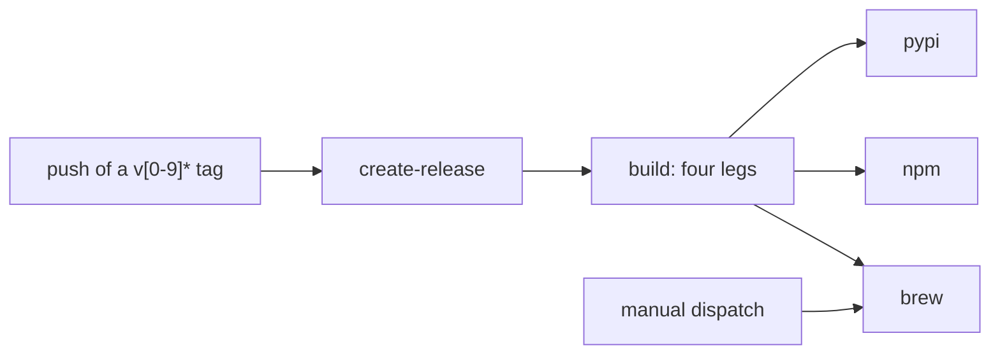

# Distribution — one tag, every channel, and the PyPI wheels

**Status:** Verified 2026-10-01 against `2714ee5`. Inside the `covers:` perimeter,
the commit that added this document, `fced33d`, changed only comments and one
docstring, repointing them here and correcting stale ones, and the one after it
there, `2714ee5`, added the `planning-perf` recipe to the `Justfile`, which builds
a server of its own and has its row in
[§5](#5-the-frontend-bundle-is-in-the-tag-never-on-main); otherwise the code it
describes is `7fa8cbf`'s, unchanged. MEASURED: every release from 0.5.4 to 0.7.1
put both PyPI projects' wheels on pypi.org, `vantage-md` 0.4.1 and 0.4.2 are
yanked there, every tag from v0.5.6 on carries the frontend bundle, and the
published 0.7.1 server wheel, installed into a fresh venv, runs both `vantage` and
its `vantage-md` alias from an unrelated directory (pypi.org, `git ls-tree` and a
venv, all on 2026-10-01). Also MEASURED: the minimum macOS each published 0.7.1
macOS binary declares, read on 2026-10-01 from the field every macOS binary
carries in its header (`LC_BUILD_VERSION`), which is higher than its wheel's tag
([§6.3](#63-platforms), [Current values](#current-values)). UNMEASURED: CI runs
only the Linux x86-64 wheels before uploading, so the other wheels are wrapped
exactly like them but never run before they ship. The `musllinux` tag rests on the
server binary being statically linked, which was checked, not on a run under musl.
[§9](#9-known-gaps) lists where the release breaks a rule below.

Vantage ships two programs and a library. The **server** is `vantage`, the Go
binary with the frontend embedded. The **CLI** is `vantage-check`, the
agent-facing checker, which bun compiles into a single binary. The **library**
is the `vantage-md` Markdown pipeline on npm. One workflow, triggered by pushing
a `v<semver>` tag, builds all three at that tag's version and publishes them to
every channel: release archives, a Homebrew formula, two PyPI projects and npm.
The only channel CI does not build is `go install`, which compiles the tag's own
tree on the user's machine; `just release` exists to make that tree carry the
frontend.

| Component | Lives in |
| :--- | :--- |
| The release workflow: the GitHub release, the build matrix, the wheels, and the PyPI, npm and Homebrew jobs | [`.github/workflows/publish.yml`](../../.github/workflows/publish.yml) |
| The wheel builder, for both programs | [`scripts/build-wheel.py`](../../scripts/build-wheel.py) |
| The Homebrew formula generator | [`scripts/update-brew-tap.sh`](../../scripts/update-brew-tap.sh) |
| Cutting a tag that carries the frontend; building the frontend locally | [`Justfile`](../../Justfile) (`release`, `web-sync`, `build-bin`) |
| The embedded frontend, and the page served without one | `web` (`Dist`, `IndexHTML`), `internal/server` (`indexHTML`) |
| Where a release's version lands | `internal/buildinfo` (`Version`) for the server; [`packages/vantage-check/scripts/build.ts`](../../packages/vantage-check/scripts/build.ts) for the CLI |
| The Go version withdrawn from `go install` | [`go.mod`](../../go.mod) (`retract`) |
| The release notes | [`scripts/changelog-section.sh`](../../scripts/changelog-section.sh) |

**Reads with:** [`agent-cli.md`](agent-cli.md) (the CLI being
distributed, and [why it is one compiled binary](agent-cli.md#8-one-binary-built-and-shipped)),
[`checker-version-skew.md`](../design/checker-version-skew.md) (which checker
release an agent actually runs), and [`AGENTS.md`](../../AGENTS.md#releases)
(how a trusted-publishing failure reads, and the release-notes rule). For
readers rather than maintainers: [Getting Started](../../userguide/getting-started.md)
and [`vantage-check`](../../userguide/guides/vantage-check.md).

---

## 1. What it is for, and the rules it keeps

Every channel a person or an agent installs Vantage from has to hold the program
this repository builds today, at the version its tag names. A channel that holds
anything else fails silently: it installs and runs, and nobody learns it is the
wrong program.

### 1.1 Principles

Numbered because sibling documents and this one cite them.

- **P1. One name per product surface; one registry each.** `vantage-md` names
  *Vantage* in each registry, and the registry says which form you get: npm the
  Markdown-pipeline library, PyPI the executable server. This is deliberate, not
  a collision — the same product, published where each audience looks. What
  follows from it is that a distribution's name identifies **one artifact**, so a
  third artifact with a different audience gets a third name
  ([§7](#7-two-pypi-projects-at-one-version)).
- **P2. The PyPI copy is never behind.** Publishing rides the release trigger
  that already exists; it is never a separate human step. A channel that needs
  someone to remember it is a channel that goes stale. PyPI is the proof rather
  than the hypothesis: when the Go cutover deleted the Python packaging, nothing
  in the new release flow built a wheel, and PyPI went on serving the retired
  Python app until its releases were yanked.
- **P3. One wheel, one executable.** A wheel carries exactly one program. Two
  executables in one wheel welds two release cadences together and makes every
  consumer download both.

### 1.2 Invariants

What a maintainer breaks by accident. Each is the first thing to check when
changing the file it names.

- **The tag is the version, and nothing else is.** CI stamps the tag into both
  package manifests and into the server's linker flags before it builds anything,
  so no manifest can disagree with what shipped. The `version` committed in either
  manifest decides nothing; CI overwrites it in its own checkout.
- **A wheel wraps the binary on the release, never a second build of it.** Each
  build leg archives its two binaries and then hands those same files to the
  wheel builder, so the bytes on PyPI are the bytes on the release
  ([§6.1](#61-what-the-builder-writes)).
- **A tag is created already carrying the frontend, and never moved once
  published** ([§5](#5-the-frontend-bundle-is-in-the-tag-never-on-main)). Go's
  checksum database pins a tag's tree on first fetch.
- **`web/dist` is never tracked on main, and no `just` recipe modifies a tracked
  file.** The bundle exists in exactly one tracked place: the bundle commit under
  each tag.
- **Every registry's trusted publisher names `publish.yml`.** The binding is to
  the workflow's file name, so renaming the file breaks every publish at once
  ([§7.1](#71-trusted-publishers)).
- **On a tag push, nothing reaches PyPI, npm or the tap until the Linux x86-64
  wheels have installed and run**, and a PyPI failure costs the release nothing
  but its wheels ([§4.2](#42-the-workflow)). A manual dispatch runs only the tap
  job, with no build and no smoke test, and trusts whatever archives the release
  already holds.

---

## 2. Terms

| Term | Means | Is not | Origin |
| :--- | :--- | :--- | :--- |
| **Server** | `vantage`, the Go binary with the frontend embedded | the PyPI project that carries it, `vantage-md` | a plain word, held to this one sense here |
| **CLI** | `vantage-check`, the agent-facing checker, compiled by bun into one binary | a Python program; its wheel holds no Python that matters | a plain word, held to this one sense here |
| **Library** | the `vantage-md` Markdown pipeline as npm publishes it | the server, although PyPI's project of the same name is the server (P1) | a plain word, held to this one sense here |
| **Platform wheel** | a wheel whose file name carries a platform tag, so an installer picks the build that matches the machine | a `py3-none-any` wheel, which matches every machine | [platform compatibility tags](https://packaging.python.org/en/latest/specifications/platform-compatibility-tags/) |
| **`manylinux`, `musllinux`** | the platform-tag families for glibc and musl Linux, each naming the oldest C library a wheel needs | a promise the binary was tested there | the same specification |
| **Trusted publishing** | a registry's OIDC flow: a named GitHub workflow authenticates by identity, and no API token exists to leak | a stored secret | [PyPI](https://docs.pypi.org/trusted-publishers/), [npm](https://docs.npmjs.com/trusted-publishers) |
| **Yank** | marking a release ineligible for new resolutions while an exact pin still installs it | deletion | [PEP 592](https://peps.python.org/pep-0592/) |
| **Console-script entry point** | a command the *installer* writes into the environment's scripts directory, pointing at a Python function | a file shipped inside the wheel | [entry points](https://packaging.python.org/en/latest/specifications/entry-points/) |
| **Build leg** | one job of `publish.yml`'s build matrix: one operating system and architecture | the whole `build` job | GitHub Actions' [matrix](https://docs.github.com/en/actions/using-jobs/using-a-matrix-for-your-jobs) |
| **Host wheel** | a wheel whose platform tag matches the CI runner, so it is the only kind CI can install and run | every wheel the workflow builds | the design this document replaced (2026-09-01), and `publish.yml`'s smoke step |
| **Bundle commit** *(coined here)* | the commit `just release` makes on top of `HEAD`, differing from it only by the built `web/dist`, and reachable only from its tag | a commit on main | coined here; the `Justfile` calls it "a commit that exists only on the tag" |

---

## 3. The channels

| Channel | Carries | Install |
| :--- | :--- | :--- |
| GitHub release | one archive per platform holding **both** binaries, plus the license and README | download and untar |
| Homebrew tap | a `vantage` formula that installs both binaries from that archive | `brew install mschulkind-oss/tap/vantage` |
| `go install` | the server alone, compiled from the tag's tree | `go install github.com/mschulkind-oss/vantage/cmd/vantage@latest` |
| PyPI `vantage-md` | the server, as platform wheels | `uvx vantage-md <path>` for a one-shot run, `uv tool install vantage-md` to put `vantage` on `PATH` |
| PyPI `vantage-check` | the CLI, as platform wheels | `uvx vantage-check <file>` |
| npm `vantage-md` | the library | `npm i vantage-md` |

**Homebrew and `go install` are the documented paths for the server.** The
README and the user guide name only those two. The server's PyPI project is a
convenience for Python-first machines, never the recommendation: `uvx` is built
for one-shot tools, and here it starts a process that serves until killed.

**PyPI is the agent's path to the CLI.** The review payload tells every agent to
run `uvx vantage-check`, which needs no toolchain beyond `uv` and caches the
wheel for its platform. Bare `uvx` runs the newest release, so the CLI an agent
runs matches a given viewer's version only when it is pinned
([`checker-version-skew.md` §2.1](../design/checker-version-skew.md#21-how-an-agent-gets-its-checker)).

> [!NOTE]
> **PyPI's `vantage`, with no suffix, is someone else's project**, an unrelated
> distributed-learning package. That is why the server's PyPI name is
> `vantage-md`, matching npm's (P1), and why the installed command, `vantage`,
> differs from the project name.

---

## 4. The release: one tag, one run

### 4.1 Cutting the tag

A release is cut with `just release <semver>`, never by tagging by hand. In
order, the recipe:

1. refuses a working tree with anything uncommitted, and a version whose tag
   already exists;
2. refuses a version with no usable [`CHANGELOG.md`](../../CHANGELOG.md) section,
   using the same script the workflow later lifts the release body with
   ([`AGENTS.md`](../../AGENTS.md#releases) says what the section must be);
3. refuses a tree whose notation the previous release's viewer would misread
   (`just compat-previous`, run with `CI=true` so a failed fetch is a failure);
4. builds the frontend into `web/dist` with `just web-sync`;
5. writes the **bundle commit** with git plumbing against a scratch index —
   `HEAD`'s tree plus a forced add of `web/dist` — so neither the working tree nor
   `HEAD` moves;
6. tags that commit and pushes the tag. `publish.yml` takes it from there.

The bundle commit's parent is `HEAD`, but no branch points at it; only the tag
reaches it. Its subject is fixed (see [Current values](#current-values)), and
because `git commit-tree` skips the `commit-msg` hook, the pre-push hook is what
checks it.

> [!WARNING]
> **Never move a tag once it has been pushed, and never reuse its version.** Go's
> [checksum database](https://go.dev/ref/mod#checksum-database) records a tag's
> tree the first time anyone fetches it, so a re-pointed tag turns every later
> `go install` of it into a checksum failure. That includes a tag `publish.yml`
> refused: the refusal comes after the push, and anything that fetched the tag in
> between — the module proxy answering someone's `@latest` — has already pinned
> its tree. Whether that happened cannot be checked afterwards, because asking the
> checksum database about a version records it. So a refused tag is deleted, and
> the release is cut at the **next patch version** with `just release`
> ([§4.4](#44-failure-and-re-runs)); a tag that shipped broken is replaced the
> same way. Either one is also withdrawn with a `retract` directive in `go.mod`
> ([§5](#5-the-frontend-bundle-is-in-the-tag-never-on-main)), which costs nothing
> if nobody fetched it. `publish.yml`'s two refusal messages say to re-cut the
> same version, which is safe only if nothing fetched the tag
> ([§9](#9-known-gaps)).

### 4.2 The workflow

`publish.yml` runs on a push of a tag matching `v[0-9]*`, or by hand to refresh
only the Homebrew formula for a version that is already released.

- **`create-release`** lifts the tag's own `CHANGELOG.md` section into the
  release body, with its links made absolute and pinned to the tag and each
  wrapped paragraph joined onto one line, and creates the GitHub release. It is
  its own job so that four legs do not race to create one release.
- **`build`** is a four-leg matrix ([§4.3](#43-one-build-leg)). Each leg attaches
  its archive to the release and hands its wheels to the next job.
- **`pypi`** downloads every leg's wheels and runs `uv publish` once per project,
  under trusted publishing in the `pypi` environment
  ([§7.1](#71-trusted-publishers)).
- **`npm`** checks the tag out again, stamps the version into the library's
  manifest, builds it with tsdown, copies `CHANGELOG.md` into the package (npm's
  `files` cannot reach above the package directory), and publishes it with
  provenance.
- **`brew`** downloads the four archives, writes `Formula/vantage.rb` with their
  checksums, and pushes it to the tap. The formula installs both binaries and
  tests each one's `--version`.

`pypi`, `npm` and `brew` are siblings: each needs `build` and nothing else, so a
PyPI failure leaves the archives, the npm package and the formula published.

> [!WARNING]
> **The tag filter is `v[0-9]*`, not `v*`, and that is load-bearing.** It makes a
> tag such as `vantage-check@0.1.0` unable to reach this workflow at all, where
> the old `release: [published]` trigger, which takes no tag filter, once read its
> version as `antage-check@0.1.0`. Do not widen it, and do not go back to a
> release-event trigger.

### 4.3 One build leg

Every leg does the same steps for its operating system and architecture:

1. **Read the version from the tag** and stamp it into both package manifests.
   `vantage-check`'s build compiles the manifest's version into the binary.
2. **Assert the tag carries the frontend bundle**: a tag whose `web/dist` holds
   nothing but `.gitkeep` was not cut with `just release`, and fails here, before
   any artifact is published. The GitHub release, with its notes, already exists
   by then ([§5](#5-the-frontend-bundle-is-in-the-tag-never-on-main)).
3. **Build the frontend** and copy it into `web/dist`, then require
   `index.html` to be there. Every server binary CI publishes embeds this fresh
   build, not the bundle commit's copy.
4. **Cross-compile the server** with cgo off, so the binary is static, and with
   the version and the commit stamped into `internal/buildinfo` through the linker.
5. **Cross-compile the CLI** with bun, which compiles every target from one host.
6. **Archive both binaries** with the license and README, and attach the archive
   to the release.
7. **Wrap each binary in its wheels**: one server wheel per server platform tag,
   and one CLI wheel ([§6](#6-the-wheels)).
8. **Smoke-test the host wheels**, on the Linux x86-64 leg only: install both into
   a fresh venv, check that `vantage` and `vantage-check` report the tag's
   version, run the `vantage-md` alias, and run the CLI over this repository's
   own `userguide/` and `docs/`. A CLI handed to other people's agents has to pass
   the tree it ships from.
9. **Upload the wheels** as a workflow artifact for the `pypi` job.

### 4.4 Failure and re-runs

| What fails | What has happened by then | What is left |
| :--- | :--- | :--- |
| A tag with no `CHANGELOG.md` section | nothing but the tag itself; `create-release` fails first | delete the tag, then cut the next patch version with `just release`, carrying a section for that version and a `retract` of the refused one in `go.mod` ([§4.1](#41-cutting-the-tag)) |
| A tag with no bundle | the GitHub release exists, with its notes and no assets | the same, deleting the release along with the tag |
| Any build leg | other legs may have attached their archives | nothing is published to PyPI, npm or the tap, because each needs every leg |
| The smoke test | that leg's archive is attached | the same |
| `pypi` | the archives, and possibly the npm package and formula | re-run the job |
| `brew` | everything else | re-run the job, or dispatch the workflow by hand with the version |

Re-run only the jobs that failed (GitHub's **Re-run failed jobs**), and a re-run
is safe almost everywhere: `create-release` keeps a release that already exists,
`uv publish` skips a file the index already holds byte for byte (`--check-url`),
and the tap job commits nothing when the formula is unchanged. **npm is the
exception**: it never accepts a version twice, so once the library is out, a
re-run of the `npm` job fails.

> [!WARNING]
> **Never re-run `build` once anything after it has published**, which is what
> **Re-run all jobs** does. Every leg rebuilds its archive and uploads it over
> the old one (`--clobber`), and the rebuilt archive has a new checksum: `tar`
> records each file's modification time, and `mise.toml` pins Go to a minor
> version with no patch number ([Current values](#current-values)), so a later
> run can build with a newer Go. The
> formula then names a checksum the release no longer serves, until `brew` runs
> again. PyPI keeps the first run's wheels, because it never accepts a different
> file under a name it already holds, so a rebuilt wheel that differs fails the
> `pypi` job and the wheels on PyPI no longer hold the archive's bytes
> ([§1.2](#12-invariants)).

---

## 5. The frontend bundle is in the tag, never on main

The server embeds `web/dist` with `//go:embed all:dist`. The `all:` prefix
matches dot-files, so a directory holding only the tracked `.gitkeep` still
compiles — and the result is a server that logs one warning to its own stderr and
serves a one-line placeholder page, `Frontend bundle not found.`, in place of the
app. Nothing else fails. That is why the bundle's presence has to be arranged
for every way the server is built:

| Built by | Gets its frontend from |
| :--- | :--- |
| `publish.yml`, for the archives, wheels and formula | its own frontend build, every leg ([§4.3](#43-one-build-leg)) |
| `go install …@<tag>` | the tag's tree, which is the **bundle commit** |
| `just build` | `just web-sync`, always |
| `just build-bin` | the existing `web/dist`, or `just web-sync` first when there is no `index.html` |
| `just planning-perf`, a measurement server in a temporary directory | `just web-sync`, unless `--no-build` finds an `index.html` already there |
| a bare `go build` on a fresh clone | nothing: it serves the placeholder until `just web-sync` runs |

`web/dist` is ignored on main apart from its `.gitkeep`. `just web-sync` rebuilds
it from `frontend/` and writes only ignored files; without npm it warns and leaves
whatever is already there. `go install` runs no npm and no recipe, so the module
proxy serves it whatever git holds at the tag, and the bundle commit is the only
way a real frontend gets there.

`publish.yml`'s assertion turns a hand-cut tag into a failure before any artifact
is published. It exists because one got through: v0.5.5 was tagged by hand, every
artifact CI built for it was correct, and `go install …@v0.5.5` served the
placeholder. The tag could not be repaired ([§4.1](#41-cutting-the-tag)), so
`go.mod` [retracts](https://go.dev/ref/mod#go-mod-file-retract) it, which makes
`@latest` skip it and warns anyone who asks for it by name.

> [!WARNING]
> **Do not track `web/dist` on main to make a bare `go build` work.** It was
> tracked from `08579a0` to `fb0ad8e`, both on 2026-09-01, and the cost was
> drift: a tracked build product can disagree with its sources, the CI check
> that caught it fired only after the drift was committed, and dependabot could
> not rebuild a bundle its own bumps had changed, so its pull requests stuck.
> The bundle commit gives `go install` the same result with nothing derived on
> main ([OQ-P6](#why-its-this-way)).

---

## 6. The wheels

### 6.1 What the builder writes

[`scripts/build-wheel.py`](../../scripts/build-wheel.py) wraps a binary that
already exists in a platform wheel, and does not care what compiled it: both
the Go server and the bun-compiled CLI go through it, with flags for everything
that differs — the distribution name, the installed command, any alias, the
summary, the README used as the long description, the platform tag and the
version. It has no dependencies and no build backend; a wheel is a zip with a
few metadata files, and writing the zip is less code than adding a Python build
toolchain to the repository.

A wheel it writes holds:

- **the binary itself, as the installed command**, in the wheel's
  `.data/scripts/` directory. No Python launcher stands between the command and
  the binary, so `uvx vantage-check` execs a real executable.
- **a stub package** whose only content is its version, plus the alias launcher
  when there is one ([§6.2](#62-vantage-is-the-command-vantage-md-is-an-alias)).
- **metadata**: the name, version and summary, the license, a homepage link, a
  changelog link to the GitHub release for that exact version, whose body is that
  version's changelog section, and the README as the description. The changelog
  link resolves because a wheel is only ever built from a tag.
- **the `WHEEL` file**, tagged `py3-none-<platform>` and marked as not pure
  Python, since the payload is a platform binary.

Every entry carries the same fixed timestamp, so the same binary and arguments
produce the same wheel.

> [!WARNING]
> **Do not replace the builder with `go-to-wheel`, `goreleaser` or any tool that
> compiles for itself.** They are the obvious reach, and every one of them would
> compile the server a second time, so the wheel on PyPI would be a different
> artifact from the archive on the release. They also bring their own platform
> set and allow a single entry point ([OQ-P7](#why-its-this-way)).

### 6.2 `vantage` is the command; `vantage-md` is an alias

The server wheel's distribution is `vantage-md`, and its real command is
`vantage`, the name every other channel installs. A second command, `vantage-md`,
is a **console-script entry point** that execs the binary, so that
`uvx vantage-md <path>`, which runs the command named after the project, works
without `--from` ([OQ-P3](#why-its-this-way)).

The launcher behind the alias finds the binary in the scripts directory of the
environment it was installed into, and falls back to the directory its own
resolved `argv[0]` lives in. The interpreter cost lands only on the alias;
`vantage` is the raw binary.

The binary's own command tree names its root `vantage-md`, the PyPI project's
name: its help and usage lines say `vantage-md [command]`, `vantage completion`
writes completions for `vantage-md`, and `--version` prints the line
[Current values](#current-values) gives. Only the PyPI channel installs a
`vantage-md` command ([§9](#9-known-gaps)).

> [!WARNING]
> **Do not replace the alias with a `$0`-relative shell shim.**
> `exec "$(dirname "$0")/vantage" "$@"` looks equivalent and is broken: a shell
> that resolves a bare command through `PATH` passes the *name* as `$0`, so
> `dirname` yields `.` and the exec fails from any other directory. An entry point
> sidesteps that, and the installer writes its launcher with the right interpreter
> for each environment.

### 6.3 Platforms

Both programs ship for Linux and macOS, each on x86-64 and arm64: the four
archive targets, and nothing else ([OQ-P4](#why-its-this-way)). The tags differ
between the two programs because their binaries do:

- **The server is static** (cgo off), so one Linux binary carries both a
  `manylinux` and a `musllinux` tag — a second tag on the same bytes, never a
  second build. Its `manylinux` floor ([Current values](#current-values)) is a
  deliberately low choice rather than a requirement, since nothing is linked: it
  is the floor of `manylinux2014`, the oldest tag family that covers arm64, and
  PyPI would accept lower on x86-64.
- **The CLI links glibc**, through bun's runtime, so its Linux wheels claim a
  higher `manylinux` floor and there is no `musllinux` wheel.
- **macOS** wheels of both programs carry one tag, and it is lower than either
  binary supports. A macOS binary records the oldest macOS it runs on in its
  header, and the published binaries record a higher one: for the server, the
  floor of the Go toolchain it is built with, and for the CLI, bun's
  ([Current values](#current-values)). So `uvx` installs these wheels on a Mac
  older than that, where the binary is not supported ([§9](#9-known-gaps)).
  Both floors move when `mise.toml`'s Go or bun pin does, and nothing in the
  release compares a wheel's tag with its binary's floor.

There is no Windows build of either program. The builder refuses a Windows
platform tag outright rather than keep a code path nothing exercises: bun
suffixes only its Windows output with `.exe`, and a tag and binary name that
disagreed once produced a CLI wheel that installed cleanly and failed on first
run. Re-adding Windows means restoring that naming in the builder and the
workflow together.

> [!NOTE]
> A platform outside this set gets no wheel, so `uvx vantage-md` there fails to
> resolve. That is the intended outcome, and the reason the old Python releases
> are yanked ([§6.4](#64-the-yanked-python-releases)).

### 6.4 The yanked Python releases

PyPI `vantage-md` 0.4.1 and 0.4.2 are the retired Python FastAPI app, and both
are yanked. Each is a `py3-none-any` wheel and an sdist, both installable on
every platform, so without the yank any machine outside the platform set above
would resolve to them and run a different program, successfully and with no
warning. Yanked, they answer only an exact pin, and an unsupported machine fails
loudly instead ([OQ-P1](#why-its-this-way)).

> [!CAUTION]
> **Never publish a `py3-none-any` wheel or an sdist to either project, and never
> un-yank those two releases.** Either one would become the silent answer on
> every platform without a platform wheel. An sdist would also need a Go
> toolchain at install time, which is the opposite of what a wheel is for.

---

## 7. Two PyPI projects at one version

The server and the CLI are separate PyPI projects, `vantage-md` and
`vantage-check`, published from one workflow run at the tag's version
([OQ-P2](#why-its-this-way), [OQ-P8](#why-its-this-way)). One tag releases both,
and they stay two distributions, because:

- **One name, one artifact** (P1), and **one wheel, one executable** (P3).
- **Size.** The CLI carries a JavaScript runtime, and its wheel is several times
  the server's; a server wheel carrying it would make everyone running the server
  download a linter.
- **Audience.** The CLI's consumer is an agent checking one file, often in a
  sandbox with a cold cache, which must not fetch a server.

The `pypi` job publishes each project with its own `uv publish` step. That is a
choice, not a requirement: a token minted by trusted publishing covers every
project whose trusted publisher matches the workflow
([PyPI](https://docs.pypi.org/trusted-publishers/internals/)), and both
projects' publishers do ([§7.1](#71-trusted-publishers)), so one call over both
projects' wheels would also work. Two steps give each project its own step and
log in the run.

### 7.1 Trusted publishers

PyPI and npm accept uploads from `publish.yml` by trusted publishing. PyPI holds
no token for this repository, and the `NPM_TOKEN` the npm job passes is a dead
fallback. Each PyPI project names its own trusted publisher, and both name the
same four things; npm's names the same workflow file.

| Field | Value |
| :--- | :--- |
| Owner | `mschulkind-oss` |
| Repository name | `vantage` |
| Workflow name | `publish.yml` |
| Environment name | `pypi` (PyPI only) |

> [!WARNING]
> **The repository name is the bare name.** PyPI's form rejects
> `mschulkind-oss/vantage` as an invalid repository name, because the owner is
> its own field. And **a rename of `publish.yml` breaks every registry at once**,
> since each trusted publisher binds to the workflow's file name: update every
> registry's publisher in the same breath. On npm that failure is reported as
> `ENEEDAUTH`, a missing token, because npm falls back to the dead token
> ([`AGENTS.md`](../../AGENTS.md#releases)). Fix the publisher; do not mint a
> token.

---

## 8. Non-goals

- **Renaming anything.** npm `vantage-md` and PyPI `vantage-md` share a name on
  purpose (P1).
- **PyPI as the primary way to install the server** ([§3](#3-the-channels)).
- **An sdist that compiles Go at install time**
  ([§6.4](#64-the-yanked-python-releases)).
- **Moving the checker into the Go binary.** A second implementation of the
  rendering pipeline would drift from the viewer invisibly
  ([`agent-cli.md`](agent-cli.md#why-its-this-way), R3).
- **Windows, for either program** ([§6.3](#63-platforms)).
- **A separate tag or version per artifact.** One tag publishes everything
  ([OQ-P8](#why-its-this-way)).
- **The project website's install instructions,** which live outside this
  repository.

---

## 9. Known gaps

Where the release breaks a rule this document states. Each is a defect, not a
ruling, and fixing it is [`as-built-defects.md`](../design/as-built-defects.md)'s
work.

- **macOS wheels claim a lower macOS than their binaries run on.** Both
  programs' macOS wheels are tagged below the minimum their binaries declare,
  so `uvx` installs them on Macs the binaries do not support
  ([§6.3](#63-platforms)).
- **The refusal messages say to re-cut the same version.** `publish.yml`'s two
  refusals, for a tag with no `CHANGELOG.md` section and for a tag with no
  bundle, tell the maintainer to delete the tag and re-cut it with the same
  version, where [§4.1](#41-cutting-the-tag) says a pushed tag's version is
  never reused.
- **The server's help names a command most channels do not install.** The root
  command is named `vantage-md`, so `--help`, the usage lines and the completion
  script name a command that only the PyPI wheel installs; Homebrew and
  `go install` install `vantage` alone
  ([§6.2](#62-vantage-is-the-command-vantage-md-is-an-alias)).

---

## Current values

Verified at `2714ee5`. The prose above explains what each of these is for; this
table is the only place most of the exact values are stated.

| Value | Setting | Defined in |
| :--- | :--- | :--- |
| Release trigger | push of a tag matching `v[0-9]*`; manual dispatch with a `version` input re-runs only `brew` | `on:` in `publish.yml` |
| Build targets | `linux`, `darwin` × `amd64`, `arm64` | the `build` matrix |
| Archive | `vantage_<version>_<os>_<arch>.tar.gz`, holding `vantage`, `vantage-check`, `LICENSE`, `README.md` | the archive step |
| Server wheel tags | `manylinux_2_17_x86_64` and `musllinux_1_2_x86_64`; `manylinux_2_17_aarch64` and `musllinux_1_2_aarch64`; `macosx_11_0_x86_64`; `macosx_11_0_arm64` (the macOS tags undercut the binary's minimum, [§6.3](#63-platforms)) | `server_pytags` in the matrix |
| CLI wheel tags | `manylinux_2_28_x86_64`, `manylinux_2_28_aarch64`, `macosx_11_0_x86_64`, `macosx_11_0_arm64` (the macOS tags undercut the binary's minimum, [§6.3](#63-platforms)) | `cli_pytag` in the matrix |
| Minimum macOS the binaries declare | server 12.0, CLI 13.0 (measured on the published 0.7.1 wheels) | the Go toolchain and bun, both pinned in `mise.toml` |
| Wheel tag form | `py3-none-<platform tag>`; a tag containing `win` is refused | `build-wheel.py` |
| Installed commands | `vantage` and the alias `vantage-md`; `vantage-check` | the wheel step's `--script` and `--alias` |
| `Requires-Python` | `>=3.8` | `--requires-python` default |
| License | `Apache-2.0` | `LICENSE` in `build-wheel.py`; both `package.json` files; the formula |
| Wheel changelog link | `https://github.com/mschulkind-oss/vantage/releases/tag/v<version>` | `METADATA` in `build-wheel.py` |
| Wheel entry timestamp | 1980-01-01 00:00:00 | `build-wheel.py` |
| Server build | `CGO_ENABLED=0`, `-trimpath`, `-ldflags "-s -w -X …buildinfo.version=<version> -X …buildinfo.commit=<sha7>"` | the server step |
| CLI version stamp | `__VANTAGE_CHECK_VERSION__`, `__VANTAGE_CHECK_COMMIT__` via `bun build --define` | `packages/vantage-check/scripts/build.ts` |
| Server `--version` | `vantage-md, version <version>`, pinned by a test in `cmd/vantage` and by the formula's test | `SetVersionTemplate` in `cmd/vantage` |
| Server root command name | `vantage-md` ([§9](#9-known-gaps)) | `Use` in `newRootCmd`, `cmd/vantage` |
| Toolchain pins the binaries' macOS floors follow | `go = "1.26"`, no patch number; `bun = "1.4.0"` | `mise.toml` |
| Smoke-tested leg | `linux` / `amd64` | the smoke step's `if:` |
| PyPI upload | `uv publish … --check-url https://pypi.org/simple/`, one per project | the `pypi` job |
| PyPI environment | `pypi`, with `id-token: write` | the `pypi` job |
| npm publish | `npm publish --provenance --access public --workspace vantage-md` | the `npm` job |
| Homebrew | tap `mschulkind-oss/homebrew-tap`, file `Formula/vantage.rb`, installed as `mschulkind-oss/tap/vantage` | `update-brew-tap.sh`, the `brew` job |
| Bundle commit subject | `build(release): bundle frontend for v<version>` | `release` in the `Justfile` |
| Placeholder page | `Frontend bundle not found.` | `indexHTML` in `internal/server` |
| Retracted Go version | `v0.5.5` | `retract` in `go.mod` |
| Yanked PyPI releases | `vantage-md` 0.4.1 and 0.4.2, reason "pre go port" | pypi.org (owner action, not in the tree) |

---

## Why it's this way

Rulings a maintainer reading only the text above might undo on purpose, each with
the id sibling documents cite. All come from the design this document replaced.

| ID | Ruling | Date |
| :--- | :--- | :--- |
| OQ-P1 | Yank `vantage-md` 0.4.1 and 0.4.2 rather than leave them or delete the project. A `py3-none-any` wheel or an sdist installs everywhere, so on a machine with no platform wheel it silently ran the retired Python app; yanking makes that a resolution failure, and unlike deletion it keeps exact pins working and keeps the name ([§6.4](#64-the-yanked-python-releases)) | 2026-09-01 |
| OQ-P2 | The CLI is its own PyPI project, `vantage-check`, never a second executable in the server's wheel: one name, one artifact, and neither audience downloads the other's program ([§7](#7-two-pypi-projects-at-one-version)) | 2026-09-01 |
| OQ-P3 | The server wheel installs `vantage`, the binary itself, and `vantage-md` as a console-script alias, so `uvx vantage-md <path>` needs no `--from` and the installed command matches every other channel ([§6.2](#62-vantage-is-the-command-vantage-md-is-an-alias)) | 2026-09-01 |
| OQ-P4 | Linux and macOS on x86-64 and arm64, with `musllinux` as a free second tag on the static server, and no Windows for either program. The set is named per invocation, never inherited from a tool's defaults ([§6.3](#63-platforms)) | 2026-09-01 |
| OQ-P5 | Apache-2.0 everywhere — the repository, both package manifests, the wheel metadata and the formula. A wheel's metadata is the copy people quote ([§6.1](#61-what-the-builder-writes)) | 2026-09-01 |
| OQ-P6 | The built frontend is never tracked on main; `just release` carries it in a bundle commit only the tag reaches, which is what `go install` builds. It replaced a tracked export the same day, whose drift check blocked dependency bumps no bot could rebuild ([§5](#5-the-frontend-bundle-is-in-the-tag-never-on-main)) | 2026-09-01 |
| OQ-P7 | Our own wheel builder for both programs, never `go-to-wheel`: it wraps the binary already on the release, so PyPI and the archive carry the same bytes, and the platform set and entry points are ours ([§6.1](#61-what-the-builder-writes)) | 2026-09-01 |
| OQ-P8 | One version, one tag, one run: `publish.yml` on `v[0-9]*` publishes every artifact, CI stamps the tag into both manifests, and one archive per platform carries both binaries. It shares a version between the two PyPI projects without merging them ([OQ-P2](#why-its-this-way), [§4](#4-the-release-one-tag-one-run)) | 2026-09-01 |
