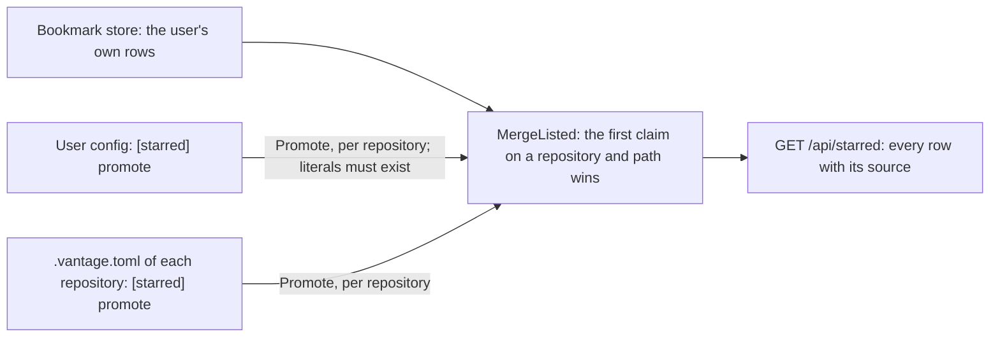

# Repository config — one `.vantage.toml`, two readers, and the documents it promotes into Starred

**Status:** Verified 2026-10-01 against `fced33d`, the commit that added this
document. Inside the `covers:` perimeter it changed only comments, repointing them
here and correcting stale ones, so the code it describes is `7fa8cbf`'s,
unchanged. `covers:` names every file a claim below rests on, the large shared
ones in `internal/server`, `internal/config`, `internal/live` and `internal/api`
included, so a perimeter diff flags them when they change for unrelated reasons
too. MEASURED: both readers' test suites parse the shared fixtures in every
`just check-ci`. UNMEASURED: the swap window in
[§3.3](#33-the-servers-read-is-guarded) was read from the code, not raced.
[§8](#8-known-gaps) lists where the code breaks a ruling below.

`.vantage.toml`, committed at a repository's root, is the one file in which a
repository configures Vantage. Two programs read it. `vantage-check` reads its rule
severities and run policy from `[check]`, and from the top-level `target` the oldest
Vantage release anyone reading the repository uses. The server reads the documents
the repository promotes into the sidebar's Starred section from `[starred]`, and the
color theme the repository offers from the top-level `theme`. Each program reads its
own tables and steps over the other's. `[planning]` is the one table both read in
full; [`planning-index.md` §14](planning-index.md#14-configuration) owns it, and this
document does not restate it.

A **promoted** document is one that a config file adds to Starred: the
repository's `[starred] promote` list, or a list of the same shape in the user's own
config. It is not a bookmark. It is never written into the user's bookmark file, it
is marked with the file that promoted it, and the header star does not fill for it,
so a filled star still means that the user chose the document.

| Component | Lives in |
| :--- | :--- |
| The server's reader: the tables it claims, the guarded read, reload | `internal/repoconfig` (`Config`, `Settings`, `Parse`, `StarredSettings`) |
| The checker's reader | `packages/vantage-check/src/core/config.ts` (`loadConfig`, `parseConfig`, `findConfig`, `planningConfigFor`) |
| The user config's `[starred]` list | `internal/config` (`LoadUserStarred`, `UserFilePath`) |
| Turning `promote` lines into rows, and merging the sources | `internal/starred` (`Promote`, `PromoteRequest`, `MergeListed`, `Listed`, `Source`) |
| Reading every served repository's lists | `internal/server` (`Server.promoted`, `Server.userPromoted`, `Server.themeDefaults`) |
| The `/starred` response | `internal/api` (`Handlers.StarredList`, `Deps.Promoted`) |
| The change push for the file | `internal/live` (`classify`, `Watcher.isContent`) |
| The star, the Starred section, and the remove offer | `frontend/src/stores/useStarredStore.ts` (`isStarred`), `frontend/src/components/StarButton.tsx`, `StarredSection.tsx`, `RemoveBookmarkButton.tsx` |
| The fixtures both readers parse | `internal/repoconfig/testdata/` (`shared-config.toml`, `version-skew-config.json`, `planning-config.json`) |

**Reads with:** [`planning-index.md`](planning-index.md) (the `[planning]` table, and
the project root the checker scans from),
[`color-themes.md` §2.5](../design/color-themes.md#25-a-repository-may-offer-a-default)
(what the `theme` offer means),
[`checker-version-skew.md`](../design/checker-version-skew.md) (the `target` key, and
why the checker warns about a key it does not know), and
[`technical_spec.md` §2.6](../design/technical_spec.md#26-bookmarks-internalstarred)
(bookmarks as a whole). For people configuring a repository rather than maintaining
Vantage: [Documents you always want starred](../../userguide/reference/configuration.md#documents-you-always-want-starred)
and [Keys From a Newer Release](../../userguide/reference/configuration.md#keys-from-a-newer-release).

---

## 1. Terms

Every term below is Vantage's own. Those whose origin is *the design* were coined by
the design this document replaced (2026-09-20); its text is in git, and this is now
where the terms are defined.

| Term | Means | Is not | Origin |
| :--- | :--- | :--- | :--- |
| **Reader** (of `.vantage.toml`) | A program that parses the file: the server, or `vantage-check` | a person; this document calls the person using the viewer *the user* | the design |
| **User config** | The user's own `config.toml` at its default path in their Vantage config directory ([Current values](#current-values)), which is also where daemon mode reads its settings from when it is not given `--config` | the repository's `.vantage.toml`, which is committed with the repository | [Configuration](../../userguide/reference/configuration.md#config-file-location) |
| **Repository root** | The directory the server serves one repository from: the directory given to [`vantage serve`](../../userguide/reference/cli-reference.md#vantage--vantage-serve) (a Markdown file's parent when it is given a file, the current directory when it is given nothing), or one repository's directory in [daemon mode](../../userguide/guides/daemon-mode.md) | the checker's *project root*, the nearest ancestor holding `.git` or `.vantage.toml` ([`planning-index.md` §13.1](planning-index.md#131-the-project-root)) | the server |
| **Bookmark** | A document or directory the user starred, stored in their data directory ([`technical_spec.md` §2.6](../design/technical_spec.md#26-bookmarks-internalstarred)) | a promoted row: nothing promoted is ever stored | the bookmark feature |
| **Promote**, **promoted row** | To add a row to Starred from a config file; a row added that way | a bookmark: the user cannot remove one, only the line that names it | the design |
| **Source** | Where a Starred row came from: `user` (a bookmark), `repo` (the repository's `.vantage.toml`) or `user-config` (the user config) | the file the document lives in | the design |
| **Literal line**, **pattern line** | A `promote` entry with none of the pattern characters, taken as one path; an entry with one, matched against the server's listing of the repository | a check that the file exists: a repository's literal line may name a document not yet written | the design |
| **Shared fixture** | A test input that both readers' test suites parse, each asserting the half it reads, so the two cannot drift apart while both suites stay green | a copy of one input per suite | the design |

---

## 2. Invariants

These are the rules a change breaks by accident. Each has its ruling's id in
[Why it's this way](#why-its-this-way).

1. **One file, two readers.** A repository configures Vantage in `.vantage.toml` and
   nowhere else. A second file beside it would leave a contributor guessing which
   file a key belongs in, and a reviewer unable to see one project's configuration at
   once. The price of sharing, two programs in two languages agreeing about one file,
   is paid once, by the shared fixtures ([§3.7](#37-where-the-readers-part-and-what-pins-them)).
2. **Each reader polices its own tables and steps over everything else.** The server
   and the checker ship as separate artifacts, so a version gap between them is the
   normal state, and a checker that validated the server's keys would fail a
   contributor's run over a key that is none of its business. `[planning]` is shared,
   and both validate all of it.
3. **The server's keys are top level.** Never under `[check]`
   ([§3.1](#31-who-reads-what)).
4. **The server reads the repository root's file and nothing above it**
   ([§3.2](#32-the-server-reads-the-repository-roots-file-only)).
5. **A file the server cannot use is ignored whole.** Never fatal, and never half
   applied ([§3.4](#34-a-file-the-server-cannot-use-is-ignored-whole)).
6. **The file is hostile input** from the moment someone opens an untrusted
   repository ([§3.3](#33-the-servers-read-is-guarded)).
7. **A promoted row is never stored.** The label saying where a row came from exists
   only on the type the server sends, never on the type it stores
   ([§4.4](#44-the-starred-response)).
8. **A filled star means the user starred the document**
   ([§4.5](#45-the-star-and-the-starred-section)).
9. **A promoted path is proved to be inside its repository**, symlinks resolved
   ([§4.2](#42-how-a-line-becomes-a-row)).
10. **A literal line never lists the repository.** Only a pattern line does
    ([§4.2](#42-how-a-line-becomes-a-row)).

---

## 3. The file and its two readers

### 3.1 Who reads what

```toml
# .vantage.toml, at the repository root
target = "0.8"              # the checker's; above every [table]
theme = "catppuccin"        # the server's: an offer, never an override

[check]
strict = true

[check.rules]
"planning/unrouted" = "warning"

[starred]
promote = ["roadmap.md", "docs/design/*.md"]

[planning]
exclude = ["docs/gallery/**"]

[tool.ruff]                 # another tool's table, which both readers step over
line-length = 100
```

| Name | Kind | Read by | What it is for |
| :--- | :--- | :--- | :--- |
| `[check]`, `[check.rules]` | table | the checker | [`vantage-check`'s configuration](../../userguide/guides/vantage-check.md) |
| `target` | top-level key | the checker; the server steps over it | [The Oldest Release Your Readers Use](../../userguide/reference/configuration.md#the-oldest-release-your-readers-use) |
| `[starred]` | table | the server; the checker steps over it | [§4](#4-promotion-into-starred) |
| `theme` | top-level key | the server; the checker steps over it | [`color-themes.md` §2.5](../design/color-themes.md#25-a-repository-may-offer-a-default) |
| `[planning]` | table | both, in full | [`planning-index.md` §14](planning-index.md#14-configuration) |

The authoritative lists are the code's: the server decodes the fields of
`repoconfig.Settings` and claims the tables `repoconfig.ours` names; the checker reads
the names `parseConfig` switches on. Any other top-level name belongs to another tool,
and both readers step over it.

> [!WARNING]
> **Do not nest the server's keys under `[check]`, however tidy it looks.**
> `[check.starred]`, or a bare `starred` or `theme` line below the `[check]` header
> (TOML reads a key written after a header as part of that table), is an error to the
> checker, exit `2`, for every repository that writes it: the checker knows the
> viewer's own names (`starred`, `theme`, `target`), refuses one inside its tables,
> and says where it goes. A new server table nested there would fare no better: every
> checker from 0.8.0 on would warn about an unknown key on each run, an older one
> would refuse the file, and the server never looks inside `[check]`. The server's keys are top level, or they are a breaking change.

### 3.2 The server reads the repository root's file only

The server reads `.vantage.toml` from each repository root and from nowhere else. The
checker finds its `[check]` table by walking up from the file it checks
([§3.6](#36-how-the-checker-reads-it)); the server deliberately does not, for three
reasons, each sufficient:

- **A walk up reads a file outside the served tree,** which is the one thing
  `internal/pathsafe` exists to prevent.
- **It would make the server's tests depend on the filesystem above them,** on
  whether some ancestor of a temporary directory happens to hold a `.vantage.toml`.
- **In daemon mode it is ambiguous.** Several served repositories can share an
  ancestor, and a walk up would give one repository's promotions to another.

The checker reads `[planning]` the same way, from the project root's own file only,
so the planning page and `vantage-check index` read one table for one repository
([`planning-index.md` §13.1](planning-index.md#131-the-project-root)).

### 3.3 The server's read is guarded

The file is attacker-controlled the moment someone opens an untrusted repository, so
the read refuses what a config file cannot be, before and while opening it
(`readGuarded` in `internal/repoconfig`):

- **It refuses a symlink that is in place when it stats the file.** The type is
  checked from an `Lstat`, and anything but a regular file is refused. A plain read of
  `<root>/.vantage.toml` would follow a link to `~/.ssh/config` and echo a fragment of
  it back in the parse error.
- **It re-checks the type through the opened handle,** because the `Lstat` and the
  open are two system calls and the file can be replaced between them. The open
  follows a symlink, and the re-check refuses whatever it reached that is not a
  regular file: a directory, a device, a FIFO. It does not compare that file with the
  one the `Lstat` saw, so **a symlink to a regular file, swapped in between the two
  calls, is read**, up to the size cap; a later re-stat that notices the change
  refuses it ([§8](#8-known-gaps)).
- **It caps the size,** before reading and again while reading, one byte past the
  cap, so a file that grew in between is refused rather than truncated into a
  misleading parse error. Without the cap, a committed multi-gigabyte file costs the
  daemon an out-of-memory kill rather than a warning. The cap is far past any real
  config, and the checker refuses a file past the same cap
  ([§3.6](#36-how-the-checker-reads-it)).

A string from the file never reaches a path or a URL unchecked: a `promote` line
clears the checks in [§4.2](#42-how-a-line-becomes-a-row), and a `theme` that could
not be a theme id is dropped with a warning, because that charset is also what keeps
the theme route from being a path traversal.

> [!WARNING]
> **Do not replace the guarded read with `os.ReadFile`.** It reads the same bytes for
> every honest repository, which is why the replacement looks safe, and it follows
> symlinks and reads any length for a hostile one.

> [!WARNING]
> **Do not take the re-check through the handle for proof that no symlink was
> followed.** It proves only that what the open reached is a regular file.

### 3.4 A file the server cannot use is ignored whole

`repoconfig.Parse` decodes the whole file and refuses it, returning no settings at
all, for any of:

- a TOML syntax error, or a value of the wrong type (`[theme]` as a table, say);
- an unknown key inside a table the server claims, `[starred]` or `[planning]`,
  found from the decoder's list of keys it did not decode, so a typo such as
  `promotes = […]` is an error rather than silence;
- a `[planning]` value the planning rules refuse
  ([`planning-index.md` §14](planning-index.md#14-configuration)).

A refused file is not fatal. Each consumer logs a warning naming the repository, the
file and the reason, and serves the repository as though it had no file: no
promotions, no theme offer, and the default `[planning]` table. In daemon mode one
contributor's bad commit therefore cannot take down, recolor or empty the planning
page of any other repository on the machine, and failing at startup instead would be
defensible in serve mode only. Two behaviors for one file would be worse than either,
so there is one.

The warning is logged by each request that reads the file, not once per edit, so a
broken file keeps saying so for as long as it is broken.

> [!NOTE]
> **The checker answers an unknown key differently.** It warns about an unknown key in
> `[check]` or `[planning]` and reads the rest
> ([§3.7](#37-where-the-readers-part-and-what-pins-them)), while the server refuses the
> file. Whether the server should warn and ignore too is
> [OQ-VS5](../design/checker-version-skew.md#OQ-VS5), open on the roadmap. A bad value
> for a known key is an error to both.

### 3.5 Reload, and the change push

A repository's config changes while the server runs, and the server runs for weeks,
so the file is neither read once at startup nor read on every request. The server
holds one `repoconfig.Config` per repository root and reads the file lazily, the first
time anything asks. After that it re-stats the file at most once per reload interval,
the interval the ignore-file matcher uses for the same problem, so one directory has
one staleness window; and it re-parses only when the modification time or the size
moved. The size counts too, because a filesystem with coarse timestamps, or an editor
that writes twice in one tick, can leave the time unchanged. A file that appears or
disappears is noticed at the next re-stat, and a missing file is no settings and no
error: having none is the normal case.

The planning endpoints read past the interval (`Config.SettingsNow`): they re-stat on
every request, still re-parsing only on a change, so a rescan the planning index
starts because the file changed sees the edit, unless the edit left both the
modification time and the size unchanged. Starred and the theme offer use the
throttled read.

The live watcher pushes an edit to the repository root's `.vantage.toml` as a changed
path, whatever the ignore rules say, and never a copy further down, which configures
nothing. Every consumer of the push sees the path, and the viewer's general handling
of a changed path refreshes what it refreshes for any change; the planning index is
the only consumer that acts on this one, and rescans. Starred and the theme offer do
not refetch on it: Starred picks an edit up at its next request, on a page load, a
reconnect or any browser's bookmark change, and the theme offer on the next page
load.

### 3.6 How the checker reads it

`check` finds its file by walking up from the first path it checks; `index` reads
the project root's own file and nothing above it; and either takes `--config <path>`
as given, or no file with `--no-config` (`findConfig`, `loadConfig`). From that file
the checker reads `[check]`, the top-level `target`, and `[planning]`. Without
`--config` or `--no-config`, `[planning]` always comes from the project root's own
file, never from one the walk found above it
([§3.2](#32-the-server-reads-the-repository-roots-file-only), `planningConfigFor`).

It steps over `[starred]`, `theme` and every other tool's table, with one exception:
a `target` that lands inside `[starred]` because it was written below that header. A
misplaced `target` is one no checker reads, so none could refuse a repository it is
too old for; the checker knows the name and refuses it there with advice to move it.

Every way the run's own file can fail to load is a config error, exit `2`, "fix the
invocation": a missing `--config` path, a directory passed to `--config`, a file it
cannot read, and a file past the server's size cap, because a table applied by the
checker from a file the server refuses is one the planning page never reads. None of
them is reported as the checker's own environment breaking.

Another project root's file, which a run spanning several projects reads for that
root's `[planning]` table, is not the run's file. A problem there is a `planning`
failure for that root's files, exit `3`, and the rest of the run goes on; only a
malformed `target` in it exits `2`, because every root's `target` is read before the
rest of the configuration ([`agent-cli.md` §6](agent-cli.md#6-configuration)).

### 3.7 Where the readers part, and what pins them

The two readers agree on every value of `[planning]` and part over a key one of them
does not know. The checker warns about an unknown key in `[check]` or `[planning]` and
reads the rest, because to a checker older than the key every key a later release adds
looks like a typo; the server refuses the whole file over an unknown key in
`[starred]` or `[planning]` ([§3.4](#34-a-file-the-server-cannot-use-is-ignored-whole)).
The user guide's [Keys From a Newer Release](../../userguide/reference/configuration.md#keys-from-a-newer-release)
tabulates each reader's answer, table by table.

Three shared fixtures hold the readers to those answers. Each is read by the server's
`internal/repoconfig` tests and by `vantage-check`'s config tests:

- [`shared-config.toml`](../../internal/repoconfig/testdata/shared-config.toml) holds
  every reader's tables at once, plus another tool's. Each suite asserts the half it
  reads, so neither reader can start rejecting a file that holds the other's
  sections, or read its own keys wrongly out of one, without a suite turning red.
- [`planning-config.json`](../../internal/repoconfig/testdata/planning-config.json)
  holds both to one resolved `[planning]` table for every file they agree on.
- [`version-skew-config.json`](../../internal/repoconfig/testdata/version-skew-config.json)
  holds each reader's own answer where they differ: an unknown key, and `target` in
  each place it can be written.

---

## 4. Promotion into Starred



### 4.1 The two lists

Both lists have one shape, a `[starred]` table with one key, `promote`, a list of
repo-relative paths and patterns. The key is `promote` because that is what it does:
it does not star anything on the user's behalf, it puts a document where starred ones
appear.

```toml
# ~/.config/vantage/config.toml, the user config
[starred]
promote = ["roadmap.md", "ROADMAP.md"]
```

- **The repository's list** names documents for anyone who opens that repository.
  Its literal lines are listed whether or not the file exists, because a repository
  naming a document it has not written yet is an ordinary state.
- **The user's list** travels with the user and is applied to every repository the
  server serves. Its literal lines are listed only where the file exists (one `stat`
  each, per repository; never a listing), so "always star my roadmap" means "where
  there is one" and a single line does not carry a phantom row into every project
  without a roadmap. It is read in serve mode as well as daemon mode, always from the
  user config at its default path ([Current values](#current-values)), whatever
  `--config` a daemon was started with: a `[starred]` table in a file `--config`
  names is never read. The reader decodes only `[starred]`
  (`config.LoadUserStarred`). It neither switches the process into daemon mode nor
  refuses keys it does not know, since the file is full of the daemon's settings, and
  it re-reads the file on each `/starred` request.

### 4.2 How a line becomes a row

`starred.Promote` resolves one source's lines for one repository:

1. Each line is trimmed. A blank line, and one starting with `#`, is skipped.
2. **A pattern line** is any line holding one of the pattern characters. Patterns use
   gitignore syntax through the server's gitignore-style matcher, the one
   `[planning]`'s `include` and `exclude` use, quirks included: `?` matches only
   itself, and a pattern with a slash inside it is not anchored to the root
   ([`planning-index.md` §3.1](planning-index.md#31-candidates-and-planning-documents)).
   They are matched against the server's listing of the repository, which yields
   Markdown files only, so a pattern can discover a document but never a directory.
   The listing is fetched only if some line is a pattern, and at most once per source
   and repository.
3. **A literal line** is taken as one path. A trailing slash marks a directory, which
   the row's icon shows; it is stripped before the checks.
4. **Every path clears two checks**, `promotable`. The lexical one is the shape every
   bookmark must have (`ValidateEntry`): relative, forward slashes, already in cleaned
   form, no `..`, and no `.git` or `.vantage` segment however a case-insensitive
   filesystem would spell it. The physical one is containment in the repository once
   symlinks are resolved (`pathsafe.Resolve`), which is what catches a promoted
   `docs/notes.md` that is a symlink out of the tree. Paths a pattern matched are
   checked too, rather than trusting the listing to yield only safe ones.
5. **A refused line is dropped alone.** The rest of the list still promotes. A
   refused literal line is logged with its reason, once per request that reads the
   list. Two drops are silent: a path a pattern matched that fails the checks, and a
   user-config literal naming no file, since that is the expected answer in most
   repositories.
6. **One spelling per file.** Rows are deduplicated within the source; on macOS and
   Windows, where the filesystem treats two spellings of one name as one file, the key
   is case-folded, so `["roadmap.md", "ROADMAP.md"]` lists that file once, under the
   first spelling.
7. The rows are sorted by repository, then path, and then capped per source and
   repository. The cap applies after patterns expand, the only place it means
   anything, since three lines can name a thousand documents and the sidebar renders
   the whole section inline. What it drops is reported as one refused line.

A promoted row carries the zero time as its `starred_at`: it was never starred, so
there is no honest moment to report, and "now" would make it look freshly chosen.

> [!WARNING]
> **The bookmark check and the promotion check differ on purpose; do not consolidate
> them.** `ValidateEntry` is lexical so that a bookmark whose target was deleted still
> round-trips and the viewer can offer to remove it. A promoted path has no such
> requirement — nobody typed it, and a broken one is a config error — so it clears
> physical containment too.

A literal line never lists the repository, and that is a requirement rather than an
optimization: the viewer refetches the whole list on every page load, every reconnect
and every bookmark change, so a listing per literal line would be a full Markdown walk
per star click, times every repository a daemon serves, and the motivating case, one
roadmap, has to stay free. The containment check costs a literal line a few `lstat`
calls on its own path and its ancestors, never a listing.

### 4.3 Collisions, and who wins

The lists add to each other: the repository says "these matter in this project", the
user says "these matter to me everywhere", and between two sets there is no coherent
winner. Precedence exists only between claims on one row, keyed by repository and
path (case-folded on macOS and Windows, as above). `MergeListed` takes the sources in
decreasing precedence and keeps the first claim:

1. **The user's own bookmark wins over any promotion.** It is the only row with an
   honest timestamp and the only one the user can remove.
2. **Between the two promotions, the user config wins,** because it is the one the
   user chose for themselves, and the row says so.

Deduplication is correctness rather than tidiness: the sidebar keys each row on its
repository and path, so two rows with one key are a duplicate-key warning and a
visibly doubled row. The merged list is sorted by repository and then path, the order
the bookmark store keeps, so a list with no promotions is byte-identical to the
store's. Source is not part of the order: the sidebar groups by repository, and a
block of promoted rows would put one project's documents in two places.

### 4.4 The `/starred` response

`GET`, `POST` and `DELETE /api/starred` are global routes, one list per server even
in daemon mode, and every one of them answers with the whole merged list:

```json
{
  "entries": [
    { "repo": "", "path": "docs/design", "is_dir": true, "starred_at": "2026-09-30T14:02:11Z", "source": "user" },
    { "repo": "", "path": "roadmap.md", "is_dir": false, "starred_at": "0001-01-01T00:00:00Z", "source": "repo" }
  ]
}
```

A stored bookmark is a `starred.Entry`; a row of this response is a `starred.Listed`,
an `Entry` plus its `Source`, embedded so the JSON stays one flat object with one key
added. The source exists only on the wire type, which makes "a promoted document is
never written into the user's bookmark file" true by construction: the store's `Add`
takes an `Entry`, which has nowhere to put a source.

> [!WARNING]
> **Do not move `Source` onto `Entry`.** It would write a source into every row of
> every user's bookmark file, and make the store able to persist a promoted row, a
> mistake nothing in the type system would then catch.

The rows come from the server's `promoted` hook, which reads every served
repository's settings and the user config on each call, so a `/starred` response
costs a file read for the user config, a throttled re-stat per repository, and a
listing only for a source with a pattern line, at most one per source and
repository. When the bookmark store itself is
unavailable, every route answers `503` and no rows are shown, promoted ones included.

### 4.5 The star and the Starred section

The viewer's `isStarred` is "the user starred this", filtered to rows whose source is
`user`, not "this path is in the list". The header's `StarButton` uses that one
predicate both to render filled or empty and to choose between adding and removing.

> [!WARNING]
> **Never widen `isStarred` to promoted rows.** A promoted row counted there renders a
> filled star for a document the user never starred, whose click issues a `DELETE`
> the server answers with `404`, which the store logs and swallows, leaving the star
> filled. Nothing crashes and no test fails. `RemoveBookmarkButton`'s predicate must
> agree with it, for the same reason.

So a promoted document's header star is empty, and clicking it stars the document:
the user's bookmark then wins the collision, and the row becomes theirs. A promoted
row in the Starred section carries a pin, and the row's tooltip and the pin's
accessible name say which file promoted it. It cannot be unstarred: the viewer offers no remove for it,
and the way to drop it is to remove the line. Of the possible answers this is the
only one that adds no stored state. Removal that sticks would need a dismissal list
in the user's file, and since the store never stats the filesystem, an entry for a
path that is gone, or for a promotion since removed from the config, could never be
collected.

The section's list is fetched when the app mounts, after every reconnect, and on
every `starred_changed` push, which every bookmark change in any browser sends.

---

## 5. Failure modes

| Failure | Behavior |
| :--- | :--- |
| No `.vantage.toml` at the repository root | No settings and no warning: the normal case |
| A syntax error, a wrong type, an unknown key in `[starred]` or `[planning]`, or a bad `[planning]` value | The server ignores the whole file and logs a warning per request that reads it: no promotions, no theme offer, the default `[planning]`. In the run's own file, the checker exits `2` for a syntax error, or a bad value in `[check]`, `[planning]` or `target`, and warns and reads on for an unknown key in `[check]` or `[planning]`; in another project root's file, the same problems are a `planning` failure for that root's files, exit `3`, except a bad `target`, which exits `2` ([§3.6](#36-how-the-checker-reads-it)). It reads nothing else in `[starred]` and never reads `theme`, so a bad value or an unknown key there passes it silently, a `target` misplaced in `[starred]` aside |
| The file is a symlink or not a regular file, or past the size cap | The server ignores it whole, as above, except a symlink to a regular file swapped in between its stat and its open, which it reads ([§8](#8-known-gaps)). The checker exits `2` for a run's own file past the cap |
| A literal `promote` line that is absolute, holds `..`, names `.git` or `.vantage`, or resolves outside the repository | That line is dropped and logged; every other line still promotes. A path a pattern matched that fails the same checks is dropped without a log line |
| A pattern that matches more rows than the cap | The first rows by path are kept, and the overflow is logged as one refused line |
| A repository's literal line naming a file that does not exist | The row is listed; opening it lands in the viewer's not-found notice, which offers no remove for a promoted row |
| The user config cannot be read or parsed | Its rows are absent and a warning is logged; each repository's promotions are unaffected |
| The bookmark store could not be built at startup | `/starred` answers `503`, so no rows are shown, promoted ones included |
| A `DELETE` for a promoted path | `404`, since nothing is stored to remove; the viewer never offers it |
| `--config` names a directory or an unreadable file | The checker reports a config error, exit `2`, never exit `3` |
| A static export ([`vantage build`](../../userguide/guides/static-sites.md)) | No Starred section, no star, and nothing emitted for bookmarks or promotions |

---

## 6. Non-goals

- **A file of the server's own,** such as `.vantage-server.toml` beside this one
  ([§2](#2-invariants)).
- **Either reader validating the other's tables,** beyond the checker's refusal of
  the viewer's own names misplaced inside its tables
  ([§3.6](#36-how-the-checker-reads-it)).
- **An upward walk in the server** ([§3.2](#32-the-server-reads-the-repository-roots-file-only)).
- **A live refetch of Starred or the theme offer when the file changes.** The file's
  push serves the planning index; refetching Starred on it would mean a second
  consumer of that push, and the observable cost of not doing so is a list that
  updates on the next page load ([§3.5](#35-reload-and-the-change-push)).
- **Unstarring a promoted row,** and any dismissal list
  ([§4.5](#45-the-star-and-the-starred-section)).
- **Discovering a directory by pattern.** A directory can be promoted by a literal
  line only ([§4.2](#42-how-a-line-becomes-a-row)).
- **Promotions in a static export.** A promoted document is the repository's own
  committed content, so the privacy reason that keeps a user's bookmarks out of an
  export does not apply to it. What is missing is a merge: an export has no server to
  combine two sources, and giving it one is a piece of work of its own, not a rule
  against it.

---

## 7. This repository's own file, and the fixtures

This repository commits a root [`.vantage.toml`](../../.vantage.toml): it runs
`planning/unrouted` as a warning, excludes the gallery and the end-to-end fixtures from
the planning index, and declares the stage vocabulary. The gate runs the compiled
checker over the documentation with no explicit config, and the checker walks up from
each document to that file, so **a change to its `[check]` table retunes the gate**,
and belongs in a commit that says so.

> [!WARNING]
> **Do not name a unit-test fixture `.vantage.toml`.** The checker finds that name by
> walking up from any document below it, so a fixture with it, anywhere in the tree,
> silently becomes the configuration for every document beneath; and the checker
> treats the name as a project-root marker. The shared fixtures therefore have plain
> names ([§3.7](#37-where-the-readers-part-and-what-pins-them)). The end-to-end
> fixtures under `frontend/e2e/fixtures/` are named `.vantage.toml` on purpose: each
> directory is served as a repository of its own, and the root file keeps them out of
> this repository's planning index.

---

## 8. Known gaps

Where the code breaks a ruling in [Why it's this way](#why-its-this-way). It is a
defect, not a ruling, and fixing it is
[`as-built-defects.md`](../design/as-built-defects.md)'s work.

- **The guarded read follows a symlink swapped in after its stat.**
  [OQ-RC6](#why-its-this-way) rules that the read never follows a symlink. The
  server's open does, and its re-check through the handle refuses only what is not
  a regular file, so a symlink to a regular file put in place between the `Lstat`
  and the open is read, up to the size cap
  ([§3.3](#33-the-servers-read-is-guarded)).

---

## Current values

Verified at `fced33d`. The prose above explains what each of these is for; this table
is the only place the values themselves are stated.

| Value | Setting | Defined in |
| :--- | :--- | :--- |
| The file, at the repository root | `.vantage.toml` | `repoconfig.FileName`; `CONFIG_FILENAME` in `packages/vantage-check/src/core/config.ts` |
| Largest file either reader takes | 200 KiB (204,800 bytes) | `maxSize` in `internal/repoconfig`; `MAX_CONFIG_BYTES` in `core/config.ts` |
| The server's re-stat interval | 2 s, the same as the ignore matcher's | `reloadInterval` in `internal/repoconfig` and in `internal/ignore` |
| Tables the server claims, and polices | `[starred]`, `[planning]` | `ours` in `internal/repoconfig` |
| Top-level keys the server reads | `theme` | `repoconfig.Settings` |
| The viewer's names the checker refuses inside its own tables | `starred`, `theme`, `target` | `viewerKeyAdvice` in `core/config.ts` |
| Characters that make a `promote` line a pattern | `*`, `?`, `[` | `promoteGlobChars` in `internal/starred` |
| Promoted rows per source and repository | 100 | `starred.MaxPromoted` |
| Sources on the wire | `user`, `repo`, `user-config` | `starred.SourceUser`, `SourceRepo`, `SourceUserConfig`; `StarredSource` in `frontend/src/types/index.ts` |
| A promoted row's `starred_at` | the zero time, `0001-01-01T00:00:00Z` | `promote` in `internal/starred` |
| The user config | `$XDG_CONFIG_HOME/vantage/config.toml`, else `~/.config/vantage/config.toml`; on a Mac set up before 2026-09-04, `~/Library/Application Support/vantage/config.toml` when only that one exists. The `[starred]` list is read from here whatever `--config` a daemon is given | `config.UserFilePath`, `config.LoadUserStarred` |
| Routes | `GET`, `POST`, `DELETE` `/api/starred`, global: there is no `/api/r/{repo}/starred` | `internal/api/routes.go` |
| A promoted row's label, by source | `repo`: "Promoted by this project's .vantage.toml"; `user-config`: "Promoted by your Vantage config" | `StarredSection` |
| Where the label shows | the row's tooltip, `<path> — <label>`; the pin's accessible name, the label alone | `StarredSection` |
| The push that refetches Starred | `starred_changed` | `Server.broadcastStarredChanged`, `useWebSocket` |

---

## Why it's this way

Rulings a maintainer reading only the text above might undo on purpose, each with the
id that sibling documents cite. All were ruled in the design this document replaced;
[OQ-RC5](#why-its-this-way) is also the subject of an open question in
[`checker-version-skew.md`](../design/checker-version-skew.md#OQ-VS5). Ids not listed
were absorbed into the text above or are in git.

| ID | Ruling | Date |
| :--- | :--- | :--- |
| OQ-RC1 | The server is a second reader of `.vantage.toml` rather than getting a file of its own ([§2](#2-invariants)) | 2026-09-20 |
| OQ-RC2 | The server's tables and keys are top level, never under `[check]`; the table is `[starred]` with one `promote` key, the same in the repository's file and the user config. Not `[server]`: the name says what the table is for, not which binary reads it, which survives both binaries reading more of the file ([§3.1](#31-who-reads-what)) | 2026-09-20 |
| OQ-RC3 | Neither reader validates the other's tables; shared fixtures pin that each reads a file holding both. The one exception is the checker refusing the viewer's own names misplaced in a table, `starred.target` included ([§3.6](#36-how-the-checker-reads-it), [§3.7](#37-where-the-readers-part-and-what-pins-them)) | 2026-09-20 |
| OQ-RC4 | The server reads the repository root's file only, with no upward walk ([§3.2](#32-the-server-reads-the-repository-roots-file-only)) | 2026-09-20 |
| OQ-RC5 | A file the server cannot use is ignored whole: logged, and the repository served as though it had none. Never fatal, never half applied. An unknown key in the server's own tables is such a file; whether it should be warned about and ignored instead is [OQ-VS5](../design/checker-version-skew.md#OQ-VS5) ([§3.4](#34-a-file-the-server-cannot-use-is-ignored-whole)) | 2026-09-20 |
| OQ-RC6 | The read is guarded: regular files only, size-capped, and never following a symlink. The code holds the last only for a symlink in place when it stats the file ([§3.3](#33-the-servers-read-is-guarded), [§8](#8-known-gaps)) | 2026-09-20 |
| OQ-RC7 | The server re-stats the file at most once per reload interval and re-parses only on a change, rather than reading once or per request. The file's edit is pushed, and the planning endpoints read past the interval; Starred and the theme offer pick an edit up at their next request ([§3.5](#35-reload-and-the-change-push)) | 2026-09-20 |
| OQ-RC8 | A promoted row exists only on the wire; the stored entry and the bookmark file's format are unchanged ([§4.4](#44-the-starred-response)) | 2026-09-20 |
| OQ-RC9 | A filled star means the user starred the document: `isStarred` counts `user` rows only ([§4.5](#45-the-star-and-the-starred-section)) | 2026-09-20 |
| OQ-RC10 | A promoted path clears physical containment as well as the lexical check every bookmark clears ([§4.2](#42-how-a-line-becomes-a-row)) | 2026-09-20 |
| OQ-RC11 | A literal line never lists the repository; only a pattern line does, and the promoted set is capped after expansion ([§4.2](#42-how-a-line-becomes-a-row)) | 2026-09-20 |
| OQ-RC12 | The lists union; on a collision the user's bookmark wins, then the user config ([§4.3](#43-collisions-and-who-wins)) | 2026-09-20 |
| OQ-RC13 | A promoted row cannot be unstarred: the viewer offers no remove, and the row names the file to edit ([§4.5](#45-the-star-and-the-starred-section)) | 2026-09-20 |
