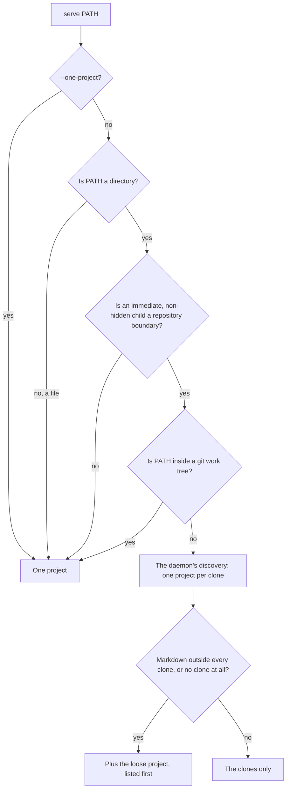

# Serving a directory of clones — one project per repository, and the loose project

**Status:** Verified 2026-10-01 against `7fa8cbf`. The commit that added this
document changed only comments inside the `covers:` perimeter, repointing them
here and correcting stale ones, so the code it describes is `7fa8cbf`'s,
unchanged. MEASURED: the tests behind it reach every limit by configuring it
down, and run on Linux and macOS in CI. UNMEASURED: none starts a real
`systemctl` or `launchctl`, none reaches a kernel's own limit, and how often one
project over a directory of clones reaches the watch limit has not been measured
([§9.1](#91-what-one-project-still-does)). Those runs are owed in
[`as-built-defects.md`](../design/as-built-defects.md#runs-nobody-has-made), and
[§10](#10-known-gaps) lists where the code breaks a ruling below.

`vantage serve` is the foreground mode that serves one path, and the default
command. It decides once, at startup, whether that path is a **directory of
clones** ([§2](#2-terms)): a directory outside every git work tree with a
repository among its immediate children. If it is, `serve` runs the way
`vantage daemon` runs a `source_dirs` entry, through the daemon's own discovery
code. Each clone becomes a project, a rescan serves clones made later and
retires deleted ones, and one more project, the **loose project**, serves the
Markdown that lies in no clone. `--one-project` turns the split off.

Three things come with the split:

- **What `serve` prints at startup:** one line describing the split, and one
  tip about the background service.
- **`install-service --source-dir`**, which adds the directory to that
  service's config and starts it.
- **Degradations**: a banner in the browser for a project too big for the file
  watcher's or the untracked-file walk's limits. This applies in every mode,
  split or not.

| Component | Lives in |
| :--- | :--- |
| Detection, the split, the startup line | `cmd/vantage` (`splitClonesDirectory`, `clonesPlan`, `planServe`, `announceServe`) |
| Discovery and naming, shared with the daemon | `internal/config` (`Config.DiscoverReposFromSourceDirs`, `Config.PruneMissingDiscoveredRepos`, `RepoConfig.Loose`), `internal/fsname` (`Key`) |
| The service tip and its probe | `cmd/vantage` (`serviceState`, `probeService`, `tipsEnabled`), `internal/config` (`DaemonAddress`, `LoadUserTips`) |
| `install-service` and `--source-dir` | `cmd/vantage` (`installServiceWithSourceDirs`, `writeServiceDefinition`), `internal/config` (`AddSourceDirsChecked`) |
| Repository boundaries | `internal/git` (`IsRepoBoundary`, `IsWorktree`, `Options.StopAtRepos`), `internal/fs` (`Config.StopAtRepos`, `ResolveFile`, `HasMarkdown`), `internal/live` (`Watcher.SetStopAtRepos`, `Watcher.Rescan`) |
| The loose project in the server, the rescan, the mode header | `internal/server` (`repoServices`, `refreshLoop`, `handToLooseProject`, `cloneProjects`, `warmActivity`, `handleReposMulti`, `ModeHeader`) |
| Degradations | `internal/live` (`FileBudget`, `Watcher.SetDegradedHandler`), `internal/git` (`WalkReport`), `internal/server` (`reportDegraded`, `walkFinished`, `watcherFailed`), `internal/model` (`Degradation`), `internal/api` (`Handlers.Degraded`) |
| Links into a clone, and the banner | `frontend/src/lib/cloneLinks.ts` (`projectFor`), `frontend/src/components/DegradedBanner.tsx`, `frontend/src/stores/useDegradedStore.ts` |

**Reads with:** [the technical specification](../design/technical_spec.md)
(where `serve`, the daemon and the watcher sit in the whole system), and
[planning-index.md §12](planning-index.md#12-late-data-never-moves-painted-content)
(the rule the banner follows). For readers rather than maintainers:
[Serve a directory of clones](../../userguide/getting-started.md#serve-a-directory-of-clones),
[`vantage install-service`](../../userguide/reference/cli-reference.md#vantage-install-service)
and
[When a project is too big to serve well](../../userguide/reference/configuration.md#when-a-project-is-too-big-to-serve-well).

---

## 1. What it is for, and the rules it keeps

A directory that holds all of someone's clones is exactly what a daemon's
`source_dirs` points at, and `vantage ~/code` is the first thing a new user
tries. Served as one project, as `--one-project` still serves it, it gets no
clone's `.gitignore`, no working-copy status, and walks over every clone at once
([§9.1](#91-what-one-project-still-does)). The daemon already splits such a
directory correctly, so `serve` splits it with the same code.

### 1.1 Invariants

What a maintainer breaks by accident, and the first thing to check when changing
the area each one names. Where a rule names a package, tests there hold it.

- **One discovery for both modes.** `serve` sets `SourceDirs` to the one
  directory and calls `Config.DiscoverReposFromSourceDirs`, the daemon's own.
  So a clone present at startup gets the name a daemon serving only that
  directory would give it, and a link to it means the same project whichever
  one serves it. A clone made later can be named differently
  ([§3.2](#32-names)). Do not give `serve` a discovery of its own
  (`cmd/vantage`).
- **The loose project never enters a repository.** Its tree, file picker,
  recents, planning index, has-Markdown probe and watcher all stop at every
  repository boundary, at any depth. A read inside one is refused like a missing
  file, images included, and its git service never hands work to a child
  repository (`internal/fs`, `internal/git`, `internal/live`, `internal/api`).
- **No mode serves a linked worktree as a project.** A worktree is evidence that
  a directory holds repositories, and a boundary, and nothing more
  ([§3.1](#31-linked-worktrees-count-for-detection-and-are-not-served)).
- **The mode is decided once.** Whether a directory splits, and whether it has a
  loose project, are startup decisions. The rescan adds and retires clones; it
  never changes the mode or adds a loose project.
- **The loose project is never retired.** It is not a discovered repository, so
  the rescan that retires vanished clones leaves it alone (`internal/server`).
- **`install-service --source-dir` loses nothing from a config.** It edits the
  text in place and proves the result decodes to the same settings. Failing
  that, it backs the file up and rewrites it under the same proof, and failing
  that, it refuses. A run refused while the config is being edited, including
  one whose result would not start the daemon, leaves an existing config byte
  for byte as it was and writes no new one
  ([§6.1](#61-editing-the-config)). A run that fails after that step, writing
  the service definition, starting the service, or on an unsupported platform,
  leaves the edited config in place.
- **"Running" means a daemon answered.** Neither the tip nor `install-service`
  takes a start command's success, or any server answering at the port, as the
  service running ([§5.3](#53-telling-the-service-from-a-foreground-serve)).
- **The startup probe cannot find `serve` itself**, because it runs before
  `serve` binds its port.
- **The probe runs only when the tip can print** (`announceServe`). Something
  slow at the service's address costs the probe its whole timeout, and `serve`
  pays it before it binds, so a run that prints no tip must not pay it
  ([§5.3](#53-telling-the-service-from-a-foreground-serve)).
- **No test starts a real service or reaches a real limit.** `install-service`
  runs its commands through a runner tests replace. The watch limit, the file
  budget and the walk timeout are reached by configuring each one down, never by
  building a large tree.
- **Late data never moves painted content.** Degradations arrive after a page
  has painted, so the banner floats and the page reserves room below its content
  ([§7.4](#74-the-banner)). The rule is the one
  [planning-index.md §12](planning-index.md#12-late-data-never-moves-painted-content)
  states.

---

## 2. Terms

Every term below is Vantage's own. Unless the Origin column says otherwise, each
was coined by the design this document replaced (2026-09-29; its text is in git),
and this is now where it is defined.

| Term | Means | Is not | Origin |
| :--- | :--- | :--- | :--- |
| **Directory of clones** | A directory that is not inside a git work tree and has at least one immediate, non-hidden child that is a repository boundary ([§3](#3-detection-at-startup)) | a monorepo with vendored clones, which is inside a work tree; or a directory whose repositories sit two levels down | the design, which called it a *clones directory* |
| **Clone** | An immediate, non-hidden child of a directory of clones that holds a `.git` *directory*, reached directly or through a symlink. Each is served as a project | a linked worktree, or any other checkout whose `.git` is a file | the design |
| **Repository boundary** | A directory below a project's root that holds a `.git` directory, or whose `.git` is a file naming a gitdir. A walk that stops at repositories never enters one | the project's own root | the design, which called it a *boundary* |
| **Loose project** | The extra project `serve` makes for the Markdown in a directory of clones that lies in no clone, named after the directory ([§4](#4-the-loose-project)) | anything the daemon serves: the daemon never makes one | the design |
| **Service** | The per-user background `vantage daemon` that `install-service` writes a [systemd](https://www.freedesktop.org/software/systemd/man/latest/systemd.service.html) user unit or a [launchd](https://developer.apple.com/library/archive/documentation/MacOSX/Conceptual/BPSystemStartup/Chapters/CreatingLaunchdJobs.html) agent for | a foreground `vantage serve`, even one holding the service's port | this document |
| **Service tip** | The one line `serve` may print at startup about the service ([§5.2](#52-the-service-tip)) | the startup line about the split, which always prints | the design |
| **Degradation** | A named way one project is served worse than normal because it is too big for a limit, with the folder where it starts and how many folders it covers ([§7](#7-degradations-and-the-banner)) | an error: the project is still served | the design |
| **Watch limit** | The system's cap on what can be watched: on Linux, inotify's count of watches per user; on macOS and the BSDs, where kqueue holds a file open for each watched directory and each entry in it, the open-file limit | the limit on watcher *instances*, which a watcher that cannot start at all runs into | the design |
| **User config** | The user's own `config.toml` in their Vantage config directory, which daemon mode reads its settings from ([Current values](#current-values)) | a repository's `.vantage.toml` | [`repo-config.md`](repo-config.md#1-terms), which defines it |
| **File budget** | The share of the process's open-file limit that every watcher of one server may hold between them, on kqueue platforms only ([§7.2](#72-the-file-budget)) | the open-file limit itself: the rest is left to connections, documents and git | the build, `32255f4` |

[inotify](https://man7.org/linux/man-pages/man7/inotify.7.html) is Linux's
file-watching interface, and [kqueue](https://man.freebsd.org/cgi/man.cgi?query=kqueue&sektion=2)
is the one macOS and the BSDs use. A
[linked worktree](https://git-scm.com/docs/git-worktree) is an extra working tree
of one repository, whose `.git` is a file pointing at the repository.

---

## 3. Detection, at startup

`serve` resolves its path and, unless `--one-project` is given, asks
`splitClonesDirectory` whether to split it:

- **Inside a work tree means one project**, however many repositories sit below
  it, so a monorepo with vendored clones stays one project. The test is the git
  service's own (`GitService.InWorkTree`, from `git rev-parse --show-toplevel`).
  It runs only after the cheaper test of the children passes, so a directory
  with no repository among its children never runs git.
- **Detection looks one level deep and skips hidden children.** Only immediate
  children count, and not one whose name starts with `.`. A symlink to a
  directory is followed. A grandchild never counts: `~/code/work/*` is not
  discovered from `~/code`, just as the daemon does not discover it.
- **The projects are the daemon's.** `serve` sets `MultiRepo` and `SourceDirs`
  and calls `Config.DiscoverReposFromSourceDirs`, which takes each immediate,
  non-hidden child holding a `.git` directory. Paths are resolved through
  symlinks, and a directory reached two ways is served once.
- **The rescan comes along.** Because `SourceDirs` is set, the server's refresh
  loop runs as the daemon's does. Each pass retires the discovered projects
  whose directory no longer holds a `.git` directory, then discovers new ones,
  and pushes `repos_changed` when anything changed. Retiring first frees a
  departing clone's name for one arriving in the same pass. A clone made after
  startup is served within one pass.
- **A file is never split.** `vantage ~/code/notes.md` is served as one project,
  as it always was.

### 3.1 Linked worktrees count for detection and are not served

A child whose `.git` is a file beginning `gitdir:` counts as evidence that the
directory holds repositories, and is a boundary. That is a linked worktree, but
also a repository made with `--separate-git-dir`, or a moved submodule checkout.
None of them is ever a project, in this mode or the daemon's. Since `194e4f3`,
discovery, listings, walks and the watcher skip linked worktrees in every mode,
so that several worktrees of one repository do not show its documents several
times, and serving them here would undo that for one mode only.

If no child is a clone, the directory still splits, and only the loose project
is served ([§4.4](#44-when-there-is-a-loose-project)). The startup line then
tells a linked worktree from the other kinds by the `commondir` file that
`git worktree add` writes into the worktree's gitdir, so it never calls a
separate-git-dir repository a worktree.

### 3.2 Names

- **A project is named after its directory**, with the daemon's `-2`, `-3`, …
  suffix on a collision. A collision is decided the way the platform's
  filesystem compares names (`fsname.Key`). On macOS and Windows, which ignore
  case, `Notes` and `notes` collide, because each project's review files are
  named after it in one shared directory, where the two names would open the
  same files.
- **The clones are named first**, so each clone present at startup gets the name
  a daemon serving only this directory would give it. (A daemon with other
  `source_dirs` or `[[repos]]` entries names against those too.) When such a
  clone shares the directory's name, the loose project takes the suffix. It is
  still listed first.
- **A clone made later is named against the loose project too.** The loose
  project holds its name in the same list the rescan's discovery reads, so a
  clone created after startup whose name is the loose project's, as the platform
  compares names, takes the suffix in `serve`: `git clone … ~/code/code` while
  `vantage ~/code` runs is served as `code-2`, where the daemon would serve it as
  `code`. A link to that clone then means different projects in the two modes,
  until `serve` restarts and names the clone first again
  ([§10](#10-known-gaps)).
- **At the filesystem root**, which has no name, the loose project is called
  `root`.

---

## 4. The loose project

When the split leaves Markdown that lies in no clone, such as a `notes.md`
beside the clones or a `drafts/` folder, one more project serves it, rooted at
the directory itself (`RepoConfig.Loose`). Its `/api/repos` entry is marked
`pinned`, and the viewer lists a pinned project ahead of the others in both of
the sidebar's sort orders, keeping the chosen order within each group.

### 4.1 Boundaries

`StopAtRepos` is set on the loose project's fs service, git service and watcher.
It makes every repository boundary below the root, at any depth, one the project
never enters:

- **Walks and listings prune it**: the tree, the file picker's listing
  (`ListAllFiles`, which the planning index reads too), recents, and the
  has-Markdown probe.
- **Reads inside it are refused the way a missing file is.**
  `FileSystemService.ResolveFile` is the one gate for a document's text and an
  image's bytes alike, so the two branches of `/content` cannot disagree.
- **Git work is never delegated.** A git service over a directory that is not a
  work tree normally hands a path's git work to the child repository holding it
  (`resolveChildRepo`, `discoverChildRepos`). For the loose project both return
  nothing, because each child is a project of its own.
- **The watcher never registers a watch inside one.**

Linked worktrees are pruned from every walk in every mode, with or without
`StopAtRepos`.

### 4.2 Boundaries that change while it runs

- **A directory that becomes a repository is dropped from the watcher**, whether
  git writes its `.git` before or after the directory's watch exists. The
  watcher checks again after registering each watch, and a `.git` created or
  written in a watched directory drops that directory's watches and gives back
  their files. Written counts as well as created because a worktree's `.git` is
  a file git creates empty and then fills.
- **A clone that loses its `.git` is retired by the next rescan.** The server
  then has the loose project's watcher watch it as a plain folder
  (`handToLooseProject`, `Watcher.Rescan`), reporting the Markdown already
  inside.
- **A repository deeper down that loses its `.git`** is listed by the loose
  project at once, since listings read the disk, but is not watched until the
  next start. Nothing from inside it ever reached the watcher, and it is not a
  clone, so no rescan retires it.

### 4.3 Links from a loose note into a clone

A relative link or image in a loose note that points into a clone, such as
`[alpha](alpha/README.md)` in `~/code/README.md`, names a path the loose project
refuses. So the loose project's `/api/repos` entry carries `clones`: each
directory directly inside its root that another served project is rooted at,
mapped to that project's name. A symlink resolving to a clone is included.

The viewer resolves `.` and `..` in the link, and sends a link or image whose
first folder is in that map to the clone's project, with the folder dropped
(`projectFor`). Every other path stays in the loose project.

`/api/repos` serves each project's entry from a cache, and the map is recomputed
whenever the server refreshes that cache (`warmActivity`): at startup, on each
rescan pass, and whenever a WebSocket connects while no other is open. A rescan
refreshes it before it pushes `repos_changed`, so a clone the rescan adds is in
the map when the browser refetches. A symlink to a clone made between passes is
missing from it until the next pass.

### 4.4 When there is a loose project

- **When Markdown lies outside every clone.** The check is the fs service's own
  has-Markdown walk with boundaries on (`FileSystemService.HasMarkdown`). It
  stops at the first Markdown file and honors `walk_max_depth`, the exclude list
  and the ignore files, so it gives the answer the loose project's tree would,
  for the cost of one short walk rather than a count.
- **When there is no clone at all**, because every child is a worktree or
  another checkout whose `.git` is a file. A server with nothing to show would
  be worse than one showing the directory.
- **Only at startup.** A loose file created later does not add the project.

---

## 5. What `serve` prints at startup

Both lines go to stderr, before `serve` binds its port and before its
`Serving on` line.

### 5.1 The startup line

For a directory of clones one line always prints, whether or not stderr is a
terminal. It says how many repositories the directory holds and that each is
served as its own project, names the loose project when there is one, and says
that `--one-project` serves the directory as a single project. It has wordings
for one clone, for several, and for none, where it says which kind of checkout
the children are and whether the loose project has any Markdown. Paths under the
home directory are shown with `~`. The text is `clonesPlan.describe`'s, and
[Serve a directory of clones](../../userguide/getting-started.md#serve-a-directory-of-clones)
quotes the common case.

The line never counts loose files, because the check behind the loose project
stops at the first one.

### 5.2 The service tip

The tip prints only when all of these hold (`tipsEnabled`):

- the platform is one `install-service` supports, Linux or macOS;
- stderr is a terminal;
- the `VANTAGE_NO_TIPS` environment variable is unset or says no;
- the user config does not say `tips = false`.

It describes the state of the service:

| State | The tip says |
| :--- | :--- |
| Running, and serving this | The service's address, and where this is open there. For one project, its page. For a directory of clones, the service's root, adding that the Markdown outside the clones is not there when `serve` made a loose project, since the daemon never makes one |
| Running, not serving this | The service's address |
| Installed, with a foreground `serve` answering at its address | That, and the command that starts the service once that one stops |
| Installed, with nothing answering | The command that starts it. On macOS that is `launchctl kickstart`, with `launchctl bootstrap` for an agent that is not loaded |
| Not installed, for a directory of clones | `vantage install-service --source-dir` with the directory, and the address it would serve at. It starts at "To keep them all" and does not say again what the directory holds, which the startup line has just said |
| Not installed, for one project | That `vantage install-service` runs Vantage in the background for every project |

- **Installed** means the unit file or property list that `install-service`
  writes exists. Both read one path function (`serviceDefinitionPath`).
- **Serving this** is decided from the service's own config, read only once a
  daemon has answered. One project is open there when a configured or
  discovered repository has its path. A directory of clones is open there when
  it is one of the service's `source_dirs` and a repository discovered in it is
  listed. Either way the service must list the project in its `/api/repos`,
  because a running daemon reads `source_dirs` only at startup, so an entry
  added by hand is not served until it restarts.

> [!WARNING]
> **Do not suggest `launchctl bootstrap` first on macOS.** An installed agent
> that does not answer is usually loaded and stopped, because the daemon exited
> cleanly or a login loaded it, and `bootstrap` refuses an agent that is loaded.
> `kickstart` starts that one.

### 5.3 Telling the service from a foreground `serve`

The tip's probe is one `GET /api/repos` to the address the user config sets, its
first host and its port, with the daemon's defaults for anything the file leaves
out. A short timeout bounds it.

It runs only when the tip can print. On an unsupported platform, with tips
turned off by the variable, or with stderr not a terminal, `serve` neither asks
the service anything nor reads the user config for the tip. With `tips = false`
it reads the config for that one setting and asks nothing. Before the probe
only the address is read (`DaemonAddress`). Reading the rest of the config
resolves paths and scans source dirs under no timeout, so it waits until a
service has answered.

Every API response carries an `X-Vantage-Mode` header: `daemon` from a server
that loaded a config file, which only `vantage daemon` does, and `serve`
otherwise. A split `serve` lists project names just as the daemon does, so the
names alone cannot tell the service from `vantage ~/code` running in another
terminal. A server too old to send the header is judged by its answer: a
single-project `serve` lists one project with no name, and any other list came
from a daemon.

---

## 6. `install-service --source-dir`

Without `--source-dir`, `install-service` writes the service definition, a
systemd user unit on Linux or a launchd agent on macOS, and prints the commands
that load it. With `--source-dir <dir>`, which may be repeated, it does the whole
setup: it adds each directory to `source_dirs` in the user config, writes the
definition, and starts the service. On any other platform it edits the config,
then says the platform is not supported and that `vantage daemon` can be run
directly.

### 6.1 Editing the config

`config.AddSourceDirsChecked` makes the edit:

- **Each directory is resolved first.** `~` and relative paths are expanded and
  symlinks resolved. It must exist and be a directory, and its path must be
  valid UTF-8, which a TOML file needs. Anything else is refused before the
  config is read.
- **A directory already listed is reported, not added**, however the file spells
  it. Entries are compared by resolved path, and also by file identity, since on
  macOS `~/Code` and `~/code` are one directory. A new directory under the home
  directory is written as `~/…`.
- **The edit is to the text.** The command decodes the file as
  [TOML](https://toml.io/en/v1.0.0), then rewrites only the top-level
  `source_dirs` array. A one-line array gains its entries before the `]`. A
  multi-line one gains a line per entry, indented like its first entry that
  starts a line; comments inside the array, or after its `[`, are no obstacle.
  With no `source_dirs` key, it inserts one before the first table header,
  above that table's leading comments. It then decodes the result and checks
  that `source_dirs` holds exactly what it should and that every other key
  decodes as before.
- **What cannot be edited in place is rewritten after a backup.** That is a
  quoted key, a closing bracket sharing its line with an entry, or an edit that
  fails the check. The original is copied to a timestamped backup beside the
  file, the file is rewritten from its decoded values under a header naming the
  backup, and the command says so. The rewrite must pass the same check, because
  the TOML encoder is not faithful to every value: it moves a local time through
  the time zone. A rewrite that would change another setting is refused, with
  the file left as it was.
- **A `source_dirs` that is not an array of strings is refused.** That includes
  a dotted key, which makes it a table.
- **A config that is a symlink is edited where it points**, with any backup
  beside that file, and the link stays a link. Replacing the link would leave a
  dotfiles repository without the entry, and move the path the daemon keys its
  bookmarks on. A file the user cannot write, made read-only on purpose or a
  link into the Nix store, is refused by name. Without that check it would be
  replaced, because renaming a file over it needs only the directory's
  permission.
- **A missing config is created** with a short header, the key, and the port
  written down. A daemon whose port is only the default moves to the next free
  one when it is busy, as it is while the `serve` that printed the tip still
  runs, and a service that moved is one neither the tip nor `install-service`
  looks for. With the port written down the daemon exits instead, and the
  service manager restarts it until the port is free.
- **Nothing replaces the config unchecked.** The new text is written to a
  temporary file beside the config, which `install-service` loads as the daemon
  would and runs the daemon's validation on. Only then is any backup written and
  the file renamed into place. So a run refused there leaves an existing config
  as it was and writes no new one, and the daemon's validation gives the reason.
  The usual one is that the only source directory holds no clones, which leaves
  the daemon nothing to serve. The config's directory is created before the
  temporary file, so on a machine that had none, a refused run leaves it behind,
  empty.
- **What changed is printed**: the directories added, those already there, the
  file written and the file behind it when it is a link, and any backup.

### 6.2 Installing and starting the service

- **The definition is rewritten on every run**, because running the command
  again is how a directory is added and how an upgrade points the service at the
  new binary. An existing one that differs in anything but the binary it names
  holds edits of the user's own, such as a raised `LimitNOFILE`. It is first
  kept as a timestamped backup that the command names, under a suffix that is
  neither `.service` nor `.plist`, so no service manager loads it.
- **The service reads the config the command wrote.** The config path follows
  `XDG_CONFIG_HOME`, and a service manager hands its service none of the shell's
  environment. So when the variable is set, absolute, and names somewhere other
  than `~/.config`, the unit's `Environment=` or the plist's
  `EnvironmentVariables` carries it, with or without `--source-dir`. The
  service's themes, bookmarks and ignore file follow it too.
- **Starting it.** On Linux the command runs `systemctl --user daemon-reload`,
  `enable vantage` and `restart vantage`. On macOS it runs `launchctl bootout`
  and then `launchctl bootstrap`. A failed `bootout` usually means the agent was
  not loaded, so it does not stop the command, but its error is printed: if it
  meant something else, `bootstrap` fails next, and that error explains it.
  Every command is printed as it runs, through a runner tests replace.
- **Running is what answers.** A start command succeeds as soon as the process
  forks, so the command then asks the service's address for a few seconds. It
  says the service is running only when a daemon answers, with how many projects
  it serves. Otherwise it says what does answer: a foreground `serve` holding
  the port, or nothing, with the command that shows the service's log. When the
  port is only the default, a foreground `serve` there may have moved the
  service to another port, and the command says so and names the restart
  command.

> [!WARNING]
> **Do not change `restart` to `start`.** A daemon that is already running reads
> `source_dirs` only at startup, so `start` would leave the directory just added
> unserved.

---

## 7. Degradations, and the banner

A project too big to serve well says so in the browser, in every mode.

### 7.1 The three kinds

- **`watch_limit`.** Registering a watch failed with the system's watch-limit
  error: `ENOSPC` from inotify, `EMFILE` or `ENFILE` from kqueue, or the file
  budget refusing it ([§7.2](#72-the-file-budget)). The watcher carries on
  without that folder and reports every refusal, with the first folder refused
  and the count so far. The banner says live reload is off below that folder and
  how many more, for the whole project when the root was refused, or for part of
  it when the system did not say which folder. It names the setting to raise:
  inotify's watch count on Linux, and elsewhere the open-file limit, with the
  advice to list the biggest folders in `.vantageignore`.
- **`walk_timeout`.** The untracked-file walk behind a reader's recent files hit
  `walk_timeout`, so recents lack every untracked file. A later run of the same
  walk that finishes in time takes the report back, and the report lasts while
  any walk's latest run timed out. Walks are told apart by the directory they
  cover, which is a child repository's when a directory of clones is served as
  one project, and by whether they include gitignored files, since a reader who
  shows those runs a walk of their own (`WalkReport`). The server's own
  last-activity walk reports nothing (`RecentsUnreported`), because nobody reads
  its result as a list of files.
- **`watcher_failed`.** A project's watcher could not start, or stopped with an
  error, so live reload is off for the whole project. Each project has a watcher
  of its own, and on Linux each takes an inotify instance from a per-user limit
  shared with every other program, which a directory of many clones can use up.
  The banner then names that limit. On macOS a watcher's kqueue is one more open
  file, so there it names the open-file limit. Any other error is quoted.

A `watch_limit` or `watcher_failed` report lasts until the server restarts or
the project is retired.

### 7.2 The file budget

On kqueue, every watched directory and every entry in it holds an open file,
counted against the process's open-file limit. The server's connections, the
documents it reads and its pipes to git need the same limit, so a watcher free
to take all of it would break the whole server on a big enough tree, not only
live reload. The watchers of one server therefore share a file budget
(`live.FileBudget`, `DefaultFileBudget`): most of the limit, which Go raises at startup to what the
system allows, with a floor left for everything else. A watch whose directory
would overspend it is refused, and reported exactly like one the kernel refused.

Linux has no budget. inotify holds no file per entry, and its own limit refuses
watches before anything else suffers.

### 7.3 What the server keeps and sends

The server keeps the current degradations in memory, one per project and kind,
and serves them all at `GET /api/degraded`, which answers `[]` when there are
none. The first report of a kind for a project is logged and pushes
`degraded_changed` over the WebSocket. So does each report whose count reaches
the next power of two: a watcher reports every refused watch, and a push for
each would be one per directory, while a banner that fetched only at the first
would keep that count. A walk timeout that clears pushes too. A retired
project's degradations go with it.

### 7.4 The banner

The viewer fetches the list when the banner mounts, whenever the WebSocket
connects or reconnects, since a push sent while it was down reached nobody, and
on each `degraded_changed`. The banner shows only the open project's reports when several projects are
served, and nothing until the project list has loaded. A static export has no
server to ask, and shows none.

- **It floats over the bottom of the app shell's main pane**, the pane the
  viewer and the planning page draw in, so it never covers the sidebar. The
  history and recents pages are outside the app shell and have no banner.
- **It never moves what is already on screen.** A report that arrives after the
  page has painted takes no place in the page's flow. Instead the page leaves
  room below its content as tall as the banner, which only lengthens what can
  be scrolled, so the end of a long document scrolls clear of it.
- **A dismissal lasts until the page is reloaded**, for one project's report of
  one kind, and is kept in memory only. A limit still hit after a reload is
  worth saying again.
- **For a screen reader**, the banner's live region is on the page, empty, from
  the first render, since one inserted already filled is not reliably
  announced. It follows the content in the tab order, as it does on screen.
  Each dismiss button names what it dismisses, and dismissing moves focus to a
  neighboring dismiss button, or back where it came from after the last one.

---

## 8. Failure modes

| What happens | What the reader gets |
| :--- | :--- |
| A child is a repository, but the directory is inside a work tree | One project, as before: the monorepo case |
| A clone is deleted | It is retired by the next rescan, and its pages answer 404 until it returns; `repos_changed` tells the browser both times |
| A clone loses its `.git` | It is retired, then watched by the loose project as a plain folder ([§4.2](#42-boundaries-that-change-while-it-runs)) |
| The watch limit or the file budget refuses a watch | Live reload misses changes below that folder, and the `watch_limit` banner names it |
| A project's watcher cannot start | No live reload for that project, and the `watcher_failed` banner |
| The untracked-file walk times out | Recents lack untracked files, and the `walk_timeout` banner, gone once a later run of that walk finishes in time |
| A page under `/api/` is loaded directly: a project, or a folder served alone, named `api` | The viewer, because a browser loading a page asks for HTML; any other request that matches no API route still gets the API's JSON 404 |
| A project named `history` or `recent` is loaded directly | The viewer's own history or recents page, whose URLs start with the same segment |
| A clone is made while `serve` runs, with the loose project's name as the platform compares names | It is served with the next free suffix, where a daemon serving that directory would give it the bare name, so a link to it means different projects in the two modes until `serve` restarts ([§3.2](#32-names)) |
| The tip's probe gets no answer in time | The tip takes the service as not running |
| `install-service --source-dir` names a directory that does not exist | It is refused before the config is read, and nothing changes |

---

## 9. Non-goals

- **Detection deeper than one level.** `~/code/work/*` is not discovered from
  `~/code`, just as the daemon does not discover it. Serve `~/code/work`
  instead.
- **A live change of mode.** A directory that becomes a repository, or gains its
  first clone, while `serve` runs keeps the mode it started with.
- **A loose project in the daemon.** Only `serve` makes one. A service set up
  with `install-service --source-dir` serves the clones only, and the tip says
  so.
- **Serving linked worktrees**, in either mode
  ([§3.1](#31-linked-worktrees-count-for-detection-and-are-not-served)).
- **Carrying review comments across the split.** The review store keys a
  document by its project's name and its path, flattened into one file name in
  a shared directory, and a directory served as one project has no name.
  Comments left that way on Markdown inside a clone keep their key across the
  split, since the clone's project is named after its directory. Comments on
  the loose Markdown do not: they show again under `--one-project`, and nothing
  is deleted.

> [!WARNING]
> **Do not read the nameless key as a fallback for the loose project's
> comments.** Every directory served as one project shares that key, so the
> loose project would show comments left on other directories.

### 9.1 What one project still does

`--one-project` keeps the single-project behavior, and nothing changes it there,
because only someone who asked for one project takes that path:

- **No clone's `.gitignore` applies to the tree.** The listing asks
  `git check-ignore` from the served root, which is not a repository, so the
  call fails and nothing is hidden. The file picker and the planning index apply
  only Vantage's own ignore files, in every mode.
- **Working-copy status is blank.** The git service returns no status for a root
  that is not a work tree, and unlike history it does not hand the path to the
  child repository.
- **Every walk covers every clone**: the file picker, the planning index, the
  has-Markdown probe and recents. So the planning index's limit on candidates
  ([planning-index.md §16](planning-index.md#16-limits-and-bounds)) and
  `walk_timeout` are reached sooner.
- **One watcher watches every clone's working tree**, under the directory's own
  `.vantageignore` and not any clone's, since a watcher reads that file only at
  its root. A refused watch shows in the banner. How often this reaches the
  watch limit, against serving the same clones as separate projects, has not
  been measured. A nested repository's `.git` is pruned whole in every mode, so
  its objects, refs and logs are not watched.

---

## 10. Known gaps

Where the code breaks a ruling in [Why it's this way](#why-its-this-way). It is a
defect, not a ruling, and fixing it is
[`as-built-defects.md`](../design/as-built-defects.md)'s work.

- **A clone made later can mean a different project in `serve` than in the
  daemon.** [D1](#why-its-this-way) requires that a link to a clone mean the
  same project in both modes. That holds for every clone present at startup,
  and not for one made later whose name is the loose project's, as the platform
  compares names: `serve` gives it the next free suffix, where a daemon serving
  the directory gives it the bare name ([§3.2](#32-names)).

---

## Current values

Verified at `7fa8cbf`. The prose above explains what each of these is for; this
table is the only place the numbers are stated, and it gathers the names the
prose uses with where each is defined.

| Value | Setting | Defined in |
| :--- | :--- | :--- |
| Rescan interval (the refresh loop) | 30 s | `defaultRefreshInterval` in `internal/server` |
| The tip's probe timeout | 200 ms | `serviceProbeTimeout` in `cmd/vantage` |
| Wait for a started service to answer | 3 s, asked every 100 ms | `serviceStartWait`, `awaitService` |
| The service's default address | `127.0.0.1:8000`, shown as `http://localhost:8000` | `config.Defaults`, `displayServiceHost` |
| Mode header | `X-Vantage-Mode`: `daemon` or `serve` | `server.ModeHeader` |
| `/api/repos` fields only the loose project sets | `pinned`, `clones` | `model.RepoInfo` |
| Degradations endpoint and push | `GET /api/degraded`; `degraded_changed` | `Handlers.Degraded`, `degradedChangedMessage` |
| Degradation kinds | `watch_limit`, `walk_timeout`, `watcher_failed` | `model.DegradationWatchLimit` and its siblings |
| A count pushes again at | each power of two | `Server.reportDegraded` |
| `walk_timeout` default | 30 s | `defaultWalkTimeout` in `internal/config` |
| File budget | the open-file limit, less the larger of a quarter of it and 256; macOS and the BSDs only | `fileBudgetFor`, `reservedFiles`, `kqueuePlatforms` in `internal/live` |
| A kqueue watcher's own open files | 3 | `watcherOwnFiles` |
| Tip switches | `VANTAGE_NO_TIPS` (any value but empty, `0`, `false`, `no` or `off`, in any case, turns tips off); `tips = false` in the user config | `tipsEnabled`, `config.LoadUserTips` |
| Flags | `serve --one-project`; `install-service --source-dir DIR`, repeatable | `newServeCmd`, `newInstallServiceCmd` |
| User config | `$XDG_CONFIG_HOME/vantage/config.toml`, else `~/.config/vantage/config.toml`; on macOS an older `~/Library/Application Support/vantage/config.toml` is still read when only it exists | `config.UserFilePath` |
| systemd unit | `~/.config/systemd/user/vantage.service` | `systemdUnitPath` |
| launchd agent | `~/Library/LaunchAgents/io.github.mschulkind-oss.vantage.plist`, label `io.github.mschulkind-oss.vantage`, log `~/Library/Logs/vantage.log` | `launchAgentPath`, `launchAgentLabel`, `launchAgentLogPath` |
| Backup names | `<file>.bak-YYYYMMDD-HHMMSS`, for the config and the service definition alike | `AddSourceDirsChecked`, `writeServiceDefinition` |
| The loose project's name at the filesystem root | `root` | `looseProjectName` |
| Settings the banner names on Linux (the kernel's) | `fs.inotify.max_user_watches`; `fs.inotify.max_user_instances`, 128 per user by default | `degradationMessageFor`, `Server.watcherFailed` |
| Setting the banner names on macOS | `kern.maxfilesperproc` | same |

---

## Why it's this way

Rulings a maintainer reading only the text above might undo on purpose. `D` rows
are rows of the replaced design's Decision Ledger, which is in git; `—` rows were
ruled while it was built. Rulings not listed were absorbed into the text above.

| ID | Ruling | Date |
| :--- | :--- | :--- |
| D1 | A directory of clones splits by default, at startup, through the daemon's own discovery, and `--one-project` is the way out. A discovery of `serve`'s own could drift from the daemon's, and a link to a clone has to mean the same project in both modes ([§3](#3-detection-at-startup)). The code holds this for every clone present at startup, and not for one made later with the loose project's name ([§10](#10-known-gaps)) | 2026-09-29 |
| D2 | Linked worktrees count for detection and are boundaries, but are never projects, in either mode. `194e4f3` made every mode skip them so that several worktrees of one repository do not show its documents several times, and serving them in one mode would undo that ruling there ([§3.1](#31-linked-worktrees-count-for-detection-and-are-not-served)) | 2026-09-29 |
| D4 | The startup line gives no count of loose files. A count needs a full walk of the directory at startup, which is the cost the split removes ([§5.1](#51-the-startup-line)) | 2026-09-29 |
| D6 | `--source-dir` edits only the text of `source_dirs` and proves the round trip. Any rewrite comes after a backup and passes the same proof, or is refused ([§6.1](#61-editing-the-config)) | 2026-09-29 |
| D7 | `--source-dir` restarts the service rather than starting it, because a running daemon reads `source_dirs` only at startup ([§6.2](#62-installing-and-starting-the-service)) | 2026-09-29 |
| — | A config `install-service` creates writes the default port down, so that a busy port makes the daemon exit and be restarted rather than move to a port nobody looks for ([§6.1](#61-editing-the-config)) | 2026-09-29 |
| — | `X-Vantage-Mode` tells the service from a foreground `serve`. A split `serve` lists project names just as the daemon does, so the names cannot ([§5.3](#53-telling-the-service-from-a-foreground-serve)) | 2026-09-29 |
| — | On macOS an installed agent that does not answer is offered `launchctl kickstart` before `bootstrap`, because it is usually loaded and stopped, and `bootstrap` refuses a loaded agent ([§5.2](#52-the-service-tip)) | 2026-09-29 |
| — | On kqueue platforms the watchers of one server share a budget of open files, and a watch past it is refused like one past the kernel's limit. Without it, a big enough tree would take every file the server needs, not only live reload ([§7.2](#72-the-file-budget)) | 2026-09-29 |
| — | A browser loading a page under `/api/` gets the viewer, because a project, or a folder served alone, named `api` has its pages there; every other unmatched API request still gets the JSON 404 ([§8](#8-failure-modes)) | 2026-09-29 |
