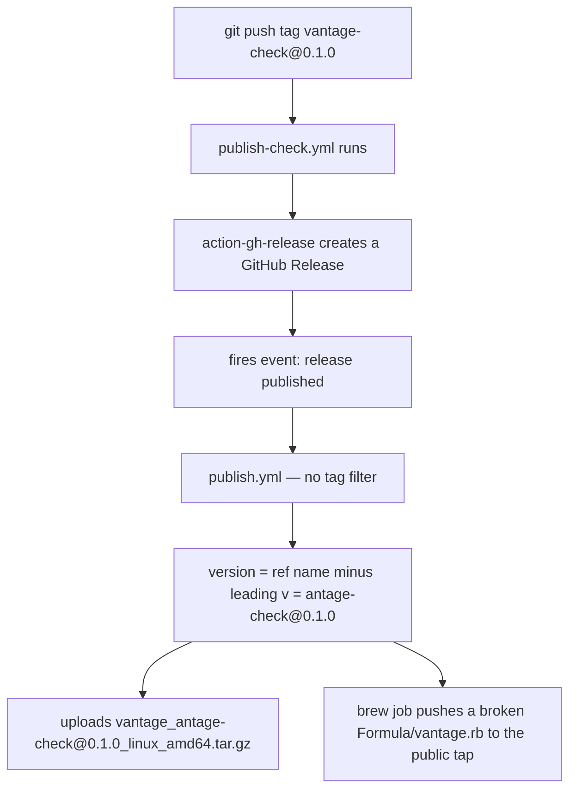

# Implementation review — the `vantage-check` CLI

**What this reviews.** The nine commits from `7cafe4b` to `554da8e` that
implement [`../design/agent-cli.md`](../design/agent-cli.md). Reviewed
2026-08-25 against the tree at `554da8e`. Every claim below was verified by
running the code, not by reading it — the commands are in
[Appendix B](#appendix-b--verification-log).

**Reads with:** the design doc above (the contract being implemented),
[`../../userguide/vantage-check.md`](../../userguide/vantage-check.md) (what
users are told the tool does), and
[`agent-cli-two-implementations.md`](agent-cli-two-implementations.md) — the
same design implemented independently by a second agent, compared head to
head.

---

## Verdict

The implementation is faithful and the hard parts are genuinely solved. Nine
commits map one-to-one onto the design's §9 build order, the delegate-failure
classification of **P2** is real code rather than a comment, and the trap the
design flagged as measured-not-theoretical (Mermaid's DOM dependency) was
rediscovered by dogfooding and fixed properly.

What it did **not** do is prove the *shipping* path. Everything is verified
against `bun src/main.ts` and vitest; the compiled binary, the PyPI wheel, and
the release workflow have never run end to end. All three high-severity
findings live there.

> [!IMPORTANT]
> Nothing here is blocking for local use — `vantage-check` works today when run
> from source or from a host build. The findings block the *distribution*
> promise (`uvx vantage-check`) that the review payload now makes to every
> agent on every review turn.

---

## 1. What shipped

| Phase (design §9) | Commits | Landed |
| :--- | :--- | :--- |
| 1. Style guide single-sourced in the package | `7cafe4b` | Yes |
| 2. CLI scaffold, compile pipeline, release wiring | `668d755` | Yes |
| 3. `check` with the five `link/*` rules | `a8eac6d`, `9a4dd21` | Yes |
| 4. Review-payload pointer | `598b388` | Yes |
| 5. Delegated validators + `.vantage.toml` | `25ca8f9`, `698dd95`, `e069f32` | Yes |
| 6. `userguide/` documentation | `554da8e` | Yes |

Roughly 2,500 lines of TypeScript and Python across
`packages/vantage-check/`, plus two additions to `vantage-md`
(`analyze.ts`, `parseFrontmatterStrict`), one line in the review payload, and a
new release workflow. 88 tests in the new package; `just check-ci` is green and
the tree is clean.

---

## 2. How it was built — the session record

Reconstructed from the Claude Code transcripts under
`.yolo/home/claude/projects/-workspace/` (the same directory as
`~/.claude/projects/-workspace/`).

### 2.1 Timeline

| When (local) | What |
| :--- | :--- |
| Aug 24, 13:50–14:26 | Design session: doc written with the `design-doc` skill, then **two rounds of review comments delivered through Vantage's own inbox** |
| Aug 24, 14:32 | Implementation session opens on `implement @docs/design/agent-cli.md` |
| Aug 24, 14:40 | Three `Explore` subagents fan out (vantage-md + workspace, style guide + review payload, build/CI/release) |
| Aug 24, 15:42 | Plan mode: two questions put to the user (scope, compile method) |
| Aug 24, 16:30 | A `Plan` subagent drafts the implementation plan (214 lines, `~/.claude/plans/hidden-sparking-ladybug.md`) |
| Aug 24, 20:12 | First commit (phase 1) — **1h40m of planning before any code** |
| Aug 24, 21:58 → Aug 25, 02:40 | Phases 2–6, nine commits |
| Aug 25, 02:47 | `just done` green, session ends |

Twelve hours of wall clock, 880 assistant turns, ~877k output tokens, and
**two context compactions** (at 21:52 and 01:03 local). One human prompt did
all of the steering.

### 2.2 The prompts, verbatim

These are the exact user inputs, reproduced for re-running the task with a
different agent. See [Appendix A](#appendix-a--reproduction-kit) for how to
replay them.

**Design session** (produced the design doc — skip if you only want the
implementation replayed):

```text
do we have a doc here somewhere about a vantage CLI that would help with
linting and things like that?
```

```text
related to how we can give a style guide to agents? nothing?
```

```text
So what I'm thinking about here, I know this is one feature, but I want to
think about this more thoroughly before we actually implement it. I want to
make some sort of CLI tool that we can put in with the agent um that is
writing these documents right now. Uh Vantage is set up in a way that there is
no communication other than the file system. Uh there's no direct talking, the
agent has no way to talk to vantage. You can leave notes in the file system.
Um otherwise it can't do anything, it's not even guaranteed that there's
anything vantage related in the agent's environment. So I want to design a
CLI. Could be the same one. I don't know, this is gonna be huge. We can just
have the same package installed that is going to have some features for the
agent. Um and the things I'm thinking of is for instance the style guide
reference, um as well as a linking tool seems useful. Um as thorough as we can
be with Lint and uh maybe it could be a tool that could aid with um it could
aid with the protocol of comment, although there's not a big issue there right
now. It works actually quite well. Um yeah, put together a design doc using
the skill for this.
```

Followed by two rounds of review comments pasted from Vantage's review inbox
(the design doc's own `## Decision Ledger` records what they settled).

**Implementation session** — the entire steering input was one prompt:

```text
implement @docs/design/agent-cli.md
```

Plus one mid-flight question, queued while the agent was in plan mode:

```text
what exactly are we crosscompiling? if it's go, why can't we just use the
normal built in stuff? anyways, I trust you, just curious
```

And two rulings given through `AskUserQuestion`:

| Question | Options offered | Ruling |
| :--- | :--- | :--- |
| How much of §9 should this pass cover? | Phases 1–4 *(recommended)* · **All six phases** · Spike: phases 1–2 | **All six phases** |
| How should the single-file binary be built? Node SEA cannot cross-compile; `bun build --compile` can, but bun is not installed | **bun cross-compile** *(recommended)* · Node SEA, per-platform | **bun cross-compile** |

The plan was then approved through `ExitPlanMode` with no edits.

> [!NOTE]
> The scope ruling overrode the agent's own recommendation (it suggested
> phases 1–4). Both compactions and most of the friction below sit in phases
> 5–6 — the part that the recommended scope would have deferred.

### 2.3 What it got stuck on

Eight hard tool failures in twelve hours; the substantive friction was
elsewhere. Reconstructed from the compaction summaries and error results:

| Trap | Cost | Resolution |
| :--- | :--- | :--- |
| `bun build --define` passed as one argv string, so version stamping silently did nothing (`--version` printed `0.0.0-dev`) | 3 failed spike rounds | `--define` and its expression as separate argv elements |
| `go test ./...` started descending into `packages/vantage-check/node_modules/flatted`, which ships Go source | Gate red | Narrowed the Go walk to `./cmd/... ./internal/... ./web/...` |
| `check-ci` is one bash script, so a `cd packages/vantage-check` broke the following `cd frontend` | Gate red | Wrapped both in subshells |
| Protocol-relative URLs (`//example.com/x`) fell through to the relative-path branch and were flagged as missing targets | 1 test failure | Restructured link classification into scheme → `//` → `/` → relative |
| `require('mermaid')` returns empty — the package is ESM-only, and the API hangs off `.default` | — | `await import("mermaid")` |
| remark-lint produced no messages: `.process()` throws without a compiler, and a preset is not a plugin | 3 rounds | `.use(preset)` + `.run(tree, file)` with an explicit `VFile` |
| katex/mermaid drifted between the two `node_modules` trees (0.18.4/11.17.1 vs 0.18.0/11.16.0) | — | Exact pins + a drift-guard test (`src/deps.test.ts`) |
| Cross-compiling to a non-host target needs a runtime download, blocked in the sandbox | Unresolvable locally | Deferred to CI — **and therefore never verified** (see [F3](#f3-the-uvx-channel-has-never-worked)) |
| `mermaid.parse` throws `DOMPurify.addHook is not a function` on every *labeled* flowchart, headless | Found late, by dogfooding | Headless `dompurify` shim (see [F2](#f2-the-shims-binary-side-wiring-is-untested)) |

The last one is the most interesting: the design's §5.2 predicted the DOM
problem and the agent built the classifier for it, but the *specific* trigger —
node **labels**, not diagrams in general — only surfaced when the built binary
was run against this repo's own `userguide/`, at hour eleven. The design's own
spike had tested `graph TD\n A-->B`, which has no labels and does not touch
DOMPurify.

---

## 3. Findings

Six defects plus nits. Severity is about the blast radius on the tool's
promise, not about how hard they are to fix — all six are small changes.

### High

#### F1. A `vantage-check@*` tag will push a broken formula to the public Homebrew tap

[`publish-check.yml:75`](../../.github/workflows/publish-check.yml#L75) uses
`softprops/action-gh-release`, which **creates a GitHub Release** for the tag.
[`publish.yml:8-9`](../../.github/workflows/publish.yml#L8-L9) triggers on
`release: [published]` with no tag filter:



The version mangling is real, not rhetorical: `${GITHUB_REF_NAME#v}`
([`publish.yml:57`](../../.github/workflows/publish.yml#L57),
[`:83`](../../.github/workflows/publish.yml#L83)) strips the leading `v` of
**v**antage-check. `publish-npm.yml` avoids all of this by never creating a
release; the new workflow broke that pattern.

**Fix:** guard `publish.yml` with `if: startsWith(github.ref_name, 'v')`, or
drop the third-party action for the repo's existing `gh release upload` idiom.

#### F2. The shim's binary-side wiring is untested

The headless `dompurify` stand-in
([`src/shims/dompurify.ts`](../../packages/vantage-check/src/shims/dompurify.ts#L21-L38))
reaches the compiled binary through one line of
[`tsconfig.json`](../../packages/vantage-check/tsconfig.json#L14-L17), and the
tests through a *separate* alias in
[`vitest.config.ts`](../../packages/vantage-check/vitest.config.ts#L14-L28).
Only the second is exercised.

Deleting the tsconfig entry and rebuilding:

```console
$ npm run test          # 88 passed — completely green
$ ./dist/vantage-check check good.md
⚠ unchecked — could not verify with this validator (environment failure; exit 2):
  - mermaid/parse
  mermaid/parse: unexpected mermaid.parse error: purify.addHook is not a function
```

That is exactly the regression `e069f32` was written to fix, and CI never
compiles the binary except on a release tag — so it would ship.

**Fix:** build the binary in `check-ci` (or at minimum in the release job
before upload) and run it against a labeled flowchart.

> [!TIP]
> The silver lining: the failure classification held. The tool refused to
> report green on a check it could not perform, which is **P2** working exactly
> as designed.

#### F3. The `uvx` channel has never worked

`uvx vantage-check <path>` is the command the review payload now hands every
agent ([`useReviewStore.ts`](../../frontend/src/stores/useReviewStore.ts), added
in `598b388`). Two defects stand between that string and a working install:

1. The PyPI job publishes the whole `dist/` directory
   ([`publish-check.yml:118`](../../.github/workflows/publish-check.yml#L118)),
   which holds the **92 MB compiled binary** next to the wheel — confirmed on
   disk after a local build. twine is handed a file that is not a distribution.
2. The Windows wheel bundles the binary as `vantage_check/vantage-check`
   ([`build_wheel.py:34`](../../packages/vantage-check/py/build_wheel.py#L34))
   while the console script execs `vantage-check.exe`
   ([`__main__.py:15`](../../packages/vantage-check/py/vantage_check/__main__.py#L15)).
   Windows can never resolve it.

Related and unverified: the archive step assumes bun wrote `dist/vantage-check`
for a Windows target
([`publish-check.yml:67`](../../.github/workflows/publish-check.yml#L67)); bun
appends `.exe`. This could not be tested here — the cross-target runtime
download is blocked in the sandbox, which is the same wall the build session
hit.

**Fix:** build wheels into their own directory; name the bundled binary per
platform; verify the Windows artifact name in CI before the first tag.

### Medium

#### F4. `link/missing-target` flags directory links, which Vantage supports

[`links.ts:239-250`](../../packages/vantage-check/src/rules/links.ts#L239-L250)
reports `"points at a directory, not a document"`. But
[`ViewerPage.tsx:421`](../../frontend/src/pages/ViewerPage.tsx#L421) routes any
non-`.md` path to `viewDirectory()`, which loads `/api/tree` and renders a
directory listing. So `[the design docs](../design/)` is a working link that
the checker calls an error — the false-positive class the design names as R2,
and [`../../userguide/vantage-check.md`](../../userguide/vantage-check.md)
codifies it in the rule table.

#### F5. `ALLOWED_SCHEMES` contradicts the sanitizer it mirrors

[`links.ts:27`](../../packages/vantage-check/src/rules/links.ts#L27) hand-writes
`http, https, mailto, data`. The pipeline's actual authority is
`defaultSchema.protocols.href` (kept by
[`sanitize.ts:11`](../../packages/vantage-md/src/sanitize.ts#L11)):
`http, https, irc, ircs, mailto, xmpp`. Run through the real renderer:

```html
<!-- [data](data:text/plain,hello)  → checker: OK,    pipeline strips the href -->
<li><a>data</a></li>
<!-- [xmpp](xmpp:a@b.c)            → checker: ERROR, pipeline renders it fine -->
<li><a href="xmpp:a@b.c">xmpp</a></li>
```

A false negative and a false positive from the one hand-written rule that
**P2** says should have been delegated — `sanitizeSchema` is already imported
by the package.

#### F6. Config discovery silently misses `.vantage.toml` for relative paths

[`check.ts:68-82`](../../packages/vantage-check/src/check.ts#L68-L82) hands the
un-resolved path to the resolver, and
[`findConfigFile`](../../packages/vantage-check/src/config.ts#L95-L106) walks
`path.dirname("a.md")` → `"."` → `path.dirname(".")` → `"."` and stops. From a
subdirectory, a repo-root config is silently ignored:

```console
$ cd repo/docs && vantage-check a.md      # invalid config, no error, exit 1
$ cd repo      && vantage-check docs/a.md # config error: strict must be a boolean, exit 2
```

The module's own header says *"We never silently fall back."* A `path.resolve()`
before discovery fixes it. The review payload tells agents to run from the repo
root, which is why the primary flow works.

### Nits

| # | Nit | Where |
| :--- | :--- | :--- |
| N1 | The `just cli` smoke test is vacuous: `$$(…)` in a non-shebang recipe expands to the PID plus literal text, so `test -n` is always true and `style-guide` never runs | [`Justfile:29`](../../Justfile#L29) |
| N2 | Unknown keys in `[check.severity]` are silently accepted — a typo'd rule name disables nothing and says nothing, while a bad *value* is fatal | `src/config.ts` |
| N3 | Overlapping targets double-report (`vantage-check . docs` → the same finding twice, "2 files") | `src/check.ts` |
| N4 | A non-Markdown file argument and an empty directory both print `✓ 0 files checked, no findings`, exit 0 | `src/check.ts` |
| N5 | `--strict` ORs with config `strict`, so a config `strict = true` cannot be overridden; the userguide claims flags win | `src/check.ts` |
| N6 | No regression test for the design's headline `link/*` trap (links inside inline code and fences) — behavior is correct, but untested; raw-HTML `<a href>` is not checked at all | `src/rules/links.test.ts` |
| N7 | Inverted-range detection was dropped (correctly — [`parseLineAnchor`](../../packages/vantage-md/src/scrollToLineAnchor.ts#L14-L25) normalizes with min/max, and there is a test asserting it), but §5.3 and the Decision Ledger still promise it | `../design/agent-cli.md` |
| N8 | The design doc's own `#L13-L97` anchor went stale when `7cafe4b` moved the style guide — it is the single finding the checker reports on this repo, so the tree fails its own checker | [`../design/agent-cli.md:68`](../design/agent-cli.md#L68) |
| N9 | R5 deserves its measurement on the record: 92 MB binary, 36 MB wheel, per platform, per release | — |

---

## 4. What holds up

- **The Mermaid work.** The spike script is kept as an artifact with its
  findings in the header, the identity-`sanitize` shim is the right call over
  jsdom, and the reasoning is sound: parse validates grammar and never emits
  HTML. Classification is narrow and explicit — grammar errors and
  `UnknownDiagramError` are document defects, everything else is an environment
  failure ([`validators/mermaid.ts:1-9`](../../packages/vantage-check/src/validators/mermaid.ts#L1-L9)).
- **The environment-failure contract is load-bearing, not decorative.** It was
  observed doing its job while [F2](#f2-the-shims-binary-side-wiring-is-untested)
  was being reproduced.
- **The drift guard** (`src/deps.test.ts`) pins katex and mermaid across two
  independent `node_modules` trees. Nobody asked for it; it is the difference
  between "the viewer's pipeline" and "a pipeline".
- **Honest documentation.** The userguide states the headless-Mermaid scope
  boundary instead of overselling it.
- **Commit hygiene.** Nine commits, one idea each, mapping onto the plan.

> [!CAUTION]
> One caution on the shim: it is a *global* module replacement in the bundle.
> An identity `sanitize` is correct for a parse-only CLI and a landmine the day
> this CLI emits HTML. Worth a comment at the call site, not just in the shim.

---

## 5. Suggested order

1. [F1](#f1-a-vantage-check-tag-will-push-a-broken-formula-to-the-public-homebrew-tap),
   [F2](#f2-the-shims-binary-side-wiring-is-untested),
   [F3](#f3-the-uvx-channel-has-never-worked) — nothing about the distribution
   promise is real until these land. F1 before any tag is pushed.
2. [F4](#f4-linkmissing-target-flags-directory-links-which-vantage-supports),
   [F5](#f5-allowed_schemes-contradicts-the-sanitizer-it-mirrors) — one commit
   each, plus the userguide row each one invalidates.
3. [F6](#f6-config-discovery-silently-misses-vantagetoml-for-relative-paths) —
   one line.
4. Nits, in whatever order. N1 and N8 are one-liners; N7 is a design-doc edit.

---

## Appendix A — reproduction kit

To run this task again with a different agent, from a checkout at `3e7d8e4`
(the commit before phase 1, where the design doc is accepted and nothing is
built):

```bash
git checkout -b cli-rerun 3e7d8e4
```

Then the single prompt:

```text
implement @docs/design/agent-cli.md
```

If the agent asks for scope or compile method, the rulings that produced this
implementation were **all six phases** and **bun cross-compile**. Note that the
agent recommended phases 1–4; leaving the choice open is itself a useful
comparison signal.

**For a clean comparison run,** stop there — everything else in this document is
hindsight the original run did not have.

**To skip the known traps** and see what an agent does with a head start,
append:

```text
Known traps from a previous run: bun's --define needs the flag and the
expression as separate argv elements; `go test ./...` descends into
node_modules/flatted; check-ci is one bash script so cd persists between
lines; mermaid is ESM-only and its API is on .default; mermaid.parse pushes
flowchart *labels* through DOMPurify and throws headless; remark-lint presets
go in .use(preset) with .run(tree, file). Verify the compiled binary and the
wheel, not just the source — CI never builds them outside a release tag.
```

**What a good run should produce** that this one did not: a binary-level test
in the gate, a wheel built into its own directory, and a release trigger that
cannot collide with `publish.yml`.

---

## Appendix B — verification log

Each finding was reproduced, not inferred. The load-bearing checks:

| Finding | How it was verified |
| :--- | :--- |
| Baseline | `just check-ci` → exit 0; `npm run test` → 88 passed; `bun run build` → 92 MB binary; binary run against `docs/` and `userguide/` |
| F2 | Removed the `dompurify` path from `tsconfig.json`, rebuilt, ran the binary on a labeled flowchart; re-ran the suite to confirm it stayed green; restored the file |
| F3 | Listed `dist/` after a local wheel build (binary and wheel in the same directory); read the Windows branch of both the workflow and `__main__.py` |
| F4 | Traced `ViewerPage.tsx:421` → `viewDirectory` → `/api/tree` |
| F5 | Rendered `data:` and `xmpp:` links through `renderMarkdown` and compared to the checker's verdict |
| F6 | Built a throwaway repo with a `.vantage.toml` and ran the checker from the root and from a subdirectory, with relative and absolute paths |
| N1 | `sh -c 'test -n "$$(./definitely-not-a-binary style-guide)" && echo …'` |
| F1 | Read the trigger blocks of both workflows; compared to `publish-npm.yml`, which does not create a release |

Nothing in the working tree was left modified; `git status` is clean.
