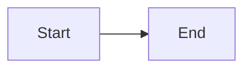

# Inline SVG fixture

Fixture for `inline_svg.spec.ts`, which measures how the stylesheet sizes an
`<svg>` a document writes inline, over the real app — and that it leaves alone
the SVG the page draws for itself, which comes first so that the drawings below
cannot move it.



$$\sqrt{x^2 + 1} = \overrightarrow{AB}$$

A root $$\sqrt{2}$$ and an arrow $$\overrightarrow{AB}$$ in a paragraph.

- A root $$\sqrt{3}$$ in a list item.

| Math in a cell |
| -------------- |
| $$\sqrt{5}$$   |

- A diagram in a list item:

  ```mermaid
  flowchart LR
      C[Listed] --> D[Item]
  ```

<div>
<svg xmlns="http://www.w3.org/2000/svg" width="2400" height="300" viewBox="0 0 2400 300" role="img" aria-label="Wide with viewBox"><rect width="2400" height="300" fill="#dbeafe"/><text x="20" y="160" font-size="96" fill="#1e3a8a">Wide</text></svg>
</div>

<div>
<svg xmlns="http://www.w3.org/2000/svg" width="1600" height="100" role="img" aria-label="Wide without viewBox"><rect width="1600" height="100" fill="#dcfce7"/><text x="10" y="90" font-size="16" fill="#14532d">Bottom line</text></svg>
</div>

Inline icon <svg width="16" height="16" viewBox="0 0 16 16" role="img" aria-label="Dot in a paragraph"><circle cx="8" cy="8" r="6" fill="currentColor"/></svg> in text.

- Inline icon <svg width="16" height="16" viewBox="0 0 16 16" role="img" aria-label="Dot in a list item"><circle cx="8" cy="8" r="6" fill="currentColor"/></svg> in a list item.

| Cell |
| ---- |
| Inline icon <svg width="16" height="16" viewBox="0 0 16 16" role="img" aria-label="Dot in a cell"><circle cx="8" cy="8" r="6" fill="currentColor"/></svg> in a cell. |

## Inline icon <svg width="16" height="16" viewBox="0 0 16 16" role="img" aria-label="Dot in a heading"><circle cx="8" cy="8" r="6" fill="currentColor"/></svg> in a heading

<details>
<summary>Inline icon <svg width="16" height="16" viewBox="0 0 16 16" role="img" aria-label="Dot in a summary"><circle cx="8" cy="8" r="6" fill="currentColor"/></svg> in a summary.</summary>

The details body.

</details>

<dl>
<dt>Inline icon <svg width="16" height="16" viewBox="0 0 16 16" role="img" aria-label="Dot in a term"><circle cx="8" cy="8" r="6" fill="currentColor"/></svg> in a term.</dt>
<dd>Inline icon <svg width="16" height="16" viewBox="0 0 16 16" role="img" aria-label="Dot in a definition"><circle cx="8" cy="8" r="6" fill="currentColor"/></svg> in a definition.</dd>
</dl>

<figure>
<figcaption>Inline icon <svg width="16" height="16" viewBox="0 0 16 16" role="img" aria-label="Dot in a figure caption"><circle cx="8" cy="8" r="6" fill="currentColor"/></svg> in a caption.</figcaption>
</figure>
