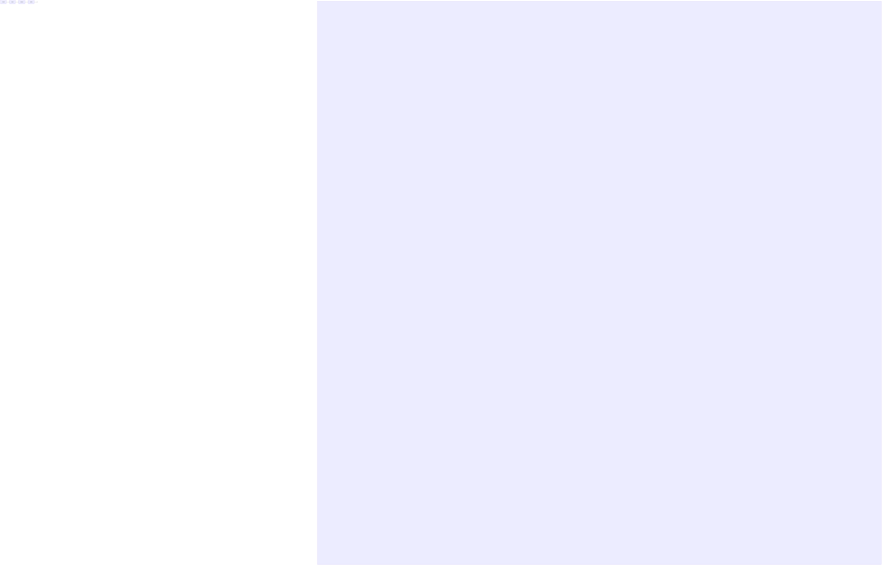

# Mermaid classes fixture

Fixture for the "keeps the classes a diagram's source names inside the diagram"
test in `mermaid.spec.ts`. Mermaid renders after the sanitizer, so the class
names this diagram's source gives its nodes reach the page, the app's own
utilities among them. None of it may reach past the diagram.

The end of the document.
