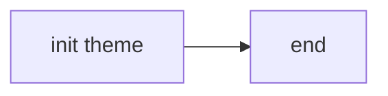
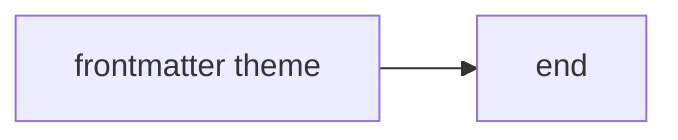
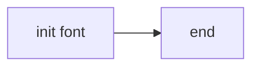
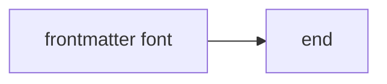

# Mermaid stylesheet fixture

Fixture for the "keeps a diagram's source from writing the page's stylesheet"
test in `mermaid.spec.ts`. Mermaid scopes every selector a diagram's CSS writes
to that diagram, but not the name of a `@keyframes` rule, so a diagram that
defines one of the app's animations redefines it for the whole page. Each
diagram below reaches Mermaid's stylesheet by a different route, and each one
also asks for an image from a host that does not exist.

The `themeCSS` of an `init` directive:

The `themeCSS` of a diagram's frontmatter:

The `fontFamily` of an `init` directive, which Mermaid writes into its
stylesheet as a declaration's value:

The `fontFamily` of a diagram's frontmatter:

The block the test flashes.
