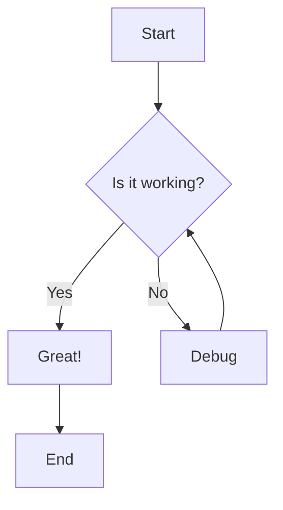
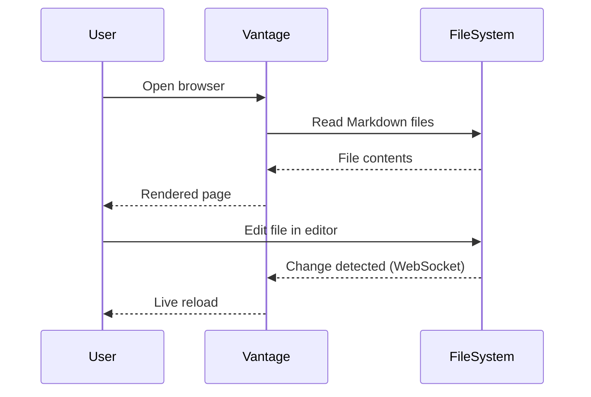

# Features

Vantage renders Markdown with the same fidelity as GitHub, plus extras like live reload and Git integration.

## GitHub Flavored Markdown

Vantage supports the full [GitHub Flavored Markdown](https://github.github.com/gfm/) specification:

- **Headings** with anchor links
- **Syntax highlighting** for fenced code blocks in 100+ languages
- **Tables** with alignment
- **Task lists** with checkboxes
- **Footnotes**
- **Strikethrough**, **bold**, _italic_
- Inline `code` and code blocks
- Blockquotes
- Ordered and unordered lists
- Horizontal rules
- Images and links
- HTML (sanitized)

### Math with KaTeX

Vantage renders LaTeX math using [KaTeX](https://katex.org/). Both inline and
block math use `$$...$$` delimiters.

Single dollars are deliberately *not* math delimiters, so shell variables and
amounts in prose — `$HOME`, `$100` — stay literal instead of turning into a
broken math span.

Inline math: `$$E = mc^2$$` renders as $$E = mc^2$$

Block math — put `$$` alone on its own lines:

```
$$
\int_0^\infty e^{-x^2} dx = \frac{\sqrt{\pi}}{2}
$$
```

$$
\int_0^\infty e^{-x^2} dx = \frac{\sqrt{\pi}}{2}
$$

### Frontmatter

YAML frontmatter at the top of a file is parsed and displayed as a clean metadata table above the content:

```yaml
---
title: My Document
author: Jane Smith
date: 2026-01-15
status: draft
---
```

One key is Vantage's own: `vantage:`. It holds chrome that belongs to the file
rather than to a section, and it never appears as a row in Vantage's own metadata
card. No other renderer acts on it — GitHub shows it as one row in the frontmatter
table it draws for `title:` and `status:`, and nothing more. Today it has one
key — `status-chip` — which shows the document's lifecycle status as a chip above
the card, **in addition to** the `status:` row it reads. The chip surfaces the
value, it does not move it, so the card stays a faithful view of the frontmatter:

```yaml
---
title: My Document
status: in-review # draft | in-review | accepted | deprecated
vantage:
  status-chip: true
---
```

`status-chip: true` shows the document's own `status:`, so the chip cannot
disagree with it. A literal `status-chip: accepted` works too, but it is a second
value that can drift; `vantage-check` reports the disagreement either way. The
vocabulary is `status`'s own — `draft`, `in-review`, `accepted`, `deprecated`,
lowercase — and anything else renders no chip at all.

## Mermaid Diagrams

Fenced code blocks with the `mermaid` language tag are rendered as diagrams. Vantage supports all Mermaid diagram types:

### Flowchart



### Sequence Diagram



### Other Diagram Types

Vantage supports flowcharts, sequence diagrams, class diagrams, state diagrams, ER diagrams, Gantt charts, pie charts, journey maps, Git graphs, quadrant charts, and more. See the [Mermaid documentation](https://mermaid.js.org/) for the full list.

Click the **maximize button** on any diagram to view it in a full-screen modal.

## Live Reload

When Vantage is running and you edit a Markdown file in your editor, the browser updates instantly — no manual refresh needed. This works through a WebSocket connection that watches the filesystem for changes.

This is especially useful when:

- **Reviewing LLM output** — watch AI-generated Markdown appear in real time
- **Editing docs** — see your formatting as you write
- **Collaborating** — changes from any source show up immediately

## Git Integration

If the directory you're serving is a Git repository, Vantage provides:

### Last Commit Info

Every file shows the most recent commit message, author, and relative timestamp (e.g., "about 2 hours ago"). Click the timestamp to view the diff.

### Commit History

Press **h** on any file to open the full commit history. Each commit shows the message, author, date, and short SHA. Click any commit to view its diff.

### Diff Viewer

The diff viewer shows changes in a unified format with:

- Added lines highlighted in green
- Removed lines highlighted in red
- Line numbers for both old and new versions
- Hunk headers showing the context

### Recent Files

The sidebar shows recently changed files (by Git commit date), so you can quickly jump to whatever was worked on most recently.

## Table of Contents

The list icon in the toolbar, beside the breadcrumb, shows a table of
contents for the open document in the margin to its left. Every heading is
listed and indented by level; clicking one jumps to it and updates the
address bar, so the link is ready to copy. The heading you are currently
reading stays highlighted, and the table of contents stays put as the
document scrolls under it.

**Open Questions are listed too**, indented under the heading they sit below,
each wearing the status emoji the document gave it — so a document that wants a
decision from you says so before you read a word of it. A tally beside
**Contents** counts them by state: `💬 3` is three awaiting a ruling, and
`💬 1 ✅ 2` is one outstanding and two already answered. Clicking a question
scrolls to the question itself, and the link it copies is the question's own
`#OQ-…` anchor, which is what a reference from another document uses.

Only questions carrying an [`oq` directive](reference/style-guide.md) appear,
which by convention means exactly the ones that can be answered in one click —
the same set the **Review** toggle counts in its tooltip. A question the author
marked blocked or answered and left untagged is not an action, so it is not
listed.

The choice is remembered: turn it on once and it stays on as you move
between documents and across restarts. It appears only for a rendered Markdown
document — not for raw view, a directory listing or a binary file — and only on
a screen wide enough to have a margin to put it in.

## Full Width

The expand icon beside it drops the fixed reading column and lets the document
use the whole window, which is what you want for a wide table or a large
diagram. It is remembered the same way.

## Starred

The star beside the document name bookmarks whatever is open — a document or a
folder — and fills in amber once it is. Bookmarks collect in a **Starred**
section at the top of the sidebar, above the file tree; the section is not there
at all until something is starred.

Bookmarks belong to the project, not to the browser. They are stored under
`~/.config/vantage/starred/`, so they come back when you restart Vantage — on
any port, in any browser — and every open tab updates the moment one is added or
removed anywhere else.

Which list you get depends on how Vantage was started. `vantage serve` keys on
the directory it is serving, so each project has its own and launching somewhere
else gives you that project's. A [daemon](guides/daemon-mode.md) keys on its
config file instead, which does not depend on the working directory a service
manager happens to hand it, so one list covers every repository it serves and
each bookmark remembers which one it came from.

Nothing checks that a bookmark still points at something. A starred document
that has been deleted or renamed keeps its place in the list and only says so
when you open it: the page reports that it could not be loaded and offers to
remove the bookmark. That way a file that is briefly missing — mid-rebase, say —
does not quietly disappear from your list.

## File Tree Navigation

The sidebar displays a file tree with:

- **Lazy loading** — directories expand on click, fetching contents on demand
- **Show all folders** toggle — switch between showing only directories with Markdown files and showing everything
- **Directory viewer** — clicking a directory shows its contents in a table with commit messages and timestamps, similar to GitHub's repository view

## File Picker

Press **t** to open the fuzzy file picker. Type to search across all files in the project. Use arrow keys to navigate and Enter to select.

### Global Search

Press **Shift+T** from anywhere to search files across all projects at once. On the project picker page, **t** also opens the global file search.

Press **r** to search recent files in the current project, or **Shift+R** to search recent files across all projects.

Press **Shift+P** to open the project picker and quickly switch between repos.

Press **?** to see all keyboard shortcuts, including sidebar toggle (**b**), vim-style scrolling (**j**/**k**), and quick navigation (**g h** for home, **g r** for recent files).

## Multi-Repo Mode

When running in daemon mode with multiple directories, Vantage shows a full-page project list where you can select a repo. Projects can be sorted alphabetically or by recent activity (with relative timestamps like "2 hours ago"). Switch between directories without restarting the server. See [Daemon Mode](guides/daemon-mode.md) for details.

### Source Directory Auto-Discovery

Instead of manually listing every repository, you can point Vantage at parent directories. Any subdirectory containing a `.git` folder is automatically added as a project:

```toml
source_dirs = ["~/code", "~/projects"]
```

Manually listed `[[repos]]` take precedence — duplicates are skipped. See [Configuration](reference/configuration.md#source-directory-auto-discovery) for details.

## Review Mode

Vantage includes a built-in review mode for annotating documents:

- **Inline comments** — attach a comment to any block of rendered Markdown: hover it and click, or drag-select a phrase inside it. Tables are commentable cell by cell — point at a cell for that cell, or beside the table for the table as a whole
- **Copy for the agent** — copy pending comments to the clipboard as a prompt that tells the agent exactly how to respond
- **Agent responses** — after editing the document, the agent delivers a per-comment summary by appending a JSON line to `.vantage/inbox/` in the repo; Vantage consumes it and shows the response inline next to the comment
- **Paste box** — for chat agents that cannot write files, paste their `- [<id>] <summary>` bullet reply into the Review panel instead

Reviews are stored on disk and persist across server restarts.

Agent responses arrive through a small `.vantage/inbox/` directory at the repo
root — see [Review Inbox](guides/review-inbox.md), which also covers gitignoring it.

The copied prompt also tells the agent to run
[`vantage-check`](guides/vantage-check.md) over the document before delivering, so
broken links and unparseable diagrams are caught before they reach you.

## Writing for Vantage

Two things help an agent — or a person — write documents that render the way
they meant:

- **The style guide.** Settings (⚙) → **Agent Style Guide** shows the
  conventions Vantage's renderer expects, with a copy button for pasting into an
  agent's context. The same text comes out of `vantage-check style-guide`. See
  [Style Guide for Agents](reference/style-guide.md).
- **The checker.** `vantage-check <path>` verifies a document against the
  repository on disk: relative links that resolve, `#L42` anchors that are
  inside their file, `#section` anchors that match a real heading, frontmatter
  that parses, and diagrams and formulas that Mermaid and KaTeX accept. It is a
  standalone binary that needs nothing installed and no server running. See
  [vantage-check](guides/vantage-check.md).

## Dark Mode

Press **Shift+D** to toggle between light and dark themes. The setting is persisted across sessions.

## Performance Diagnostics

Vantage includes built-in performance instrumentation. Run `vantage perf-report` against a running instance to see anonymized timing data for all API endpoints. See the [CLI Reference](reference/cli-reference.md#vantage-perf-report) for details.
